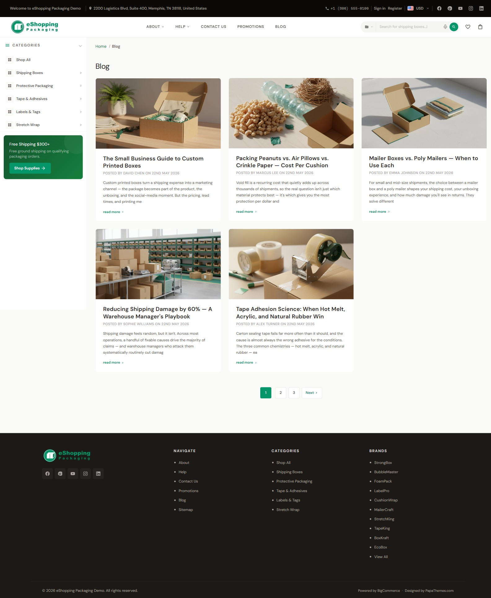

# Blog

eShopping renders BigCommerce's built-in blog system. There are two pages:

- **Blog index** — `/blog` — a responsive card grid of recent posts that fits as many columns as the available width allows (multiple columns on a wide desktop, a single column on narrow screens)
- **Blog post** — `/blog/<slug>` — single article, ending with a **More from the Blog** related-posts grid

{ loading=lazy }

## Create posts

**Storefront → Blog → Create post**. Each post supports:

- **Title**
- **Body** (rich-text editor)
- **Featured image** (recommended 900 × 600 px) — used as the card image + the hero image on the article page. **Theme Editor → Global → Blog → Size of images** controls the dimensions BigCommerce uses when resizing and serving these images. The default is **Optimized for theme** (190 × 250 px); choose **Specify dimensions** if you want the full 900 × 600 px served (note: larger images add to page weight)
- **Tags** — shown as clickable pills on each article page (not on the blog index grid); clicking a tag opens that tag's post listing (BigCommerce's `/blog/tag/<name>` page)
- **Author**, **Publish date** — shown in the byline. The author only appears when one is set on the post; the publish date always shows

## Home-page blog section

The home page shows the **3 most recent posts** between the Brands carousel and the Newsletter. This count is fixed in the theme and is **not adjustable from the Theme Editor**.

The section appears automatically once your store has published posts, and hides itself when there are none — so there's nothing to switch on. Just publish posts under **Storefront → Blog** and they'll surface here.

## Blog colors

The blog inherits the regular theme palette. The post-body uses the standard typography settings ([Colors & fonts](colors-and-fonts.md)).

## Hiding the blog header heading

**Theme Editor → Global → Pages → Hide blog page heading** ✅ — useful if you'd rather lead with the post grid.

## Blog widget regions

The blog index has no widget regions. The single-post page also has no widget regions in its body, but the **header / sidebar / footer** widget regions are still active.

Each blog post page ends with a **More from the Blog** related-posts grid — a card grid of your other recent posts (the post you're reading is excluded). It's populated automatically from the store's recent posts, so there's nothing to configure.

If you want a CTA at the end of every post (e.g. "Sign up for our newsletter"), insert it as the last paragraph of every post — or use a **Script Manager** snippet that appends a CTA via JavaScript.

---

## Content ideas

!!! tip "These are suggestions, not part of the demo setup"
    All four demo stores show the same blog section (the 3 most recent posts on the home page). There's no per-variant blog configuration. The themes below are just generic editorial ideas you can adapt to your own catalog — none of them ship as pre-written demo content.

- **Industrial / safety supplies** — buyer's guides and how-to tips (selecting the right equipment, compliance basics).
- **Auto parts** — maintenance walkthroughs and fitment/how-to guides.
- **Electronics** — product reviews, comparisons, and release news.
- **Packaging** — sustainability articles, size guides, and case studies.

---

## Next

- [Static pages (About / Privacy / Returns)](static-pages.md)
- [Widget regions reference](widget-regions.md)
