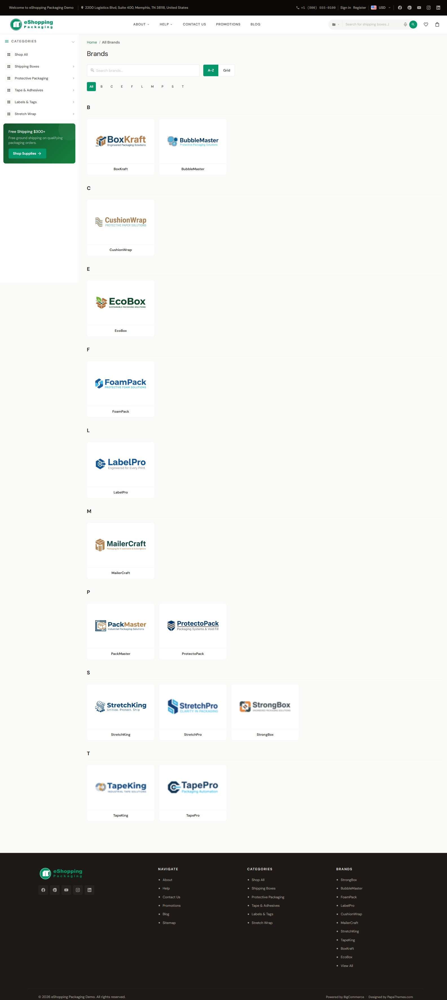

# Brand Pages

Brand pages are essentially a category page filtered to one brand. They have the same layout (sidebar + grid), with the brand name and (if uploaded) the brand logo shown in the header.

## The single-brand page

URL: `/brands/<brand-slug>`. Edit in **Catalog → Brands → (brand)**:

| Field | Effect |
| ----- | ------ |
| Name | H1 + breadcrumb |
| Brand image | Logo shown in the brand page header and the homepage brands carousel. The footer Brands column lists brand names as text links only — it does not display logos. |
| Page title | `<title>` tag |
| Meta description | `<meta description>` |

The brand header shows the brand name (H1) and, if the brand has an **Image** uploaded, that logo above the product grid. To add extra content (e.g. a promotional banner) above the listing, use the widget region directly below the header.

<!--te-src:PiAqKkN1c3RvbWl6ZToqKiBCaWdDb21tZXJjZSBhZG1pbiDihpIgKipDYXRhbG9nIOKGkiBCcmFuZHMg4oaSIChicmFuZCkqKiDigJQgTmFtZSwgQnJhbmQgaW1hZ2UsIFBhZ2UgdGl0bGUsIE1ldGEgZGVzY3JpcHRpb24u-->
<!--te-mock-->

BigCommerce admin

Home

Orders

Products⌃

All products

Add

Categories

Options

Filtering

Reviews

Brands

Import

Export

Customers⌄

Storefront⌄

Marketing⌄

Analytics

Settings⌄

**Theme Editor → Products → Number of products displayed → Brand page** — default `12`.

<!--te-src:PiAqKkN1c3RvbWl6ZToqKiBUaGVtZSBFZGl0b3Ig4oaSICpQcm9kdWN0cyDihpIgTnVtYmVyIG9mIHByb2R1Y3RzIGRpc3BsYXllZCog4oaSICoqQnJhbmQgcGFnZSoqIChpZCBgYnJhbmRwYWdlX3Byb2R1Y3RzX3Blcl9wYWdlYCkuIEZvcm1hdDogc2VsZWN0IChgNmAsIGA4YCwgYDlgLCBgMTJgLCBgMTVgLCBgMTZgLCBgMThgLCBgMjBgKS4gRGVmYXVsdDogYDEyYC4=-->
<!--te-mock-->

Products✕

Number of products disp…

Brand page12▾

If a brand has no products assigned, the page shows the message *"There are no products listed under this brand."*

## All brands index (A–Z list)

URL: `/brands`. Set the default layout in **Theme Editor → Products → Brands page default layout**:

| Layout | Description |
| ------ | ----------- |
| A-Z (alphabetical groups) *(default)* | A letter-filter bar (an **All** button plus A–Z buttons) above a flat grid of brand logos; clicking a letter scrolls the page to the brand group for that letter |
| Grid (flat grid) | A flat grid of brand logos with no letter filtering |

<!--te-src:PiAqKkN1c3RvbWl6ZToqKiBUaGVtZSBFZGl0b3Ig4oaSICpQcm9kdWN0cyDihpIgTnVtYmVyIG9mIHByb2R1Y3RzIGRpc3BsYXllZCog4oaSICoqQnJhbmRzIHBhZ2UgZGVmYXVsdCBsYXlvdXQqKiAoaWQgYGVzaG9wcGluZy1icmFuZHMtZGVmYXVsdC1sYXlvdXRgKS4gRm9ybWF0OiBzZWxlY3QgKGBhemAgPSBBLVogKGFscGhhYmV0aWNhbCBncm91cHMpLCBgZ3JpZGAgPSBHcmlkIChmbGF0IGdyaWQpKS4gRGVmYXVsdDogYGF6YC4=-->
<!--te-mock-->

Products✕

Number of products disp…

Brands page default layoutselect▾

Regardless of the default layout, the all-brands page also gives shoppers:

- A **live search box** to filter brands by name as they type. When the search matches no brands, the page shows the message *"No brands found matching your search."*
- An **A-Z / Grid view toggle** they can switch at any time at runtime (independent of the default-layout admin setting above).

Brands without an uploaded image display a letter-avatar placeholder instead of a logo.

{ loading=lazy }

## Brand strip in footer

See [Footer](footer.md#brand-strip).

## Brands carousel on home page

See [Home overview](home-overview.md). Configure count: **Theme Editor → eShopping Theme → Homepage Brands Limit**.

<!--te-src:PiAqKkN1c3RvbWl6ZToqKiBUaGVtZSBFZGl0b3Ig4oaSICplU2hvcHBpbmcgVGhlbWUg4oaSIEhvbWVwYWdlIFNlY3Rpb25zKiDihpIgKipIb21lcGFnZSBCcmFuZHMgTGltaXQqKiAoaWQgYGVzaG9wcGluZy1ob21lcGFnZS1icmFuZHMtbGltaXRgKS4gRm9ybWF0OiBudW1iZXIuIERlZmF1bHQ6IGAxMmAu-->
<!--te-mock-->

eShopping Theme✕

Homepage Sections

Homepage Brands Limit12▾

## Recommended setup

- Upload transparent PNG brand logos at a consistent aspect ratio so they line up neatly in the grid and carousel. The theme ships set to render brand images at a custom **300 × 200** reference size (the value under **Theme Editor → Products → Brand image in gallery view**); its built-in **Optimized for theme** preset is 190 × 250. To change the size brands actually render at, adjust that **Brand image in gallery view** setting.

<!--te-src:ICAgID4gKipDdXN0b21pemU6KiogVGhlbWUgRWRpdG9yIOKGkiAqUHJvZHVjdHMg4oaSIEltYWdlIHNpemVzKiDihpIgKipCcmFuZCBpbWFnZSBpbiBnYWxsZXJ5IHZpZXcqKiAoaWQgYGJyYW5kX3NpemVgKS4gRm9ybWF0OiBzZWxlY3QgKGAxOTB4MjUwYCA9IE9wdGltaXplZCBmb3IgdGhlbWUsIGBjdXN0b21gID0gU3BlY2lmeSBkaW1lbnNpb25zKS4gRGVmYXVsdDogYDMwMHgyMDBgLg==-->
<!--te-mock-->

Products✕

Image sizes

Brand image in gallery view300x200▾

- Fill in **Page title** and **Meta description** for SEO.

---

## Next

- [Bulk order](bulk-order.md)
- [Cart page](cart.md)
- [Search](search.md)
