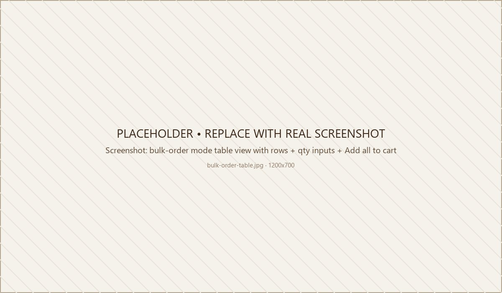

# Bulk Order Mode

Bulk Order Mode replaces the grid on the category, brand, or search-results page with a **table view**:

```
┌────────────────────────────────────────────────────────────────────────────────┐
│  Image   Product              In Cart  Quantity   Price    Subtotal   Action    │
├────────────────────────────────────────────────────────────────────────────────┤
│  [img]   Cotton dust mask        0     [- 0 +]   $4.99      $0.00    [Add to Cart]│
│          Acme · CDM-100                                                          │
│  [img]   Safety glasses          0     [- 0 +]   $7.99      $0.00    [Add to Cart]│
│          Acme · SG-200                                                           │
│  [img]   Nitrile gloves          0     [- 0 +]   $12.00     $0.00  [Choose Options]│
│          Acme · NG-L                                                             │
│  …                                                                               │
├────────────────────────────────────────────────────────────────────────────────┤
│  Total:  0 items / $0.00                                  [ Add all to cart ]    │
└────────────────────────────────────────────────────────────────────────────────┘
```

The **Product** column shows the name, brand, and SKU stacked together — there's no separate SKU column. Stock status shows as an inline badge rather than its own column.

It's ideal for users who already know the products they want, with no need to click into every product page.

{ loading=lazy }

## Turn it on

**Theme Editor → eShopping Theme → Bulk Order → Show bulk order mode** ✅.

(Bulk Order is a section inside the eShopping Theme panel.)

A **grid / list view toggle** (two icon buttons) now appears in the toolbar above the category, brand, and search-results product grids. Click the **list** icon to switch to bulk-order (table) view; click the **grid** icon to switch back at any time.

!!! tip "Force bulk order sitewide (no toggle)"
    To show **all** category, brand, and search-results pages in bulk-order view by default — without a per-page toggle — go to **Theme Editor → Global → Products → Display style** and choose **Show products in bulk order**. This forces bulk-order mode across the storefront regardless of each shopper's saved toggle preference.

## Per-category force-bulk via custom layout

If you want bulk-order on **a single category page** (without the global toggle):

1. The theme ships with the custom page templates `templates/pages/custom/category/bulk-order.html` and `templates/pages/custom/brand/bulk-order.html`.
2. Page Builder → switch to the category → **Page settings → Layout** → pick **Bulk Order**.
3. That single category page always renders as a bulk-order table.

Same trick for an individual brand page.

## Layout details

- Quantity inputs default to `0`. Users type a number or click the +/- buttons.
- For products that can't currently be purchased, the quantity input and +/- buttons are disabled.
- Each row's availability reflects the product's BigCommerce inventory at page load: **In Stock**, the store's own out-of-stock message, or a **Pre-Order** badge for pre-order products. These badges do not poll for live changes.
- The live-updating column is **In Cart**, which reflects the current quantity of that product in the shopper's cart.
- Out-of-stock rows show the store's out-of-stock message and a disabled quantity input.
- Each row has its own per-product action button:
    - **Add to Cart** for a simple product.
    - **Choose Options** for a product with variants (opens the option picker).
    - A **Pre-Order** button/link for pre-order products.
    - A link button showing the store's out-of-stock label for out-of-stock products (navigates to the product page).
- A per-row **Subtotal** column and a running **Total:** at the bottom both update as users type.
- **Add all to cart** adds each row that has a quantity to the cart one at a time, showing a progress dialog ("Adding your products to cart") as it goes. When it finishes you can **View Cart** or **Continue Shopping**. Up to **50 products** can be added in a single Add-all action.

## Good fit

Bulk Order Mode works on any catalog — the theme does not restrict it by industry. It's especially handy for stores where shoppers order many SKUs at once (for example B2B / wholesale, industrial / MRO, or packaging catalogs), and you can turn it off for catalogs where browsing the grid by image matters more.

---

## Next

- [Category page](category.md)
- [Cart page](cart.md)
