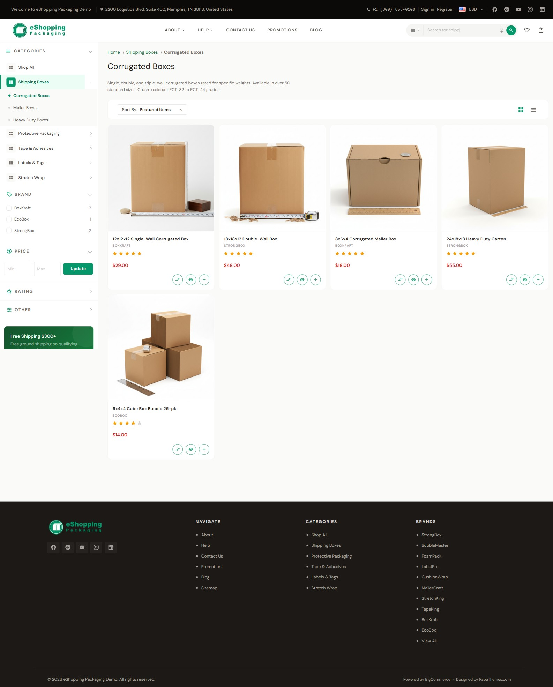
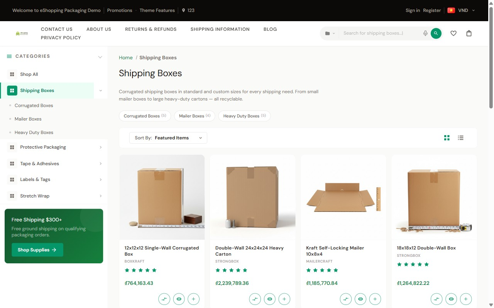

# Category Page

The category page is what shoppers land on when they click a category in the nav. eShopping's category page has 3 zones:

1. **Header** — name, description, optional banner
2. **Sidebar** — categories tree + filters (see [Sidebar](sidebar.md))
3. **Product grid** — the products with the sort + toolbar above

{ loading=lazy }

{ loading=lazy }

---

## Header

Edit the category title, description, and banner in **Catalog → Categories → (edit a category)**:

| Field | Effect |
| ----- | ------ |
| Name | The H1 |
| Page description | Rich-text block shown under the H1 — use it for SEO |
| Header image | Wide banner shown above the description (wide landscape crop; BigCommerce scales it to the container width) |

To hide the page heading globally:

**Theme Editor → Global → Pages → Hide category page heading** ✅.

---

## Number of products per page

**Theme Editor → Products → Number of products displayed → Category page** — default `12`. Set whatever value suits your catalog.

---

## Sort & toolbar

Above the grid is a toolbar with:

| Control | Options |
| ------- | ------- |
| **Sort by** | Featured Items · Newest Items · Best Selling · A to Z · Z to A · By Review · Price: Ascending · Price: Descending |
| **Grid / Bulk-order toggle** | Switches the listing between the standard product grid and the bulk-order table |

!!! note
    **Relevance** is added to the **Sort by** list only on search / result pages — it does not appear on a standard category page.

The **Grid / Bulk-order toggle** (two icon buttons) appears only when bulk-order mode is enabled. It is *not* a generic grid/list view switch — the second option is the B2B bulk-order table, not a "list" layout. See [Bulk-order mode](#bulk-order-mode-b2b) below.

To set the default listing layout, go to **Theme Editor → Global → Products → Display style** and choose **Show products in a grid** or **Show products in bulk order**.

---

## Faceted filters (Price, Brand, Rating, Custom)

Powered by BigCommerce — enable in **Settings → Product Filtering**, then per-attribute toggles in **Catalog → Product Filtering**.

The sidebar renders each enabled filter as a **collapsible group**:

| Filter type | Render |
| ----------- | ------ |
| **Price** | Range form (min / max) |
| **Brand, Rating, and any product attribute** (Color, Size, custom fields…) | Checkbox list |

Picking a value updates the grid via AJAX and adds a removable chip at the top of the products.

---

## Filter chips (active filters)

When the user picks a filter, eShopping renders an **active-filter chip** at the top of the grid. Clicking the × on a chip removes that filter. This is automatic — no setup needed.

---

## Mobile filter drawer

Below 1024 px the sidebar collapses into a bottom-sheet that opens with a **Filter** button at the top. Categories, filters, and promo cards are all preserved.

The **Filter** button only appears when the category actually has faceted filters enabled (or when shop-by-price is on). If a category has no enabled filters and shop-by-price is off, there is no filter drawer to open, so no Filter button is shown — on any screen size.

---

## Sub-category chips

Whenever a category has sub-categories, eShopping shows them as a scrollable row of **chips** at the top of the grid (e.g. "Indoor", "Outdoor", "Heavy duty"), each linking to the sub-category. Clicking a chip drills into that sub-category.

This is independent of faceted filters — sub-category chips and sidebar filters can appear at the same time. The chips show whenever sub-categories exist; the sidebar filters show whenever filters are enabled. Neither one disables the other.

---

## Category page widgets

Each category page exposes these widget regions you can drop content into:

| Region | Renders | Use it for |
| ------ | ------- | ---------- |
| `category_below_header` | Below the page heading (H1), above the description and grid | Featured-category banner |
| `category_below_content` | Below the grid | FAQs, SEO copy, related categories |

!!! note
    The `category_below_header` region is only rendered when **Hide category page heading** is off (see [Header](#header)).

Page Builder → Category page → drop in an **AI HTML Generator | PapaThemes** widget, or use the **Banner** or **Accordion** widgets from the PapaThemes Widgets app (check the app for the exact widget names available in your store).

---

## Bulk-order mode (B2B)

eShopping can switch the category page into **bulk-order mode** — a table view with quantity inputs on every row and a single "Add to cart" at the bottom. See [Bulk Order](bulk-order.md).

Toggle: **Theme Editor → eShopping Theme → Bulk Order → Show bulk order mode** ✅.

---

## Hiding the breadcrumbs

**Theme Editor → Global → Pages → Hide breadcrumbs** ✅.

---

## Defaults

None of the four demo stores override the category-page settings, so they all inherit the theme defaults:

| Setting | Value |
| ------- | ----- |
| Products per page | 12 |
| Display style | Show products in a grid |
| Bulk-order mode | Available (toggle on) |

Change any of them per store in the Theme Editor as described in the sections above.

---

## Next

- [Brand pages](brand.md)
- [Bulk order](bulk-order.md)
- [Search & keyword suggestions](search.md)
