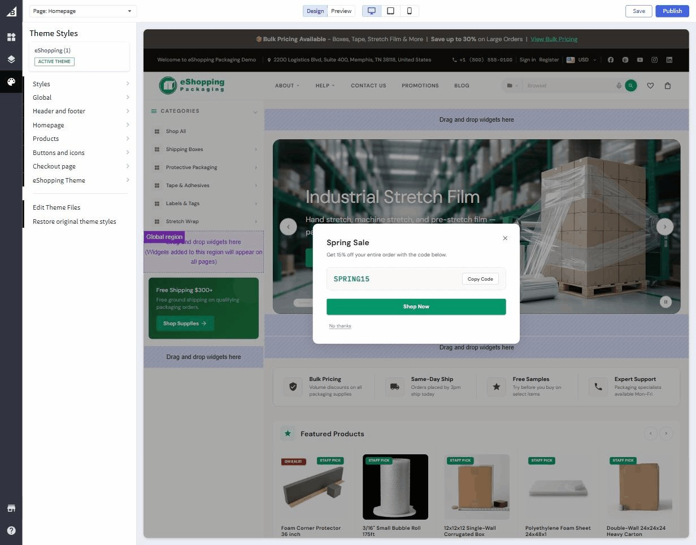

# Step 2 — Choose Your Variant

eShopping ships with **4 built-in variations**, each tuned for a different industry. You pick one in the Theme Editor — and that single click swaps the entire palette, typography, trust-strip copy, newsletter text, footer colors, and most other "look & feel" defaults to match the demo. (The footer's brand description/tagline is **not** part of a variation — it's set by an HTML widget during demo-data import.)

The 4 variations are:

| Variation ID | Name | Demo URL | Industry |
| ------------ | ---- | -------- | -------- |
| `industrial` | Industrial | <https://eshopping-industrial-demo.mybigcommerce.com> | Tools, welding, safety gear, compressors |
| `autoparts` | AutoParts | <https://eshopping-autoparts-demo.mybigcommerce.com> | Automotive parts & accessories |
| `packaging` | Packaging | <https://eshopping-packaging-demo.mybigcommerce.com> | Boxes, bubble wrap, tape, mailer bags |
| `electronics` | Electronics | <https://eshopping-electronics-demo.mybigcommerce.com> | Laptops, monitors, headphones, cables |

## How to pick a variation

1. **Storefront → My Themes** → eShopping card → **Customize**.
2. In Page Builder click **Theme styles** (top-left dropdown).
3. The list shows **Industrial**, **AutoParts**, **Packaging**, **Electronics** plus a thumbnail preview of each.

   { loading=lazy }

4. Click the variation you want.
5. Click **Save** (top-right) to publish.

The storefront updates immediately. No products / categories / customers / settings outside the theme are affected.

## What each variation actually changes

When you pick a variation, its preset settings are applied on top of the theme defaults. Concretely:

| Setting family | Industrial | AutoParts | Electronics | Packaging |
| -------------- | ---------- | --------- | ----------- | --------- |
| **Body font** | Source Sans 3 (default) | Inter | Inter | DM Sans |
| **Headings font** | Playfair Display (default) | Inter | Space Grotesk | DM Sans |
| **Terra (primary)** | `#bf5b33` (terra orange) | `#d97706` (amber) | `#3b82f6` (electric blue) | `#059669` (emerald) |
| **Bark scale** | warm browns (default) | cool slate | zinc | warm stone |
| **Cream** | `#faf8f4` (default) | `#f8fafc` | `#fafafa` | `#fafaf9` |
| **Sale-badge bg** | `#bf5b33` | `#dc2626` | `#dc2626` | `#dc2626` |
| **Trust-strip text** | (default) | "OEM Quality Parts \| …" | "Authorized Dealer \| …" | "Bulk Pricing \| …" |
| **Newsletter text** | (default) | Parts Updates & Deals | Stay Ahead in Tech | Subscribe for Packaging Deals |
| **Promo text** | (default) | Free Shipping $250+ | Free Shipping $99+ | Free Shipping $300+ |
| **Cart goal (first tier)** | (default) | $50 | $30 | $75 |

The **Cart goal (first tier)** value is the cart-subtotal dollar amount a shopper must reach to unlock the first reward on the cart progress bar (free shipping). Each variation also defines higher tiers (e.g. a discount, then a free gift) at larger dollar amounts.

You can override any of these in Theme Editor → eShopping after picking the variation — the variation is the starting point, not a lock.

## Which variant should I pick?

Open all four demos in browser tabs, scroll through the home / category / product page in each, and pick the one **closest to the look you want**.

| Pick this | If you sell… |
| --------- | ------------ |
| **Industrial** | MRO supplies, safety gear, tools, welding, machinery — anything where a "crafted, premium" warm-toned look fits |
| **AutoParts** | Automotive aftermarket, fitment-driven catalogs, motorsport — anything where a cool/technical look + amber accent fits |
| **Electronics** | Consumer electronics, computers, gaming, gadgets — anything where a sleek modern tech look fits |
| **Packaging** | Packaging, shipping supplies, eco / sustainable materials, B2B-leaning catalogs |

Not sure? Pick the closest structurally — every variation is fully customizable from there.

## Optional — make a backup copy per variation

To A/B-test two variations side-by-side:

1. **My Themes → eShopping → ⋯ → Make a copy**.
2. Apply variation A to the original, variation B to the copy.
3. Preview both via the **Preview** button in Page Builder.
4. Activate the winner.

---

## Next

➡️ [Step 3 — Import demo products + widgets](import-demo-data.md)
