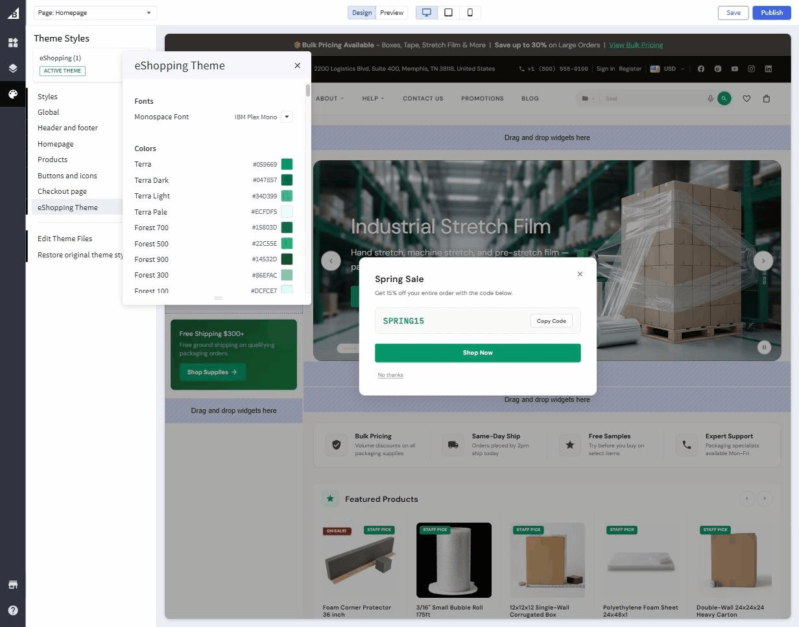

# Colors & Fonts

This page covers every color and typography control in eShopping. Open Page Builder, open the single **eShopping Theme** panel, and scroll to the relevant heading (Colors, Fonts, Banner, …) as you follow along.

!!! tip "Pick a variation first"
    The four variations (Industrial / AutoParts / Electronics / Packaging) ship with completely different color palettes and fonts. Pick one first ([Step 2](choose-variant.md)) — then use this page to fine-tune.

## The color system

eShopping uses three colour families plus accents. Each family has multiple shades so the design stays consistent across buttons, badges, hovers, borders, etc.

| Family | What it's for | **Default** (Industrial) |
| ------ | ------------- | ------------------------ |
| **Terra** | Primary accent — buy buttons, links, on-sale prices, hero-text highlights | `#bf5b33` |
| **Forest** | Secondary accent — "New" / "Bestselling" / "Popular" badge text, section links, in-page accents across category, product, cart, and blog pages | `#2d5a42` (700) |
| **Bark** | Neutrals — text, borders, dividers, surfaces. 11 shades from Bark 50 (almost white) to Bark 950 (almost black) | `#0f0d0a` (950) |
| **Cream** | The warm off-white page background | `#faf8f4` |
| **White** | Cards, popovers | `#ffffff` |
| **Badge Sale** | Sale-percentage badge | `#bf5b33` / `#ffffff` |
| **Badge Staff** | "Staff pick" pill | `#3f8060` / `#ffffff` |
| **Rating star** | Review stars | `#f59e0b` / `#d5cec2` |
| **Price** | On-sale price + struck-through original | `#dc2626` / `#978a74` |

Find them under the **Colors** heading in the **eShopping Theme** panel of the Theme Editor:

{ loading=lazy }

Click any swatch to open the colour-picker.

!!! note "The full set of swatches"
    Each family is more than one swatch. **Terra** has Dark / Light / Pale variants, **Bark** exposes all 11 individually editable shades (50, 100, 200, 300, 400, 500, 600, 700, 800, 900, 950), and **Forest** exposes 50 / 100 / 300 / 500 / 700 / 900 — so you can fine-tune any intermediate tone if you need to. The defaults are tuned to harmonize, so most merchants only ever touch the base of each family.

!!! tip "Stay inside one family"
    Changing the **Terra** base updates every primary button, link, sale badge, and price across the entire theme. The Terra Light / Dark / Pale shades are also picker-controlled, but the defaults are designed to harmonize with the base — you rarely need to touch them.

### Real per-variation defaults

| Color | Industrial | AutoParts | Electronics | Packaging |
| ----- | ---------- | --------- | ----------- | --------- |
| Terra | `#bf5b33` | `#d97706` | `#3b82f6` | `#059669` |
| Terra light | `#d9845e` | `#f59e0b` | `#60a5fa` | `#34d399` |
| Terra dark | `#993f1f` | `#b45309` | `#2563eb` | `#047857` |
| Terra pale | `#fdf0e9` | `#fffbeb` | `#eff6ff` | `#ecfdf5` |
| Bark 950 | `#0f0d0a` | `#020617` | `#09090b` | `#0c0a09` |
| Bark 900 | `#1a1713` | `#0f172a` | `#18181b` | `#1c1917` |
| Bark 50 | `#f5f3ef` | `#f8fafc` | `#fafafa` | `#fafaf9` |
| Cream | `#faf8f4` | `#f8fafc` | `#fafafa` | `#fafaf9` |
| Forest 700 | `#2d5a42` | `#15803d` | `#1d4ed8` | `#15803d` |
| Sale badge bg | `#bf5b33` | `#dc2626` | `#dc2626` | `#dc2626` |

If you switch the variation in Page Builder, the picker resets to these values. Any value you change after that overrides the variation default.

---

## Fonts

Only one font control lives under the **Fonts** heading in the **eShopping Theme** panel — the **Monospace Font**. The body and heading font families, plus every font size, are set in the **Global** panel (under **Body text and links** and **Headings**):

| Setting | Where to set it | Default | Notes |
| ------- | --------------- | ------- | ----- |
| **Body Text Font Family** | Global → Body text and links | Source Sans 3 | The font used for paragraphs, buttons, product cards. |
| **Heading Font Family** | Global → Headings | Playfair Display | H1-H6, hero headlines. |
| **Monospace Font** | eShopping Theme → Fonts | IBM Plex Mono | SKUs, prices, codes. |
| **Body Text Font Size** | Global → Body text and links | `14` | The root font-size in px. Other sizes scale relative to it. |
| **H1-H6 Font Size** | Global → Headings | `24 / 22 / 20 / 18 / 16 / 13` px | Override individually. |

### Real per-variation font defaults

| Variation | Body font | Heading font |
| --------- | --------- | ------------ |
| Industrial | Source Sans 3 (default) | Playfair Display (default) |
| AutoParts | Inter | Inter |
| Electronics | Inter | Space Grotesk |
| Packaging | DM Sans | DM Sans |

The font field is a **dropdown** — you pick from the fonts it lists; you can't type a custom one in. The per-variation fonts above (Inter, Space Grotesk, DM Sans) are preset by each variation and are **not** in the standard dropdown, so if you open it and choose a different font, that preset is replaced. Adding a Google Font that isn't already in the list is not possible from the visual editor.

---

## Top banner color

eShopping shows an optional thin promo bar above the header. Configure its colors under the **Banner** heading in the **eShopping Theme** panel:

| Setting | Default (Industrial) |
| ------- | -------------------- |
| Banner Background | `#3e3629` |
| Banner Text Color | `#d5cec2` |
| Banner Link Color | `#d9845e` |

The **content** of the bar comes from a Page Builder widget — see [Header & top bar](header-and-topbar.md).

---

## Buttons

Buttons are controlled by:

- **Primary button** — the main buy button. Each variation sets this to match Terra.
- **Default button** — outline / ghost buttons.
- **Disabled button** — disabled state.

You rarely need to override these — they're computed from the Terra + Bark scales. If you do override, do it in **Theme Editor → Buttons and icons**.

---

## Saving & previewing

Click **Save → Publish** to push colour & font changes live. The preview pane updates instantly; the public storefront updates after **Publish**.

---

## Next

- [Header & top bar](header-and-topbar.md)
- [Footer](footer.md)
- [Home page recipes](home-overview.md)
