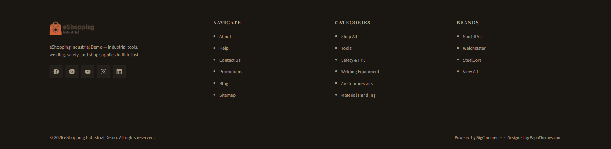
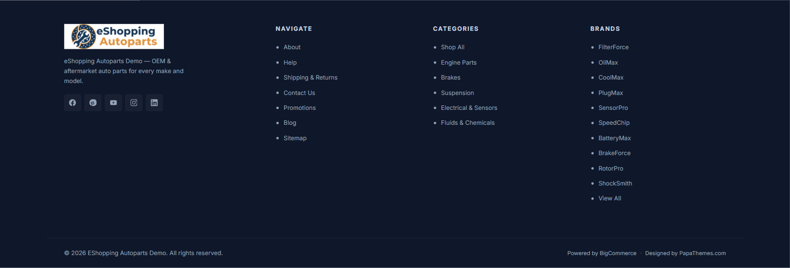
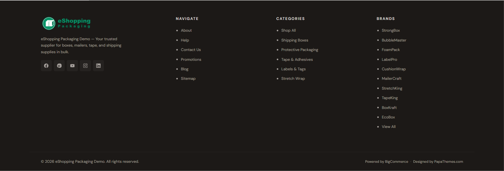

# Footer

The eShopping footer is built into the theme and has these areas:

1. **Brand block** — your logo, a tagline widget, and (optionally) social icons (left column).
2. **Navigate column** — your Storefront Web Pages, plus an automatic *Sitemap* link.
3. **Categories column** — your store's top-level categories.
4. **Brands column** — your shop-by-brand list (can be turned off; see ③).
5. **Bottom bar** — copyright line, payment-method icons, and the Powered-by / Designed-by credit.

The three link columns (Navigate, Categories, Brands) are generated automatically from your store — they are **not** hand-built link menus and there is no "Footer menu" to configure.

{ loading=lazy }
{ loading=lazy }
{ loading=lazy }

---

## ① The brand block

The brand block shows your store logo, a tagline area, and (optionally) your social icons.

### Footer tagline (widget)

The tagline area is a **global widget region** (`eshopping_footer_description--global`). The theme no longer ships a hardcoded tagline — the footer template renders this region raw, so it is **empty until you drop a widget into it**. On all four demo stores the tagline is an **AI HTML Generator | PapaThemes** widget. See the [Widget regions reference](widget-regions.md) for the full list of regions.

<!--te-src:PiAqKkN1c3RvbWl6ZToqKiBQYWdlIEJ1aWxkZXIg4oaSIGNsaWNrIHRoZSBmb290ZXIgdGFnbGluZSBibG9jayDihpIgKipIVE1MIENvbnRlbnQqKiBmaWVsZCDihpIgU2F2ZS4gU2VlIFtGb290ZXIgdGFnbGluZV0od2lkZ2V0cy1wYXBhdGhlbWVzLm1kI2Zvb3Rlci10YWdsaW5lKSBmb3IgdGhlIGV4YWN0IHBlci1zdG9yZSBIVE1MLg==-->
<!--te-mock--><div class="te-mock te-mock--pb"><div class="te-mock__hd"><span>‹ AI HTML Generator | PapaThemes</span><span class="te-x">⋯</span></div><div class="te-mock__grp">▾ Content</div><div class="te-pbbox"><span class="k">&lt;style&gt;</span><br><span class="s">.papathemes-ai-widget-…</span> { … }<br>…your HTML…<br><span class="k">&lt;/style&gt;</span></div><div class="te-pbbtns"><span class="te-btn-ghost">Expand HTML Editor</span><span class="te-save te-save--full">Save HTML</span></div><div class="te-mock__row"><span class="te-cb"></span><span class="te-lbl">Show in container div</span></div></div>

**To add or edit it:**

1. Open Page Builder (**Storefront → My Themes → Customize**). Scroll down to the footer — the first column shows a dashed widget-region outline.
2. If empty, click the **+** button inside that outline and drag in an **AI HTML Generator | PapaThemes** widget (this drops it into the **`eshopping_footer_description--global`** region). This widget is provided by the PapaThemes app, which must be installed. If a widget is already there, just click it.
3. Edit the **HTML Content** field. The live tagline is simply a `<span class="eshopping-footer-desc-text">…</span>`:

   ```html
   <span class="eshopping-footer-desc-text">Your store tagline — what you sell and why customers trust you.</span>
   ```

   Optionally follow it with a `<ul class="eshopping-footer-trust">` list of icon + text trust items (the theme styles this list — icon-and-text rows in the footer text color):

   ```html
   <span class="eshopping-footer-desc-text">Your store tagline goes here.</span>
   <ul class="eshopping-footer-trust">
     <li><svg><use xlink:href="#icon-truck"></use></svg> Same-day shipping</li>
     <li><svg><use xlink:href="#icon-shield"></use></svg> Secure checkout</li>
   </ul>
   ```

4. Click **Save**.

The theme styles the `.eshopping-footer-desc` wrapper (font, color, max-width) and the optional `.eshopping-footer-trust` list. The `.eshopping-footer-desc-text` span inherits the wrapper styling.

**Exact demo tagline HTML (current, per store)** — none of the four currently uses a trust list:

??? example "Exact demo HTML — all 4 stores"

    Industrial:

    ```html
    <span class="eshopping-footer-desc-text">eShopping Industrial Demo — Industrial tools, welding, safety, and shop supplies built to last.</span>
    ```

    Auto Parts:

    ```html
    <span class="eshopping-footer-desc-text">eShopping Autoparts Demo — OEM &amp; aftermarket auto parts for every make and model.</span>
    ```

    Electronics:

    ```html
    <span class="eshopping-footer-desc-text">eShopping Electronics Demo — Laptops, monitors, audio gear, and smart home tech — tested for quality and shipped fast.</span>
    ```

    Packaging:

    ```html
    <span class="eshopping-footer-desc-text">eShopping Packaging Demo — Your trusted supplier for boxes, mailers, tape, and shipping supplies in bulk.</span>
    ```

### Social icons

Social icons render in the brand block **only when** the **Footer Placement** toggle is enabled under **Theme Editor → Header and footer → Social media icons**. The icons themselves come from the accounts you fill in at **Storefront → Social media accounts**.

<!--te-src:PiAqKkN1c3RvbWl6ZToqKiBUaGVtZSBFZGl0b3Ig4oaSICpIZWFkZXIgYW5kIGZvb3Rlciog4oaSICoqRm9vdGVyIFBsYWNlbWVudCoqIChgc29jaWFsX2ljb25fcGxhY2VtZW50X2JvdHRvbWApIOKAlCBzaG93IC8gaGlkZSB0aGUgc29jaWFsIGljb25zIGluIHRoZSBmb290ZXIgYnJhbmQgYmxvY2suIERlZmF1bHQ6IGBPbmAuIFRoZSBpY29ucyBzaG93biBjb21lIGZyb20gKipTdG9yZWZyb250IOKGkiBTb2NpYWwgbWVkaWEgYWNjb3VudHMqKiAobm90IGEgdGhlbWUgc2V0dGluZyku-->
<!--te-mock--><div class="te-mock"><div class="te-mock__hd"><span>Header and footer</span><span class="te-x">✕</span></div><div class="te-mock__row"><span class="te-lbl">Footer Placement</span><span class="te-cb is-on"></span></div><div class="te-mock__row"><span class="te-lbl">Storefront → Social media accounts</span><span class="te-tx te-tx--ph">Enter text…</span></div></div>

Supported networks: Facebook, Instagram, X (Twitter), LinkedIn, YouTube, Pinterest, Tumblr, Google+, and RSS.

---

## ② The Navigate and Categories columns

These two columns are filled in automatically — there is nothing to wire up in a menu:

- **Navigate** — lists your **Storefront → Web Pages** (e.g. *About Us*, *Privacy Policy*, *Returns*, *Shipping*), and always ends with an automatic **Sitemap** link.
- **Categories** — lists your store's top-level categories.

To change what appears in the **Navigate** column, add, remove, or reorder your Storefront Web Pages. To change the **Categories** column, edit your category tree.

---

## ③ The Brands column { #brand-strip }

The third link column is titled **Brands**. It lists your shop-by-brand brands and ends with a **View All** link. Configure it in **Theme Editor → Header and footer**:

<!--te-tbl:fCBTZXR0aW5nIHwgRGVmYXVsdCB8IEVmZmVjdCB8CnwgLS0tLS0tLSB8IC0tLS0tLS0gfCAtLS0tLS0gfAp8IFNob3cgYnJhbmRzIGluIGZvb3RlciB8IE9uIHwgU2hvdyAvIGhpZGUgdGhlIEJyYW5kcyBjb2x1bW4gfAp8IE1heCBicmFuZHMgaW4gZm9vdGVyIHwgMTAgfCBEcm9wZG93biAoNSAvIDggLyAxMCAvIDE1IC8gMjApIOKAlCBjYXBzIGhvdyBtYW55IGJyYW5kcyBsaXN0IGJlZm9yZSB0aGUgKlZpZXcgQWxsKiBsaW5rIHw=-->

<!--te-src:PiAqKkN1c3RvbWl6ZToqKiBUaGVtZSBFZGl0b3Ig4oaSICpIZWFkZXIgYW5kIGZvb3Rlciog4oaSICoqU2hvdyBicmFuZHMgaW4gZm9vdGVyKiogKGBzaG9wX2J5X2JyYW5kX3Nob3dfZm9vdGVyYCkg4oCUIHNob3cgLyBoaWRlIHRoZSB3aG9sZSBCcmFuZHMgY29sdW1uLiBEZWZhdWx0OiBgT25gLg==-->
<!--te-src:PiAqKkN1c3RvbWl6ZToqKiBUaGVtZSBFZGl0b3Ig4oaSICpIZWFkZXIgYW5kIGZvb3Rlciog4oaSICoqTWF4IGJyYW5kcyBpbiBmb290ZXIqKiAoYGVzaG9wcGluZy1mb290ZXItYnJhbmRzLWxpbWl0YCkg4oCUIGNhcHMgaG93IG1hbnkgYnJhbmRzIGxpc3QgYmVmb3JlIHRoZSAqVmlldyBBbGwqIGxpbmsuIEZvcm1hdDogc2VsZWN0IG9uZSBvZiBgNSAvIDggLyAxMCAvIDE1IC8gMjBgLiBEZWZhdWx0OiBgMTBgLg==-->
<!--te-mock--><div class="te-mock"><div class="te-mock__hd"><span>Header and footer</span><span class="te-x">✕</span></div><div class="te-mock__row"><span class="te-lbl">Show brands in footer</span><span class="te-cb is-on"></span></div><div class="te-mock__row"><span class="te-lbl">Max brands in footer</span><span class="te-dd"><span class="te-dd__v">10</span><span class="te-dd__b">▾</span></span></div></div>

!!! note
    The Brands column hides automatically if **Show brands in footer** is off **or** your store has no brands.

    The brand list itself is generated from your store's brands (**Products → Brands** in the BigCommerce admin) — it is not a hand-built menu.

---

## ④ The bottom bar

The bottom bar holds the copyright line, the payment-method icons, and the Powered-by / Designed-by credit. Each part has its own on/off control.

| Setting | Effect | Where |
| ------- | ------ | ----- |
| Store name | Appears in the copyright line | **Settings → Store profile → Store name** |
| Show Copyright Footer | Shows / hides the copyright line | Theme Editor → Header and footer |
| Show Powered By | Shows / hides the Powered-by / Designed-by line | Theme Editor → Header and footer |
| Payment-method icons | One toggle per provider | Theme Editor → Header and footer |

**Copyright line.** When **Show Copyright Footer** is on, the line reads:

> © {year} {Store name}. All rights reserved.

<!--te-src:PiAqKkN1c3RvbWl6ZToqKiBUaGVtZSBFZGl0b3Ig4oaSICpIZWFkZXIgYW5kIGZvb3Rlciog4oaSICoqU2hvdyBDb3B5cmlnaHQgRm9vdGVyKiogKGBzaG93X2NvcHlyaWdodF9mb290ZXJgKSDigJQgc2hvdyAvIGhpZGUgdGhlIGNvcHlyaWdodCBsaW5lLiBEZWZhdWx0OiBgT25gLiBUaGUgc3RvcmUgbmFtZSBjb21lcyBmcm9tICoqU2V0dGluZ3Mg4oaSIFN0b3JlIHByb2ZpbGUg4oaSIFN0b3JlIG5hbWUqKiAobm90IGEgdGhlbWUgc2V0dGluZyk7IHRoZSB5ZWFyIGlzIGF1dG9tYXRpYy4=-->
<!--te-mock--><div class="te-mock"><div class="te-mock__hd"><span>Header and footer</span><span class="te-x">✕</span></div><div class="te-mock__row"><span class="te-fld"><span class="te-lbl">Show Copyright Footer</span><span class="te-desc">Shows / hides the copyright line</span></span><span class="te-cb is-on"></span></div><div class="te-mock__row"><span class="te-fld"><span class="te-lbl">Settings → Store profile → Store name</span><span class="te-desc">Appears in the copyright line</span></span><span class="te-tx te-tx--ph">Enter text…</span></div></div>

**Powered-by / Designed-by line.** When **Show Powered By** is on, the line reads:

> Powered by BigCommerce · Designed by PapaThemes.com

This whole line is controlled by the single **Show Powered By** toggle — turning it off hides **both** the BigCommerce and the PapaThemes credits together.

<!--te-src:PiAqKkN1c3RvbWl6ZToqKiBUaGVtZSBFZGl0b3Ig4oaSICpIZWFkZXIgYW5kIGZvb3Rlciog4oaSICoqU2hvdyBQb3dlcmVkIEJ5KiogKGBzaG93X3Bvd2VyZWRfYnlgKSDigJQgc2hvdyAvIGhpZGUgdGhlIGVudGlyZSBQb3dlcmVkLWJ5IC8gRGVzaWduZWQtYnkgY3JlZGl0IGxpbmUuIERlZmF1bHQ6IGBPbmAu-->
<!--te-mock--><div class="te-mock"><div class="te-mock__hd"><span>Header and footer</span><span class="te-x">✕</span></div><div class="te-mock__row"><span class="te-fld"><span class="te-lbl">Show Powered By</span><span class="te-desc">Shows / hides the Powered-by / Designed-by line</span></span><span class="te-cb is-on"></span></div></div>

**Payment-method icons.** Each provider has its own toggle under **Theme Editor → *Header and footer* → Payment icons**. The defaults are:

| Provider | Field label | Setting id | Default |
| -------- | ----------- | ---------- | ------- |
| American Express | Show American Express | `show_accept_amex` | `On` |
| Discover | Show Discover | `show_accept_discover` | `On` |
| Mastercard | Show Mastercard | `show_accept_mastercard` | `On` |
| PayPal | Show PayPal | `show_accept_paypal` | `On` |
| Visa | Show Visa | `show_accept_visa` | `On` |
| Amazon Pay | Show Amazon Pay | `show_accept_amazonpay` | `Off` |
| Google Pay | Show Google Pay | `show_accept_googlepay` | `Off` |
| Klarna | Show Klarna | `show_accept_klarna` | `Off` |

<!--te-src:PiAqKkN1c3RvbWl6ZToqKiBUaGVtZSBFZGl0b3Ig4oaSICpIZWFkZXIgYW5kIGZvb3Rlciog4oaSICoqUGF5bWVudCBpY29ucyoqIOKAlCB0b2dnbGUgZWFjaCBwcm92aWRlciBhYm92ZSBvbiAvIG9mZi4gVGhlc2UgY29udHJvbCBvbmx5IHdoaWNoIGljb25zIGFyZSAqZGlzcGxheWVkKjsgdGhleSBkbyBub3QgZW5hYmxlIGEgcGF5bWVudCBtZXRob2QgKGRvIHRoYXQgaW4gKipTZXR0aW5ncyDihpIgUGF5bWVudHMqKiku-->
<!--te-mock--><div class="te-mock"><div class="te-mock__hd"><span>Header and footer</span><span class="te-x">✕</span></div><div class="te-mock__row"><span class="te-lbl">Payment icons</span><span class="te-tx te-tx--ph">Enter text…</span></div><div class="te-mock__row"><span class="te-lbl">Settings → Payments</span><span class="te-tx te-tx--ph">Enter text…</span></div></div>

---

## Footer colors

Set footer colors in **Theme Editor → eShopping Theme → Footer**. Each is a color picker:

<!--te-src:PiAqKkN1c3RvbWl6ZToqKiBUaGVtZSBFZGl0b3Ig4oaSICplU2hvcHBpbmcgVGhlbWUqIOKGkiAqRm9vdGVyKiDihpIgcGljayBhIGhleCBjb2xvciBmb3IgZWFjaCBmaWVsZCBiZWxvdy4gRm9ybWF0OiBoZXggKGUuZy4gYCMxYTE3MTNgKS4gRGVmYXVsdHMgdmFyeSBwZXIgdmFyaWF0aW9uIChzZWUgdGFibGUpLg==-->
<!--te-mock--><div class="te-mock"><div class="te-mock__hd"><span>eShopping Theme</span><span class="te-x">✕</span></div><div class="te-mock__row"><span class="te-fld"><span class="te-lbl">setting</span><span class="te-desc">Industrial (default)</span></span><span class="te-color"><span class="te-hex">#1A1713</span><span class="te-sw" style="background:#1a1713"></span></span></div></div>

| Field label | Setting id |
| ----------- | ---------- |
| Footer Background | `eshopping-footer-bg` |
| Footer Text | `eshopping-footer-color` |
| Footer Heading | `eshopping-footer-heading` |
| Footer Link | `eshopping-footer-link` |
| Footer Link Hover | `eshopping-footer-link-hover` |
| Footer Border | `eshopping-footer-border` |

The **real defaults vary per variation**:

| Setting | Industrial (default) | AutoParts | Electronics | Packaging |
| ------- | -------------------- | --------- | ----------- | --------- |
| Footer Background | `#1a1713` | `#0f172a` | `#18181b` | `#1c1917` |
| Footer Text | `#a89b86` | `#94a3b8` | `#a1a1aa` | `#a8a29e` |
| Footer Heading | `#b8ad9b` | `#cbd5e1` | `#d4d4d8` | `#d6d3d1` |
| Footer Link | `#a89b86` | `#94a3b8` | `#a1a1aa` | `#a8a29e` |
| Footer Link Hover | `#faf8f4` | `#f8fafc` | `#fafafa` | `#fafaf9` |
| Footer Border | `#2e2a25` | `#1e293b` | `#27272a` | `#292524` |

You can override any of these after picking your variation.

---

## Next

- [Sidebar](sidebar.md)
- [Home page recipes](home-overview.md)
