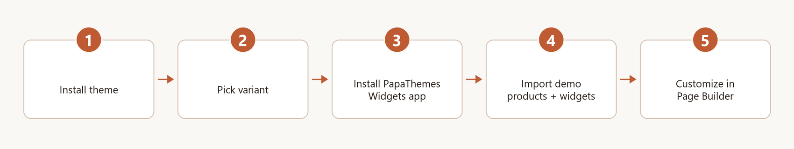

# Get Started

Welcome to the **eShopping** theme by PapaThemes! This page is the **big picture** — what you need to do, in what order, before you start tweaking individual pages.

If you'd rather jump straight to a specific page, use the menu on the left.

---

## The 5-step setup at a glance

{ loading=lazy }

| # | Step | Where | Time |
| - | ---- | ----- | ---- |
| 1 | [Install the eShopping theme](install-theme.md) | BigCommerce **Storefront → My Themes** | ~2 min |
| 2 | [Pick a demo variant](choose-variant.md) | Theme Editor → Variations | ~1 min |
| 3 | [Import the matching demo data](import-demo-data.md) | <https://bc-tools.papathemes.com> | varies by catalog size |
| 4 | [Add the hero carousel slides](#step-4-add-the-hero-carousel-slides) | BigCommerce admin → **Marketing → Carousel** | ~5 min |
| 5 | Customize colors, banners, content in **Page Builder** | Storefront → My Themes → Customize | as long as you like |

After step 3 your storefront already has the demo **products, product sliders, and marketing blocks** in place. The **hero carousel** is the one piece that isn't auto-imported — you add its slides manually in the BigCommerce admin under **Marketing → Carousel** (see step 4 below). Once that's done, your storefront matches one of the four demo stores. Step 5 is where you make it **your own**.

!!! info "How the demo content is built"
    You don't need any extra app to reproduce the demos. The demo home pages and footer marketing blocks are **built-in BigCommerce HTML widgets** — the importer in step 3 creates them for you. The home-page hero is the **built-in BigCommerce Carousel**, shown when the **Show carousel** setting is on (it is on in every demo variant). The HTML marketing blocks are managed in Page Builder. The hero carousel slides are **not** created by the importer — you add them yourself in the BigCommerce admin under **Marketing → Carousel** (step 4 below). No add-ons are required for either.

---

## Step 4: Add the hero carousel slides

The importer in step 3 brings in your demo products and marketing blocks, but it does **not** create the hero carousel slides — BigCommerce manages those separately. Until you add at least one slide, the hero area at the top of the home page stays hidden, even though **Show carousel** is already on.

To match the demo:

1. In your BigCommerce admin, go to **Marketing → Carousel**.
2. Add one slide per demo banner, using the demo's heading, button link, and image for your variant. Your variant's home-page guide lists the exact headings, links, and images to use:
    - [Industrial](home-industrial.md)
    - [Auto Parts](home-autoparts.md)
    - [Electronics](home-electronics.md)
    - [Packaging](home-packaging.md)
3. Save. Reload your home page — the hero now appears.

!!! note "The Show carousel toggle must be on"
    The hero is gated by BigCommerce's standard **Show carousel** setting (Theme Editor → Home page section), in addition to having at least one slide. It's **on by default** in every demo variant, so copying a demo just works. If you've added slides but still see no hero, check that **Show carousel** is enabled.

!!! tip "Don't want a hero?"
    Leaving the Carousel empty simply hides the hero. The rest of the home page (product sliders, marketing blocks, brands, blog, newsletter) renders normally without it.

---

## Before you begin — checklist

You'll need:

- [x] A BigCommerce store (any plan).
- [x] **Admin access** (Store Owner or a role with **Theme management** and **Storefront** permissions).
- [x] A **BigCommerce API account** for the BC Tools importer. The importer needs read/write access to the resources it imports — typically themes, page-builder widgets, products, categories, and brands. Always follow the scope list shown in [BC Tools](https://bc-tools.papathemes.com) and BigCommerce's own [API account documentation](https://support.bigcommerce.com/s/article/Store-API-Accounts), since those are the authoritative source.
- [x] Roughly **30 minutes** of focused time for the initial setup — this is just a ballpark and varies with how many products and images your chosen demo imports.

!!! warning "Use a staging channel if your store is already live"
    If your store already has live customers, create a **secondary channel** (Channel Manager → Add channel → Storefront → Stencil) and install the theme there first. You can preview the entire setup on a `*.mybigcommerce.com` URL without disturbing your live site, then promote to live only when you're ready.

---

## How the demo home page is assembled

It helps to know what you're actually setting up before you dive in. Every eShopping demo home page is built from standard BigCommerce pieces — no special app is required:

- **Hero** — the built-in BigCommerce **Carousel**. It appears when **two** things are both true: BigCommerce's standard **Show carousel** setting is on, and at least one slide exists. Both are already in place in every demo variant — the display setting is on by default, so you only need to add slides. The importer does not create slides, so you add them yourself under **Marketing → Carousel** — see [Step 4](#step-4-add-the-hero-carousel-slides).
- **Marketing blocks** (the value-prop callout below the product sections, the "about" block under the newsletter, and the footer tagline) — built-in **HTML widgets**. The importer in step 3 creates these for you with demo-ready copy; you can then edit them directly in Page Builder.
- **Product sliders, brands carousel, blog, newsletter** — rendered by the theme and controlled by the theme's own settings, which the demo variant pre-configures for you.

Because everything is built-in, the only tool you need beyond your store is the [BC Tools importer](import-demo-data.md) in step 3, which loads the demo products and widget content in one pass.

---

## What's next?

Pick one of the four guides below — each one is a complete, copy-the-demo walkthrough for that variant.

1. [Install the theme](install-theme.md)
2. [Choose your variant](choose-variant.md)
3. [Import demo products and widgets](import-demo-data.md)
4. Then jump to your variant's home-page guide:
    - [Industrial](home-industrial.md)
    - [Auto Parts](home-autoparts.md)
    - [Electronics](home-electronics.md)
    - [Packaging](home-packaging.md)
