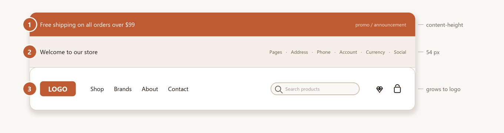

# Header & Top Bar

The eShopping header has three stacked strips:

{ loading=lazy }

Each strip is configured independently.

---

## ① Top Banner (the promo strip above the header)

This is the **BigCommerce native banner** — *not* a Page Builder widget region. It's managed in:

**Marketing → Banners** (in your BigCommerce admin sidebar — outside Page Builder).

### Create a banner

1. **Marketing → Banners → Create a banner**.
2. Configure:
    - **Name** — internal label.
    - **Banner content** — paste HTML (use the snippet below).
    - **Show this banner on** — **Top of all pages**.
    - **Visibility** — **Show**.
    - **Date range** — optional schedule.
3. Save.

<!--te-src:PiAqKkN1c3RvbWl6ZToqKiBCaWdDb21tZXJjZSBhZG1pbiDihpIgKipNYXJrZXRpbmcg4oaSIEJhbm5lcnMg4oaSIENyZWF0ZSBhIGJhbm5lcioqIChzZXQgKipTaG93IHRoaXMgYmFubmVyIG9uKiogPSAqVG9wIG9mIGFsbCBwYWdlcyosICoqVmlzaWJpbGl0eSoqID0gKlNob3cqKS4gUGFzdGUgeW91ciBIVE1MIGludG8gKipCYW5uZXIgY29udGVudCoqLiAoTm90IGEgdGhlbWUgc2V0dGluZy4p-->
<!--te-mock--><div class="te-mock te-nav"><div class="te-nav__brand">BigCommerce admin</div><div class="te-nav__top"><span>Home</span></div><div class="te-nav__top"><span>Orders</span></div><div class="te-nav__top"><span>Products</span><span class="te-nav__chev">⌄</span></div><div class="te-nav__top"><span>Customers</span><span class="te-nav__chev">⌄</span></div><div class="te-nav__top"><span>Storefront</span><span class="te-nav__chev">⌄</span></div><div class="te-nav__top is-open"><span>Marketing</span><span class="te-nav__chev">⌃</span></div><div class="te-nav__sub is-active">Banners</div><div class="te-nav__sub">Coupon codes</div><div class="te-nav__sub">Gift certificates</div><div class="te-nav__sub">Abandoned cart saver</div><div class="te-nav__top"><span>Analytics</span></div><div class="te-nav__top"><span>Settings</span><span class="te-nav__chev">⌄</span></div></div>

The theme renders whatever HTML you paste — it adds no carousel, rotation, or fixed height. The strip is only as tall as your banner content.

### Banner colors

<!--te-lead:KipUaGVtZSBFZGl0b3Ig4oaSIGVTaG9wcGluZyDihpIgQmFubmVyKio6-->

<!--te-tbl:fCBTZXR0aW5nIHwgRWZmZWN0IHwKfCAtLS0tLS0tIHwgLS0tLS0tIHwKfCBCYW5uZXIgQmFja2dyb3VuZCB8IEJhbm5lciBzdHJpcCBiYWNrZ3JvdW5kIHwKfCBCYW5uZXIgVGV4dCBDb2xvciB8IEJvZHkgdGV4dCBjb2xvciB8CnwgQmFubmVyIExpbmsgQ29sb3IgfCBDb2xvciBmb3IgYW55IGxpbmsgaW5zaWRlIHRoZSBIVE1MIHw=-->

<!--te-src:PiAqKkN1c3RvbWl6ZToqKiBUaGVtZSBFZGl0b3Ig4oaSICplU2hvcHBpbmcgVGhlbWUg4oaSIEJhbm5lciog4oaSICoqQmFubmVyIEJhY2tncm91bmQqKiAoaWQgYGVzaG9wcGluZy1iYW5uZXItYmdgKS4gRm9ybWF0OiBoZXggY29sb3IuIERlZmF1bHQ6IGAjM2UzNjI5YC4=-->
<!--te-src:PiAqKkN1c3RvbWl6ZToqKiBUaGVtZSBFZGl0b3Ig4oaSICplU2hvcHBpbmcgVGhlbWUg4oaSIEJhbm5lciog4oaSICoqQmFubmVyIFRleHQgQ29sb3IqKiAoaWQgYGVzaG9wcGluZy1iYW5uZXItY29sb3JgKS4gRm9ybWF0OiBoZXggY29sb3IuIERlZmF1bHQ6IGAjZDVjZWMyYC4=-->
<!--te-src:PiAqKkN1c3RvbWl6ZToqKiBUaGVtZSBFZGl0b3Ig4oaSICplU2hvcHBpbmcgVGhlbWUg4oaSIEJhbm5lciog4oaSICoqQmFubmVyIExpbmsgQ29sb3IqKiAoaWQgYGVzaG9wcGluZy1iYW5uZXItbGlua2ApLiBGb3JtYXQ6IGhleCBjb2xvci4gRGVmYXVsdDogYCNkOTg0NWVgLg==-->
<!--te-mock--><div class="te-mock"><div class="te-mock__hd"><span>eShopping Theme</span><span class="te-x">✕</span></div><div class="te-mock__grp">Banner</div><div class="te-mock__row"><span class="te-fld"><span class="te-lbl">Banner Background</span><span class="te-desc">Banner strip background</span></span><span class="te-color"><span class="te-hex">#3E3629</span><span class="te-sw" style="background:#3e3629"></span></span></div><div class="te-mock__row"><span class="te-fld"><span class="te-lbl">Banner Text Color</span><span class="te-desc">Body text color</span></span><span class="te-color"><span class="te-hex">#D5CEC2</span><span class="te-sw" style="background:#d5cec2"></span></span></div><div class="te-mock__row"><span class="te-fld"><span class="te-lbl">Banner Link Color</span><span class="te-desc">Color for any link inside the HTML</span></span><span class="te-color"><span class="te-hex">#D9845E</span><span class="te-sw" style="background:#d9845e"></span></span></div></div>

### Snippet — single message

```html
<p style="text-align:center">Carbon-neutral shipping on every order</p>
```

### Snippet — message with a phone link

```html
<div style="text-align:center">
  Free shipping on orders over $99 ·
  Customer service: <a href="tel:+18001234567">+1 (800) 123-4567</a>
</div>
```

> If you want the banner to rotate between several promos, use a Page Builder banner widget or a third-party carousel app — the theme itself displays the banner HTML as-is.

---

## ② Top Bar (welcome text + utility links)

The 54 px strip showing the welcome text, web-page links and address on the left, and account links, currency selector, phone and social icons on the right. Configure colors and toggles in **Theme Editor → eShopping → Header**:

<!--te-tbl:fCBTZXR0aW5nIHwgRWZmZWN0IHwKfCAtLS0tLS0tIHwgLS0tLS0tIHwKfCBUb3BiYXIgQmFja2dyb3VuZCB8IFN0cmlwIGJhY2tncm91bmQgfAp8IFRvcGJhciBUZXh0IHwgVGV4dCArIGljb24gY29sb3IgfAp8IFRvcGJhciBUZXh0IEhvdmVyIHwgSG92ZXIgY29sb3IgZm9yIGxpbmtzL2ljb25zIHwKfCBTaG93IFNvY2lhbCBJY29ucyB8IEludGVuZGVkIHRvIHRvZ2dsZSB0aGUgc29jaWFsIGljb25zIChzZWUgbm90ZSBiZWxvdykgfAp8IFNob3cgQWRkcmVzcyBpbiBUb3BiYXIgfCBTaG93IHlvdXIgc3RvcmUgYWRkcmVzcyAoZnJvbSAqKlNldHRpbmdzIOKGkiBTdG9yZSBwcm9maWxlIOKGkiBBZGRyZXNzKiopIHwKfCBTaG93IFBob25lIGluIFRvcGJhciB8IFNob3cgeW91ciBzdG9yZSBwaG9uZSAoZnJvbSAqKlNldHRpbmdzIOKGkiBTdG9yZSBwcm9maWxlIOKGkiBQaG9uZSoqKSB8CnwgV2VsY29tZSBUZXh0IHwgRnJlZS10ZXh0IGdyZWV0aW5nIHNob3duIGF0IHRoZSBmYXIgbGVmdCB8CnwgVG9wYmFyIFBhZ2VzIFJhbmdlIHwgV2hpY2ggd2ViLXBhZ2UgbGlua3MgYXBwZWFyIGluIHRoZSB0b3AgYmFyIOKAlCBhIGBmcm9tLHRvYCBpbmRleCByYW5nZSAoc2VlIGJlbG93KSB8-->

<!--te-src:PiAqKkN1c3RvbWl6ZToqKiBUaGVtZSBFZGl0b3Ig4oaSICplU2hvcHBpbmcgVGhlbWUg4oaSIEhlYWRlciog4oaSICoqVG9wYmFyIEJhY2tncm91bmQqKiAoaWQgYGVzaG9wcGluZy10b3BiYXItYmdgKS4gRm9ybWF0OiBoZXggY29sb3IuIERlZmF1bHQ6IGAjMWExNzEzYC4=-->
<!--te-src:PiAqKkN1c3RvbWl6ZToqKiBUaGVtZSBFZGl0b3Ig4oaSICplU2hvcHBpbmcgVGhlbWUg4oaSIEhlYWRlciog4oaSICoqVG9wYmFyIFRleHQqKiAoaWQgYGVzaG9wcGluZy10b3BiYXItY29sb3JgKS4gRm9ybWF0OiBoZXggY29sb3IuIERlZmF1bHQ6IGAjOTc4YTc0YC4=-->
<!--te-src:PiAqKkN1c3RvbWl6ZToqKiBUaGVtZSBFZGl0b3Ig4oaSICplU2hvcHBpbmcgVGhlbWUg4oaSIEhlYWRlciog4oaSICoqVG9wYmFyIFRleHQgSG92ZXIqKiAoaWQgYGVzaG9wcGluZy10b3BiYXItY29sb3ItaG92ZXJgKS4gRm9ybWF0OiBoZXggY29sb3IuIERlZmF1bHQ6IGAjZmFmOGY0YC4=-->
<!--te-src:PiAqKkN1c3RvbWl6ZToqKiBUaGVtZSBFZGl0b3Ig4oaSICplU2hvcHBpbmcgVGhlbWUg4oaSIEhlYWRlciog4oaSICoqU2hvdyBTb2NpYWwgSWNvbnMqKiAoaWQgYGVzaG9wcGluZy1zaG93LXNvY2lhbC1pY29uc2ApLiBGb3JtYXQ6IG9uL29mZi4gRGVmYXVsdDogYHRydWVgLiAoRGVhZCB0b2dnbGUg4oCUIGhhcyBubyB0ZW1wbGF0ZSBlZmZlY3Q7IHNvY2lhbCBpY29ucyBhcmUgZHJpdmVuIG9ubHkgYnkgd2hldGhlciBzb2NpYWwgVVJMcyBleGlzdC4gU2VlIG5vdGUgYmVsb3cuKQ==-->
<!--te-src:PiAqKkN1c3RvbWl6ZToqKiBUaGVtZSBFZGl0b3Ig4oaSICplU2hvcHBpbmcgVGhlbWUg4oaSIEhlYWRlciog4oaSICoqU2hvdyBBZGRyZXNzIGluIFRvcGJhcioqIChpZCBgZXNob3BwaW5nLXRvcGJhci1zaG93LWFkZHJlc3NgKS4gRm9ybWF0OiBvbi9vZmYuIERlZmF1bHQ6IGB0cnVlYC4=-->
<!--te-src:PiAqKkN1c3RvbWl6ZToqKiBUaGVtZSBFZGl0b3Ig4oaSICplU2hvcHBpbmcgVGhlbWUg4oaSIEhlYWRlciog4oaSICoqU2hvdyBQaG9uZSBpbiBUb3BiYXIqKiAoaWQgYGVzaG9wcGluZy10b3BiYXItc2hvdy1waG9uZWApLiBGb3JtYXQ6IG9uL29mZi4gRGVmYXVsdDogYHRydWVgLg==-->
<!--te-src:PiAqKkN1c3RvbWl6ZToqKiBUaGVtZSBFZGl0b3Ig4oaSICplU2hvcHBpbmcgVGhlbWUg4oaSIEhlYWRlciog4oaSICoqV2VsY29tZSBUZXh0KiogKGlkIGBlc2hvcHBpbmctd2VsY29tZS10ZXh0YCkuIEZvcm1hdDogdGV4dC4gRGVmYXVsdDogYGAgKGVtcHR5IOKGkiBzaG93cyAqIldlbGNvbWUgdG8ge3N0b3JlIG5hbWV9IiopLg==-->
<!--te-src:PiAqKkN1c3RvbWl6ZToqKiBUaGVtZSBFZGl0b3Ig4oaSICplU2hvcHBpbmcgVGhlbWUg4oaSIEhlYWRlciog4oaSICoqVG9wYmFyIHBhZ2VzIHJhbmdlOiBmcm9tLHRvIChlLmcuIDYsOCkqKiAoaWQgYGVzaG9wcGluZy10b3BiYXItcGFnZXMtcmFuZ2VgKS4gRm9ybWF0OiBjb21tYS1zZXBhcmF0ZWQgYGZyb20sdG9gICh0d28gemVyby1iYXNlZCBpbmRleGVzLCBlbmQgZXhjbHVzaXZlKS4gRGVmYXVsdDogYDYsOGAu-->
<!--te-mock--><div class="te-mock"><div class="te-mock__hd"><span>eShopping Theme</span><span class="te-x">✕</span></div><div class="te-mock__grp">Header</div><div class="te-mock__row"><span class="te-fld"><span class="te-lbl">Topbar Background</span><span class="te-desc">Strip background</span></span><span class="te-color"><span class="te-hex">#1A1713</span><span class="te-sw" style="background:#1a1713"></span></span></div><div class="te-mock__row"><span class="te-fld"><span class="te-lbl">Topbar Text</span><span class="te-desc">Text + icon color</span></span><span class="te-color"><span class="te-hex">#978A74</span><span class="te-sw" style="background:#978a74"></span></span></div><div class="te-mock__row"><span class="te-fld"><span class="te-lbl">Topbar Text Hover</span><span class="te-desc">Hover color for links/icons</span></span><span class="te-color"><span class="te-hex">#FAF8F4</span><span class="te-sw" style="background:#faf8f4"></span></span></div><div class="te-mock__row"><span class="te-fld"><span class="te-lbl">Show Social Icons</span><span class="te-desc">Intended to toggle the social icons (see note below)</span></span><span class="te-cb is-on"></span></div><div class="te-mock__row"><span class="te-fld"><span class="te-lbl">Show Address in Topbar</span><span class="te-desc">Show your store address (from Settings → Store profile → Address)</span></span><span class="te-cb is-on"></span></div><div class="te-mock__row"><span class="te-fld"><span class="te-lbl">Show Phone in Topbar</span><span class="te-desc">Show your store phone (from Settings → Store profile → Phone)</span></span><span class="te-cb is-on"></span></div><div class="te-mock__row"><span class="te-fld"><span class="te-lbl">Welcome Text</span><span class="te-desc">Free-text greeting shown at the far left</span></span><span class="te-tx te-tx--ph">Enter text…</span></div><div class="te-mock__row"><span class="te-fld"><span class="te-lbl">Topbar pages range: from,to (e.g. 6,8)</span><span class="te-desc">Which web-page links appear in the top bar — a from,to index range (see below)</span></span><span class="te-tx">6,8</span></div></div>

The store **address** and **phone** values shown by the two toggles come from your BigCommerce admin, not the theme:

<!--te-src:PiAqKkN1c3RvbWl6ZToqKiBCaWdDb21tZXJjZSBhZG1pbiDihpIgKipTZXR0aW5ncyDihpIgU3RvcmUgcHJvZmlsZSDihpIgQWRkcmVzcyoqIC8gKipQaG9uZSoqLiAoTm90IGEgdGhlbWUgc2V0dGluZy4p-->
<!--te-mock--><div class="te-mock te-nav"><div class="te-nav__brand">BigCommerce admin</div><div class="te-nav__top"><span>Home</span></div><div class="te-nav__top"><span>Orders</span></div><div class="te-nav__top"><span>Products</span><span class="te-nav__chev">⌄</span></div><div class="te-nav__top"><span>Customers</span><span class="te-nav__chev">⌄</span></div><div class="te-nav__top"><span>Storefront</span><span class="te-nav__chev">⌄</span></div><div class="te-nav__top"><span>Marketing</span><span class="te-nav__chev">⌄</span></div><div class="te-nav__top"><span>Analytics</span></div><div class="te-nav__top is-open"><span>Settings</span><span class="te-nav__chev">⌃</span></div><div class="te-nav__sub is-active">Store profile</div><div class="te-nav__sub">Faceted search</div><div class="te-nav__sub">Currencies</div><div class="te-nav__sub">Shipping</div><div class="te-nav__sub">Payments</div></div>

!!! note "Social icons display automatically"
    Social icons appear whenever you have at least one social URL set under **Storefront → Social media** in your BigCommerce admin. The **Show Social Icons** toggle currently has no effect in the template — the icons are driven only by whether social URLs exist. Supported networks: **Facebook, Instagram, X (Twitter), LinkedIn, YouTube, Pinterest, Tumblr, Google+, RSS**.

<!--te-src:ICAgID4gKipDdXN0b21pemU6KiogQmlnQ29tbWVyY2UgYWRtaW4g4oaSICoqU3RvcmVmcm9udCDihpIgU29jaWFsIG1lZGlhKiouIEFkZCBhIFVSTCBmb3IgZWFjaCBuZXR3b3JrIHlvdSB3YW50IHNob3duOyBpY29ucyBhcHBlYXIgYXV0b21hdGljYWxseSB3aGVuIGF0IGxlYXN0IG9uZSBVUkwgaXMgc2V0LiAoTm90IGEgdGhlbWUgc2V0dGluZy4p-->
<!--te-mock--><div class="te-mock te-nav"><div class="te-nav__brand">BigCommerce admin</div><div class="te-nav__top"><span>Home</span></div><div class="te-nav__top"><span>Orders</span></div><div class="te-nav__top"><span>Products</span><span class="te-nav__chev">⌄</span></div><div class="te-nav__top"><span>Customers</span><span class="te-nav__chev">⌄</span></div><div class="te-nav__top is-open"><span>Storefront</span><span class="te-nav__chev">⌃</span></div><div class="te-nav__sub">Themes</div><div class="te-nav__sub">Logo</div><div class="te-nav__sub">Home page carousel</div><div class="te-nav__sub">Social media links</div><div class="te-nav__sub">Script manager</div><div class="te-nav__sub">Web pages</div><div class="te-nav__sub">Blog</div><div class="te-nav__sub">Image manager</div><div class="te-nav__sub is-active">Social media</div><div class="te-nav__top"><span>Marketing</span><span class="te-nav__chev">⌄</span></div><div class="te-nav__top"><span>Analytics</span></div><div class="te-nav__top"><span>Settings</span><span class="te-nav__chev">⌄</span></div></div>

!!! info "Welcome text fallback"
    If you leave **Welcome Text** empty, the top bar shows the default greeting **"Welcome to {store name}"** — it does not hide the area.

### Topbar / Nav pages range

Both **Topbar Pages Range** and **Nav Pages Range** (in the Main Nav, below) take a `from,to` index pair, not a list of page numbers:

- The value is two zero-based indexes separated by a comma, e.g. `6,8` or `0,6`.
- It shows web pages whose index is **≥ from** and **< to** (the end index is *exclusive*).
- Defaults: **Topbar Pages Range = `6,8`** and **Nav Pages Range = `0,6`**.
- Leaving the field empty does **not** show all pages — both `from` and `to` fall back to `0`, so **nothing** is shown.

So `0,6` shows the first six web pages (indexes 0–5) in the nav, while `6,8` shows the next two (indexes 6–7) in the top bar.

### Logo

The logo lives in the **Main Nav** strip (③), not the top bar. Configure it in **Theme Editor → Header and footer → Logo** (standard BigCommerce controls):

- Upload your logo file (transparent PNG recommended).
- **Logo size** — **Optimized for theme (250x100)** / **Original (as uploaded)** / **Specify dimensions**.
- **Logo position** — **Left** / **Center** / **Right**.

<!--te-src:PiAqKkN1c3RvbWl6ZToqKiBCaWdDb21tZXJjZSBhZG1pbiDihpIgKipTZXR0aW5ncyDihpIgU3RvcmUgcHJvZmlsZSDihpIgU3RvcmUgbG9nbyoqICh1cGxvYWQgdGhlIGxvZ28gaW1hZ2UgZmlsZSkuIChOb3QgYSB0aGVtZSBzZXR0aW5nLik=-->
<!--te-src:PiAqKkN1c3RvbWl6ZToqKiBUaGVtZSBFZGl0b3Ig4oaSICpIZWFkZXIgYW5kIGZvb3RlciDihpIgTG9nbyog4oaSICoqTG9nbyBpbWFnZSBzaXplKiogKGlkIGBsb2dvX3NpemVgKS4gRm9ybWF0OiBzZWxlY3Qg4oCUICpPcHRpbWl6ZWQgZm9yIHRoZW1lKiAoYDI1MHgxMDBgKSAvICpPcmlnaW5hbCAoYXMgdXBsb2FkZWQpKiAvICpTcGVjaWZ5IGRpbWVuc2lvbnMqLiBEZWZhdWx0OiBgMjAweDUwYC4=-->
<!--te-src:PiAqKkN1c3RvbWl6ZToqKiBUaGVtZSBFZGl0b3Ig4oaSICpIZWFkZXIgYW5kIGZvb3RlciDihpIgTG9nbyog4oaSICoqTG9nbyBwb3NpdGlvbioqIChpZCBgbG9nby1wb3NpdGlvbmApLiBGb3JtYXQ6IHNlbGVjdCDigJQgKkxlZnQqIC8gKkNlbnRlciogLyAqUmlnaHQqLiBEZWZhdWx0OiBgbGVmdGAu-->
<!--te-mock--><div class="te-mock te-nav"><div class="te-nav__brand">BigCommerce admin</div><div class="te-nav__top"><span>Home</span></div><div class="te-nav__top"><span>Orders</span></div><div class="te-nav__top"><span>Products</span><span class="te-nav__chev">⌄</span></div><div class="te-nav__top"><span>Customers</span><span class="te-nav__chev">⌄</span></div><div class="te-nav__top"><span>Storefront</span><span class="te-nav__chev">⌄</span></div><div class="te-nav__top"><span>Marketing</span><span class="te-nav__chev">⌄</span></div><div class="te-nav__top"><span>Analytics</span></div><div class="te-nav__top is-open"><span>Settings</span><span class="te-nav__chev">⌃</span></div><div class="te-nav__sub is-active">Store profile</div><div class="te-nav__sub">Faceted search</div><div class="te-nav__sub">Currencies</div><div class="te-nav__sub">Shipping</div><div class="te-nav__sub">Payments</div></div>
<!--te-mock--><div class="te-mock"><div class="te-mock__hd"><span>Header and footer</span><span class="te-x">✕</span></div><div class="te-mock__grp">Logo</div><div class="te-mock__row"><span class="te-lbl">Logo image size</span><span class="te-dd"><span class="te-dd__v">200x50</span><span class="te-dd__b">▾</span></span></div><div class="te-mock__row"><span class="te-lbl">Logo position</span><span class="te-dd"><span class="te-dd__v">left</span><span class="te-dd__b">▾</span></span></div></div>

The Main Nav height is not fixed — it grows to fit your logo height (a minimum of 52 px, otherwise the logo height plus padding), so taller logos are not clipped.

---

## ③ Main Nav (logo + pages + search + cart)

The sticky strip containing the logo, web-page navigation, search box, and wishlist / cart icons. Configure colors and page range in **Theme Editor → eShopping → Header** (there is no separate "Nav" heading — the navigation color settings sit under the **Header** heading alongside the top bar):

<!--te-tbl:fCBTZXR0aW5nIHwgRWZmZWN0IHwKfCAtLS0tLS0tIHwgLS0tLS0tIHwKfCBOYXZpZ2F0aW9uIEJhY2tncm91bmQgfCBTdHJpcCBiYWNrZ3JvdW5kIHwKfCBOYXZpZ2F0aW9uIFRleHQgfCBNZW51IGxpbmsgY29sb3IgfAp8IE5hdmlnYXRpb24gVGV4dCBIb3ZlciB8IE1lbnUgbGluayBob3ZlciBjb2xvciB8CnwgU2VhcmNoIEJhY2tncm91bmQgfCBQaWxsLXNoYXBlZCBzZWFyY2ggaW5wdXQgYmFja2dyb3VuZCB8CnwgU2VhcmNoIFRleHQgfCBQbGFjZWhvbGRlciArIHR5cGVkIHRleHQgY29sb3IgfAp8IFNlYXJjaCBCdXR0b24gfCBTdWJtaXQtYnV0dG9uIGNvbG9yIHwKfCBOYXYgUGFnZXMgUmFuZ2UgfCBXaGljaCB3ZWItcGFnZSBsaW5rcyBhcHBlYXIgaW4gdGhlIG5hdiDigJQgYSBgZnJvbSx0b2AgaW5kZXggcmFuZ2UgKHNlZSBbVG9wYmFyIC8gTmF2IHBhZ2VzIHJhbmdlXSgjdG9wYmFyLW5hdi1wYWdlcy1yYW5nZSkpIHw=-->

<!--te-src:PiAqKkN1c3RvbWl6ZToqKiBUaGVtZSBFZGl0b3Ig4oaSICplU2hvcHBpbmcgVGhlbWUg4oaSIEhlYWRlciog4oaSICoqTmF2aWdhdGlvbiBCYWNrZ3JvdW5kKiogKGlkIGBlc2hvcHBpbmctbmF2LWJnYCkuIEZvcm1hdDogaGV4IGNvbG9yLiBEZWZhdWx0OiBgI2ZmZmZmZmAu-->
<!--te-src:PiAqKkN1c3RvbWl6ZToqKiBUaGVtZSBFZGl0b3Ig4oaSICplU2hvcHBpbmcgVGhlbWUg4oaSIEhlYWRlciog4oaSICoqTmF2aWdhdGlvbiBUZXh0KiogKGlkIGBlc2hvcHBpbmctbmF2LWNvbG9yYCkuIEZvcm1hdDogaGV4IGNvbG9yLiBEZWZhdWx0OiBgIzZiNWU0ZmAu-->
<!--te-src:PiAqKkN1c3RvbWl6ZToqKiBUaGVtZSBFZGl0b3Ig4oaSICplU2hvcHBpbmcgVGhlbWUg4oaSIEhlYWRlciog4oaSICoqTmF2aWdhdGlvbiBUZXh0IEhvdmVyKiogKGlkIGBlc2hvcHBpbmctbmF2LWNvbG9yLWhvdmVyYCkuIEZvcm1hdDogaGV4IGNvbG9yLiBEZWZhdWx0OiBgIzFhMTcxM2Au-->
<!--te-src:PiAqKkN1c3RvbWl6ZToqKiBUaGVtZSBFZGl0b3Ig4oaSICplU2hvcHBpbmcgVGhlbWUg4oaSIEhlYWRlciog4oaSICoqU2VhcmNoIEJhY2tncm91bmQqKiAoaWQgYGVzaG9wcGluZy1uYXYtc2VhcmNoLWJnYCkuIEZvcm1hdDogaGV4IGNvbG9yLiBEZWZhdWx0OiBgI2Y1ZjBlYWAu-->
<!--te-src:PiAqKkN1c3RvbWl6ZToqKiBUaGVtZSBFZGl0b3Ig4oaSICplU2hvcHBpbmcgVGhlbWUg4oaSIEhlYWRlciog4oaSICoqU2VhcmNoIFRleHQqKiAoaWQgYGVzaG9wcGluZy1uYXYtc2VhcmNoLWNvbG9yYCkuIEZvcm1hdDogaGV4IGNvbG9yLiBEZWZhdWx0OiBgIzNkMzUyY2Au-->
<!--te-src:PiAqKkN1c3RvbWl6ZToqKiBUaGVtZSBFZGl0b3Ig4oaSICplU2hvcHBpbmcgVGhlbWUg4oaSIEhlYWRlciog4oaSICoqU2VhcmNoIEJ1dHRvbioqIChpZCBgZXNob3BwaW5nLW5hdi1zZWFyY2gtYnRuYCkuIEZvcm1hdDogaGV4IGNvbG9yLiBEZWZhdWx0OiBgI2M3NWEyYWAu-->
<!--te-src:PiAqKkN1c3RvbWl6ZToqKiBUaGVtZSBFZGl0b3Ig4oaSICplU2hvcHBpbmcgVGhlbWUg4oaSIEhlYWRlciog4oaSICoqTmF2IHBhZ2VzIHJhbmdlOiBmcm9tLHRvIChlLmcuIDAsNikqKiAoaWQgYGVzaG9wcGluZy1uYXYtcGFnZXMtcmFuZ2VgKS4gRm9ybWF0OiBjb21tYS1zZXBhcmF0ZWQgYGZyb20sdG9gICh0d28gemVyby1iYXNlZCBpbmRleGVzLCBlbmQgZXhjbHVzaXZlKS4gRGVmYXVsdDogYDAsNmAu-->
<!--te-mock--><div class="te-mock"><div class="te-mock__hd"><span>eShopping Theme</span><span class="te-x">✕</span></div><div class="te-mock__grp">Header</div><div class="te-mock__row"><span class="te-fld"><span class="te-lbl">Navigation Background</span><span class="te-desc">Strip background</span></span><span class="te-color"><span class="te-hex">#FFFFFF</span><span class="te-sw" style="background:#ffffff"></span></span></div><div class="te-mock__row"><span class="te-fld"><span class="te-lbl">Navigation Text</span><span class="te-desc">Menu link color</span></span><span class="te-color"><span class="te-hex">#6B5E4F</span><span class="te-sw" style="background:#6b5e4f"></span></span></div><div class="te-mock__row"><span class="te-fld"><span class="te-lbl">Navigation Text Hover</span><span class="te-desc">Menu link hover color</span></span><span class="te-color"><span class="te-hex">#1A1713</span><span class="te-sw" style="background:#1a1713"></span></span></div><div class="te-mock__row"><span class="te-fld"><span class="te-lbl">Search Background</span><span class="te-desc">Pill-shaped search input background</span></span><span class="te-color"><span class="te-hex">#F5F0EA</span><span class="te-sw" style="background:#f5f0ea"></span></span></div><div class="te-mock__row"><span class="te-fld"><span class="te-lbl">Search Text</span><span class="te-desc">Placeholder + typed text color</span></span><span class="te-color"><span class="te-hex">#3D352C</span><span class="te-sw" style="background:#3d352c"></span></span></div><div class="te-mock__row"><span class="te-fld"><span class="te-lbl">Search Button</span><span class="te-desc">Submit-button color</span></span><span class="te-color"><span class="te-hex">#C75A2A</span><span class="te-sw" style="background:#c75a2a"></span></span></div><div class="te-mock__row"><span class="te-lbl">Nav pages range: from,to (e.g. 0,6)</span><span class="te-tx">0,6</span></div></div>

The web pages themselves come from your BigCommerce admin, not the theme:

<!--te-src:PiAqKkN1c3RvbWl6ZToqKiBCaWdDb21tZXJjZSBhZG1pbiDihpIgKipTdG9yZWZyb250IOKGkiBXZWIgUGFnZXMqKi4gQWRkIC8gb3JkZXIgLyBuZXN0IHRoZSBwYWdlcyB5b3Ugd2FudCBpbiB0aGUgbmF2IChhIHBhZ2Ugd2l0aCBjaGlsZCBwYWdlcyBiZWNvbWVzIGEgZHJvcGRvd24pLiAoTm90IGEgdGhlbWUgc2V0dGluZy4p-->
<!--te-mock--><div class="te-mock te-nav"><div class="te-nav__brand">BigCommerce admin</div><div class="te-nav__top"><span>Home</span></div><div class="te-nav__top"><span>Orders</span></div><div class="te-nav__top"><span>Products</span><span class="te-nav__chev">⌄</span></div><div class="te-nav__top"><span>Customers</span><span class="te-nav__chev">⌄</span></div><div class="te-nav__top is-open"><span>Storefront</span><span class="te-nav__chev">⌃</span></div><div class="te-nav__sub">Themes</div><div class="te-nav__sub">Logo</div><div class="te-nav__sub">Home page carousel</div><div class="te-nav__sub">Social media links</div><div class="te-nav__sub">Script manager</div><div class="te-nav__sub is-active">Web pages</div><div class="te-nav__sub">Blog</div><div class="te-nav__sub">Image manager</div><div class="te-nav__top"><span>Marketing</span><span class="te-nav__chev">⌄</span></div><div class="te-nav__top"><span>Analytics</span></div><div class="te-nav__top"><span>Settings</span><span class="te-nav__chev">⌄</span></div></div>

The nav lists your **web pages** (filtered by the Nav Pages Range). A web page that has child pages becomes a dropdown — its children are listed when you hover or open it with the keyboard. The nav does **not** render storefront categories; categories live in the [Sidebar](sidebar.md). (The only "category" control in the nav is the optional category dropdown attached to the search box.)

### Search-box advanced features

Configured under **Theme Editor → eShopping → Search**:

<!--te-tbl:fCBTZXR0aW5nIHwgRWZmZWN0IHwKfCAtLS0tLS0tIHwgLS0tLS0tIHwKfCBFbmFibGUgdm9pY2Ugc2VhcmNoIHwgQWRkcyBhIG1pY3JvcGhvbmUgaWNvbiAoYnJvd3NlciBzcGVlY2gtdG8tdGV4dCDigJQgQ2hyb21lIC8gRWRnZSAvIFNhZmFyaSkgfAp8IFR5cGluZyBwaHJhc2VzIHwgQSBsaXN0IG9mIHBocmFzZXMgdGhhdCByb3RhdGUgYXMgdGhlIHBsYWNlaG9sZGVyIHRleHQsIGUuZy4gKiJTZWFyY2ggZm9yIGJyYWtlIHBhZHMuLi4iKiwgKiJGaW5kIG9pbCBmaWx0ZXJzICYgZmx1aWRzLi4uIiogfAp8IEtleXdvcmQgc3VnZ2VzdGlvbnMgfCBDU1YtZHJpdmVuIGF1dG9jb21wbGV0ZSAoc2VlIFtLZXl3b3JkIFN1Z2dlc3Rpb25zXShrZXl3b3JkLXN1Z2dlc3Rpb25zLm1kKSkgfAp8IENhdGVnb3J5IGRyb3Bkb3duIGRlcHRoIGluIHNlYXJjaCB8IEhvdyBkZWVwIHRvIHN1Z2dlc3QgY2F0ZWdvcmllcyBpbiB0aGUgc2VhcmNoIGRyb3Bkb3duIOKAlCBgMGAgKG9mZikgLyBgMWAgLyBgMmAgLyBgM2AgLyBgNGAgfA==-->

<!--te-src:PiAqKkN1c3RvbWl6ZToqKiBUaGVtZSBFZGl0b3Ig4oaSICplU2hvcHBpbmcgVGhlbWUg4oaSIFNlYXJjaCog4oaSICoqRW5hYmxlIHZvaWNlIHNlYXJjaCoqIChpZCBgZXNob3BwaW5nLXNlYXJjaC12b2ljZWApLiBGb3JtYXQ6IG9uL29mZi4gRGVmYXVsdDogYHRydWVgLg==-->
<!--te-src:PiAqKkN1c3RvbWl6ZToqKiBUaGVtZSBFZGl0b3Ig4oaSICplU2hvcHBpbmcgVGhlbWUg4oaSIFNlYXJjaCog4oaSICoqVHlwaW5nIHBocmFzZXMgKHBpcGUgfCBzZXBhcmF0ZWQpKiogKGlkIGBlc2hvcHBpbmctc2VhcmNoLXR5cGluZy1waHJhc2VzYCkuIEZvcm1hdDogcGlwZS1zZXBhcmF0ZWQgbGlzdCBvZiBwbGFjZWhvbGRlciBwaHJhc2VzLiBEZWZhdWx0OiBgU2VhcmNoIGZvciBwb3dlciB0b29scy4uLnxGaW5kIHdlbGRpbmcgZXF1aXBtZW50Li4ufEJyb3dzZSBzYWZldHkgZ2Vhci4uLnxEaXNjb3ZlciBjb21wcmVzc29ycyAmIGFjY2Vzc29yaWVzLi4uYC4=-->
<!--te-src:PiAqKkN1c3RvbWl6ZToqKiBUaGVtZSBFZGl0b3Ig4oaSICplU2hvcHBpbmcgVGhlbWUg4oaSIFNlYXJjaCog4oaSICoqRW5hYmxlIGtleXdvcmQgc3VnZ2VzdGlvbnMqKiAoaWQgYHN1Z2dlc3Rfa2V5d29yZHNgKS4gRm9ybWF0OiBvbi9vZmYuIERlZmF1bHQ6IGB0cnVlYC4=-->
<!--te-src:PiAqKkN1c3RvbWl6ZToqKiBUaGVtZSBFZGl0b3Ig4oaSICplU2hvcHBpbmcgVGhlbWUg4oaSIFNlYXJjaCog4oaSICoqQ2F0ZWdvcnkgZHJvcGRvd24gZGVwdGggaW4gc2VhcmNoKiogKGlkIGBlc2hvcHBpbmctc2VhcmNoLWNhdGVnb3J5LWRlcHRoYCkuIEZvcm1hdDogc2VsZWN0IOKAlCAqRGlzYWJsZWQqIChgMGApIC8gKlRvcC1sZXZlbCBvbmx5KiAoYDFgKSAvICpUd28gbGV2ZWxzKiAoYDJgKSAvICpUaHJlZSBsZXZlbHMqIChgM2ApIC8gKkZvdXIgbGV2ZWxzKiAoYDRgKS4gRGVmYXVsdDogYDRgLg==-->
<!--te-mock--><div class="te-mock"><div class="te-mock__hd"><span>eShopping Theme</span><span class="te-x">✕</span></div><div class="te-mock__grp">Search</div><div class="te-mock__row"><span class="te-fld"><span class="te-lbl">Enable voice search</span><span class="te-desc">Adds a microphone icon (browser speech-to-text — Chrome / Edge / Safari)</span></span><span class="te-cb is-on"></span></div><div class="te-mock__row"><span class="te-lbl">Typing phrases (pipe | separated)</span><span class="te-tx">Search for power tools</span></div><div class="te-mock__row"><span class="te-fld"><span class="te-lbl">Enable keyword suggestions</span><span class="te-desc">CSV-driven autocomplete (see Keyword Suggestions)</span></span><span class="te-cb is-on"></span></div><div class="te-mock__row"><span class="te-fld"><span class="te-lbl">Category dropdown depth in search</span><span class="te-desc">How deep to suggest categories in the search dropdown — 0 (off) / 1 / 2 / 3 / 4</span></span><span class="te-dd"><span class="te-dd__v">4</span><span class="te-dd__b">▾</span></span></div></div>

!!! tip "Configuring keyword suggestions"
    Keyword suggestions are turned on with the **Enable keyword suggestions** checkbox, plus up to three keyword CSV file fields (Keywords file 1 / 2 / 3), all under the **Search** heading. See the [Keyword Suggestions](keyword-suggestions.md) page for details.

<!--te-src:ICAgID4gKipDdXN0b21pemU6KiogVGhlbWUgRWRpdG9yIOKGkiAqZVNob3BwaW5nIFRoZW1lIOKGkiBTZWFyY2gqIOKGkiAqKktleXdvcmRzIGZpbGUgMSBwYXRoKiogKGlkIGBrZXl3b3Jkc19maWxlMWApLiBGb3JtYXQ6IHRleHQgKHBhdGggdG8gYSBDU1YgdW5kZXIgV2ViREFWIGAvY29udGVudC9gKS4gRGVmYXVsdDogYC9jb250ZW50L3N1Z2dlc3Qta2V5d29yZHMtMS5jc3ZgLg==-->
<!--te-src:ICAgID4gKipDdXN0b21pemU6KiogVGhlbWUgRWRpdG9yIOKGkiAqZVNob3BwaW5nIFRoZW1lIOKGkiBTZWFyY2gqIOKGkiAqKktleXdvcmRzIGZpbGUgMiBwYXRoKiogKGlkIGBrZXl3b3Jkc19maWxlMmApLiBGb3JtYXQ6IHRleHQgKHBhdGggdG8gYSBDU1YgdW5kZXIgV2ViREFWIGAvY29udGVudC9gKS4gRGVmYXVsdDogYC9jb250ZW50L3N1Z2dlc3Qta2V5d29yZHMtMi5jc3ZgLg==-->
<!--te-src:ICAgID4gKipDdXN0b21pemU6KiogVGhlbWUgRWRpdG9yIOKGkiAqZVNob3BwaW5nIFRoZW1lIOKGkiBTZWFyY2gqIOKGkiAqKktleXdvcmRzIGZpbGUgMyBwYXRoKiogKGlkIGBrZXl3b3Jkc19maWxlM2ApLiBGb3JtYXQ6IHRleHQgKHBhdGggdG8gYSBDU1YgdW5kZXIgV2ViREFWIGAvY29udGVudC9gKS4gRGVmYXVsdDogYC9jb250ZW50L3N1Z2dlc3Qta2V5d29yZHMtMy5jc3ZgLg==-->
<!--te-mock--><div class="te-mock"><div class="te-mock__hd"><span>eShopping Theme</span><span class="te-x">✕</span></div><div class="te-mock__grp">Search</div><div class="te-mock__row"><span class="te-lbl">Keywords file 1 path</span><span class="te-tx">/content/suggest-keywords-1</span></div><div class="te-mock__row"><span class="te-lbl">Keywords file 2 path</span><span class="te-tx">/content/suggest-keywords-2</span></div><div class="te-mock__row"><span class="te-lbl">Keywords file 3 path</span><span class="te-tx">/content/suggest-keywords-3</span></div></div>

### Typing phrases used in each demo variation

| Variation | Default phrases |
| --------- | --------------- |
| Industrial | *Search for power tools...* · *Find welding equipment...* · *Browse safety gear...* · *Discover compressors & accessories...* |
| AutoParts | *Search for brake pads...* · *Find oil filters & fluids...* · *Browse suspension parts...* · *Discover lighting & accessories...* |
| Electronics | *Search for laptops & monitors...* · *Find headphones & speakers...* · *Browse keyboards & mice...* · *Discover cables & adapters...* |
| Packaging | *Search for shipping boxes...* · *Find bubble wrap & packing...* · *Browse tape & labels...* · *Discover mailer bags & envelopes...* |

### Nav dropdowns from web pages

The nav builds its dropdowns entirely from your **web pages**: any page that has child pages appears as a hoverable / keyboard-expandable dropdown listing its children. To change what appears in the nav, edit your web pages and the **Nav Pages Range**.

---

## Demo variation settings

All four demo stores ship with an **empty Welcome Text**, so each one shows the default greeting **"Welcome to {store name}"** — where *{store name}* is replaced at render time by your BigCommerce store name (**Settings → Store profile → Store name**), not literal text. Store **address** and **phone** are shown by the default toggles (where those store values are set), and **social icons** appear whenever social URLs are set — note the **Show Social Icons** toggle itself has no effect (see the note above). The only top-bar/search difference between the demos is the **Typing phrases** (listed above).

=== "Industrial"
    - Welcome text: empty → shows *"Welcome to {store name}"* (your store name)
    - Address & phone: shown by default toggles (where set); social icons: shown when social URLs are set

=== "AutoParts"
    - Welcome text: empty → shows *"Welcome to {store name}"* (your store name)
    - Address & phone: shown by default toggles (where set); social icons: shown when social URLs are set

=== "Electronics"
    - Welcome text: empty → shows *"Welcome to {store name}"* (your store name)
    - Address & phone: shown by default toggles (where set); social icons: shown when social URLs are set

=== "Packaging"
    - Welcome text: empty → shows *"Welcome to {store name}"* (your store name)
    - Address & phone: shown by default toggles (where set); social icons: shown when social URLs are set

> Want a custom greeting? Type your own text into **Welcome Text** (e.g. *"Eco-friendly packaging shipped worldwide"*) — these are just ideas, not values shipped with the demos.

<!--te-src:PiAqKkN1c3RvbWl6ZToqKiBUaGVtZSBFZGl0b3Ig4oaSICplU2hvcHBpbmcgVGhlbWUg4oaSIEhlYWRlciog4oaSICoqV2VsY29tZSBUZXh0KiogKGlkIGBlc2hvcHBpbmctd2VsY29tZS10ZXh0YCkuIEZvcm1hdDogdGV4dC4gRGVmYXVsdDogYGAgKGVtcHR5IOKGkiBmYWxscyBiYWNrIHRvICoiV2VsY29tZSB0byB7c3RvcmUgbmFtZX0iKiku-->
<!--te-src:PiAqKkN1c3RvbWl6ZToqKiBCaWdDb21tZXJjZSBhZG1pbiDihpIgKipTZXR0aW5ncyDihpIgU3RvcmUgcHJvZmlsZSDihpIgU3RvcmUgbmFtZSoqICh0aGlzIGlzIHRoZSAqe3N0b3JlIG5hbWV9KiB1c2VkIGluIHRoZSBmYWxsYmFjayBncmVldGluZykuIChOb3QgYSB0aGVtZSBzZXR0aW5nLik=-->
<!--te-mock--><div class="te-mock"><div class="te-mock__hd"><span>eShopping Theme</span><span class="te-x">✕</span></div><div class="te-mock__grp">Header</div><div class="te-mock__row"><span class="te-fld"><span class="te-lbl">Welcome Text</span><span class="te-desc">Free-text greeting shown at the far left</span></span><span class="te-tx te-tx--ph">Enter text…</span></div></div>
<!--te-mock--><div class="te-mock te-nav"><div class="te-nav__brand">BigCommerce admin</div><div class="te-nav__top"><span>Home</span></div><div class="te-nav__top"><span>Orders</span></div><div class="te-nav__top"><span>Products</span><span class="te-nav__chev">⌄</span></div><div class="te-nav__top"><span>Customers</span><span class="te-nav__chev">⌄</span></div><div class="te-nav__top"><span>Storefront</span><span class="te-nav__chev">⌄</span></div><div class="te-nav__top"><span>Marketing</span><span class="te-nav__chev">⌄</span></div><div class="te-nav__top"><span>Analytics</span></div><div class="te-nav__top is-open"><span>Settings</span><span class="te-nav__chev">⌃</span></div><div class="te-nav__sub is-active">Store profile</div><div class="te-nav__sub">Faceted search</div><div class="te-nav__sub">Currencies</div><div class="te-nav__sub">Shipping</div><div class="te-nav__sub">Payments</div></div>

---

## Next

- [Footer](footer.md)
- [Sidebar](sidebar.md)
- [Search & keyword suggestions](keyword-suggestions.md)
