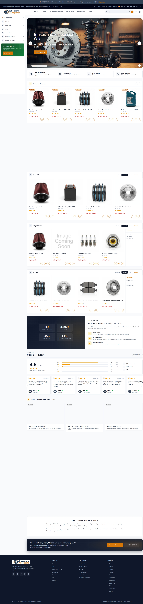

# Home Page — Auto Parts Variant

Live demo: <https://eshopping-autoparts-demo.mybigcommerce.com>

{ loading=lazy }

!!! note "Before you start"
    Theme installed, **AutoParts** variation picked, **AutoParts** product + widget data imported.

The AutoParts variation **already populates** many settings when you pick it (colors, fonts, trust strip, newsletter, promo text, SEO text, cart goals, and PDP shipping/warranty text). Other features below — popups, Frequently Bought Together, cross-sell, urgency signals, and recent-sales notifications — are theme defaults that are the same in every variation and active out of the box. The recipe below shows what's set automatically and what you may want to override.

The home page renders these sections in this order on the live demo:

1. Hero (Home Page Carousel)
2. Trust strip
3. Featured Products slider
4. New Arrivals slider
5. Products by Category
6. Value-prop callout (HTML widget — *"Auto Parts That Fit. Pricing That Drives…"*)
7. Brands carousel
8. Blog posts
9. Newsletter
10. About block (HTML widget — *"Your Complete Auto Parts Source"*)

## Section-by-section recipe

### 1. Variation

Theme Editor → **AutoParts**.

### 2. Colors — set automatically by the variation

These values are applied for you when you pick the variation:

| Color | Value |
| ----- | ----- |
| Primary accent | `#d97706` (amber) |
| Primary accent (dark) | `#b45309` |
| Primary accent (light) | `#f59e0b` |
| Primary accent (pale) | `#fffbeb` |
| Darkest neutral | `#020617` (cool slate) |
| Dark neutral | `#0f172a` |
| Lightest neutral | `#f8fafc` |
| Cream / background | `#f8fafc` |
| White | `#ffffff` |
| Sale badge background | `#dc2626` |
| Staff-pick badge background | `#b45309` |
| Active rating star | `#f59e0b` |
| Sale price | `#dc2626` |
| Original (struck-through) price | `#94a3b8` |

### 3. Fonts — set automatically

| Font | Value |
| ---- | ----- |
| Body font | Inter (weights 400, 500, 600) |
| Headings font | Inter (weights 600, 700) |
| Monospace font | IBM Plex Mono (weight 400) |

Root font size is `14px`.

### 4. Top banner

Banner colors are set automatically by the variation:

| Color | Value |
| ----- | ----- |
| Banner background | `#334155` |
| Banner text | `#cbd5e1` |
| Banner link | `#f59e0b` |

The banner content itself comes from **Marketing → Banners** in your BigCommerce control panel; add your own message there.

### 5. Header — set automatically by the variation

| Setting | Value |
| ------- | ----- |
| Top bar background | `#020617` |
| Top bar text | `#94a3b8` |
| Nav background | `#ffffff` |
| Nav text | `#475569` |
| Nav search button | `#d97706` |
| Search box typing phrases | Search for brake pads… / Find oil filters & fluids… / Browse suspension parts… / Discover lighting & accessories… |
| Voice search | ✅ On |
| Welcome text | *(empty)* |

!!! tip "Welcome text"
    The welcome text field ships empty. Add your own short line (for example, *Find parts for your vehicle in seconds*) if you want one in the top bar.

### 6. Hero

The **Show hero** option is on, and the built-in **Home Page Carousel** is enabled.

1. **Storefront → Home Page Carousel** → upload your slides (a landscape size such as 1920 × 700 is a good starting point — this is general BigCommerce carousel guidance, not a fixed theme requirement).
2. eShopping → Homepage → **Show hero** is already on.

!!! note "Slide ideas *(suggestions only)*"
    These are just creative starting points, not demo settings:

    - "Performance parts. Built for the long haul." → button to /shop
    - "Find parts for your ride" → fitment / vehicle lookup

### 7. Trust strip — variation default

The **Show trust strip** option is turned on. The variation fills in four trust items, each with a title and description:

- **OEM Quality Parts** — Genuine & aftermarket parts you can trust
- **Fast Shipping** — Same-day dispatch on in-stock items
- **Free Returns** — Easy 30-day return policy
- **Expert Support** — ASE-certified advisors available

(Override if needed.)

### 8. Featured Products

**Show featured products** is on. The Featured slider shows products you flag as *Featured* in BigCommerce.

### 9. Bestselling

**Show bestselling** is on. However, the demo store has no bestseller sales data yet, so this slider **does not appear** on the live demo. It will start showing once orders generate bestseller data in your store.

### 10. New Arrivals

**Show new arrivals** is on.

### 11. Products by Category

**Show products by category** is on. Configuration set by the variation:

| Setting | Value |
| ------- | ----- |
| Category IDs | *(empty — auto-detects categories and shows the first 3, per the grid setting)* |
| Grid (categories, products per category, subcategories) | `3, 4, 6` — show 3 categories, 4 products each, up to 6 subcategories |
| Active tab | Featured |
| Bestselling tab | ✅ On |
| Featured tab | ✅ On |
| New tab | ✅ On |
| Reviews tab | ❌ Off |

### 12. Brands carousel

The homepage brands limit is `12`. Square logos display best.

### 13. Blog

The homepage blog posts count is `3`. The Blog section shows your three most recent posts.

### 14. Newsletter — variation default

The **Show newsletter** option is turned on. The variation sets the heading and description:

- Heading: Get *Parts Updates* & Deals
- Description: New arrivals, fitment guides, and exclusive discounts delivered weekly.

### 15. SEO text — pre-filled but hidden

The variation **pre-fills** SEO text, but the **Show SEO text** toggle is **off**, so it does **not** display on the home page by default. Turn the toggle on if you want it shown.

The pre-filled text is:

```
Quality Auto Parts & Accessories|Your trusted source for OEM and aftermarket automotive parts. We carry a comprehensive selection of brakes, filters, suspension components, batteries, and lighting.|Browse thousands of parts with verified vehicle fitment. Shop with confidence knowing every part meets or exceeds OE specifications.
```

### 16. Promo, cart goals & PDP info

The cart goals and the PDP shipping/warranty text below are **set by the AutoParts variation**. Frequently Bought Together and Cross-sell use the **theme defaults** (the same values in every variation) and are active out of the box.

| Setting | Value |
| ------- | ----- |
| Sidebar / cart promo | Title "Free Shipping $250+", description "Free ground shipping on qualifying parts orders.", button "Shop Parts" linking to /shipping/ |
| Cart goal milestones *(variation)* | $50 → Free Shipping, $100 → 10% Off, $200 → Free Gift |
| PDP shipping info *(variation)* | Free Shipping (on parts orders over $250), Fitment Guarantee (verified compatibility), 30-Day Returns (no-hassle policy) |
| PDP warranty info *(variation)* | What's Covered, What's Not Covered, How to Claim, Extended Warranty (4-card grid) |
| Frequently Bought Together *(theme default)* | 2 items, 0% bundle discount |
| Cross-sell count *(theme default)* | 6 (product page), 4 (cart drawer) |

### 17. Urgency & social proof

These are **theme defaults** (the same in every variation) and are active out of the box.

| Setting | Value |
| ------- | ----- |
| Show "people viewing" count | ✅ On |
| Show "last ordered" notice | ✅ On |
| Recent-sales popups | Shown on all pages |

!!! note "Where these appear & how the numbers are generated"
    The "people viewing" and "last ordered" signals render on **product pages**, not the home page. The figures are **simulated from configured ranges** — viewer counts between 3 and 25, and last-order times between 1 and 48 hours — they are not real-time analytics data.

Recent-sales notifications cycle through sample orders (e.g. California · 2 hours ago, Texas · 35 min ago, Florida · 4 hours ago, New York · 1 hour ago, Oregon · 6 hours ago).

### 18. Popups

These popups use the **theme defaults** (the same in every variation) and are active out of the box.

| Popup | Content |
| ----- | ------- |
| Newsletter popup | "Get 10% Off Your First Order" — "Sign up for our newsletter and receive an exclusive discount code." (shows after 20 seconds; reappears after 14 days) |
| Promo popup | "Spring Sale" — "Get 15% off your entire order with the code below." Code **SPRING15**, button "Shop Now" → / (shows after 5 seconds; reappears after 3 days) |
| Exit-intent popup | "Wait! Don't Go Empty-Handed" — "Here's a special 10% discount just for you." Code **STAY10**, button "Claim Discount" → / (discount style; on desktop triggers when the cursor leaves the top of the window, on mobile after 45 seconds of inactivity; reappears after 1 day) |

### 19. Home page marketing blocks (Page Builder HTML widgets)

Two content blocks on the home page are **HTML widgets** placed via Page Builder. They arrive with the demo **widget import**, not the theme settings, so they appear automatically after you import the AutoParts widget data:

| Block | Region | Heading |
| ----- | ------ | ------- |
| Value-prop callout | Below the Products by Category section | "Auto Parts That Fit. Pricing That Drives…" |
| About block | Below the Newsletter section | "Your Complete Auto Parts Source" |

To edit them, open **Storefront → Web Pages / Page Builder** and edit the corresponding HTML widgets.

---

## Final check

Click **Save → Publish**. Compare to <https://eshopping-autoparts-demo.mybigcommerce.com>.

---

## Next

- [Product page](product.md)
- [Category page](category.md)
- [Electronics →](home-electronics.md)
