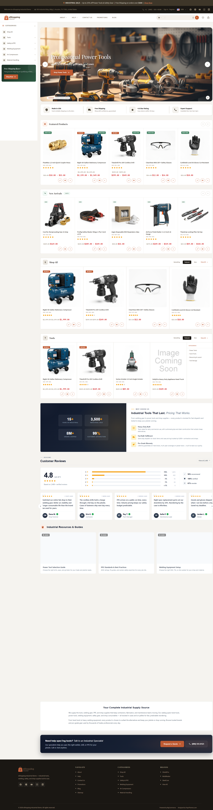

# Home Page — Industrial Variant

Live demo: <https://eshopping-industrial-demo.mybigcommerce.com>

{ loading=lazy }

!!! note "Before you start"
    Theme installed, **Industrial** variation picked in Page Builder's *Theme styles* dropdown, **Industrial** product + widget data imported via BC Tools.

The Industrial variation ships with its own warm "rust + bark" palette and serif headings. The two marketing blocks on the page (the value-prop callout and the about block) are **HTML Widgets** placed with Page Builder — they arrive with the demo widget import, not with theme settings.

What the live home page actually renders, top to bottom:

1. Hero (Home Page Carousel)
2. Trust strip
3. Featured Products slider
4. New Arrivals slider
5. Products by Category
6. HTML Widget — value-prop callout ("Industrial Tools That Last. Pricing That…")
7. Brands carousel
8. Blog posts
9. Newsletter
10. HTML Widget — about block ("Your Complete Industrial Supply Source")

## Section-by-section recipe

### 1. Variation

Theme Editor → **Industrial** (top dropdown).

### 2. Colors

The Industrial variation sets a warm rust-and-bark palette. These are the actual values:

| Color | Value |
| ----- | ----- |
| Terra | `#bf5b33` |
| Terra Light | `#d9845e` |
| Terra Dark | `#993f1f` |
| Terra Pale | `#fdf0e9` |
| Bark 950 | `#0f0d0a` |
| Bark 900 | `#1a1713` |
| Bark 50 | `#f5f3ef` |
| Cream | `#faf8f4` |
| White | `#ffffff` |

Badge, rating, and price colors:

| Color | Value |
| ----- | ----- |
| Sale badge background | `#bf5b33` |
| Staff pick badge background | `#3f8060` |
| Active rating star | `#f59e0b` |
| Sale price | `#dc2626` |
| Original (struck-through) price | `#978a74` |

Banner, top bar, and nav colors:

| Color | Value |
| ----- | ----- |
| Banner background | `#3e3629` |
| Banner text | `#d5cec2` |
| Banner link | `#d9845e` |
| Top bar background | `#1a1713` |
| Top bar text | `#978a74` |
| Nav background | `#ffffff` |
| Nav text | `#6b5e4f` |
| Nav search button | `#c75a2a` |

### 3. Fonts

| Font | Value |
| ---- | ------- |
| Body font | Source Sans 3 (weights 400, 600, 700) |
| Headings font | Playfair Display (weights 600, 400, 700) |
| Mono font | IBM Plex Mono (weight 400) |
| Root font size | `14` |

### 4. Header & search

eShopping Theme → Header:

| Setting | Value |
| ------- | ----- |
| Welcome text | *(empty)* |
| Enable voice search | On |
| Typing phrases (pipe \| separated) | `Search for power tools...` · `Find welding equipment...` · `Browse safety gear...` · `Discover compressors & accessories...` |

The four typing phrases rotate in the search box placeholder.

### 5. Hero

The hero is on (**Show hero** + **Home Page Carousel** both enabled). The slides themselves come from the store's **Storefront → Home Page Carousel** — upload your slide images there. The theme does not require a fixed slide size; use a wide landscape image (JPG or WebP) and keep all slides the same dimensions so they line up.

!!! tip "Slide ideas (suggestions only)"
    The demo's actual slides come from the Home Page Carousel. If you're building your own, these themes work well for an industrial catalog:

    | Slide | Image content | Heading | CTA |
    | :---: | ------------- | ------- | --- |
    | 1 | Workshop floor with tools | **Built to last. Priced to move.** | `Shop the catalog` |
    | 2 | Safety gear hero | **Safety first, every shift.** | `Browse safety` |
    | 3 | Bulk warehouse shot | **Bulk pricing on 100+ orders** | `Get a quote` |

### 6. Trust strip

eShopping Theme → Homepage Sections → **Show Trust Strip** is on. Four items, each a title and a description:

| Title | Description |
| ----- | ----------- |
| Made in USA | Fast & reliable shipping on all orders |
| Free Shipping | Shop with confidence, guaranteed |
| 4.8 Star Rating | Easy returns within 30 days |
| Expert Support | Available Mon-Sat, 9am-6pm |

### 7. Featured Products

eShopping Theme → Homepage Sections → **Show Featured Products** is on.

In **Catalog → Products** mark products as **Featured** — they auto-render in the slider.

### 8. New Arrivals

eShopping Theme → Homepage Sections → **Show New Arrivals** is on. Recently added products render here automatically.

### 9. Bestselling Products

eShopping Theme → Homepage Sections → **Show Best Sellers** is on.

!!! warning "Won't appear until you have sales data"
    The toggle is enabled, but the demo store has no bestseller / sales data yet, so the Bestselling slider does **not** appear on the live home page. It will show once the store accumulates sales and bestseller data.

### 10. Products by Category

eShopping Theme → Homepage Sections → **Show products by category** is on.

eShopping Theme → Products by Category section:

| Setting | Value |
| ------- | ----- |
| Category IDs | *(empty — auto: shows all top-level categories)* |
| Grid layout | `3,4,6` (up to 3 categories, 4 products per category, 6 subcategories shown) |
| Default active tab | Featured |
| Show Bestselling tab | On |
| Show Featured tab | On |
| Show New Arrivals tab | On |
| Show Reviews tab (the "Top Rated" tab) | Off |

!!! note "Category IDs left empty on purpose"
    With no IDs entered, the section automatically pulls all top-level categories — no need to look up or type any IDs.

### 11. Brands carousel

eShopping Theme → Homepage Sections → **Homepage Brands Limit**: `12`. Upload brand logos in **Catalog → Brands** — transparent PNGs work best, and keeping all logos a consistent size helps them sit evenly in the carousel.

### 12. Blog posts

Blog posts count: `3`. This count is set in the standard **Homepage** Theme-Editor panel (not the eShopping Theme panel). Posts come from **Storefront → Blog**.

### 13. Newsletter

eShopping Theme → Homepage Sections → **Show Newsletter** is on. The heading and description (the `<em>` wraps the italic emphasis):

- **Heading:** Stay Updated with *Our Newsletter*
- **Description:** Product launches, field tips, and exclusive offers in your inbox.

The signup writes to **Customers → Subscribers**.

### 14. Marketing blocks (HTML Widgets via Page Builder)

Two content blocks on the home page are **HTML Widgets** placed through Page Builder, not theme settings. They come in with the demo widget import. To edit them: **Storefront → My Themes → Customize → Page Builder**, click the widget on the home page, and edit its content.

| Widget | Heading (starts with) | Position |
| ------ | --------------------- | -------- |
| Value-prop callout | "Industrial Tools That Last. Pricing That…" | Below Products by Category |
| About block | "Your Complete Industrial Supply Source" | Below Newsletter |

## Beyond the home page

These Industrial settings drive other pages and on-site widgets. They're set by the variation — listed here so you know what to expect.

### Top banner

eShopping Theme → Banner. Banner colors are listed in the Colors table above (dark `#3e3629` background, `#d5cec2` text, `#d9845e` link).

### Promo bar

- **Text:** Free Shipping $500+ — Free ground shipping on qualifying orders.
- **Button:** Shop Now → `/shipping/`

### Cart free-shipping / reward goals

Progress goals shown in the cart drawer:

| Threshold | Reward |
| --------- | ------ |
| $50 | Free Shipping |
| $100 | 10% Off |
| $150 | Free Gift |

### Cart cross-sell ("You May Also Like")

A "You May Also Like" cross-sell block appears in the shopping cart: up to **6** items on the full cart page and up to **4** items in the slide-out cart drawer.

### Product page (PDP)

Shipping / warranty strip:

| Title | Detail |
| ----- | ------ |
| Free Shipping | on orders over $500 |
| 1-Year Warranty | included with purchase |
| 30-Day Returns | hassle-free policy |

Warranty accordion:

| Section | Content |
| ------- | ------- |
| What's Covered | Manufacturing defects, material failures, broken welds, and faulty components under normal field use conditions. |
| What's Not Covered | Damage from misuse, improper maintenance, normal wear and tear, or unauthorized modifications. |
| How to Claim | Contact us with your order number and description of the issue. |
| Extended Warranty | Extend your coverage for additional protection. Contact us for details. |

**Frequently Bought Together:** shows `2` products, discount `0%`.

### Urgency & social proof

- **Live view count** and **last order time** are both on.
- **Recent sales pop-ups** show on **all pages**, cycling through demo sales from California, Texas, Florida, New York, and Oregon.

### Pop-ups

**Newsletter pop-up:**

- **Text:** Get 10% Off Your First Order — Sign up for our newsletter and receive an exclusive discount code.
- **Options:** shows after 20 seconds; reappears after 14 days.

**Promo pop-up:**

- **Heading:** Spring Sale
- **Body:** Get 15% off your entire order with the code below.
- **Code:** `SPRING15`
- **Button:** Shop Now → `/`
- **Options:** shows after 5 seconds; reappears after 3 days.

**Exit-intent pop-up:**

- **Heading:** Wait! Don't Go Empty-Handed
- **Body:** Here's a special 10% discount just for you.
- **Code:** `STAY10`
- **Button:** Claim Discount → `/`
- **Options:** discount type. On desktop it triggers when the mouse leaves the top of the viewport (after at least 5 seconds on the page); on mobile it triggers after 45 seconds of inactivity. It reappears at most once per day.

---

## Final check

Click **Save → Publish**. Open the storefront in a private browser window. Compare to <https://eshopping-industrial-demo.mybigcommerce.com>.

---

## Next

- [Product page](product.md)
- [Category page](category.md)
- [Other variant home pages →](home-overview.md)
