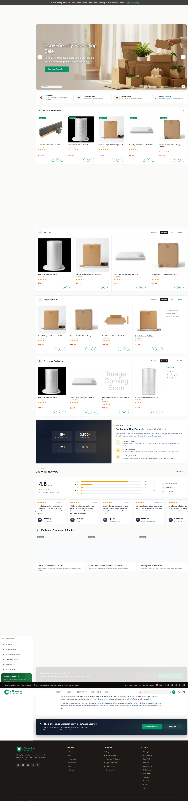
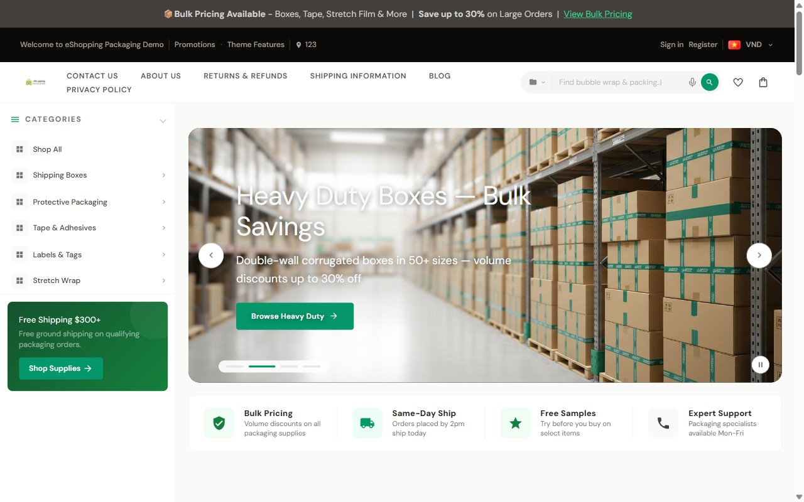
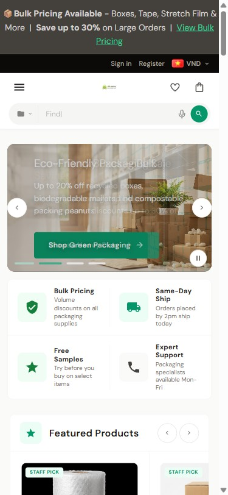
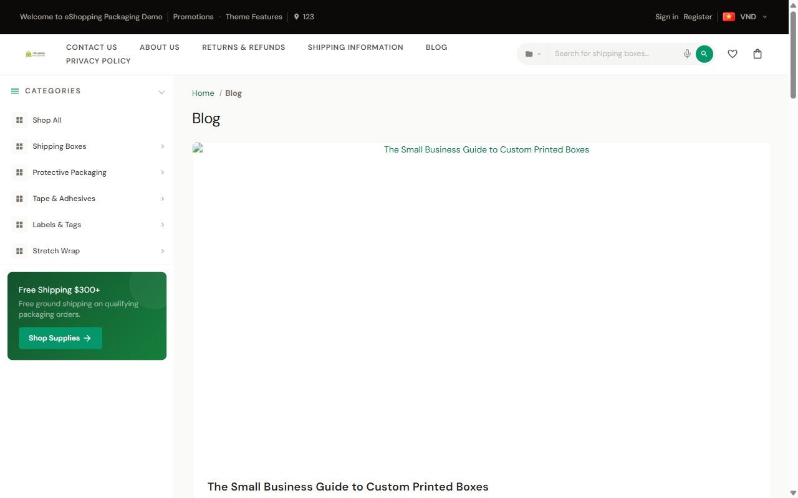
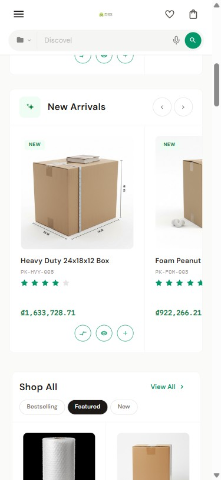

# Home Page — Packaging Variant

Live demo: <https://eshopping-packaging-demo.mybigcommerce.com>

{ loading=lazy }

{ loading=lazy }
{ loading=lazy }

!!! note "Before you start"
    Theme installed, **Packaging** variation picked, **Packaging** product + widget data imported.

The Packaging variation **already populates** most settings (colors, fonts, trust strip, newsletter, promo, cart goal, PDP info, popups). The recipe below shows what's set automatically, **and — for every section — exactly where to change it yourself** (Theme Editor field + id, a Page Builder widget, or a BigCommerce admin screen).

!!! info "How the live demo home page is composed, top to bottom"
    The Packaging home has **five** AI HTML Generator | PapaThemes marketing widgets plus a footer tagline widget. Three sit below Products by Category; two sit below the Newsletter.

    1. Hero (BigCommerce Home Page Carousel)
    2. Trust strip
    3. Featured Products slider
    4. New Arrivals slider
    5. Products by Category
    6. **Why Choose Us** value-prop callout — AI HTML Generator widget, `home_below_products_by_category` sort 0
    7. **Customer Reviews** carousel — AI HTML Generator widget, `home_below_products_by_category` sort 1
    8. **Resources** (Packaging Resources & Guides) — AI HTML Generator widget, `home_below_products_by_category` sort 2
    9. Brands carousel
    10. Blog posts
    11. Newsletter
    12. **About** block — AI HTML Generator widget, `home_below_newsletter` sort 0
    13. **Talk to an Expert** CTA bar — AI HTML Generator widget, `home_below_newsletter` sort 1

    The **Footer tagline** (a sixth AI HTML Generator widget, in the global `eshopping_footer_description--global` region) renders inside the footer on every page. See [Footer tagline](widgets-papathemes.md#footer-tagline).
## Section-by-section recipe

### 1. Variation

Theme Editor → **Packaging**.

<!--te-src:PiAqKkN1c3RvbWl6ZToqKiBUaGVtZSBFZGl0b3Ig4oaSIHZhcmlhdGlvbiBkcm9wZG93biAodG9wIG9mIHRoZSBwYW5lbCkg4oaSIHBpY2sgKipQYWNrYWdpbmcqKi4gU3dpdGNoaW5nIHZhcmlhdGlvbnMgcmUtYXBwbGllcyB0aGF0IHZhcmlhdGlvbidzIGJ1bmRsZWQgZGVmYXVsdHMuIChOb3QgYSBzaW5nbGUgZmllbGQg4oCUIGl0IGlzIHRoZSB2YXJpYXRpb24gc2VsZWN0b3IgaXRzZWxmLik=-->
<!--te-mock--><div class="te-mock te-mock--styles"><div class="te-mock__hd"><span>Styles</span><span class="te-x">✕</span></div><div class="te-mock__grp">Theme variation</div><div class="te-mock__row"><span class="te-lbl">Industrial</span></div><div class="te-mock__row"><span class="te-lbl">AutoParts</span></div><div class="te-mock__row"><span class="te-lbl">Electronics</span></div><div class="te-mock__row"><span class="te-lbl">Packaging</span><span class="te-check">✓</span></div></div>

### 2. Colors — set automatically

These values are applied for you when you pick the variation:

<!--te-tbl:fCBDb2xvciB8IFZhbHVlIHwgVGhlbWUgRWRpdG9yIGZpZWxkIGlkIHwKfCAtLS0tLSB8IC0tLS0tIHwgLS0tLS0tLS0tLS0tLS0tLS0tLS0tIHwKfCBQcmltYXJ5IGFjY2VudCB8IGAjMDU5NjY5YCAoZW1lcmFsZCkgfCBgZXNob3BwaW5nLWNvbG9yLXRlcnJhYCB8CnwgUHJpbWFyeSBhY2NlbnQgKGRhcmspIHwgYCMwNDc4NTdgIHwgYGVzaG9wcGluZy1jb2xvci10ZXJyYS1kYXJrYCB8CnwgUHJpbWFyeSBhY2NlbnQgKGxpZ2h0KSB8IGAjMzRkMzk5YCB8IGBlc2hvcHBpbmctY29sb3ItdGVycmEtbGlnaHRgIHwKfCBQcmltYXJ5IGFjY2VudCAocGFsZSkgfCBgI2VjZmRmNWAgfCBgZXNob3BwaW5nLWNvbG9yLXRlcnJhLXBhbGVgIHwKfCBEYXJrZXN0IG5ldXRyYWwgfCBgIzBjMGEwOWAgKHdhcm0gc3RvbmUpIHwgYGVzaG9wcGluZy1jb2xvci1iYXJrLTk1MGAgfAp8IERhcmsgbmV1dHJhbCB8IGAjMWMxOTE3YCB8IGBlc2hvcHBpbmctY29sb3ItYmFyay05MDBgIHwKfCBMaWdodGVzdCBuZXV0cmFsIHwgYCNmYWZhZjlgIHwgYGVzaG9wcGluZy1jb2xvci1iYXJrLTUwYCB8CnwgQ3JlYW0gLyBiYWNrZ3JvdW5kIHwgYCNmYWZhZjlgIHwgYGVzaG9wcGluZy1jb2xvci1jcmVhbWAgfAp8IFNhbGUgYmFkZ2UgYmFja2dyb3VuZCB8IGAjZGMyNjI2YCB8IGBlc2hvcHBpbmctYmFkZ2Utc2FsZS1iZ2AgfAp8IFN0YWZmLXBpY2sgYmFkZ2UgYmFja2dyb3VuZCB8IGAjMDU5NjY5YCB8IGBlc2hvcHBpbmctYmFkZ2Utc3RhZmYtYmdgIHwKfCBBY3RpdmUgcmF0aW5nIHN0YXIgfCBgI2Y1OWUwYmAgfCBgZXNob3BwaW5nLXJhdGluZy1zdGFyLWFjdGl2ZWAgfAp8IFNhbGUgcHJpY2UgfCBgI2RjMjYyNmAgfCBgZXNob3BwaW5nLXByaWNlLXNhbGVgIHwKfCBPcmlnaW5hbCAoc3RydWNrLXRocm91Z2gpIHByaWNlIHwgYCNhOGEyOWVgIHwgYGVzaG9wcGluZy1wcmljZS1vcmlnaW5hbGAgfA==-->

<!--te-src:PiAqKkN1c3RvbWl6ZToqKiBUaGVtZSBFZGl0b3Ig4oaSICpDb2xvcnMqIOKGkiB0aGUgbWF0Y2hpbmcgY29sb3IgcGlja2VyIChpZHMgYWJvdmUpLiBGb3JtYXQ6IGhleCBjb2xvci4gU2VlIFtDb2xvcnMgJiBmb250c10oY29sb3JzLWFuZC1mb250cy5tZCkgZm9yIHRoZSBmdWxsIHBhbGV0dGUu-->
<!--te-mock--><div class="te-mock"><div class="te-mock__hd"><span>eShopping Theme</span><span class="te-x">✕</span></div><div class="te-mock__row"><span class="te-lbl">Primary accent</span><span class="te-color"><span class="te-hex">#059669</span><span class="te-sw" style="background:#059669"></span></span></div><div class="te-mock__row"><span class="te-lbl">Primary accent (dark)</span><span class="te-color"><span class="te-hex">#047857</span><span class="te-sw" style="background:#047857"></span></span></div><div class="te-mock__row"><span class="te-lbl">Primary accent (light)</span><span class="te-color"><span class="te-hex">#34D399</span><span class="te-sw" style="background:#34d399"></span></span></div><div class="te-mock__row"><span class="te-lbl">Primary accent (pale)</span><span class="te-color"><span class="te-hex">#ECFDF5</span><span class="te-sw" style="background:#ecfdf5"></span></span></div><div class="te-mock__row"><span class="te-lbl">Darkest neutral</span><span class="te-color"><span class="te-hex">#0C0A09</span><span class="te-sw" style="background:#0c0a09"></span></span></div><div class="te-mock__row"><span class="te-lbl">Dark neutral</span><span class="te-color"><span class="te-hex">#1C1917</span><span class="te-sw" style="background:#1c1917"></span></span></div><div class="te-mock__row"><span class="te-lbl">Lightest neutral</span><span class="te-color"><span class="te-hex">#FAFAF9</span><span class="te-sw" style="background:#fafaf9"></span></span></div><div class="te-mock__row"><span class="te-lbl">Cream / background</span><span class="te-color"><span class="te-hex">#FAFAF9</span><span class="te-sw" style="background:#fafaf9"></span></span></div><div class="te-mock__row"><span class="te-lbl">Sale badge background</span><span class="te-color"><span class="te-hex">#DC2626</span><span class="te-sw" style="background:#dc2626"></span></span></div><div class="te-mock__row"><span class="te-lbl">Staff-pick badge background</span><span class="te-color"><span class="te-hex">#059669</span><span class="te-sw" style="background:#059669"></span></span></div><div class="te-mock__row"><span class="te-lbl">Active rating star</span><span class="te-color"><span class="te-hex">#F59E0B</span><span class="te-sw" style="background:#f59e0b"></span></span></div><div class="te-mock__row"><span class="te-lbl">Sale price</span><span class="te-color"><span class="te-hex">#DC2626</span><span class="te-sw" style="background:#dc2626"></span></span></div><div class="te-mock__row"><span class="te-lbl">Original (struck-through) price</span><span class="te-color"><span class="te-hex">#A8A29E</span><span class="te-sw" style="background:#a8a29e"></span></span></div></div>

### 3. Fonts — set automatically

<!--te-tbl:fCBGb250IHwgVmFsdWUgfCBUaGVtZSBFZGl0b3IgZmllbGQgaWQgfAp8IC0tLS0gfCAtLS0tLSB8IC0tLS0tLS0tLS0tLS0tLS0tLS0tLSB8CnwgQm9keSBmb250IHwgRE0gU2FucyAod2VpZ2h0cyA0MDAsIDUwMCkgfCBgYm9keS1mb250YCB8CnwgSGVhZGluZ3MgZm9udCB8IERNIFNhbnMgKHdlaWdodHMgNjAwLCA3MDApIHwgYGhlYWRpbmdzLWZvbnRgIHwKfCBNb25vIGZvbnQgfCBJQk0gUGxleCBNb25vICh3ZWlnaHQgNDAwKSB8IGBlc2hvcHBpbmctbW9uby1mb250YCB8-->

<!--te-src:PiAqKkN1c3RvbWl6ZToqKiBUaGVtZSBFZGl0b3Ig4oaSICpUeXBvZ3JhcGh5KiDihpIgKipCb2R5IGZvbnQqKiAvICoqSGVhZGluZ3MgZm9udCoqIC8gKipNb25vIGZvbnQqKi4gRm9ybWF0OiBCaWdDb21tZXJjZSBmb250IHBpY2tlciAoR29vZ2xlIGZvbnQgKyB3ZWlnaHRzKS4gU2VlIFtDb2xvcnMgJiBmb250c10oY29sb3JzLWFuZC1mb250cy5tZCku-->
<!--te-mock--><div class="te-mock"><div class="te-mock__hd"><span>Typography</span><span class="te-x">✕</span></div><div class="te-mock__row"><span class="te-fld"><span class="te-lbl">Body font</span><span class="te-desc">DM Sans (weights 400, 500)</span></span><span class="te-dd"><span class="te-dd__v"></span><span class="te-dd__b">▾</span></span></div><div class="te-mock__row"><span class="te-fld"><span class="te-lbl">Headings font</span><span class="te-desc">DM Sans (weights 600, 700)</span></span><span class="te-dd"><span class="te-dd__v"></span><span class="te-dd__b">▾</span></span></div><div class="te-mock__row"><span class="te-fld"><span class="te-lbl">Mono font</span><span class="te-desc">IBM Plex Mono (weight 400)</span></span><span class="te-dd"><span class="te-dd__v"></span><span class="te-dd__b">▾</span></span></div></div>

### 4. Top banner

Banner colors set by the variation:

<!--te-tbl:fCBDb2xvciB8IFZhbHVlIHwgVGhlbWUgRWRpdG9yIGZpZWxkIGlkIHwKfCAtLS0tLSB8IC0tLS0tIHwgLS0tLS0tLS0tLS0tLS0tLS0tLS0tIHwKfCBCYW5uZXIgYmFja2dyb3VuZCB8IGAjNDQ0MDNjYCB8IGBlc2hvcHBpbmctYmFubmVyLWJnYCB8CnwgQmFubmVyIHRleHQgfCBgI2Q2ZDNkMWAgfCBgZXNob3BwaW5nLWJhbm5lci1jb2xvcmAgfAp8IEJhbm5lciBsaW5rIHwgYCMzNGQzOTlgIHwgYGVzaG9wcGluZy1iYW5uZXItbGlua2AgfA==-->

<!--te-src:PiAqKkN1c3RvbWl6ZSAoY29sb3JzKToqKiBUaGVtZSBFZGl0b3Ig4oaSICpUb3AgQmFubmVyKiDihpIgKipCYW5uZXIgYmFja2dyb3VuZCAvIHRleHQgLyBsaW5rKiogKGlkcyBhYm92ZSkuIEZvcm1hdDogaGV4IGNvbG9yLg==-->
<!--te-src:PiAqKkN1c3RvbWl6ZSAobWVzc2FnZSk6KiogQmlnQ29tbWVyY2UgYWRtaW4g4oaSICoqTWFya2V0aW5nIOKGkiBCYW5uZXJzKiouIFRoZSBiYW5uZXIgKmNvbnRlbnQqIGlzIHN0b3JlIGRhdGEsIG5vdCBhIHRoZW1lIHNldHRpbmcg4oCUIGFkZCB5b3VyIG93biBjYXJib24tbmV1dHJhbCAvIGJ1bGstcXVvdGUgbWVzc2FnaW5nIHRoZXJlLg==-->
<!--te-mock--><div class="te-mock"><div class="te-mock__hd"><span>eShopping Theme</span><span class="te-x">✕</span></div><div class="te-mock__row"><span class="te-lbl">Banner background</span><span class="te-color"><span class="te-hex">#44403C</span><span class="te-sw" style="background:#44403c"></span></span></div><div class="te-mock__row"><span class="te-lbl">Banner text</span><span class="te-color"><span class="te-hex">#D6D3D1</span><span class="te-sw" style="background:#d6d3d1"></span></span></div><div class="te-mock__row"><span class="te-lbl">Banner link</span><span class="te-color"><span class="te-hex">#34D399</span><span class="te-sw" style="background:#34d399"></span></span></div></div>
<!--te-mock--><div class="te-mock te-nav"><div class="te-nav__brand">BigCommerce admin</div><div class="te-nav__top"><span>Home</span></div><div class="te-nav__top"><span>Orders</span></div><div class="te-nav__top"><span>Products</span><span class="te-nav__chev">⌄</span></div><div class="te-nav__top"><span>Customers</span><span class="te-nav__chev">⌄</span></div><div class="te-nav__top"><span>Storefront</span><span class="te-nav__chev">⌄</span></div><div class="te-nav__top is-open"><span>Marketing</span><span class="te-nav__chev">⌃</span></div><div class="te-nav__sub is-active">Banners</div><div class="te-nav__sub">Coupon codes</div><div class="te-nav__sub">Gift certificates</div><div class="te-nav__sub">Abandoned cart saver</div><div class="te-nav__top"><span>Analytics</span></div><div class="te-nav__top"><span>Settings</span><span class="te-nav__chev">⌄</span></div></div>

### 5. Header

| Setting | Value | Field id |
| ------- | ----- | -------- |
| Top bar background | `#0c0a09` | `eshopping-topbar-bg` |
| Top bar text | `#a8a29e` | `eshopping-topbar-color` |
| Nav background | `#ffffff` | `eshopping-nav-bg` |
| Nav text | `#57534e` | `eshopping-nav-color` |
| Nav search button | `#059669` | `eshopping-nav-search-btn` |
| Search box typing phrases | `Search for shipping boxes...` / `Find bubble wrap & packing...` / `Browse tape & labels...` / `Discover mailer bags & envelopes...` | `eshopping-search-typing-phrases` |
| Voice search | On | `eshopping-search-voice` |
| Welcome text | *(empty in the demo)* | `eshopping-welcome-text` |

<!--te-src:PiAqKkN1c3RvbWl6ZSAoc2VhcmNoIHBocmFzZXMpOioqIFRoZW1lIEVkaXRvciDihpIgKkhlYWRlciAmIFNlYXJjaCog4oaSICoqVHlwaW5nIHBocmFzZXMgKHBpcGUgYHxgIHNlcGFyYXRlZCkqKiAoYGVzaG9wcGluZy1zZWFyY2gtdHlwaW5nLXBocmFzZXNgKS4gRm9ybWF0OiBwaHJhc2VzIHNlcGFyYXRlZCBieSBgfGAuIERlbW86IGZvdXIgcGlwZSBzZWdtZW50cy4=-->
<!--te-src:PiAqKkN1c3RvbWl6ZSAodm9pY2Ugc2VhcmNoKToqKiBUaGVtZSBFZGl0b3Ig4oaSICpIZWFkZXIgJiBTZWFyY2gqIOKGkiAqKkVuYWJsZSB2b2ljZSBzZWFyY2gqKiAoYGVzaG9wcGluZy1zZWFyY2gtdm9pY2VgKS4gRGVmYXVsdDogYHRydWVgLg==-->
<!--te-src:PiAqKkN1c3RvbWl6ZSAod2VsY29tZSB0ZXh0KToqKiBUaGVtZSBFZGl0b3Ig4oaSICpIZWFkZXIgJiBTZWFyY2gqIOKGkiAqKldlbGNvbWUgVGV4dCoqIChgZXNob3BwaW5nLXdlbGNvbWUtdGV4dGApLiBGb3JtYXQ6IHBsYWluIHRleHQuIERlZmF1bHQ6ICooZW1wdHkpKi4=-->
<!--te-src:PiAqKkN1c3RvbWl6ZSAobG9nbywgcGhvbmUsIGFkZHJlc3MsIHNvY2lhbCwgbWVudSk6KiogQmlnQ29tbWVyY2UgYWRtaW4gLyBzdG9yZSBkYXRhIOKAlCBzZWUgW0hlYWRlciAmIHRvcCBiYXJdKGhlYWRlci1hbmQtdG9wYmFyLm1kKS4=-->
<!--te-mock--><div class="te-mock"><div class="te-mock__hd"><span>Header &amp; Search</span><span class="te-x">✕</span></div><div class="te-mock__row"><span class="te-lbl">Typing phrases (pipe | separated)</span><span class="te-tx te-tx--ph">Enter text…</span></div><div class="te-mock__row"><span class="te-lbl">Enable voice search</span><span class="te-cb is-on"></span></div><div class="te-mock__row"><span class="te-fld"><span class="te-lbl">Welcome Text</span><span class="te-desc">(empty in the demo)</span></span><span class="te-tx te-tx--ph">Enter text…</span></div></div>
<!--te-mock--><div class="te-mock te-nav"><div class="te-nav__brand">BigCommerce admin</div><div class="te-nav__top"><span>Home</span></div><div class="te-nav__top"><span>Orders</span></div><div class="te-nav__top is-open"><span>Products</span><span class="te-nav__chev">⌃</span></div><div class="te-nav__sub">All products</div><div class="te-nav__sub">Add</div><div class="te-nav__sub">Categories</div><div class="te-nav__sub">Options</div><div class="te-nav__sub">Filtering</div><div class="te-nav__sub">Reviews</div><div class="te-nav__sub">Brands</div><div class="te-nav__sub">Import</div><div class="te-nav__sub">Export</div><div class="te-nav__top"><span>Customers</span><span class="te-nav__chev">⌄</span></div><div class="te-nav__top"><span>Storefront</span><span class="te-nav__chev">⌄</span></div><div class="te-nav__top"><span>Marketing</span><span class="te-nav__chev">⌄</span></div><div class="te-nav__top"><span>Analytics</span></div><div class="te-nav__top"><span>Settings</span><span class="te-nav__chev">⌄</span></div></div>

### 6. Hero

The demo uses the built-in hero driven by the BigCommerce Home Page Carousel:

1. In your BigCommerce admin, open the **Home Page Carousel** (Storefront → Carousel) and upload your slides.
2. The hero appears whenever the BigCommerce carousel is on (`homepage_show_carousel`) and at least one slide exists.

!!! note "There is no separate \"Show hero\" toggle"
    An older `eshopping-show-hero` toggle was **removed** from the theme. The hero is now gated **only** by **Show carousel** (`homepage_show_carousel`) plus having carousel slides — nothing else.

<!--te-src:PiAqKkN1c3RvbWl6ZSAoY2Fyb3VzZWwgdG9nZ2xlKToqKiBUaGVtZSBFZGl0b3Ig4oaSICpIb21lcGFnZSog4oaSICoqU2hvdyBjYXJvdXNlbCoqIChgaG9tZXBhZ2Vfc2hvd19jYXJvdXNlbGAsIGRlZmF1bHQgYHRydWVgKS4=-->
<!--te-src:PiAqKkN1c3RvbWl6ZSAoc2xpZGVzKToqKiBCaWdDb21tZXJjZSBhZG1pbiDihpIgKipTdG9yZWZyb250IOKGkiBDYXJvdXNlbCoqLiBTbGlkZSBpbWFnZXMsIGhlYWRpbmdzLCBhbmQgbGlua3MgYXJlIHN0b3JlIGRhdGEsIG5vdCB0aGVtZSBzZXR0aW5ncy4=-->
<!--te-mock--><div class="te-mock"><div class="te-mock__hd"><span>Homepage</span><span class="te-x">✕</span></div><div class="te-mock__row"><span class="te-lbl">Show carousel</span><span class="te-cb is-on"></span></div></div>
<!--te-mock--><div class="te-mock te-nav"><div class="te-nav__brand">BigCommerce admin</div><div class="te-nav__top"><span>Home</span></div><div class="te-nav__top"><span>Orders</span></div><div class="te-nav__top"><span>Products</span><span class="te-nav__chev">⌄</span></div><div class="te-nav__top"><span>Customers</span><span class="te-nav__chev">⌄</span></div><div class="te-nav__top is-open"><span>Storefront</span><span class="te-nav__chev">⌃</span></div><div class="te-nav__sub">Themes</div><div class="te-nav__sub">Logo</div><div class="te-nav__sub">Home page carousel</div><div class="te-nav__sub">Social media links</div><div class="te-nav__sub">Script manager</div><div class="te-nav__sub">Web pages</div><div class="te-nav__sub">Blog</div><div class="te-nav__sub">Image manager</div><div class="te-nav__sub is-active">Carousel</div><div class="te-nav__top"><span>Marketing</span><span class="te-nav__chev">⌄</span></div><div class="te-nav__top"><span>Analytics</span></div><div class="te-nav__top"><span>Settings</span><span class="te-nav__chev">⌄</span></div></div>

!!! tip "Slide ideas (suggestions only)"
    These are starting points, not demo content:

    | Slide | Image | Heading | Sub | CTA |
    | :---: | ----- | ------- | --- | --- |
    | 1 | Lifestyle shot of recyclable boxes | **Packaging that protects more than products.** | Recyclable, compostable, beautiful. | `Shop the catalog` → /catalog |
    | 2 | Stack of mailers with kraft texture | **Custom-printed mailers** | From 25 units. Turnaround in 7 days. | `Start a quote` → /quote |

### 7. Trust strip — variation default (enabled)

**Show trust strip** (`eshopping-show-trust-strip`) is on. The variation fills in **four trust items, each a title + description pair** — eight pipe-delimited segments in `eshopping-trust-text`:

`Bulk Pricing|Volume discounts on all packaging supplies|Same-Day Ship|Orders placed by 2pm ship today|Free Samples|Try before you buy on select items|Expert Support|Packaging specialists available Mon-Fri`

- **Bulk Pricing** — Volume discounts on all packaging supplies
- **Same-Day Ship** — Orders placed by 2pm ship today
- **Free Samples** — Try before you buy on select items
- **Expert Support** — Packaging specialists available Mon-Fri

<!--te-src:PiAqKkN1c3RvbWl6ZToqKiBUaGVtZSBFZGl0b3Ig4oaSICpIb21lcGFnZSog4oaSICoqVHJ1c3QgU3RyaXAgSXRlbXMqKiAoYGVzaG9wcGluZy10cnVzdC10ZXh0YCkg4oCUIGNvbnRlbnQgb2YgdGhlIHRydXN0IHN0cmlwLiBGb3JtYXQ6IHBpcGUgYHxgIHNlcGFyYXRlZCwgaW4gKip0aXRsZSwgZGVzY3JpcHRpb24qKiBwYWlycyAodHdvIHNlZ21lbnRzIHBlciBpdGVtOyBmb3VyIGl0ZW1zID0gZWlnaHQgc2VnbWVudHMpLiBUb2dnbGUgdGhlIHdob2xlIHN0cmlwIHdpdGggKipTaG93IFRydXN0IFN0cmlwKiogKGBlc2hvcHBpbmctc2hvdy10cnVzdC1zdHJpcGAsIGRlZmF1bHQgYHRydWVgKS4=-->
<!--te-mock--><div class="te-mock"><div class="te-mock__hd"><span>Homepage</span><span class="te-x">✕</span></div><div class="te-mock__row"><span class="te-lbl">Trust Strip Items</span><span class="te-tx te-tx--ph">Enter text…</span></div><div class="te-mock__row"><span class="te-lbl">title, description</span><span class="te-cb is-on"></span></div><div class="te-mock__row"><span class="te-lbl">Show Trust Strip</span><span class="te-cb is-on"></span></div></div>

### 8. Featured Products — enabled

**Show Featured Products** (`eshopping-show-featured`) is on. The Featured Products slider appears on the live demo, populated from products flagged as Featured in the catalog.

<!--te-src:PiAqKkN1c3RvbWl6ZSAodG9nZ2xlKToqKiBUaGVtZSBFZGl0b3Ig4oaSICpIb21lcGFnZSog4oaSICoqU2hvdyBGZWF0dXJlZCBQcm9kdWN0cyoqIChgZXNob3BwaW5nLXNob3ctZmVhdHVyZWRgLCBkZWZhdWx0IGB0cnVlYCku-->
<!--te-src:PiAqKkN1c3RvbWl6ZSAod2hpY2ggcHJvZHVjdHMpOioqIEJpZ0NvbW1lcmNlIGFkbWluIOKGkiAqKlByb2R1Y3RzIOKGkiBzZXQgIkZlYXR1cmVkIiBvbiBpbmRpdmlkdWFsIHByb2R1Y3RzKiouIChDYXRhbG9nIGRhdGEsIG5vdCBhIHRoZW1lIHNldHRpbmcuKQ==-->
<!--te-mock--><div class="te-mock"><div class="te-mock__hd"><span>Homepage</span><span class="te-x">✕</span></div><div class="te-mock__row"><span class="te-lbl">Show Featured Products</span><span class="te-cb is-on"></span></div></div>
<!--te-mock--><div class="te-mock te-nav"><div class="te-nav__brand">BigCommerce admin</div><div class="te-nav__top"><span>Home</span></div><div class="te-nav__top"><span>Orders</span></div><div class="te-nav__top is-open"><span>Products</span><span class="te-nav__chev">⌃</span></div><div class="te-nav__sub">All products</div><div class="te-nav__sub">Add</div><div class="te-nav__sub">Categories</div><div class="te-nav__sub">Options</div><div class="te-nav__sub">Filtering</div><div class="te-nav__sub">Reviews</div><div class="te-nav__sub">Brands</div><div class="te-nav__sub">Import</div><div class="te-nav__sub">Export</div><div class="te-nav__sub is-active">set &quot;Featured&quot; on indiv…</div><div class="te-nav__top"><span>Customers</span><span class="te-nav__chev">⌄</span></div><div class="te-nav__top"><span>Storefront</span><span class="te-nav__chev">⌄</span></div><div class="te-nav__top"><span>Marketing</span><span class="te-nav__chev">⌄</span></div><div class="te-nav__top"><span>Analytics</span></div><div class="te-nav__top"><span>Settings</span><span class="te-nav__chev">⌄</span></div></div>

### 9. New Arrivals — enabled

**Show New Arrivals** (`eshopping-show-new`) is on. The New Arrivals slider appears on the live demo.

<!--te-src:PiAqKkN1c3RvbWl6ZSAodG9nZ2xlKToqKiBUaGVtZSBFZGl0b3Ig4oaSICpIb21lcGFnZSog4oaSICoqU2hvdyBOZXcgQXJyaXZhbHMqKiAoYGVzaG9wcGluZy1zaG93LW5ld2AsIGRlZmF1bHQgYHRydWVgKS4=-->
<!--te-src:PiAqKkN1c3RvbWl6ZSAod2hpY2ggcHJvZHVjdHMpOioqIEJpZ0NvbW1lcmNlIGFkbWluIOKGkiBtb3N0IHJlY2VudGx5IGFkZGVkIHByb2R1Y3RzIHBvcHVsYXRlIHRoaXMgYXV0b21hdGljYWxseS4gKENhdGFsb2cgZGF0YSwgbm90IGEgdGhlbWUgc2V0dGluZy4p-->
<!--te-mock--><div class="te-mock"><div class="te-mock__hd"><span>Homepage</span><span class="te-x">✕</span></div><div class="te-mock__row"><span class="te-lbl">Show New Arrivals</span><span class="te-cb is-on"></span></div></div>
<!--te-mock--><div class="te-mock te-nav"><div class="te-nav__brand">BigCommerce admin</div><div class="te-nav__top"><span>Home</span></div><div class="te-nav__top"><span>Orders</span></div><div class="te-nav__top is-open"><span>Products</span><span class="te-nav__chev">⌃</span></div><div class="te-nav__sub">All products</div><div class="te-nav__sub">Add</div><div class="te-nav__sub">Categories</div><div class="te-nav__sub">Options</div><div class="te-nav__sub">Filtering</div><div class="te-nav__sub">Reviews</div><div class="te-nav__sub">Brands</div><div class="te-nav__sub">Import</div><div class="te-nav__sub">Export</div><div class="te-nav__top"><span>Customers</span><span class="te-nav__chev">⌄</span></div><div class="te-nav__top"><span>Storefront</span><span class="te-nav__chev">⌄</span></div><div class="te-nav__top"><span>Marketing</span><span class="te-nav__chev">⌄</span></div><div class="te-nav__top"><span>Analytics</span></div><div class="te-nav__top"><span>Settings</span><span class="te-nav__chev">⌄</span></div></div>

### 9b. Bestselling — enabled (will not display without sales data)

**Show Best Sellers** (`eshopping-show-bestselling`) is turned on. However, the demo store has no bestseller sales data yet, so the Bestselling slider **does not appear** on the live home page. It will display automatically once the store accumulates order/sales history.

<!--te-src:PiAqKkN1c3RvbWl6ZSAodG9nZ2xlKToqKiBUaGVtZSBFZGl0b3Ig4oaSICpIb21lcGFnZSog4oaSICoqU2hvdyBCZXN0IFNlbGxlcnMqKiAoYGVzaG9wcGluZy1zaG93LWJlc3RzZWxsaW5nYCwgZGVmYXVsdCBgdHJ1ZWApLiBCZXN0c2VsbGVyIHJhbmtpbmcgY29tZXMgZnJvbSBCaWdDb21tZXJjZSBvcmRlciBoaXN0b3J5IOKAlCB0aGVyZSBpcyBubyB0aGVtZSBmaWVsZCBmb3IgaXQu-->
<!--te-mock--><div class="te-mock"><div class="te-mock__hd"><span>Homepage</span><span class="te-x">✕</span></div><div class="te-mock__row"><span class="te-lbl">Show Best Sellers</span><span class="te-cb is-on"></span></div></div>

### 10. Products by Category — enabled

**Show Categories** (`eshopping-show-categories`) is on. Configuration as shipped:

<!--te-tbl:fCBTZXR0aW5nIHwgVmFsdWUgfCBGaWVsZCBpZCB8CnwgLS0tLS0tLSB8IC0tLS0tIHwgLS0tLS0tLS0gfAp8IENhdGVnb3J5IElEcyB8ICpFbXB0eSog4oCUIGF1dG8tZGV0ZWN0IHwgYGVzaG9wcGluZy1wYmNzdC1jYXRJRHNgIHwKfCBHcmlkIGxheW91dCB8IGAzLDQsNmAgfCBgZXNob3BwaW5nLXBiY3N0LWdyaWRgIHwKfCBEZWZhdWx0IGFjdGl2ZSB0YWIgfCAqKkZlYXR1cmVkKiogfCBgZXNob3BwaW5nLXBiY3N0LWFjdGl2ZWAgfAp8IFNob3cgQmVzdHNlbGxpbmcgdGFiIHwgT24gfCBgZXNob3BwaW5nLXBiY3N0LXNob3ctYmVzdHNlbGxpbmdgIHwKfCBTaG93IEZlYXR1cmVkIHRhYiB8IE9uIHwgYGVzaG9wcGluZy1wYmNzdC1zaG93LWZlYXR1cmVkYCB8CnwgU2hvdyBOZXcgdGFiIHwgT24gfCBgZXNob3BwaW5nLXBiY3N0LXNob3ctbmV3YCB8CnwgU2hvdyBSZXZpZXdzIHRhYiB8IE9mZiB8IGBlc2hvcHBpbmctcGJjc3Qtc2hvdy1yZXZpZXdzYCB8-->

!!! warning "Grid layout is `categories,products,subcategories` — not breakpoints"
    The `eshopping-pbcst-grid` value `3,4,6` is parsed (in `eShoppingProductsByCategory.js` and the section template) as **`categories, products, subcategories`**, **not** desktop/tablet/mobile columns:

    - `3` = how many category sections to show (when **Category IDs** is empty, the theme auto-detects the home categories and keeps the **first 3**).
    - `4` = how many products to show per category.
    - `6` = how many subcategory chips to show per category (`0` hides subcategory chips).

<!--te-src:PiAqKkN1c3RvbWl6ZSAodG9nZ2xlKToqKiBUaGVtZSBFZGl0b3Ig4oaSICpIb21lcGFnZSog4oaSICoqU2hvdyBDYXRlZ29yaWVzKiogKGBlc2hvcHBpbmctc2hvdy1jYXRlZ29yaWVzYCwgZGVmYXVsdCBgdHJ1ZWApLg==-->
<!--te-src:PiAqKkN1c3RvbWl6ZSAod2hpY2ggY2F0ZWdvcmllcyk6KiogVGhlbWUgRWRpdG9yIOKGkiAqSG9tZXBhZ2UqIOKGkiAqKkNhdGVnb3J5IElEcyAoY29tbWEgc2VwYXJhdGVkLCBsZWF2ZSBlbXB0eSBmb3IgYXV0by1kZXRlY3QpKiogKGBlc2hvcHBpbmctcGJjc3QtY2F0SURzYCkuIEZvcm1hdDogY29tbWEtc2VwYXJhdGVkIGNhdGVnb3J5IElEczsgZW1wdHkgPSBhdXRvLWRldGVjdCB0b3AtbGV2ZWwgY2F0ZWdvcmllcyAodGhlbiB0cmltbWVkIHRvIHRoZSBmaXJzdCBgY2F0ZWdvcmllc2AgY291bnQgZnJvbSB0aGUgZ3JpZCkuIERlZmF1bHQ6ICooZW1wdHkpKi4=-->
<!--te-src:PiAqKkN1c3RvbWl6ZSAoZ3JpZCk6KiogVGhlbWUgRWRpdG9yIOKGkiAqSG9tZXBhZ2UqIOKGkiAqKkdyaWQgbGF5b3V0OiBjYXRlZ29yaWVzLHByb2R1Y3RzLHN1YmNhdGVnb3JpZXMgKGUuZy4gMyw0LDYpKiogKGBlc2hvcHBpbmctcGJjc3QtZ3JpZGApLiBGb3JtYXQ6IHRocmVlIGNvbW1hLXNlcGFyYXRlZCBpbnRlZ2Vycy4gRGVmYXVsdDogYDMsNCw2YC4=-->
<!--te-src:PiAqKkN1c3RvbWl6ZSAoYWN0aXZlIHRhYik6KiogVGhlbWUgRWRpdG9yIOKGkiAqSG9tZXBhZ2UqIOKGkiAqKkRlZmF1bHQgYWN0aXZlIHRhYioqIChgZXNob3BwaW5nLXBiY3N0LWFjdGl2ZWApLiBPcHRpb25zOiBgYmVzdHNlbGxpbmdgIChCZXN0IFNlbGxpbmcpLCBgZmVhdHVyZWRgIChGZWF0dXJlZCksIGBuZXdlc3RgIChOZXcpLCBgYXZnY3VzdG9tZXJyZXZpZXdgIChUb3AgUmF0ZWQpLiBEZWZhdWx0OiBgZmVhdHVyZWRgLg==-->
<!--te-src:PiAqKkN1c3RvbWl6ZSAodmlzaWJsZSB0YWJzKToqKiBUaGVtZSBFZGl0b3Ig4oaSICpIb21lcGFnZSog4oaSICoqU2hvdyBCZXN0c2VsbGluZyB0YWIqKiAoYGVzaG9wcGluZy1wYmNzdC1zaG93LWJlc3RzZWxsaW5nYCwgY2hlY2tib3gpLCAqKlNob3cgRmVhdHVyZWQgdGFiKiogKGBlc2hvcHBpbmctcGJjc3Qtc2hvdy1mZWF0dXJlZGAsIGNoZWNrYm94KSwgKipTaG93IE5ldyB0YWIqKiAoYGVzaG9wcGluZy1wYmNzdC1zaG93LW5ld2AsIGNoZWNrYm94KSwgKipTaG93IFJldmlld3MgdGFiKiogKGBlc2hvcHBpbmctcGJjc3Qtc2hvdy1yZXZpZXdzYCwgY2hlY2tib3gpLg==-->
<!--te-mock--><div class="te-mock"><div class="te-mock__hd"><span>Homepage</span><span class="te-x">✕</span></div><div class="te-mock__row"><span class="te-lbl">Show Categories</span><span class="te-cb is-on"></span></div><div class="te-mock__row"><span class="te-fld"><span class="te-lbl">Category IDs (comma separated, leave empty for auto-detect)</span><span class="te-desc">Empty — auto-detect</span></span><span class="te-tx te-tx--ph">Enter text…</span></div><div class="te-mock__row"><span class="te-lbl">Grid layout: categories,products,subcategories (e.g. 3,4,6)</span><span class="te-tx">3,4,6</span></div><div class="te-mock__row"><span class="te-lbl">Default active tab</span><span class="te-tx">bestselling</span></div><div class="te-mock__row"><span class="te-lbl">Show Bestselling tab</span><span class="te-cb is-on"></span></div><div class="te-mock__row"><span class="te-lbl">Show Featured tab</span><span class="te-cb is-on"></span></div><div class="te-mock__row"><span class="te-lbl">Show New tab</span><span class="te-cb is-on"></span></div><div class="te-mock__row"><span class="te-lbl">Show Reviews tab</span><span class="te-cb"></span></div></div>

### 11. Why Choose Us — value-prop callout (AI HTML Generator | PapaThemes)

The first of three AI HTML Generator | PapaThemes widgets below Products by Category (region `home_below_products_by_category`, **sort 0**). Heading: *"Packaging That Protects. Pricing That Scales."*. Imported with the demo widget data — **not** a theme setting, and requires the PapaThemes app to be installed.

<!--te-src:PiAqKkN1c3RvbWl6ZToqKiBQYWdlIEJ1aWxkZXIg4oaSIGNsaWNrIHRoZSBibG9jayDihpIgKipIVE1MIENvbnRlbnQqKiBmaWVsZC4gU2VlIFtXaHkgQ2hvb3NlIFVzXSh3aWRnZXRzLXBhcGF0aGVtZXMubWQjd2h5LWNob29zZS11cykgZm9yIHRoZSBleGFjdCBIVE1MLg==-->
<!--te-mock--><div class="te-mock te-mock--pb"><div class="te-mock__hd"><span>‹ AI HTML Generator | PapaThemes</span><span class="te-x">⋯</span></div><div class="te-mock__grp">▾ Content</div><div class="te-pbbox"><span class="k">&lt;style&gt;</span><br><span class="s">.papathemes-ai-widget-…</span> { … }<br>…your HTML…<br><span class="k">&lt;/style&gt;</span></div><div class="te-pbbtns"><span class="te-btn-ghost">Expand HTML Editor</span><span class="te-save te-save--full">Save HTML</span></div><div class="te-mock__row"><span class="te-cb"></span><span class="te-lbl">Show in container div</span></div></div>

??? example "Exact demo HTML (Packaging) — Why Choose Us, paste into the widget's HTML Content field"

    ```html
    <style>
    .papathemes-ai-widget-lyev0l9l {
        --papathemes-ai-widget-lyev0l9l-white: #ffffff;
        --papathemes-ai-widget-lyev0l9l-cream: #f8fafc;
        --papathemes-ai-widget-lyev0l9l-bark-100: #f1f5f9;
        --papathemes-ai-widget-lyev0l9l-bark-200: #e2e8f0;
        --papathemes-ai-widget-lyev0l9l-bark-400: #94a3b8;
        --papathemes-ai-widget-lyev0l9l-bark-500: #64748b;
        --papathemes-ai-widget-lyev0l9l-bark-700: #334155;
        --papathemes-ai-widget-lyev0l9l-bark-800: #1e293b;
        --papathemes-ai-widget-lyev0l9l-bark-900: #0f172a;
        --papathemes-ai-widget-lyev0l9l-terra: #059669;
        --papathemes-ai-widget-lyev0l9l-terra-light: #34d399;
        --papathemes-ai-widget-lyev0l9l-terra-dark: #047857;
        --papathemes-ai-widget-lyev0l9l-terra-pale: #ecfdf5;
        --papathemes-ai-widget-lyev0l9l-accent: #f59e0b;
        --papathemes-ai-widget-lyev0l9l-accent-soft: #fef3c7;
        --papathemes-ai-widget-lyev0l9l-font-heading: 'Inter', sans-serif;
        --papathemes-ai-widget-lyev0l9l-font-body: -apple-system, BlinkMacSystemFont, 'Segoe UI', Roboto, sans-serif;
        box-sizing: border-box;
        margin: 0;
        padding: 0;
        width: 100%;
    }
    
    .papathemes-ai-widget-lyev0l9l *,
    .papathemes-ai-widget-lyev0l9l *::before,
    .papathemes-ai-widget-lyev0l9l *::after {
        box-sizing: border-box;
        margin: 0;
        padding: 0;
    }
    
    .papathemes-ai-widget-lyev0l9l-section {
        padding: 32px 20px 0;
    }
    
    .papathemes-ai-widget-lyev0l9l-card {
        background: var(--papathemes-ai-widget-lyev0l9l-white);
        border: 1px solid var(--papathemes-ai-widget-lyev0l9l-bark-100);
        border-radius: 8px;
        overflow: hidden;
    }
    
    .papathemes-ai-widget-lyev0l9l-inner {
        display: grid;
        grid-template-columns: 1fr 1fr;
        min-height: 360px;
    }
    
    .papathemes-ai-widget-lyev0l9l-visual {
        position: relative;
        background:
            linear-gradient(135deg, var(--papathemes-ai-widget-lyev0l9l-bark-900) 0%, var(--papathemes-ai-widget-lyev0l9l-bark-800) 100%);
        box-shadow: 0 1px 0 rgba(255, 255, 255, 0.04) inset;
        display: flex;
        align-items: center;
        justify-content: center;
        overflow: hidden;
        min-height: 260px;
    }
    
    .papathemes-ai-widget-lyev0l9l-visual::before {
        content: "";
        position: absolute;
        inset: 0;
        background:
            radial-gradient(ellipse 70% 100% at 90% 50%, rgba(245, 158, 11, 0.14), transparent 70%),
            radial-gradient(ellipse 40% 60% at 0% 0%, rgba(255, 255, 255, 0.04), transparent 60%);
        pointer-events: none;
    }
    
    .papathemes-ai-widget-lyev0l9l-visual::after {
        content: "";
        position: absolute;
        inset: 0;
        background-image:
            linear-gradient(rgba(255, 255, 255, 0.025) 1px, transparent 1px),
            linear-gradient(90deg, rgba(255, 255, 255, 0.025) 1px, transparent 1px);
        background-size: 40px 40px;
        opacity: 0.5;
        pointer-events: none;
    }
    
    .papathemes-ai-widget-lyev0l9l-stats {
        position: relative;
        z-index: 2;
        display: grid;
        grid-template-columns: 1fr 1fr;
        gap: 20px;
        padding: 36px;
    }
    
    .papathemes-ai-widget-lyev0l9l-stat {
        text-align: center;
        padding: 18px;
        background: rgba(255, 255, 255, .06);
        border-radius: 8px;
        border: 1px solid rgba(255, 255, 255, .08);
    }
    
    .papathemes-ai-widget-lyev0l9l-stat-num {
        font-family: var(--papathemes-ai-widget-lyev0l9l-font-heading);
        font-size: 28px;
        font-weight: 600;
        color: var(--papathemes-ai-widget-lyev0l9l-cream);
        line-height: 1;
        margin-bottom: 3px;
    }
    
    .papathemes-ai-widget-lyev0l9l-stat-num span {
        color: var(--papathemes-ai-widget-lyev0l9l-accent);
    }
    
    .papathemes-ai-widget-lyev0l9l-stat-label {
        font-family: var(--papathemes-ai-widget-lyev0l9l-font-body);
        font-size: 10px;
        color: var(--papathemes-ai-widget-lyev0l9l-bark-400);
        text-transform: uppercase;
        letter-spacing: .08em;
        font-weight: 600;
    }
    
    .papathemes-ai-widget-lyev0l9l-content {
        padding: 36px;
        display: flex;
        flex-direction: column;
        justify-content: center;
    }
    
    .papathemes-ai-widget-lyev0l9l-eyebrow {
        display: flex;
        align-items: center;
        gap: 10px;
        font-family: var(--papathemes-ai-widget-lyev0l9l-font-body);
        font-size: 10px;
        text-transform: uppercase;
        letter-spacing: .14em;
        font-weight: 700;
        color: var(--papathemes-ai-widget-lyev0l9l-bark-700);
        margin-bottom: 10px;
    }
    
    .papathemes-ai-widget-lyev0l9l-eyebrow::before {
        content: "";
        width: 24px;
        height: 2px;
        background: var(--papathemes-ai-widget-lyev0l9l-accent);
    }
    
    .papathemes-ai-widget-lyev0l9l-heading {
        font-family: var(--papathemes-ai-widget-lyev0l9l-font-heading);
        font-size: 20px;
        font-weight: 600;
        color: var(--papathemes-ai-widget-lyev0l9l-bark-900);
        margin-bottom: 14px;
        line-height: 1.25;
    }
    
    .papathemes-ai-widget-lyev0l9l-heading em {
        font-style: italic;
        font-weight: 400;
        color: var(--papathemes-ai-widget-lyev0l9l-bark-500);
    }
    
    .papathemes-ai-widget-lyev0l9l-desc {
        font-family: var(--papathemes-ai-widget-lyev0l9l-font-body);
        font-size: 12px;
        color: var(--papathemes-ai-widget-lyev0l9l-bark-500);
        line-height: 1.7;
        margin-bottom: 24px;
    }
    
    .papathemes-ai-widget-lyev0l9l-features {
        display: flex;
        flex-direction: column;
        gap: 16px;
    }
    
    .papathemes-ai-widget-lyev0l9l-feat {
        display: flex;
        gap: 12px;
        align-items: flex-start;
    }
    
    .papathemes-ai-widget-lyev0l9l-feat-icon {
        width: 38px;
        height: 38px;
        border-radius: 6px;
        background: var(--papathemes-ai-widget-lyev0l9l-accent-soft);
        border: 1px solid var(--papathemes-ai-widget-lyev0l9l-bark-200);
        display: flex;
        align-items: center;
        justify-content: center;
        color: var(--papathemes-ai-widget-lyev0l9l-accent);
        flex-shrink: 0;
    }
    
    .papathemes-ai-widget-lyev0l9l-feat-icon svg {
        width: 17px;
        height: 17px;
    }
    
    .papathemes-ai-widget-lyev0l9l-feat-title {
        font-family: var(--papathemes-ai-widget-lyev0l9l-font-body);
        font-size: 12px;
        font-weight: 600;
        color: var(--papathemes-ai-widget-lyev0l9l-bark-800);
        margin-bottom: 1px;
    }
    
    .papathemes-ai-widget-lyev0l9l-feat-desc {
        font-family: var(--papathemes-ai-widget-lyev0l9l-font-body);
        font-size: 11px;
        color: var(--papathemes-ai-widget-lyev0l9l-bark-500);
        line-height: 1.45;
    }
    
    @media (max-width: 1023px) {
        .papathemes-ai-widget-lyev0l9l-inner {
            grid-template-columns: 1fr;
        }
    }
    
    @media (max-width: 767px) {
        .papathemes-ai-widget-lyev0l9l-section {
            padding: 24px 10px 0;
        }
    
        .papathemes-ai-widget-lyev0l9l-stats {
            padding: 24px;
            gap: 12px;
        }
    
        .papathemes-ai-widget-lyev0l9l-content {
            padding: 24px;
        }
    }
    </style>
    
    <div class="papathemes-ai-widget-lyev0l9l">
        <div class="papathemes-ai-widget-lyev0l9l-section">
            <div class="papathemes-ai-widget-lyev0l9l-card">
                <div class="papathemes-ai-widget-lyev0l9l-inner">
                    <div class="papathemes-ai-widget-lyev0l9l-visual">
                        <div class="papathemes-ai-widget-lyev0l9l-stats">
                            <div class="papathemes-ai-widget-lyev0l9l-stat">
                                <div class="papathemes-ai-widget-lyev0l9l-stat-num">15<span>+</span></div>
                                <div class="papathemes-ai-widget-lyev0l9l-stat-label">Years in Packaging</div>
                            </div>
                            <div class="papathemes-ai-widget-lyev0l9l-stat">
                                <div class="papathemes-ai-widget-lyev0l9l-stat-num">3,500<span>+</span></div>
                                <div class="papathemes-ai-widget-lyev0l9l-stat-label">Packaging SKUs</div>
                            </div>
                            <div class="papathemes-ai-widget-lyev0l9l-stat">
                                <div class="papathemes-ai-widget-lyev0l9l-stat-num">8M<span>+</span></div>
                                <div class="papathemes-ai-widget-lyev0l9l-stat-label">Orders Shipped</div>
                            </div>
                            <div class="papathemes-ai-widget-lyev0l9l-stat">
                                <div class="papathemes-ai-widget-lyev0l9l-stat-num">99<span>%</span></div>
                                <div class="papathemes-ai-widget-lyev0l9l-stat-label">Customer Satisfaction</div>
                            </div>
                        </div>
                    </div>
                    <div class="papathemes-ai-widget-lyev0l9l-content">
                        <div class="papathemes-ai-widget-lyev0l9l-eyebrow">Why Choose Us</div>
                        <h2 class="papathemes-ai-widget-lyev0l9l-heading">Packaging That Protects. <em>Pricing That Scales.</em></h2>
                        <p class="papathemes-ai-widget-lyev0l9l-desc">From corrugated boxes and mailers to tape, stretch wrap, and void fill — every product is stocked for fast dispatch and tested to keep your shipments safe from dock to doorstep.</p>
                        <div class="papathemes-ai-widget-lyev0l9l-features">
                            <div class="papathemes-ai-widget-lyev0l9l-feat">
                                <div class="papathemes-ai-widget-lyev0l9l-feat-icon">
                                    <svg aria-hidden="true" focusable="false" fill="currentColor" viewBox="0 0 24 24"><path d="M21 16V8a2 2 0 0 0-1-1.73l-7-4a2 2 0 0 0-2 0l-7 4A2 2 0 0 0 3 8v8a2 2 0 0 0 1 1.73l7 4a2 2 0 0 0 2 0l7-4A2 2 0 0 0 21 16zM12 4.15 18.4 7.8 12 11.45 5.6 7.8 12 4.15zM5 9.5l6 3.43v6.94l-6-3.43V9.5zm8 10.37v-6.94l6-3.43v6.94l-6 3.43z"/></svg>
                                </div>
                                <div>
                                    <div class="papathemes-ai-widget-lyev0l9l-feat-title">Protective by Design</div>
                                    <div class="papathemes-ai-widget-lyev0l9l-feat-desc">Right-sized boxes, ECT-rated board, and cushioning matched to your products reduce damage and returns.</div>
                                </div>
                            </div>
                            <div class="papathemes-ai-widget-lyev0l9l-feat">
                                <div class="papathemes-ai-widget-lyev0l9l-feat-icon">
                                    <svg aria-hidden="true" focusable="false" fill="currentColor" viewBox="0 0 24 24"><path d="M20 8h-3V4H3c-1.1 0-2 .9-2 2v11h2a3 3 0 0 0 6 0h6a3 3 0 0 0 6 0h2v-5l-3-4zM6 18.5A1.5 1.5 0 1 1 7.5 17 1.5 1.5 0 0 1 6 18.5zm13.5-9 1.96 2.5H17V9.5h2.5zM18 18.5A1.5 1.5 0 1 1 19.5 17 1.5 1.5 0 0 1 18 18.5z"/></svg>
                                </div>
                                <div>
                                    <div class="papathemes-ai-widget-lyev0l9l-feat-title">Fast Bulk Fulfillment</div>
                                    <div class="papathemes-ai-widget-lyev0l9l-feat-desc">Same-day dispatch on stock items and case pricing trusted by 9,000+ warehouses and online sellers.</div>
                                </div>
                            </div>
                            <div class="papathemes-ai-widget-lyev0l9l-feat">
                                <div class="papathemes-ai-widget-lyev0l9l-feat-icon">
                                    <svg aria-hidden="true" focusable="false" fill="currentColor" viewBox="0 0 24 24"><path d="M17 8C8 10 5.9 16.17 3.82 21.34l1.89.66.95-2.3c.48.17.98.3 1.34.3C19 20 22 3 22 3c-1 2-8 2.25-13 3.25S2 11.5 2 13.5s1.75 3.75 1.75 3.75C7 8 17 8 17 8z"/></svg>
                                </div>
                                <div>
                                    <div class="papathemes-ai-widget-lyev0l9l-feat-title">Eco &amp; Recyclable Options</div>
                                    <div class="papathemes-ai-widget-lyev0l9l-feat-desc">Curbside-recyclable cartons, kraft void fill, and compostable mailers for sustainable shipping.</div>
                                </div>
                            </div>
                        </div>
                    </div>
                </div>
            </div>
        </div>
    </div>
    ```
### 12. Customer Reviews carousel (AI HTML Generator | PapaThemes)

The second AI HTML Generator | PapaThemes widget below Products by Category (region `home_below_products_by_category`, **sort 1**) — a scrollable carousel of customer testimonials, each with a 5-star rating, quote, reviewer name/role, and a "Verified" tag. Imported with the demo widget data — **not** a theme setting.

<!--te-src:PiAqKkN1c3RvbWl6ZToqKiBQYWdlIEJ1aWxkZXIg4oaSIGNsaWNrIHRoZSBibG9jayDihpIgKipIVE1MIENvbnRlbnQqKiBmaWVsZC4gU2VlIFtDdXN0b21lciBSZXZpZXdzXSh3aWRnZXRzLXBhcGF0aGVtZXMubWQjY3VzdG9tZXItcmV2aWV3cykgZm9yIHRoZSBleGFjdCBIVE1MLg==-->
<!--te-mock--><div class="te-mock te-mock--pb"><div class="te-mock__hd"><span>‹ AI HTML Generator | PapaThemes</span><span class="te-x">⋯</span></div><div class="te-mock__grp">▾ Content</div><div class="te-pbbox"><span class="k">&lt;style&gt;</span><br><span class="s">.papathemes-ai-widget-…</span> { … }<br>…your HTML…<br><span class="k">&lt;/style&gt;</span></div><div class="te-pbbtns"><span class="te-btn-ghost">Expand HTML Editor</span><span class="te-save te-save--full">Save HTML</span></div><div class="te-mock__row"><span class="te-cb"></span><span class="te-lbl">Show in container div</span></div></div>

??? example "Exact demo HTML (Packaging) — Customer Reviews, paste into the widget's HTML Content field"

    ```html
    <style>
    .papathemes-ai-widget-pkg1 {
        --papathemes-ai-widget-pkg1-white: #ffffff;
        --papathemes-ai-widget-pkg1-bark-50: #f8fafc;
        --papathemes-ai-widget-pkg1-bark-100: #eef1f5;
        --papathemes-ai-widget-pkg1-bark-200: #e2e8f0;
        --papathemes-ai-widget-pkg1-bark-300: #cbd5e1;
        --papathemes-ai-widget-pkg1-bark-400: #94a3b8;
        --papathemes-ai-widget-pkg1-bark-500: #64748b;
        --papathemes-ai-widget-pkg1-bark-600: #475569;
        --papathemes-ai-widget-pkg1-bark-700: #334155;
        --papathemes-ai-widget-pkg1-bark-800: #1e293b;
        --papathemes-ai-widget-pkg1-bark-900: #0f172a;
        --papathemes-ai-widget-pkg1-terra: #3b82f6;
        --papathemes-ai-widget-pkg1-gold: #f59e0b;
        --papathemes-ai-widget-pkg1-gold-soft: #fef3c7;
        --papathemes-ai-widget-pkg1-success: #16a34a;
        --papathemes-ai-widget-pkg1-success-soft: #ecfdf5;
        --papathemes-ai-widget-pkg1-font-heading: 'Inter', sans-serif;
        --papathemes-ai-widget-pkg1-font-body: -apple-system, BlinkMacSystemFont, 'Segoe UI', Roboto, sans-serif;
        box-sizing: border-box;
        margin: 0;
        padding: 0;
        width: 100%;
    }
    
    .papathemes-ai-widget-pkg1 *,
    .papathemes-ai-widget-pkg1 *::before,
    .papathemes-ai-widget-pkg1 *::after {
        box-sizing: border-box;
        margin: 0;
        padding: 0;
    }
    
    .papathemes-ai-widget-pkg1-section {
        padding: 32px 20px 0;
    }
    
    /* ── Section header: eyebrow + title + 'view all' link ─────────────────── */
    .papathemes-ai-widget-pkg1-header {
        display: flex;
        align-items: flex-end;
        justify-content: space-between;
        gap: 16px;
        margin-bottom: 18px;
        padding-bottom: 16px;
        border-bottom: 1px solid var(--papathemes-ai-widget-pkg1-bark-200);
    }
    
    .papathemes-ai-widget-pkg1-header-left {
        display: flex;
        flex-direction: column;
        gap: 6px;
        min-width: 0;
    }
    
    .papathemes-ai-widget-pkg1-eyebrow {
        display: inline-flex;
        align-items: center;
        gap: 8px;
        font-family: var(--papathemes-ai-widget-pkg1-font-body);
        font-size: 10px;
        font-weight: 700;
        text-transform: uppercase;
        letter-spacing: 0.16em;
        color: var(--papathemes-ai-widget-pkg1-bark-500);
    }
    
    .papathemes-ai-widget-pkg1-eyebrow::before {
        content: "";
        display: inline-block;
        width: 18px;
        height: 1px;
        background: var(--papathemes-ai-widget-pkg1-bark-400);
    }
    
    .papathemes-ai-widget-pkg1-title {
        font-family: var(--papathemes-ai-widget-pkg1-font-heading);
        font-size: 22px;
        font-weight: 700;
        color: var(--papathemes-ai-widget-pkg1-bark-900);
        letter-spacing: -0.02em;
        line-height: 1.2;
    }
    
    .papathemes-ai-widget-pkg1-viewall {
        display: inline-flex;
        align-items: center;
        gap: 6px;
        font-family: var(--papathemes-ai-widget-pkg1-font-body);
        font-size: 11px;
        font-weight: 600;
        color: var(--papathemes-ai-widget-pkg1-bark-600);
        text-decoration: none;
        padding: 8px 14px;
        border: 1px solid var(--papathemes-ai-widget-pkg1-bark-200);
        border-radius: 999px;
        transition: all .2s ease;
        flex-shrink: 0;
    }
    
    .papathemes-ai-widget-pkg1-viewall:hover {
        color: var(--papathemes-ai-widget-pkg1-bark-900);
        border-color: var(--papathemes-ai-widget-pkg1-bark-400);
        background: var(--papathemes-ai-widget-pkg1-bark-50);
    }
    
    .papathemes-ai-widget-pkg1-viewall svg {
        width: 12px;
        height: 12px;
    }
    
    /* ── Hero summary strip — restrained ecommerce palette ─────────────────── */
    .papathemes-ai-widget-pkg1-hero {
        display: grid;
        grid-template-columns: 280px 1fr 220px;
        gap: 28px;
        align-items: stretch;
        padding: 22px 26px;
        background: var(--papathemes-ai-widget-pkg1-white);
        border: 1px solid var(--papathemes-ai-widget-pkg1-bark-200);
        border-radius: 8px;
        margin-bottom: 16px;
    }
    
    @media (max-width: 1100px) {
        .papathemes-ai-widget-pkg1-hero {
            grid-template-columns: 1fr;
            gap: 20px;
        }
    }
    
    /* Cell 1 — rating hero */
    .papathemes-ai-widget-pkg1-rating-hero {
        display: flex;
        flex-direction: column;
        gap: 8px;
        justify-content: center;
        padding-right: 28px;
        border-right: 1px solid var(--papathemes-ai-widget-pkg1-bark-100);
    }
    
    @media (max-width: 1100px) {
        .papathemes-ai-widget-pkg1-rating-hero {
            padding-right: 0;
            padding-bottom: 16px;
            border-right: none;
            border-bottom: 1px solid var(--papathemes-ai-widget-pkg1-bark-100);
        }
    }
    
    .papathemes-ai-widget-pkg1-rating-row {
        display: flex;
        align-items: baseline;
        gap: 12px;
    }
    
    .papathemes-ai-widget-pkg1-rating-big {
        font-family: var(--papathemes-ai-widget-pkg1-font-heading);
        font-size: 52px;
        font-weight: 700;
        color: var(--papathemes-ai-widget-pkg1-bark-900);
        letter-spacing: -0.04em;
        line-height: 1;
    }
    
    .papathemes-ai-widget-pkg1-rating-out {
        font-family: var(--papathemes-ai-widget-pkg1-font-body);
        font-size: 13px;
        color: var(--papathemes-ai-widget-pkg1-bark-500);
        font-weight: 500;
    }
    
    .papathemes-ai-widget-pkg1-stars {
        display: inline-flex;
        gap: 2px;
        color: var(--papathemes-ai-widget-pkg1-gold);
    }
    
    .papathemes-ai-widget-pkg1-stars svg {
        width: 16px;
        height: 16px;
    }
    
    .papathemes-ai-widget-pkg1-rating-rank {
        display: inline-block;
        font-family: var(--papathemes-ai-widget-pkg1-font-heading);
        font-size: 12px;
        font-weight: 600;
        color: var(--papathemes-ai-widget-pkg1-bark-700);
        text-transform: uppercase;
        letter-spacing: 0.08em;
        margin-top: 2px;
    }
    
    .papathemes-ai-widget-pkg1-rating-count {
        font-family: var(--papathemes-ai-widget-pkg1-font-body);
        font-size: 12px;
        color: var(--papathemes-ai-widget-pkg1-bark-500);
    }
    
    /* Cell 2 — distribution */
    .papathemes-ai-widget-pkg1-dist {
        list-style: none;
        display: flex;
        flex-direction: column;
        gap: 6px;
        justify-content: center;
    }
    
    .papathemes-ai-widget-pkg1-dist-row {
        display: grid;
        grid-template-columns: 38px 1fr 36px 50px;
        align-items: center;
        gap: 12px;
        font-family: var(--papathemes-ai-widget-pkg1-font-body);
        font-size: 12px;
        color: var(--papathemes-ai-widget-pkg1-bark-600);
    }
    
    .papathemes-ai-widget-pkg1-dist-label {
        display: inline-flex;
        align-items: center;
        gap: 4px;
        font-weight: 700;
        color: var(--papathemes-ai-widget-pkg1-bark-700);
        font-size: 12px;
    }
    
    .papathemes-ai-widget-pkg1-dist-label svg {
        width: 11px;
        height: 11px;
        color: var(--papathemes-ai-widget-pkg1-gold);
    }
    
    .papathemes-ai-widget-pkg1-dist-bar {
        position: relative;
        height: 8px;
        background: var(--papathemes-ai-widget-pkg1-bark-100);
        border-radius: 2px;
        overflow: hidden;
    }
    
    .papathemes-ai-widget-pkg1-dist-fill {
        display: block;
        height: 100%;
        background: var(--papathemes-ai-widget-pkg1-gold);
        border-radius: inherit;
    }
    
    .papathemes-ai-widget-pkg1-dist-pct {
        text-align: right;
        font-weight: 700;
        color: var(--papathemes-ai-widget-pkg1-bark-700);
        font-variant-numeric: tabular-nums;
        font-size: 12px;
    }
    
    .papathemes-ai-widget-pkg1-dist-count {
        text-align: right;
        color: var(--papathemes-ai-widget-pkg1-bark-400);
        font-variant-numeric: tabular-nums;
        font-size: 11px;
    }
    
    /* Cell 3 — trust badges */
    .papathemes-ai-widget-pkg1-badges {
        display: flex;
        flex-direction: column;
        gap: 10px;
        justify-content: center;
        padding-left: 28px;
        border-left: 1px solid var(--papathemes-ai-widget-pkg1-bark-100);
    }
    
    @media (max-width: 1100px) {
        .papathemes-ai-widget-pkg1-badges {
            padding-left: 0;
            padding-top: 16px;
            border-left: none;
            border-top: 1px solid var(--papathemes-ai-widget-pkg1-bark-100);
            flex-direction: row;
            flex-wrap: wrap;
        }
    }
    
    .papathemes-ai-widget-pkg1-badge {
        display: flex;
        align-items: center;
        gap: 10px;
        font-family: var(--papathemes-ai-widget-pkg1-font-body);
        font-size: 12px;
        color: var(--papathemes-ai-widget-pkg1-bark-600);
        font-weight: 500;
    }
    
    .papathemes-ai-widget-pkg1-badge strong {
        font-weight: 700;
        color: var(--papathemes-ai-widget-pkg1-bark-900);
    }
    
    .papathemes-ai-widget-pkg1-badge-icon {
        display: inline-flex;
        align-items: center;
        justify-content: center;
        width: 24px;
        height: 24px;
        border-radius: 4px;
        flex-shrink: 0;
        background: var(--papathemes-ai-widget-pkg1-bark-50);
        color: var(--papathemes-ai-widget-pkg1-bark-700);
        border: 1px solid var(--papathemes-ai-widget-pkg1-bark-200);
    }
    
    .papathemes-ai-widget-pkg1-badge-icon svg {
        width: 12px;
        height: 12px;
    }
    
    /* ── Carousel ─────────────────────────────────────────────────────────── */
    .papathemes-ai-widget-pkg1-carousel-wrap {
        position: relative;
        min-width: 0;
    }
    
    .papathemes-ai-widget-pkg1-scroll {
        display: flex;
        gap: 16px;
        overflow-x: auto;
        scroll-snap-type: x mandatory;
        scrollbar-width: none;
        padding: 4px 0;
    }
    
    .papathemes-ai-widget-pkg1-scroll::-webkit-scrollbar {
        display: none;
    }
    
    .papathemes-ai-widget-pkg1-arrow {
        display: none;
        position: absolute;
        top: 50%;
        transform: translateY(-50%);
        width: 36px;
        height: 36px;
        border-radius: 50%;
        background: var(--papathemes-ai-widget-pkg1-white);
        border: 1px solid var(--papathemes-ai-widget-pkg1-bark-200);
        cursor: pointer;
        z-index: 3;
        align-items: center;
        justify-content: center;
        padding: 0;
        transition: all .2s ease;
        color: var(--papathemes-ai-widget-pkg1-bark-700);
    }
    
    .papathemes-ai-widget-pkg1-arrow svg {
        width: 18px;
        height: 18px;
    }
    
    .papathemes-ai-widget-pkg1-arrow:hover {
        border-color: var(--papathemes-ai-widget-pkg1-bark-400);
        color: var(--papathemes-ai-widget-pkg1-bark-900);
        box-shadow: 0 2px 8px rgba(15, 23, 42, .08);
    }
    
    .papathemes-ai-widget-pkg1-arrow--prev {
        left: -16px;
    }
    
    .papathemes-ai-widget-pkg1-arrow--next {
        right: -16px;
    }
    
    @media (min-width: 768px) {
        .papathemes-ai-widget-pkg1-arrow {
            display: flex;
        }
    }
    
    /* ── Review card — restrained ecommerce ───────────────────────────────── */
    .papathemes-ai-widget-pkg1-review {
        min-width: 240px;
        max-width: 260px;
        flex-shrink: 0;
        scroll-snap-align: start;
        background: var(--papathemes-ai-widget-pkg1-white);
        border: 1px solid var(--papathemes-ai-widget-pkg1-bark-200);
        border-radius: 8px;
        padding: 18px 16px 14px;
        transition: border-color .2s ease, box-shadow .2s ease;
        position: relative;
        overflow: hidden;
        display: flex;
        flex-direction: column;
    }
    
    .papathemes-ai-widget-pkg1-review:hover {
        border-color: var(--papathemes-ai-widget-pkg1-bark-400);
        box-shadow: 0 4px 16px rgba(15, 23, 42, .06);
    }
    
    /* Subtle faded quote mark — top-left, neutral */
    .papathemes-ai-widget-pkg1-quote-bg {
        position: absolute;
        top: 4px;
        left: 10px;
        font-family: Georgia, 'Times New Roman', serif;
        font-size: 60px;
        line-height: 1;
        color: var(--papathemes-ai-widget-pkg1-bark-100);
        pointer-events: none;
        user-select: none;
        font-weight: 700;
        z-index: 0;
    }
    
    .papathemes-ai-widget-pkg1-r-meta {
        display: flex;
        align-items: center;
        justify-content: space-between;
        gap: 8px;
        margin-bottom: 10px;
        position: relative;
        z-index: 1;
    }
    
    .papathemes-ai-widget-pkg1-r-stars {
        display: flex;
        gap: 2px;
        color: var(--papathemes-ai-widget-pkg1-gold);
    }
    
    .papathemes-ai-widget-pkg1-r-stars svg {
        width: 13px;
        height: 13px;
    }
    
    .papathemes-ai-widget-pkg1-r-ago {
        font-family: var(--papathemes-ai-widget-pkg1-font-body);
        font-size: 10px;
        font-weight: 600;
        text-transform: uppercase;
        letter-spacing: 0.06em;
        color: var(--papathemes-ai-widget-pkg1-bark-400);
    }
    
    .papathemes-ai-widget-pkg1-r-text {
        font-family: var(--papathemes-ai-widget-pkg1-font-body);
        font-size: 13px;
        color: var(--papathemes-ai-widget-pkg1-bark-800);
        line-height: 1.55;
        margin-bottom: 14px;
        display: -webkit-box;
        -webkit-line-clamp: 4;
        -webkit-box-orient: vertical;
        overflow: hidden;
        position: relative;
        z-index: 1;
        flex: 1;
        font-weight: 500;
    }
    
    .papathemes-ai-widget-pkg1-r-author {
        display: flex;
        align-items: center;
        gap: 10px;
        padding-top: 12px;
        border-top: 1px solid var(--papathemes-ai-widget-pkg1-bark-100);
        position: relative;
        z-index: 1;
    }
    
    .papathemes-ai-widget-pkg1-avatar {
        width: 36px;
        height: 36px;
        border-radius: 50%;
        display: flex;
        align-items: center;
        justify-content: center;
        font-family: var(--papathemes-ai-widget-pkg1-font-heading);
        font-weight: 700;
        font-size: 12px;
        color: #ffffff;
        letter-spacing: 0.02em;
        flex-shrink: 0;
    }
    
    .papathemes-ai-widget-pkg1-r-id {
        display: flex;
        flex-direction: column;
        min-width: 0;
        flex: 1;
    }
    
    .papathemes-ai-widget-pkg1-r-name {
        font-family: var(--papathemes-ai-widget-pkg1-font-body);
        font-size: 13px;
        font-weight: 700;
        color: var(--papathemes-ai-widget-pkg1-bark-900);
        display: inline-flex;
        align-items: center;
        gap: 5px;
        line-height: 1.3;
    }
    
    .papathemes-ai-widget-pkg1-r-check {
        display: inline-flex;
        align-items: center;
        justify-content: center;
        width: 14px;
        height: 14px;
        border-radius: 50%;
        background: var(--papathemes-ai-widget-pkg1-success);
        color: #ffffff;
        flex-shrink: 0;
    }
    
    .papathemes-ai-widget-pkg1-r-check svg {
        width: 9px;
        height: 9px;
    }
    
    .papathemes-ai-widget-pkg1-r-role {
        font-family: var(--papathemes-ai-widget-pkg1-font-body);
        font-size: 11px;
        color: var(--papathemes-ai-widget-pkg1-bark-500);
        margin-top: 2px;
    }
    
    @media (max-width: 900px) {
        .papathemes-ai-widget-pkg1-hero {
            padding: 18px;
        }
    
        .papathemes-ai-widget-pkg1-rating-big {
            font-size: 48px;
        }
    }
    
    @media (max-width: 767px) {
        .papathemes-ai-widget-pkg1-section {
            padding: 24px 10px 0;
        }
    
        .papathemes-ai-widget-pkg1-review {
            min-width: 240px;
        }
    
        .papathemes-ai-widget-pkg1-quote-bg {
            font-size: 64px;
        }
    
        .papathemes-ai-widget-pkg1-header {
            flex-direction: column;
            align-items: flex-start;
            gap: 12px;
        }
    }
    </style>
    
    <div class="papathemes-ai-widget-pkg1">
        <div class="papathemes-ai-widget-pkg1-section">
            <header class="papathemes-ai-widget-pkg1-header">
                <div class="papathemes-ai-widget-pkg1-header-left">
                    <span class="papathemes-ai-widget-pkg1-eyebrow">Reviews</span>
                    <h2 class="papathemes-ai-widget-pkg1-title">Customer Reviews</h2>
                </div>
                <a href="#reviews" class="papathemes-ai-widget-pkg1-viewall" aria-label="View all reviews">
                    View all 2,400
                    <svg aria-hidden="true" focusable="false" fill="currentColor" viewBox="0 0 24 24"><path d="M10 6L8.59 7.41 13.17 12l-4.58 4.59L10 18l6-6z"/></svg>
                </a>
            </header>
            <section class="papathemes-ai-widget-pkg1-hero" aria-label="Rating summary">
                <div class="papathemes-ai-widget-pkg1-rating-hero">
                    <div class="papathemes-ai-widget-pkg1-rating-row">
                        <span class="papathemes-ai-widget-pkg1-rating-big">4.8</span>
                        <span class="papathemes-ai-widget-pkg1-rating-out">out of 5</span>
                    </div>
                    <div class="papathemes-ai-widget-pkg1-stars"><svg aria-hidden="true" focusable="false" fill="currentColor" viewBox="0 0 24 24"><path d="M12 17.27L18.18 21l-1.64-7.03L22 9.24l-7.19-.61L12 2 9.19 8.63 2 9.24l5.46 4.73L5.82 21z"/></svg><svg aria-hidden="true" focusable="false" fill="currentColor" viewBox="0 0 24 24"><path d="M12 17.27L18.18 21l-1.64-7.03L22 9.24l-7.19-.61L12 2 9.19 8.63 2 9.24l5.46 4.73L5.82 21z"/></svg><svg aria-hidden="true" focusable="false" fill="currentColor" viewBox="0 0 24 24"><path d="M12 17.27L18.18 21l-1.64-7.03L22 9.24l-7.19-.61L12 2 9.19 8.63 2 9.24l5.46 4.73L5.82 21z"/></svg><svg aria-hidden="true" focusable="false" fill="currentColor" viewBox="0 0 24 24"><path d="M12 17.27L18.18 21l-1.64-7.03L22 9.24l-7.19-.61L12 2 9.19 8.63 2 9.24l5.46 4.73L5.82 21z"/></svg><svg aria-hidden="true" focusable="false" fill="currentColor" viewBox="0 0 24 24"><path d="M12 17.27L18.18 21l-1.64-7.03L22 9.24l-7.19-.61L12 2 9.19 8.63 2 9.24l5.46 4.73L5.82 21z"/></svg></div>
                    <span class="papathemes-ai-widget-pkg1-rating-count">Based on 2,400+ verified reviews</span>
                </div>
                <ul class="papathemes-ai-widget-pkg1-dist">
                        <li class="papathemes-ai-widget-pkg1-dist-row">
                            <span class="papathemes-ai-widget-pkg1-dist-label">5 <svg aria-hidden="true" focusable="false" fill="currentColor" viewBox="0 0 24 24"><path d="M12 17.27L18.18 21l-1.64-7.03L22 9.24l-7.19-.61L12 2 9.19 8.63 2 9.24l5.46 4.73L5.82 21z"/></svg></span>
                            <span class="papathemes-ai-widget-pkg1-dist-bar"><span class="papathemes-ai-widget-pkg1-dist-fill" style="width:78%"></span></span>
                            <span class="papathemes-ai-widget-pkg1-dist-pct">78%</span>
                            <span class="papathemes-ai-widget-pkg1-dist-count">1,872</span>
                        </li>
                        <li class="papathemes-ai-widget-pkg1-dist-row">
                            <span class="papathemes-ai-widget-pkg1-dist-label">4 <svg aria-hidden="true" focusable="false" fill="currentColor" viewBox="0 0 24 24"><path d="M12 17.27L18.18 21l-1.64-7.03L22 9.24l-7.19-.61L12 2 9.19 8.63 2 9.24l5.46 4.73L5.82 21z"/></svg></span>
                            <span class="papathemes-ai-widget-pkg1-dist-bar"><span class="papathemes-ai-widget-pkg1-dist-fill" style="width:18%"></span></span>
                            <span class="papathemes-ai-widget-pkg1-dist-pct">18%</span>
                            <span class="papathemes-ai-widget-pkg1-dist-count">432</span>
                        </li>
                        <li class="papathemes-ai-widget-pkg1-dist-row">
                            <span class="papathemes-ai-widget-pkg1-dist-label">3 <svg aria-hidden="true" focusable="false" fill="currentColor" viewBox="0 0 24 24"><path d="M12 17.27L18.18 21l-1.64-7.03L22 9.24l-7.19-.61L12 2 9.19 8.63 2 9.24l5.46 4.73L5.82 21z"/></svg></span>
                            <span class="papathemes-ai-widget-pkg1-dist-bar"><span class="papathemes-ai-widget-pkg1-dist-fill" style="width:3%"></span></span>
                            <span class="papathemes-ai-widget-pkg1-dist-pct">3%</span>
                            <span class="papathemes-ai-widget-pkg1-dist-count">72</span>
                        </li>
                        <li class="papathemes-ai-widget-pkg1-dist-row">
                            <span class="papathemes-ai-widget-pkg1-dist-label">2 <svg aria-hidden="true" focusable="false" fill="currentColor" viewBox="0 0 24 24"><path d="M12 17.27L18.18 21l-1.64-7.03L22 9.24l-7.19-.61L12 2 9.19 8.63 2 9.24l5.46 4.73L5.82 21z"/></svg></span>
                            <span class="papathemes-ai-widget-pkg1-dist-bar"><span class="papathemes-ai-widget-pkg1-dist-fill" style="width:1%"></span></span>
                            <span class="papathemes-ai-widget-pkg1-dist-pct">1%</span>
                            <span class="papathemes-ai-widget-pkg1-dist-count">24</span>
                        </li>
                        <li class="papathemes-ai-widget-pkg1-dist-row">
                            <span class="papathemes-ai-widget-pkg1-dist-label">1 <svg aria-hidden="true" focusable="false" fill="currentColor" viewBox="0 0 24 24"><path d="M12 17.27L18.18 21l-1.64-7.03L22 9.24l-7.19-.61L12 2 9.19 8.63 2 9.24l5.46 4.73L5.82 21z"/></svg></span>
                            <span class="papathemes-ai-widget-pkg1-dist-bar"><span class="papathemes-ai-widget-pkg1-dist-fill" style="width:1%"></span></span>
                            <span class="papathemes-ai-widget-pkg1-dist-pct"><1%</span>
                            <span class="papathemes-ai-widget-pkg1-dist-count">0</span>
                        </li>
                </ul>
                <div class="papathemes-ai-widget-pkg1-badges">
                    <div class="papathemes-ai-widget-pkg1-badge">
                        <span class="papathemes-ai-widget-pkg1-badge-icon"><svg aria-hidden="true" focusable="false" fill="currentColor" viewBox="0 0 24 24"><path d="M9 16.17L4.83 12l-1.42 1.41L9 19 21 7l-1.41-1.41z"/></svg></span>
                        <span><strong>98%</strong> recommend</span>
                    </div>
                    <div class="papathemes-ai-widget-pkg1-badge">
                        <span class="papathemes-ai-widget-pkg1-badge-icon"><svg aria-hidden="true" focusable="false" fill="currentColor" viewBox="0 0 24 24"><path d="M12 2L4 5v6c0 5.55 3.84 10.74 9 12 5.16-1.26 9-6.45 9-12V5l-8-3z"/></svg></span>
                        <span><strong>100%</strong> verified</span>
                    </div>
                    <div class="papathemes-ai-widget-pkg1-badge">
                        <span class="papathemes-ai-widget-pkg1-badge-icon"><svg aria-hidden="true" focusable="false" fill="currentColor" viewBox="0 0 24 24"><path d="M17.65 6.35A7.958 7.958 0 0012 4a8 8 0 108 8h-2a6 6 0 11-1.76-4.24L13 11h7V4l-2.35 2.35z"/></svg></span>
                        <span><strong>87%</strong> reorder</span>
                    </div>
                </div>
            </section>
            <div class="papathemes-ai-widget-pkg1-carousel-wrap">
                <button type="button" class="papathemes-ai-widget-pkg1-arrow papathemes-ai-widget-pkg1-arrow--prev" data-dir="prev" aria-label="Previous reviews">
                    <svg aria-hidden="true" focusable="false" fill="currentColor" viewBox="0 0 24 24"><path d="M15.41 7.41L14 6l-6 6 6 6 1.41-1.41L10.83 12z"/></svg>
                </button>
                <button type="button" class="papathemes-ai-widget-pkg1-arrow papathemes-ai-widget-pkg1-arrow--next" data-dir="next" aria-label="Next reviews">
                    <svg aria-hidden="true" focusable="false" fill="currentColor" viewBox="0 0 24 24"><path d="M10 6L8.59 7.41 13.17 12l-4.58 4.59L10 18l6-6z"/></svg>
                </button>
                <div class="papathemes-ai-widget-pkg1-scroll">
                    <article class="papathemes-ai-widget-pkg1-review">
                        <span class="papathemes-ai-widget-pkg1-quote-bg" aria-hidden="true">&ldquo;</span>
                        <div class="papathemes-ai-widget-pkg1-r-meta">
                            <div class="papathemes-ai-widget-pkg1-r-stars"><svg aria-hidden="true" focusable="false" fill="currentColor" viewBox="0 0 24 24"><path d="M12 17.27L18.18 21l-1.64-7.03L22 9.24l-7.19-.61L12 2 9.19 8.63 2 9.24l5.46 4.73L5.82 21z"/></svg><svg aria-hidden="true" focusable="false" fill="currentColor" viewBox="0 0 24 24"><path d="M12 17.27L18.18 21l-1.64-7.03L22 9.24l-7.19-.61L12 2 9.19 8.63 2 9.24l5.46 4.73L5.82 21z"/></svg><svg aria-hidden="true" focusable="false" fill="currentColor" viewBox="0 0 24 24"><path d="M12 17.27L18.18 21l-1.64-7.03L22 9.24l-7.19-.61L12 2 9.19 8.63 2 9.24l5.46 4.73L5.82 21z"/></svg><svg aria-hidden="true" focusable="false" fill="currentColor" viewBox="0 0 24 24"><path d="M12 17.27L18.18 21l-1.64-7.03L22 9.24l-7.19-.61L12 2 9.19 8.63 2 9.24l5.46 4.73L5.82 21z"/></svg><svg aria-hidden="true" focusable="false" fill="currentColor" viewBox="0 0 24 24"><path d="M12 17.27L18.18 21l-1.64-7.03L22 9.24l-7.19-.61L12 2 9.19 8.63 2 9.24l5.46 4.73L5.82 21z"/></svg></div>
                            <span class="papathemes-ai-widget-pkg1-r-ago">2 days ago</span>
                        </div>
                        <p class="papathemes-ai-widget-pkg1-r-text">Switched our entire pack station to their mailer boxes and tape. Faster pack times and far fewer damaged returns.</p>
                        <footer class="papathemes-ai-widget-pkg1-r-author">
                            <div class="papathemes-ai-widget-pkg1-avatar" style="background:linear-gradient(135deg, #334155, #1e293b)">DM</div>
                            <div class="papathemes-ai-widget-pkg1-r-id">
                                <strong class="papathemes-ai-widget-pkg1-r-name">Dana M.<span class="papathemes-ai-widget-pkg1-r-check" aria-label="Verified buyer" title="Verified buyer"><svg aria-hidden="true" focusable="false" fill="currentColor" viewBox="0 0 24 24"><path d="M9 16.17L4.83 12l-1.42 1.41L9 19 21 7l-1.41-1.41z"/></svg></span></strong>
                                <span class="papathemes-ai-widget-pkg1-r-role">Fulfillment Lead</span>
                            </div>
                        </footer>
                    </article>
    
                    <article class="papathemes-ai-widget-pkg1-review">
                        <span class="papathemes-ai-widget-pkg1-quote-bg" aria-hidden="true">&ldquo;</span>
                        <div class="papathemes-ai-widget-pkg1-r-meta">
                            <div class="papathemes-ai-widget-pkg1-r-stars"><svg aria-hidden="true" focusable="false" fill="currentColor" viewBox="0 0 24 24"><path d="M12 17.27L18.18 21l-1.64-7.03L22 9.24l-7.19-.61L12 2 9.19 8.63 2 9.24l5.46 4.73L5.82 21z"/></svg><svg aria-hidden="true" focusable="false" fill="currentColor" viewBox="0 0 24 24"><path d="M12 17.27L18.18 21l-1.64-7.03L22 9.24l-7.19-.61L12 2 9.19 8.63 2 9.24l5.46 4.73L5.82 21z"/></svg><svg aria-hidden="true" focusable="false" fill="currentColor" viewBox="0 0 24 24"><path d="M12 17.27L18.18 21l-1.64-7.03L22 9.24l-7.19-.61L12 2 9.19 8.63 2 9.24l5.46 4.73L5.82 21z"/></svg><svg aria-hidden="true" focusable="false" fill="currentColor" viewBox="0 0 24 24"><path d="M12 17.27L18.18 21l-1.64-7.03L22 9.24l-7.19-.61L12 2 9.19 8.63 2 9.24l5.46 4.73L5.82 21z"/></svg><svg aria-hidden="true" focusable="false" fill="currentColor" viewBox="0 0 24 24"><path d="M12 17.27L18.18 21l-1.64-7.03L22 9.24l-7.19-.61L12 2 9.19 8.63 2 9.24l5.46 4.73L5.82 21z"/></svg></div>
                            <span class="papathemes-ai-widget-pkg1-r-ago">1 week ago</span>
                        </div>
                        <p class="papathemes-ai-widget-pkg1-r-text">The kraft mailers and crinkle paper make my unboxing look premium. Customers comment on the packaging every week.</p>
                        <footer class="papathemes-ai-widget-pkg1-r-author">
                            <div class="papathemes-ai-widget-pkg1-avatar" style="background:linear-gradient(135deg, #475569, #334155)">EK</div>
                            <div class="papathemes-ai-widget-pkg1-r-id">
                                <strong class="papathemes-ai-widget-pkg1-r-name">Erin K.<span class="papathemes-ai-widget-pkg1-r-check" aria-label="Verified buyer" title="Verified buyer"><svg aria-hidden="true" focusable="false" fill="currentColor" viewBox="0 0 24 24"><path d="M9 16.17L4.83 12l-1.42 1.41L9 19 21 7l-1.41-1.41z"/></svg></span></strong>
                                <span class="papathemes-ai-widget-pkg1-r-role">Etsy Seller</span>
                            </div>
                        </footer>
                    </article>
    
                    <article class="papathemes-ai-widget-pkg1-review">
                        <span class="papathemes-ai-widget-pkg1-quote-bg" aria-hidden="true">&ldquo;</span>
                        <div class="papathemes-ai-widget-pkg1-r-meta">
                            <div class="papathemes-ai-widget-pkg1-r-stars"><svg aria-hidden="true" focusable="false" fill="currentColor" viewBox="0 0 24 24"><path d="M12 17.27L18.18 21l-1.64-7.03L22 9.24l-7.19-.61L12 2 9.19 8.63 2 9.24l5.46 4.73L5.82 21z"/></svg><svg aria-hidden="true" focusable="false" fill="currentColor" viewBox="0 0 24 24"><path d="M12 17.27L18.18 21l-1.64-7.03L22 9.24l-7.19-.61L12 2 9.19 8.63 2 9.24l5.46 4.73L5.82 21z"/></svg><svg aria-hidden="true" focusable="false" fill="currentColor" viewBox="0 0 24 24"><path d="M12 17.27L18.18 21l-1.64-7.03L22 9.24l-7.19-.61L12 2 9.19 8.63 2 9.24l5.46 4.73L5.82 21z"/></svg><svg aria-hidden="true" focusable="false" fill="currentColor" viewBox="0 0 24 24"><path d="M12 17.27L18.18 21l-1.64-7.03L22 9.24l-7.19-.61L12 2 9.19 8.63 2 9.24l5.46 4.73L5.82 21z"/></svg><svg aria-hidden="true" focusable="false" fill="currentColor" viewBox="0 0 24 24"><path d="M12 17.27L18.18 21l-1.64-7.03L22 9.24l-7.19-.61L12 2 9.19 8.63 2 9.24l5.46 4.73L5.82 21z"/></svg></div>
                            <span class="papathemes-ai-widget-pkg1-r-ago">2 weeks ago</span>
                        </div>
                        <p class="papathemes-ai-widget-pkg1-r-text">Stretch film and corrugated arrive on a pallet, on time, every time. Case pricing keeps our cost per shipment down.</p>
                        <footer class="papathemes-ai-widget-pkg1-r-author">
                            <div class="papathemes-ai-widget-pkg1-avatar" style="background:linear-gradient(135deg, #475569, #334155)">RT</div>
                            <div class="papathemes-ai-widget-pkg1-r-id">
                                <strong class="papathemes-ai-widget-pkg1-r-name">Ray T.<span class="papathemes-ai-widget-pkg1-r-check" aria-label="Verified buyer" title="Verified buyer"><svg aria-hidden="true" focusable="false" fill="currentColor" viewBox="0 0 24 24"><path d="M9 16.17L4.83 12l-1.42 1.41L9 19 21 7l-1.41-1.41z"/></svg></span></strong>
                                <span class="papathemes-ai-widget-pkg1-r-role">Warehouse Manager</span>
                            </div>
                        </footer>
                    </article>
    
                    <article class="papathemes-ai-widget-pkg1-review">
                        <span class="papathemes-ai-widget-pkg1-quote-bg" aria-hidden="true">&ldquo;</span>
                        <div class="papathemes-ai-widget-pkg1-r-meta">
                            <div class="papathemes-ai-widget-pkg1-r-stars"><svg aria-hidden="true" focusable="false" fill="currentColor" viewBox="0 0 24 24"><path d="M12 17.27L18.18 21l-1.64-7.03L22 9.24l-7.19-.61L12 2 9.19 8.63 2 9.24l5.46 4.73L5.82 21z"/></svg><svg aria-hidden="true" focusable="false" fill="currentColor" viewBox="0 0 24 24"><path d="M12 17.27L18.18 21l-1.64-7.03L22 9.24l-7.19-.61L12 2 9.19 8.63 2 9.24l5.46 4.73L5.82 21z"/></svg><svg aria-hidden="true" focusable="false" fill="currentColor" viewBox="0 0 24 24"><path d="M12 17.27L18.18 21l-1.64-7.03L22 9.24l-7.19-.61L12 2 9.19 8.63 2 9.24l5.46 4.73L5.82 21z"/></svg><svg aria-hidden="true" focusable="false" fill="currentColor" viewBox="0 0 24 24"><path d="M12 17.27L18.18 21l-1.64-7.03L22 9.24l-7.19-.61L12 2 9.19 8.63 2 9.24l5.46 4.73L5.82 21z"/></svg><svg aria-hidden="true" focusable="false" fill="currentColor" viewBox="0 0 24 24"><path d="M12 17.27L18.18 21l-1.64-7.03L22 9.24l-7.19-.61L12 2 9.19 8.63 2 9.24l5.46 4.73L5.82 21z"/></svg></div>
                            <span class="papathemes-ai-widget-pkg1-r-ago">3 weeks ago</span>
                        </div>
                        <p class="papathemes-ai-widget-pkg1-r-text">Right-sized boxes cut our dimensional weight charges noticeably. Reordering by the case is effortless.</p>
                        <footer class="papathemes-ai-widget-pkg1-r-author">
                            <div class="papathemes-ai-widget-pkg1-avatar" style="background:linear-gradient(135deg, #334155, #1e293b)">SP</div>
                            <div class="papathemes-ai-widget-pkg1-r-id">
                                <strong class="papathemes-ai-widget-pkg1-r-name">Sofia P.<span class="papathemes-ai-widget-pkg1-r-check" aria-label="Verified buyer" title="Verified buyer"><svg aria-hidden="true" focusable="false" fill="currentColor" viewBox="0 0 24 24"><path d="M9 16.17L4.83 12l-1.42 1.41L9 19 21 7l-1.41-1.41z"/></svg></span></strong>
                                <span class="papathemes-ai-widget-pkg1-r-role">Ecommerce Operations</span>
                            </div>
                        </footer>
                    </article>
    
                    <article class="papathemes-ai-widget-pkg1-review">
                        <span class="papathemes-ai-widget-pkg1-quote-bg" aria-hidden="true">&ldquo;</span>
                        <div class="papathemes-ai-widget-pkg1-r-meta">
                            <div class="papathemes-ai-widget-pkg1-r-stars"><svg aria-hidden="true" focusable="false" fill="currentColor" viewBox="0 0 24 24"><path d="M12 17.27L18.18 21l-1.64-7.03L22 9.24l-7.19-.61L12 2 9.19 8.63 2 9.24l5.46 4.73L5.82 21z"/></svg><svg aria-hidden="true" focusable="false" fill="currentColor" viewBox="0 0 24 24"><path d="M12 17.27L18.18 21l-1.64-7.03L22 9.24l-7.19-.61L12 2 9.19 8.63 2 9.24l5.46 4.73L5.82 21z"/></svg><svg aria-hidden="true" focusable="false" fill="currentColor" viewBox="0 0 24 24"><path d="M12 17.27L18.18 21l-1.64-7.03L22 9.24l-7.19-.61L12 2 9.19 8.63 2 9.24l5.46 4.73L5.82 21z"/></svg><svg aria-hidden="true" focusable="false" fill="currentColor" viewBox="0 0 24 24"><path d="M12 17.27L18.18 21l-1.64-7.03L22 9.24l-7.19-.61L12 2 9.19 8.63 2 9.24l5.46 4.73L5.82 21z"/></svg><svg aria-hidden="true" focusable="false" fill="currentColor" viewBox="0 0 24 24"><path d="M12 17.27L18.18 21l-1.64-7.03L22 9.24l-7.19-.61L12 2 9.19 8.63 2 9.24l5.46 4.73L5.82 21z"/></svg></div>
                            <span class="papathemes-ai-widget-pkg1-r-ago">1 month ago</span>
                        </div>
                        <p class="papathemes-ai-widget-pkg1-r-text">Air pillows and bubble wrap shipped same day when I ran low before a big sale. Saved my launch.</p>
                        <footer class="papathemes-ai-widget-pkg1-r-author">
                            <div class="papathemes-ai-widget-pkg1-avatar" style="background:linear-gradient(135deg, #475569, #334155)">JL</div>
                            <div class="papathemes-ai-widget-pkg1-r-id">
                                <strong class="papathemes-ai-widget-pkg1-r-name">Jordan L.<span class="papathemes-ai-widget-pkg1-r-check" aria-label="Verified buyer" title="Verified buyer"><svg aria-hidden="true" focusable="false" fill="currentColor" viewBox="0 0 24 24"><path d="M9 16.17L4.83 12l-1.42 1.41L9 19 21 7l-1.41-1.41z"/></svg></span></strong>
                                <span class="papathemes-ai-widget-pkg1-r-role">Small Business Owner</span>
                            </div>
                        </footer>
                    </article>
    
                    <article class="papathemes-ai-widget-pkg1-review">
                        <span class="papathemes-ai-widget-pkg1-quote-bg" aria-hidden="true">&ldquo;</span>
                        <div class="papathemes-ai-widget-pkg1-r-meta">
                            <div class="papathemes-ai-widget-pkg1-r-stars"><svg aria-hidden="true" focusable="false" fill="currentColor" viewBox="0 0 24 24"><path d="M12 17.27L18.18 21l-1.64-7.03L22 9.24l-7.19-.61L12 2 9.19 8.63 2 9.24l5.46 4.73L5.82 21z"/></svg><svg aria-hidden="true" focusable="false" fill="currentColor" viewBox="0 0 24 24"><path d="M12 17.27L18.18 21l-1.64-7.03L22 9.24l-7.19-.61L12 2 9.19 8.63 2 9.24l5.46 4.73L5.82 21z"/></svg><svg aria-hidden="true" focusable="false" fill="currentColor" viewBox="0 0 24 24"><path d="M12 17.27L18.18 21l-1.64-7.03L22 9.24l-7.19-.61L12 2 9.19 8.63 2 9.24l5.46 4.73L5.82 21z"/></svg><svg aria-hidden="true" focusable="false" fill="currentColor" viewBox="0 0 24 24"><path d="M12 17.27L18.18 21l-1.64-7.03L22 9.24l-7.19-.61L12 2 9.19 8.63 2 9.24l5.46 4.73L5.82 21z"/></svg><svg aria-hidden="true" focusable="false" fill="currentColor" viewBox="0 0 24 24"><path d="M12 17.27L18.18 21l-1.64-7.03L22 9.24l-7.19-.61L12 2 9.19 8.63 2 9.24l5.46 4.73L5.82 21z"/></svg></div>
                            <span class="papathemes-ai-widget-pkg1-r-ago">1 month ago</span>
                        </div>
                        <p class="papathemes-ai-widget-pkg1-r-text">Thermal labels print crisp and peel clean every time. No more jams on our label printers.</p>
                        <footer class="papathemes-ai-widget-pkg1-r-author">
                            <div class="papathemes-ai-widget-pkg1-avatar" style="background:linear-gradient(135deg, #1e293b, #0f172a)">MA</div>
                            <div class="papathemes-ai-widget-pkg1-r-id">
                                <strong class="papathemes-ai-widget-pkg1-r-name">Marcus A.<span class="papathemes-ai-widget-pkg1-r-check" aria-label="Verified buyer" title="Verified buyer"><svg aria-hidden="true" focusable="false" fill="currentColor" viewBox="0 0 24 24"><path d="M9 16.17L4.83 12l-1.42 1.41L9 19 21 7l-1.41-1.41z"/></svg></span></strong>
                                <span class="papathemes-ai-widget-pkg1-r-role">Shipping Supervisor</span>
                            </div>
                        </footer>
                    </article>
    
                    <article class="papathemes-ai-widget-pkg1-review">
                        <span class="papathemes-ai-widget-pkg1-quote-bg" aria-hidden="true">&ldquo;</span>
                        <div class="papathemes-ai-widget-pkg1-r-meta">
                            <div class="papathemes-ai-widget-pkg1-r-stars"><svg aria-hidden="true" focusable="false" fill="currentColor" viewBox="0 0 24 24"><path d="M12 17.27L18.18 21l-1.64-7.03L22 9.24l-7.19-.61L12 2 9.19 8.63 2 9.24l5.46 4.73L5.82 21z"/></svg><svg aria-hidden="true" focusable="false" fill="currentColor" viewBox="0 0 24 24"><path d="M12 17.27L18.18 21l-1.64-7.03L22 9.24l-7.19-.61L12 2 9.19 8.63 2 9.24l5.46 4.73L5.82 21z"/></svg><svg aria-hidden="true" focusable="false" fill="currentColor" viewBox="0 0 24 24"><path d="M12 17.27L18.18 21l-1.64-7.03L22 9.24l-7.19-.61L12 2 9.19 8.63 2 9.24l5.46 4.73L5.82 21z"/></svg><svg aria-hidden="true" focusable="false" fill="currentColor" viewBox="0 0 24 24"><path d="M12 17.27L18.18 21l-1.64-7.03L22 9.24l-7.19-.61L12 2 9.19 8.63 2 9.24l5.46 4.73L5.82 21z"/></svg><svg aria-hidden="true" focusable="false" fill="currentColor" viewBox="0 0 24 24"><path d="M12 17.27L18.18 21l-1.64-7.03L22 9.24l-7.19-.61L12 2 9.19 8.63 2 9.24l5.46 4.73L5.82 21z"/></svg></div>
                            <span class="papathemes-ai-widget-pkg1-r-ago">2 months ago</span>
                        </div>
                        <p class="papathemes-ai-widget-pkg1-r-text">The eco mailers and paper void fill let us drop plastic entirely. Our customers love the sustainable switch.</p>
                        <footer class="papathemes-ai-widget-pkg1-r-author">
                            <div class="papathemes-ai-widget-pkg1-avatar" style="background:linear-gradient(135deg, #1e293b, #0f172a)">NB</div>
                            <div class="papathemes-ai-widget-pkg1-r-id">
                                <strong class="papathemes-ai-widget-pkg1-r-name">Nina B.<span class="papathemes-ai-widget-pkg1-r-check" aria-label="Verified buyer" title="Verified buyer"><svg aria-hidden="true" focusable="false" fill="currentColor" viewBox="0 0 24 24"><path d="M9 16.17L4.83 12l-1.42 1.41L9 19 21 7l-1.41-1.41z"/></svg></span></strong>
                                <span class="papathemes-ai-widget-pkg1-r-role">Subscription Box Founder</span>
                            </div>
                        </footer>
                    </article>
    
                    <article class="papathemes-ai-widget-pkg1-review">
                        <span class="papathemes-ai-widget-pkg1-quote-bg" aria-hidden="true">&ldquo;</span>
                        <div class="papathemes-ai-widget-pkg1-r-meta">
                            <div class="papathemes-ai-widget-pkg1-r-stars"><svg aria-hidden="true" focusable="false" fill="currentColor" viewBox="0 0 24 24"><path d="M12 17.27L18.18 21l-1.64-7.03L22 9.24l-7.19-.61L12 2 9.19 8.63 2 9.24l5.46 4.73L5.82 21z"/></svg><svg aria-hidden="true" focusable="false" fill="currentColor" viewBox="0 0 24 24"><path d="M12 17.27L18.18 21l-1.64-7.03L22 9.24l-7.19-.61L12 2 9.19 8.63 2 9.24l5.46 4.73L5.82 21z"/></svg><svg aria-hidden="true" focusable="false" fill="currentColor" viewBox="0 0 24 24"><path d="M12 17.27L18.18 21l-1.64-7.03L22 9.24l-7.19-.61L12 2 9.19 8.63 2 9.24l5.46 4.73L5.82 21z"/></svg><svg aria-hidden="true" focusable="false" fill="currentColor" viewBox="0 0 24 24"><path d="M12 17.27L18.18 21l-1.64-7.03L22 9.24l-7.19-.61L12 2 9.19 8.63 2 9.24l5.46 4.73L5.82 21z"/></svg><svg aria-hidden="true" focusable="false" fill="currentColor" viewBox="0 0 24 24"><path d="M12 17.27L18.18 21l-1.64-7.03L22 9.24l-7.19-.61L12 2 9.19 8.63 2 9.24l5.46 4.73L5.82 21z"/></svg></div>
                            <span class="papathemes-ai-widget-pkg1-r-ago">2 months ago</span>
                        </div>
                        <p class="papathemes-ai-widget-pkg1-r-text">Double-wall cartons hold up across multiple carrier hand-offs. Breakage on heavy SKUs is basically gone.</p>
                        <footer class="papathemes-ai-widget-pkg1-r-author">
                            <div class="papathemes-ai-widget-pkg1-avatar" style="background:linear-gradient(135deg, #334155, #1e293b)">CT</div>
                            <div class="papathemes-ai-widget-pkg1-r-id">
                                <strong class="papathemes-ai-widget-pkg1-r-name">Carlos T.<span class="papathemes-ai-widget-pkg1-r-check" aria-label="Verified buyer" title="Verified buyer"><svg aria-hidden="true" focusable="false" fill="currentColor" viewBox="0 0 24 24"><path d="M9 16.17L4.83 12l-1.42 1.41L9 19 21 7l-1.41-1.41z"/></svg></span></strong>
                                <span class="papathemes-ai-widget-pkg1-r-role">3PL Operations</span>
                            </div>
                        </footer>
                    </article>
    
                    <article class="papathemes-ai-widget-pkg1-review">
                        <span class="papathemes-ai-widget-pkg1-quote-bg" aria-hidden="true">&ldquo;</span>
                        <div class="papathemes-ai-widget-pkg1-r-meta">
                            <div class="papathemes-ai-widget-pkg1-r-stars"><svg aria-hidden="true" focusable="false" fill="currentColor" viewBox="0 0 24 24"><path d="M12 17.27L18.18 21l-1.64-7.03L22 9.24l-7.19-.61L12 2 9.19 8.63 2 9.24l5.46 4.73L5.82 21z"/></svg><svg aria-hidden="true" focusable="false" fill="currentColor" viewBox="0 0 24 24"><path d="M12 17.27L18.18 21l-1.64-7.03L22 9.24l-7.19-.61L12 2 9.19 8.63 2 9.24l5.46 4.73L5.82 21z"/></svg><svg aria-hidden="true" focusable="false" fill="currentColor" viewBox="0 0 24 24"><path d="M12 17.27L18.18 21l-1.64-7.03L22 9.24l-7.19-.61L12 2 9.19 8.63 2 9.24l5.46 4.73L5.82 21z"/></svg><svg aria-hidden="true" focusable="false" fill="currentColor" viewBox="0 0 24 24"><path d="M12 17.27L18.18 21l-1.64-7.03L22 9.24l-7.19-.61L12 2 9.19 8.63 2 9.24l5.46 4.73L5.82 21z"/></svg><svg aria-hidden="true" focusable="false" fill="currentColor" viewBox="0 0 24 24"><path d="M12 17.27L18.18 21l-1.64-7.03L22 9.24l-7.19-.61L12 2 9.19 8.63 2 9.24l5.46 4.73L5.82 21z"/></svg></div>
                            <span class="papathemes-ai-widget-pkg1-r-ago">3 months ago</span>
                        </div>
                        <p class="papathemes-ai-widget-pkg1-r-text">Consistent board strength and accurate dimensions. We can plan pallet loads without surprises.</p>
                        <footer class="papathemes-ai-widget-pkg1-r-author">
                            <div class="papathemes-ai-widget-pkg1-avatar" style="background:linear-gradient(135deg, #64748b, #475569)">HW</div>
                            <div class="papathemes-ai-widget-pkg1-r-id">
                                <strong class="papathemes-ai-widget-pkg1-r-name">Hannah W.<span class="papathemes-ai-widget-pkg1-r-check" aria-label="Verified buyer" title="Verified buyer"><svg aria-hidden="true" focusable="false" fill="currentColor" viewBox="0 0 24 24"><path d="M9 16.17L4.83 12l-1.42 1.41L9 19 21 7l-1.41-1.41z"/></svg></span></strong>
                                <span class="papathemes-ai-widget-pkg1-r-role">Retail Buyer</span>
                            </div>
                        </footer>
                    </article>
    
                    <article class="papathemes-ai-widget-pkg1-review">
                        <span class="papathemes-ai-widget-pkg1-quote-bg" aria-hidden="true">&ldquo;</span>
                        <div class="papathemes-ai-widget-pkg1-r-meta">
                            <div class="papathemes-ai-widget-pkg1-r-stars"><svg aria-hidden="true" focusable="false" fill="currentColor" viewBox="0 0 24 24"><path d="M12 17.27L18.18 21l-1.64-7.03L22 9.24l-7.19-.61L12 2 9.19 8.63 2 9.24l5.46 4.73L5.82 21z"/></svg><svg aria-hidden="true" focusable="false" fill="currentColor" viewBox="0 0 24 24"><path d="M12 17.27L18.18 21l-1.64-7.03L22 9.24l-7.19-.61L12 2 9.19 8.63 2 9.24l5.46 4.73L5.82 21z"/></svg><svg aria-hidden="true" focusable="false" fill="currentColor" viewBox="0 0 24 24"><path d="M12 17.27L18.18 21l-1.64-7.03L22 9.24l-7.19-.61L12 2 9.19 8.63 2 9.24l5.46 4.73L5.82 21z"/></svg><svg aria-hidden="true" focusable="false" fill="currentColor" viewBox="0 0 24 24"><path d="M12 17.27L18.18 21l-1.64-7.03L22 9.24l-7.19-.61L12 2 9.19 8.63 2 9.24l5.46 4.73L5.82 21z"/></svg><svg aria-hidden="true" focusable="false" fill="currentColor" viewBox="0 0 24 24"><path d="M12 17.27L18.18 21l-1.64-7.03L22 9.24l-7.19-.61L12 2 9.19 8.63 2 9.24l5.46 4.73L5.82 21z"/></svg></div>
                            <span class="papathemes-ai-widget-pkg1-r-ago">3 months ago</span>
                        </div>
                        <p class="papathemes-ai-widget-pkg1-r-text">Poly mailers are light, tough, and cheap to ship. Exactly what I needed to scale my store.</p>
                        <footer class="papathemes-ai-widget-pkg1-r-author">
                            <div class="papathemes-ai-widget-pkg1-avatar" style="background:linear-gradient(135deg, #475569, #334155)">TV</div>
                            <div class="papathemes-ai-widget-pkg1-r-id">
                                <strong class="papathemes-ai-widget-pkg1-r-name">Tom V.<span class="papathemes-ai-widget-pkg1-r-check" aria-label="Verified buyer" title="Verified buyer"><svg aria-hidden="true" focusable="false" fill="currentColor" viewBox="0 0 24 24"><path d="M9 16.17L4.83 12l-1.42 1.41L9 19 21 7l-1.41-1.41z"/></svg></span></strong>
                                <span class="papathemes-ai-widget-pkg1-r-role">Dropship Seller</span>
                            </div>
                        </footer>
                    </article>
    
                    <article class="papathemes-ai-widget-pkg1-review">
                        <span class="papathemes-ai-widget-pkg1-quote-bg" aria-hidden="true">&ldquo;</span>
                        <div class="papathemes-ai-widget-pkg1-r-meta">
                            <div class="papathemes-ai-widget-pkg1-r-stars"><svg aria-hidden="true" focusable="false" fill="currentColor" viewBox="0 0 24 24"><path d="M12 17.27L18.18 21l-1.64-7.03L22 9.24l-7.19-.61L12 2 9.19 8.63 2 9.24l5.46 4.73L5.82 21z"/></svg><svg aria-hidden="true" focusable="false" fill="currentColor" viewBox="0 0 24 24"><path d="M12 17.27L18.18 21l-1.64-7.03L22 9.24l-7.19-.61L12 2 9.19 8.63 2 9.24l5.46 4.73L5.82 21z"/></svg><svg aria-hidden="true" focusable="false" fill="currentColor" viewBox="0 0 24 24"><path d="M12 17.27L18.18 21l-1.64-7.03L22 9.24l-7.19-.61L12 2 9.19 8.63 2 9.24l5.46 4.73L5.82 21z"/></svg><svg aria-hidden="true" focusable="false" fill="currentColor" viewBox="0 0 24 24"><path d="M12 17.27L18.18 21l-1.64-7.03L22 9.24l-7.19-.61L12 2 9.19 8.63 2 9.24l5.46 4.73L5.82 21z"/></svg><svg aria-hidden="true" focusable="false" fill="currentColor" viewBox="0 0 24 24"><path d="M12 17.27L18.18 21l-1.64-7.03L22 9.24l-7.19-.61L12 2 9.19 8.63 2 9.24l5.46 4.73L5.82 21z"/></svg></div>
                            <span class="papathemes-ai-widget-pkg1-r-ago">4 months ago</span>
                        </div>
                        <p class="papathemes-ai-widget-pkg1-r-text">Their team helped me spec the right cushioning for fragile glassware. Damage claims dropped to near zero.</p>
                        <footer class="papathemes-ai-widget-pkg1-r-author">
                            <div class="papathemes-ai-widget-pkg1-avatar" style="background:linear-gradient(135deg, #64748b, #475569)">GR</div>
                            <div class="papathemes-ai-widget-pkg1-r-id">
                                <strong class="papathemes-ai-widget-pkg1-r-name">Grace R.<span class="papathemes-ai-widget-pkg1-r-check" aria-label="Verified buyer" title="Verified buyer"><svg aria-hidden="true" focusable="false" fill="currentColor" viewBox="0 0 24 24"><path d="M9 16.17L4.83 12l-1.42 1.41L9 19 21 7l-1.41-1.41z"/></svg></span></strong>
                                <span class="papathemes-ai-widget-pkg1-r-role">Logistics Coordinator</span>
                            </div>
                        </footer>
                    </article>
    
                    <article class="papathemes-ai-widget-pkg1-review">
                        <span class="papathemes-ai-widget-pkg1-quote-bg" aria-hidden="true">&ldquo;</span>
                        <div class="papathemes-ai-widget-pkg1-r-meta">
                            <div class="papathemes-ai-widget-pkg1-r-stars"><svg aria-hidden="true" focusable="false" fill="currentColor" viewBox="0 0 24 24"><path d="M12 17.27L18.18 21l-1.64-7.03L22 9.24l-7.19-.61L12 2 9.19 8.63 2 9.24l5.46 4.73L5.82 21z"/></svg><svg aria-hidden="true" focusable="false" fill="currentColor" viewBox="0 0 24 24"><path d="M12 17.27L18.18 21l-1.64-7.03L22 9.24l-7.19-.61L12 2 9.19 8.63 2 9.24l5.46 4.73L5.82 21z"/></svg><svg aria-hidden="true" focusable="false" fill="currentColor" viewBox="0 0 24 24"><path d="M12 17.27L18.18 21l-1.64-7.03L22 9.24l-7.19-.61L12 2 9.19 8.63 2 9.24l5.46 4.73L5.82 21z"/></svg><svg aria-hidden="true" focusable="false" fill="currentColor" viewBox="0 0 24 24"><path d="M12 17.27L18.18 21l-1.64-7.03L22 9.24l-7.19-.61L12 2 9.19 8.63 2 9.24l5.46 4.73L5.82 21z"/></svg><svg aria-hidden="true" focusable="false" fill="currentColor" viewBox="0 0 24 24"><path d="M12 17.27L18.18 21l-1.64-7.03L22 9.24l-7.19-.61L12 2 9.19 8.63 2 9.24l5.46 4.73L5.82 21z"/></svg></div>
                            <span class="papathemes-ai-widget-pkg1-r-ago">5 months ago</span>
                        </div>
                        <p class="papathemes-ai-widget-pkg1-r-text">Bulk tape and box bundles ship fast and the quality is consistent. Our go-to supplier now.</p>
                        <footer class="papathemes-ai-widget-pkg1-r-author">
                            <div class="papathemes-ai-widget-pkg1-avatar" style="background:linear-gradient(135deg, #1e293b, #0f172a)">PD</div>
                            <div class="papathemes-ai-widget-pkg1-r-id">
                                <strong class="papathemes-ai-widget-pkg1-r-name">Priya D.<span class="papathemes-ai-widget-pkg1-r-check" aria-label="Verified buyer" title="Verified buyer"><svg aria-hidden="true" focusable="false" fill="currentColor" viewBox="0 0 24 24"><path d="M9 16.17L4.83 12l-1.42 1.41L9 19 21 7l-1.41-1.41z"/></svg></span></strong>
                                <span class="papathemes-ai-widget-pkg1-r-role">Fulfillment Lead</span>
                            </div>
                        </footer>
                    </article>
                </div>
            </div>
        </div>
    </div>
    
    <script>
    (function(){
        var id = 'pkg1';
        var gap = 16;
        var root = document.querySelector('.papathemes-ai-widget-' + id);
        if (!root) return;
        var track = root.querySelector('.papathemes-ai-widget-' + id + '-scroll');
        if (!track) return;
        var prev = root.querySelector('[data-dir="prev"]');
        var next = root.querySelector('[data-dir="next"]');
        var cardW = function(){ var c = track.querySelector('.papathemes-ai-widget-' + id + '-review'); return c ? c.offsetWidth + gap : 260; };
        if (prev) prev.onclick = function(){ track.scrollBy({ left: -cardW(), behavior: 'smooth' }); };
        if (next) next.onclick = function(){ track.scrollBy({ left: cardW(), behavior: 'smooth' }); };
    })();
    </script>
    ```
### 13. Packaging Resources & Guides (AI HTML Generator | PapaThemes)

The third AI HTML Generator | PapaThemes widget below Products by Category (region `home_below_products_by_category`, **sort 2**), headed *"Packaging Resources & Guides"* — three guide cards that link to blog posts:

- **How to Choose the Right Box Size**
- **Bubble Wrap vs. Foam Peanuts vs. Air Pillows**
- **Shipping Label Best Practices**

Imported with the demo widget data — **not** a theme setting.

<!--te-src:PiAqKkN1c3RvbWl6ZToqKiBQYWdlIEJ1aWxkZXIg4oaSIGNsaWNrIHRoZSBibG9jayDihpIgKipIVE1MIENvbnRlbnQqKiBmaWVsZC4gU2VlIFtSZXNvdXJjZXNdKHdpZGdldHMtcGFwYXRoZW1lcy5tZCNyZXNvdXJjZXMpIGZvciB0aGUgZXhhY3QgSFRNTC4=-->
<!--te-mock--><div class="te-mock te-mock--pb"><div class="te-mock__hd"><span>‹ AI HTML Generator | PapaThemes</span><span class="te-x">⋯</span></div><div class="te-mock__grp">▾ Content</div><div class="te-pbbox"><span class="k">&lt;style&gt;</span><br><span class="s">.papathemes-ai-widget-…</span> { … }<br>…your HTML…<br><span class="k">&lt;/style&gt;</span></div><div class="te-pbbtns"><span class="te-btn-ghost">Expand HTML Editor</span><span class="te-save te-save--full">Save HTML</span></div><div class="te-mock__row"><span class="te-cb"></span><span class="te-lbl">Show in container div</span></div></div>

??? example "Exact demo HTML (Packaging) — Resources, paste into the widget's HTML Content field"

    ```html
    
    <style>
    .papathemes-ai-widget-ieexqag9 {
        --papathemes-ai-widget-ieexqag9-white: #ffffff;
        --papathemes-ai-widget-ieexqag9-bark-100: #f1f5f9;
        --papathemes-ai-widget-ieexqag9-bark-500: #64748b;
        --papathemes-ai-widget-ieexqag9-bark-800: #1e293b;
        --papathemes-ai-widget-ieexqag9-bark-900: #0f172a;
        --papathemes-ai-widget-ieexqag9-terra: #059669;
        --papathemes-ai-widget-ieexqag9-terra-dark: #047857;
        --papathemes-ai-widget-ieexqag9-terra-pale: #ecfdf5;
        --papathemes-ai-widget-ieexqag9-forest-700: #15803d;
        --papathemes-ai-widget-ieexqag9-font-heading: 'Inter', sans-serif;
        --papathemes-ai-widget-ieexqag9-font-body: -apple-system, BlinkMacSystemFont, 'Segoe UI', Roboto, sans-serif;
        box-sizing: border-box;
        margin: 0;
        padding: 0;
        width: 100%;
    }
    
    .papathemes-ai-widget-ieexqag9 *,
    .papathemes-ai-widget-ieexqag9 *::before,
    .papathemes-ai-widget-ieexqag9 *::after {
        box-sizing: border-box;
        margin: 0;
        padding: 0;
    }
    
    .papathemes-ai-widget-ieexqag9-section {
        padding: 32px 20px 0;
    }
    
    .papathemes-ai-widget-ieexqag9-header {
        display: flex;
        align-items: center;
        justify-content: space-between;
        margin-bottom: 20px;
    }
    
    .papathemes-ai-widget-ieexqag9-header-left {
        display: flex;
        align-items: center;
        gap: 12px;
    }
    
    .papathemes-ai-widget-ieexqag9-sec-icon {
        width: 36px;
        height: 36px;
        border-radius: 8px;
        display: flex;
        align-items: center;
        justify-content: center;
        flex-shrink: 0;
        background: var(--papathemes-ai-widget-ieexqag9-terra-pale);
        color: var(--papathemes-ai-widget-ieexqag9-terra);
    }
    
    .papathemes-ai-widget-ieexqag9-sec-icon svg {
        width: 18px;
        height: 18px;
    }
    
    .papathemes-ai-widget-ieexqag9-title {
        font-family: var(--papathemes-ai-widget-ieexqag9-font-heading);
        font-size: 18px;
        font-weight: 600;
        color: var(--papathemes-ai-widget-ieexqag9-bark-900);
    }
    
    .papathemes-ai-widget-ieexqag9-grid {
        display: grid;
        grid-template-columns: repeat(3, 1fr);
        gap: 18px;
        margin-top: 20px;
    }
    
    .papathemes-ai-widget-ieexqag9-card-link {
        text-decoration: none;
        color: inherit;
        display: block;
    }
    
    .papathemes-ai-widget-ieexqag9-card {
        background: var(--papathemes-ai-widget-ieexqag9-white);
        border: 1px solid var(--papathemes-ai-widget-ieexqag9-bark-100);
        border-radius: 8px;
        overflow: hidden;
        transition: all .35s;
    }
    
    a.papathemes-ai-widget-ieexqag9-card-link .papathemes-ai-widget-ieexqag9-card {
        cursor: pointer;
    }
    
    a.papathemes-ai-widget-ieexqag9-card-link .papathemes-ai-widget-ieexqag9-card:hover {
        transform: translateY(-3px);
        box-shadow: 0 4px 20px rgba(15, 13, 10, .08);
        border-color: transparent;
    }
    
    .papathemes-ai-widget-ieexqag9-thumb {
        aspect-ratio: 16/9;
        position: relative;
        display: block;
        align-items: center;
        justify-content: center;
        overflow: hidden;
        background-color: #f8fafc;
    }
    
    .papathemes-ai-widget-ieexqag9-thumb img {
        width: 100%;
        height: 100%;
        /* cover + 4:3 ratio = uniform card visuals across stores:
           - packaging square product photos crop minimally (~12% top/bottom)
           - electronics 16:9 hero images crop slightly on sides (~12%)
           - subject usually centered → safe crop for both
           Eliminates the "different image sizes inside same-size frames" bug
           caused by object-fit: contain + variable source ratios. */
        object-fit: cover;
        opacity: 0;
        transition: opacity 0.3s ease-in-out;
    }
    
    .papathemes-ai-widget-ieexqag9-thumb img.papathemes-ai-widget-ieexqag9-loaded {
        opacity: 1;
    }
    
    .papathemes-ai-widget-ieexqag9-type {
        position: absolute;
        top: 10px;
        left: 10px;
        padding: 3px 9px;
        background: rgba(0, 0, 0, .45);
        backdrop-filter: blur(6px);
        border-radius: 4px;
        font-family: var(--papathemes-ai-widget-ieexqag9-font-body);
        font-size: 8px;
        font-weight: 700;
        text-transform: uppercase;
        letter-spacing: .06em;
        color: #fff;
        display: flex;
        align-items: center;
        gap: 4px;
        z-index: 2;
    }
    
    .papathemes-ai-widget-ieexqag9-type svg {
        width: 10px;
        height: 10px;
    }
    
    .papathemes-ai-widget-ieexqag9-body {
        padding: 18px;
    }
    
    .papathemes-ai-widget-ieexqag9-body h3 {
        font-family: var(--papathemes-ai-widget-ieexqag9-font-body);
        font-size: 13px;
        font-weight: 600;
        color: var(--papathemes-ai-widget-ieexqag9-bark-800);
        margin-bottom: 4px;
        line-height: 1.3;
        transition: color .2s;
    }
    
    a.papathemes-ai-widget-ieexqag9-card-link .papathemes-ai-widget-ieexqag9-card:hover .papathemes-ai-widget-ieexqag9-body h3 {
        color: var(--papathemes-ai-widget-ieexqag9-terra-dark);
    }
    
    .papathemes-ai-widget-ieexqag9-body p {
        font-family: var(--papathemes-ai-widget-ieexqag9-font-body);
        font-size: 11px;
        color: var(--papathemes-ai-widget-ieexqag9-bark-500);
        line-height: 1.5;
    }
    
    @media (max-width: 1023px) {
        .papathemes-ai-widget-ieexqag9-grid {
            grid-template-columns: 1fr;
        }
    }
    
    @media (max-width: 767px) {
        .papathemes-ai-widget-ieexqag9-section {
            padding: 24px 10px 0;
        }
    }
    </style>
    
    <div class="papathemes-ai-widget-ieexqag9">
        <div class="papathemes-ai-widget-ieexqag9-section">
            <div class="papathemes-ai-widget-ieexqag9-header">
                <div class="papathemes-ai-widget-ieexqag9-header-left">
                    <div class="papathemes-ai-widget-ieexqag9-sec-icon">
                        <svg aria-hidden="true" focusable="false" fill="currentColor" viewBox="0 0 24 24"><path d="M18 2H6c-1.1 0-2 .9-2 2v16c0 1.1.9 2 2 2h12c1.1 0 2-.9 2-2V4c0-1.1-.9-2-2-2zm-5 2v6l-2.5-1.5L8 10V4h5zM6 20V4h.01L6 20h12V4l.01 16H6z"/></svg>
                    </div>
                    <h2 class="papathemes-ai-widget-ieexqag9-title">Packaging Resources &amp; Guides</h2>
                </div>
            </div>
            <div class="papathemes-ai-widget-ieexqag9-grid">
                <a href="https://eshopping-packaging-demo.mybigcommerce.com/blog/choose-right-box-size/" class="papathemes-ai-widget-ieexqag9-card-link">
                    <div class="papathemes-ai-widget-ieexqag9-card">
                        <div class="papathemes-ai-widget-ieexqag9-thumb">
                            
                            <span class="papathemes-ai-widget-ieexqag9-type">
                                <svg aria-hidden="true" focusable="false" fill="currentColor" viewBox="0 0 24 24"><path d="M14 2H6c-1.1 0-2 .9-2 2v16c0 1.1.89 2 1.99 2H18c1.1 0 2-.9 2-2V8l-6-6zm2 16H8v-2h8v2zm0-4H8v-2h8v2zm-3-5V3.5L18.5 9H13z"/></svg>
                                Guide
                            </span>
                        </div>
                        <div class="papathemes-ai-widget-ieexqag9-body">
                            <h3>How to Choose the Right Box Size</h3>
                            <p>Match box dimensions to your products to cut dimensional weight fees and damage.</p>
                        </div>
                    </div>
                </a>
                <a href="https://eshopping-packaging-demo.mybigcommerce.com/blog/void-fill-comparison/" class="papathemes-ai-widget-ieexqag9-card-link">
                    <div class="papathemes-ai-widget-ieexqag9-card">
                        <div class="papathemes-ai-widget-ieexqag9-thumb">
                            
                            <span class="papathemes-ai-widget-ieexqag9-type">
                                <svg aria-hidden="true" focusable="false" fill="currentColor" viewBox="0 0 24 24"><path d="M14 2H6c-1.1 0-2 .9-2 2v16c0 1.1.89 2 1.99 2H18c1.1 0 2-.9 2-2V8l-6-6zm2 16H8v-2h8v2zm0-4H8v-2h8v2zm-3-5V3.5L18.5 9H13z"/></svg>
                                Guide
                            </span>
                        </div>
                        <div class="papathemes-ai-widget-ieexqag9-body">
                            <h3>Bubble Wrap vs. Foam Peanuts vs. Air Pillows</h3>
                            <p>Compare void fill by protection, cost per cushion, and sustainability.</p>
                        </div>
                    </div>
                </a>
                <a href="https://eshopping-packaging-demo.mybigcommerce.com/blog/shipping-label-best-practices/" class="papathemes-ai-widget-ieexqag9-card-link">
                    <div class="papathemes-ai-widget-ieexqag9-card">
                        <div class="papathemes-ai-widget-ieexqag9-thumb">
                            
                            <span class="papathemes-ai-widget-ieexqag9-type">
                                <svg aria-hidden="true" focusable="false" fill="currentColor" viewBox="0 0 24 24"><path d="M14 2H6c-1.1 0-2 .9-2 2v16c0 1.1.89 2 1.99 2H18c1.1 0 2-.9 2-2V8l-6-6zm2 16H8v-2h8v2zm0-4H8v-2h8v2zm-3-5V3.5L18.5 9H13z"/></svg>
                                Guide
                            </span>
                        </div>
                        <div class="papathemes-ai-widget-ieexqag9-body">
                            <h3>Shipping Label Best Practices</h3>
                            <p>Size, placement, and print quality tips for scannable, carrier-ready labels.</p>
                        </div>
                    </div>
                </a>
            </div>
        </div>
    </div>
    
    <script>
    (function(){
        var id = 'ieexqag9';
        var root = document.querySelector('.papathemes-ai-widget-' + id);
        if (!root) return;
        var images = root.querySelectorAll('img[data-src]');
        var imageObserver = new IntersectionObserver(function(entries) {
            entries.forEach(function(entry) {
                if (entry.isIntersecting) {
                    var img = entry.target;
                    var src = img.getAttribute('data-src');
                    if (src) {
                        img.src = src;
                        img.removeAttribute('data-src');
                        img.addEventListener('load', function() {
                            img.classList.add('papathemes-ai-widget-' + id + '-loaded');
                        });
                        imageObserver.unobserve(img);
                    }
                }
            });
        }, { rootMargin: '50px' });
        images.forEach(function(img) {
            imageObserver.observe(img);
        });
    })();
    </script>
    ```
### 14. Brands carousel — enabled

The homepage brands limit (`eshopping-homepage-brands-limit`) is `12`, so the Brands carousel appears on the live demo.

<!--te-src:PiAqKkN1c3RvbWl6ZSAobGltaXQgLyB0b2dnbGUpOioqIFRoZW1lIEVkaXRvciDihpIgKkhvbWVwYWdlKiDihpIgKipIb21lcGFnZSBCcmFuZHMgTGltaXQqKiAoYGVzaG9wcGluZy1ob21lcGFnZS1icmFuZHMtbGltaXRgKS4gRm9ybWF0OiBpbnRlZ2VyIGFzIHRleHQuIERlZmF1bHQ6IGAxMmAuIFNldCB0byBgMGAgKG9yIGVtcHR5KSB0byBoaWRlIHRoZSBjYXJvdXNlbCDigJQgdGhlIHNlY3Rpb24gaXMgZ2F0ZWQgYnkgdGhpcyB2YWx1ZSBiZWluZyBhIG5vbi16ZXJvIG51bWJlci4=-->
<!--te-src:PiAqKkN1c3RvbWl6ZSAod2hpY2ggYnJhbmRzKToqKiBCaWdDb21tZXJjZSBhZG1pbiDihpIgKipQcm9kdWN0cyDihpIgQnJhbmRzKiogKGJyYW5kIG5hbWUgKyBsb2dvKS4gKENhdGFsb2cgZGF0YSwgbm90IGEgdGhlbWUgc2V0dGluZy4p-->
<!--te-mock--><div class="te-mock"><div class="te-mock__hd"><span>Homepage</span><span class="te-x">✕</span></div><div class="te-mock__row"><span class="te-lbl">Homepage Brands Limit</span><span class="te-tx">12</span></div></div>
<!--te-mock--><div class="te-mock te-nav"><div class="te-nav__brand">BigCommerce admin</div><div class="te-nav__top"><span>Home</span></div><div class="te-nav__top"><span>Orders</span></div><div class="te-nav__top is-open"><span>Products</span><span class="te-nav__chev">⌃</span></div><div class="te-nav__sub">All products</div><div class="te-nav__sub">Add</div><div class="te-nav__sub">Categories</div><div class="te-nav__sub">Options</div><div class="te-nav__sub">Filtering</div><div class="te-nav__sub">Reviews</div><div class="te-nav__sub is-active">Brands</div><div class="te-nav__sub">Import</div><div class="te-nav__sub">Export</div><div class="te-nav__top"><span>Customers</span><span class="te-nav__chev">⌄</span></div><div class="te-nav__top"><span>Storefront</span><span class="te-nav__chev">⌄</span></div><div class="te-nav__top"><span>Marketing</span><span class="te-nav__chev">⌄</span></div><div class="te-nav__top"><span>Analytics</span></div><div class="te-nav__top"><span>Settings</span><span class="te-nav__chev">⌄</span></div></div>

### 15. Blog

The homepage blog posts count (`homepage_blog_posts_count`) is `3`.

{ loading=lazy }

<!--te-src:PiAqKkN1c3RvbWl6ZSAocG9zdHMpOioqIEJpZ0NvbW1lcmNlIGFkbWluIOKGkiAqKlN0b3JlZnJvbnQg4oaSIEJsb2cqKi4gQWRkIHBvc3RzIHdpdGggZmVhdHVyZWQgaW1hZ2VzLiAoU3RvcmUgZGF0YSwgbm90IGEgdGhlbWUgc2V0dGluZy4p-->
<!--te-mock--><div class="te-mock te-nav"><div class="te-nav__brand">BigCommerce admin</div><div class="te-nav__top"><span>Home</span></div><div class="te-nav__top"><span>Orders</span></div><div class="te-nav__top"><span>Products</span><span class="te-nav__chev">⌄</span></div><div class="te-nav__top"><span>Customers</span><span class="te-nav__chev">⌄</span></div><div class="te-nav__top is-open"><span>Storefront</span><span class="te-nav__chev">⌃</span></div><div class="te-nav__sub">Themes</div><div class="te-nav__sub">Logo</div><div class="te-nav__sub">Home page carousel</div><div class="te-nav__sub">Social media links</div><div class="te-nav__sub">Script manager</div><div class="te-nav__sub">Web pages</div><div class="te-nav__sub is-active">Blog</div><div class="te-nav__sub">Image manager</div><div class="te-nav__top"><span>Marketing</span><span class="te-nav__chev">⌄</span></div><div class="te-nav__top"><span>Analytics</span></div><div class="te-nav__top"><span>Settings</span><span class="te-nav__chev">⌄</span></div></div>

### 16. Newsletter — variation default

**Show Newsletter** (`eshopping-show-newsletter`) is on. The variation sets heading + description in one pipe-delimited value (`eshopping-newsletter-text`):

`Subscribe for <em>Packaging Deals</em>|Bulk offers, new product alerts, and industry tips delivered to your inbox.`

- Heading: Subscribe for *Packaging Deals*
- Description: Bulk offers, new product alerts, and industry tips delivered to your inbox.

<!--te-src:PiAqKkN1c3RvbWl6ZToqKiBUaGVtZSBFZGl0b3Ig4oaSICpIb21lcGFnZSog4oaSICoqTmV3c2xldHRlciBTaWdudXAgVGV4dCoqIChgZXNob3BwaW5nLW5ld3NsZXR0ZXItdGV4dGApIOKAlCB0aGUgaGVhZGluZyArIGRlc2NyaXB0aW9uLiBGb3JtYXQ6IHBpcGUgYHxgIHNlcGFyYXRlZCwgKipoZWFkaW5nLCBkZXNjcmlwdGlvbioqICh0aGUgaGVhZGluZyBhY2NlcHRzIGlubGluZSBgPGVtPi4uLjwvZW0+YCkuIFRvZ2dsZSB3aXRoICoqU2hvdyBOZXdzbGV0dGVyKiogKGBlc2hvcHBpbmctc2hvdy1uZXdzbGV0dGVyYCwgZGVmYXVsdCBgdHJ1ZWApLg==-->
<!--te-src:PiAqKkN1c3RvbWl6ZSAoZm9ybSAvIHN1YnNjcmliZXJzKToqKiBCaWdDb21tZXJjZSBhZG1pbiDihpIgKipNYXJrZXRpbmcg4oaSIGVtYWlsL25ld3NsZXR0ZXIgaW50ZWdyYXRpb24qKi4gKFN0b3JlIGRhdGEsIG5vdCBhIHRoZW1lIHNldHRpbmcuKQ==-->
<!--te-mock--><div class="te-mock"><div class="te-mock__hd"><span>Homepage</span><span class="te-x">✕</span></div><div class="te-mock__row"><span class="te-lbl">Newsletter Signup Text</span><span class="te-tx te-tx--ph">Enter text…</span></div><div class="te-mock__row"><span class="te-lbl">heading, description</span><span class="te-cb is-on"></span></div><div class="te-mock__row"><span class="te-lbl">Show Newsletter</span><span class="te-cb is-on"></span></div></div>
<!--te-mock--><div class="te-mock te-nav"><div class="te-nav__brand">BigCommerce admin</div><div class="te-nav__top"><span>Home</span></div><div class="te-nav__top"><span>Orders</span></div><div class="te-nav__top"><span>Products</span><span class="te-nav__chev">⌄</span></div><div class="te-nav__top"><span>Customers</span><span class="te-nav__chev">⌄</span></div><div class="te-nav__top"><span>Storefront</span><span class="te-nav__chev">⌄</span></div><div class="te-nav__top is-open"><span>Marketing</span><span class="te-nav__chev">⌃</span></div><div class="te-nav__sub">Banners</div><div class="te-nav__sub">Coupon codes</div><div class="te-nav__sub">Gift certificates</div><div class="te-nav__sub">Abandoned cart saver</div><div class="te-nav__sub is-active">email/newsletter integr…</div><div class="te-nav__top"><span>Analytics</span></div><div class="te-nav__top"><span>Settings</span><span class="te-nav__chev">⌄</span></div></div>

### 17. About block (AI HTML Generator | PapaThemes)

The first of two AI HTML Generator | PapaThemes widgets below the newsletter (region `home_below_newsletter`, **sort 0**). Heading: *"Your Complete Shipping Supplies Source"*. Imported with the demo widget data — **not** a theme setting.

!!! note "Not the theme SEO intro"
    The theme's own SEO intro (`eshopping-seo-text`, gated by `eshopping-show-seo`) is **off** for Packaging (`eshopping-show-seo` is `false` and is a hidden/code-only flag — no Theme Editor UI). This About block is the AI HTML widget instead.

<!--te-src:PiAqKkN1c3RvbWl6ZToqKiBQYWdlIEJ1aWxkZXIg4oaSIGNsaWNrIHRoZSBibG9jayDihpIgKipIVE1MIENvbnRlbnQqKiBmaWVsZC4gU2VlIFtBYm91dF0od2lkZ2V0cy1wYXBhdGhlbWVzLm1kI2Fib3V0KSBmb3IgdGhlIGV4YWN0IEhUTUwu-->
<!--te-mock--><div class="te-mock te-mock--pb"><div class="te-mock__hd"><span>‹ AI HTML Generator | PapaThemes</span><span class="te-x">⋯</span></div><div class="te-mock__grp">▾ Content</div><div class="te-pbbox"><span class="k">&lt;style&gt;</span><br><span class="s">.papathemes-ai-widget-…</span> { … }<br>…your HTML…<br><span class="k">&lt;/style&gt;</span></div><div class="te-pbbtns"><span class="te-btn-ghost">Expand HTML Editor</span><span class="te-save te-save--full">Save HTML</span></div><div class="te-mock__row"><span class="te-cb"></span><span class="te-lbl">Show in container div</span></div></div>

??? example "Exact demo HTML (Packaging) — About, paste into the widget's HTML Content field"

    ```html
    <style>
    .papathemes-ai-widget-myrqxhrn {
        --papathemes-ai-widget-myrqxhrn-white: #ffffff;
        --papathemes-ai-widget-myrqxhrn-bark-100: #f1f5f9;
        --papathemes-ai-widget-myrqxhrn-bark-600: #475569;
        --papathemes-ai-widget-myrqxhrn-bark-900: #0f172a;
        --papathemes-ai-widget-myrqxhrn-font-heading: 'Inter', sans-serif;
        --papathemes-ai-widget-myrqxhrn-font-body: -apple-system, BlinkMacSystemFont, 'Segoe UI', Roboto, sans-serif;
        box-sizing: border-box;
        margin: 32px 20px 0;
        padding: 0;
    }
    
    .papathemes-ai-widget-myrqxhrn *,
    .papathemes-ai-widget-myrqxhrn *::before,
    .papathemes-ai-widget-myrqxhrn *::after {
        box-sizing: border-box;
        margin: 0;
        padding: 0;
    }
    
    .papathemes-ai-widget-myrqxhrn-section {
        background: var(--papathemes-ai-widget-myrqxhrn-white);
        border: 1px solid var(--papathemes-ai-widget-myrqxhrn-bark-100);
        border-radius: 8px;
        padding: 32px;
    }
    
    .papathemes-ai-widget-myrqxhrn-container {
        max-width: 1200px;
        margin: 0 auto;
    }
    
    .papathemes-ai-widget-myrqxhrn-title {
        font-family: var(--papathemes-ai-widget-myrqxhrn-font-heading);
        font-size: 1.25rem;
        font-weight: 600;
        color: var(--papathemes-ai-widget-myrqxhrn-bark-900);
        text-align: center;
        margin-bottom: 16px;
        line-height: 1.3;
    }
    
    .papathemes-ai-widget-myrqxhrn-text {
        font-family: var(--papathemes-ai-widget-myrqxhrn-font-body);
        font-size: 0.86rem;
        color: var(--papathemes-ai-widget-myrqxhrn-bark-600);
        line-height: 1.8;
        max-width: 860px;
        margin-left: auto;
        margin-right: auto;
        margin-bottom: 12px;
    }
    
    @media (max-width: 767px) {
        .papathemes-ai-widget-myrqxhrn {
            margin: 24px 10px 0;
        }
    
        .papathemes-ai-widget-myrqxhrn-section {
            padding: 24px 18px;
        }
    
        .papathemes-ai-widget-myrqxhrn-title {
            font-size: 1.15rem;
        }
    }
    </style>
    
    <div class="papathemes-ai-widget-myrqxhrn">
        <div class="papathemes-ai-widget-myrqxhrn-section">
            <div class="papathemes-ai-widget-myrqxhrn-container">
                <h2 class="papathemes-ai-widget-myrqxhrn-title">Your Complete Shipping Supplies Source</h2>
                <p class="papathemes-ai-widget-myrqxhrn-text">We supply the packaging that keeps ecommerce sellers, warehouses, and fulfillment teams moving. Our catalog spans corrugated boxes, mailer boxes, poly mailers, packing tape, stretch and pallet wrap, void fill, and shipping labels — all stocked in cases and on pallets for fast, predictable reordering.</p>
                <p class="papathemes-ai-widget-myrqxhrn-text">From single-wall cartons to triple-wall heavy-duty boxes, from bubble wrap and air pillows to compostable mailers and kraft void fill, every product is chosen to protect your shipments and your margins. Browse sustainable, recyclable, and custom-printed options trusted by thousands of businesses to ship smarter every day.</p>
            </div>
        </div>
    </div>
    ```
### 18. Talk to an Expert CTA bar (AI HTML Generator | PapaThemes)

The second AI HTML Generator | PapaThemes widget below the newsletter (region `home_below_newsletter`, **sort 1**) — a dark CTA bar headed *"Need help choosing packaging? Talk to a Packaging Specialist"*, with a **Request a Quote** button linking to `/contact-us/` and a phone number, **(800) 555-0123**. Imported with the demo widget data — **not** a theme setting.

<!--te-src:PiAqKkN1c3RvbWl6ZToqKiBQYWdlIEJ1aWxkZXIg4oaSIGNsaWNrIHRoZSBibG9jayDihpIgKipIVE1MIENvbnRlbnQqKiBmaWVsZC4gU2VlIFtUYWxrIHRvIGFuIEV4cGVydF0od2lkZ2V0cy1wYXBhdGhlbWVzLm1kI3RhbGstdG8tYW4tZXhwZXJ0KSBmb3IgdGhlIGV4YWN0IEhUTUwu-->
<!--te-mock--><div class="te-mock te-mock--pb"><div class="te-mock__hd"><span>‹ AI HTML Generator | PapaThemes</span><span class="te-x">⋯</span></div><div class="te-mock__grp">▾ Content</div><div class="te-pbbox"><span class="k">&lt;style&gt;</span><br><span class="s">.papathemes-ai-widget-…</span> { … }<br>…your HTML…<br><span class="k">&lt;/style&gt;</span></div><div class="te-pbbtns"><span class="te-btn-ghost">Expand HTML Editor</span><span class="te-save te-save--full">Save HTML</span></div><div class="te-mock__row"><span class="te-cb"></span><span class="te-lbl">Show in container div</span></div></div>

??? example "Exact demo HTML (Packaging) — Talk to an Expert, paste into the widget's HTML Content field"

    ```html
    <style>
    .papathemes-ai-widget-wnrki38n {
        --papathemes-ai-widget-wnrki38n-white: #ffffff;
        --papathemes-ai-widget-wnrki38n-cream: #f8fafc;
        --papathemes-ai-widget-wnrki38n-bark-200: #cbd5e1;
        --papathemes-ai-widget-wnrki38n-bark-300: #cbd5e1;
        --papathemes-ai-widget-wnrki38n-bark-400: #94a3b8;
        --papathemes-ai-widget-wnrki38n-bark-700: #334155;
        --papathemes-ai-widget-wnrki38n-bark-800: #1e293b;
        --papathemes-ai-widget-wnrki38n-bark-900: #0f172a;
        --papathemes-ai-widget-wnrki38n-bark-950: #060912;
        --papathemes-ai-widget-wnrki38n-terra: #059669;
        --papathemes-ai-widget-wnrki38n-terra-dark: #047857;
        --papathemes-ai-widget-wnrki38n-terra-light: #34d399;
        --papathemes-ai-widget-wnrki38n-font-heading: 'Inter', sans-serif;
        --papathemes-ai-widget-wnrki38n-font-body: -apple-system, BlinkMacSystemFont, 'Segoe UI', Roboto, sans-serif;
        box-sizing: border-box;
        margin: 0;
        padding: 0;
        width: 100%;
    }
    
    .papathemes-ai-widget-wnrki38n *,
    .papathemes-ai-widget-wnrki38n *::before,
    .papathemes-ai-widget-wnrki38n *::after {
        box-sizing: border-box;
        margin: 0;
        padding: 0;
    }
    
    .papathemes-ai-widget-wnrki38n-bar {
        margin: 32px 20px 0;
        background:
            linear-gradient(135deg, var(--papathemes-ai-widget-wnrki38n-bark-900) 0%, var(--papathemes-ai-widget-wnrki38n-bark-800) 100%);
        border: 1px solid rgba(255, 255, 255, 0.06);
        box-shadow: 0 1px 0 rgba(255, 255, 255, 0.04) inset, 0 12px 36px rgba(2, 6, 18, 0.35);
        border-radius: 14px;
        padding: 30px 36px;
        display: flex;
        align-items: center;
        justify-content: space-between;
        gap: 28px;
        position: relative;
        overflow: hidden;
    }
    
    .papathemes-ai-widget-wnrki38n-bar::before {
        content: "";
        position: absolute;
        inset: 0;
        background:
            radial-gradient(ellipse 60% 90% at 92% 50%, rgba(5, 150, 105, 0.18), transparent 70%),
            radial-gradient(ellipse 40% 60% at 0% 0%, rgba(255, 255, 255, 0.04), transparent 60%);
        pointer-events: none;
    }
    
    .papathemes-ai-widget-wnrki38n-bar::after {
        content: "";
        position: absolute;
        inset: 0;
        background-image:
            linear-gradient(rgba(255, 255, 255, 0.025) 1px, transparent 1px),
            linear-gradient(90deg, rgba(255, 255, 255, 0.025) 1px, transparent 1px);
        background-size: 40px 40px;
        opacity: 0.5;
        pointer-events: none;
    }
    
    .papathemes-ai-widget-wnrki38n-left {
        position: relative;
        z-index: 1;
    }
    
    .papathemes-ai-widget-wnrki38n-heading {
        font-family: var(--papathemes-ai-widget-wnrki38n-font-heading);
        font-size: 17px;
        font-weight: 600;
        color: var(--papathemes-ai-widget-wnrki38n-white);
        margin-bottom: 6px;
        letter-spacing: -0.01em;
    }
    
    .papathemes-ai-widget-wnrki38n-heading em {
        font-style: italic;
        font-weight: 400;
        // Hardcoded warm gold accent — universal premium signal, decoupled from
        // per-store terra-light (renders blue on Electronics #60a5fa).
        color: #fbbf24;
    }
    
    .papathemes-ai-widget-wnrki38n-desc {
        font-family: var(--papathemes-ai-widget-wnrki38n-font-body);
        font-size: 13px;
        line-height: 1.55;
        color: var(--papathemes-ai-widget-wnrki38n-bark-300);
        max-width: 60ch;
    }
    
    .papathemes-ai-widget-wnrki38n-btns {
        display: flex;
        gap: 10px;
        position: relative;
        z-index: 1;
    }
    
    .papathemes-ai-widget-wnrki38n-btn {
        display: inline-flex;
        align-items: center;
        gap: 8px;
        padding: 12px 24px;
        border-radius: 8px;
        font-family: var(--papathemes-ai-widget-wnrki38n-font-heading);
        font-size: 13px;
        font-weight: 600;
        text-decoration: none;
        transition: all .25s cubic-bezier(.16, 1, .3, 1);
        letter-spacing: 0.01em;
        border: none;
        cursor: pointer;
    }
    
    .papathemes-ai-widget-wnrki38n-btn svg {
        width: 15px;
        height: 15px;
        transition: transform .3s;
    }
    
    .papathemes-ai-widget-wnrki38n-btn--terra {
        background: var(--papathemes-ai-widget-wnrki38n-terra);
        color: var(--papathemes-ai-widget-wnrki38n-white);
    }
    
    .papathemes-ai-widget-wnrki38n-btn--terra:hover {
        background: var(--papathemes-ai-widget-wnrki38n-terra-dark);
        color: var(--papathemes-ai-widget-wnrki38n-white);
        box-shadow: 0 6px 24px rgba(5, 150, 105, .35);
        transform: translateY(-1px);
        text-decoration: none;
    }
    
    .papathemes-ai-widget-wnrki38n-btn--terra:hover svg {
        transform: translateX(3px);
    }
    
    .papathemes-ai-widget-wnrki38n-btn--ghost {
        border: 1px solid rgba(255, 255, 255, 0.22);
        color: var(--papathemes-ai-widget-wnrki38n-white);
        background: rgba(255, 255, 255, 0.04);
        backdrop-filter: blur(8px);
    }
    
    .papathemes-ai-widget-wnrki38n-btn--ghost:hover {
        border-color: rgba(255, 255, 255, 0.45);
        color: var(--papathemes-ai-widget-wnrki38n-white);
        background: rgba(255, 255, 255, 0.1);
        transform: translateY(-1px);
        text-decoration: none;
    }
    
    @media (max-width: 767px) {
        .papathemes-ai-widget-wnrki38n-bar {
            margin-left: 10px;
            margin-right: 10px;
            flex-direction: column;
            text-align: center;
            padding: 28px 24px;
        }
    
        .papathemes-ai-widget-wnrki38n-btns {
            flex-direction: column;
            width: 100%;
        }
    
        .papathemes-ai-widget-wnrki38n-btn {
            justify-content: center;
        }
    }
    </style>
    
    <div class="papathemes-ai-widget-wnrki38n">
        <div class="papathemes-ai-widget-wnrki38n-bar">
            <div class="papathemes-ai-widget-wnrki38n-left">
                <h3 class="papathemes-ai-widget-wnrki38n-heading">Need help choosing packaging? <em>Talk to a Packaging Specialist</em></h3>
                <p class="papathemes-ai-widget-wnrki38n-desc">Our specialists help you spec the right box size, cushioning, and case quantities for your products. Call or chat anytime.</p>
            </div>
            <div class="papathemes-ai-widget-wnrki38n-btns">
                <a href="/contact-us/" class="papathemes-ai-widget-wnrki38n-btn papathemes-ai-widget-wnrki38n-btn--terra">
                    Request a Quote
                    <svg aria-hidden="true" focusable="false" fill="currentColor" viewBox="0 0 24 24"><path d="M12 4l-1.41 1.41L16.17 11H4v2h12.17l-5.58 5.59L12 20l8-8z"/></svg>
                </a>
                <a href="tel:18005550123" class="papathemes-ai-widget-wnrki38n-btn papathemes-ai-widget-wnrki38n-btn--ghost">
                    <svg aria-hidden="true" focusable="false" fill="currentColor" viewBox="0 0 24 24"><path d="M6.62 10.79c1.44 2.83 3.76 5.14 6.59 6.59l2.2-2.2c.27-.27.67-.36 1.02-.24 1.12.37 2.33.57 3.57.57.55 0 1 .45 1 1V20c0 .55-.45 1-1 1-9.39 0-17-7.61-17-17 0-.55.45-1 1-1h3.5c.55 0 1 .45 1 1 0 1.25.2 2.45.57 3.57.11.35.03.74-.25 1.02l-2.2 2.2z"/></svg>
                    (800) 555-0123
                </a>
            </div>
        </div>
    </div>
    ```
### 19. Footer tagline (AI HTML Generator | PapaThemes)

A sixth AI HTML Generator | PapaThemes widget in the global region `eshopping_footer_description--global` (one widget, placed on every template) — renders the short tagline inside the footer site-wide.

<!--te-src:PiAqKkN1c3RvbWl6ZToqKiBQYWdlIEJ1aWxkZXIg4oaSIGNsaWNrIHRoZSBmb290ZXIgdGFnbGluZSBibG9jayDihpIgKipIVE1MIENvbnRlbnQqKiBmaWVsZC4gU2VlIFtGb290ZXIgdGFnbGluZV0od2lkZ2V0cy1wYXBhdGhlbWVzLm1kI2Zvb3Rlci10YWdsaW5lKSBmb3IgdGhlIGV4YWN0IEhUTUwsIGFuZCBbRm9vdGVyXShmb290ZXIubWQpIGZvciB0aGUgc3Vycm91bmRpbmcgZm9vdGVyIHNldHRpbmdzLg==-->
<!--te-mock--><div class="te-mock te-mock--pb"><div class="te-mock__hd"><span>‹ AI HTML Generator | PapaThemes</span><span class="te-x">⋯</span></div><div class="te-mock__grp">▾ Content</div><div class="te-pbbox"><span class="k">&lt;style&gt;</span><br><span class="s">.papathemes-ai-widget-…</span> { … }<br>…your HTML…<br><span class="k">&lt;/style&gt;</span></div><div class="te-pbbtns"><span class="te-btn-ghost">Expand HTML Editor</span><span class="te-save te-save--full">Save HTML</span></div><div class="te-mock__row"><span class="te-cb"></span><span class="te-lbl">Show in container div</span></div></div>

??? example "Exact demo HTML (Packaging) — Footer tagline, paste into the widget's HTML Content field"

    ```html
    <span class="eshopping-footer-desc-text">eShopping Packaging Demo — Your trusted supplier for boxes, mailers, tape, and shipping supplies in bulk.</span>
    ```
## Beyond the home page (variation defaults)

These are set by the Packaging variation too; change them in the Theme Editor sections noted.

### Sidebar promo

<!--te-tbl:fCBTZXR0aW5nIHwgVmFsdWUgfCBGaWVsZCBpZCB8CnwgLS0tLS0tLSB8IC0tLS0tIHwgLS0tLS0tLS0gfAp8IFNpZGViYXIgcHJvbW8gfCBUaXRsZSAiRnJlZSBTaGlwcGluZyAkMzAwKyIsIGRlc2NyaXB0aW9uICJGcmVlIGdyb3VuZCBzaGlwcGluZyBvbiBxdWFsaWZ5aW5nIHBhY2thZ2luZyBvcmRlcnMuIiwgYnV0dG9uICJTaG9wIFN1cHBsaWVzIiDihpIgYC9zaGlwcGluZy9gIHwgYGVzaG9wcGluZy1wcm9tby10ZXh0YCB8-->

Raw value: `Free Shipping $300+|Free ground shipping on qualifying packaging orders.|Shop Supplies|/shipping/`

<!--te-src:PiAqKkN1c3RvbWl6ZToqKiBUaGVtZSBFZGl0b3Ig4oaSICpTaWRlYmFyKiDihpIgKipTaWRlYmFyIFByb21vIFRleHQqKiAoYGVzaG9wcGluZy1wcm9tby10ZXh0YCkuIEZvcm1hdDogcGlwZSBgfGAgc2VwYXJhdGVkLCAqKnRpdGxlLCBkZXNjcmlwdGlvbiwgYnV0dG9uIGxhYmVsLCBidXR0b24gVVJMKiogKGZvdXIgc2VnbWVudHMpLiBTZWUgW1NpZGViYXJdKHNpZGViYXIubWQpLg==-->
<!--te-mock--><div class="te-mock"><div class="te-mock__hd"><span>Sidebar</span><span class="te-x">✕</span></div><div class="te-mock__row"><span class="te-lbl">Sidebar Promo Text</span><span class="te-tx te-tx--ph">Enter text…</span></div><div class="te-mock__row"><span class="te-lbl">title, description, button label, button URL</span><span class="te-tx te-tx--ph">Enter text…</span></div></div>

### Cart / PDP / FBT / cross-sell

| Setting | Value |
| ------- | ----- |
| Cart goal milestones | $75 → Free Shipping, $150 → 10% Off, $300 → Free Samples |
| PDP shipping info | Free Shipping (on orders over $300), Bulk Pricing (volume discounts available), Same-Day Ship (orders by 2pm) |
| PDP warranty | What's Covered, What's Not Covered, How to Claim, Satisfaction Guarantee |
| Frequently Bought Together | 2 products, 0% bundle discount |
| Cross-sell counts | 6 / 4 |

<!--te-src:PiAqKkN1c3RvbWl6ZToqKiBUaGVtZSBFZGl0b3Ig4oaSICpDYXJ0KiAoY2FydCBnb2FscyksICpQcm9kdWN0KiAoUERQIHNoaXBwaW5nL3dhcnJhbnR5LCBGQlQgY291bnQgKyBkaXNjb3VudCwgY3Jvc3Mtc2VsbCBjb3VudHMpLiBTZWUgW0NhcnRdKGNhcnQubWQpLCBbUHJvZHVjdCBwYWdlXShwcm9kdWN0Lm1kKSwgYW5kIFtGcmVxdWVudGx5IEJvdWdodCBUb2dldGhlcl0ocHJvZHVjdC1mYnQubWQpIGZvciB0aGUgZXhhY3QgZmllbGQgaWRzIGFuZCBkZWxpbWl0ZXIgZm9ybWF0cy4=-->
<!--te-mock--><div class="te-mock"><div class="te-mock__hd"><span>Cart</span><span class="te-x">✕</span></div><div class="te-mock__row"><span class="te-lbl">setting</span><span class="te-tx te-tx--ph">Enter text…</span></div></div>

### Popups — variation defaults

| Popup | Content |
| ----- | ------- |
| Newsletter popup | "Get 10% Off Your First Order" — "Sign up for our newsletter and receive an exclusive discount code." (shows after 20s, reappears every 14 days) |
| Promo popup | "Spring Sale" — "Get 15% off your entire order with the code below." Code `SPRING15`, button "Shop Now" → / (shows after 5s, every 3 days) |
| Exit-intent popup | "Wait! Don't Go Empty-Handed" — "Here's a special 10% discount just for you." Code `STAY10`, button "Claim Discount" → / (discount style, every 45 days, once per session) |

<!--te-src:PiAqKkN1c3RvbWl6ZToqKiBUaGVtZSBFZGl0b3Ig4oaSICpQb3B1cHMqIChwZXItcG9wdXAgaGVhZGluZywgZGVzY3JpcHRpb24sIGNvZGUsIGJ1dHRvbiwgdGltaW5nKS4gU2VlIFtQb3B1cHNdKHBvcHVwcy5tZCkgZm9yIGVhY2ggZmllbGQgaWQgYW5kIHRoZSB0aW1pbmctb3B0aW9ucyBkZWxpbWl0ZXIu-->
<!--te-mock--><div class="te-mock"><div class="te-mock__hd"><span>Popups</span><span class="te-x">✕</span></div><div class="te-mock__row"><span class="te-lbl">setting</span><span class="te-tx te-tx--ph">Enter text…</span></div></div>

### Urgency & social proof — variation defaults

| Setting | Value |
| ------- | ----- |
| Show "viewing now" count | On |
| Show "last ordered" time | On |
| Recent-sales notifications | On all pages — California (2 hours ago), Texas (35 min ago), Florida (4 hours ago), New York (1 hour ago), Oregon (6 hours ago) |

<!--te-src:PiAqKkN1c3RvbWl6ZToqKiBUaGVtZSBFZGl0b3Ig4oaSICpVcmdlbmN5ICYgU29jaWFsIFByb29mKi4gU2VlIFtVcmdlbmN5ICsgcmVjZW50IHNhbGVzXSh1cmdlbmN5LWFuZC1yZWNlbnQtc2FsZXMubWQpIGZvciB0aGUgdG9nZ2xlcyBhbmQgdGhlIHJlY2VudC1zYWxlcyBkZWxpbWl0ZXIgZm9ybWF0Lg==-->
<!--te-mock--><div class="te-mock"><div class="te-mock__hd"><span>Urgency &amp; Social Proof</span><span class="te-x">✕</span></div><div class="te-mock__row"><span class="te-lbl">setting</span><span class="te-tx te-tx--ph">Enter text…</span></div></div>

---

## Mobile preview

The Packaging demo is heavy on widgets — preview at 375 px to verify nothing breaks. Use the device-switcher at the top of Page Builder.

{ loading=lazy }

---

## Final check

Compare to <https://eshopping-packaging-demo.mybigcommerce.com>.

---

## Next

- [Product page](product.md)
- [Demo marketing blocks (exact widget HTML)](widgets-papathemes.md)
- [Static pages (About / Privacy / Returns)](static-pages.md)
