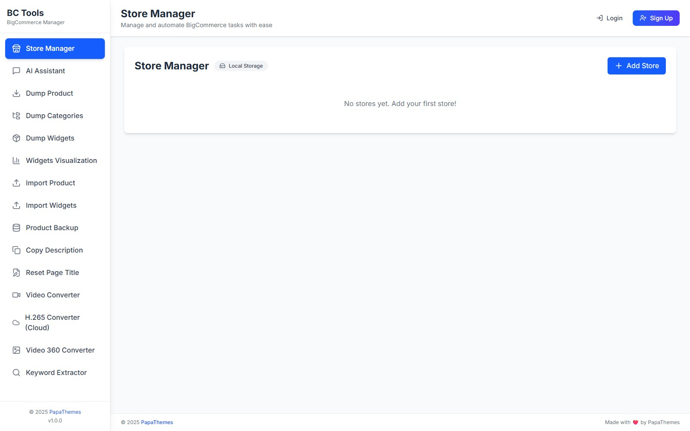
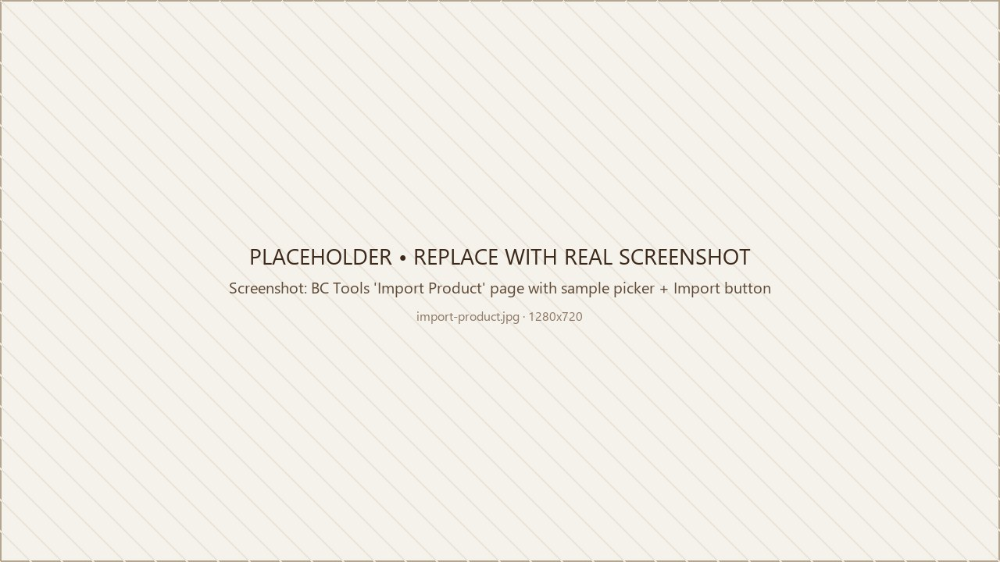
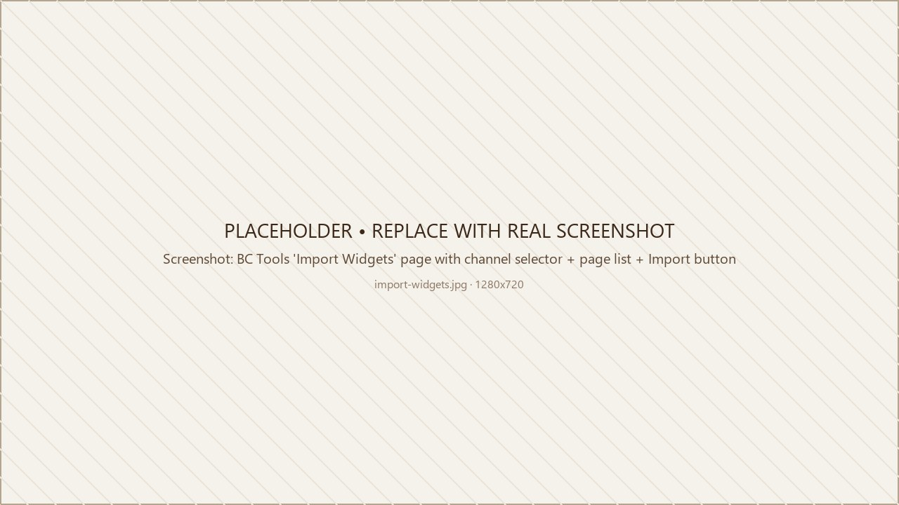

# Step 3 — Import Demo Products & Widgets

This is the step that **makes your store look like our demo**. You import two kinds of content with our free tool — **BC Tools** — and the storefront updates in minutes. No coding, no spreadsheets.

- **Products** — all demo products (with images, variants, custom fields, descriptions), plus the **categories** and **brands** that go with them
- **Widget content** — the home-page marketing sections and the footer brand/tagline block

The sample demo data includes the categories and brands used by the products, so your catalog structure comes in alongside the products (see the note in [3.2](#32-import-sample-products)).

---

## The tool: BC Tools

Open **<https://bc-tools.papathemes.com>** in a new tab.

{ loading=lazy }

The tool is 100% browser-based — it talks to your store directly via the BigCommerce API. We never see or store your credentials.

---

## 3.1 — Connect your store

1. Open the store-management area in the left menu.
2. Add a new store and paste in:
    - **Store hash** — the part of the URL between `stores/` and `/manage` in your admin panel (e.g. `abcd1234`).
    - **API Access Token** — see [How to create an API account](#creating-an-api-account) below.
3. Save. The store now appears in the dropdown at the top of every BC Tools page.

### Creating an API Account

If you don't already have an API token:

1. In BigCommerce admin go to **Settings → API → Store-level API accounts**.
2. Click **Create API account**.
3. Name it `PapaThemes BC Tools`.
4. Tick the scopes from the [checklist in Get Started](get-started.md#before-you-begin-checklist).
5. Click **Save** — a download will start. **Keep that file** — it contains the only copy of your `Access Token`.

---

## 3.2 — Import sample products

1. In BC Tools open the product-import area in the left menu.
2. Pick your store from the top dropdown.
3. Choose one of two import modes:
    - **Import from the built-in samples** — pick the variant matching your demo: `eshopping-industrial`, `eshopping-autoparts`, `eshopping-electronics`, or `eshopping-packaging`.
    - **Import from a product JSON file** — drag in a `.json` file (we send these on request for very large catalogs).
4. Start the import.

   { loading=lazy }

5. The progress bar will tick up. Each demo imports the full demo catalog (**around 100 products**) along with their images, so this takes **a few minutes** — longer for large image sets or slower connections.

!!! note "Categories and brands come with the demo data"
    The sample demo data includes the categories and brands used by the products, along with each product's custom fields and modifier options. The categories and brands are created if they don't already exist, so your catalog structure is set up alongside the products.

---

## 3.3 — Import widget content

The demo widgets populate two areas:

- **Home-page marketing sections** — five separate sections you can edit individually after import:
    - Below the product sliders: **Why Choose Us**, **Customer Reviews**, and **Resources**.
    - Below the newsletter: **About** and **Talk to an Expert**.
- **Footer brand/tagline block** — this lives in a global footer region, so it appears site-wide (the same footer tagline shows at the bottom of your home, product, category, cart, and other pages).

Your product, category, and cart pages get their main look from the theme itself once it's applied. Apart from the shared footer tagline above, their body content doesn't rely on imported widgets.

1. In BC Tools open the widget-import area in the left menu.
2. Pick your store from the top dropdown.
3. Enter your **Channel ID** (the default is `1` — only change it if you have multiple storefronts; you can find the channel ID in your BigCommerce admin under your channels list).
4. Confirm your Channel ID is correct, then continue — the demo widgets use only the built-in BigCommerce HTML widget, which is present on every store by default, so there's no widget-template installation step.
5. Choose one of two import modes:
    - **Import from the built-in samples** — pick `eshopping-industrial`, `eshopping-autoparts`, `eshopping-electronics`, or `eshopping-packaging`.
    - **Import from a widgets JSON file** — drag in a `.json` file if you have a custom dump.
6. When the page list appears, leave the defaults selected if you're not sure — they cover everything the demo uses.
7. Start the import.

   { loading=lazy }

8. Open your storefront in a new tab — your five home-page marketing sections (Why Choose Us, Customer Reviews, Resources, About, Talk to an Expert) and the site-wide footer brand/tagline block should now match the demo. The rest of the storefront (the body of your product, category, and cart pages) is styled by the theme itself, so it will already look like the demo once the theme is applied.

---

## Sample JSON downloads

The **Quick Import from Samples** picker in BC Tools downloads the latest demo JSON automatically — you almost never need the raw files. They're listed below only as offline-backup placeholders. The current copies in this docs folder are 1-line stubs; the real JSON is published with each theme release.

| Variation | Product JSON | Widgets JSON |
| --------- | ------------ | ------------ |
| Industrial | [eshopping-industrial-products.json](../samples/eshopping-industrial-products.json) | [eshopping-industrial-widgets.json](../samples/eshopping-industrial-widgets.json) |
| Auto Parts | [eshopping-autoparts-products.json](../samples/eshopping-autoparts-products.json) | [eshopping-autoparts-widgets.json](../samples/eshopping-autoparts-widgets.json) |
| Electronics | [eshopping-electronics-products.json](../samples/eshopping-electronics-products.json) | [eshopping-electronics-widgets.json](../samples/eshopping-electronics-widgets.json) |
| Packaging | [eshopping-packaging-products.json](../samples/eshopping-packaging-products.json) | [eshopping-packaging-widgets.json](../samples/eshopping-packaging-widgets.json) |

!!! warning "Files in `samples/` are placeholders"
    The `.json` files in this docs site's `samples/` folder are stubs. Use **BC Tools → Quick Import from Samples** to pull the real demo data. If you need the raw JSON directly (offline migration, etc.), email <contact@papathemes.com>.

---

## Troubleshooting

??? failure "Import says `403 Forbidden`"
    Your API token is missing a scope. Re-create the API account with **all** scopes in [the checklist](get-started.md#before-you-begin-checklist), then update the token for your store in BC Tools.

??? failure "Products import but images are broken"
    If the import fails partway, retry from BC Tools — the importer is idempotent (it skips products that already exist), so re-running it finishes any images that didn't upload the first time. If an image still won't load, upload your own via **Catalog → Products → (product) → Images**.

??? failure "Widgets import succeeds but the home page is blank"
    Make sure you picked the **correct Channel ID** in step 3. Widgets are stored per-channel. If you imported to Channel 2 but are looking at Channel 1, you won't see them.

??? failure "I want to remove all the demo data and start over"
    1. In BC Tools use the widget-removal option → pick the channel → confirm.
    2. In BigCommerce admin, **Catalog → Products → select all → Delete**.
    3. **Catalog → Categories → delete top-level demo categories**.

---

## Next

➡️ Continue with your variant's home-page recipe:

- [Industrial home page](home-industrial.md)
- [Auto Parts home page](home-autoparts.md)
- [Electronics home page](home-electronics.md)
- [Packaging home page](home-packaging.md)

Or learn the general Theme Editor first → [Theme Editor tour](theme-editor-tour.md).
