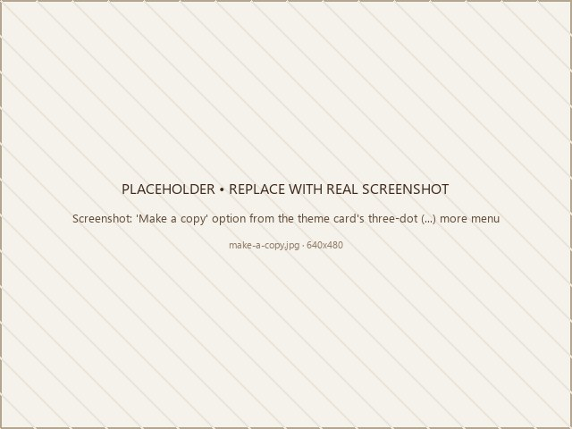

# Step 1 — Install the eShopping Theme

eShopping is delivered to you as a `.zip` file by PapaThemes. Follow **Option A** to install it — that is the standard way to get eShopping onto your store. Use **Option B** only if you obtained eShopping through the BigCommerce Theme Marketplace.

---

## Option A — Upload the theme `.zip` file (recommended)

1. Download the `eShopping-x.x.x.zip` file we sent you. Save it somewhere you can find it (don't unzip — BigCommerce wants the `.zip` itself).
2. In your BigCommerce admin panel go to **Storefront → My Themes**.
3. Click the **Upload theme** button in the top-right corner.

   { loading=lazy }

4. Drag the `.zip` file into the upload area (or click **Browse** and pick it). Wait for the upload to finish — large themes can take 1–2 minutes.
5. Once the upload succeeds, the theme will appear under **My Themes**. Click **Apply** on its thumbnail.

   !!! warning "Apply only switches the visual layout"
       Applying a theme **does not** delete any products, orders, customers, or apps. If you change your mind, you can switch back to your old theme at any time with one click.

---

## Option B — Install from the BigCommerce Theme Marketplace

Use this option only if you obtained eShopping through the BigCommerce Theme Marketplace.

1. In your BigCommerce admin panel go to **Storefront → My Themes**.
2. Click the **Theme Marketplace** tab at the top of the page.
3. Find the eShopping theme listing and open it.
4. Click **Add to my themes** (free themes) or complete the purchase (paid themes).
5. After the theme is added, go back to **Storefront → My Themes**. You'll see eShopping listed under **My Themes**.

   { loading=lazy }

6. Click **Apply** to make eShopping your active theme.

!!! tip "Multi-storefront stores"
    If you have more than one storefront (channel), open the channel switcher at the top of the page and apply the theme to **each channel separately**. Each channel keeps its own copy of the theme, its own customizations, and its own widgets.

---

## Confirm the theme is active

1. Go to **Storefront → My Themes**.
2. The eShopping thumbnail must show **Current Theme** at the top.

   { loading=lazy }

3. Open your storefront URL in a new tab — you should see the default eShopping layout (sandy/cream background, terra-orange accents, top bar, sticky main nav, sidebar on category pages).

If you see the old theme instead, give it 30 seconds and refresh — BigCommerce takes a moment to publish the change.

---

## Make a backup copy of the theme (optional but recommended)

Before you start customizing, make a copy so you always have a clean version to fall back on:

1. In **Storefront → My Themes** find the eShopping card.
2. Click the **⋯ More options** menu on the card.
3. Click **Make a copy**.
4. Rename the copy something like `eShopping — clean backup`.

   { loading=lazy }

You'll always have the un-touched theme available if you ever want to start over.

---

## Next

➡️ [Step 2 — Choose your variant](choose-variant.md)
