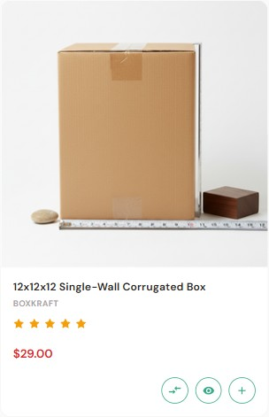

# Product Card

The product card is the tile shown in:

- Home page sliders (Featured / Bestselling / New)
- Category and Brand grids
- Search results
- "Related products" on the PDP (when a product has no related products set, the PDP shows the standard product-info tabs instead of a related-products row)

{ loading=lazy }

!!! note "Two card variants"
    The theme uses two slightly different product cards depending on where they appear:

    - **Grid card** — used on **category, brand, and search** pages.
    - **Slider card** — used in **home page sliders, Products-by-Category, and the PDP "Related products" section**.

    They order a few elements differently and differ slightly in content (the slider card shows the product SKU, the grid card shows the brand name), and a couple of action-button behaviors differ. Both are described below.

### Slider card (home sliders, Products-by-Category, PDP related)

Sale
Product image

SKU (or brand name)

★★★★☆ <small>(24)</small>

<b>$29.99</b> <s>$39.99</s>

⇄○+ Cart

From top to bottom this card shows:

- A **Sale** badge on products that are on sale. (A **Sold out** badge can also appear here, but it is off by default — see [Sale and sold-out badges](#sale-and-sold-out-badges).) The badge style/position and colors are set in **Theme Editor → Products → Product sale badges**.
- The **product image**.
- The **product title**.
- The **product SKU** (when the product has a SKU set), or the **brand name** (when no SKU is set but a brand exists).
- The **star rating** and review count (when the product has reviews and ratings are enabled).
- The **price** — sale price plus the original (struck-through) price when the product is on sale.
- An **icon-only action row**: **Compare**, **Quick view**, and **Add to cart** (the add-to-cart icon becomes a *Choose options* link for products that have variants).

### Grid card (category, brand, search pages)

This card differs from the slider card in both order and content: it shows the **brand name** (not the SKU) in the metadata row, and the rating appears **above** the brand/title rather than below them:

Sale
Product image

★★★★☆ <small>(24)</small>

Brand name

<b>$29.99</b> <s>$39.99</s>

⇄○+ Cart

From top to bottom: **Sale badge → product image → star rating → brand name → product title → price → action row**.

---

## Card action buttons

The icon action row is controlled by two toggles, both under **Theme Editor → Products → Display settings**:

| Setting | Effect |
| ------- | ------ |
| **Show product compare** | Shows the **Compare** icon on cards. On **category, brand, and search** pages the icon is additionally gated by a per-product eligibility flag, so it only appears for products eligible for comparison. On **home sliders and the PDP related section** the icon appears for all products when the toggle is on. |
| **Show quickview button on product cards** | Shows the **Quick view** icon on cards. |

The **Add to cart** icon is always present for purchasable products, and it switches to a *Choose options* link when the product has variants. On **category, brand, and search** pages the icon also switches to a *Pre-order* link for pre-order products. There is a fourth state on these pages too: when a product is purchasable but currently out of stock and has an out-of-stock message set, the cart icon becomes an **out-of-stock link** that uses that message as its label and links to the product page.

---

## Quick view modal

The Quick-view button opens a streamlined PDP inside a modal — same gallery, variants, qty, and Add-to-Cart. Toggle it in:

**Theme Editor → Products → Display settings → Show quickview button on product cards**.

---

## Hiding prices from guests

To force users to log in before they can see prices:

**Settings → Display → Product settings → Hide product's price from guests?** ✅.

Cards then show a **Log in for pricing** link in place of the price.

---

## Sale and sold-out badges

The theme supports two badge types on cards, both grouped under one heading: **Theme Editor → Products → Product sale badges**.

- A **Sale** badge for products that have a sale price. **On by default** — it shows out of the box.
- A **Sold out** badge for products that are out of stock. **Off by default** — the **Show product sold-out badges** setting starts at **None**, so nothing appears until you choose a position.

For each badge type, the **style and position** is the value you pick in its dropdown:

| Option | Result |
| ------ | ------ |
| **None** | The badge is hidden *(default for the sold-out badge)*. |
| **Top left** | A flag in the top-left corner *(default for the sale badge)*. |
| **Diagonal** | A diagonal sash across the corner. |
| **Burst** | A starburst badge. |

The two dropdowns are **Show product sale badges** and **Show product sold-out badges**. Each badge type also has its own color fields — **Badge text color**, **Badge color**, and **Badge hover color** — so the two badge types can be styled independently. You can override the default wording for each type using its **label** field in the same panel. There is no free-text or custom badge feature beyond these two badge types.

---

## Product display style

Category pages can show products in one of two modes. Set the default in **Theme Editor → Global → Products → Display style**:

| Option | What shoppers see |
| ------ | ----------------- |
| **Show products in a grid** *(default)* | The standard grid of product cards. |
| **Show products in bulk order** | The **Bulk Order table** — a row per product with a quantity field for fast multi-item ordering, instead of cards. |

"Show products in bulk order" is not a generic list/row view of the product cards — it replaces the card grid with the bulk-order table.

---

## Next

- [Frequently Bought Together](product-fbt.md)
- [Product FAQ tab](product-faq.md)
- [Category page](category.md)
