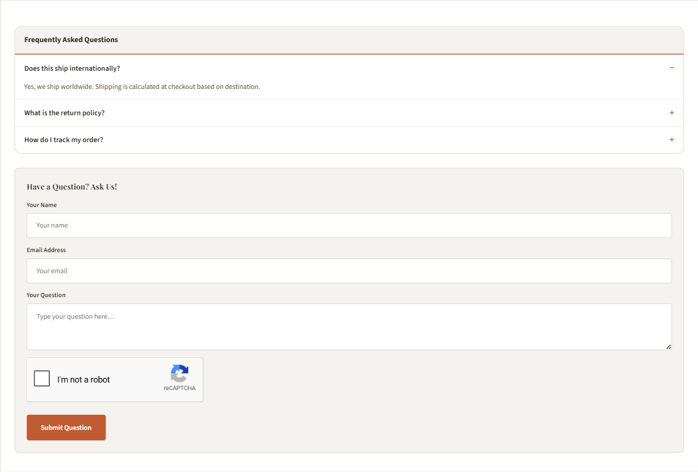

# Product FAQs Tab

The **FAQs** tab renders a built-in **ask-a-question form** (name + email + question + captcha). It's *not* a pre-filled accordion — shoppers submit questions straight from the PDP.

{ loading=lazy }

---

## Turn the FAQs tab on

<!--te-src:PiAqKkN1c3RvbWl6ZToqKiBUaGVtZSBFZGl0b3Ig4oaSICplU2hvcHBpbmcgVGhlbWUg4oaSIFByb2R1Y3QgUGFnZSAoUERQKSog4oaSICoqU2hvdyBGQVEgVGFiKiogKGlkIGBlc2hvcHBpbmctcGRwLXNob3ctZmFxLXRhYmApLiBGb3JtYXQ6IG9uL29mZi4gRGVmYXVsdDogYG9uYC4=-->
<!--te-mock--><div class="te-mock"><div class="te-mock__hd"><span>eShopping Theme</span><span class="te-x">✕</span></div><div class="te-mock__grp">Product Page (PDP)</div><div class="te-mock__row"><span class="te-lbl">Show FAQ Tab</span><span class="te-cb is-on"></span></div></div>

The **FAQs** tab appears alongside the other active product tabs (*Description*, *Videos*, *Specifications*, *Warranty*, *Reviews*).

!!! note "Tabs vs. stacked sections"
    FAQs is a **tab** only when **Show Product Description Tabs** is on (the default). Off → it renders as a stacked section down the page.

<!--te-src:PiAqKkN1c3RvbWl6ZToqKiBUaGVtZSBFZGl0b3Ig4oaSICpQcm9kdWN0cyog4oaSICoqU2hvdyBwcm9kdWN0IGRlc2NyaXB0aW9uIHRhYnMqKiAoaWQgYHNob3dfcHJvZHVjdF9kZXRhaWxzX3RhYnNgKS4gRm9ybWF0OiBvbi9vZmYuIERlZmF1bHQ6IGBvbmAu-->
<!--te-mock--><div class="te-mock"><div class="te-mock__hd"><span>Products</span><span class="te-x">✕</span></div><div class="te-mock__row"><span class="te-lbl">Show product description tabs</span><span class="te-cb is-on"></span></div></div>

Neighbor tabs are conditional:

- **Specifications** — when **Product custom fields in tabs** is on *and* the product has custom fields.
- **Warranty** — when the product has warranty text.
- **Videos** — when the product has videos.

<!--te-src:PiAqKkN1c3RvbWl6ZToqKiBUaGVtZSBFZGl0b3Ig4oaSICpQcm9kdWN0cyog4oaSICoqUHJvZHVjdCBjdXN0b20gZmllbGRzIGluIHRhYnMqKiAoaWQgYHNob3dfY3VzdG9tX2ZpZWxkc190YWJzYCkuIEZvcm1hdDogb24vb2ZmLiBEZWZhdWx0OiBgb25gLg==-->
<!--te-mock--><div class="te-mock"><div class="te-mock__hd"><span>Products</span><span class="te-x">✕</span></div><div class="te-mock__row"><span class="te-lbl">Product custom fields in tabs</span><span class="te-cb is-on"></span></div></div>

---

## How submissions are handled

When a shopper submits the form:

- The question goes to your store's **Contact Us** page — a Contact page must exist — and is delivered to that page's contact-form email.
- The product name and URL are prepended (`[Product: <name> - <url>]`) so you can see which product it's about.
- An inline confirmation replaces the form on success.
- **reCAPTCHA** appears only when it's enabled for your storefront.

<!--te-src:PiAqKkN1c3RvbWl6ZToqKiBCaWdDb21tZXJjZSBhZG1pbiDihpIgKipTdG9yZWZyb250IOKGkiBXZWIgUGFnZXMg4oaSIHlvdXIgQ29udGFjdCBwYWdlKiog4oaSIHNldCB0aGUgY29udGFjdCBmb3JtJ3MgcmVjaXBpZW50IGVtYWlsLiAoTm90IGEgdGhlbWUgc2V0dGluZy4p-->
<!--te-mock--><div class="te-mock te-nav"><div class="te-nav__brand">BigCommerce admin</div><div class="te-nav__top"><span>Home</span></div><div class="te-nav__top"><span>Orders</span></div><div class="te-nav__top"><span>Products</span><span class="te-nav__chev">⌄</span></div><div class="te-nav__top"><span>Customers</span><span class="te-nav__chev">⌄</span></div><div class="te-nav__top is-open"><span>Storefront</span><span class="te-nav__chev">⌃</span></div><div class="te-nav__sub">Themes</div><div class="te-nav__sub">Logo</div><div class="te-nav__sub">Home page carousel</div><div class="te-nav__sub">Social media links</div><div class="te-nav__sub">Script manager</div><div class="te-nav__sub is-active">Web pages</div><div class="te-nav__sub">Blog</div><div class="te-nav__sub">Image manager</div><div class="te-nav__top"><span>Marketing</span><span class="te-nav__chev">⌄</span></div><div class="te-nav__top"><span>Analytics</span></div><div class="te-nav__top"><span>Settings</span><span class="te-nav__chev">⌄</span></div></div>

---

## Showing pre-written FAQ answers

{ loading=lazy }

The FAQs tab has no answer content of its own. Drop a collapsible accordion into the tab in **Page Builder**:

<!--te-src:PiAqKkN1c3RvbWl6ZToqKiBQYWdlIEJ1aWxkZXIg4oaSIG9wZW4gYSBwcm9kdWN0IHBhZ2Ug4oaSIHNlbGVjdCB0aGUgKipGQVFzKiogdGFiIOKGkiBkcm9wIGFuICoqQUkgSFRNTCBHZW5lcmF0b3IqKiB3aWRnZXQgaW50byAqKmBwcm9kdWN0X2Fib3ZlX2ZhcS0tZ2xvYmFsYCoqIChhYm92ZSB0aGUgZm9ybSkgb3IgKipgcHJvZHVjdF9iZWxvd19mYXEtLWdsb2JhbGAqKiAoYmVsb3cpLiBUaGUgbm9uLWdsb2JhbCB0d2lucyBgcHJvZHVjdF9hYm92ZV9mYXFgIC8gYHByb2R1Y3RfYmVsb3dfZmFxYCB0YXJnZXQgb25lIHByb2R1Y3QuIChOb3QgYSB0aGVtZSBzZXR0aW5nLik=-->
<!--te-mock--><div class="te-mock te-mock--pb"><div class="te-mock__hd"><span>‹ AI HTML Generator | PapaThemes</span><span class="te-x">⋯</span></div><div class="te-mock__grp">▾ Content</div><div class="te-pbbox"><span class="k">&lt;style&gt;</span><br><span class="s">.papathemes-ai-widget-…</span> { … }<br>…your HTML…<br><span class="k">&lt;/style&gt;</span></div><div class="te-pbbtns"><span class="te-btn-ghost">Expand HTML Editor</span><span class="te-save te-save--full">Save HTML</span></div><div class="te-mock__row"><span class="te-cb"></span><span class="te-lbl">Show in container div</span></div></div>

Paste an accordion like this. It carries schema.org **microdata**, so the same markup also produces an FAQ rich snippet for Google:

```html
<style>
.esfaq{border:1px solid var(--eshopping-bark-200);border-radius:var(--eshopping-r-md);overflow:hidden;margin:var(--eshopping-sp-5) 0;background:var(--eshopping-white)}
.esfaq__hd{padding:var(--eshopping-sp-3) var(--eshopping-sp-4);font-weight:700;font-size:0.93rem;color:var(--eshopping-bark-800);background:var(--eshopping-bark-50);border-bottom:2px solid var(--eshopping-terra)}
.esfaq__item{border-top:1px solid var(--eshopping-bark-100)}
.esfaq__q{display:flex;justify-content:space-between;align-items:center;gap:var(--eshopping-sp-3);padding:var(--eshopping-sp-3) var(--eshopping-sp-4);font-weight:600;font-size:0.9rem;color:var(--eshopping-bark-800);cursor:pointer;list-style:none}
.esfaq__q::-webkit-details-marker{display:none}
.esfaq__q::after{content:"+";color:var(--eshopping-terra);font-size:1.15rem;line-height:1}
.esfaq__item[open] .esfaq__q::after{content:"\2212"}
.esfaq__a{padding:0 var(--eshopping-sp-4) var(--eshopping-sp-3);font-size:0.86rem;line-height:1.55;color:var(--eshopping-bark-600)}
</style>
<div class="esfaq" itemscope itemtype="https://schema.org/FAQPage">
  <div class="esfaq__hd">Frequently Asked Questions</div>
  <details class="esfaq__item" itemscope itemprop="mainEntity" itemtype="https://schema.org/Question">
    <summary class="esfaq__q" itemprop="name">Does this ship internationally?</summary>
    <div class="esfaq__a" itemprop="acceptedAnswer" itemscope itemtype="https://schema.org/Answer">
      <span itemprop="text">Yes, we ship worldwide. Shipping is calculated at checkout based on destination.</span>
    </div>
  </details>
  <details class="esfaq__item" itemscope itemprop="mainEntity" itemtype="https://schema.org/Question">
    <summary class="esfaq__q" itemprop="name">What is the return policy?</summary>
    <div class="esfaq__a" itemprop="acceptedAnswer" itemscope itemtype="https://schema.org/Answer">
      <span itemprop="text">30-day returns on unused items in their original packaging.</span>
    </div>
  </details>
</div>
```

Validate the result with Google's [Rich Results Test](https://search.google.com/test/rich-results).

---

## Next

- [Frequently Bought Together](product-fbt.md)
- [Product page overview](product.md)
- [Category page](category.md)
