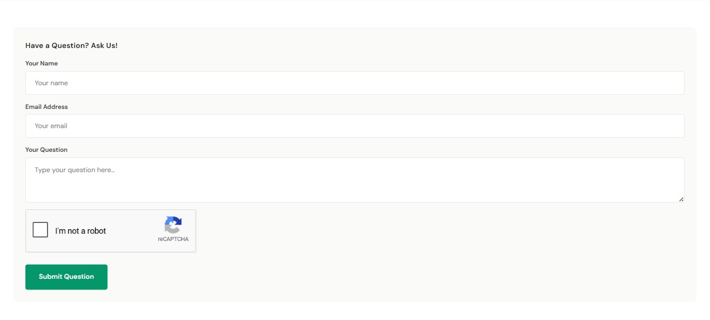

# Product FAQs Tab

The **FAQs** tab on a product page renders a built-in **ask-a-question form** — name + email + question + captcha + submit. It is *not* a pre-filled accordion. Shoppers can submit questions about the product directly from the PDP.

{ loading=lazy }

---

## Turn the FAQs tab on

**Theme Editor → eShopping → Product Page (PDP) → Show FAQ Tab** ✅.

<!--te-src:PiAqKkN1c3RvbWl6ZToqKiBUaGVtZSBFZGl0b3Ig4oaSICplU2hvcHBpbmcgVGhlbWUg4oaSIFByb2R1Y3QgUGFnZSAoUERQKSog4oaSICoqU2hvdyBGQVEgVGFiKiogKGlkIGBlc2hvcHBpbmctcGRwLXNob3ctZmFxLXRhYmApLiBGb3JtYXQ6IG9uL29mZi4gRGVmYXVsdDogYG9uYC4=-->
<!--te-mock--><div class="te-mock"><div class="te-mock__hd"><span>eShopping Theme</span><span class="te-x">✕</span></div><div class="te-mock__grp">Product Page (PDP)</div><div class="te-mock__row"><span class="te-lbl">Show FAQ Tab</span><span class="te-cb is-on"></span></div></div>

A new **FAQs** tab (the default tab label) appears alongside the other product tabs that are active for that product — for example *Description*, *Videos*, *Specifications*, *Warranty*, *Reviews*.

!!! note "Tabs vs. stacked sections"
    The FAQs section appears as a **tab** only when **Show Product Description Tabs** is enabled (the default). If that setting is turned **off**, the FAQs section — along with *Description*, *Videos*, *Specifications*, *Warranty*, and *Reviews* — renders as a **stacked section** down the page (each with its own heading) instead of as a tab.

<!--te-src:PiAqKkN1c3RvbWl6ZToqKiBUaGVtZSBFZGl0b3Ig4oaSICpQcm9kdWN0cyog4oaSICoqU2hvdyBwcm9kdWN0IGRlc2NyaXB0aW9uIHRhYnMqKiAoaWQgYHNob3dfcHJvZHVjdF9kZXRhaWxzX3RhYnNgKS4gRm9ybWF0OiBvbi9vZmYuIERlZmF1bHQ6IGBvbmAu-->
<!--te-mock--><div class="te-mock"><div class="te-mock__hd"><span>Products</span><span class="te-x">✕</span></div><div class="te-mock__row"><span class="te-lbl">Show product description tabs</span><span class="te-cb is-on"></span></div></div>

Those neighbor tabs are conditional, so the exact lineup varies per product:

- **Specifications** only appears when **Product custom fields in tabs** is on *and* the product has custom fields.
- **Warranty** only appears when the product has warranty text entered.
- **Videos** only appears when the product has product videos.

<!--te-src:PiAqKkN1c3RvbWl6ZToqKiBUaGVtZSBFZGl0b3Ig4oaSICpQcm9kdWN0cyog4oaSICoqUHJvZHVjdCBjdXN0b20gZmllbGRzIGluIHRhYnMqKiAoaWQgYHNob3dfY3VzdG9tX2ZpZWxkc190YWJzYCkuIEZvcm1hdDogb24vb2ZmLiBEZWZhdWx0OiBgb25gLg==-->
<!--te-mock--><div class="te-mock"><div class="te-mock__hd"><span>Products</span><span class="te-x">✕</span></div><div class="te-mock__row"><span class="te-lbl">Product custom fields in tabs</span><span class="te-cb is-on"></span></div></div>

---

## How submissions are handled

When a shopper submits the form:

- The question is sent through your store's built-in BigCommerce **Contact Us** system — it uses your store's Contact page behind the scenes. The question is delivered to whatever address your Contact Us form is set to email.
- The theme automatically **prepends the product name and URL** to the submitted question (e.g. `[Product: Acme Wireless Drill - https://yourstore.com/acme-wireless-drill/]`) on its own line above the shopper's text, so you can immediately see which product each question is about in the Contact Us email.
- A success message renders inline.
- A **reCAPTCHA** box appears on the form when reCAPTCHA is enabled for your storefront in the store settings.

To change where these questions are delivered, edit your **Contact Us** page form recipient in the BigCommerce control panel (**Storefront → Web Pages →** your Contact page), where the contact form's destination email address is set.

<!--te-src:PiAqKkN1c3RvbWl6ZToqKiBCaWdDb21tZXJjZSBhZG1pbiDihpIgKipTdG9yZWZyb250IOKGkiBXZWIgUGFnZXMg4oaSIHlvdXIgQ29udGFjdCBwYWdlIOKGkiBjb250YWN0IGZvcm0gcmVjaXBpZW50IGVtYWlsKiouIChOb3QgYSB0aGVtZSBzZXR0aW5nIOKAlCB0aGUgRkFRIHRhYiBoYXMgbm8gRkFRLWFuc3dlciBjb250ZW50IG9mIGl0cyBvd247IGl0IHN1Ym1pdHMgdGhyb3VnaCB0aGUgc3RvcmUncyBDb250YWN0IFVzIHN5c3RlbS4p-->
<!--te-mock--><div class="te-mock te-nav"><div class="te-nav__brand">BigCommerce admin</div><div class="te-nav__top"><span>Home</span></div><div class="te-nav__top"><span>Orders</span></div><div class="te-nav__top"><span>Products</span><span class="te-nav__chev">⌄</span></div><div class="te-nav__top"><span>Customers</span><span class="te-nav__chev">⌄</span></div><div class="te-nav__top is-open"><span>Storefront</span><span class="te-nav__chev">⌃</span></div><div class="te-nav__sub">Themes</div><div class="te-nav__sub">Logo</div><div class="te-nav__sub">Home page carousel</div><div class="te-nav__sub">Social media links</div><div class="te-nav__sub">Script manager</div><div class="te-nav__sub is-active">Web pages</div><div class="te-nav__sub">Blog</div><div class="te-nav__sub">Image manager</div><div class="te-nav__top"><span>Marketing</span><span class="te-nav__chev">⌄</span></div><div class="te-nav__top"><span>Analytics</span></div><div class="te-nav__top"><span>Settings</span><span class="te-nav__chev">⌄</span></div></div>

---

## Where to put pre-written FAQ answers instead

If you want to display **answers** (not just collect questions), use one of these alternatives:

1. **Product description** — paste a Q&A section into the product's description (Catalog → Products → edit → Description).

<!--te-src:ICAgID4gKipDdXN0b21pemU6KiogQmlnQ29tbWVyY2UgYWRtaW4g4oaSICoqQ2F0YWxvZyDihpIgUHJvZHVjdHMg4oaSIGVkaXQgdGhlIHByb2R1Y3Qg4oaSIERlc2NyaXB0aW9uKiouIChOb3QgYSB0aGVtZSBzZXR0aW5nLik=-->
<!--te-mock--><div class="te-mock te-nav"><div class="te-nav__brand">BigCommerce admin</div><div class="te-nav__top"><span>Home</span></div><div class="te-nav__top"><span>Orders</span></div><div class="te-nav__top is-open"><span>Products</span><span class="te-nav__chev">⌃</span></div><div class="te-nav__sub">All products</div><div class="te-nav__sub">Add</div><div class="te-nav__sub">Categories</div><div class="te-nav__sub">Options</div><div class="te-nav__sub">Filtering</div><div class="te-nav__sub">Reviews</div><div class="te-nav__sub">Brands</div><div class="te-nav__sub">Import</div><div class="te-nav__sub">Export</div><div class="te-nav__sub is-active">Products</div><div class="te-nav__top"><span>Customers</span><span class="te-nav__chev">⌄</span></div><div class="te-nav__top"><span>Storefront</span><span class="te-nav__chev">⌄</span></div><div class="te-nav__top"><span>Marketing</span><span class="te-nav__chev">⌄</span></div><div class="te-nav__top"><span>Analytics</span></div><div class="te-nav__top"><span>Settings</span><span class="te-nav__chev">⌄</span></div></div>

2. **Custom fields tab** — turn on **Product custom fields in tabs**, then add custom fields named like `Q: Does this fit my vehicle?` with the answer as the value. They render in the **Specifications** tab as a 2-column table (label / value).

<!--te-src:ICAgID4gKipDdXN0b21pemU6KiogVGhlbWUgRWRpdG9yIOKGkiAqUHJvZHVjdHMqIOKGkiAqKlByb2R1Y3QgY3VzdG9tIGZpZWxkcyBpbiB0YWJzKiogKGlkIGBzaG93X2N1c3RvbV9maWVsZHNfdGFic2ApLiBGb3JtYXQ6IG9uL29mZi4gRGVmYXVsdDogYG9uYC4gVGhlbiBhZGQgdGhlIGZpZWxkcyBpbiBCaWdDb21tZXJjZSBhZG1pbiDihpIgKipDYXRhbG9nIOKGkiBQcm9kdWN0cyDihpIgZWRpdCB0aGUgcHJvZHVjdCDihpIgQ3VzdG9tIEZpZWxkcyoqLg==-->
<!--te-mock--><div class="te-mock"><div class="te-mock__hd"><span>Products</span><span class="te-x">✕</span></div><div class="te-mock__row"><span class="te-lbl">Product custom fields in tabs</span><span class="te-cb is-on"></span></div><div class="te-mock__row"><span class="te-lbl">Catalog → Products → edit the product → Custom Fields</span><span class="te-cb"></span></div></div>

3. **Warranty tab widget area** — drop an accordion or collapsible-content widget into the Warranty tab widget area (region `product_below_warranty--global`). It renders **inside the Warranty tab**, after the warranty description text and *before* the warranty card grid, on every PDP that has warranty text.

<!--te-src:ICAgID4gKipDdXN0b21pemU6KiogUGFnZSBCdWlsZGVyIOKGkiBvcGVuIGEgcHJvZHVjdCBwYWdlIOKGkiBkcm9wIGEgd2lkZ2V0IGludG8gdGhlICoqYHByb2R1Y3RfYmVsb3dfd2FycmFudHktLWdsb2JhbGAqKiByZWdpb24uIChOb3QgYSB0aGVtZSBzZXR0aW5nLik=-->
<!--te-mock--><div class="te-mock te-mock--pb"><div class="te-mock__hd"><span>‹ AI HTML Generator | PapaThemes</span><span class="te-x">⋯</span></div><div class="te-mock__grp">▾ Content</div><div class="te-pbbox"><span class="k">&lt;style&gt;</span><br><span class="s">.papathemes-ai-widget-…</span> { … }<br>…your HTML…<br><span class="k">&lt;/style&gt;</span></div><div class="te-pbbtns"><span class="te-btn-ghost">Expand HTML Editor</span><span class="te-save te-save--full">Save HTML</span></div><div class="te-mock__row"><span class="te-cb"></span><span class="te-lbl">Show in container div</span></div></div>

    !!! warning "Requires the tabbed layout"
        This widget area only exists when **Show Product Description Tabs** is enabled. If that setting is off and the product sections render stacked, the `product_below_warranty--global` region is not included in the page, and any widgets placed there will not appear.
4. **Below-tabs widget area** — drop the accordion into the below-tabs widget area (region `product_below_content--global`, with the non-global twin `product_below_content`). It renders directly under the tabbed (or stacked) product content, visible on every PDP.

<!--te-src:ICAgID4gKipDdXN0b21pemU6KiogUGFnZSBCdWlsZGVyIOKGkiBvcGVuIGEgcHJvZHVjdCBwYWdlIOKGkiBkcm9wIGEgd2lkZ2V0IGludG8gdGhlICoqYHByb2R1Y3RfYmVsb3dfY29udGVudC0tZ2xvYmFsYCoqIHJlZ2lvbi4gKE5vdCBhIHRoZW1lIHNldHRpbmcuKQ==-->
<!--te-mock--><div class="te-mock te-mock--pb"><div class="te-mock__hd"><span>‹ AI HTML Generator | PapaThemes</span><span class="te-x">⋯</span></div><div class="te-mock__grp">▾ Content</div><div class="te-pbbox"><span class="k">&lt;style&gt;</span><br><span class="s">.papathemes-ai-widget-…</span> { … }<br>…your HTML…<br><span class="k">&lt;/style&gt;</span></div><div class="te-pbbtns"><span class="te-btn-ghost">Expand HTML Editor</span><span class="te-save te-save--full">Save HTML</span></div><div class="te-mock__row"><span class="te-cb"></span><span class="te-lbl">Show in container div</span></div></div>

The 4th option is the closest to a "site-wide FAQ accordion that shows on every product page".

---

## SEO — `FAQPage` schema.org rich snippet

The built-in form doesn't emit FAQ schema markup (because there are no answers in it). If you provide FAQ content via an accordion in the below-tabs widget area, you can add the JSON-LD yourself in **Storefront → Script Manager** (Location: Footer, Pages: Store pages).

The theme does **not** output any FAQ markup or `data-faq-*` attributes automatically — the snippet below is a generic reader. It only works if **your** accordion HTML carries the matching hooks, which you add yourself when you author the widget:

<!--te-src:PiAqKkN1c3RvbWl6ZToqKiBCaWdDb21tZXJjZSBhZG1pbiDihpIgKipTdG9yZWZyb250IOKGkiBTY3JpcHQgTWFuYWdlciDihpIgQ3JlYXRlIGEgU2NyaXB0KiogKExvY2F0aW9uOiBGb290ZXIsIFBhZ2VzOiBTdG9yZSBwYWdlcyksIHRoZW4gcGFzdGUgdGhlIHNuaXBwZXQgYmVsb3cuIChOb3QgYSB0aGVtZSBzZXR0aW5nLik=-->
<!--te-mock--><div class="te-mock te-nav"><div class="te-nav__brand">BigCommerce admin</div><div class="te-nav__top"><span>Home</span></div><div class="te-nav__top"><span>Orders</span></div><div class="te-nav__top"><span>Products</span><span class="te-nav__chev">⌄</span></div><div class="te-nav__top"><span>Customers</span><span class="te-nav__chev">⌄</span></div><div class="te-nav__top is-open"><span>Storefront</span><span class="te-nav__chev">⌃</span></div><div class="te-nav__sub">Themes</div><div class="te-nav__sub">Logo</div><div class="te-nav__sub">Home page carousel</div><div class="te-nav__sub">Social media links</div><div class="te-nav__sub is-active">Script manager</div><div class="te-nav__sub">Web pages</div><div class="te-nav__sub">Blog</div><div class="te-nav__sub">Image manager</div><div class="te-nav__top"><span>Marketing</span><span class="te-nav__chev">⌄</span></div><div class="te-nav__top"><span>Analytics</span></div><div class="te-nav__top"><span>Settings</span><span class="te-nav__chev">⌄</span></div></div>

```html
<script>
(function() {
  var items = document.querySelectorAll('[data-faq-item]');
  if (!items.length) return;
  var data = {
    "@context": "https://schema.org",
    "@type": "FAQPage",
    mainEntity: Array.from(items).map(function(li) {
      return {
        "@type": "Question",
        name: (li.querySelector('[data-faq-q]')?.textContent || '').trim(),
        acceptedAnswer: {
          "@type": "Answer",
          text: (li.querySelector('[data-faq-a]')?.textContent || '').trim()
        }
      };
    })
  };
  var s = document.createElement('script');
  s.type = 'application/ld+json';
  s.textContent = JSON.stringify(data);
  document.head.appendChild(s);
})();
</script>
```

For this to work your accordion markup must include the hooks the snippet looks for: `data-faq-item` on each Q&A item, `data-faq-q` on the question element, and `data-faq-a` on the answer element. The theme adds none of these — add them in your widget HTML (or change the three selectors above to whatever attributes/classes your accordion already uses).

---

## Next

- [Frequently Bought Together](product-fbt.md)
- [Product page overview](product.md)
- [Category page](category.md)
