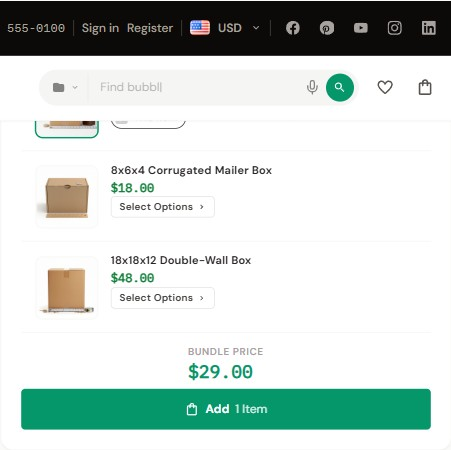

# Frequently Bought Together (FBT)

FBT shows a small bundle of related products on the product page that a shopper can review and add together. It's a simple way to surface obvious add-ons (accessories, consumables, companion items) right where the shopper is deciding.

{ loading=lazy }

## How it works

FBT shows **only when the product has Related Products set in BigCommerce** (Catalog → edit product → **Related Products** tab). If a product has no Related Products linked, the FBT block does not render at all — there is no category fallback.

The block renders in the product info area of the product page (the right column on desktop). It lists the main product plus up to your configured number of related products. Each entry is a card:

- The **main product** is flagged with a **This item** badge and is always included.
- Each **related product** has a checkbox so the shopper can include or exclude it.
- If a related product has variants, it shows a **Select Options** button instead of a plain checkbox — the shopper picks options (via the quick-view step) before that item can be added.
- A **Bundle Price** summary shows the running total for the selected items.
- A **Bundle & Save** badge always appears in the header whenever the FBT block renders.
- A **You save** line appears under the total **only when a Visual Bundle Discount % is set** (see below).
- A single **Add** button adds all selected items to the cart at once.

## Setup

### 1. Turn FBT on

**Theme Editor → eShopping Theme**, in the Frequently Bought Together group:

| Setting | Options | Notes |
| ------- | ------- | ----- |
| **FBT Products Count** | Off — don't show · 1 · 2 · 3 | How many related products to show alongside the main product |
| **Visual Bundle Discount %** | e.g. `10` for 10% off | **Display only** — see the note below |

### 2. About the "Visual Bundle Discount %"

!!! warning "The discount is visual only"
    The **Visual Bundle Discount %** changes only what the shopper *sees*: it lowers the displayed **Bundle Price** and shows a **You save** line. It does **not** discount the actual cart — items are added at their normal price.

    If you want that saving to be real at checkout, you must **create a matching BigCommerce promotion yourself** (Marketing → Promotions). The theme will not create or enforce any promotion. Leave the field at `0` if you only want the convenience of one-click bundle add without any displayed saving.

### 3. (Optional) Choose which products appear

The bundle is built from the main product's **Related Products** list, in order:

1. Catalog → Products → edit the **main** product → **Related Products** tab.
2. Add the partner products in the order you want them to appear.
3. Save.

The FBT block reads up to your **FBT Products Count** from the Related Products list, in order.

---

## How to hide FBT for one specific product

There's no per-product toggle in Theme Editor. The FBT block hides itself automatically when the product has no Related Products linked. So the simplest way to hide FBT on one product is to remove all of its Related Products (Catalog → edit product → Related Products tab → remove).

If you need a hard hide on a specific product while keeping its Related Products, add a CSS-only override via **Storefront → Script Manager** that targets the product ID:

```html
<script>
  (function(){
    var HIDE_FBT_ON = [123, 456]; // product IDs
    var id = parseInt(document.querySelector('.productView[data-entity-id]')?.dataset.entityId, 10);
    if (HIDE_FBT_ON.indexOf(id) !== -1) {
      var s = document.createElement('style');
      s.textContent = '[data-eshopping-fbt]{display:none}';
      document.head.appendChild(s);
    }
  })();
</script>
```

---

## Settings in the demo stores

All four demo stores ship FBT with the same settings:

| Variant | FBT Products Count | Visual Bundle Discount % |
| ------- | :----------------: | :----------------------: |
| Industrial | 2 | 0 |
| Auto Parts | 2 | 0 |
| Electronics | 2 | 0 |
| Packaging | 2 | 0 |

In other words, every demo shows two related products with no displayed saving. Whether the block actually appears on a given product still depends on that product having Related Products linked.

---

## Cross-sell vs FBT

These are two different features. FBT lives on the **product page**; Cross-sell is a **cart** feature.

| | FBT | Cart Cross-sell |
| - | --- | --------------- |
| Where it appears | Product page, in the product info area (right column on desktop) | Cart page and cart drawer |
| Add to cart | One **Add** button for the selected items | Per-product |
| Saving | Optional **visual** bundle % (not a real discount) | Per-product price |
| Source | Product's Related Products | Related Products of the items in your cart (aggregated by frequency) |

You can run both at the same time.

---

## Next

- [Product FAQ tab](product-faq.md)
- [Urgency + recent sales](urgency-and-recent-sales.md)
- [Category page](category.md)
