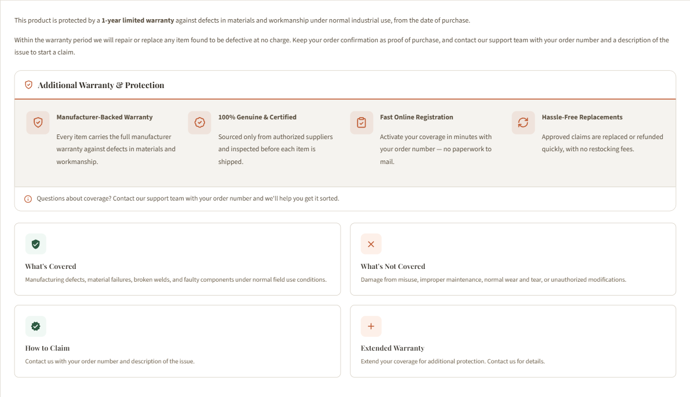

# Product Warranty Tab

The **Warranty** tab shows a product's warranty terms. It appears **only when the product has warranty text** — there is no theme toggle. Inside it the theme layers three things:

1. **Per-product warranty** — the terms you type on each product.
2. **A shared "Additional Warranty" block** — one Page Builder widget, shown on every product.
3. **Coverage card grid** — *What's Covered / Not Covered / How to Claim / Extended*, from one theme setting (see [Warranty text](product.md#shipping-text-warranty-text)).

{ loading=lazy }

---

## 1. Enter warranty per product

Typing warranty terms on a product is what makes the tab appear. Basic HTML (paragraphs, bold, lists) is supported.

<!--te-src:PiAqKkN1c3RvbWl6ZToqKiBCaWdDb21tZXJjZSBhZG1pbiDihpIgKipQcm9kdWN0cyDihpIgQWxsIHByb2R1Y3RzKiog4oaSIG9wZW4gYSBwcm9kdWN0IOKGkiAqKldhcnJhbnR5IEluZm9ybWF0aW9uKiogZmllbGQuIChOb3QgYSB0aGVtZSBzZXR0aW5nIOKAlCBwZXItcHJvZHVjdCBkYXRhLik=-->
<!--te-mock--><div class="te-mock te-nav"><div class="te-nav__brand">BigCommerce admin</div><div class="te-nav__top"><span>Home</span></div><div class="te-nav__top"><span>Orders</span></div><div class="te-nav__top is-open"><span>Products</span><span class="te-nav__chev">⌃</span></div><div class="te-nav__sub is-active">All products</div><div class="te-nav__sub">Add</div><div class="te-nav__sub">Categories</div><div class="te-nav__sub">Options</div><div class="te-nav__sub">Filtering</div><div class="te-nav__sub">Reviews</div><div class="te-nav__sub">Brands</div><div class="te-nav__sub">Import</div><div class="te-nav__sub">Export</div><div class="te-nav__top"><span>Customers</span><span class="te-nav__chev">⌄</span></div><div class="te-nav__top"><span>Storefront</span><span class="te-nav__chev">⌄</span></div><div class="te-nav__top"><span>Marketing</span><span class="te-nav__chev">⌄</span></div><div class="te-nav__top"><span>Analytics</span></div><div class="te-nav__top"><span>Settings</span><span class="te-nav__chev">⌄</span></div></div>

A product with no warranty text shows no Warranty tab. Give every product warranty text for the tab — and the shared block — to appear everywhere.

!!! note "Tabs vs. stacked sections"
    Warranty is a **tab** only when **Show Product Description Tabs** is on (the default). Off → it renders as a stacked section down the page.

<!--te-src:PiAqKkN1c3RvbWl6ZToqKiBUaGVtZSBFZGl0b3Ig4oaSICpQcm9kdWN0cyog4oaSICoqU2hvdyBwcm9kdWN0IGRlc2NyaXB0aW9uIHRhYnMqKiAoaWQgYHNob3dfcHJvZHVjdF9kZXRhaWxzX3RhYnNgKS4gRm9ybWF0OiBvbi9vZmYuIERlZmF1bHQ6IGBvbmAu-->
<!--te-mock--><div class="te-mock"><div class="te-mock__hd"><span>Products</span><span class="te-x">✕</span></div><div class="te-mock__row"><span class="te-lbl">Show product description tabs</span><span class="te-cb is-on"></span></div></div>

---

## 2. Shared "Additional Warranty" block on all products

The Warranty tab exposes a global region — `product_below_warranty--global` — below your terms and above the coverage grid. Drop one widget there for store-wide guarantees on every product:

<!--te-src:PiAqKkN1c3RvbWl6ZToqKiBQYWdlIEJ1aWxkZXIg4oaSIG9wZW4gYSBwcm9kdWN0IHBhZ2Ug4oaSIGRyb3AgYW4gKipBSSBIVE1MIEdlbmVyYXRvcioqIHdpZGdldCBpbnRvICoqYHByb2R1Y3RfYmVsb3dfd2FycmFudHktLWdsb2JhbGAqKiAoYWxsIHByb2R1Y3RzKSBvciAqKmBwcm9kdWN0X2JlbG93X3dhcnJhbnR5YCoqIChvbmUgcHJvZHVjdCkuIChOb3QgYSB0aGVtZSBzZXR0aW5nLik=-->
<!--te-mock--><div class="te-mock te-mock--pb"><div class="te-mock__hd"><span>‹ AI HTML Generator | PapaThemes</span><span class="te-x">⋯</span></div><div class="te-mock__grp">▾ Content</div><div class="te-pbbox"><span class="k">&lt;style&gt;</span><br><span class="s">.papathemes-ai-widget-…</span> { … }<br>…your HTML…<br><span class="k">&lt;/style&gt;</span></div><div class="te-pbbtns"><span class="te-btn-ghost">Expand HTML Editor</span><span class="te-save te-save--full">Save HTML</span></div><div class="te-mock__row"><span class="te-cb"></span><span class="te-lbl">Show in container div</span></div></div>

Paste the snippet below, then edit the four titles and descriptions. Keep the `var(--eshopping-*)` tokens so it matches every variation.

```html
<style>
.eswarr{border:1px solid var(--eshopping-bark-200);border-radius:var(--eshopping-r-md);overflow:hidden;margin:var(--eshopping-sp-5) 0;background:var(--eshopping-bark-50)}
.eswarr__hd{display:flex;align-items:center;gap:var(--eshopping-sp-2);padding:var(--eshopping-sp-3) var(--eshopping-sp-4);font-family:var(--eshopping-font-heading),Georgia,serif;font-weight:700;font-size:1rem;color:var(--eshopping-bark-800);background:var(--eshopping-white);border-bottom:2px solid var(--eshopping-terra)}
.eswarr__hd svg{width:1.15rem;height:1.15rem;color:var(--eshopping-terra);flex-shrink:0}
.eswarr__grid{display:grid;grid-template-columns:repeat(auto-fit,minmax(220px,1fr));gap:var(--eshopping-sp-4);padding:var(--eshopping-sp-5)}
.eswarr__item{display:flex;gap:var(--eshopping-sp-3);align-items:flex-start}
.eswarr__ic{flex-shrink:0;width:40px;height:40px;display:flex;align-items:center;justify-content:center;border-radius:var(--eshopping-r-sm);background:var(--eshopping-terra-tint);color:var(--eshopping-terra)}
.eswarr__ic svg{width:20px;height:20px}
.eswarr__tt{margin:0 0 2px;font-weight:700;font-size:0.93rem;line-height:1.3;color:var(--eshopping-bark-800)}
.eswarr__tx{margin:0;font-size:0.82rem;line-height:1.5;color:var(--eshopping-bark-600)}
.eswarr__note{display:flex;gap:var(--eshopping-sp-2);align-items:center;padding:var(--eshopping-sp-3) var(--eshopping-sp-4);font-size:0.82rem;line-height:1.45;color:var(--eshopping-bark-600);background:var(--eshopping-white);border-top:1px solid var(--eshopping-bark-200)}
.eswarr__note svg{width:1rem;height:1rem;color:var(--eshopping-terra);flex-shrink:0}
</style>
<div class="eswarr">
  <div class="eswarr__hd">
    <svg viewBox="0 0 24 24" fill="none" stroke="currentColor" stroke-width="2" stroke-linecap="round" stroke-linejoin="round"><path d="M12 22s8-4 8-10V5l-8-3-8 3v7c0 6 8 10 8 10z"/><path d="m9 12 2 2 4-4"/></svg>
    <span>Additional Warranty &amp; Protection</span>
  </div>
  <div class="eswarr__grid">
    <div class="eswarr__item">
      <span class="eswarr__ic"><svg viewBox="0 0 24 24" fill="none" stroke="currentColor" stroke-width="2" stroke-linecap="round" stroke-linejoin="round"><path d="M12 22s8-4 8-10V5l-8-3-8 3v7c0 6 8 10 8 10z"/><path d="m9 12 2 2 4-4"/></svg></span>
      <div><p class="eswarr__tt">Manufacturer-Backed Warranty</p><p class="eswarr__tx">Every item carries the full manufacturer warranty against defects in materials and workmanship.</p></div>
    </div>
    <div class="eswarr__item">
      <span class="eswarr__ic"><svg viewBox="0 0 24 24" fill="none" stroke="currentColor" stroke-width="2" stroke-linecap="round" stroke-linejoin="round"><path d="M3.85 8.62a4 4 0 0 1 4.78-4.77 4 4 0 0 1 6.74 0 4 4 0 0 1 4.78 4.78 4 4 0 0 1 0 6.74 4 4 0 0 1-4.77 4.78 4 4 0 0 1-6.75 0 4 4 0 0 1-4.78-4.77 4 4 0 0 1 0-6.76Z"/><path d="m9 12 2 2 4-4"/></svg></span>
      <div><p class="eswarr__tt">100% Genuine &amp; Certified</p><p class="eswarr__tx">Sourced only from authorized suppliers and inspected before each item is shipped.</p></div>
    </div>
    <div class="eswarr__item">
      <span class="eswarr__ic"><svg viewBox="0 0 24 24" fill="none" stroke="currentColor" stroke-width="2" stroke-linecap="round" stroke-linejoin="round"><rect width="8" height="4" x="8" y="2" rx="1"/><path d="M16 4h2a2 2 0 0 1 2 2v14a2 2 0 0 1-2 2H6a2 2 0 0 1-2-2V6a2 2 0 0 1 2-2h2"/><path d="m9 14 2 2 4-4"/></svg></span>
      <div><p class="eswarr__tt">Fast Online Registration</p><p class="eswarr__tx">Activate your coverage in minutes with your order number — no paperwork to mail.</p></div>
    </div>
    <div class="eswarr__item">
      <span class="eswarr__ic"><svg viewBox="0 0 24 24" fill="none" stroke="currentColor" stroke-width="2" stroke-linecap="round" stroke-linejoin="round"><path d="M3 12a9 9 0 0 1 15-6.7L21 8"/><path d="M21 3v5h-5"/><path d="M21 12a9 9 0 0 1-15 6.7L3 16"/><path d="M3 21v-5h5"/></svg></span>
      <div><p class="eswarr__tt">Hassle-Free Replacements</p><p class="eswarr__tx">Approved claims are replaced or refunded quickly, with no restocking fees.</p></div>
    </div>
  </div>
  <div class="eswarr__note">
    <svg viewBox="0 0 24 24" fill="none" stroke="currentColor" stroke-width="2" stroke-linecap="round" stroke-linejoin="round"><circle cx="12" cy="12" r="10"/><path d="M12 16v-4"/><path d="M12 8h.01"/></svg>
    <span>Questions about coverage? Contact our support team with your order number and we'll help you get it sorted.</span>
  </div>
</div>
```

---

## Demo stores

Every product carries an industry-appropriate **Warranty Information** statement, the **Additional Warranty** block sits in `product_below_warranty--global`, and the coverage grid is filled from **PDP Warranty Text**. Only the copy differs between stores.

---

## Next

- [Product FAQs tab](product-faq.md)
- [Product page overview](product.md)
- [Widget regions](widget-regions.md)
