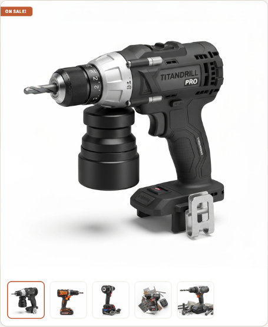
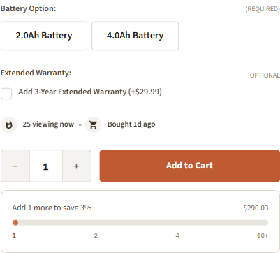
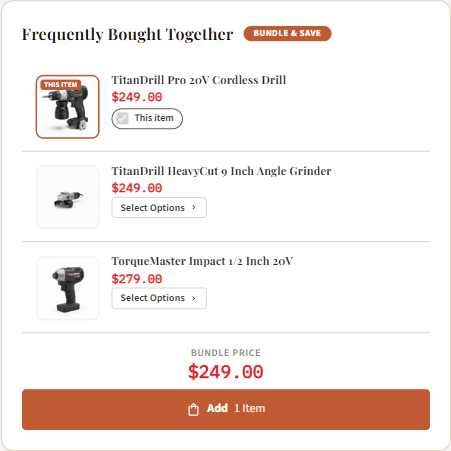
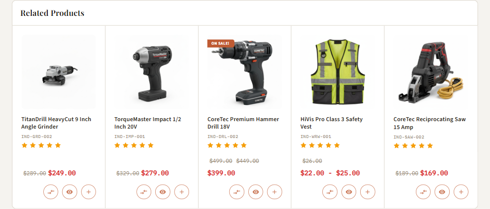
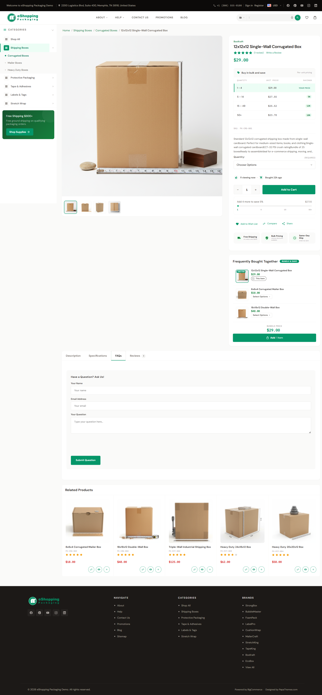

# Product Page (PDP)

The Product Detail Page is the most important page on your storefront — most stores see 60-80% of sessions touch it. eShopping's PDP is composed of these zones:

<div class="pdpwire" aria-hidden="true"><div class="pdpwire__bar">Breadcrumbs</div><div class="pdpwire__cols"><div class="pdpwire__zone pdpwire__gallery"><div class="pdpwire__thumbs"><span></span><span></span><span></span><span></span></div><div class="pdpwire__main">Image gallery<small>thumbnails · main image · lightbox zoom</small></div></div><div class="pdpwire__zone pdpwire__info"><div class="pdpwire__skel pdpwire__skel--brand"></div><div class="pdpwire__skel pdpwire__skel--title"></div><div class="pdpwire__row"><span class="pdpwire__chip">SKU</span><span class="pdpwire__chip">★ Rating</span></div><div class="pdpwire__skel pdpwire__skel--price"></div><div class="pdpwire__row"><span class="pdpwire__chip">Stock badge</span><span class="pdpwire__chip">Urgency strip</span></div><div class="pdpwire__row"><span class="pdpwire__sw"></span><span class="pdpwire__sw"></span><span class="pdpwire__sw"></span><span class="pdpwire__sw"></span><small>variants (color / size)</small></div><div class="pdpwire__row"><span class="pdpwire__qty">Qty</span><span class="pdpwire__cta">Add to Cart</span></div><div class="pdpwire__row"><span class="pdpwire__chip">Wishlist</span><span class="pdpwire__chip">Compare</span></div><div class="pdpwire__row"><span class="pdpwire__chip">Shipping</span><span class="pdpwire__chip">Returns</span><span class="pdpwire__chip">Warranty</span></div></div></div><div class="pdpwire__bar">Frequently Bought Together&nbsp; <small>bundle 1–3 items · optional %</small></div><div class="pdpwire__tabs"><span class="pdpwire__tab pdpwire__tab--active">Description</span><span class="pdpwire__tab">Videos</span><span class="pdpwire__tab">Specs</span><span class="pdpwire__tab">Warranty</span><span class="pdpwire__tab">FAQ</span><span class="pdpwire__tab">Reviews</span></div><div class="pdpwire__bar">Related products</div><div class="pdpwire__bar pdpwire__bar--mobile">Mobile sticky Add-to-Cart <small>· mobile only · on scroll</small></div></div>

This page covers each zone. For the **product card** that appears in sliders and category grids, see [Product card](product-card.md).

---

## Image gallery

The gallery shows the main image with a **horizontal thumbnail strip below it**. There is one thumbnail per uploaded product image, so the strip grows with the number of photos you add. Click the main image for a fullscreen lightbox with zoom (scroll-wheel, double-tap, or pinch).

{ loading=lazy }

### Image sizes

<!--te-lead:U2V0IGluICoqVGhlbWUgRWRpdG9yIOKGkiBQcm9kdWN0cyDihpIgSW1hZ2Ugc2l6ZXMqKjoN-->

<!--te-tbl:fCBTZXR0aW5nIHwgaWQgfCBVc2VkIGZvciB8IERlZmF1bHQgfA0KfCAtLS0tLS0tIHwgLS0gfCAtLS0tLS0tLSB8IC0tLS0tLS0gfA0KfCBNYWluIHByb2R1Y3QgaW1hZ2VzIHwgYHByb2R1Y3Rfc2l6ZWAgfCBNYWluIGdhbGxlcnkgaW1hZ2UgfCBgMTUwMHgxNTAwYCB8DQp8IFRodW1ibmFpbCBpbWFnZSBpbiBwcm9kdWN0IHBhZ2UgfCBgcHJvZHVjdHZpZXdfdGh1bWJfc2l6ZWAgfCBHYWxsZXJ5IHRodW1ibmFpbHMgfCBgMTAweDEwMGAgfA0KfCBab29tZWQgaW1hZ2UgfCBgem9vbV9zaXplYCB8IExpZ2h0Ym94IHpvb20gfCBgMjAwMHgyMDAwYCB8DQp8IEltYWdlIGluIGdhbGxlcnkgdmlldyB8IGBwcm9kdWN0Z2FsbGVyeV9zaXplYCB8IENhcmQgc2xpZGVycyAocHJvZHVjdCBncmlkIGFuZCBzbGlkZXJzKSB8IGAxNTAweDE1MDBgIHwN-->

These settings tell the theme the maximum render size; BigCommerce downscales each uploaded photo to fit.

<!--te-src:PiAqKkN1c3RvbWl6ZToqKiBUaGVtZSBFZGl0b3Ig4oaSICpQcm9kdWN0cyog4oaSICoqSW1hZ2Ugc2l6ZXMqKiAoaGVhZGluZykg4oaSIHRoZSBmaWVsZCBhYm92ZS4gRWFjaCBpcyBhbiBpbWFnZS1kaW1lbnNpb24gcGlja2VyOiBjaG9vc2UgKk9wdGltaXplZCBmb3IgdGhlbWUqIG9yICpTcGVjaWZ5IGRpbWVuc2lvbnMqIGFuZCBlbnRlciBgV0lEVEh4SEVJR0hUYCAoZS5nLiBgMTUwMHgxNTAwYCkuIEZvcm1hdDogYFd4SGAgaW4gcGl4ZWxzLg0=-->
<!--te-src:PiAqKkN1c3RvbWl6ZSAodGhlIHBob3RvcyB0aGVtc2VsdmVzKToqKiBCaWdDb21tZXJjZSBhZG1pbiDihpIgQ2F0YWxvZyDihpIgUHJvZHVjdHMg4oaSIChwcm9kdWN0KSDihpIgSW1hZ2VzLiAoTm90IGEgdGhlbWUgc2V0dGluZy4pIFRoZSBnYWxsZXJ5LCB0aHVtYm5haWwgc3RyaXAgYW5kIGxpZ2h0Ym94IGFyZSBhdXRvbWF0aWMg4oCUIHRoZXJlIGlzICoqbm8qKiBUaGVtZSBFZGl0b3IgdG9nZ2xlIGZvciB0aGUgdGh1bWJuYWlsIGxheW91dCwgbGlnaHRib3ggb3Igem9vbTsgdGhleSByZW5kZXIgZnJvbSB5b3VyIHVwbG9hZGVkIGltYWdlcy4N-->
<!--te-mock--><div class="te-mock"><div class="te-mock__hd"><span>Products</span><span class="te-x">✕</span></div><div class="te-mock__grp">Image sizes</div><div class="te-mock__row"><span class="te-fld"><span class="te-lbl">Main product images</span><span class="te-desc">Main gallery image</span></span><span class="te-dd"><span class="te-dd__v">1500x1500</span><span class="te-dd__b">▾</span></span></div><div class="te-mock__row"><span class="te-fld"><span class="te-lbl">Thumbnail image in product page</span><span class="te-desc">Gallery thumbnails</span></span><span class="te-dd"><span class="te-dd__v">100x100</span><span class="te-dd__b">▾</span></span></div><div class="te-mock__row"><span class="te-fld"><span class="te-lbl">Zoomed image</span><span class="te-desc">Lightbox zoom</span></span><span class="te-dd"><span class="te-dd__v">2000x2000</span><span class="te-dd__b">▾</span></span></div><div class="te-mock__row"><span class="te-fld"><span class="te-lbl">Image in gallery view</span><span class="te-desc">Card sliders</span></span><span class="te-dd"><span class="te-dd__v">1500x1500</span><span class="te-dd__b">▾</span></span></div></div>
<!--te-mock--><div class="te-mock te-nav"><div class="te-nav__brand">BigCommerce admin</div><div class="te-nav__top"><span>Home</span></div><div class="te-nav__top"><span>Orders</span></div><div class="te-nav__top is-open"><span>Products</span><span class="te-nav__chev">⌃</span></div><div class="te-nav__sub">All products</div><div class="te-nav__sub">Add</div><div class="te-nav__sub">Categories</div><div class="te-nav__sub">Options</div><div class="te-nav__sub">Filtering</div><div class="te-nav__sub">Reviews</div><div class="te-nav__sub">Brands</div><div class="te-nav__sub">Import</div><div class="te-nav__sub">Export</div><div class="te-nav__sub is-active">Products</div><div class="te-nav__top"><span>Customers</span><span class="te-nav__chev">⌄</span></div><div class="te-nav__top"><span>Storefront</span><span class="te-nav__chev">⌄</span></div><div class="te-nav__top"><span>Marketing</span><span class="te-nav__chev">⌄</span></div><div class="te-nav__top"><span>Analytics</span></div><div class="te-nav__top"><span>Settings</span><span class="te-nav__chev">⌄</span></div></div>

!!! warning "Always upload large, square images"
    Upload high-resolution square PNG/JPG (e.g. 1500×1500). BigCommerce can downscale for thumbnails and product cards but cannot upscale. A square shape avoids cropping surprises across the gallery and card layouts.

### Videos

Product videos are **YouTube videos**, not uploaded files. Add them in **Catalog → Products → (product) → Videos** by pasting a YouTube URL (or video ID). They do not appear inside the image gallery — they render in the dedicated **Videos** tab below the gallery (see [Tabs](#pdp-tabs)).

<!--te-src:PiAqKkN1c3RvbWl6ZToqKiBCaWdDb21tZXJjZSBhZG1pbiDihpIgQ2F0YWxvZyDihpIgUHJvZHVjdHMg4oaSIChwcm9kdWN0KSDihpIgVmlkZW9zLiAoTm90IGEgdGhlbWUgc2V0dGluZyDigJQgdGhlIFZpZGVvcyB0YWIgYXBwZWFycyBhdXRvbWF0aWNhbGx5IHdoZW4gdGhlIHByb2R1Y3QgaGFzIGF0IGxlYXN0IG9uZSB2aWRlby4pDQ==-->
<!--te-mock--><div class="te-mock te-nav"><div class="te-nav__brand">BigCommerce admin</div><div class="te-nav__top"><span>Home</span></div><div class="te-nav__top"><span>Orders</span></div><div class="te-nav__top is-open"><span>Products</span><span class="te-nav__chev">⌃</span></div><div class="te-nav__sub">All products</div><div class="te-nav__sub">Add</div><div class="te-nav__sub">Categories</div><div class="te-nav__sub">Options</div><div class="te-nav__sub">Filtering</div><div class="te-nav__sub">Reviews</div><div class="te-nav__sub">Brands</div><div class="te-nav__sub">Import</div><div class="te-nav__sub">Export</div><div class="te-nav__sub is-active">Products</div><div class="te-nav__top"><span>Customers</span><span class="te-nav__chev">⌄</span></div><div class="te-nav__top"><span>Storefront</span><span class="te-nav__chev">⌄</span></div><div class="te-nav__top"><span>Marketing</span><span class="te-nav__chev">⌄</span></div><div class="te-nav__top"><span>Analytics</span></div><div class="te-nav__top"><span>Settings</span><span class="te-nav__chev">⌄</span></div></div>

---

## Title, brand, SKU, rating

These come straight from the product record (Catalog → Products → edit). Brand is shown only if you've assigned one. Rating shows the average of all approved reviews.

<!--te-src:PiAqKkN1c3RvbWl6ZSAodGhlIGRhdGEpOioqIEJpZ0NvbW1lcmNlIGFkbWluIOKGkiBDYXRhbG9nIOKGkiBQcm9kdWN0cyDihpIgKHByb2R1Y3QpIOKAlCBOYW1lLCBTS1UsIEJyYW5kLCBXZWlnaHQsIERpbWVuc2lvbnMuIChOb3QgdGhlbWUgc2V0dGluZ3Mg4oCUIHRoZXkgZGlzcGxheSB0aGUgcHJvZHVjdCByZWNvcmQuKQ0=-->
<!--te-mock--><div class="te-mock te-nav"><div class="te-nav__brand">BigCommerce admin</div><div class="te-nav__top"><span>Home</span></div><div class="te-nav__top"><span>Orders</span></div><div class="te-nav__top is-open"><span>Products</span><span class="te-nav__chev">⌃</span></div><div class="te-nav__sub">All products</div><div class="te-nav__sub">Add</div><div class="te-nav__sub">Categories</div><div class="te-nav__sub">Options</div><div class="te-nav__sub">Filtering</div><div class="te-nav__sub">Reviews</div><div class="te-nav__sub">Brands</div><div class="te-nav__sub">Import</div><div class="te-nav__sub">Export</div><div class="te-nav__sub is-active">Products</div><div class="te-nav__top"><span>Customers</span><span class="te-nav__chev">⌄</span></div><div class="te-nav__top"><span>Storefront</span><span class="te-nav__chev">⌄</span></div><div class="te-nav__top"><span>Marketing</span><span class="te-nav__chev">⌄</span></div><div class="te-nav__top"><span>Analytics</span></div><div class="te-nav__top"><span>Settings</span><span class="te-nav__chev">⌄</span></div></div>

**Weight** is gated in two places — both must be on, and the value itself comes from the product record (Catalog → Products → product → Weight). **Dimensions** has no global toggle; it is theme-only.

First the store-wide switch in **BigCommerce admin → Settings → Product Settings**:

<div class="te-adminform"><div class="te-af__hd">Product Settings</div><div class="te-af__row"><span class="te-af__lbl">Show Product's Price?</span><span class="te-af__ctrl"><span class="te-af__cb is-on"></span><span class="te-af__hint">Yes, show the product's price in my store</span></span></div><div class="te-af__row"><span class="te-af__lbl">Show Product's SKU?</span><span class="te-af__ctrl"><span class="te-af__cb is-on"></span><span class="te-af__hint">Yes, show the product's SKU in my store</span></span></div><div class="te-af__row is-focus"><span class="te-af__lbl">Show Product's Weight?</span><span class="te-af__ctrl"><span class="te-af__cb is-on"></span><span class="te-af__hint">Yes, show the product's weight in my store</span></span></div><div class="te-af__row"><span class="te-af__lbl">Show Product's Brand?</span><span class="te-af__ctrl"><span class="te-af__cb is-on"></span><span class="te-af__hint">Yes, show the product's brand in my store</span></span></div><div class="te-af__row"><span class="te-af__lbl">Show Product's Rating?</span><span class="te-af__ctrl"><span class="te-af__cb is-on"></span><span class="te-af__hint">Yes, show the product's rating in my store</span></span></div></div>

Then eShopping's own display checkboxes:

<!--te-lead:KipUaGVtZSBFZGl0b3Ig4oaSIFByb2R1Y3RzIOKGkiBEaXNwbGF5IHNldHRpbmdzKio6DQ==-->

<!--te-tbl:fCBTZXR0aW5nIHwgaWQgfCBFZmZlY3QgfCBEZWZhdWx0IHwNCnwgLS0tLS0tLSB8IC0tIHwgLS0tLS0tIHwgLS0tLS0tLSB8DQp8IFNob3cgcHJvZHVjdCB3ZWlnaHQgfCBgc2hvd19wcm9kdWN0X3dlaWdodGAgfCBTaG93IHdlaWdodCB1bmRlciB0aGUgdGl0bGUgfCBgdHJ1ZWAgfA0KfCBTaG93IHByb2R1Y3QgZGltZW5zaW9ucyB8IGBzaG93X3Byb2R1Y3RfZGltZW5zaW9uc2AgfCBTaG93IEjDl1fDl0QgdW5kZXIgdGhlIHRpdGxlIHwgYGZhbHNlYCB8DQ==-->

<!--te-src:PiAqKkN1c3RvbWl6ZToqKiBUaGVtZSBFZGl0b3Ig4oaSICpQcm9kdWN0cyog4oaSICoqU2hvdyBwcm9kdWN0IHdlaWdodCoqIC8gKipTaG93IHByb2R1Y3QgZGltZW5zaW9ucyoqIChjaGVja2JveGVzLCB1bmRlciB0aGUgKkRpc3BsYXkgc2V0dGluZ3MqIGhlYWRpbmcpLiBGb3JtYXQ6IG9uL29mZi4gRGVmYXVsdHM6IHdlaWdodCBgdHJ1ZWAsIGRpbWVuc2lvbnMgYGZhbHNlYC4N-->
<!--te-mock--><div class="te-mock"><div class="te-mock__hd"><span>Products</span><span class="te-x">✕</span></div><div class="te-mock__grp">Display settings</div><div class="te-mock__row"><span class="te-fld"><span class="te-lbl">Show product weight</span><span class="te-desc">Show weight under the title</span></span><span class="te-cb is-on"></span></div><div class="te-mock__row"><span class="te-fld"><span class="te-lbl">Show product dimensions</span><span class="te-desc">Show H×W×D under the title</span></span><span class="te-cb"></span></div></div>

---

## Price + sale badges

{ loading=lazy }

eShopping shows:

- **Sale price** (or regular if no sale) in the Terra colour
- **Original price** struck-through to the right (only if on sale)
- **Sale badge** as a coloured pill on the image (see below)

<!--te-src:PiAqKkN1c3RvbWl6ZSAodGhlIHByaWNlcyk6KiogQmlnQ29tbWVyY2UgYWRtaW4g4oaSIENhdGFsb2cg4oaSIFByb2R1Y3RzIOKGkiAocHJvZHVjdCkg4oaSIFByaWNpbmcg4oCUIERlZmF1bHQgUHJpY2UsIFNhbGUgUHJpY2UsIE1TUlAgLyBSZXRhaWwgcHJpY2UuIChOb3QgdGhlbWUgc2V0dGluZ3MuKSBUaGUgc2FsZSBwcmljZS9zdHJ1Y2stdGhyb3VnaCBvcmlnaW5hbCBhcmUgZHJpdmVuIGVudGlyZWx5IGJ5IHlvdXIgUHJpY2luZyBmaWVsZHMuDQ==-->
<!--te-mock--><div class="te-mock te-nav"><div class="te-nav__brand">BigCommerce admin</div><div class="te-nav__top"><span>Home</span></div><div class="te-nav__top"><span>Orders</span></div><div class="te-nav__top is-open"><span>Products</span><span class="te-nav__chev">⌃</span></div><div class="te-nav__sub">All products</div><div class="te-nav__sub">Add</div><div class="te-nav__sub">Categories</div><div class="te-nav__sub">Options</div><div class="te-nav__sub">Filtering</div><div class="te-nav__sub">Reviews</div><div class="te-nav__sub">Brands</div><div class="te-nav__sub">Import</div><div class="te-nav__sub">Export</div><div class="te-nav__sub is-active">Products</div><div class="te-nav__top"><span>Customers</span><span class="te-nav__chev">⌄</span></div><div class="te-nav__top"><span>Storefront</span><span class="te-nav__chev">⌄</span></div><div class="te-nav__top"><span>Marketing</span><span class="te-nav__chev">⌄</span></div><div class="te-nav__top"><span>Analytics</span></div><div class="te-nav__top"><span>Settings</span><span class="te-nav__chev">⌄</span></div></div>

When you set an **MSRP / retail price** on the product, the theme shows it struck-through with an automatic **"You save $X"** amount (the difference between the retail price and the selling price). You can override the retail-price label with the **Product price label (retail)** text setting (id `pdp-retail-price-label`, default empty → uses the built-in label) under **Theme Editor → Products → Product sale badges**.

<!--te-lead:Q29uZmlndXJlIHRoZSBiYWRnZSBpbiAqKlRoZW1lIEVkaXRvciDihpIgUHJvZHVjdHMg4oaSIFByb2R1Y3Qgc2FsZSBiYWRnZXMqKjoN-->

<!--te-tbl:fCBTZXR0aW5nIHwgaWQgfCBPcHRpb25zIHwgRGVmYXVsdCB8DQp8IC0tLS0tLS0gfCAtLSB8IC0tLS0tLS0gfCAtLS0tLS0tIHwNCnwgKipTaG93IHByb2R1Y3Qgc2FsZSBiYWRnZXMqKiB8IGBwcm9kdWN0X3NhbGVfYmFkZ2VzYCB8IGBOb25lYCAobm9uZSkgLyBgVG9wIExlZnRgICh0b3BsZWZ0KSAvIGBEaWFnb25hbGAgKHNhc2gpIC8gYEJ1cnN0YCAoYnVyc3QpIHwgYHRvcGxlZnRgIHwNCnwgKipQcm9kdWN0IHNhbGUgYmFkZ2UgbGFiZWwqKiB8IGBwZHBfc2FsZV9iYWRnZV9sYWJlbGAgfCB0ZXh0IOKAlCB0aGUgdGV4dCBpbiB0aGUgYmFkZ2UgKGUuZy4gYFNBTEVgKTsgZW1wdHkg4oaSIGJ1aWx0LWluIGRlZmF1bHQgfCBlbXB0eSB8DQp8ICoqQmFkZ2UgY29sb3IqKiB8IGBjb2xvcl9iYWRnZV9wcm9kdWN0X3NhbGVfYmFkZ2VzYCB8IGNvbG91ciBwaWNrZXIg4oCUIGJhZGdlIGJhY2tncm91bmQgfCAodGhlbWUpIHwNCnwgKipCYWRnZSB0ZXh0IGNvbG9yKiogfCBgY29sb3JfdGV4dF9wcm9kdWN0X3NhbGVfYmFkZ2VzYCB8IGNvbG91ciBwaWNrZXIg4oCUIGJhZGdlIHRleHQgfCAodGhlbWUpIHwN-->

<!--te-src:PiAqKkN1c3RvbWl6ZToqKiBUaGVtZSBFZGl0b3Ig4oaSICpQcm9kdWN0cyog4oaSICoqUHJvZHVjdCBzYWxlIGJhZGdlcyoqIChoZWFkaW5nKSDihpIgZmllbGRzIGFib3ZlLiBCYWRnZSBzdHlsZSBpcyBhIGRyb3Bkb3duOyBsYWJlbCBpcyBwbGFpbiB0ZXh0OyBjb2xvdXJzIGFyZSBwaWNrZXJzLg0=-->
<!--te-mock--><div class="te-mock"><div class="te-mock__hd"><span>Products</span><span class="te-x">✕</span></div><div class="te-mock__grp">Product sale badges</div><div class="te-mock__row"><span class="te-lbl">Show product sale badges</span><span class="te-dd"><span class="te-dd__v">Top Left</span><span class="te-dd__b">▾</span></span></div><div class="te-mock__row"><span class="te-fld"><span class="te-lbl">Product sale badge label</span><span class="te-desc">the text in the badge (e.g. SALE); empty → built-in default</span></span><span class="te-tx te-tx--ph">Enter text…</span></div><div class="te-mock__row"><span class="te-fld"><span class="te-lbl">Badge color</span><span class="te-desc">badge background</span></span><span class="te-color"><span class="te-hex">#BF5B33</span><span class="te-sw" style="background:#bf5b33"></span></span></div><div class="te-mock__row"><span class="te-fld"><span class="te-lbl">Badge text color</span><span class="te-desc">badge text</span></span><span class="te-color"><span class="te-hex">#FFFFFF</span><span class="te-sw" style="background:#ffffff"></span></span></div></div>

<!--te-lead:Rm9yIHRoZSAqKiJTb2xkIG91dCIqKiBiYWRnZSAoc2FtZSBoZWFkaW5nKToN-->

<!--te-tbl:fCBTZXR0aW5nIHwgaWQgfCBFZmZlY3QgfCBEZWZhdWx0IHwNCnwgLS0tLS0tLSB8IC0tIHwgLS0tLS0tIHwgLS0tLS0tLSB8DQp8ICoqU2hvdyBwcm9kdWN0IHNvbGQtb3V0IGJhZGdlcyoqIHwgYHByb2R1Y3Rfc29sZF9vdXRfYmFkZ2VzYCB8IEJhZGdlIHN0eWxlOiBgTm9uZWAgLyBgVG9wIExlZnRgIC8gYERpYWdvbmFsYCAvIGBCdXJzdGAgfCBgbm9uZWAgKG9mZikgfA0KfCAqKlByb2R1Y3Qgc29sZCBvdXQgYmFkZ2UgbGFiZWwqKiB8IGBwZHBfc29sZF9vdXRfbGFiZWxgIHwgZS5nLiBgU29sZCBvdXRgOyBlbXB0eSDihpIgYnVpbHQtaW4gZGVmYXVsdCB8IGVtcHR5IHwN-->

<!--te-src:PiAqKkN1c3RvbWl6ZToqKiBUaGVtZSBFZGl0b3Ig4oaSICpQcm9kdWN0cyog4oaSICoqUHJvZHVjdCBzYWxlIGJhZGdlcyoqIOKGkiAqKlNob3cgcHJvZHVjdCBzb2xkLW91dCBiYWRnZXMqKiAvICoqUHJvZHVjdCBzb2xkIG91dCBiYWRnZSBsYWJlbCoqLiBUaGUgc29sZC1vdXQgYmFkZ2UgaXMgKipvZmYgYnkgZGVmYXVsdCoqIChgbm9uZWApLg0=-->
<!--te-mock--><div class="te-mock"><div class="te-mock__hd"><span>Products</span><span class="te-x">✕</span></div><div class="te-mock__row"><span class="te-lbl">Show product sold-out badges</span><span class="te-dd"><span class="te-dd__v">None</span><span class="te-dd__b">▾</span></span></div><div class="te-mock__row"><span class="te-fld"><span class="te-lbl">Product sold out badge label</span><span class="te-desc">e.g. Sold out; empty → built-in default</span></span><span class="te-tx te-tx--ph">Enter text…</span></div></div>

### Staff Pick badge colour

eShopping renders a **Staff Pick** badge on certain product cards. There is no merchant-facing toggle to enable it per product and no custom-badge value field — only the styling is controlled, by two colour pickers in the **eShopping Theme** section:

<!--te-tbl:fCBTZXR0aW5nIHwgaWQgfCBFZmZlY3QgfA0KfCAtLS0tLS0tIHwgLS0gfCAtLS0tLS0gfA0KfCAqKlN0YWZmIFBpY2sgQmFkZ2UgQmFja2dyb3VuZCoqIHwgYGVzaG9wcGluZy1iYWRnZS1zdGFmZi1iZ2AgfCBCYWRnZSBiYWNrZ3JvdW5kIGNvbG91ciB8DQp8ICoqU3RhZmYgUGljayBCYWRnZSBUZXh0KiogfCBgZXNob3BwaW5nLWJhZGdlLXN0YWZmLXRleHRgIHwgQmFkZ2UgdGV4dCBjb2xvdXIgfA0=-->

<!--te-src:PiAqKkN1c3RvbWl6ZToqKiBUaGVtZSBFZGl0b3Ig4oaSICplU2hvcHBpbmcgVGhlbWUqIOKGkiAqKlN0YWZmIFBpY2sgQmFkZ2UgQmFja2dyb3VuZCoqIC8gKipTdGFmZiBQaWNrIEJhZGdlIFRleHQqKiAoY29sb3VyIHBpY2tlcnMpLiBUaGVzZSBvbmx5IHJlc3R5bGUgdGhlIGJhZGdlIOKAlCB0aGVyZSBpcyBubyBzZXR0aW5nIHRvIGNob29zZSAqd2hpY2gqIHByb2R1Y3RzIHNob3cgaXQuDQ==-->
<!--te-mock--><div class="te-mock"><div class="te-mock__hd"><span>eShopping Theme</span><span class="te-x">✕</span></div><div class="te-mock__row"><span class="te-fld"><span class="te-lbl">Staff Pick Badge Background</span><span class="te-desc">Badge background colour</span></span><span class="te-color"><span class="te-hex">#D97706</span><span class="te-sw" style="background:#d97706"></span></span></div><div class="te-mock__row"><span class="te-fld"><span class="te-lbl">Staff Pick Badge Text</span><span class="te-desc">Badge text colour</span></span><span class="te-color"><span class="te-hex">#FFFFFF</span><span class="te-sw" style="background:#ffffff"></span></span></div></div>

---

## Variants — swatches

{ loading=lazy }

Color / size variants appear as **swatches** if you've set them up in **Catalog → Product Options & SKUs**:

- **Color swatches** — for option type "Swatch (Color)". The theme renders them as colour circles.
- **Image swatches** — for option type "Swatch (Image)". The theme renders the option image.
- **Rectangle text swatches** — for "Rectangle list" options (size: S / M / L). Rendered as text pills.

<!--te-src:PiAqKkN1c3RvbWl6ZSAodGhlIHZhcmlhbnRzKToqKiBCaWdDb21tZXJjZSBhZG1pbiDihpIgQ2F0YWxvZyDihpIgUHJvZHVjdCBPcHRpb25zICYgU0tVcyAoc2hhcmVkIG9wdGlvbnMpIG9yIHRoZSBwcm9kdWN0J3MgKipWYXJpYXRpb25zKiogdGFiLiAoTm90IGEgdGhlbWUgc2V0dGluZyDigJQgc3dhdGNoIGNvbG91cnMvaW1hZ2VzIGNvbWUgZnJvbSB5b3VyIG9wdGlvbiB2YWx1ZXMuKQ0=-->
<!--te-mock--><div class="te-mock te-nav"><div class="te-nav__brand">BigCommerce admin</div><div class="te-nav__top"><span>Home</span></div><div class="te-nav__top"><span>Orders</span></div><div class="te-nav__top is-open"><span>Products</span><span class="te-nav__chev">⌃</span></div><div class="te-nav__sub">All products</div><div class="te-nav__sub">Add</div><div class="te-nav__sub">Categories</div><div class="te-nav__sub">Options</div><div class="te-nav__sub">Filtering</div><div class="te-nav__sub">Reviews</div><div class="te-nav__sub">Brands</div><div class="te-nav__sub">Import</div><div class="te-nav__sub">Export</div><div class="te-nav__sub is-active">Product Options &amp; SKUs</div><div class="te-nav__top"><span>Customers</span><span class="te-nav__chev">⌄</span></div><div class="te-nav__top"><span>Storefront</span><span class="te-nav__chev">⌄</span></div><div class="te-nav__top"><span>Marketing</span><span class="te-nav__chev">⌄</span></div><div class="te-nav__top"><span>Analytics</span></div><div class="te-nav__top"><span>Settings</span><span class="te-nav__chev">⌄</span></div></div>

The swatch sizes shown are styled by the theme. The only configurable image dimension is **Product swatch images** (id `swatch_option_size`, default `22x22`) under **Theme Editor → Products → Image sizes**, which controls the source resolution of image swatches.

<!--te-src:PiAqKkN1c3RvbWl6ZSAoc3dhdGNoIGltYWdlIHJlc29sdXRpb24pOioqIFRoZW1lIEVkaXRvciDihpIgKlByb2R1Y3RzKiDihpIgKipQcm9kdWN0IHN3YXRjaCBpbWFnZXMqKi4gRm9ybWF0OiBgV3hIYCBwaXhlbHMuIERlZmF1bHQ6IGAyMngyMmAuIChGb3IgdGV4dHVyZSBzd2F0Y2hlcyBCaWdDb21tZXJjZSBjYXBzIHNvdXJjZSBpbWFnZXMgYXQgYDE1MHgxNTBgLikN-->
<!--te-mock--><div class="te-mock"><div class="te-mock__hd"><span>Products</span><span class="te-x">✕</span></div><div class="te-mock__row"><span class="te-lbl">Product swatch images</span><span class="te-dd"><span class="te-dd__v">22x22</span><span class="te-dd__b">▾</span></span></div></div>

To **show swatch names beside the swatch** (e.g. "Black" next to a black swatch), check **Show product swatch names** (id `show_product_swatch_names`) in the Products panel.

<!--te-src:PiAqKkN1c3RvbWl6ZToqKiBUaGVtZSBFZGl0b3Ig4oaSICpQcm9kdWN0cyog4oaSICoqU2hvdyBwcm9kdWN0IHN3YXRjaCBuYW1lcyoqIChjaGVja2JveCwgdW5kZXIgKkRpc3BsYXkgc2V0dGluZ3MqKS4gRm9ybWF0OiBvbi9vZmYuIERlZmF1bHQ6IGB0cnVlYC4N-->
<!--te-mock--><div class="te-mock"><div class="te-mock__hd"><span>Products</span><span class="te-x">✕</span></div><div class="te-mock__row"><span class="te-lbl">Show product swatch names</span><span class="te-cb is-on"></span></div></div>

---

## Add to Cart + sticky mobile ATC

The **Add to Cart** button is always visible on desktop. On mobile, when the user scrolls past it, a sticky bottom bar appears with **price + ATC**.

Toggle the mobile sticky ATC:

<!--te-src:PiAqKkN1c3RvbWl6ZToqKiBUaGVtZSBFZGl0b3Ig4oaSICplU2hvcHBpbmcgVGhlbWUqIOKGkiAqKlNob3cgTW9iaWxlIFN0aWNreSBBZGQgdG8gQ2FydCoqIChjaGVja2JveCwgdW5kZXIgdGhlICpQcm9kdWN0IFBhZ2UgKFBEUCkqIGhlYWRpbmc7IGlkIGBlc2hvcHBpbmctcGRwLXNob3ctbW9iaWxlLWF0Y2ApLiBGb3JtYXQ6IG9uL29mZi4gRGVmYXVsdDogYHRydWVgLg0=-->
<!--te-mock--><div class="te-mock"><div class="te-mock__hd"><span>eShopping Theme</span><span class="te-x">✕</span></div><div class="te-mock__row"><span class="te-lbl">Show Mobile Sticky Add to Cart</span><span class="te-cb is-on"></span></div></div>

### Quick payment buttons

When BigCommerce's express-checkout providers (PayPal, Apple Pay, etc.) are enabled in your store, the theme can render their quick-payment buttons beneath Add to Cart.

<!--te-src:PiAqKkN1c3RvbWl6ZToqKiBUaGVtZSBFZGl0b3Ig4oaSICpQcm9kdWN0cyog4oaSICoqU2hvdyBxdWljayBwYXltZW50IGJ1dHRvbnMqKiAoY2hlY2tib3gsIHVuZGVyICpEaXNwbGF5IHNldHRpbmdzKjsgaWQgYHNob3dfcXVpY2tfcGF5bWVudF9idXR0b25zYCkuIEZvcm1hdDogb24vb2ZmLiBEZWZhdWx0OiBgdHJ1ZWAuIFRoZSBidXR0b25zIHRoZW1zZWx2ZXMgY29tZSBmcm9tIHRoZSBwYXltZW50IHByb3ZpZGVycyB5b3UgZW5hYmxlIGluIEJpZ0NvbW1lcmNlIGFkbWluIOKGkiBTZXR0aW5ncyDihpIgUGF5bWVudHMg4oCUIGNvbG91cnMvc2hhcGVzL2xhYmVscyBhcmUgdHVuZWQgdW5kZXIgVGhlbWUgRWRpdG9yIOKGkiAqUGF5bWVudCBidXR0b25zKi4N-->
<!--te-mock--><div class="te-mock"><div class="te-mock__hd"><span>Products</span><span class="te-x">✕</span></div><div class="te-mock__row"><span class="te-lbl">Show quick payment buttons</span><span class="te-cb is-on"></span></div></div>

### Compare

The **Add to compare** control lets shoppers queue products into a compare panel.

<!--te-src:PiAqKkN1c3RvbWl6ZToqKiBUaGVtZSBFZGl0b3Ig4oaSICpQcm9kdWN0cyog4oaSICoqU2hvdyBwcm9kdWN0IGNvbXBhcmUqKiAoY2hlY2tib3gsIHVuZGVyICpEaXNwbGF5IHNldHRpbmdzKjsgaWQgYHNob3dfY29tcGFyZWApLiBGb3JtYXQ6IG9uL29mZi4gRGVmYXVsdDogYHRydWVgLg0=-->
<!--te-mock--><div class="te-mock"><div class="te-mock__hd"><span>Products</span><span class="te-x">✕</span></div><div class="te-mock__row"><span class="te-lbl">Show product compare</span><span class="te-cb is-on"></span></div></div>

---

## Shipping text + Warranty text { #shipping-text-warranty-text }

These are two separate settings in the **eShopping Theme** section, under the *Product Page (PDP)* heading, and they appear in different places.

**PDP Shipping Text** (id `eshopping-pdp-shipping-text`) produces the **3-item icon strip** shown under the Add-to-Cart button. It is a single field made of exactly **three `Title|Description` pairs** (6 pipe-separated segments — `Title1|Desc1|Title2|Desc2|Title3|Desc3`). The strip always renders three fixed icon cards (truck, shield, clock); extra segments are ignored.

{ loading=lazy }

```
Free Shipping|on orders over $500|1-Year Warranty|included with purchase|30-Day Returns|hassle-free policy
```

Plain text only — HTML and links are **not** supported (each segment is inserted as plain text via `textContent`). The strip is hidden entirely if the field is empty.

<!--te-src:PiAqKkN1c3RvbWl6ZToqKiBUaGVtZSBFZGl0b3Ig4oaSICplU2hvcHBpbmcgVGhlbWUqIOKGkiAqKlBEUCBTaGlwcGluZyBUZXh0KiogKHRleHQgaW5wdXQsIHVuZGVyICpQcm9kdWN0IFBhZ2UgKFBEUCkqOyBpZCBgZXNob3BwaW5nLXBkcC1zaGlwcGluZy10ZXh0YCkuIEZvcm1hdDogYFRpdGxlMXxEZXNjMXxUaXRsZTJ8RGVzYzJ8VGl0bGUzfERlc2MzYCAocGlwZS1kZWxpbWl0ZWQsIDYgc2VnbWVudHMpLiBEZWZhdWx0IChiYXNlKTogYEZyZWUgU2hpcHBpbmd8b24gb3JkZXJzIG92ZXIgJDUwMHwxLVllYXIgV2FycmFudHl8aW5jbHVkZWQgd2l0aCBwdXJjaGFzZXwzMC1EYXkgUmV0dXJuc3xoYXNzbGUtZnJlZSBwb2xpY3lgLg0=-->
<!--te-mock--><div class="te-mock"><div class="te-mock__hd"><span>eShopping Theme</span><span class="te-x">✕</span></div><div class="te-mock__row"><span class="te-lbl">PDP Shipping Text</span><span class="te-tx">Free Shipping|on orders over $500|1-…</span></div></div>

**PDP Warranty Text** (id `eshopping-pdp-warranty-text`) is a separate field that fills the **4-card grid inside the Warranty tab** (not the strip under the ATC). It is made of exactly **four `Title|Description` pairs** (8 pipe segments). The grid always renders four fixed cards.

```
What's Covered|...|What's Not Covered|...|How to Claim|...|Extended Warranty|...
```

<!--te-src:PiAqKkN1c3RvbWl6ZToqKiBUaGVtZSBFZGl0b3Ig4oaSICplU2hvcHBpbmcgVGhlbWUqIOKGkiAqKlBEUCBXYXJyYW50eSBUZXh0KiogKHRleHQgaW5wdXQsIHVuZGVyICpQcm9kdWN0IFBhZ2UgKFBEUCkqOyBpZCBgZXNob3BwaW5nLXBkcC13YXJyYW50eS10ZXh0YCkuIEZvcm1hdDogYFRpdGxlMXxEZXNjMXxUaXRsZTJ8RGVzYzJ8VGl0bGUzfERlc2MzfFRpdGxlNHxEZXNjNGAgKHBpcGUtZGVsaW1pdGVkLCA4IHNlZ21lbnRzKS4gUGxhaW4gdGV4dCBvbmx5LiBOb3RlOiB0aGUgd2FycmFudHkgKnRhYiogb25seSBhcHBlYXJzIHdoZW4gdGhlIHByb2R1Y3QgaGFzIFdhcnJhbnR5IEluZm9ybWF0aW9uIChDYXRhbG9nIOKGkiBQcm9kdWN0cyDihpIgZWRpdCDihpIgV2FycmFudHkgSW5mb3JtYXRpb24pOyB0aGlzIGZpZWxkIG9ubHkgZmlsbHMgdGhlIGNhcmQgZ3JpZCBpbnNpZGUgdGhhdCB0YWIuDQ==-->
<!--te-mock--><div class="te-mock"><div class="te-mock__hd"><span>eShopping Theme</span><span class="te-x">✕</span></div><div class="te-mock__row"><span class="te-lbl">PDP Warranty Text</span><span class="te-tx te-tx--ph">Enter text…</span></div></div>

---

## Tabs (Description · Videos · Specs · Warranty · FAQ · Reviews) { #pdp-tabs }

<!--te-lead:VGhlIHRhYnMgYXBwZWFyIGJlbG93IHRoZSBnYWxsZXJ5LiBNb3N0IHRvZ2dsZXMgbGl2ZSBpbiAqKlRoZW1lIEVkaXRvciDihpIgUHJvZHVjdHMg4oaSIERpc3BsYXkgc2V0dGluZ3MqKjoN-->

<!--te-tbl:fCBTZXR0aW5nIHwgaWQgfCBFZmZlY3QgfCBEZWZhdWx0IHwNCnwgLS0tLS0tLSB8IC0tIHwgLS0tLS0tIHwgLS0tLS0tLSB8DQp8IFNob3cgcHJvZHVjdCBkZXNjcmlwdGlvbiB0YWJzIHwgYHNob3dfcHJvZHVjdF9kZXRhaWxzX3RhYnNgIHwgU2hvdyB0aGUgdGFiIHN0cmlwIGF0IGFsbCB8IGB0cnVlYCB8DQp8IFNob3cgcHJvZHVjdCByZXZpZXdzIHwgYHNob3dfcHJvZHVjdF9yZXZpZXdzYCB8IEFkZCB0aGUgKipSZXZpZXdzKiogdGFiIChvbmx5IHJlbmRlcnMgd2hlbiB0aGUgcHJvZHVjdCBoYXMgcmV2aWV3cykgfCBgdHJ1ZWAgfA0KfCBQcm9kdWN0IGN1c3RvbSBmaWVsZHMgaW4gdGFicyB8IGBzaG93X2N1c3RvbV9maWVsZHNfdGFic2AgfCBTaG93IGEgKipTcGVjaWZpY2F0aW9ucyoqIHRhYiB3aXRoIEFMTCBvZiB0aGUgcHJvZHVjdCdzIGN1c3RvbSBmaWVsZHMgcmVuZGVyZWQgYXMgYSAyLWNvbHVtbiB0YWJsZSB8IGB0cnVlYCB8DQ==-->

<!--te-src:PiAqKkN1c3RvbWl6ZToqKiBUaGVtZSBFZGl0b3Ig4oaSICpQcm9kdWN0cyog4oaSICoqU2hvdyBwcm9kdWN0IGRlc2NyaXB0aW9uIHRhYnMqKiAvICoqU2hvdyBwcm9kdWN0IHJldmlld3MqKiAvICoqUHJvZHVjdCBjdXN0b20gZmllbGRzIGluIHRhYnMqKiAoY2hlY2tib3hlcywgdW5kZXIgKkRpc3BsYXkgc2V0dGluZ3MqKS4gRm9ybWF0OiBvbi9vZmYuDQ==-->
<!--te-src:PiAqKkN1c3RvbWl6ZSAobnVtYmVyIG9mIHJldmlld3MpOioqIFRoZW1lIEVkaXRvciDihpIgKlByb2R1Y3RzKiDihpIgKipOdW1iZXIgb2YgcHJvZHVjdCByZXZpZXdzKiogKGRyb3Bkb3duIDHigJMxMjsgaWQgYHByb2R1Y3RwYWdlX3Jldmlld3NfY291bnRgOyBzaG93biBvbmx5IHdoZW4gKlNob3cgcHJvZHVjdCByZXZpZXdzKiBpcyBvbikuIERlZmF1bHQ6IGA5YC4N-->
<!--te-mock--><div class="te-mock"><div class="te-mock__hd"><span>Products</span><span class="te-x">✕</span></div><div class="te-mock__grp">Display settings</div><div class="te-mock__row"><span class="te-fld"><span class="te-lbl">Show product description tabs</span><span class="te-desc">Show the tab strip at all</span></span><span class="te-cb is-on"></span></div><div class="te-mock__row"><span class="te-fld"><span class="te-lbl">Show product reviews</span><span class="te-desc">Add the Reviews tab</span></span><span class="te-cb is-on"></span></div><div class="te-mock__row"><span class="te-fld"><span class="te-lbl">Product custom fields in tabs</span><span class="te-desc">Show a Specifications tab with ALL of the product's custom fields ren…</span></span><span class="te-cb is-on"></span></div></div>
<!--te-mock--><div class="te-mock"><div class="te-mock__hd"><span>Products</span><span class="te-x">✕</span></div><div class="te-mock__row"><span class="te-lbl">Number of product reviews</span><span class="te-tx">9</span></div></div>

The **FAQ** tab is toggled separately in the **eShopping Theme** section with the **Show FAQ Tab** setting (a built-in ask-a-question form — see [Product FAQ](product-faq.md)).

<!--te-src:PiAqKkN1c3RvbWl6ZToqKiBUaGVtZSBFZGl0b3Ig4oaSICplU2hvcHBpbmcgVGhlbWUqIOKGkiAqKlNob3cgRkFRIFRhYioqIChjaGVja2JveCwgdW5kZXIgKlByb2R1Y3QgUGFnZSAoUERQKSo7IGlkIGBlc2hvcHBpbmctcGRwLXNob3ctZmFxLXRhYmApLiBGb3JtYXQ6IG9uL29mZi4gRGVmYXVsdDogYHRydWVgLg0=-->
<!--te-mock--><div class="te-mock"><div class="te-mock__hd"><span>eShopping Theme</span><span class="te-x">✕</span></div><div class="te-mock__row"><span class="te-lbl">Show FAQ Tab</span><span class="te-cb is-on"></span></div></div>

The **Warranty** tab is rendered automatically when the product has warranty text (Catalog → Products → edit → Warranty Information). Inside the warranty tab the theme shows a 4-card grid of warranty highlights (set the four title/description pairs in the **PDP Warranty Text** field — id `eshopping-pdp-warranty-text`, in the *eShopping Theme* section under *Product Page (PDP)*), plus an area below the cards where you can drop a widget — either on every product (region `product_below_warranty--global`) or on one specific product (region `product_below_warranty`).

<!--te-src:PiAqKkN1c3RvbWl6ZSAod2lkZ2V0IGJlbG93IHRoZSB3YXJyYW50eSBjYXJkcyk6KiogUGFnZSBCdWlsZGVyIOKGkiBvcGVuIGEgcHJvZHVjdCBwYWdlIOKGkiBkcm9wIGFuIEhUTUwgLyBBY2NvcmRpb24gLyBCYW5uZXIgd2lkZ2V0IGludG8gdGhlICoqQmVsb3cgd2FycmFudHkqKiByZWdpb24uIFVzZSB0aGUgZ2xvYmFsIHBsYWNlbWVudCBmb3IgYWxsIHByb2R1Y3RzIG9yIHRoZSBwYWdlLXNwZWNpZmljIHBsYWNlbWVudCBmb3Igb25lIHByb2R1Y3QuDQ==-->
<!--te-mock--><div class="te-mock te-mock--pb"><div class="te-mock__hd"><span>‹ AI HTML Generator | PapaThemes</span><span class="te-x">⋯</span></div><div class="te-mock__grp">▾ Content</div><div class="te-pbbox"><span class="k">&lt;style&gt;</span><br><span class="s">.papathemes-ai-widget-…</span> { … }<br>…your HTML…<br><span class="k">&lt;/style&gt;</span></div><div class="te-pbbtns"><span class="te-btn-ghost">Expand HTML Editor</span><span class="te-save te-save--full">Save HTML</span></div><div class="te-mock__row"><span class="te-cb"></span><span class="te-lbl">Show in container div</span></div></div>

The **Videos** tab is rendered automatically when the product has videos uploaded.

### Adding "Shipping & Returns" or other content to every PDP

eShopping provides a widget area that renders BELOW the tabs (not inside them) on every PDP. Drop any HTML / Accordion / Banner widget there. There's also a matching area for content on a single product.

### Customizing the Specifications tab label

Use the **Product custom fields tab label** text setting (id `pdp-custom-fields-tab-label`) to override the tab title. Leave it empty to use the default ("Specifications").

<!--te-src:PiAqKkN1c3RvbWl6ZToqKiBUaGVtZSBFZGl0b3Ig4oaSICpQcm9kdWN0cyog4oaSICoqUHJvZHVjdCBjdXN0b20gZmllbGRzIHRhYiBsYWJlbCoqICh0ZXh0IGlucHV0LCB1bmRlciAqRGlzcGxheSBzZXR0aW5ncyo7IHNob3duIG9ubHkgd2hlbiAqUHJvZHVjdCBjdXN0b20gZmllbGRzIGluIHRhYnMqIGlzIG9uKS4gRm9ybWF0OiBwbGFpbiB0ZXh0LiBEZWZhdWx0OiBlbXB0eSAo4oaSICJTcGVjaWZpY2F0aW9ucyIpLiBUaGUgY3VzdG9tLWZpZWxkICp2YWx1ZXMqIGNvbWUgZnJvbSBCaWdDb21tZXJjZSBhZG1pbiDihpIgQ2F0YWxvZyDihpIgUHJvZHVjdHMg4oaSIChwcm9kdWN0KSDihpIgQ3VzdG9tIEZpZWxkcy4N-->
<!--te-mock--><div class="te-mock"><div class="te-mock__hd"><span>Products</span><span class="te-x">✕</span></div><div class="te-mock__row"><span class="te-lbl">Product custom fields tab label</span><span class="te-tx te-tx--ph">Enter text…</span></div></div>

---

## Frequently Bought Together (FBT)

{ loading=lazy }

A bundle widget that appears above the tab strip (between the image/info section and the tabs), showing the current product + 1–3 frequently-paired products with an optional bundle discount. See full guide: [Frequently Bought Together](product-fbt.md).

<!--te-lead:UXVpY2sgdG9nZ2xlcyAoKipUaGVtZSBFZGl0b3Ig4oaSIGVTaG9wcGluZyBUaGVtZSoqLCB1bmRlciB0aGUgKkZyZXF1ZW50bHkgQm91Z2h0IFRvZ2V0aGVyKiBoZWFkaW5nKToN-->

<!--te-tbl:fCBTZXR0aW5nIHwgaWQgfCBFZmZlY3QgfCBEZWZhdWx0IHwNCnwgLS0tLS0tLSB8IC0tIHwgLS0tLS0tIHwgLS0tLS0tLSB8DQp8IEZCVCBQcm9kdWN0cyBDb3VudCB8IGBlc2hvcHBpbmctZmJ0LWNvdW50YCB8IGRyb3Bkb3duIGBPZmYg4oCUIGRvbid0IHNob3dgICgwKSAvIGAxYCAvIGAyYCAvIGAzYCDigJQgbnVtYmVyIG9mIHBhaXJlZCBwcm9kdWN0cyB8IGAyYCB8DQp8IFZpc3VhbCBCdW5kbGUgRGlzY291bnQgJSB8IGBlc2hvcHBpbmctZmJ0LWRpc2NvdW50LXBlcmNlbnRgIHwgdGV4dCDigJQgZS5nLiBgMTBgIGZvciAxMCUgb2ZmIHRoZSBidW5kbGUgfCBgMGAgfA0=-->

<!--te-src:PiAqKkN1c3RvbWl6ZToqKiBUaGVtZSBFZGl0b3Ig4oaSICplU2hvcHBpbmcgVGhlbWUqIOKGkiAqKkZCVCBQcm9kdWN0cyBDb3VudCoqIChkcm9wZG93bjsgYDBgIGhpZGVzIHRoZSB3aG9sZSBGQlQgYmxvY2spIGFuZCAqKlZpc3VhbCBCdW5kbGUgRGlzY291bnQgJSoqICh0ZXh0IGlucHV0OyBudW1iZXIgb25seSwgbm8gYCVgIHNpZ24pLiBEZWZhdWx0czogY291bnQgYDJgLCBkaXNjb3VudCBgMGAuIFRoZSBwYWlyZWQgcHJvZHVjdHMgY29tZSBmcm9tIEJpZ0NvbW1lcmNlIGFkbWluIOKGkiBDYXRhbG9nIOKGkiBQcm9kdWN0cyDihpIgKHByb2R1Y3QpIOKGkiBSZWxhdGVkIFByb2R1Y3RzLg0=-->
<!--te-mock--><div class="te-mock"><div class="te-mock__hd"><span>eShopping Theme</span><span class="te-x">✕</span></div><div class="te-mock__grp">Frequently Bought Toget…</div><div class="te-mock__row"><span class="te-fld"><span class="te-lbl">FBT Products Count</span><span class="te-desc">number of paired products</span></span><span class="te-dd"><span class="te-dd__v">2</span><span class="te-dd__b">▾</span></span></div><div class="te-mock__row"><span class="te-fld"><span class="te-lbl">Visual Bundle Discount %</span><span class="te-desc">e.g. 10 for 10% off the bundle</span></span><span class="te-tx">0</span></div></div>

---

## Related products

{ loading=lazy }

Below the tabs the PDP shows a single **Related products** slider. Related products come from the product's Related Products list in BigCommerce — automatic (by category) by default, or manually curated per product in **Catalog → Products**. The slider only renders when the product has related products.

<!--te-tbl:fCBTZXR0aW5nIHwgaWQgfCBFZmZlY3QgfCBEZWZhdWx0IHwNCnwgLS0tLS0tLSB8IC0tIHwgLS0tLS0tIHwgLS0tLS0tLSB8DQp8ICoqUHJvZHVjdCBwYWdlIChyZWxhdGVkIHByb2R1Y3RzKSoqIHwgYHByb2R1Y3RwYWdlX3JlbGF0ZWRfcHJvZHVjdHNfY291bnRgIHwgZHJvcGRvd24g4oCUIGhvdyBtYW55IHRvIHNob3cgKGBEaXNhYmxlYCAwIOKGkiBgMTJgKTsgYDBgIGhpZGVzIHRoZSBzbGlkZXIgfCBgMTBgIHwN-->

<!--te-src:PiAqKkN1c3RvbWl6ZToqKiBUaGVtZSBFZGl0b3Ig4oaSICpQcm9kdWN0cyog4oaSICoqUHJvZHVjdCBwYWdlIChyZWxhdGVkIHByb2R1Y3RzKSoqIChkcm9wZG93biwgdW5kZXIgdGhlICpOdW1iZXIgb2YgcHJvZHVjdHMgZGlzcGxheWVkKiBoZWFkaW5nOyBpZCBgcHJvZHVjdHBhZ2VfcmVsYXRlZF9wcm9kdWN0c19jb3VudGApLiBGb3JtYXQ6IHNlbGVjdCDigJQgYERpc2FibGVgICgwKSB1cCB0byBgMTJgLiBEZWZhdWx0OiBgMTBgLiBUaGUgcHJvZHVjdCBsaXN0IGl0c2VsZiBjb21lcyBmcm9tIEJpZ0NvbW1lcmNlIGFkbWluIOKGkiBDYXRhbG9nIOKGkiBQcm9kdWN0cyDihpIgKHByb2R1Y3QpIOKGkiBSZWxhdGVkIFByb2R1Y3RzLg==-->
<!--te-mock--><div class="te-mock"><div class="te-mock__hd"><span>Products</span><span class="te-x">✕</span></div><div class="te-mock__row"><span class="te-fld"><span class="te-lbl">Product page (related products)</span><span class="te-desc">how many to show (Disable 0 → 12); 0 hides the slider</span></span><span class="te-dd"><span class="te-dd__v">10</span><span class="te-dd__b">▾</span></span></div></div>

### Customers Also Viewed

The theme also has a **Customers Also Viewed** module, controlled by the **Product page (customers also viewed products)** count (id `productpage_similar_by_views_count`). When a product has **no** related products, the PDP falls back to the standard tab layout, where this module appears as a "Customers Also Viewed" carousel.

<!--te-src:PiAqKkN1c3RvbWl6ZToqKiBUaGVtZSBFZGl0b3Ig4oaSICpQcm9kdWN0cyog4oaSICoqUHJvZHVjdCBwYWdlIChjdXN0b21lcnMgYWxzbyB2aWV3ZWQgcHJvZHVjdHMpKiogKGRyb3Bkb3duLCB1bmRlciAqTnVtYmVyIG9mIHByb2R1Y3RzIGRpc3BsYXllZCo7IGlkIGBwcm9kdWN0cGFnZV9zaW1pbGFyX2J5X3ZpZXdzX2NvdW50YCkuIEZvcm1hdDogc2VsZWN0IOKAlCBgRGlzYWJsZWAgKDApIHVwIHRvIGAxMmAuIERlZmF1bHQ6IGAxMGAuIFRoaXMgbGlzdCBpcyBnZW5lcmF0ZWQgYnkgQmlnQ29tbWVyY2UgZnJvbSBzdG9yZS13aWRlIHZpZXcgYmVoYXZpb3VyIOKAlCB0aGVyZSBpcyBubyBtYW51YWwgcHJvZHVjdCBsaXN0IHRvIGVkaXQu-->
<!--te-mock--><div class="te-mock"><div class="te-mock__hd"><span>Products</span><span class="te-x">✕</span></div><div class="te-mock__row"><span class="te-lbl">Product page (customers also viewed products)</span><span class="te-dd"><span class="te-dd__v">10</span><span class="te-dd__b">▾</span></span></div></div>

!!! note "Cross-sell is a cart feature"
    Cross-sell products are shown in the **cart / cart drawer**, not on the PDP — controlled by the **Cross-sell products (page,drawer — 0 = off)** field (id `eshopping-crosssell-count`, default `6,4`) under **Theme Editor → eShopping Theme → Cart Cross-sell**. The value is two numbers `page,drawer` (count on the cart page, count in the cart drawer). There is **no** recently-viewed slider on the product page (Customers Also Viewed is based on view behaviour, not the visitor's own recent history).

---

## Urgency strips

{ loading=lazy }

Two short message strips that build social proof. Configure them in the **eShopping Theme** section, under the *Urgency Signals (Social Proof)* heading:

<!--te-tbl:fCBTZXR0aW5nIHwgaWQgfCBFZmZlY3QgfCBEZWZhdWx0IHwNCnwgLS0tLS0tLSB8IC0tIHwgLS0tLS0tIHwgLS0tLS0tLSB8DQp8ICoqU2hvdyBsaXZlIHZpZXcgY291bnQqKiB8IGBlc2hvcHBpbmctdXJnZW5jeS12aWV3LWNvdW50YCB8IFNob3dzICJYIHZpZXdpbmcgbm93IiB1c2luZyBhIHJhbmRvbSBudW1iZXIgaW4gdGhlIHJhbmdlIGJlbG93ICh0aGUgZXhhY3Qgd29yZGluZyBpcyBlZGl0YWJsZSBpbiB0aGUgdGhlbWUncyBsYW5ndWFnZSBmaWxlKSB8IGB0cnVlYCB8DQp8ICoqRmFrZSB2aWV3IGNvdW50IHJhbmdlOiBtaW4sbWF4KiogfCBgZXNob3BwaW5nLXVyZ2VuY3ktdmlldy1yYW5nZWAgfCBgbWluLG1heGAg4oCUIHRoZSByYW5nZSBmb3IgdGhlIHZpZXdlciBjb3VudCB8IGAzLDI1YCB8DQp8ICoqU2hvdyBsYXN0IG9yZGVyIHRpbWUqKiB8IGBlc2hvcHBpbmctdXJnZW5jeS1sYXN0LW9yZGVyYCB8IFNob3dzIGEgImxhc3Qgb3JkZXIg4oCmIiBtZXNzYWdlIHVzaW5nIGEgcmFuZG9tIHRpbWUgaW4gdGhlIHJhbmdlIGJlbG93IHwgYHRydWVgIHwNCnwgKipMYXN0IG9yZGVyIHRpbWUgcmFuZ2U6IG1pbixtYXggaG91cnMgYWdvKiogfCBgZXNob3BwaW5nLXVyZ2VuY3ktb3JkZXItcmFuZ2VgIHwgYG1pbixtYXhgIGluICoqaG91cnMqKiBhZ28gfCBgMSw0OGAgfA0=-->

<!--te-src:PiAqKkN1c3RvbWl6ZToqKiBUaGVtZSBFZGl0b3Ig4oaSICplU2hvcHBpbmcgVGhlbWUqIOKGkiAqKlNob3cgbGl2ZSB2aWV3IGNvdW50KiogLyAqKlNob3cgbGFzdCBvcmRlciB0aW1lKiogKGNoZWNrYm94ZXMpLCAqKkZha2UgdmlldyBjb3VudCByYW5nZSoqIC8gKipMYXN0IG9yZGVyIHRpbWUgcmFuZ2UqKiAodGV4dCBpbnB1dHMpLiBGb3JtYXQgZm9yIHRoZSByYW5nZXM6IHR3byBpbnRlZ2VycyBgbWluLG1heGAgKGNvbW1hLXNlcGFyYXRlZDsgdGhlIG9yZGVyIHJhbmdlIGlzIGluIGhvdXJzKS4gRGVmYXVsdHM6IHZpZXcgcmFuZ2UgYDMsMjVgLCBvcmRlciByYW5nZSBgMSw0OGAsIGJvdGggdG9nZ2xlcyBgdHJ1ZWAuDQ==-->
<!--te-mock--><div class="te-mock"><div class="te-mock__hd"><span>eShopping Theme</span><span class="te-x">✕</span></div><div class="te-mock__row"><span class="te-fld"><span class="te-lbl">Show live view count</span><span class="te-desc">Shows &quot;X viewing now&quot; using a random number in the range below (the e…</span></span><span class="te-cb is-on"></span></div><div class="te-mock__row"><span class="te-fld"><span class="te-lbl">Fake view count range: min,max</span><span class="te-desc">min,max — the range for the viewer count</span></span><span class="te-tx">3,25</span></div><div class="te-mock__row"><span class="te-fld"><span class="te-lbl">Show last order time</span><span class="te-desc">Shows a &quot;last order …&quot; message using a random time in the range below</span></span><span class="te-cb is-on"></span></div><div class="te-mock__row"><span class="te-fld"><span class="te-lbl">Last order time range: min,max hours ago</span><span class="te-desc">min,max in hours ago</span></span><span class="te-tx">1,48</span></div></div>

The last-order message adapts its units automatically — it can read as minutes, hours, or days ago depending on the random value.

These are randomized client-side per session — they're not tracked analytics.

---

## Quick view button

The product card in sliders + category grids has a **Quick View** button. Clicking it opens a modal showing the PDP without leaving the page. Toggle it in **Theme Editor → Products → Display settings**:

- **Show quickview button on product cards** (id `show_product_quick_view`)

<!--te-src:PiAqKkN1c3RvbWl6ZToqKiBUaGVtZSBFZGl0b3Ig4oaSICpQcm9kdWN0cyog4oaSICoqU2hvdyBxdWlja3ZpZXcgYnV0dG9uIG9uIHByb2R1Y3QgY2FyZHMqKiAoY2hlY2tib3gsIHVuZGVyICpEaXNwbGF5IHNldHRpbmdzKjsgaWQgYHNob3dfcHJvZHVjdF9xdWlja192aWV3YCkuIEZvcm1hdDogb24vb2ZmLg0=-->
<!--te-mock--><div class="te-mock"><div class="te-mock__hd"><span>Products</span><span class="te-x">✕</span></div><div class="te-mock__row"><span class="te-lbl">Show quickview button on product cards</span><span class="te-cb is-on"></span></div></div>

---

## Stock availability & rating bars (automatic)

{ loading=lazy }

- **Stock badge / availability message** comes straight from the product record — BigCommerce admin → Catalog → Products → (product) → Inventory (stock level, "Stock Level Display") and the availability text. (Not a theme setting; there is no Theme Editor toggle for the PDP availability line.)
- **Review rating bars** (the 5-star breakdown in the Reviews tab) are rendered automatically from the product's approved reviews — no setting. Reviews are managed in BigCommerce admin → Products → Product Reviews. The Reviews tab and its count are gated by **Show product reviews** / **Number of product reviews** (see [Tabs](#pdp-tabs)).

---

## Product page settings in the demo stores

All four demo stores (Industrial, Auto Parts, Electronics, Packaging) use the **same** PDP configuration. The only thing that differs between them is the copy in the shipping/warranty fields:

<!--te-tbl:fCBTZXR0aW5nIHwgaWQgfCBWYWx1ZSAoYWxsIGZvdXIgZGVtb3MpIHwNCnwgLS0tLS0tLSB8IC0tIHwgLS0tLS0tLS0tLS0tLS0tLS0tLS0tLSB8DQp8IEZCVCBQcm9kdWN0cyBDb3VudCB8IGBlc2hvcHBpbmctZmJ0LWNvdW50YCB8IGAyYCB8DQp8IFZpc3VhbCBCdW5kbGUgRGlzY291bnQgJSB8IGBlc2hvcHBpbmctZmJ0LWRpc2NvdW50LXBlcmNlbnRgIHwgYDBgIChubyBidW5kbGUgZGlzY291bnQpIHwNCnwgU2hvdyBsaXZlIHZpZXcgY291bnQgfCBgZXNob3BwaW5nLXVyZ2VuY3ktdmlldy1jb3VudGAgfCDinIUgKHJhbmdlIGAzLDI1YCkgfA0KfCBTaG93IGxhc3Qgb3JkZXIgdGltZSB8IGBlc2hvcHBpbmctdXJnZW5jeS1sYXN0LW9yZGVyYCB8IOKchSAocmFuZ2UgYDEsNDhgKSB8DQ==-->

Each store fills its own **PDP Shipping Text** (`eshopping-pdp-shipping-text`) and **PDP Warranty Text** (`eshopping-pdp-warranty-text`) with industry-appropriate copy (e.g. Auto Parts uses a "Fitment Guarantee", Packaging uses "Bulk Pricing" / "Same-Day Ship"), but the structural settings above are identical. See the per-block defaults in [How to customize each section](#shipping-text-warranty-text) above.

{ loading=lazy }

---

## Next

- [Product card style](product-card.md)
- [Frequently Bought Together](product-fbt.md)
- [Product FAQ](product-faq.md)
- [Category page →](category.md)
