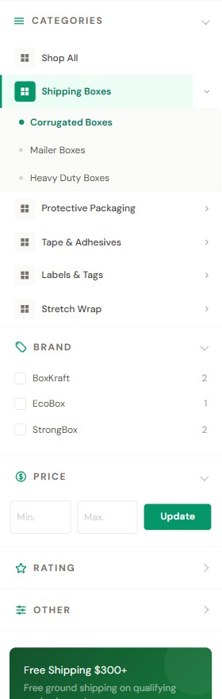

# Sidebar

The 280 px-wide left sidebar appears on **category, brand, and search** pages. It shows:

1. **Categories tree** — collapsible navigation
2. **Faceted filters** (when filters are enabled on the category)
3. **Promo card** (optional, text-only — driven by the Sidebar promo card setting)
4. **Custom widgets** (optional, via Page Builder regions)

{ loading=lazy }

---

## ① Categories tree

The tree is built from your store's **product category structure** (BigCommerce admin: **Products → Categories**). It displays **up to four levels** of categories — any subcategories deeper than the fourth level are not shown in the sidebar tree.

The categories section **auto-collapses whenever a filter is currently applied** (to give the active filters more room), and otherwise shows the tree with the active category branch expanded. This is hard-coded behavior and has no merchant-facing toggle in the Theme Editor.

Each top-level category shows the same fixed grid icon. There is no per-category icon feature.

---

## ② Faceted filters

When a category has product filters enabled, eShopping shows them here as collapsible filter groups.

1. Turn filtering on store-wide in **Settings → Product Filtering**.
2. Choose which attributes act as filters in **Catalog → Product Filtering**.

Each filter group renders as a **collapsible accordion**: **Price** shows as a range form, and every other filter (Brand, Rating, and any product attribute such as Color or Size) shows as a **checkbox list**. Picking a value narrows the grid instantly and adds a removable chip at the top of the products (see [Filter chips](category.md#filter-chips-active-filters)).

---

## ③ Promo card { #promo-card }

A single text-only card (heading + body + a button). In **Theme Editor → eShopping Theme** — under the **Sidebar** heading, then the **Sidebar Promo Card** heading — there is **one** field labeled **Sidebar Promo Text**.

You enter the whole card as a **single line**, using `|` (the pipe character) to separate four parts:

```
Heading | Description | Button Label | URL
```

Example:

```
Free Shipping $250+ | Free ground shipping on qualifying parts orders. | Shop Parts | /shipping/
```

The four per-variation defaults:

| Variation | Default promo card |
| --------- | ------------------ |
| Industrial | *Free Shipping $500+* / *Free ground shipping on qualifying orders.* / button *Shop Now* → `/shipping/` |
| AutoParts | *Free Shipping $250+* / *Free ground shipping on qualifying parts orders.* / button *Shop Parts* → `/shipping/` |
| Electronics | *Free Shipping $99+* / *Free shipping on all electronics orders over $99.* / button *Shop Deals* → `/shipping/` |
| Packaging | *Free Shipping $300+* / *Free ground shipping on qualifying packaging orders.* / button *Shop Supplies* → `/shipping/` |

Leave the **Sidebar Promo Text** field empty to hide the built-in card.

For more design control (image, custom colors), drop an **HTML Widget** (or any PapaThemes widget) into the **Sidebar — below (global)** region. This widget renders **just above** the built-in text promo card; the text promo card only appears when the **Sidebar Promo Text** field is filled. If you want the widget to **replace** the built-in card entirely, clear the **Sidebar Promo Text** field. The demo stores use a plain HTML Widget here.

---

## ④ Custom sidebar widgets

The sidebar has 2 widget regions:

| Region | Scope | Use it for |
| ------ | ----- | ---------- |
| Sidebar — below (global) | Every category, brand, search page | Newsletter signup, brand logos, "Need help?" card |
| Sidebar — below (this page) | The page you're editing | Page-specific promo (e.g. "Free fitment service" on the Tires category) |

To use:

1. Page Builder → switch to the page (Category > pick any).
2. Drag any widget into the appropriate region (visible as a dashed blue outline).
3. Save.

---

## Mobile behavior

Below 1024 px the desktop sidebar is hidden. Tap the **Filter** button at the top of the page and a **bottom-sheet drawer** (titled **Filters**) slides up from the bottom. This sheet contains **only the faceted filters** — the categories tree and the promo card are not shown on mobile.

Preview by resizing Page Builder preview to mobile (3rd device icon at the top).

---

## Per-variation promo recommendations

!!! note
    These are editable suggestions — not theme defaults. The actual defaults are listed in the [Promo card](#promo-card) table above. Replace them with whatever fits your store.

=== "Industrial"
    - Default: `Free Shipping $500+ | Free ground shipping on qualifying orders. | Shop Now | /shipping/`
=== "AutoParts"
    - Default: `Free Shipping $250+ | Free ground shipping on qualifying parts orders. | Shop Parts | /shipping/` — or swap in a custom fitment-lookup promo
=== "Electronics"
    - Default: `Free Shipping $99+ | Free shipping on all electronics orders over $99. | Shop Deals | /shipping/`
=== "Packaging"
    - Default: `Free Shipping $300+ | Free ground shipping on qualifying packaging orders. | Shop Supplies | /shipping/`

---

## Next

- [Category page](category.md)
- [Footer](footer.md)
