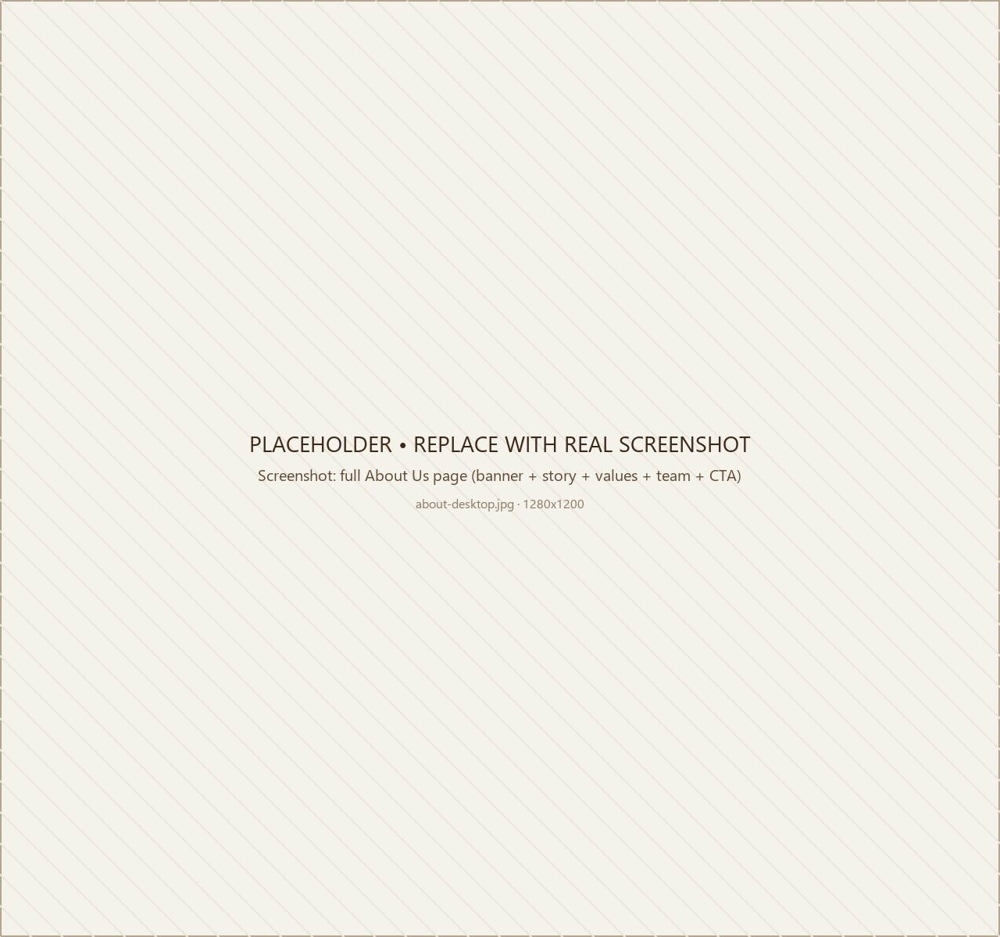
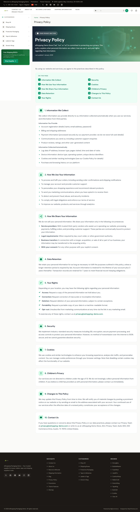
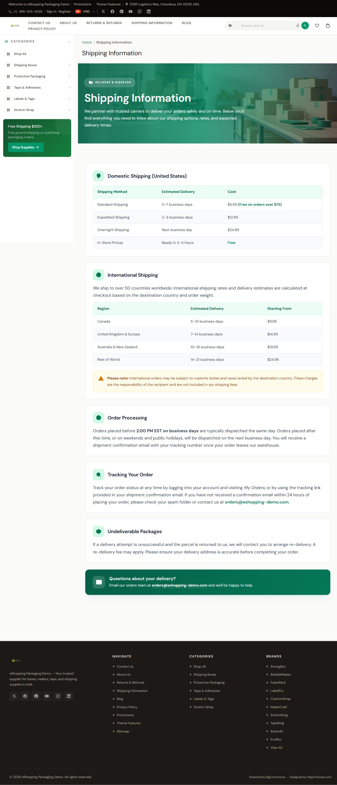
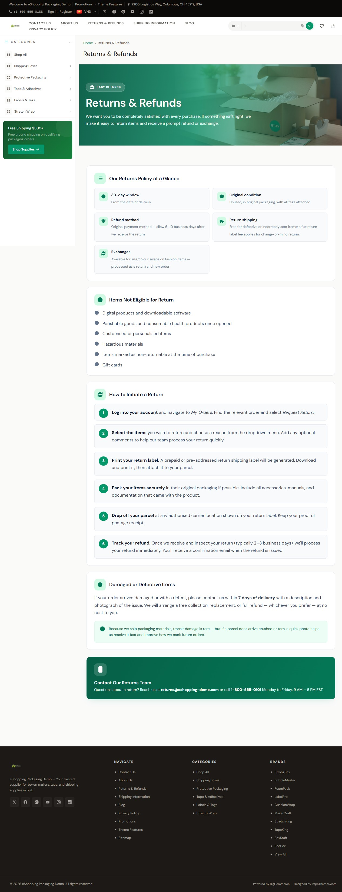

# Static Pages (About / Contact / Privacy / Returns)

Static "web pages" — About Us, Contact, Privacy Policy, Returns, Shipping, Size Guide — are managed in BigCommerce, not in the theme. eShopping renders most of them through the standard page template, which shows breadcrumbs, an optional page heading, and your page body content (with a Page Builder content region above the body). The Contact Us page uses its own template.

## Create a page

**Storefront → Web Pages → Create a web page**. Fill in:

| Field | Notes |
| ----- | ----- |
| Page title | The H1 + browser tab title |
| Page type | `Use the WYSIWYG editor` for most pages. `Use a contact form` only for **Contact Us**. |
| Content | Rich-text body |
| URL | Slug — default `/about/`, `/contact-us/`, etc. |
| Show in navigation menu | Check to add to the header nav (you can re-arrange in **Storefront → Site content**) |

## Page template

Most web pages use the standard page template, which renders breadcrumbs (unless hidden), an optional page heading, the Page Builder content region, and your centered page body content. The Contact Us page uses its own template and does not include a Page Builder region.

The only custom page layout the theme ships is **Theme Features** (a demo page that showcases the theme variations). It appears as a **Theme Features** option in the page editor's **Layout** field — choose it only for that purpose. For all normal pages, leave the default layout selected.

## About Us page recipe

The demo About page body is produced by the demo setup tooling (the same way the demo policy pages are generated — see below), which writes a self-contained, image-rich block of HTML into the page body. The block includes its own inline styles and hosted images, so it renders as a full-width, image-rich design without any extra theme settings.

A typical About layout in the demos includes:

1. A full-width hero with a heading and intro line.
2. A two-column "story" section: image + paragraphs.
3. A row of icon callout cards (e.g. "What we offer").
4. Supporting imagery / feature blocks.

To recreate it yourself, set the page type to `Use the WYSIWYG editor` and **paste your own HTML** into the page body — include inline `<style>` and absolute image URLs (hosted images render at full quality since page bodies are not resized by the theme).

{ loading=lazy }

## Contact Us page

Pick **Use a contact form** as the page type to expose BigCommerce's built-in contact form. Depending on which fields you enable, it can show:

- Full Name, Phone, Email (required), Order #, Company name, RMA #, and Comments/Questions (required).

Email and Comments/Questions are always present. To choose which **optional** fields appear (Full Name, Phone, Order #, Company name, RMA #), open the contact page itself in **Storefront → Web Pages → [your contact page]**, set the page type to **Use a contact form**, then tick the fields you want in the **Form fields** checklist on that page.

The form submits to the recipient email address you configure on that same contact web page (the "email address" / "send form submissions to" field in the page editor).

## Privacy / Returns / Shipping policy pages

These use the standard page template. Type your policy text into the page body with the WYSIWYG editor.

The demo stores go a step further and replace each policy page body with a self-contained, image-rich HTML design (hero banner + styled body) written into the page body by the demo setup tooling — they do not paste a fixed snippet by hand. If you want a matching hero, paste your own HTML block into the page body. There is no theme setting required.

{ loading=lazy }
{ loading=lazy }
{ loading=lazy }

## Show / hide elements

In the Theme Editor under **Global → Pages**:

| Element | Theme Editor toggle |
| ------- | ------------------- |
| Breadcrumbs | Hide breadcrumbs |
| Page heading | Hide page heading |
| Category page heading | Hide category page heading |
| Blog page heading | Hide blog page heading |
| Contact Us heading | Hide contact us page heading |

---

## Next

- [PapaThemes widgets](widgets-papathemes.md)
- [HTML widget](widgets-html.md)
