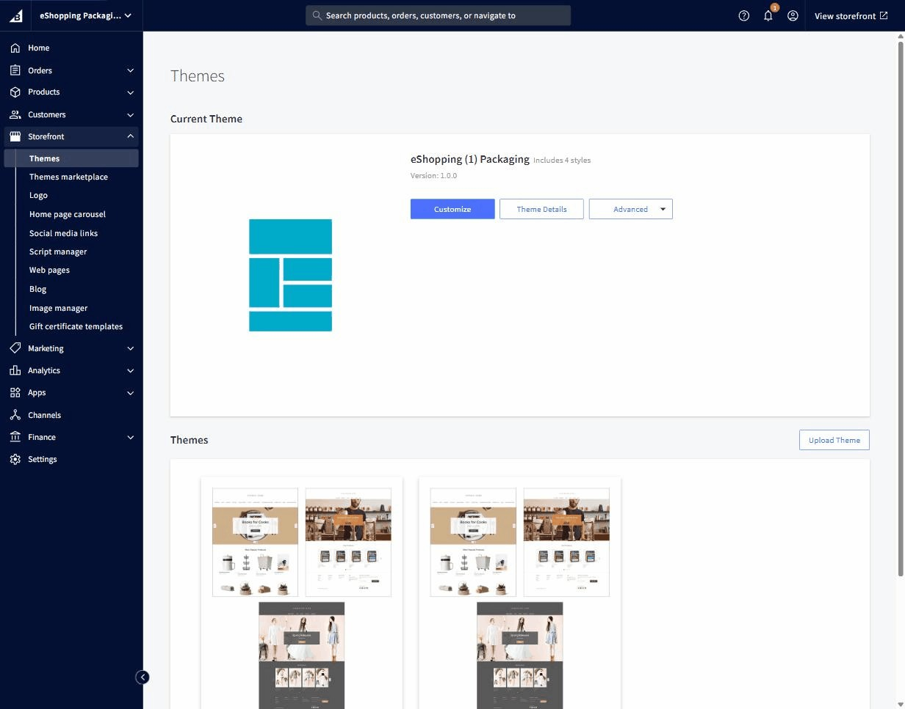

# Theme Editor (Page Builder) Tour

The **Theme Editor** (also called **Page Builder**) is BigCommerce's visual editor for your theme. It's the single place where you change colors, fonts, sections, and widgets. Everything in this guide assumes you have it open.

## How to open it

1. BigCommerce admin → **Storefront → My Themes**.
2. On the eShopping card click **Customize**.

   { loading=lazy }

3. Page Builder opens. The storefront preview takes the right ¾ of the screen; the controls live in the left sidebar.

---

## What's in the left sidebar

Two modes you'll switch between:

| Mode | Use it to… |
| ---- | ---------- |
| **Theme Styles** | Adjust theme settings: colors, fonts, section toggles, per-page-type options |
| **Page Builder** (widgets mode) | Drag widgets into the page regions (see [Widget regions reference](widget-regions.md)) |

At the very top sits the **variation picker** — pick **Industrial / AutoParts / Packaging / Electronics** (see [Choose your variant](choose-variant.md)).

---

## Theme Styles — top-level panels

The Theme Styles mode contains these 8 panels:

| Panel | What's inside |
| ----- | ------------- |
| **Global** | Page background, body / heading **font family + sizes**, link colors, image loading, breadcrumbs / page-heading toggles, page-level pricing, blog defaults, form inputs |
| **Header & Footer** | Logo size + position, social-media display, footer payment icons, footer display settings |
| **Home Page** | Carousel toggles + arrows + play/pause, count of products in each Featured / Most Popular / New section |
| **Products** | Product sale badges, sold-out badges, price labels, swatch sizes, display settings, products per page (category / brand / search), image sizes, default product images |
| **Buttons and Icons** | Primary / Secondary / Tertiary / Disabled button colors, icon colors, checkbox & radio colors |
| **Checkout Page** | Optimized-checkout colors, fonts, primary / secondary button styles, form-input + form-checklist + loading-toaster styles |
| **Payment Buttons** | Colors and shapes for the express-checkout buttons — PayPal, Pay Later, Venmo, Apple Pay, Google Pay, Amazon Pay (and others). Only the providers you have enabled appear, and the whole panel is hidden unless smart payment buttons are turned on for your store |
| **eShopping Theme** | *every eShopping-specific setting* — see the next section. This is the panel you'll spend most of your time in |

---

## The **eShopping Theme** panel — sub-headings in order

These are the headings inside the eShopping Theme panel, in the order they appear:

| Section | What you control here | Doc page |
| ------- | --------------------- | -------- |
| **Fonts** | Monospace font for SKUs, prices and codes (body + heading fonts live in **Global**) | [Colors & fonts](colors-and-fonts.md) |
| **Colors** | Terra accents (4), Forest (6), Bark neutrals (11), Cream, White, Sale badge, Staff badge, Rating star, Price | [Colors & fonts](colors-and-fonts.md) |
| **Homepage Sections** | Show / hide the hero carousel, choose which hero slides position their text on the right, trust strip, Featured / Best-selling / New sections, category grid, the brands limit, and the newsletter block + its text | [Home overview](home-overview.md) |
| **Trust Strip** | The four trust items — each with a title and description (e.g. free shipping, easy returns) | [Home overview](home-overview.md) |
| **Banner** | Top promo banner background, text color, and link | [Header & top bar](header-and-topbar.md) |
| **Header** | Top-bar colors, social-icons / address / phone toggles, welcome text, and which pages appear in the top-bar menu; main-nav colors, search-box colors, and which pages appear in the nav menu | [Header & top bar](header-and-topbar.md) |
| **Footer** | Footer background, text, heading, link, link-hover and border colors | [Footer](footer.md) |
| **Search** | Keyword suggestions on / off, up to three keyword files, category depth, voice search, and rotating typing phrases | [Search](search.md), [Keyword suggestions](keyword-suggestions.md) |
| **Sidebar** → **Promo Card** | Sidebar promo card — title, description, button text and button link | [Sidebar](sidebar.md) |
| **Products by Category** | Which categories to feature, grid layout, the active section, which tabs to show (Best-selling / Featured / New / Reviews), and lazy-loading | [Home overview](home-overview.md) |
| **Product Page (PDP)** | Shipping / returns text, mobile sticky add-to-cart toggle, FAQ tab toggle, and the four warranty cards | [Product](product.md), [Product FAQ](product-faq.md) |
| **Frequently Bought Together** | Number of bundled items (0–3) and the bundle discount percent | [FBT](product-fbt.md) |
| **Cart Cross-sell** | Number of cross-sell products to show on the cart page and in the cart drawer (two values) | [Product](product.md) |
| **Bulk Order** | Show / hide bulk-order mode | [Bulk order](bulk-order.md) |
| **Cart Goal Bar** | Cart goal tiers — each with an amount, icon and label | [Cart](cart.md) |
| **Urgency Signals (Social Proof)** | Live viewer count, last-order time, and their random ranges | [Urgency](urgency-and-recent-sales.md) |
| **Recent Sales Popup** | Which pages show recent-sales popups, the timing, and the items shown | [Recent sales](urgency-and-recent-sales.md) |
| **Newsletter Popup** | Newsletter popup text and options | [Popups](popups.md) |
| **Promotion Popup** | Promo popup text and options | [Popups](popups.md) |
| **Exit Intent Popup** | Exit-intent popup text and options | [Popups](popups.md) |

Some settings show a **(?)** help icon — hover it for a one-line description.

---

## How saving works

Page Builder uses a **draft / publish** model:

- Every change you make is autosaved as a draft.
- The storefront preview shows the **draft** version live.
- Your **public storefront** still shows the **last-published** version until you click **Save** at the top-right.

When you click **Save** for the first time on a session, Page Builder asks if you want to save changes to **just this preview** or **publish to the live site**. Pick **Publish** to push changes live.

---

## How to keep your changes safe

- **Snapshot the theme** before every big change: **My Themes → ⋯ → Make a copy**. Closest thing BigCommerce has to a "Save As".
- **Revert to a previous version**: **My Themes → eShopping → ⋯ → Revisions** — lists every save with timestamp. Click one to restore.

---

## Next

- [Set up colors & fonts](colors-and-fonts.md)
- [Set up the header & top bar](header-and-topbar.md)
- [Set up the footer](footer.md)
- [Set up the sidebar](sidebar.md)
