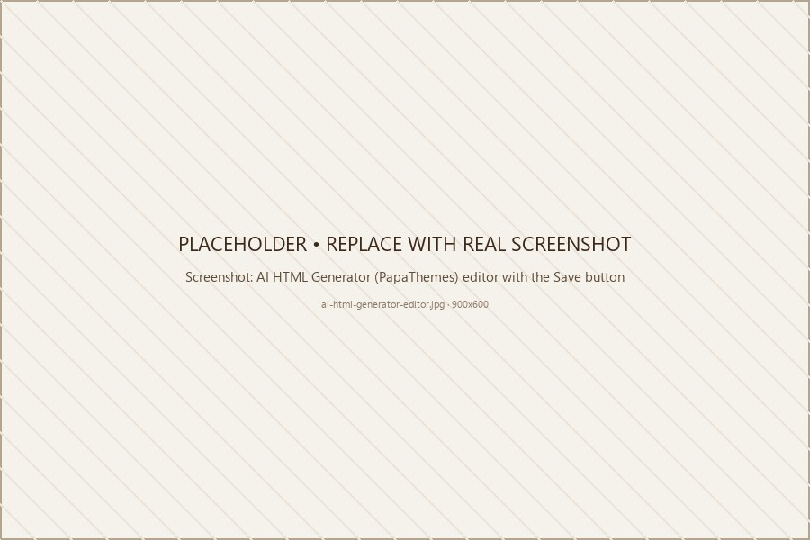

# AI HTML Generator (PapaThemes)

The **AI HTML Generator | PapaThemes** widget lets you paste raw HTML/CSS into Page Builder and it renders as-is. It is provided by the **PapaThemes app** (so it works fully only on a store where that app is installed), and it is what the eShopping demos use for their home-page marketing blocks (the Why Choose Us / value-prop callout, Customer Reviews block, Resources block, About block, and Talk to an Expert block — across two home-page regions — plus the footer description).

!!! note
    The sidebar promo card in the demos is **not** an AI HTML Generator widget — it is the built-in **Sidebar Promo Text** field you set in **Theme Editor → Sidebar Promo Card**, not a Page Builder widget.

{ loading=lazy }

## When to use it

| Need | Solution |
| ---- | -------- |
| Trust badges in cart | AI HTML Generator widget with `<ul>` of icons |
| 3rd-party embed (TrustPilot, YouTube, etc.) | Their iframe / script in an AI HTML Generator widget |
| JSON-LD schema for SEO | AI HTML Generator widget with `<script type="application/ld+json">` |
| CSS overrides for one page | AI HTML Generator widget with `<style>` |
| Custom hero banner | AI HTML Generator widget — or, for richer slide controls, the built-in **Hero** section in **Storefront → My Themes → Customize** |

## Where it lives

Page Builder → left panel → **AI HTML Generator | PapaThemes** widget. Drag it to any widget region. (The widget appears in the panel only when the **PapaThemes app** is installed on your store.)

## Editor

The editor is a plain `<textarea>`. Paste your HTML, then click **Save**. No syntax highlighting, no preview — what you paste is what renders.

## Example patterns

These are example HTML snippets you can paste into an **AI HTML Generator | PapaThemes** widget. They are not pre-built into the demo stores — copy and adapt them to your needs.

### Rotating promo banner

The theme does not auto-rotate AI HTML Generator widget children, so include your own rotation logic in the widget's `<script>`:

```html
<div id="my-promo" style="text-align:center">
  <div>Free shipping on orders over $99</div>
  <div><strong>10% off</strong> first order with <code>WELCOME10</code></div>
  <div>Customer service: <a href="tel:+18001234567">+1 (800) 123-4567</a></div>
</div>
<script>
  (function () {
    var items = document.querySelectorAll('#my-promo > div');
    var i = 0;
    items.forEach(function (el, n) { el.style.display = n === 0 ? '' : 'none'; });
    setInterval(function () {
      items[i].style.display = 'none';
      i = (i + 1) % items.length;
      items[i].style.display = '';
    }, 5000);
  })();
</script>
```

!!! note
    Inline `<script>` only runs if your store's content-security settings allow it (see the [Gotchas](#gotchas) below).

### Static single-line promo

```html
<p>🌿 Carbon-neutral shipping on every order</p>
```

### Bullet list of value props (e.g. cart page)

```html
<ul style="list-style:none;padding:0;margin:24px 0">
  <li style="display:flex;gap:8px;margin-bottom:8px">
    <svg style="width:18px;height:18px;color:#3e6b3e"><use href="#icon-checkmark"/></svg>
    Free shipping on orders $99+
  </li>
  <li style="display:flex;gap:8px;margin-bottom:8px">
    <svg style="width:18px;height:18px;color:#3e6b3e"><use href="#icon-checkmark"/></svg>
    30-day no-questions returns
  </li>
  <li style="display:flex;gap:8px;margin-bottom:8px">
    <svg style="width:18px;height:18px;color:#3e6b3e"><use href="#icon-checkmark"/></svg>
    Volume pricing on 100+ unit orders
  </li>
</ul>
```

Icon IDs such as `#icon-checkmark`, `#icon-badge-check`, and `#icon-truck-delivery` come from the theme's built-in SVG sprite (the IDs match the source icon filenames with an `icon-` prefix). To see the full list, view the page source and search for `<symbol id="icon-`.

### Hide an element on a single page

```html
<style>
  .eshopping__sidebar { display: none }
</style>
```

The content area already fills the available width on its own once the sidebar is hidden, so no extra spacing reset is needed. If you also want to cap how wide the content stretches, add a rule for the main content area:

```html
<style>
  .eshopping__sidebar { display: none }
  .eshopping__main { max-width: 100% }
</style>
```

### Embed a YouTube video

```html
<div style="aspect-ratio:16/9;max-width:920px;margin:0 auto">
  <iframe
    src="https://www.youtube.com/embed/VIDEO_ID"
    title="YouTube video"
    frameborder="0"
    allow="accelerometer; autoplay; clipboard-write; encrypted-media; gyroscope; picture-in-picture; web-share"
    allowfullscreen
    style="width:100%;height:100%"></iframe>
</div>
```

### Add `FAQPage` JSON-LD

```html
<script type="application/ld+json">
{
  "@context": "https://schema.org",
  "@type": "FAQPage",
  "mainEntity": [
    { "@type":"Question", "name":"Do you ship internationally?",
      "acceptedAnswer":{ "@type":"Answer", "text":"Yes — 80+ countries." }},
    { "@type":"Question", "name":"What is the return window?",
      "acceptedAnswer":{ "@type":"Answer", "text":"30 days, no questions asked." }}
  ]
}
</script>
```

## Gotchas

- **No automatic responsiveness** — write your CSS with media queries yourself.
- **Colors** — write hex codes directly (e.g. `#3e6b3e`). At the code level, the theme's CSS custom properties (such as `var(--eshopping-terra)`) are also available inside a widget's inline `<style>`, but plain hex codes are the simplest option for most merchants.
- **No XSS protection by content area** — never paste HTML you didn't write or fully trust.
- **Script execution** — whether an inline `<script>` runs depends on your store's content-security settings, which are configured at the store level (not by the theme). For scripts you want to rely on, the supported path is **Storefront → Script Manager**.

## Reusing the same block in many places

If you find yourself pasting the same HTML in multiple places, drop the **AI HTML Generator | PapaThemes** widget into a **global** region (the ones ending in `--global`) so one widget shows on every page of that type. See the [widget regions reference](widget-regions.md) for which regions support global placement.

---

## Next

- [Demo marketing blocks](widgets-papathemes.md)
- [Widget regions reference](widget-regions.md)
