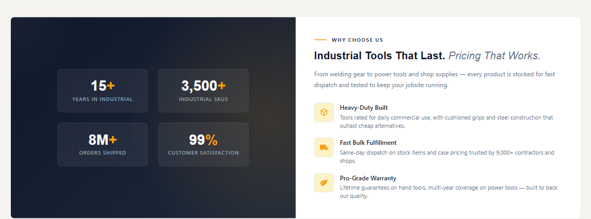
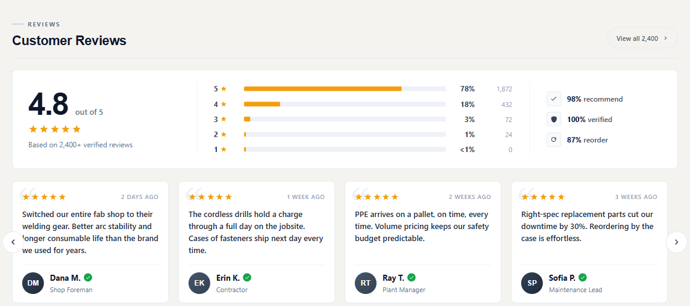
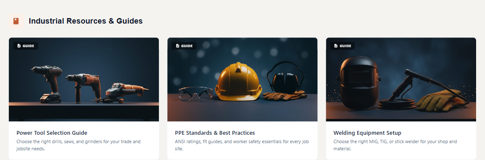
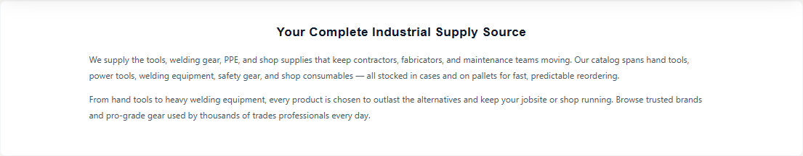

# Demo Marketing Blocks

Every marketing block you see on the demos is either a **built-in theme section** (controlled in the Theme Editor) or an **AI HTML Generator | PapaThemes** widget dropped into a widget region in Page Builder. The configurable theme sections ship with the theme and need no app; the marketing-block widgets use the **AI HTML Generator | PapaThemes** widget, which requires the **PapaThemes app** installed on your store.

This page is the canonical reference for the six demo marketing blocks: what each one is, which region/sort it lives in, how to edit it, a clean copy-paste starting point, and the exact per-store HTML used on the live demos. Other docs link here for the exact HTML.

!!! info "Marketing blocks need the PapaThemes app"
    The theme's own configurable sections need nothing extra to install. The demo marketing blocks, however, use the **AI HTML Generator | PapaThemes** widget, which is provided by the **PapaThemes app** and works fully only on a store where that app is installed.

## Built-in theme sections (Theme Editor)

These appear automatically on the home page and are turned on/off and styled from **Storefront → My Themes → Customize**. They are not widgets and do not live in Page Builder.

- **Hero** — the home page hero banner
- **Trust strip** — the icon + label row beneath the hero
- **Featured Products**, **Best Sellers**, and **New Arrivals** sliders
- **Products by Category** sections
- **Brands carousel**
- **Blog posts** row
- **Newsletter** signup block
- **Sidebar Promo Card** — the promotional callout shown in the sidebar on category, brand, and search pages

The "value-prop / social-proof" position and the "about / contact" position are not single theme sections — each one holds a stack of several **AI HTML Generator | PapaThemes** widgets on the demos. Those six widgets are the blocks documented below.

## Marketing widgets (Page Builder) { #built-in-html-widgets-page-builder }

The demo marketing blocks are **AI HTML Generator | PapaThemes** widgets, added during the demo content import — they are not theme settings, and they require the **PapaThemes app**. They live in three widget regions:

| Widget region | Sort | Block |
| ------------- | ---- | ----- |
| `home_below_products_by_category` (below Products by Category) | 0 | [Why Choose Us](#why-choose-us) |
| `home_below_products_by_category` | 1 | [Customer Reviews](#customer-reviews) |
| `home_below_products_by_category` | 2 | [Resources](#resources) |
| `home_below_newsletter` (below the Newsletter) | 0 | [About](#about) |
| `home_below_newsletter` | 1 | [Talk to an Expert](#talk-to-an-expert) |
| `eshopping_footer_description--global` (footer, every page) | — | [Footer tagline](#footer-tagline) |

In Page Builder the home-page widgets appear stacked one above the other in their region, top to bottom in the sort order shown above. Each is edited independently.

The field you paste HTML into is labelled **HTML Content** (schema id `content`, a `code` field set to HTML). The editing flow is the same for every block:

<!--te-src:PiAqKkN1c3RvbWl6ZToqKiBQYWdlIEJ1aWxkZXIgKCoqU3RvcmVmcm9udCDihpIgTXkgVGhlbWVzIOKGkiBDdXN0b21pemUqKikg4oaSIGNsaWNrIHRoZSBibG9jayDihpIgZWRpdCB0aGUgKipIVE1MIENvbnRlbnQqKiBmaWVsZCDihpIgKipTYXZlKiou-->
<!--te-mock--><div class="te-mock te-mock--pb"><div class="te-mock__hd"><span>‹ AI HTML Generator | PapaThemes</span><span class="te-x">⋯</span></div><div class="te-mock__grp">▾ Content</div><div class="te-pbbox"><span class="k">&lt;style&gt;</span><br><span class="s">.papathemes-ai-widget-…</span> { … }<br>…your HTML…<br><span class="k">&lt;/style&gt;</span></div><div class="te-pbbtns"><span class="te-btn-ghost">Expand HTML Editor</span><span class="te-save te-save--full">Save HTML</span></div><div class="te-mock__row"><span class="te-cb"></span><span class="te-lbl">Show in container div</span></div></div>

!!! note "Per-store random scope class"
    Each demo block's CSS is self-scoped under a random class `.papathemes-ai-widget-<token>`, where `<token>` differs per store. The accent color, image URLs, and copy also differ per store — so the same block on two stores differs only in those. The **clean example** under each block uses a stable, readable class name and is the easiest starting point; reach for the **Exact demo HTML** appendix only when you want to match a specific demo store byte-for-byte.

!!! note "The PDP FAQ tab is built-in, not a widget"
    The FAQ accordion on product pages is a built-in theme feature, not a Page Builder widget. You cannot drop an accordion widget into it.

---

## Why Choose Us

A value-prop callout in region `home_below_products_by_category`, **sort 0** — a two-column card pairing a dark stats panel (years, SKUs, orders shipped, satisfaction) with an eyebrow + heading + three icon features. It is the **HTML Content** field of an AI HTML Generator | PapaThemes widget.

{ loading=lazy }

<!--te-src:PiAqKkN1c3RvbWl6ZToqKiBQYWdlIEJ1aWxkZXIgKCoqU3RvcmVmcm9udCDihpIgTXkgVGhlbWVzIOKGkiBDdXN0b21pemUqKikg4oaSIGNsaWNrIHRoZSAqKldoeSBDaG9vc2UgVXMqKiBibG9jayDihpIgZWRpdCB0aGUgKipIVE1MIENvbnRlbnQqKiBmaWVsZCDihpIgKipTYXZlKiou-->
<!--te-mock--><div class="te-mock te-mock--pb"><div class="te-mock__hd"><span>‹ AI HTML Generator | PapaThemes</span><span class="te-x">⋯</span></div><div class="te-mock__grp">▾ Content</div><div class="te-pbbox"><span class="k">&lt;style&gt;</span><br><span class="s">.papathemes-ai-widget-…</span> { … }<br>…your HTML…<br><span class="k">&lt;/style&gt;</span></div><div class="te-pbbtns"><span class="te-btn-ghost">Expand HTML Editor</span><span class="te-save te-save--full">Save HTML</span></div><div class="te-mock__row"><span class="te-cb"></span><span class="te-lbl">Show in container div</span></div></div>

**What to change:** the four stat numbers + labels, the eyebrow/heading/description copy, the three feature titles and descriptions, and the accent color (the `--accent` custom property).

```html
<style>
.eshopping-why-choose {
    --eshopping-why-accent: #f59e0b;
    box-sizing: border-box;
}
.eshopping-why-choose * { box-sizing: border-box; margin: 0; padding: 0; }
.eshopping-why-choose-section { padding: 32px 20px 0; }
.eshopping-why-choose-card {
    background: #fff;
    border: 1px solid #f1f5f9;
    border-radius: 8px;
    overflow: hidden;
}
.eshopping-why-choose-inner {
    display: grid;
    grid-template-columns: 1fr 1fr;
    min-height: 360px;
}
.eshopping-why-choose-visual {
    background: linear-gradient(135deg, #0f172a, #1e293b);
    display: flex;
    align-items: center;
    justify-content: center;
}
.eshopping-why-choose-stats {
    display: grid;
    grid-template-columns: 1fr 1fr;
    gap: 20px;
    padding: 36px;
}
.eshopping-why-choose-stat {
    text-align: center;
    padding: 18px;
    background: rgba(255, 255, 255, .06);
    border: 1px solid rgba(255, 255, 255, .08);
    border-radius: 8px;
}
.eshopping-why-choose-stat-num {
    font-size: 28px;
    font-weight: 600;
    color: #f8fafc;
}
.eshopping-why-choose-stat-num span { color: var(--eshopping-why-accent); }
.eshopping-why-choose-stat-label {
    font-size: 10px;
    text-transform: uppercase;
    letter-spacing: .08em;
    color: #94a3b8;
}
.eshopping-why-choose-content {
    padding: 36px;
    display: flex;
    flex-direction: column;
    justify-content: center;
}
.eshopping-why-choose-eyebrow {
    font-size: 10px;
    text-transform: uppercase;
    letter-spacing: .14em;
    font-weight: 700;
    color: #334155;
    margin-bottom: 10px;
}
.eshopping-why-choose-heading {
    font-size: 20px;
    font-weight: 600;
    color: #0f172a;
    margin-bottom: 14px;
}
.eshopping-why-choose-heading em { font-style: italic; font-weight: 400; color: #64748b; }
.eshopping-why-choose-desc { font-size: 12px; color: #64748b; line-height: 1.7; margin-bottom: 24px; }
.eshopping-why-choose-feat { display: flex; gap: 12px; margin-bottom: 16px; }
.eshopping-why-choose-feat-icon {
    width: 38px; height: 38px;
    border-radius: 6px;
    background: #fef3c7;
    color: var(--eshopping-why-accent);
    display: flex; align-items: center; justify-content: center;
    flex-shrink: 0;
}
.eshopping-why-choose-feat-title { font-size: 12px; font-weight: 600; color: #1e293b; }
.eshopping-why-choose-feat-desc { font-size: 11px; color: #64748b; line-height: 1.45; }
@media (max-width: 1023px) { .eshopping-why-choose-inner { grid-template-columns: 1fr; } }
</style>

<div class="eshopping-why-choose">
    <div class="eshopping-why-choose-section">
        <div class="eshopping-why-choose-card">
            <div class="eshopping-why-choose-inner">
                <div class="eshopping-why-choose-visual">
                    <div class="eshopping-why-choose-stats">
                        <div class="eshopping-why-choose-stat">
                            <div class="eshopping-why-choose-stat-num">15<span>+</span></div>
                            <div class="eshopping-why-choose-stat-label">Years in business</div>
                        </div>
                        <div class="eshopping-why-choose-stat">
                            <div class="eshopping-why-choose-stat-num">3,500<span>+</span></div>
                            <div class="eshopping-why-choose-stat-label">SKUs in stock</div>
                        </div>
                        <div class="eshopping-why-choose-stat">
                            <div class="eshopping-why-choose-stat-num">8M<span>+</span></div>
                            <div class="eshopping-why-choose-stat-label">Orders shipped</div>
                        </div>
                        <div class="eshopping-why-choose-stat">
                            <div class="eshopping-why-choose-stat-num">99<span>%</span></div>
                            <div class="eshopping-why-choose-stat-label">Satisfaction</div>
                        </div>
                    </div>
                </div>
                <div class="eshopping-why-choose-content">
                    <div class="eshopping-why-choose-eyebrow">Why Choose Us</div>
                    <h2 class="eshopping-why-choose-heading">Products That Last. <em>Pricing That Works.</em></h2>
                    <p class="eshopping-why-choose-desc">Every product is stocked for fast dispatch and tested to keep you running.</p>
                    <div class="eshopping-why-choose-feat">
                        <div class="eshopping-why-choose-feat-icon">
                            <svg aria-hidden="true" fill="currentColor" viewBox="0 0 24 24"><path d="M21 16V8a2 2 0 0 0-1-1.73l-7-4a2 2 0 0 0-2 0l-7 4A2 2 0 0 0 3 8v8a2 2 0 0 0 1 1.73l7 4a2 2 0 0 0 2 0l7-4A2 2 0 0 0 21 16z"/></svg>
                        </div>
                        <div>
                            <div class="eshopping-why-choose-feat-title">Built to Last</div>
                            <div class="eshopping-why-choose-feat-desc">Rated for daily commercial use and built to outlast cheap alternatives.</div>
                        </div>
                    </div>
                    <div class="eshopping-why-choose-feat">
                        <div class="eshopping-why-choose-feat-icon">
                            <svg aria-hidden="true" fill="currentColor" viewBox="0 0 24 24"><path d="M20 8h-3V4H3c-1.1 0-2 .9-2 2v11h2a3 3 0 0 0 6 0h6a3 3 0 0 0 6 0h2v-5l-3-4z"/></svg>
                        </div>
                        <div>
                            <div class="eshopping-why-choose-feat-title">Fast Fulfillment</div>
                            <div class="eshopping-why-choose-feat-desc">Same-day dispatch on stock items with predictable bulk pricing.</div>
                        </div>
                    </div>
                    <div class="eshopping-why-choose-feat">
                        <div class="eshopping-why-choose-feat-icon">
                            <svg aria-hidden="true" fill="currentColor" viewBox="0 0 24 24"><path d="M17 8C8 10 5.9 16.17 3.82 21.34l1.89.66.95-2.3c.48.17.98.3 1.34.3C19 20 22 3 22 3c-1 2-8 2.25-13 3.25S2 11.5 2 13.5s1.75 3.75 1.75 3.75C7 8 17 8 17 8z"/></svg>
                        </div>
                        <div>
                            <div class="eshopping-why-choose-feat-title">Backed by Warranty</div>
                            <div class="eshopping-why-choose-feat-desc">Multi-year coverage that stands behind our quality.</div>
                        </div>
                    </div>
                </div>
            </div>
        </div>
    </div>
</div>
```

<details>
<summary>Exact demo HTML (all 4 stores)</summary>

<details>
<summary>Industrial</summary>

```html
<style>
.papathemes-ai-widget-yofvc0ew {
    --papathemes-ai-widget-yofvc0ew-white: #ffffff;
    --papathemes-ai-widget-yofvc0ew-cream: #f8fafc;
    --papathemes-ai-widget-yofvc0ew-bark-100: #f1f5f9;
    --papathemes-ai-widget-yofvc0ew-bark-200: #e2e8f0;
    --papathemes-ai-widget-yofvc0ew-bark-400: #94a3b8;
    --papathemes-ai-widget-yofvc0ew-bark-500: #64748b;
    --papathemes-ai-widget-yofvc0ew-bark-700: #334155;
    --papathemes-ai-widget-yofvc0ew-bark-800: #1e293b;
    --papathemes-ai-widget-yofvc0ew-bark-900: #0f172a;
    --papathemes-ai-widget-yofvc0ew-terra: #bf5b33;
    --papathemes-ai-widget-yofvc0ew-terra-light: #d9845e;
    --papathemes-ai-widget-yofvc0ew-terra-dark: #993f1f;
    --papathemes-ai-widget-yofvc0ew-terra-pale: #fdf0e9;
    --papathemes-ai-widget-yofvc0ew-accent: #f59e0b;
    --papathemes-ai-widget-yofvc0ew-accent-soft: #fef3c7;
    --papathemes-ai-widget-yofvc0ew-font-heading: 'Inter', sans-serif;
    --papathemes-ai-widget-yofvc0ew-font-body: -apple-system, BlinkMacSystemFont, 'Segoe UI', Roboto, sans-serif;
    box-sizing: border-box;
    margin: 0;
    padding: 0;
    width: 100%;
}

.papathemes-ai-widget-yofvc0ew *,
.papathemes-ai-widget-yofvc0ew *::before,
.papathemes-ai-widget-yofvc0ew *::after {
    box-sizing: border-box;
    margin: 0;
    padding: 0;
}

.papathemes-ai-widget-yofvc0ew-section {
    padding: 32px 20px 0;
}

.papathemes-ai-widget-yofvc0ew-card {
    background: var(--papathemes-ai-widget-yofvc0ew-white);
    border: 1px solid var(--papathemes-ai-widget-yofvc0ew-bark-100);
    border-radius: 8px;
    overflow: hidden;
}

.papathemes-ai-widget-yofvc0ew-inner {
    display: grid;
    grid-template-columns: 1fr 1fr;
    min-height: 360px;
}

.papathemes-ai-widget-yofvc0ew-visual {
    position: relative;
    background:
        linear-gradient(135deg, var(--papathemes-ai-widget-yofvc0ew-bark-900) 0%, var(--papathemes-ai-widget-yofvc0ew-bark-800) 100%);
    box-shadow: 0 1px 0 rgba(255, 255, 255, 0.04) inset;
    display: flex;
    align-items: center;
    justify-content: center;
    overflow: hidden;
    min-height: 260px;
}

.papathemes-ai-widget-yofvc0ew-visual::before {
    content: "";
    position: absolute;
    inset: 0;
    background:
        radial-gradient(ellipse 70% 100% at 90% 50%, rgba(245, 158, 11, 0.14), transparent 70%),
        radial-gradient(ellipse 40% 60% at 0% 0%, rgba(255, 255, 255, 0.04), transparent 60%);
    pointer-events: none;
}

.papathemes-ai-widget-yofvc0ew-visual::after {
    content: "";
    position: absolute;
    inset: 0;
    background-image:
        linear-gradient(rgba(255, 255, 255, 0.025) 1px, transparent 1px),
        linear-gradient(90deg, rgba(255, 255, 255, 0.025) 1px, transparent 1px);
    background-size: 40px 40px;
    opacity: 0.5;
    pointer-events: none;
}

.papathemes-ai-widget-yofvc0ew-stats {
    position: relative;
    z-index: 2;
    display: grid;
    grid-template-columns: 1fr 1fr;
    gap: 20px;
    padding: 36px;
}

.papathemes-ai-widget-yofvc0ew-stat {
    text-align: center;
    padding: 18px;
    background: rgba(255, 255, 255, .06);
    border-radius: 8px;
    border: 1px solid rgba(255, 255, 255, .08);
}

.papathemes-ai-widget-yofvc0ew-stat-num {
    font-family: var(--papathemes-ai-widget-yofvc0ew-font-heading);
    font-size: 28px;
    font-weight: 600;
    color: var(--papathemes-ai-widget-yofvc0ew-cream);
    line-height: 1;
    margin-bottom: 3px;
}

.papathemes-ai-widget-yofvc0ew-stat-num span {
    color: var(--papathemes-ai-widget-yofvc0ew-accent);
}

.papathemes-ai-widget-yofvc0ew-stat-label {
    font-family: var(--papathemes-ai-widget-yofvc0ew-font-body);
    font-size: 10px;
    color: var(--papathemes-ai-widget-yofvc0ew-bark-400);
    text-transform: uppercase;
    letter-spacing: .08em;
    font-weight: 600;
}

.papathemes-ai-widget-yofvc0ew-content {
    padding: 36px;
    display: flex;
    flex-direction: column;
    justify-content: center;
}

.papathemes-ai-widget-yofvc0ew-eyebrow {
    display: flex;
    align-items: center;
    gap: 10px;
    font-family: var(--papathemes-ai-widget-yofvc0ew-font-body);
    font-size: 10px;
    text-transform: uppercase;
    letter-spacing: .14em;
    font-weight: 700;
    color: var(--papathemes-ai-widget-yofvc0ew-bark-700);
    margin-bottom: 10px;
}

.papathemes-ai-widget-yofvc0ew-eyebrow::before {
    content: "";
    width: 24px;
    height: 2px;
    background: var(--papathemes-ai-widget-yofvc0ew-accent);
}

.papathemes-ai-widget-yofvc0ew-heading {
    font-family: var(--papathemes-ai-widget-yofvc0ew-font-heading);
    font-size: 20px;
    font-weight: 600;
    color: var(--papathemes-ai-widget-yofvc0ew-bark-900);
    margin-bottom: 14px;
    line-height: 1.25;
}

.papathemes-ai-widget-yofvc0ew-heading em {
    font-style: italic;
    font-weight: 400;
    color: var(--papathemes-ai-widget-yofvc0ew-bark-500);
}

.papathemes-ai-widget-yofvc0ew-desc {
    font-family: var(--papathemes-ai-widget-yofvc0ew-font-body);
    font-size: 12px;
    color: var(--papathemes-ai-widget-yofvc0ew-bark-500);
    line-height: 1.7;
    margin-bottom: 24px;
}

.papathemes-ai-widget-yofvc0ew-features {
    display: flex;
    flex-direction: column;
    gap: 16px;
}

.papathemes-ai-widget-yofvc0ew-feat {
    display: flex;
    gap: 12px;
    align-items: flex-start;
}

.papathemes-ai-widget-yofvc0ew-feat-icon {
    width: 38px;
    height: 38px;
    border-radius: 6px;
    background: var(--papathemes-ai-widget-yofvc0ew-accent-soft);
    border: 1px solid var(--papathemes-ai-widget-yofvc0ew-bark-200);
    display: flex;
    align-items: center;
    justify-content: center;
    color: var(--papathemes-ai-widget-yofvc0ew-accent);
    flex-shrink: 0;
}

.papathemes-ai-widget-yofvc0ew-feat-icon svg {
    width: 17px;
    height: 17px;
}

.papathemes-ai-widget-yofvc0ew-feat-title {
    font-family: var(--papathemes-ai-widget-yofvc0ew-font-body);
    font-size: 12px;
    font-weight: 600;
    color: var(--papathemes-ai-widget-yofvc0ew-bark-800);
    margin-bottom: 1px;
}

.papathemes-ai-widget-yofvc0ew-feat-desc {
    font-family: var(--papathemes-ai-widget-yofvc0ew-font-body);
    font-size: 11px;
    color: var(--papathemes-ai-widget-yofvc0ew-bark-500);
    line-height: 1.45;
}

@media (max-width: 1023px) {
    .papathemes-ai-widget-yofvc0ew-inner {
        grid-template-columns: 1fr;
    }
}

@media (max-width: 767px) {
    .papathemes-ai-widget-yofvc0ew-section {
        padding: 24px 10px 0;
    }

    .papathemes-ai-widget-yofvc0ew-stats {
        padding: 24px;
        gap: 12px;
    }

    .papathemes-ai-widget-yofvc0ew-content {
        padding: 24px;
    }
}
</style>

<div class="papathemes-ai-widget-yofvc0ew">
    <div class="papathemes-ai-widget-yofvc0ew-section">
        <div class="papathemes-ai-widget-yofvc0ew-card">
            <div class="papathemes-ai-widget-yofvc0ew-inner">
                <div class="papathemes-ai-widget-yofvc0ew-visual">
                    <div class="papathemes-ai-widget-yofvc0ew-stats">
                        <div class="papathemes-ai-widget-yofvc0ew-stat">
                            <div class="papathemes-ai-widget-yofvc0ew-stat-num">15<span>+</span></div>
                            <div class="papathemes-ai-widget-yofvc0ew-stat-label">YEARS IN INDUSTRIAL</div>
                        </div>
                        <div class="papathemes-ai-widget-yofvc0ew-stat">
                            <div class="papathemes-ai-widget-yofvc0ew-stat-num">3,500<span>+</span></div>
                            <div class="papathemes-ai-widget-yofvc0ew-stat-label">INDUSTRIAL SKUS</div>
                        </div>
                        <div class="papathemes-ai-widget-yofvc0ew-stat">
                            <div class="papathemes-ai-widget-yofvc0ew-stat-num">8M<span>+</span></div>
                            <div class="papathemes-ai-widget-yofvc0ew-stat-label">Orders Shipped</div>
                        </div>
                        <div class="papathemes-ai-widget-yofvc0ew-stat">
                            <div class="papathemes-ai-widget-yofvc0ew-stat-num">99<span>%</span></div>
                            <div class="papathemes-ai-widget-yofvc0ew-stat-label">Customer Satisfaction</div>
                        </div>
                    </div>
                </div>
                <div class="papathemes-ai-widget-yofvc0ew-content">
                    <div class="papathemes-ai-widget-yofvc0ew-eyebrow">Why Choose Us</div>
                    <h2 data-localized="1" data-localized="1" class="papathemes-ai-widget-yofvc0ew-heading">Industrial Tools That Last. <em>Pricing That Works.</em></h2>
                    <p class="papathemes-ai-widget-yofvc0ew-desc">From welding gear to power tools and shop supplies — every product is stocked for fast dispatch and tested to keep your jobsite running.</p>
                    <div class="papathemes-ai-widget-yofvc0ew-features">
                        <div class="papathemes-ai-widget-yofvc0ew-feat">
                            <div class="papathemes-ai-widget-yofvc0ew-feat-icon">
                                <svg aria-hidden="true" focusable="false" fill="currentColor" viewBox="0 0 24 24"><path d="M21 16V8a2 2 0 0 0-1-1.73l-7-4a2 2 0 0 0-2 0l-7 4A2 2 0 0 0 3 8v8a2 2 0 0 0 1 1.73l7 4a2 2 0 0 0 2 0l7-4A2 2 0 0 0 21 16zM12 4.15 18.4 7.8 12 11.45 5.6 7.8 12 4.15zM5 9.5l6 3.43v6.94l-6-3.43V9.5zm8 10.37v-6.94l6-3.43v6.94l-6 3.43z"/></svg>
                            </div>
                            <div>
                                <div class="papathemes-ai-widget-yofvc0ew-feat-title">Heavy-Duty Built</div>
                                <div class="papathemes-ai-widget-yofvc0ew-feat-desc">Tools rated for daily commercial use, with cushioned grips and steel construction that outlast cheap alternatives.</div>
                            </div>
                        </div>
                        <div class="papathemes-ai-widget-yofvc0ew-feat">
                            <div class="papathemes-ai-widget-yofvc0ew-feat-icon">
                                <svg aria-hidden="true" focusable="false" fill="currentColor" viewBox="0 0 24 24"><path d="M20 8h-3V4H3c-1.1 0-2 .9-2 2v11h2a3 3 0 0 0 6 0h6a3 3 0 0 0 6 0h2v-5l-3-4zM6 18.5A1.5 1.5 0 1 1 7.5 17 1.5 1.5 0 0 1 6 18.5zm13.5-9 1.96 2.5H17V9.5h2.5zM18 18.5A1.5 1.5 0 1 1 19.5 17 1.5 1.5 0 0 1 18 18.5z"/></svg>
                            </div>
                            <div>
                                <div class="papathemes-ai-widget-yofvc0ew-feat-title">Fast Bulk Fulfillment</div>
                                <div class="papathemes-ai-widget-yofvc0ew-feat-desc">Same-day dispatch on stock items and case pricing trusted by 9,000+ contractors and shops.</div>
                            </div>
                        </div>
                        <div class="papathemes-ai-widget-yofvc0ew-feat">
                            <div class="papathemes-ai-widget-yofvc0ew-feat-icon">
                                <svg aria-hidden="true" focusable="false" fill="currentColor" viewBox="0 0 24 24"><path d="M17 8C8 10 5.9 16.17 3.82 21.34l1.89.66.95-2.3c.48.17.98.3 1.34.3C19 20 22 3 22 3c-1 2-8 2.25-13 3.25S2 11.5 2 13.5s1.75 3.75 1.75 3.75C7 8 17 8 17 8z"/></svg>
                            </div>
                            <div>
                                <div class="papathemes-ai-widget-yofvc0ew-feat-title">Pro-Grade Warranty</div>
                                <div class="papathemes-ai-widget-yofvc0ew-feat-desc">Lifetime guarantees on hand tools, multi-year coverage on power tools — built to back our quality.</div>
                            </div>
                        </div>
                    </div>
                </div>
            </div>
        </div>
    </div>
</div>
```

</details>

<details>
<summary>AutoParts</summary>

```html
<style>
.papathemes-ai-widget-z5x8wwcc {
    --papathemes-ai-widget-z5x8wwcc-white: #ffffff;
    --papathemes-ai-widget-z5x8wwcc-cream: #f8fafc;
    --papathemes-ai-widget-z5x8wwcc-bark-100: #f1f5f9;
    --papathemes-ai-widget-z5x8wwcc-bark-200: #e2e8f0;
    --papathemes-ai-widget-z5x8wwcc-bark-400: #94a3b8;
    --papathemes-ai-widget-z5x8wwcc-bark-500: #64748b;
    --papathemes-ai-widget-z5x8wwcc-bark-700: #334155;
    --papathemes-ai-widget-z5x8wwcc-bark-800: #1e293b;
    --papathemes-ai-widget-z5x8wwcc-bark-900: #0f172a;
    --papathemes-ai-widget-z5x8wwcc-terra: #d97706;
    --papathemes-ai-widget-z5x8wwcc-terra-light: #f59e0b;
    --papathemes-ai-widget-z5x8wwcc-terra-dark: #b45309;
    --papathemes-ai-widget-z5x8wwcc-terra-pale: #fffbeb;
    --papathemes-ai-widget-z5x8wwcc-accent: #f59e0b;
    --papathemes-ai-widget-z5x8wwcc-accent-soft: #fef3c7;
    --papathemes-ai-widget-z5x8wwcc-font-heading: 'Inter', sans-serif;
    --papathemes-ai-widget-z5x8wwcc-font-body: -apple-system, BlinkMacSystemFont, 'Segoe UI', Roboto, sans-serif;
    box-sizing: border-box;
    margin: 0;
    padding: 0;
    width: 100%;
}

.papathemes-ai-widget-z5x8wwcc *,
.papathemes-ai-widget-z5x8wwcc *::before,
.papathemes-ai-widget-z5x8wwcc *::after {
    box-sizing: border-box;
    margin: 0;
    padding: 0;
}

.papathemes-ai-widget-z5x8wwcc-section {
    padding: 32px 20px 0;
}

.papathemes-ai-widget-z5x8wwcc-card {
    background: var(--papathemes-ai-widget-z5x8wwcc-white);
    border: 1px solid var(--papathemes-ai-widget-z5x8wwcc-bark-100);
    border-radius: 8px;
    overflow: hidden;
}

.papathemes-ai-widget-z5x8wwcc-inner {
    display: grid;
    grid-template-columns: 1fr 1fr;
    min-height: 360px;
}

.papathemes-ai-widget-z5x8wwcc-visual {
    position: relative;
    background:
        linear-gradient(135deg, var(--papathemes-ai-widget-z5x8wwcc-bark-900) 0%, var(--papathemes-ai-widget-z5x8wwcc-bark-800) 100%);
    box-shadow: 0 1px 0 rgba(255, 255, 255, 0.04) inset;
    display: flex;
    align-items: center;
    justify-content: center;
    overflow: hidden;
    min-height: 260px;
}

.papathemes-ai-widget-z5x8wwcc-visual::before {
    content: "";
    position: absolute;
    inset: 0;
    background:
        radial-gradient(ellipse 70% 100% at 90% 50%, rgba(245, 158, 11, 0.14), transparent 70%),
        radial-gradient(ellipse 40% 60% at 0% 0%, rgba(255, 255, 255, 0.04), transparent 60%);
    pointer-events: none;
}

.papathemes-ai-widget-z5x8wwcc-visual::after {
    content: "";
    position: absolute;
    inset: 0;
    background-image:
        linear-gradient(rgba(255, 255, 255, 0.025) 1px, transparent 1px),
        linear-gradient(90deg, rgba(255, 255, 255, 0.025) 1px, transparent 1px);
    background-size: 40px 40px;
    opacity: 0.5;
    pointer-events: none;
}

.papathemes-ai-widget-z5x8wwcc-stats {
    position: relative;
    z-index: 2;
    display: grid;
    grid-template-columns: 1fr 1fr;
    gap: 20px;
    padding: 36px;
}

.papathemes-ai-widget-z5x8wwcc-stat {
    text-align: center;
    padding: 18px;
    background: rgba(255, 255, 255, .06);
    border-radius: 8px;
    border: 1px solid rgba(255, 255, 255, .08);
}

.papathemes-ai-widget-z5x8wwcc-stat-num {
    font-family: var(--papathemes-ai-widget-z5x8wwcc-font-heading);
    font-size: 28px;
    font-weight: 600;
    color: var(--papathemes-ai-widget-z5x8wwcc-cream);
    line-height: 1;
    margin-bottom: 3px;
}

.papathemes-ai-widget-z5x8wwcc-stat-num span {
    color: var(--papathemes-ai-widget-z5x8wwcc-accent);
}

.papathemes-ai-widget-z5x8wwcc-stat-label {
    font-family: var(--papathemes-ai-widget-z5x8wwcc-font-body);
    font-size: 10px;
    color: var(--papathemes-ai-widget-z5x8wwcc-bark-400);
    text-transform: uppercase;
    letter-spacing: .08em;
    font-weight: 600;
}

.papathemes-ai-widget-z5x8wwcc-content {
    padding: 36px;
    display: flex;
    flex-direction: column;
    justify-content: center;
}

.papathemes-ai-widget-z5x8wwcc-eyebrow {
    display: flex;
    align-items: center;
    gap: 10px;
    font-family: var(--papathemes-ai-widget-z5x8wwcc-font-body);
    font-size: 10px;
    text-transform: uppercase;
    letter-spacing: .14em;
    font-weight: 700;
    color: var(--papathemes-ai-widget-z5x8wwcc-bark-700);
    margin-bottom: 10px;
}

.papathemes-ai-widget-z5x8wwcc-eyebrow::before {
    content: "";
    width: 24px;
    height: 2px;
    background: var(--papathemes-ai-widget-z5x8wwcc-accent);
}

.papathemes-ai-widget-z5x8wwcc-heading {
    font-family: var(--papathemes-ai-widget-z5x8wwcc-font-heading);
    font-size: 20px;
    font-weight: 600;
    color: var(--papathemes-ai-widget-z5x8wwcc-bark-900);
    margin-bottom: 14px;
    line-height: 1.25;
}

.papathemes-ai-widget-z5x8wwcc-heading em {
    font-style: italic;
    font-weight: 400;
    color: var(--papathemes-ai-widget-z5x8wwcc-bark-500);
}

.papathemes-ai-widget-z5x8wwcc-desc {
    font-family: var(--papathemes-ai-widget-z5x8wwcc-font-body);
    font-size: 12px;
    color: var(--papathemes-ai-widget-z5x8wwcc-bark-500);
    line-height: 1.7;
    margin-bottom: 24px;
}

.papathemes-ai-widget-z5x8wwcc-features {
    display: flex;
    flex-direction: column;
    gap: 16px;
}

.papathemes-ai-widget-z5x8wwcc-feat {
    display: flex;
    gap: 12px;
    align-items: flex-start;
}

.papathemes-ai-widget-z5x8wwcc-feat-icon {
    width: 38px;
    height: 38px;
    border-radius: 6px;
    background: var(--papathemes-ai-widget-z5x8wwcc-accent-soft);
    border: 1px solid var(--papathemes-ai-widget-z5x8wwcc-bark-200);
    display: flex;
    align-items: center;
    justify-content: center;
    color: var(--papathemes-ai-widget-z5x8wwcc-accent);
    flex-shrink: 0;
}

.papathemes-ai-widget-z5x8wwcc-feat-icon svg {
    width: 17px;
    height: 17px;
}

.papathemes-ai-widget-z5x8wwcc-feat-title {
    font-family: var(--papathemes-ai-widget-z5x8wwcc-font-body);
    font-size: 12px;
    font-weight: 600;
    color: var(--papathemes-ai-widget-z5x8wwcc-bark-800);
    margin-bottom: 1px;
}

.papathemes-ai-widget-z5x8wwcc-feat-desc {
    font-family: var(--papathemes-ai-widget-z5x8wwcc-font-body);
    font-size: 11px;
    color: var(--papathemes-ai-widget-z5x8wwcc-bark-500);
    line-height: 1.45;
}

@media (max-width: 1023px) {
    .papathemes-ai-widget-z5x8wwcc-inner {
        grid-template-columns: 1fr;
    }
}

@media (max-width: 767px) {
    .papathemes-ai-widget-z5x8wwcc-section {
        padding: 24px 10px 0;
    }

    .papathemes-ai-widget-z5x8wwcc-stats {
        padding: 24px;
        gap: 12px;
    }

    .papathemes-ai-widget-z5x8wwcc-content {
        padding: 24px;
    }
}
</style>

<div class="papathemes-ai-widget-z5x8wwcc">
    <div class="papathemes-ai-widget-z5x8wwcc-section">
        <div class="papathemes-ai-widget-z5x8wwcc-card">
            <div class="papathemes-ai-widget-z5x8wwcc-inner">
                <div class="papathemes-ai-widget-z5x8wwcc-visual">
                    <div class="papathemes-ai-widget-z5x8wwcc-stats">
                        <div class="papathemes-ai-widget-z5x8wwcc-stat">
                            <div class="papathemes-ai-widget-z5x8wwcc-stat-num">15<span>+</span></div>
                            <div class="papathemes-ai-widget-z5x8wwcc-stat-label">YEARS IN AUTO PARTS</div>
                        </div>
                        <div class="papathemes-ai-widget-z5x8wwcc-stat">
                            <div class="papathemes-ai-widget-z5x8wwcc-stat-num">3,500<span>+</span></div>
                            <div class="papathemes-ai-widget-z5x8wwcc-stat-label">AUTO SKUS</div>
                        </div>
                        <div class="papathemes-ai-widget-z5x8wwcc-stat">
                            <div class="papathemes-ai-widget-z5x8wwcc-stat-num">8M<span>+</span></div>
                            <div class="papathemes-ai-widget-z5x8wwcc-stat-label">Orders Shipped</div>
                        </div>
                        <div class="papathemes-ai-widget-z5x8wwcc-stat">
                            <div class="papathemes-ai-widget-z5x8wwcc-stat-num">99<span>%</span></div>
                            <div class="papathemes-ai-widget-z5x8wwcc-stat-label">Customer Satisfaction</div>
                        </div>
                    </div>
                </div>
                <div class="papathemes-ai-widget-z5x8wwcc-content">
                    <div class="papathemes-ai-widget-z5x8wwcc-eyebrow">Why Choose Us</div>
                    <h2 data-localized="1" data-localized="1" class="papathemes-ai-widget-z5x8wwcc-heading">Auto Parts That Fit. <em>Pricing That Drives.</em></h2>
                    <p class="papathemes-ai-widget-z5x8wwcc-desc">From OEM replacements to performance upgrades — every part is verified for fitment and stocked for fast dispatch to keep vehicles on the road.</p>
                    <div class="papathemes-ai-widget-z5x8wwcc-features">
                        <div class="papathemes-ai-widget-z5x8wwcc-feat">
                            <div class="papathemes-ai-widget-z5x8wwcc-feat-icon">
                                <svg aria-hidden="true" focusable="false" fill="currentColor" viewBox="0 0 24 24"><path d="M21 16V8a2 2 0 0 0-1-1.73l-7-4a2 2 0 0 0-2 0l-7 4A2 2 0 0 0 3 8v8a2 2 0 0 0 1 1.73l7 4a2 2 0 0 0 2 0l7-4A2 2 0 0 0 21 16zM12 4.15 18.4 7.8 12 11.45 5.6 7.8 12 4.15zM5 9.5l6 3.43v6.94l-6-3.43V9.5zm8 10.37v-6.94l6-3.43v6.94l-6 3.43z"/></svg>
                            </div>
                            <div>
                                <div class="papathemes-ai-widget-z5x8wwcc-feat-title">Verified Fitment</div>
                                <div class="papathemes-ai-widget-z5x8wwcc-feat-desc">Every part cross-checked against year/make/model so you order right the first time.</div>
                            </div>
                        </div>
                        <div class="papathemes-ai-widget-z5x8wwcc-feat">
                            <div class="papathemes-ai-widget-z5x8wwcc-feat-icon">
                                <svg aria-hidden="true" focusable="false" fill="currentColor" viewBox="0 0 24 24"><path d="M20 8h-3V4H3c-1.1 0-2 .9-2 2v11h2a3 3 0 0 0 6 0h6a3 3 0 0 0 6 0h2v-5l-3-4zM6 18.5A1.5 1.5 0 1 1 7.5 17 1.5 1.5 0 0 1 6 18.5zm13.5-9 1.96 2.5H17V9.5h2.5zM18 18.5A1.5 1.5 0 1 1 19.5 17 1.5 1.5 0 0 1 18 18.5z"/></svg>
                            </div>
                            <div>
                                <div class="papathemes-ai-widget-z5x8wwcc-feat-title">Fast Bulk Fulfillment</div>
                                <div class="papathemes-ai-widget-z5x8wwcc-feat-desc">Same-day dispatch on stock items and shop pricing trusted by 9,000+ repair shops and enthusiasts.</div>
                            </div>
                        </div>
                        <div class="papathemes-ai-widget-z5x8wwcc-feat">
                            <div class="papathemes-ai-widget-z5x8wwcc-feat-icon">
                                <svg aria-hidden="true" focusable="false" fill="currentColor" viewBox="0 0 24 24"><path d="M17 8C8 10 5.9 16.17 3.82 21.34l1.89.66.95-2.3c.48.17.98.3 1.34.3C19 20 22 3 22 3c-1 2-8 2.25-13 3.25S2 11.5 2 13.5s1.75 3.75 1.75 3.75C7 8 17 8 17 8z"/></svg>
                            </div>
                            <div>
                                <div class="papathemes-ai-widget-z5x8wwcc-feat-title">OEM & Performance</div>
                                <div class="papathemes-ai-widget-z5x8wwcc-feat-desc">Genuine OEM replacements alongside trusted aftermarket performance brands.</div>
                            </div>
                        </div>
                    </div>
                </div>
            </div>
        </div>
    </div>
</div>
```

</details>

<details>
<summary>Electronics</summary>

```html
<style>
.papathemes-ai-widget-j965bu9i {
    --papathemes-ai-widget-j965bu9i-white: #ffffff;
    --papathemes-ai-widget-j965bu9i-cream: #f8fafc;
    --papathemes-ai-widget-j965bu9i-bark-100: #f1f5f9;
    --papathemes-ai-widget-j965bu9i-bark-200: #e2e8f0;
    --papathemes-ai-widget-j965bu9i-bark-400: #94a3b8;
    --papathemes-ai-widget-j965bu9i-bark-500: #64748b;
    --papathemes-ai-widget-j965bu9i-bark-700: #334155;
    --papathemes-ai-widget-j965bu9i-bark-800: #1e293b;
    --papathemes-ai-widget-j965bu9i-bark-900: #0f172a;
    --papathemes-ai-widget-j965bu9i-terra: #3b82f6;
    --papathemes-ai-widget-j965bu9i-terra-light: #60a5fa;
    --papathemes-ai-widget-j965bu9i-terra-dark: #2563eb;
    --papathemes-ai-widget-j965bu9i-terra-pale: #eff6ff;
    --papathemes-ai-widget-j965bu9i-accent: #f59e0b;
    --papathemes-ai-widget-j965bu9i-accent-soft: #fef3c7;
    --papathemes-ai-widget-j965bu9i-font-heading: 'Inter', sans-serif;
    --papathemes-ai-widget-j965bu9i-font-body: -apple-system, BlinkMacSystemFont, 'Segoe UI', Roboto, sans-serif;
    box-sizing: border-box;
    margin: 0;
    padding: 0;
    width: 100%;
}

.papathemes-ai-widget-j965bu9i *,
.papathemes-ai-widget-j965bu9i *::before,
.papathemes-ai-widget-j965bu9i *::after {
    box-sizing: border-box;
    margin: 0;
    padding: 0;
}

.papathemes-ai-widget-j965bu9i-section {
    padding: 32px 20px 0;
}

.papathemes-ai-widget-j965bu9i-card {
    background: var(--papathemes-ai-widget-j965bu9i-white);
    border: 1px solid var(--papathemes-ai-widget-j965bu9i-bark-100);
    border-radius: 8px;
    overflow: hidden;
}

.papathemes-ai-widget-j965bu9i-inner {
    display: grid;
    grid-template-columns: 1fr 1fr;
    min-height: 360px;
}

.papathemes-ai-widget-j965bu9i-visual {
    position: relative;
    background:
        linear-gradient(135deg, var(--papathemes-ai-widget-j965bu9i-bark-900) 0%, var(--papathemes-ai-widget-j965bu9i-bark-800) 100%);
    box-shadow: 0 1px 0 rgba(255, 255, 255, 0.04) inset;
    display: flex;
    align-items: center;
    justify-content: center;
    overflow: hidden;
    min-height: 260px;
}

.papathemes-ai-widget-j965bu9i-visual::before {
    content: "";
    position: absolute;
    inset: 0;
    background:
        radial-gradient(ellipse 70% 100% at 90% 50%, rgba(245, 158, 11, 0.14), transparent 70%),
        radial-gradient(ellipse 40% 60% at 0% 0%, rgba(255, 255, 255, 0.04), transparent 60%);
    pointer-events: none;
}

.papathemes-ai-widget-j965bu9i-visual::after {
    content: "";
    position: absolute;
    inset: 0;
    background-image:
        linear-gradient(rgba(255, 255, 255, 0.025) 1px, transparent 1px),
        linear-gradient(90deg, rgba(255, 255, 255, 0.025) 1px, transparent 1px);
    background-size: 40px 40px;
    opacity: 0.5;
    pointer-events: none;
}

.papathemes-ai-widget-j965bu9i-stats {
    position: relative;
    z-index: 2;
    display: grid;
    grid-template-columns: 1fr 1fr;
    gap: 20px;
    padding: 36px;
}

.papathemes-ai-widget-j965bu9i-stat {
    text-align: center;
    padding: 18px;
    background: rgba(255, 255, 255, .06);
    border-radius: 8px;
    border: 1px solid rgba(255, 255, 255, .08);
}

.papathemes-ai-widget-j965bu9i-stat-num {
    font-family: var(--papathemes-ai-widget-j965bu9i-font-heading);
    font-size: 28px;
    font-weight: 600;
    color: var(--papathemes-ai-widget-j965bu9i-cream);
    line-height: 1;
    margin-bottom: 3px;
}

.papathemes-ai-widget-j965bu9i-stat-num span {
    color: var(--papathemes-ai-widget-j965bu9i-accent);
}

.papathemes-ai-widget-j965bu9i-stat-label {
    font-family: var(--papathemes-ai-widget-j965bu9i-font-body);
    font-size: 10px;
    color: var(--papathemes-ai-widget-j965bu9i-bark-400);
    text-transform: uppercase;
    letter-spacing: .08em;
    font-weight: 600;
}

.papathemes-ai-widget-j965bu9i-content {
    padding: 36px;
    display: flex;
    flex-direction: column;
    justify-content: center;
}

.papathemes-ai-widget-j965bu9i-eyebrow {
    display: flex;
    align-items: center;
    gap: 10px;
    font-family: var(--papathemes-ai-widget-j965bu9i-font-body);
    font-size: 10px;
    text-transform: uppercase;
    letter-spacing: .14em;
    font-weight: 700;
    color: var(--papathemes-ai-widget-j965bu9i-bark-700);
    margin-bottom: 10px;
}

.papathemes-ai-widget-j965bu9i-eyebrow::before {
    content: "";
    width: 24px;
    height: 2px;
    background: var(--papathemes-ai-widget-j965bu9i-accent);
}

.papathemes-ai-widget-j965bu9i-heading {
    font-family: var(--papathemes-ai-widget-j965bu9i-font-heading);
    font-size: 20px;
    font-weight: 600;
    color: var(--papathemes-ai-widget-j965bu9i-bark-900);
    margin-bottom: 14px;
    line-height: 1.25;
}

.papathemes-ai-widget-j965bu9i-heading em {
    font-style: italic;
    font-weight: 400;
    color: var(--papathemes-ai-widget-j965bu9i-bark-500);
}

.papathemes-ai-widget-j965bu9i-desc {
    font-family: var(--papathemes-ai-widget-j965bu9i-font-body);
    font-size: 12px;
    color: var(--papathemes-ai-widget-j965bu9i-bark-500);
    line-height: 1.7;
    margin-bottom: 24px;
}

.papathemes-ai-widget-j965bu9i-features {
    display: flex;
    flex-direction: column;
    gap: 16px;
}

.papathemes-ai-widget-j965bu9i-feat {
    display: flex;
    gap: 12px;
    align-items: flex-start;
}

.papathemes-ai-widget-j965bu9i-feat-icon {
    width: 38px;
    height: 38px;
    border-radius: 6px;
    background: var(--papathemes-ai-widget-j965bu9i-accent-soft);
    border: 1px solid var(--papathemes-ai-widget-j965bu9i-bark-200);
    display: flex;
    align-items: center;
    justify-content: center;
    color: var(--papathemes-ai-widget-j965bu9i-accent);
    flex-shrink: 0;
}

.papathemes-ai-widget-j965bu9i-feat-icon svg {
    width: 17px;
    height: 17px;
}

.papathemes-ai-widget-j965bu9i-feat-title {
    font-family: var(--papathemes-ai-widget-j965bu9i-font-body);
    font-size: 12px;
    font-weight: 600;
    color: var(--papathemes-ai-widget-j965bu9i-bark-800);
    margin-bottom: 1px;
}

.papathemes-ai-widget-j965bu9i-feat-desc {
    font-family: var(--papathemes-ai-widget-j965bu9i-font-body);
    font-size: 11px;
    color: var(--papathemes-ai-widget-j965bu9i-bark-500);
    line-height: 1.45;
}

@media (max-width: 1023px) {
    .papathemes-ai-widget-j965bu9i-inner {
        grid-template-columns: 1fr;
    }
}

@media (max-width: 767px) {
    .papathemes-ai-widget-j965bu9i-section {
        padding: 24px 10px 0;
    }

    .papathemes-ai-widget-j965bu9i-stats {
        padding: 24px;
        gap: 12px;
    }

    .papathemes-ai-widget-j965bu9i-content {
        padding: 24px;
    }
}
</style>

<div class="papathemes-ai-widget-j965bu9i">
    <div class="papathemes-ai-widget-j965bu9i-section">
        <div class="papathemes-ai-widget-j965bu9i-card">
            <div class="papathemes-ai-widget-j965bu9i-inner">
                <div class="papathemes-ai-widget-j965bu9i-visual">
                    <div class="papathemes-ai-widget-j965bu9i-stats">
                        <div class="papathemes-ai-widget-j965bu9i-stat">
                            <div class="papathemes-ai-widget-j965bu9i-stat-num">15<span>+</span></div>
                            <div class="papathemes-ai-widget-j965bu9i-stat-label">YEARS IN ELECTRONICS</div>
                        </div>
                        <div class="papathemes-ai-widget-j965bu9i-stat">
                            <div class="papathemes-ai-widget-j965bu9i-stat-num">3,500<span>+</span></div>
                            <div class="papathemes-ai-widget-j965bu9i-stat-label">ELECTRONICS SKUS</div>
                        </div>
                        <div class="papathemes-ai-widget-j965bu9i-stat">
                            <div class="papathemes-ai-widget-j965bu9i-stat-num">8M<span>+</span></div>
                            <div class="papathemes-ai-widget-j965bu9i-stat-label">Orders Shipped</div>
                        </div>
                        <div class="papathemes-ai-widget-j965bu9i-stat">
                            <div class="papathemes-ai-widget-j965bu9i-stat-num">99<span>%</span></div>
                            <div class="papathemes-ai-widget-j965bu9i-stat-label">Customer Satisfaction</div>
                        </div>
                    </div>
                </div>
                <div class="papathemes-ai-widget-j965bu9i-content">
                    <div class="papathemes-ai-widget-j965bu9i-eyebrow">Why Choose Us</div>
                    <h2 data-localized="1" data-localized="1" class="papathemes-ai-widget-j965bu9i-heading">Tech That Performs. <em>Pricing That Powers Up.</em></h2>
                    <p class="papathemes-ai-widget-j965bu9i-desc">From laptops and monitors to audio gear and smart home — every product is tested for quality and stocked for fast dispatch to your desk or door.</p>
                    <div class="papathemes-ai-widget-j965bu9i-features">
                        <div class="papathemes-ai-widget-j965bu9i-feat">
                            <div class="papathemes-ai-widget-j965bu9i-feat-icon">
                                <svg aria-hidden="true" focusable="false" fill="currentColor" viewBox="0 0 24 24"><path d="M21 16V8a2 2 0 0 0-1-1.73l-7-4a2 2 0 0 0-2 0l-7 4A2 2 0 0 0 3 8v8a2 2 0 0 0 1 1.73l7 4a2 2 0 0 0 2 0l7-4A2 2 0 0 0 21 16zM12 4.15 18.4 7.8 12 11.45 5.6 7.8 12 4.15zM5 9.5l6 3.43v6.94l-6-3.43V9.5zm8 10.37v-6.94l6-3.43v6.94l-6 3.43z"/></svg>
                            </div>
                            <div>
                                <div class="papathemes-ai-widget-j965bu9i-feat-title">Tested for Quality</div>
                                <div class="papathemes-ai-widget-j965bu9i-feat-desc">Every product evaluated for performance, build quality, and value before stocking.</div>
                            </div>
                        </div>
                        <div class="papathemes-ai-widget-j965bu9i-feat">
                            <div class="papathemes-ai-widget-j965bu9i-feat-icon">
                                <svg aria-hidden="true" focusable="false" fill="currentColor" viewBox="0 0 24 24"><path d="M20 8h-3V4H3c-1.1 0-2 .9-2 2v11h2a3 3 0 0 0 6 0h6a3 3 0 0 0 6 0h2v-5l-3-4zM6 18.5A1.5 1.5 0 1 1 7.5 17 1.5 1.5 0 0 1 6 18.5zm13.5-9 1.96 2.5H17V9.5h2.5zM18 18.5A1.5 1.5 0 1 1 19.5 17 1.5 1.5 0 0 1 18 18.5z"/></svg>
                            </div>
                            <div>
                                <div class="papathemes-ai-widget-j965bu9i-feat-title">Fast Direct Fulfillment</div>
                                <div class="papathemes-ai-widget-j965bu9i-feat-desc">Same-day dispatch on stock items with reliable tracking and packaging built for fragile electronics.</div>
                            </div>
                        </div>
                        <div class="papathemes-ai-widget-j965bu9i-feat">
                            <div class="papathemes-ai-widget-j965bu9i-feat-icon">
                                <svg aria-hidden="true" focusable="false" fill="currentColor" viewBox="0 0 24 24"><path d="M17 8C8 10 5.9 16.17 3.82 21.34l1.89.66.95-2.3c.48.17.98.3 1.34.3C19 20 22 3 22 3c-1 2-8 2.25-13 3.25S2 11.5 2 13.5s1.75 3.75 1.75 3.75C7 8 17 8 17 8z"/></svg>
                            </div>
                            <div>
                                <div class="papathemes-ai-widget-j965bu9i-feat-title">Expert Tech Support</div>
                                <div class="papathemes-ai-widget-j965bu9i-feat-desc">Real specialists who help with compatibility, setup, and troubleshooting — not just sales reps.</div>
                            </div>
                        </div>
                    </div>
                </div>
            </div>
        </div>
    </div>
</div>
```

</details>

<details>
<summary>Packaging</summary>

```html
<style>
.papathemes-ai-widget-lyev0l9l {
    --papathemes-ai-widget-lyev0l9l-white: #ffffff;
    --papathemes-ai-widget-lyev0l9l-cream: #f8fafc;
    --papathemes-ai-widget-lyev0l9l-bark-100: #f1f5f9;
    --papathemes-ai-widget-lyev0l9l-bark-200: #e2e8f0;
    --papathemes-ai-widget-lyev0l9l-bark-400: #94a3b8;
    --papathemes-ai-widget-lyev0l9l-bark-500: #64748b;
    --papathemes-ai-widget-lyev0l9l-bark-700: #334155;
    --papathemes-ai-widget-lyev0l9l-bark-800: #1e293b;
    --papathemes-ai-widget-lyev0l9l-bark-900: #0f172a;
    --papathemes-ai-widget-lyev0l9l-terra: #059669;
    --papathemes-ai-widget-lyev0l9l-terra-light: #34d399;
    --papathemes-ai-widget-lyev0l9l-terra-dark: #047857;
    --papathemes-ai-widget-lyev0l9l-terra-pale: #ecfdf5;
    --papathemes-ai-widget-lyev0l9l-accent: #f59e0b;
    --papathemes-ai-widget-lyev0l9l-accent-soft: #fef3c7;
    --papathemes-ai-widget-lyev0l9l-font-heading: 'Inter', sans-serif;
    --papathemes-ai-widget-lyev0l9l-font-body: -apple-system, BlinkMacSystemFont, 'Segoe UI', Roboto, sans-serif;
    box-sizing: border-box;
    margin: 0;
    padding: 0;
    width: 100%;
}

.papathemes-ai-widget-lyev0l9l *,
.papathemes-ai-widget-lyev0l9l *::before,
.papathemes-ai-widget-lyev0l9l *::after {
    box-sizing: border-box;
    margin: 0;
    padding: 0;
}

.papathemes-ai-widget-lyev0l9l-section {
    padding: 32px 20px 0;
}

.papathemes-ai-widget-lyev0l9l-card {
    background: var(--papathemes-ai-widget-lyev0l9l-white);
    border: 1px solid var(--papathemes-ai-widget-lyev0l9l-bark-100);
    border-radius: 8px;
    overflow: hidden;
}

.papathemes-ai-widget-lyev0l9l-inner {
    display: grid;
    grid-template-columns: 1fr 1fr;
    min-height: 360px;
}

.papathemes-ai-widget-lyev0l9l-visual {
    position: relative;
    background:
        linear-gradient(135deg, var(--papathemes-ai-widget-lyev0l9l-bark-900) 0%, var(--papathemes-ai-widget-lyev0l9l-bark-800) 100%);
    box-shadow: 0 1px 0 rgba(255, 255, 255, 0.04) inset;
    display: flex;
    align-items: center;
    justify-content: center;
    overflow: hidden;
    min-height: 260px;
}

.papathemes-ai-widget-lyev0l9l-visual::before {
    content: "";
    position: absolute;
    inset: 0;
    background:
        radial-gradient(ellipse 70% 100% at 90% 50%, rgba(245, 158, 11, 0.14), transparent 70%),
        radial-gradient(ellipse 40% 60% at 0% 0%, rgba(255, 255, 255, 0.04), transparent 60%);
    pointer-events: none;
}

.papathemes-ai-widget-lyev0l9l-visual::after {
    content: "";
    position: absolute;
    inset: 0;
    background-image:
        linear-gradient(rgba(255, 255, 255, 0.025) 1px, transparent 1px),
        linear-gradient(90deg, rgba(255, 255, 255, 0.025) 1px, transparent 1px);
    background-size: 40px 40px;
    opacity: 0.5;
    pointer-events: none;
}

.papathemes-ai-widget-lyev0l9l-stats {
    position: relative;
    z-index: 2;
    display: grid;
    grid-template-columns: 1fr 1fr;
    gap: 20px;
    padding: 36px;
}

.papathemes-ai-widget-lyev0l9l-stat {
    text-align: center;
    padding: 18px;
    background: rgba(255, 255, 255, .06);
    border-radius: 8px;
    border: 1px solid rgba(255, 255, 255, .08);
}

.papathemes-ai-widget-lyev0l9l-stat-num {
    font-family: var(--papathemes-ai-widget-lyev0l9l-font-heading);
    font-size: 28px;
    font-weight: 600;
    color: var(--papathemes-ai-widget-lyev0l9l-cream);
    line-height: 1;
    margin-bottom: 3px;
}

.papathemes-ai-widget-lyev0l9l-stat-num span {
    color: var(--papathemes-ai-widget-lyev0l9l-accent);
}

.papathemes-ai-widget-lyev0l9l-stat-label {
    font-family: var(--papathemes-ai-widget-lyev0l9l-font-body);
    font-size: 10px;
    color: var(--papathemes-ai-widget-lyev0l9l-bark-400);
    text-transform: uppercase;
    letter-spacing: .08em;
    font-weight: 600;
}

.papathemes-ai-widget-lyev0l9l-content {
    padding: 36px;
    display: flex;
    flex-direction: column;
    justify-content: center;
}

.papathemes-ai-widget-lyev0l9l-eyebrow {
    display: flex;
    align-items: center;
    gap: 10px;
    font-family: var(--papathemes-ai-widget-lyev0l9l-font-body);
    font-size: 10px;
    text-transform: uppercase;
    letter-spacing: .14em;
    font-weight: 700;
    color: var(--papathemes-ai-widget-lyev0l9l-bark-700);
    margin-bottom: 10px;
}

.papathemes-ai-widget-lyev0l9l-eyebrow::before {
    content: "";
    width: 24px;
    height: 2px;
    background: var(--papathemes-ai-widget-lyev0l9l-accent);
}

.papathemes-ai-widget-lyev0l9l-heading {
    font-family: var(--papathemes-ai-widget-lyev0l9l-font-heading);
    font-size: 20px;
    font-weight: 600;
    color: var(--papathemes-ai-widget-lyev0l9l-bark-900);
    margin-bottom: 14px;
    line-height: 1.25;
}

.papathemes-ai-widget-lyev0l9l-heading em {
    font-style: italic;
    font-weight: 400;
    color: var(--papathemes-ai-widget-lyev0l9l-bark-500);
}

.papathemes-ai-widget-lyev0l9l-desc {
    font-family: var(--papathemes-ai-widget-lyev0l9l-font-body);
    font-size: 12px;
    color: var(--papathemes-ai-widget-lyev0l9l-bark-500);
    line-height: 1.7;
    margin-bottom: 24px;
}

.papathemes-ai-widget-lyev0l9l-features {
    display: flex;
    flex-direction: column;
    gap: 16px;
}

.papathemes-ai-widget-lyev0l9l-feat {
    display: flex;
    gap: 12px;
    align-items: flex-start;
}

.papathemes-ai-widget-lyev0l9l-feat-icon {
    width: 38px;
    height: 38px;
    border-radius: 6px;
    background: var(--papathemes-ai-widget-lyev0l9l-accent-soft);
    border: 1px solid var(--papathemes-ai-widget-lyev0l9l-bark-200);
    display: flex;
    align-items: center;
    justify-content: center;
    color: var(--papathemes-ai-widget-lyev0l9l-accent);
    flex-shrink: 0;
}

.papathemes-ai-widget-lyev0l9l-feat-icon svg {
    width: 17px;
    height: 17px;
}

.papathemes-ai-widget-lyev0l9l-feat-title {
    font-family: var(--papathemes-ai-widget-lyev0l9l-font-body);
    font-size: 12px;
    font-weight: 600;
    color: var(--papathemes-ai-widget-lyev0l9l-bark-800);
    margin-bottom: 1px;
}

.papathemes-ai-widget-lyev0l9l-feat-desc {
    font-family: var(--papathemes-ai-widget-lyev0l9l-font-body);
    font-size: 11px;
    color: var(--papathemes-ai-widget-lyev0l9l-bark-500);
    line-height: 1.45;
}

@media (max-width: 1023px) {
    .papathemes-ai-widget-lyev0l9l-inner {
        grid-template-columns: 1fr;
    }
}

@media (max-width: 767px) {
    .papathemes-ai-widget-lyev0l9l-section {
        padding: 24px 10px 0;
    }

    .papathemes-ai-widget-lyev0l9l-stats {
        padding: 24px;
        gap: 12px;
    }

    .papathemes-ai-widget-lyev0l9l-content {
        padding: 24px;
    }
}
</style>

<div class="papathemes-ai-widget-lyev0l9l">
    <div class="papathemes-ai-widget-lyev0l9l-section">
        <div class="papathemes-ai-widget-lyev0l9l-card">
            <div class="papathemes-ai-widget-lyev0l9l-inner">
                <div class="papathemes-ai-widget-lyev0l9l-visual">
                    <div class="papathemes-ai-widget-lyev0l9l-stats">
                        <div class="papathemes-ai-widget-lyev0l9l-stat">
                            <div class="papathemes-ai-widget-lyev0l9l-stat-num">15<span>+</span></div>
                            <div class="papathemes-ai-widget-lyev0l9l-stat-label">Years in Packaging</div>
                        </div>
                        <div class="papathemes-ai-widget-lyev0l9l-stat">
                            <div class="papathemes-ai-widget-lyev0l9l-stat-num">3,500<span>+</span></div>
                            <div class="papathemes-ai-widget-lyev0l9l-stat-label">Packaging SKUs</div>
                        </div>
                        <div class="papathemes-ai-widget-lyev0l9l-stat">
                            <div class="papathemes-ai-widget-lyev0l9l-stat-num">8M<span>+</span></div>
                            <div class="papathemes-ai-widget-lyev0l9l-stat-label">Orders Shipped</div>
                        </div>
                        <div class="papathemes-ai-widget-lyev0l9l-stat">
                            <div class="papathemes-ai-widget-lyev0l9l-stat-num">99<span>%</span></div>
                            <div class="papathemes-ai-widget-lyev0l9l-stat-label">Customer Satisfaction</div>
                        </div>
                    </div>
                </div>
                <div class="papathemes-ai-widget-lyev0l9l-content">
                    <div class="papathemes-ai-widget-lyev0l9l-eyebrow">Why Choose Us</div>
                    <h2 class="papathemes-ai-widget-lyev0l9l-heading">Packaging That Protects. <em>Pricing That Scales.</em></h2>
                    <p class="papathemes-ai-widget-lyev0l9l-desc">From corrugated boxes and mailers to tape, stretch wrap, and void fill — every product is stocked for fast dispatch and tested to keep your shipments safe from dock to doorstep.</p>
                    <div class="papathemes-ai-widget-lyev0l9l-features">
                        <div class="papathemes-ai-widget-lyev0l9l-feat">
                            <div class="papathemes-ai-widget-lyev0l9l-feat-icon">
                                <svg aria-hidden="true" focusable="false" fill="currentColor" viewBox="0 0 24 24"><path d="M21 16V8a2 2 0 0 0-1-1.73l-7-4a2 2 0 0 0-2 0l-7 4A2 2 0 0 0 3 8v8a2 2 0 0 0 1 1.73l7 4a2 2 0 0 0 2 0l7-4A2 2 0 0 0 21 16zM12 4.15 18.4 7.8 12 11.45 5.6 7.8 12 4.15zM5 9.5l6 3.43v6.94l-6-3.43V9.5zm8 10.37v-6.94l6-3.43v6.94l-6 3.43z"/></svg>
                            </div>
                            <div>
                                <div class="papathemes-ai-widget-lyev0l9l-feat-title">Protective by Design</div>
                                <div class="papathemes-ai-widget-lyev0l9l-feat-desc">Right-sized boxes, ECT-rated board, and cushioning matched to your products reduce damage and returns.</div>
                            </div>
                        </div>
                        <div class="papathemes-ai-widget-lyev0l9l-feat">
                            <div class="papathemes-ai-widget-lyev0l9l-feat-icon">
                                <svg aria-hidden="true" focusable="false" fill="currentColor" viewBox="0 0 24 24"><path d="M20 8h-3V4H3c-1.1 0-2 .9-2 2v11h2a3 3 0 0 0 6 0h6a3 3 0 0 0 6 0h2v-5l-3-4zM6 18.5A1.5 1.5 0 1 1 7.5 17 1.5 1.5 0 0 1 6 18.5zm13.5-9 1.96 2.5H17V9.5h2.5zM18 18.5A1.5 1.5 0 1 1 19.5 17 1.5 1.5 0 0 1 18 18.5z"/></svg>
                            </div>
                            <div>
                                <div class="papathemes-ai-widget-lyev0l9l-feat-title">Fast Bulk Fulfillment</div>
                                <div class="papathemes-ai-widget-lyev0l9l-feat-desc">Same-day dispatch on stock items and case pricing trusted by 9,000+ warehouses and online sellers.</div>
                            </div>
                        </div>
                        <div class="papathemes-ai-widget-lyev0l9l-feat">
                            <div class="papathemes-ai-widget-lyev0l9l-feat-icon">
                                <svg aria-hidden="true" focusable="false" fill="currentColor" viewBox="0 0 24 24"><path d="M17 8C8 10 5.9 16.17 3.82 21.34l1.89.66.95-2.3c.48.17.98.3 1.34.3C19 20 22 3 22 3c-1 2-8 2.25-13 3.25S2 11.5 2 13.5s1.75 3.75 1.75 3.75C7 8 17 8 17 8z"/></svg>
                            </div>
                            <div>
                                <div class="papathemes-ai-widget-lyev0l9l-feat-title">Eco &amp; Recyclable Options</div>
                                <div class="papathemes-ai-widget-lyev0l9l-feat-desc">Curbside-recyclable cartons, kraft void fill, and compostable mailers for sustainable shipping.</div>
                            </div>
                        </div>
                    </div>
                </div>
            </div>
        </div>
    </div>
</div>
```

</details>

</details>

---

## Customer Reviews

A social-proof block in region `home_below_products_by_category`, **sort 1** — a rating hero (big average, star row, 5→1 distribution bars, recommend/verified/reorder badges) followed by a horizontally-scrolling carousel of review cards with prev/next arrows. It is the **HTML Content** field of an AI HTML Generator | PapaThemes widget.

{ loading=lazy }

<!--te-src:PiAqKkN1c3RvbWl6ZToqKiBQYWdlIEJ1aWxkZXIgKCoqU3RvcmVmcm9udCDihpIgTXkgVGhlbWVzIOKGkiBDdXN0b21pemUqKikg4oaSIGNsaWNrIHRoZSAqKkN1c3RvbWVyIFJldmlld3MqKiBibG9jayDihpIgZWRpdCB0aGUgKipIVE1MIENvbnRlbnQqKiBmaWVsZCDihpIgKipTYXZlKiou-->
<!--te-mock--><div class="te-mock te-mock--pb"><div class="te-mock__hd"><span>‹ AI HTML Generator | PapaThemes</span><span class="te-x">⋯</span></div><div class="te-mock__grp">▾ Content</div><div class="te-pbbox"><span class="k">&lt;style&gt;</span><br><span class="s">.papathemes-ai-widget-…</span> { … }<br>…your HTML…<br><span class="k">&lt;/style&gt;</span></div><div class="te-pbbtns"><span class="te-btn-ghost">Expand HTML Editor</span><span class="te-save te-save--full">Save HTML</span></div><div class="te-mock__row"><span class="te-cb"></span><span class="te-lbl">Show in container div</span></div></div>

**What to change:** the headline average and counts, the five distribution percentages/counts, the three summary badges, and each review card's stars, text, author name, role, and avatar initials. The accent color is the star/badge color.

!!! note "This block is large"
    The full demo HTML for this block is ~51&nbsp;KB per store (it inlines a star SVG in every card and a small carousel script). The clean example below keeps the same structure with two sample cards so it is readable. Use the appendix if you need the exact demo markup.

```html
<style>
.eshopping-reviews { --eshopping-reviews-accent: #f59e0b; box-sizing: border-box; }
.eshopping-reviews * { box-sizing: border-box; margin: 0; padding: 0; }
.eshopping-reviews-section { padding: 32px 20px 0; }
.eshopping-reviews-header {
    display: flex;
    align-items: baseline;
    justify-content: space-between;
    margin-bottom: 20px;
}
.eshopping-reviews-eyebrow {
    font-size: 10px;
    text-transform: uppercase;
    letter-spacing: .14em;
    font-weight: 700;
    color: #64748b;
}
.eshopping-reviews-title { font-size: 18px; font-weight: 600; color: #0f172a; }
.eshopping-reviews-viewall { font-size: 12px; color: var(--eshopping-reviews-accent); text-decoration: none; }
.eshopping-reviews-hero {
    display: grid;
    grid-template-columns: auto 1fr auto;
    gap: 32px;
    align-items: center;
    padding: 24px;
    background: #f8fafc;
    border: 1px solid #f1f5f9;
    border-radius: 8px;
    margin-bottom: 20px;
}
.eshopping-reviews-rating-big { font-size: 40px; font-weight: 700; color: #0f172a; }
.eshopping-reviews-stars { color: var(--eshopping-reviews-accent); }
.eshopping-reviews-stars svg { width: 16px; height: 16px; }
.eshopping-reviews-dist-row { display: flex; align-items: center; gap: 8px; font-size: 11px; color: #64748b; }
.eshopping-reviews-dist-bar { flex: 1; height: 6px; background: #e2e8f0; border-radius: 3px; overflow: hidden; }
.eshopping-reviews-dist-fill { display: block; height: 100%; background: var(--eshopping-reviews-accent); }
.eshopping-reviews-badges { display: flex; flex-direction: column; gap: 8px; font-size: 12px; color: #334155; }
.eshopping-reviews-scroll {
    display: grid;
    grid-auto-flow: column;
    grid-auto-columns: minmax(280px, 1fr);
    gap: 16px;
    overflow-x: auto;
    scroll-snap-type: x mandatory;
}
.eshopping-reviews-card {
    scroll-snap-align: start;
    background: #fff;
    border: 1px solid #f1f5f9;
    border-radius: 8px;
    padding: 20px;
}
.eshopping-reviews-card-stars { color: var(--eshopping-reviews-accent); margin-bottom: 8px; }
.eshopping-reviews-card-stars svg { width: 14px; height: 14px; }
.eshopping-reviews-card-text { font-size: 12px; color: #475569; line-height: 1.6; margin-bottom: 16px; }
.eshopping-reviews-author { display: flex; align-items: center; gap: 10px; }
.eshopping-reviews-avatar {
    width: 36px; height: 36px;
    border-radius: 50%;
    background: linear-gradient(135deg, #334155, #1e293b);
    color: #fff;
    font-size: 12px; font-weight: 600;
    display: flex; align-items: center; justify-content: center;
}
.eshopping-reviews-name { font-size: 12px; font-weight: 600; color: #1e293b; }
.eshopping-reviews-role { font-size: 11px; color: #94a3b8; }
@media (max-width: 767px) { .eshopping-reviews-hero { grid-template-columns: 1fr; } }
</style>

<div class="eshopping-reviews">
    <div class="eshopping-reviews-section">
        <header class="eshopping-reviews-header">
            <div>
                <span class="eshopping-reviews-eyebrow">Reviews</span>
                <h2 class="eshopping-reviews-title">Customer Reviews</h2>
            </div>
            <a href="#reviews" class="eshopping-reviews-viewall">View all 2,400</a>
        </header>
        <section class="eshopping-reviews-hero" aria-label="Rating summary">
            <div>
                <div class="eshopping-reviews-rating-big">4.8</div>
                <div class="eshopping-reviews-stars">
                    <svg aria-hidden="true" fill="currentColor" viewBox="0 0 24 24"><path d="M12 17.27L18.18 21l-1.64-7.03L22 9.24l-7.19-.61L12 2 9.19 8.63 2 9.24l5.46 4.73L5.82 21z"/></svg>
                </div>
                <span>Based on 2,400+ verified reviews</span>
            </div>
            <ul>
                <li class="eshopping-reviews-dist-row">5
                    <span class="eshopping-reviews-dist-bar"><span class="eshopping-reviews-dist-fill" style="width:78%"></span></span>78%</li>
                <li class="eshopping-reviews-dist-row">4
                    <span class="eshopping-reviews-dist-bar"><span class="eshopping-reviews-dist-fill" style="width:18%"></span></span>18%</li>
                <li class="eshopping-reviews-dist-row">3
                    <span class="eshopping-reviews-dist-bar"><span class="eshopping-reviews-dist-fill" style="width:3%"></span></span>3%</li>
                <li class="eshopping-reviews-dist-row">2
                    <span class="eshopping-reviews-dist-bar"><span class="eshopping-reviews-dist-fill" style="width:1%"></span></span>1%</li>
                <li class="eshopping-reviews-dist-row">1
                    <span class="eshopping-reviews-dist-bar"><span class="eshopping-reviews-dist-fill" style="width:1%"></span></span>&lt;1%</li>
            </ul>
            <div class="eshopping-reviews-badges">
                <span><strong>98%</strong> recommend</span>
                <span><strong>100%</strong> verified</span>
                <span><strong>87%</strong> reorder</span>
            </div>
        </section>
        <div class="eshopping-reviews-scroll">
            <article class="eshopping-reviews-card">
                <div class="eshopping-reviews-card-stars">
                    <svg aria-hidden="true" fill="currentColor" viewBox="0 0 24 24"><path d="M12 17.27L18.18 21l-1.64-7.03L22 9.24l-7.19-.61L12 2 9.19 8.63 2 9.24l5.46 4.73L5.82 21z"/></svg>
                </div>
                <p class="eshopping-reviews-card-text">Better quality and faster shipping than the brand we used for years.</p>
                <footer class="eshopping-reviews-author">
                    <div class="eshopping-reviews-avatar">DM</div>
                    <div>
                        <div class="eshopping-reviews-name">Dana M.</div>
                        <div class="eshopping-reviews-role">Shop Foreman</div>
                    </div>
                </footer>
            </article>
            <article class="eshopping-reviews-card">
                <div class="eshopping-reviews-card-stars">
                    <svg aria-hidden="true" fill="currentColor" viewBox="0 0 24 24"><path d="M12 17.27L18.18 21l-1.64-7.03L22 9.24l-7.19-.61L12 2 9.19 8.63 2 9.24l5.46 4.73L5.82 21z"/></svg>
                </div>
                <p class="eshopping-reviews-card-text">Stock items ship next day every time. Pricing keeps our budget predictable.</p>
                <footer class="eshopping-reviews-author">
                    <div class="eshopping-reviews-avatar">EK</div>
                    <div>
                        <div class="eshopping-reviews-name">Erin K.</div>
                        <div class="eshopping-reviews-role">Contractor</div>
                    </div>
                </footer>
            </article>
        </div>
    </div>
</div>
```

<details>
<summary>Exact demo HTML (all 4 stores)</summary>

<details>
<summary>Industrial</summary>

```html
<style>
.papathemes-ai-widget-pkg1 {
    --papathemes-ai-widget-pkg1-white: #ffffff;
    --papathemes-ai-widget-pkg1-bark-50: #f8fafc;
    --papathemes-ai-widget-pkg1-bark-100: #eef1f5;
    --papathemes-ai-widget-pkg1-bark-200: #e2e8f0;
    --papathemes-ai-widget-pkg1-bark-300: #cbd5e1;
    --papathemes-ai-widget-pkg1-bark-400: #94a3b8;
    --papathemes-ai-widget-pkg1-bark-500: #64748b;
    --papathemes-ai-widget-pkg1-bark-600: #475569;
    --papathemes-ai-widget-pkg1-bark-700: #334155;
    --papathemes-ai-widget-pkg1-bark-800: #1e293b;
    --papathemes-ai-widget-pkg1-bark-900: #0f172a;
    --papathemes-ai-widget-pkg1-terra: #3b82f6;
    --papathemes-ai-widget-pkg1-gold: #f59e0b;
    --papathemes-ai-widget-pkg1-gold-soft: #fef3c7;
    --papathemes-ai-widget-pkg1-success: #16a34a;
    --papathemes-ai-widget-pkg1-success-soft: #ecfdf5;
    --papathemes-ai-widget-pkg1-font-heading: 'Inter', sans-serif;
    --papathemes-ai-widget-pkg1-font-body: -apple-system, BlinkMacSystemFont, 'Segoe UI', Roboto, sans-serif;
    box-sizing: border-box;
    margin: 0;
    padding: 0;
    width: 100%;
}

.papathemes-ai-widget-pkg1 *,
.papathemes-ai-widget-pkg1 *::before,
.papathemes-ai-widget-pkg1 *::after {
    box-sizing: border-box;
    margin: 0;
    padding: 0;
}

.papathemes-ai-widget-pkg1-section {
    padding: 32px 20px 0;
}

/* ── Section header: eyebrow + title + 'view all' link ─────────────────── */
.papathemes-ai-widget-pkg1-header {
    display: flex;
    align-items: flex-end;
    justify-content: space-between;
    gap: 16px;
    margin-bottom: 18px;
    padding-bottom: 16px;
    border-bottom: 1px solid var(--papathemes-ai-widget-pkg1-bark-200);
}

.papathemes-ai-widget-pkg1-header-left {
    display: flex;
    flex-direction: column;
    gap: 6px;
    min-width: 0;
}

.papathemes-ai-widget-pkg1-eyebrow {
    display: inline-flex;
    align-items: center;
    gap: 8px;
    font-family: var(--papathemes-ai-widget-pkg1-font-body);
    font-size: 10px;
    font-weight: 700;
    text-transform: uppercase;
    letter-spacing: 0.16em;
    color: var(--papathemes-ai-widget-pkg1-bark-500);
}

.papathemes-ai-widget-pkg1-eyebrow::before {
    content: "";
    display: inline-block;
    width: 18px;
    height: 1px;
    background: var(--papathemes-ai-widget-pkg1-bark-400);
}

.papathemes-ai-widget-pkg1-title {
    font-family: var(--papathemes-ai-widget-pkg1-font-heading);
    font-size: 22px;
    font-weight: 700;
    color: var(--papathemes-ai-widget-pkg1-bark-900);
    letter-spacing: -0.02em;
    line-height: 1.2;
}

.papathemes-ai-widget-pkg1-viewall {
    display: inline-flex;
    align-items: center;
    gap: 6px;
    font-family: var(--papathemes-ai-widget-pkg1-font-body);
    font-size: 11px;
    font-weight: 600;
    color: var(--papathemes-ai-widget-pkg1-bark-600);
    text-decoration: none;
    padding: 8px 14px;
    border: 1px solid var(--papathemes-ai-widget-pkg1-bark-200);
    border-radius: 999px;
    transition: all .2s ease;
    flex-shrink: 0;
}

.papathemes-ai-widget-pkg1-viewall:hover {
    color: var(--papathemes-ai-widget-pkg1-bark-900);
    border-color: var(--papathemes-ai-widget-pkg1-bark-400);
    background: var(--papathemes-ai-widget-pkg1-bark-50);
}

.papathemes-ai-widget-pkg1-viewall svg {
    width: 12px;
    height: 12px;
}

/* ── Hero summary strip — restrained ecommerce palette ─────────────────── */
.papathemes-ai-widget-pkg1-hero {
    display: grid;
    grid-template-columns: 280px 1fr 220px;
    gap: 28px;
    align-items: stretch;
    padding: 22px 26px;
    background: var(--papathemes-ai-widget-pkg1-white);
    border: 1px solid var(--papathemes-ai-widget-pkg1-bark-200);
    border-radius: 8px;
    margin-bottom: 16px;
}

@media (max-width: 1100px) {
    .papathemes-ai-widget-pkg1-hero {
        grid-template-columns: 1fr;
        gap: 20px;
    }
}

/* Cell 1 — rating hero */
.papathemes-ai-widget-pkg1-rating-hero {
    display: flex;
    flex-direction: column;
    gap: 8px;
    justify-content: center;
    padding-right: 28px;
    border-right: 1px solid var(--papathemes-ai-widget-pkg1-bark-100);
}

@media (max-width: 1100px) {
    .papathemes-ai-widget-pkg1-rating-hero {
        padding-right: 0;
        padding-bottom: 16px;
        border-right: none;
        border-bottom: 1px solid var(--papathemes-ai-widget-pkg1-bark-100);
    }
}

.papathemes-ai-widget-pkg1-rating-row {
    display: flex;
    align-items: baseline;
    gap: 12px;
}

.papathemes-ai-widget-pkg1-rating-big {
    font-family: var(--papathemes-ai-widget-pkg1-font-heading);
    font-size: 52px;
    font-weight: 700;
    color: var(--papathemes-ai-widget-pkg1-bark-900);
    letter-spacing: -0.04em;
    line-height: 1;
}

.papathemes-ai-widget-pkg1-rating-out {
    font-family: var(--papathemes-ai-widget-pkg1-font-body);
    font-size: 13px;
    color: var(--papathemes-ai-widget-pkg1-bark-500);
    font-weight: 500;
}

.papathemes-ai-widget-pkg1-stars {
    display: inline-flex;
    gap: 2px;
    color: var(--papathemes-ai-widget-pkg1-gold);
}

.papathemes-ai-widget-pkg1-stars svg {
    width: 16px;
    height: 16px;
}

.papathemes-ai-widget-pkg1-rating-rank {
    display: inline-block;
    font-family: var(--papathemes-ai-widget-pkg1-font-heading);
    font-size: 12px;
    font-weight: 600;
    color: var(--papathemes-ai-widget-pkg1-bark-700);
    text-transform: uppercase;
    letter-spacing: 0.08em;
    margin-top: 2px;
}

.papathemes-ai-widget-pkg1-rating-count {
    font-family: var(--papathemes-ai-widget-pkg1-font-body);
    font-size: 12px;
    color: var(--papathemes-ai-widget-pkg1-bark-500);
}

/* Cell 2 — distribution */
.papathemes-ai-widget-pkg1-dist {
    list-style: none;
    display: flex;
    flex-direction: column;
    gap: 6px;
    justify-content: center;
}

.papathemes-ai-widget-pkg1-dist-row {
    display: grid;
    grid-template-columns: 38px 1fr 36px 50px;
    align-items: center;
    gap: 12px;
    font-family: var(--papathemes-ai-widget-pkg1-font-body);
    font-size: 12px;
    color: var(--papathemes-ai-widget-pkg1-bark-600);
}

.papathemes-ai-widget-pkg1-dist-label {
    display: inline-flex;
    align-items: center;
    gap: 4px;
    font-weight: 700;
    color: var(--papathemes-ai-widget-pkg1-bark-700);
    font-size: 12px;
}

.papathemes-ai-widget-pkg1-dist-label svg {
    width: 11px;
    height: 11px;
    color: var(--papathemes-ai-widget-pkg1-gold);
}

.papathemes-ai-widget-pkg1-dist-bar {
    position: relative;
    height: 8px;
    background: var(--papathemes-ai-widget-pkg1-bark-100);
    border-radius: 2px;
    overflow: hidden;
}

.papathemes-ai-widget-pkg1-dist-fill {
    display: block;
    height: 100%;
    background: var(--papathemes-ai-widget-pkg1-gold);
    border-radius: inherit;
}

.papathemes-ai-widget-pkg1-dist-pct {
    text-align: right;
    font-weight: 700;
    color: var(--papathemes-ai-widget-pkg1-bark-700);
    font-variant-numeric: tabular-nums;
    font-size: 12px;
}

.papathemes-ai-widget-pkg1-dist-count {
    text-align: right;
    color: var(--papathemes-ai-widget-pkg1-bark-400);
    font-variant-numeric: tabular-nums;
    font-size: 11px;
}

/* Cell 3 — trust badges */
.papathemes-ai-widget-pkg1-badges {
    display: flex;
    flex-direction: column;
    gap: 10px;
    justify-content: center;
    padding-left: 28px;
    border-left: 1px solid var(--papathemes-ai-widget-pkg1-bark-100);
}

@media (max-width: 1100px) {
    .papathemes-ai-widget-pkg1-badges {
        padding-left: 0;
        padding-top: 16px;
        border-left: none;
        border-top: 1px solid var(--papathemes-ai-widget-pkg1-bark-100);
        flex-direction: row;
        flex-wrap: wrap;
    }
}

.papathemes-ai-widget-pkg1-badge {
    display: flex;
    align-items: center;
    gap: 10px;
    font-family: var(--papathemes-ai-widget-pkg1-font-body);
    font-size: 12px;
    color: var(--papathemes-ai-widget-pkg1-bark-600);
    font-weight: 500;
}

.papathemes-ai-widget-pkg1-badge strong {
    font-weight: 700;
    color: var(--papathemes-ai-widget-pkg1-bark-900);
}

.papathemes-ai-widget-pkg1-badge-icon {
    display: inline-flex;
    align-items: center;
    justify-content: center;
    width: 24px;
    height: 24px;
    border-radius: 4px;
    flex-shrink: 0;
    background: var(--papathemes-ai-widget-pkg1-bark-50);
    color: var(--papathemes-ai-widget-pkg1-bark-700);
    border: 1px solid var(--papathemes-ai-widget-pkg1-bark-200);
}

.papathemes-ai-widget-pkg1-badge-icon svg {
    width: 12px;
    height: 12px;
}

/* ── Carousel ─────────────────────────────────────────────────────────── */
.papathemes-ai-widget-pkg1-carousel-wrap {
    position: relative;
    min-width: 0;
}

.papathemes-ai-widget-pkg1-scroll {
    display: flex;
    gap: 16px;
    overflow-x: auto;
    scroll-snap-type: x mandatory;
    scrollbar-width: none;
    padding: 4px 0;
}

.papathemes-ai-widget-pkg1-scroll::-webkit-scrollbar {
    display: none;
}

.papathemes-ai-widget-pkg1-arrow {
    display: none;
    position: absolute;
    top: 50%;
    transform: translateY(-50%);
    width: 36px;
    height: 36px;
    border-radius: 50%;
    background: var(--papathemes-ai-widget-pkg1-white);
    border: 1px solid var(--papathemes-ai-widget-pkg1-bark-200);
    cursor: pointer;
    z-index: 3;
    align-items: center;
    justify-content: center;
    padding: 0;
    transition: all .2s ease;
    color: var(--papathemes-ai-widget-pkg1-bark-700);
}

.papathemes-ai-widget-pkg1-arrow svg {
    width: 18px;
    height: 18px;
}

.papathemes-ai-widget-pkg1-arrow:hover {
    border-color: var(--papathemes-ai-widget-pkg1-bark-400);
    color: var(--papathemes-ai-widget-pkg1-bark-900);
    box-shadow: 0 2px 8px rgba(15, 23, 42, .08);
}

.papathemes-ai-widget-pkg1-arrow--prev {
    left: -16px;
}

.papathemes-ai-widget-pkg1-arrow--next {
    right: -16px;
}

@media (min-width: 768px) {
    .papathemes-ai-widget-pkg1-arrow {
        display: flex;
    }
}

/* ── Review card — restrained ecommerce ───────────────────────────────── */
.papathemes-ai-widget-pkg1-review {
    min-width: 240px;
    max-width: 260px;
    flex-shrink: 0;
    scroll-snap-align: start;
    background: var(--papathemes-ai-widget-pkg1-white);
    border: 1px solid var(--papathemes-ai-widget-pkg1-bark-200);
    border-radius: 8px;
    padding: 18px 16px 14px;
    transition: border-color .2s ease, box-shadow .2s ease;
    position: relative;
    overflow: hidden;
    display: flex;
    flex-direction: column;
}

.papathemes-ai-widget-pkg1-review:hover {
    border-color: var(--papathemes-ai-widget-pkg1-bark-400);
    box-shadow: 0 4px 16px rgba(15, 23, 42, .06);
}

/* Subtle faded quote mark — top-left, neutral */
.papathemes-ai-widget-pkg1-quote-bg {
    position: absolute;
    top: 4px;
    left: 10px;
    font-family: Georgia, 'Times New Roman', serif;
    font-size: 60px;
    line-height: 1;
    color: var(--papathemes-ai-widget-pkg1-bark-100);
    pointer-events: none;
    user-select: none;
    font-weight: 700;
    z-index: 0;
}

.papathemes-ai-widget-pkg1-r-meta {
    display: flex;
    align-items: center;
    justify-content: space-between;
    gap: 8px;
    margin-bottom: 10px;
    position: relative;
    z-index: 1;
}

.papathemes-ai-widget-pkg1-r-stars {
    display: flex;
    gap: 2px;
    color: var(--papathemes-ai-widget-pkg1-gold);
}

.papathemes-ai-widget-pkg1-r-stars svg {
    width: 13px;
    height: 13px;
}

.papathemes-ai-widget-pkg1-r-ago {
    font-family: var(--papathemes-ai-widget-pkg1-font-body);
    font-size: 10px;
    font-weight: 600;
    text-transform: uppercase;
    letter-spacing: 0.06em;
    color: var(--papathemes-ai-widget-pkg1-bark-400);
}

.papathemes-ai-widget-pkg1-r-text {
    font-family: var(--papathemes-ai-widget-pkg1-font-body);
    font-size: 13px;
    color: var(--papathemes-ai-widget-pkg1-bark-800);
    line-height: 1.55;
    margin-bottom: 14px;
    display: -webkit-box;
    -webkit-line-clamp: 4;
    -webkit-box-orient: vertical;
    overflow: hidden;
    position: relative;
    z-index: 1;
    flex: 1;
    font-weight: 500;
}

.papathemes-ai-widget-pkg1-r-author {
    display: flex;
    align-items: center;
    gap: 10px;
    padding-top: 12px;
    border-top: 1px solid var(--papathemes-ai-widget-pkg1-bark-100);
    position: relative;
    z-index: 1;
}

.papathemes-ai-widget-pkg1-avatar {
    width: 36px;
    height: 36px;
    border-radius: 50%;
    display: flex;
    align-items: center;
    justify-content: center;
    font-family: var(--papathemes-ai-widget-pkg1-font-heading);
    font-weight: 700;
    font-size: 12px;
    color: #ffffff;
    letter-spacing: 0.02em;
    flex-shrink: 0;
}

.papathemes-ai-widget-pkg1-r-id {
    display: flex;
    flex-direction: column;
    min-width: 0;
    flex: 1;
}

.papathemes-ai-widget-pkg1-r-name {
    font-family: var(--papathemes-ai-widget-pkg1-font-body);
    font-size: 13px;
    font-weight: 700;
    color: var(--papathemes-ai-widget-pkg1-bark-900);
    display: inline-flex;
    align-items: center;
    gap: 5px;
    line-height: 1.3;
}

.papathemes-ai-widget-pkg1-r-check {
    display: inline-flex;
    align-items: center;
    justify-content: center;
    width: 14px;
    height: 14px;
    border-radius: 50%;
    background: var(--papathemes-ai-widget-pkg1-success);
    color: #ffffff;
    flex-shrink: 0;
}

.papathemes-ai-widget-pkg1-r-check svg {
    width: 9px;
    height: 9px;
}

.papathemes-ai-widget-pkg1-r-role {
    font-family: var(--papathemes-ai-widget-pkg1-font-body);
    font-size: 11px;
    color: var(--papathemes-ai-widget-pkg1-bark-500);
    margin-top: 2px;
}

@media (max-width: 900px) {
    .papathemes-ai-widget-pkg1-hero {
        padding: 18px;
    }

    .papathemes-ai-widget-pkg1-rating-big {
        font-size: 48px;
    }
}

@media (max-width: 767px) {
    .papathemes-ai-widget-pkg1-section {
        padding: 24px 10px 0;
    }

    .papathemes-ai-widget-pkg1-review {
        min-width: 240px;
    }

    .papathemes-ai-widget-pkg1-quote-bg {
        font-size: 64px;
    }

    .papathemes-ai-widget-pkg1-header {
        flex-direction: column;
        align-items: flex-start;
        gap: 12px;
    }
}
</style>

<div class="papathemes-ai-widget-pkg1">
    <div class="papathemes-ai-widget-pkg1-section">
        <header class="papathemes-ai-widget-pkg1-header">
            <div class="papathemes-ai-widget-pkg1-header-left">
                <span class="papathemes-ai-widget-pkg1-eyebrow">Reviews</span>
                <h2 class="papathemes-ai-widget-pkg1-title">Customer Reviews</h2>
            </div>
            <a href="#reviews" class="papathemes-ai-widget-pkg1-viewall" aria-label="View all reviews">
                View all 2,400
                <svg aria-hidden="true" focusable="false" fill="currentColor" viewBox="0 0 24 24"><path d="M10 6L8.59 7.41 13.17 12l-4.58 4.59L10 18l6-6z"/></svg>
            </a>
        </header>
        <section class="papathemes-ai-widget-pkg1-hero" aria-label="Rating summary">
            <div class="papathemes-ai-widget-pkg1-rating-hero">
                <div class="papathemes-ai-widget-pkg1-rating-row">
                    <span class="papathemes-ai-widget-pkg1-rating-big">4.8</span>
                    <span class="papathemes-ai-widget-pkg1-rating-out">out of 5</span>
                </div>
                <div class="papathemes-ai-widget-pkg1-stars"><svg aria-hidden="true" focusable="false" fill="currentColor" viewBox="0 0 24 24"><path d="M12 17.27L18.18 21l-1.64-7.03L22 9.24l-7.19-.61L12 2 9.19 8.63 2 9.24l5.46 4.73L5.82 21z"/></svg><svg aria-hidden="true" focusable="false" fill="currentColor" viewBox="0 0 24 24"><path d="M12 17.27L18.18 21l-1.64-7.03L22 9.24l-7.19-.61L12 2 9.19 8.63 2 9.24l5.46 4.73L5.82 21z"/></svg><svg aria-hidden="true" focusable="false" fill="currentColor" viewBox="0 0 24 24"><path d="M12 17.27L18.18 21l-1.64-7.03L22 9.24l-7.19-.61L12 2 9.19 8.63 2 9.24l5.46 4.73L5.82 21z"/></svg><svg aria-hidden="true" focusable="false" fill="currentColor" viewBox="0 0 24 24"><path d="M12 17.27L18.18 21l-1.64-7.03L22 9.24l-7.19-.61L12 2 9.19 8.63 2 9.24l5.46 4.73L5.82 21z"/></svg><svg aria-hidden="true" focusable="false" fill="currentColor" viewBox="0 0 24 24"><path d="M12 17.27L18.18 21l-1.64-7.03L22 9.24l-7.19-.61L12 2 9.19 8.63 2 9.24l5.46 4.73L5.82 21z"/></svg></div>
                <span class="papathemes-ai-widget-pkg1-rating-count">Based on 2,400+ verified reviews</span>
            </div>
            <ul class="papathemes-ai-widget-pkg1-dist">
                    <li class="papathemes-ai-widget-pkg1-dist-row">
                        <span class="papathemes-ai-widget-pkg1-dist-label">5 <svg aria-hidden="true" focusable="false" fill="currentColor" viewBox="0 0 24 24"><path d="M12 17.27L18.18 21l-1.64-7.03L22 9.24l-7.19-.61L12 2 9.19 8.63 2 9.24l5.46 4.73L5.82 21z"/></svg></span>
                        <span class="papathemes-ai-widget-pkg1-dist-bar"><span class="papathemes-ai-widget-pkg1-dist-fill" style="width:78%"></span></span>
                        <span class="papathemes-ai-widget-pkg1-dist-pct">78%</span>
                        <span class="papathemes-ai-widget-pkg1-dist-count">1,872</span>
                    </li>
                    <li class="papathemes-ai-widget-pkg1-dist-row">
                        <span class="papathemes-ai-widget-pkg1-dist-label">4 <svg aria-hidden="true" focusable="false" fill="currentColor" viewBox="0 0 24 24"><path d="M12 17.27L18.18 21l-1.64-7.03L22 9.24l-7.19-.61L12 2 9.19 8.63 2 9.24l5.46 4.73L5.82 21z"/></svg></span>
                        <span class="papathemes-ai-widget-pkg1-dist-bar"><span class="papathemes-ai-widget-pkg1-dist-fill" style="width:18%"></span></span>
                        <span class="papathemes-ai-widget-pkg1-dist-pct">18%</span>
                        <span class="papathemes-ai-widget-pkg1-dist-count">432</span>
                    </li>
                    <li class="papathemes-ai-widget-pkg1-dist-row">
                        <span class="papathemes-ai-widget-pkg1-dist-label">3 <svg aria-hidden="true" focusable="false" fill="currentColor" viewBox="0 0 24 24"><path d="M12 17.27L18.18 21l-1.64-7.03L22 9.24l-7.19-.61L12 2 9.19 8.63 2 9.24l5.46 4.73L5.82 21z"/></svg></span>
                        <span class="papathemes-ai-widget-pkg1-dist-bar"><span class="papathemes-ai-widget-pkg1-dist-fill" style="width:3%"></span></span>
                        <span class="papathemes-ai-widget-pkg1-dist-pct">3%</span>
                        <span class="papathemes-ai-widget-pkg1-dist-count">72</span>
                    </li>
                    <li class="papathemes-ai-widget-pkg1-dist-row">
                        <span class="papathemes-ai-widget-pkg1-dist-label">2 <svg aria-hidden="true" focusable="false" fill="currentColor" viewBox="0 0 24 24"><path d="M12 17.27L18.18 21l-1.64-7.03L22 9.24l-7.19-.61L12 2 9.19 8.63 2 9.24l5.46 4.73L5.82 21z"/></svg></span>
                        <span class="papathemes-ai-widget-pkg1-dist-bar"><span class="papathemes-ai-widget-pkg1-dist-fill" style="width:1%"></span></span>
                        <span class="papathemes-ai-widget-pkg1-dist-pct">1%</span>
                        <span class="papathemes-ai-widget-pkg1-dist-count">24</span>
                    </li>
                    <li class="papathemes-ai-widget-pkg1-dist-row">
                        <span class="papathemes-ai-widget-pkg1-dist-label">1 <svg aria-hidden="true" focusable="false" fill="currentColor" viewBox="0 0 24 24"><path d="M12 17.27L18.18 21l-1.64-7.03L22 9.24l-7.19-.61L12 2 9.19 8.63 2 9.24l5.46 4.73L5.82 21z"/></svg></span>
                        <span class="papathemes-ai-widget-pkg1-dist-bar"><span class="papathemes-ai-widget-pkg1-dist-fill" style="width:1%"></span></span>
                        <span class="papathemes-ai-widget-pkg1-dist-pct"><1%</span>
                        <span class="papathemes-ai-widget-pkg1-dist-count">0</span>
                    </li>
            </ul>
            <div class="papathemes-ai-widget-pkg1-badges">
                <div class="papathemes-ai-widget-pkg1-badge">
                    <span class="papathemes-ai-widget-pkg1-badge-icon"><svg aria-hidden="true" focusable="false" fill="currentColor" viewBox="0 0 24 24"><path d="M9 16.17L4.83 12l-1.42 1.41L9 19 21 7l-1.41-1.41z"/></svg></span>
                    <span><strong>98%</strong> recommend</span>
                </div>
                <div class="papathemes-ai-widget-pkg1-badge">
                    <span class="papathemes-ai-widget-pkg1-badge-icon"><svg aria-hidden="true" focusable="false" fill="currentColor" viewBox="0 0 24 24"><path d="M12 2L4 5v6c0 5.55 3.84 10.74 9 12 5.16-1.26 9-6.45 9-12V5l-8-3z"/></svg></span>
                    <span><strong>100%</strong> verified</span>
                </div>
                <div class="papathemes-ai-widget-pkg1-badge">
                    <span class="papathemes-ai-widget-pkg1-badge-icon"><svg aria-hidden="true" focusable="false" fill="currentColor" viewBox="0 0 24 24"><path d="M17.65 6.35A7.958 7.958 0 0012 4a8 8 0 108 8h-2a6 6 0 11-1.76-4.24L13 11h7V4l-2.35 2.35z"/></svg></span>
                    <span><strong>87%</strong> reorder</span>
                </div>
            </div>
        </section>
        <div class="papathemes-ai-widget-pkg1-carousel-wrap">
            <button type="button" class="papathemes-ai-widget-pkg1-arrow papathemes-ai-widget-pkg1-arrow--prev" data-dir="prev" aria-label="Previous reviews">
                <svg aria-hidden="true" focusable="false" fill="currentColor" viewBox="0 0 24 24"><path d="M15.41 7.41L14 6l-6 6 6 6 1.41-1.41L10.83 12z"/></svg>
            </button>
            <button type="button" class="papathemes-ai-widget-pkg1-arrow papathemes-ai-widget-pkg1-arrow--next" data-dir="next" aria-label="Next reviews">
                <svg aria-hidden="true" focusable="false" fill="currentColor" viewBox="0 0 24 24"><path d="M10 6L8.59 7.41 13.17 12l-4.58 4.59L10 18l6-6z"/></svg>
            </button>
            <div class="papathemes-ai-widget-pkg1-scroll">
                <article class="papathemes-ai-widget-pkg1-review">
                    <span class="papathemes-ai-widget-pkg1-quote-bg" aria-hidden="true">&ldquo;</span>
                    <div class="papathemes-ai-widget-pkg1-r-meta">
                        <div class="papathemes-ai-widget-pkg1-r-stars"><svg aria-hidden="true" focusable="false" fill="currentColor" viewBox="0 0 24 24"><path d="M12 17.27L18.18 21l-1.64-7.03L22 9.24l-7.19-.61L12 2 9.19 8.63 2 9.24l5.46 4.73L5.82 21z"/></svg><svg aria-hidden="true" focusable="false" fill="currentColor" viewBox="0 0 24 24"><path d="M12 17.27L18.18 21l-1.64-7.03L22 9.24l-7.19-.61L12 2 9.19 8.63 2 9.24l5.46 4.73L5.82 21z"/></svg><svg aria-hidden="true" focusable="false" fill="currentColor" viewBox="0 0 24 24"><path d="M12 17.27L18.18 21l-1.64-7.03L22 9.24l-7.19-.61L12 2 9.19 8.63 2 9.24l5.46 4.73L5.82 21z"/></svg><svg aria-hidden="true" focusable="false" fill="currentColor" viewBox="0 0 24 24"><path d="M12 17.27L18.18 21l-1.64-7.03L22 9.24l-7.19-.61L12 2 9.19 8.63 2 9.24l5.46 4.73L5.82 21z"/></svg><svg aria-hidden="true" focusable="false" fill="currentColor" viewBox="0 0 24 24"><path d="M12 17.27L18.18 21l-1.64-7.03L22 9.24l-7.19-.61L12 2 9.19 8.63 2 9.24l5.46 4.73L5.82 21z"/></svg></div>
                        <span class="papathemes-ai-widget-pkg1-r-ago">2 days ago</span>
                    </div>
                    <p class="papathemes-ai-widget-pkg1-r-text">Switched our entire fab shop to their welding gear. Better arc stability and longer consumable life than the brand we used for years.</p>
                    <footer class="papathemes-ai-widget-pkg1-r-author">
                        <div class="papathemes-ai-widget-pkg1-avatar" style="background:linear-gradient(135deg, #334155, #1e293b)">DM</div>
                        <div class="papathemes-ai-widget-pkg1-r-id">
                            <strong class="papathemes-ai-widget-pkg1-r-name">Dana M.<span class="papathemes-ai-widget-pkg1-r-check" aria-label="Verified buyer" title="Verified buyer"><svg aria-hidden="true" focusable="false" fill="currentColor" viewBox="0 0 24 24"><path d="M9 16.17L4.83 12l-1.42 1.41L9 19 21 7l-1.41-1.41z"/></svg></span></strong>
                            <span class="papathemes-ai-widget-pkg1-r-role">Shop Foreman</span>
                        </div>
                    </footer>
                </article>

                <article class="papathemes-ai-widget-pkg1-review">
                    <span class="papathemes-ai-widget-pkg1-quote-bg" aria-hidden="true">&ldquo;</span>
                    <div class="papathemes-ai-widget-pkg1-r-meta">
                        <div class="papathemes-ai-widget-pkg1-r-stars"><svg aria-hidden="true" focusable="false" fill="currentColor" viewBox="0 0 24 24"><path d="M12 17.27L18.18 21l-1.64-7.03L22 9.24l-7.19-.61L12 2 9.19 8.63 2 9.24l5.46 4.73L5.82 21z"/></svg><svg aria-hidden="true" focusable="false" fill="currentColor" viewBox="0 0 24 24"><path d="M12 17.27L18.18 21l-1.64-7.03L22 9.24l-7.19-.61L12 2 9.19 8.63 2 9.24l5.46 4.73L5.82 21z"/></svg><svg aria-hidden="true" focusable="false" fill="currentColor" viewBox="0 0 24 24"><path d="M12 17.27L18.18 21l-1.64-7.03L22 9.24l-7.19-.61L12 2 9.19 8.63 2 9.24l5.46 4.73L5.82 21z"/></svg><svg aria-hidden="true" focusable="false" fill="currentColor" viewBox="0 0 24 24"><path d="M12 17.27L18.18 21l-1.64-7.03L22 9.24l-7.19-.61L12 2 9.19 8.63 2 9.24l5.46 4.73L5.82 21z"/></svg><svg aria-hidden="true" focusable="false" fill="currentColor" viewBox="0 0 24 24"><path d="M12 17.27L18.18 21l-1.64-7.03L22 9.24l-7.19-.61L12 2 9.19 8.63 2 9.24l5.46 4.73L5.82 21z"/></svg></div>
                        <span class="papathemes-ai-widget-pkg1-r-ago">1 week ago</span>
                    </div>
                    <p class="papathemes-ai-widget-pkg1-r-text">The cordless drills hold a charge through a full day on the jobsite. Cases of fasteners ship next day every time.</p>
                    <footer class="papathemes-ai-widget-pkg1-r-author">
                        <div class="papathemes-ai-widget-pkg1-avatar" style="background:linear-gradient(135deg, #475569, #334155)">EK</div>
                        <div class="papathemes-ai-widget-pkg1-r-id">
                            <strong class="papathemes-ai-widget-pkg1-r-name">Erin K.<span class="papathemes-ai-widget-pkg1-r-check" aria-label="Verified buyer" title="Verified buyer"><svg aria-hidden="true" focusable="false" fill="currentColor" viewBox="0 0 24 24"><path d="M9 16.17L4.83 12l-1.42 1.41L9 19 21 7l-1.41-1.41z"/></svg></span></strong>
                            <span class="papathemes-ai-widget-pkg1-r-role">Contractor</span>
                        </div>
                    </footer>
                </article>

                <article class="papathemes-ai-widget-pkg1-review">
                    <span class="papathemes-ai-widget-pkg1-quote-bg" aria-hidden="true">&ldquo;</span>
                    <div class="papathemes-ai-widget-pkg1-r-meta">
                        <div class="papathemes-ai-widget-pkg1-r-stars"><svg aria-hidden="true" focusable="false" fill="currentColor" viewBox="0 0 24 24"><path d="M12 17.27L18.18 21l-1.64-7.03L22 9.24l-7.19-.61L12 2 9.19 8.63 2 9.24l5.46 4.73L5.82 21z"/></svg><svg aria-hidden="true" focusable="false" fill="currentColor" viewBox="0 0 24 24"><path d="M12 17.27L18.18 21l-1.64-7.03L22 9.24l-7.19-.61L12 2 9.19 8.63 2 9.24l5.46 4.73L5.82 21z"/></svg><svg aria-hidden="true" focusable="false" fill="currentColor" viewBox="0 0 24 24"><path d="M12 17.27L18.18 21l-1.64-7.03L22 9.24l-7.19-.61L12 2 9.19 8.63 2 9.24l5.46 4.73L5.82 21z"/></svg><svg aria-hidden="true" focusable="false" fill="currentColor" viewBox="0 0 24 24"><path d="M12 17.27L18.18 21l-1.64-7.03L22 9.24l-7.19-.61L12 2 9.19 8.63 2 9.24l5.46 4.73L5.82 21z"/></svg><svg aria-hidden="true" focusable="false" fill="currentColor" viewBox="0 0 24 24"><path d="M12 17.27L18.18 21l-1.64-7.03L22 9.24l-7.19-.61L12 2 9.19 8.63 2 9.24l5.46 4.73L5.82 21z"/></svg></div>
                        <span class="papathemes-ai-widget-pkg1-r-ago">2 weeks ago</span>
                    </div>
                    <p class="papathemes-ai-widget-pkg1-r-text">PPE arrives on a pallet, on time, every time. Volume pricing keeps our safety budget predictable.</p>
                    <footer class="papathemes-ai-widget-pkg1-r-author">
                        <div class="papathemes-ai-widget-pkg1-avatar" style="background:linear-gradient(135deg, #475569, #334155)">RT</div>
                        <div class="papathemes-ai-widget-pkg1-r-id">
                            <strong class="papathemes-ai-widget-pkg1-r-name">Ray T.<span class="papathemes-ai-widget-pkg1-r-check" aria-label="Verified buyer" title="Verified buyer"><svg aria-hidden="true" focusable="false" fill="currentColor" viewBox="0 0 24 24"><path d="M9 16.17L4.83 12l-1.42 1.41L9 19 21 7l-1.41-1.41z"/></svg></span></strong>
                            <span class="papathemes-ai-widget-pkg1-r-role">Plant Manager</span>
                        </div>
                    </footer>
                </article>

                <article class="papathemes-ai-widget-pkg1-review">
                    <span class="papathemes-ai-widget-pkg1-quote-bg" aria-hidden="true">&ldquo;</span>
                    <div class="papathemes-ai-widget-pkg1-r-meta">
                        <div class="papathemes-ai-widget-pkg1-r-stars"><svg aria-hidden="true" focusable="false" fill="currentColor" viewBox="0 0 24 24"><path d="M12 17.27L18.18 21l-1.64-7.03L22 9.24l-7.19-.61L12 2 9.19 8.63 2 9.24l5.46 4.73L5.82 21z"/></svg><svg aria-hidden="true" focusable="false" fill="currentColor" viewBox="0 0 24 24"><path d="M12 17.27L18.18 21l-1.64-7.03L22 9.24l-7.19-.61L12 2 9.19 8.63 2 9.24l5.46 4.73L5.82 21z"/></svg><svg aria-hidden="true" focusable="false" fill="currentColor" viewBox="0 0 24 24"><path d="M12 17.27L18.18 21l-1.64-7.03L22 9.24l-7.19-.61L12 2 9.19 8.63 2 9.24l5.46 4.73L5.82 21z"/></svg><svg aria-hidden="true" focusable="false" fill="currentColor" viewBox="0 0 24 24"><path d="M12 17.27L18.18 21l-1.64-7.03L22 9.24l-7.19-.61L12 2 9.19 8.63 2 9.24l5.46 4.73L5.82 21z"/></svg><svg aria-hidden="true" focusable="false" fill="currentColor" viewBox="0 0 24 24"><path d="M12 17.27L18.18 21l-1.64-7.03L22 9.24l-7.19-.61L12 2 9.19 8.63 2 9.24l5.46 4.73L5.82 21z"/></svg></div>
                        <span class="papathemes-ai-widget-pkg1-r-ago">3 weeks ago</span>
                    </div>
                    <p class="papathemes-ai-widget-pkg1-r-text">Right-spec replacement parts cut our downtime by 30%. Reordering by the case is effortless.</p>
                    <footer class="papathemes-ai-widget-pkg1-r-author">
                        <div class="papathemes-ai-widget-pkg1-avatar" style="background:linear-gradient(135deg, #334155, #1e293b)">SP</div>
                        <div class="papathemes-ai-widget-pkg1-r-id">
                            <strong class="papathemes-ai-widget-pkg1-r-name">Sofia P.<span class="papathemes-ai-widget-pkg1-r-check" aria-label="Verified buyer" title="Verified buyer"><svg aria-hidden="true" focusable="false" fill="currentColor" viewBox="0 0 24 24"><path d="M9 16.17L4.83 12l-1.42 1.41L9 19 21 7l-1.41-1.41z"/></svg></span></strong>
                            <span class="papathemes-ai-widget-pkg1-r-role">Maintenance Lead</span>
                        </div>
                    </footer>
                </article>

                <article class="papathemes-ai-widget-pkg1-review">
                    <span class="papathemes-ai-widget-pkg1-quote-bg" aria-hidden="true">&ldquo;</span>
                    <div class="papathemes-ai-widget-pkg1-r-meta">
                        <div class="papathemes-ai-widget-pkg1-r-stars"><svg aria-hidden="true" focusable="false" fill="currentColor" viewBox="0 0 24 24"><path d="M12 17.27L18.18 21l-1.64-7.03L22 9.24l-7.19-.61L12 2 9.19 8.63 2 9.24l5.46 4.73L5.82 21z"/></svg><svg aria-hidden="true" focusable="false" fill="currentColor" viewBox="0 0 24 24"><path d="M12 17.27L18.18 21l-1.64-7.03L22 9.24l-7.19-.61L12 2 9.19 8.63 2 9.24l5.46 4.73L5.82 21z"/></svg><svg aria-hidden="true" focusable="false" fill="currentColor" viewBox="0 0 24 24"><path d="M12 17.27L18.18 21l-1.64-7.03L22 9.24l-7.19-.61L12 2 9.19 8.63 2 9.24l5.46 4.73L5.82 21z"/></svg><svg aria-hidden="true" focusable="false" fill="currentColor" viewBox="0 0 24 24"><path d="M12 17.27L18.18 21l-1.64-7.03L22 9.24l-7.19-.61L12 2 9.19 8.63 2 9.24l5.46 4.73L5.82 21z"/></svg><svg aria-hidden="true" focusable="false" fill="currentColor" viewBox="0 0 24 24"><path d="M12 17.27L18.18 21l-1.64-7.03L22 9.24l-7.19-.61L12 2 9.19 8.63 2 9.24l5.46 4.73L5.82 21z"/></svg></div>
                        <span class="papathemes-ai-widget-pkg1-r-ago">1 month ago</span>
                    </div>
                    <p class="papathemes-ai-widget-pkg1-r-text">Hoods and gloves shipped same day when I ran low before a big project. Saved my deadline.</p>
                    <footer class="papathemes-ai-widget-pkg1-r-author">
                        <div class="papathemes-ai-widget-pkg1-avatar" style="background:linear-gradient(135deg, #475569, #334155)">JL</div>
                        <div class="papathemes-ai-widget-pkg1-r-id">
                            <strong class="papathemes-ai-widget-pkg1-r-name">Jordan L.<span class="papathemes-ai-widget-pkg1-r-check" aria-label="Verified buyer" title="Verified buyer"><svg aria-hidden="true" focusable="false" fill="currentColor" viewBox="0 0 24 24"><path d="M9 16.17L4.83 12l-1.42 1.41L9 19 21 7l-1.41-1.41z"/></svg></span></strong>
                            <span class="papathemes-ai-widget-pkg1-r-role">Welder</span>
                        </div>
                    </footer>
                </article>

                <article class="papathemes-ai-widget-pkg1-review">
                    <span class="papathemes-ai-widget-pkg1-quote-bg" aria-hidden="true">&ldquo;</span>
                    <div class="papathemes-ai-widget-pkg1-r-meta">
                        <div class="papathemes-ai-widget-pkg1-r-stars"><svg aria-hidden="true" focusable="false" fill="currentColor" viewBox="0 0 24 24"><path d="M12 17.27L18.18 21l-1.64-7.03L22 9.24l-7.19-.61L12 2 9.19 8.63 2 9.24l5.46 4.73L5.82 21z"/></svg><svg aria-hidden="true" focusable="false" fill="currentColor" viewBox="0 0 24 24"><path d="M12 17.27L18.18 21l-1.64-7.03L22 9.24l-7.19-.61L12 2 9.19 8.63 2 9.24l5.46 4.73L5.82 21z"/></svg><svg aria-hidden="true" focusable="false" fill="currentColor" viewBox="0 0 24 24"><path d="M12 17.27L18.18 21l-1.64-7.03L22 9.24l-7.19-.61L12 2 9.19 8.63 2 9.24l5.46 4.73L5.82 21z"/></svg><svg aria-hidden="true" focusable="false" fill="currentColor" viewBox="0 0 24 24"><path d="M12 17.27L18.18 21l-1.64-7.03L22 9.24l-7.19-.61L12 2 9.19 8.63 2 9.24l5.46 4.73L5.82 21z"/></svg><svg aria-hidden="true" focusable="false" fill="currentColor" viewBox="0 0 24 24"><path d="M12 17.27L18.18 21l-1.64-7.03L22 9.24l-7.19-.61L12 2 9.19 8.63 2 9.24l5.46 4.73L5.82 21z"/></svg></div>
                        <span class="papathemes-ai-widget-pkg1-r-ago">1 month ago</span>
                    </div>
                    <p class="papathemes-ai-widget-pkg1-r-text">Power tools arrive calibrated and ready. No more lost time on jobsite re-spec.</p>
                    <footer class="papathemes-ai-widget-pkg1-r-author">
                        <div class="papathemes-ai-widget-pkg1-avatar" style="background:linear-gradient(135deg, #1e293b, #0f172a)">MA</div>
                        <div class="papathemes-ai-widget-pkg1-r-id">
                            <strong class="papathemes-ai-widget-pkg1-r-name">Marcus A.<span class="papathemes-ai-widget-pkg1-r-check" aria-label="Verified buyer" title="Verified buyer"><svg aria-hidden="true" focusable="false" fill="currentColor" viewBox="0 0 24 24"><path d="M9 16.17L4.83 12l-1.42 1.41L9 19 21 7l-1.41-1.41z"/></svg></span></strong>
                            <span class="papathemes-ai-widget-pkg1-r-role">Site Supervisor</span>
                        </div>
                    </footer>
                </article>

                <article class="papathemes-ai-widget-pkg1-review">
                    <span class="papathemes-ai-widget-pkg1-quote-bg" aria-hidden="true">&ldquo;</span>
                    <div class="papathemes-ai-widget-pkg1-r-meta">
                        <div class="papathemes-ai-widget-pkg1-r-stars"><svg aria-hidden="true" focusable="false" fill="currentColor" viewBox="0 0 24 24"><path d="M12 17.27L18.18 21l-1.64-7.03L22 9.24l-7.19-.61L12 2 9.19 8.63 2 9.24l5.46 4.73L5.82 21z"/></svg><svg aria-hidden="true" focusable="false" fill="currentColor" viewBox="0 0 24 24"><path d="M12 17.27L18.18 21l-1.64-7.03L22 9.24l-7.19-.61L12 2 9.19 8.63 2 9.24l5.46 4.73L5.82 21z"/></svg><svg aria-hidden="true" focusable="false" fill="currentColor" viewBox="0 0 24 24"><path d="M12 17.27L18.18 21l-1.64-7.03L22 9.24l-7.19-.61L12 2 9.19 8.63 2 9.24l5.46 4.73L5.82 21z"/></svg><svg aria-hidden="true" focusable="false" fill="currentColor" viewBox="0 0 24 24"><path d="M12 17.27L18.18 21l-1.64-7.03L22 9.24l-7.19-.61L12 2 9.19 8.63 2 9.24l5.46 4.73L5.82 21z"/></svg><svg aria-hidden="true" focusable="false" fill="currentColor" viewBox="0 0 24 24"><path d="M12 17.27L18.18 21l-1.64-7.03L22 9.24l-7.19-.61L12 2 9.19 8.63 2 9.24l5.46 4.73L5.82 21z"/></svg></div>
                        <span class="papathemes-ai-widget-pkg1-r-ago">2 months ago</span>
                    </div>
                    <p class="papathemes-ai-widget-pkg1-r-text">The eco mailers and paper void fill let us drop plastic entirely. Our customers love the sustainable switch.</p>
                    <footer class="papathemes-ai-widget-pkg1-r-author">
                        <div class="papathemes-ai-widget-pkg1-avatar" style="background:linear-gradient(135deg, #1e293b, #0f172a)">NB</div>
                        <div class="papathemes-ai-widget-pkg1-r-id">
                            <strong class="papathemes-ai-widget-pkg1-r-name">Nina B.<span class="papathemes-ai-widget-pkg1-r-check" aria-label="Verified buyer" title="Verified buyer"><svg aria-hidden="true" focusable="false" fill="currentColor" viewBox="0 0 24 24"><path d="M9 16.17L4.83 12l-1.42 1.41L9 19 21 7l-1.41-1.41z"/></svg></span></strong>
                            <span class="papathemes-ai-widget-pkg1-r-role">Subscription Box Founder</span>
                        </div>
                    </footer>
                </article>

                <article class="papathemes-ai-widget-pkg1-review">
                    <span class="papathemes-ai-widget-pkg1-quote-bg" aria-hidden="true">&ldquo;</span>
                    <div class="papathemes-ai-widget-pkg1-r-meta">
                        <div class="papathemes-ai-widget-pkg1-r-stars"><svg aria-hidden="true" focusable="false" fill="currentColor" viewBox="0 0 24 24"><path d="M12 17.27L18.18 21l-1.64-7.03L22 9.24l-7.19-.61L12 2 9.19 8.63 2 9.24l5.46 4.73L5.82 21z"/></svg><svg aria-hidden="true" focusable="false" fill="currentColor" viewBox="0 0 24 24"><path d="M12 17.27L18.18 21l-1.64-7.03L22 9.24l-7.19-.61L12 2 9.19 8.63 2 9.24l5.46 4.73L5.82 21z"/></svg><svg aria-hidden="true" focusable="false" fill="currentColor" viewBox="0 0 24 24"><path d="M12 17.27L18.18 21l-1.64-7.03L22 9.24l-7.19-.61L12 2 9.19 8.63 2 9.24l5.46 4.73L5.82 21z"/></svg><svg aria-hidden="true" focusable="false" fill="currentColor" viewBox="0 0 24 24"><path d="M12 17.27L18.18 21l-1.64-7.03L22 9.24l-7.19-.61L12 2 9.19 8.63 2 9.24l5.46 4.73L5.82 21z"/></svg><svg aria-hidden="true" focusable="false" fill="currentColor" viewBox="0 0 24 24"><path d="M12 17.27L18.18 21l-1.64-7.03L22 9.24l-7.19-.61L12 2 9.19 8.63 2 9.24l5.46 4.73L5.82 21z"/></svg></div>
                        <span class="papathemes-ai-widget-pkg1-r-ago">2 months ago</span>
                    </div>
                    <p class="papathemes-ai-widget-pkg1-r-text">Double-wall cartons hold up across multiple carrier hand-offs. Breakage on heavy SKUs is basically gone.</p>
                    <footer class="papathemes-ai-widget-pkg1-r-author">
                        <div class="papathemes-ai-widget-pkg1-avatar" style="background:linear-gradient(135deg, #334155, #1e293b)">CT</div>
                        <div class="papathemes-ai-widget-pkg1-r-id">
                            <strong class="papathemes-ai-widget-pkg1-r-name">Carlos T.<span class="papathemes-ai-widget-pkg1-r-check" aria-label="Verified buyer" title="Verified buyer"><svg aria-hidden="true" focusable="false" fill="currentColor" viewBox="0 0 24 24"><path d="M9 16.17L4.83 12l-1.42 1.41L9 19 21 7l-1.41-1.41z"/></svg></span></strong>
                            <span class="papathemes-ai-widget-pkg1-r-role">3PL Operations</span>
                        </div>
                    </footer>
                </article>

                <article class="papathemes-ai-widget-pkg1-review">
                    <span class="papathemes-ai-widget-pkg1-quote-bg" aria-hidden="true">&ldquo;</span>
                    <div class="papathemes-ai-widget-pkg1-r-meta">
                        <div class="papathemes-ai-widget-pkg1-r-stars"><svg aria-hidden="true" focusable="false" fill="currentColor" viewBox="0 0 24 24"><path d="M12 17.27L18.18 21l-1.64-7.03L22 9.24l-7.19-.61L12 2 9.19 8.63 2 9.24l5.46 4.73L5.82 21z"/></svg><svg aria-hidden="true" focusable="false" fill="currentColor" viewBox="0 0 24 24"><path d="M12 17.27L18.18 21l-1.64-7.03L22 9.24l-7.19-.61L12 2 9.19 8.63 2 9.24l5.46 4.73L5.82 21z"/></svg><svg aria-hidden="true" focusable="false" fill="currentColor" viewBox="0 0 24 24"><path d="M12 17.27L18.18 21l-1.64-7.03L22 9.24l-7.19-.61L12 2 9.19 8.63 2 9.24l5.46 4.73L5.82 21z"/></svg><svg aria-hidden="true" focusable="false" fill="currentColor" viewBox="0 0 24 24"><path d="M12 17.27L18.18 21l-1.64-7.03L22 9.24l-7.19-.61L12 2 9.19 8.63 2 9.24l5.46 4.73L5.82 21z"/></svg><svg aria-hidden="true" focusable="false" fill="currentColor" viewBox="0 0 24 24"><path d="M12 17.27L18.18 21l-1.64-7.03L22 9.24l-7.19-.61L12 2 9.19 8.63 2 9.24l5.46 4.73L5.82 21z"/></svg></div>
                        <span class="papathemes-ai-widget-pkg1-r-ago">3 months ago</span>
                    </div>
                    <p class="papathemes-ai-widget-pkg1-r-text">Consistent board strength and accurate dimensions. We can plan pallet loads without surprises.</p>
                    <footer class="papathemes-ai-widget-pkg1-r-author">
                        <div class="papathemes-ai-widget-pkg1-avatar" style="background:linear-gradient(135deg, #64748b, #475569)">HW</div>
                        <div class="papathemes-ai-widget-pkg1-r-id">
                            <strong class="papathemes-ai-widget-pkg1-r-name">Hannah W.<span class="papathemes-ai-widget-pkg1-r-check" aria-label="Verified buyer" title="Verified buyer"><svg aria-hidden="true" focusable="false" fill="currentColor" viewBox="0 0 24 24"><path d="M9 16.17L4.83 12l-1.42 1.41L9 19 21 7l-1.41-1.41z"/></svg></span></strong>
                            <span class="papathemes-ai-widget-pkg1-r-role">Retail Buyer</span>
                        </div>
                    </footer>
                </article>

                <article class="papathemes-ai-widget-pkg1-review">
                    <span class="papathemes-ai-widget-pkg1-quote-bg" aria-hidden="true">&ldquo;</span>
                    <div class="papathemes-ai-widget-pkg1-r-meta">
                        <div class="papathemes-ai-widget-pkg1-r-stars"><svg aria-hidden="true" focusable="false" fill="currentColor" viewBox="0 0 24 24"><path d="M12 17.27L18.18 21l-1.64-7.03L22 9.24l-7.19-.61L12 2 9.19 8.63 2 9.24l5.46 4.73L5.82 21z"/></svg><svg aria-hidden="true" focusable="false" fill="currentColor" viewBox="0 0 24 24"><path d="M12 17.27L18.18 21l-1.64-7.03L22 9.24l-7.19-.61L12 2 9.19 8.63 2 9.24l5.46 4.73L5.82 21z"/></svg><svg aria-hidden="true" focusable="false" fill="currentColor" viewBox="0 0 24 24"><path d="M12 17.27L18.18 21l-1.64-7.03L22 9.24l-7.19-.61L12 2 9.19 8.63 2 9.24l5.46 4.73L5.82 21z"/></svg><svg aria-hidden="true" focusable="false" fill="currentColor" viewBox="0 0 24 24"><path d="M12 17.27L18.18 21l-1.64-7.03L22 9.24l-7.19-.61L12 2 9.19 8.63 2 9.24l5.46 4.73L5.82 21z"/></svg><svg aria-hidden="true" focusable="false" fill="currentColor" viewBox="0 0 24 24"><path d="M12 17.27L18.18 21l-1.64-7.03L22 9.24l-7.19-.61L12 2 9.19 8.63 2 9.24l5.46 4.73L5.82 21z"/></svg></div>
                        <span class="papathemes-ai-widget-pkg1-r-ago">3 months ago</span>
                    </div>
                    <p class="papathemes-ai-widget-pkg1-r-text">Poly mailers are light, tough, and cheap to ship. Exactly what I needed to scale my store.</p>
                    <footer class="papathemes-ai-widget-pkg1-r-author">
                        <div class="papathemes-ai-widget-pkg1-avatar" style="background:linear-gradient(135deg, #475569, #334155)">TV</div>
                        <div class="papathemes-ai-widget-pkg1-r-id">
                            <strong class="papathemes-ai-widget-pkg1-r-name">Tom V.<span class="papathemes-ai-widget-pkg1-r-check" aria-label="Verified buyer" title="Verified buyer"><svg aria-hidden="true" focusable="false" fill="currentColor" viewBox="0 0 24 24"><path d="M9 16.17L4.83 12l-1.42 1.41L9 19 21 7l-1.41-1.41z"/></svg></span></strong>
                            <span class="papathemes-ai-widget-pkg1-r-role">Dropship Seller</span>
                        </div>
                    </footer>
                </article>

                <article class="papathemes-ai-widget-pkg1-review">
                    <span class="papathemes-ai-widget-pkg1-quote-bg" aria-hidden="true">&ldquo;</span>
                    <div class="papathemes-ai-widget-pkg1-r-meta">
                        <div class="papathemes-ai-widget-pkg1-r-stars"><svg aria-hidden="true" focusable="false" fill="currentColor" viewBox="0 0 24 24"><path d="M12 17.27L18.18 21l-1.64-7.03L22 9.24l-7.19-.61L12 2 9.19 8.63 2 9.24l5.46 4.73L5.82 21z"/></svg><svg aria-hidden="true" focusable="false" fill="currentColor" viewBox="0 0 24 24"><path d="M12 17.27L18.18 21l-1.64-7.03L22 9.24l-7.19-.61L12 2 9.19 8.63 2 9.24l5.46 4.73L5.82 21z"/></svg><svg aria-hidden="true" focusable="false" fill="currentColor" viewBox="0 0 24 24"><path d="M12 17.27L18.18 21l-1.64-7.03L22 9.24l-7.19-.61L12 2 9.19 8.63 2 9.24l5.46 4.73L5.82 21z"/></svg><svg aria-hidden="true" focusable="false" fill="currentColor" viewBox="0 0 24 24"><path d="M12 17.27L18.18 21l-1.64-7.03L22 9.24l-7.19-.61L12 2 9.19 8.63 2 9.24l5.46 4.73L5.82 21z"/></svg><svg aria-hidden="true" focusable="false" fill="currentColor" viewBox="0 0 24 24"><path d="M12 17.27L18.18 21l-1.64-7.03L22 9.24l-7.19-.61L12 2 9.19 8.63 2 9.24l5.46 4.73L5.82 21z"/></svg></div>
                        <span class="papathemes-ai-widget-pkg1-r-ago">4 months ago</span>
                    </div>
                    <p class="papathemes-ai-widget-pkg1-r-text">Their team helped me spec the right cushioning for fragile glassware. Damage claims dropped to near zero.</p>
                    <footer class="papathemes-ai-widget-pkg1-r-author">
                        <div class="papathemes-ai-widget-pkg1-avatar" style="background:linear-gradient(135deg, #64748b, #475569)">GR</div>
                        <div class="papathemes-ai-widget-pkg1-r-id">
                            <strong class="papathemes-ai-widget-pkg1-r-name">Grace R.<span class="papathemes-ai-widget-pkg1-r-check" aria-label="Verified buyer" title="Verified buyer"><svg aria-hidden="true" focusable="false" fill="currentColor" viewBox="0 0 24 24"><path d="M9 16.17L4.83 12l-1.42 1.41L9 19 21 7l-1.41-1.41z"/></svg></span></strong>
                            <span class="papathemes-ai-widget-pkg1-r-role">Logistics Coordinator</span>
                        </div>
                    </footer>
                </article>

                <article class="papathemes-ai-widget-pkg1-review">
                    <span class="papathemes-ai-widget-pkg1-quote-bg" aria-hidden="true">&ldquo;</span>
                    <div class="papathemes-ai-widget-pkg1-r-meta">
                        <div class="papathemes-ai-widget-pkg1-r-stars"><svg aria-hidden="true" focusable="false" fill="currentColor" viewBox="0 0 24 24"><path d="M12 17.27L18.18 21l-1.64-7.03L22 9.24l-7.19-.61L12 2 9.19 8.63 2 9.24l5.46 4.73L5.82 21z"/></svg><svg aria-hidden="true" focusable="false" fill="currentColor" viewBox="0 0 24 24"><path d="M12 17.27L18.18 21l-1.64-7.03L22 9.24l-7.19-.61L12 2 9.19 8.63 2 9.24l5.46 4.73L5.82 21z"/></svg><svg aria-hidden="true" focusable="false" fill="currentColor" viewBox="0 0 24 24"><path d="M12 17.27L18.18 21l-1.64-7.03L22 9.24l-7.19-.61L12 2 9.19 8.63 2 9.24l5.46 4.73L5.82 21z"/></svg><svg aria-hidden="true" focusable="false" fill="currentColor" viewBox="0 0 24 24"><path d="M12 17.27L18.18 21l-1.64-7.03L22 9.24l-7.19-.61L12 2 9.19 8.63 2 9.24l5.46 4.73L5.82 21z"/></svg><svg aria-hidden="true" focusable="false" fill="currentColor" viewBox="0 0 24 24"><path d="M12 17.27L18.18 21l-1.64-7.03L22 9.24l-7.19-.61L12 2 9.19 8.63 2 9.24l5.46 4.73L5.82 21z"/></svg></div>
                        <span class="papathemes-ai-widget-pkg1-r-ago">5 months ago</span>
                    </div>
                    <p class="papathemes-ai-widget-pkg1-r-text">Bulk tape and box bundles ship fast and the quality is consistent. Our go-to supplier now.</p>
                    <footer class="papathemes-ai-widget-pkg1-r-author">
                        <div class="papathemes-ai-widget-pkg1-avatar" style="background:linear-gradient(135deg, #1e293b, #0f172a)">PD</div>
                        <div class="papathemes-ai-widget-pkg1-r-id">
                            <strong class="papathemes-ai-widget-pkg1-r-name">Priya D.<span class="papathemes-ai-widget-pkg1-r-check" aria-label="Verified buyer" title="Verified buyer"><svg aria-hidden="true" focusable="false" fill="currentColor" viewBox="0 0 24 24"><path d="M9 16.17L4.83 12l-1.42 1.41L9 19 21 7l-1.41-1.41z"/></svg></span></strong>
                            <span class="papathemes-ai-widget-pkg1-r-role">Shop Foreman</span>
                        </div>
                    </footer>
                </article>
            </div>
        </div>
    </div>
</div>

<script>
(function(){
    var id = 'pkg1';
    var gap = 16;
    var root = document.querySelector('.papathemes-ai-widget-' + id);
    if (!root) return;
    var track = root.querySelector('.papathemes-ai-widget-' + id + '-scroll');
    if (!track) return;
    var prev = root.querySelector('[data-dir="prev"]');
    var next = root.querySelector('[data-dir="next"]');
    var cardW = function(){ var c = track.querySelector('.papathemes-ai-widget-' + id + '-review'); return c ? c.offsetWidth + gap : 260; };
    if (prev) prev.onclick = function(){ track.scrollBy({ left: -cardW(), behavior: 'smooth' }); };
    if (next) next.onclick = function(){ track.scrollBy({ left: cardW(), behavior: 'smooth' }); };
})();
</script>
```

</details>

<details>
<summary>AutoParts</summary>

```html
<style>
.papathemes-ai-widget-pkg1 {
    --papathemes-ai-widget-pkg1-white: #ffffff;
    --papathemes-ai-widget-pkg1-bark-50: #f8fafc;
    --papathemes-ai-widget-pkg1-bark-100: #eef1f5;
    --papathemes-ai-widget-pkg1-bark-200: #e2e8f0;
    --papathemes-ai-widget-pkg1-bark-300: #cbd5e1;
    --papathemes-ai-widget-pkg1-bark-400: #94a3b8;
    --papathemes-ai-widget-pkg1-bark-500: #64748b;
    --papathemes-ai-widget-pkg1-bark-600: #475569;
    --papathemes-ai-widget-pkg1-bark-700: #334155;
    --papathemes-ai-widget-pkg1-bark-800: #1e293b;
    --papathemes-ai-widget-pkg1-bark-900: #0f172a;
    --papathemes-ai-widget-pkg1-terra: #3b82f6;
    --papathemes-ai-widget-pkg1-gold: #f59e0b;
    --papathemes-ai-widget-pkg1-gold-soft: #fef3c7;
    --papathemes-ai-widget-pkg1-success: #16a34a;
    --papathemes-ai-widget-pkg1-success-soft: #ecfdf5;
    --papathemes-ai-widget-pkg1-font-heading: 'Inter', sans-serif;
    --papathemes-ai-widget-pkg1-font-body: -apple-system, BlinkMacSystemFont, 'Segoe UI', Roboto, sans-serif;
    box-sizing: border-box;
    margin: 0;
    padding: 0;
    width: 100%;
}

.papathemes-ai-widget-pkg1 *,
.papathemes-ai-widget-pkg1 *::before,
.papathemes-ai-widget-pkg1 *::after {
    box-sizing: border-box;
    margin: 0;
    padding: 0;
}

.papathemes-ai-widget-pkg1-section {
    padding: 32px 20px 0;
}

/* ── Section header: eyebrow + title + 'view all' link ─────────────────── */
.papathemes-ai-widget-pkg1-header {
    display: flex;
    align-items: flex-end;
    justify-content: space-between;
    gap: 16px;
    margin-bottom: 18px;
    padding-bottom: 16px;
    border-bottom: 1px solid var(--papathemes-ai-widget-pkg1-bark-200);
}

.papathemes-ai-widget-pkg1-header-left {
    display: flex;
    flex-direction: column;
    gap: 6px;
    min-width: 0;
}

.papathemes-ai-widget-pkg1-eyebrow {
    display: inline-flex;
    align-items: center;
    gap: 8px;
    font-family: var(--papathemes-ai-widget-pkg1-font-body);
    font-size: 10px;
    font-weight: 700;
    text-transform: uppercase;
    letter-spacing: 0.16em;
    color: var(--papathemes-ai-widget-pkg1-bark-500);
}

.papathemes-ai-widget-pkg1-eyebrow::before {
    content: "";
    display: inline-block;
    width: 18px;
    height: 1px;
    background: var(--papathemes-ai-widget-pkg1-bark-400);
}

.papathemes-ai-widget-pkg1-title {
    font-family: var(--papathemes-ai-widget-pkg1-font-heading);
    font-size: 22px;
    font-weight: 700;
    color: var(--papathemes-ai-widget-pkg1-bark-900);
    letter-spacing: -0.02em;
    line-height: 1.2;
}

.papathemes-ai-widget-pkg1-viewall {
    display: inline-flex;
    align-items: center;
    gap: 6px;
    font-family: var(--papathemes-ai-widget-pkg1-font-body);
    font-size: 11px;
    font-weight: 600;
    color: var(--papathemes-ai-widget-pkg1-bark-600);
    text-decoration: none;
    padding: 8px 14px;
    border: 1px solid var(--papathemes-ai-widget-pkg1-bark-200);
    border-radius: 999px;
    transition: all .2s ease;
    flex-shrink: 0;
}

.papathemes-ai-widget-pkg1-viewall:hover {
    color: var(--papathemes-ai-widget-pkg1-bark-900);
    border-color: var(--papathemes-ai-widget-pkg1-bark-400);
    background: var(--papathemes-ai-widget-pkg1-bark-50);
}

.papathemes-ai-widget-pkg1-viewall svg {
    width: 12px;
    height: 12px;
}

/* ── Hero summary strip — restrained ecommerce palette ─────────────────── */
.papathemes-ai-widget-pkg1-hero {
    display: grid;
    grid-template-columns: 280px 1fr 220px;
    gap: 28px;
    align-items: stretch;
    padding: 22px 26px;
    background: var(--papathemes-ai-widget-pkg1-white);
    border: 1px solid var(--papathemes-ai-widget-pkg1-bark-200);
    border-radius: 8px;
    margin-bottom: 16px;
}

@media (max-width: 1100px) {
    .papathemes-ai-widget-pkg1-hero {
        grid-template-columns: 1fr;
        gap: 20px;
    }
}

/* Cell 1 — rating hero */
.papathemes-ai-widget-pkg1-rating-hero {
    display: flex;
    flex-direction: column;
    gap: 8px;
    justify-content: center;
    padding-right: 28px;
    border-right: 1px solid var(--papathemes-ai-widget-pkg1-bark-100);
}

@media (max-width: 1100px) {
    .papathemes-ai-widget-pkg1-rating-hero {
        padding-right: 0;
        padding-bottom: 16px;
        border-right: none;
        border-bottom: 1px solid var(--papathemes-ai-widget-pkg1-bark-100);
    }
}

.papathemes-ai-widget-pkg1-rating-row {
    display: flex;
    align-items: baseline;
    gap: 12px;
}

.papathemes-ai-widget-pkg1-rating-big {
    font-family: var(--papathemes-ai-widget-pkg1-font-heading);
    font-size: 52px;
    font-weight: 700;
    color: var(--papathemes-ai-widget-pkg1-bark-900);
    letter-spacing: -0.04em;
    line-height: 1;
}

.papathemes-ai-widget-pkg1-rating-out {
    font-family: var(--papathemes-ai-widget-pkg1-font-body);
    font-size: 13px;
    color: var(--papathemes-ai-widget-pkg1-bark-500);
    font-weight: 500;
}

.papathemes-ai-widget-pkg1-stars {
    display: inline-flex;
    gap: 2px;
    color: var(--papathemes-ai-widget-pkg1-gold);
}

.papathemes-ai-widget-pkg1-stars svg {
    width: 16px;
    height: 16px;
}

.papathemes-ai-widget-pkg1-rating-rank {
    display: inline-block;
    font-family: var(--papathemes-ai-widget-pkg1-font-heading);
    font-size: 12px;
    font-weight: 600;
    color: var(--papathemes-ai-widget-pkg1-bark-700);
    text-transform: uppercase;
    letter-spacing: 0.08em;
    margin-top: 2px;
}

.papathemes-ai-widget-pkg1-rating-count {
    font-family: var(--papathemes-ai-widget-pkg1-font-body);
    font-size: 12px;
    color: var(--papathemes-ai-widget-pkg1-bark-500);
}

/* Cell 2 — distribution */
.papathemes-ai-widget-pkg1-dist {
    list-style: none;
    display: flex;
    flex-direction: column;
    gap: 6px;
    justify-content: center;
}

.papathemes-ai-widget-pkg1-dist-row {
    display: grid;
    grid-template-columns: 38px 1fr 36px 50px;
    align-items: center;
    gap: 12px;
    font-family: var(--papathemes-ai-widget-pkg1-font-body);
    font-size: 12px;
    color: var(--papathemes-ai-widget-pkg1-bark-600);
}

.papathemes-ai-widget-pkg1-dist-label {
    display: inline-flex;
    align-items: center;
    gap: 4px;
    font-weight: 700;
    color: var(--papathemes-ai-widget-pkg1-bark-700);
    font-size: 12px;
}

.papathemes-ai-widget-pkg1-dist-label svg {
    width: 11px;
    height: 11px;
    color: var(--papathemes-ai-widget-pkg1-gold);
}

.papathemes-ai-widget-pkg1-dist-bar {
    position: relative;
    height: 8px;
    background: var(--papathemes-ai-widget-pkg1-bark-100);
    border-radius: 2px;
    overflow: hidden;
}

.papathemes-ai-widget-pkg1-dist-fill {
    display: block;
    height: 100%;
    background: var(--papathemes-ai-widget-pkg1-gold);
    border-radius: inherit;
}

.papathemes-ai-widget-pkg1-dist-pct {
    text-align: right;
    font-weight: 700;
    color: var(--papathemes-ai-widget-pkg1-bark-700);
    font-variant-numeric: tabular-nums;
    font-size: 12px;
}

.papathemes-ai-widget-pkg1-dist-count {
    text-align: right;
    color: var(--papathemes-ai-widget-pkg1-bark-400);
    font-variant-numeric: tabular-nums;
    font-size: 11px;
}

/* Cell 3 — trust badges */
.papathemes-ai-widget-pkg1-badges {
    display: flex;
    flex-direction: column;
    gap: 10px;
    justify-content: center;
    padding-left: 28px;
    border-left: 1px solid var(--papathemes-ai-widget-pkg1-bark-100);
}

@media (max-width: 1100px) {
    .papathemes-ai-widget-pkg1-badges {
        padding-left: 0;
        padding-top: 16px;
        border-left: none;
        border-top: 1px solid var(--papathemes-ai-widget-pkg1-bark-100);
        flex-direction: row;
        flex-wrap: wrap;
    }
}

.papathemes-ai-widget-pkg1-badge {
    display: flex;
    align-items: center;
    gap: 10px;
    font-family: var(--papathemes-ai-widget-pkg1-font-body);
    font-size: 12px;
    color: var(--papathemes-ai-widget-pkg1-bark-600);
    font-weight: 500;
}

.papathemes-ai-widget-pkg1-badge strong {
    font-weight: 700;
    color: var(--papathemes-ai-widget-pkg1-bark-900);
}

.papathemes-ai-widget-pkg1-badge-icon {
    display: inline-flex;
    align-items: center;
    justify-content: center;
    width: 24px;
    height: 24px;
    border-radius: 4px;
    flex-shrink: 0;
    background: var(--papathemes-ai-widget-pkg1-bark-50);
    color: var(--papathemes-ai-widget-pkg1-bark-700);
    border: 1px solid var(--papathemes-ai-widget-pkg1-bark-200);
}

.papathemes-ai-widget-pkg1-badge-icon svg {
    width: 12px;
    height: 12px;
}

/* ── Carousel ─────────────────────────────────────────────────────────── */
.papathemes-ai-widget-pkg1-carousel-wrap {
    position: relative;
    min-width: 0;
}

.papathemes-ai-widget-pkg1-scroll {
    display: flex;
    gap: 16px;
    overflow-x: auto;
    scroll-snap-type: x mandatory;
    scrollbar-width: none;
    padding: 4px 0;
}

.papathemes-ai-widget-pkg1-scroll::-webkit-scrollbar {
    display: none;
}

.papathemes-ai-widget-pkg1-arrow {
    display: none;
    position: absolute;
    top: 50%;
    transform: translateY(-50%);
    width: 36px;
    height: 36px;
    border-radius: 50%;
    background: var(--papathemes-ai-widget-pkg1-white);
    border: 1px solid var(--papathemes-ai-widget-pkg1-bark-200);
    cursor: pointer;
    z-index: 3;
    align-items: center;
    justify-content: center;
    padding: 0;
    transition: all .2s ease;
    color: var(--papathemes-ai-widget-pkg1-bark-700);
}

.papathemes-ai-widget-pkg1-arrow svg {
    width: 18px;
    height: 18px;
}

.papathemes-ai-widget-pkg1-arrow:hover {
    border-color: var(--papathemes-ai-widget-pkg1-bark-400);
    color: var(--papathemes-ai-widget-pkg1-bark-900);
    box-shadow: 0 2px 8px rgba(15, 23, 42, .08);
}

.papathemes-ai-widget-pkg1-arrow--prev {
    left: -16px;
}

.papathemes-ai-widget-pkg1-arrow--next {
    right: -16px;
}

@media (min-width: 768px) {
    .papathemes-ai-widget-pkg1-arrow {
        display: flex;
    }
}

/* ── Review card — restrained ecommerce ───────────────────────────────── */
.papathemes-ai-widget-pkg1-review {
    min-width: 240px;
    max-width: 260px;
    flex-shrink: 0;
    scroll-snap-align: start;
    background: var(--papathemes-ai-widget-pkg1-white);
    border: 1px solid var(--papathemes-ai-widget-pkg1-bark-200);
    border-radius: 8px;
    padding: 18px 16px 14px;
    transition: border-color .2s ease, box-shadow .2s ease;
    position: relative;
    overflow: hidden;
    display: flex;
    flex-direction: column;
}

.papathemes-ai-widget-pkg1-review:hover {
    border-color: var(--papathemes-ai-widget-pkg1-bark-400);
    box-shadow: 0 4px 16px rgba(15, 23, 42, .06);
}

/* Subtle faded quote mark — top-left, neutral */
.papathemes-ai-widget-pkg1-quote-bg {
    position: absolute;
    top: 4px;
    left: 10px;
    font-family: Georgia, 'Times New Roman', serif;
    font-size: 60px;
    line-height: 1;
    color: var(--papathemes-ai-widget-pkg1-bark-100);
    pointer-events: none;
    user-select: none;
    font-weight: 700;
    z-index: 0;
}

.papathemes-ai-widget-pkg1-r-meta {
    display: flex;
    align-items: center;
    justify-content: space-between;
    gap: 8px;
    margin-bottom: 10px;
    position: relative;
    z-index: 1;
}

.papathemes-ai-widget-pkg1-r-stars {
    display: flex;
    gap: 2px;
    color: var(--papathemes-ai-widget-pkg1-gold);
}

.papathemes-ai-widget-pkg1-r-stars svg {
    width: 13px;
    height: 13px;
}

.papathemes-ai-widget-pkg1-r-ago {
    font-family: var(--papathemes-ai-widget-pkg1-font-body);
    font-size: 10px;
    font-weight: 600;
    text-transform: uppercase;
    letter-spacing: 0.06em;
    color: var(--papathemes-ai-widget-pkg1-bark-400);
}

.papathemes-ai-widget-pkg1-r-text {
    font-family: var(--papathemes-ai-widget-pkg1-font-body);
    font-size: 13px;
    color: var(--papathemes-ai-widget-pkg1-bark-800);
    line-height: 1.55;
    margin-bottom: 14px;
    display: -webkit-box;
    -webkit-line-clamp: 4;
    -webkit-box-orient: vertical;
    overflow: hidden;
    position: relative;
    z-index: 1;
    flex: 1;
    font-weight: 500;
}

.papathemes-ai-widget-pkg1-r-author {
    display: flex;
    align-items: center;
    gap: 10px;
    padding-top: 12px;
    border-top: 1px solid var(--papathemes-ai-widget-pkg1-bark-100);
    position: relative;
    z-index: 1;
}

.papathemes-ai-widget-pkg1-avatar {
    width: 36px;
    height: 36px;
    border-radius: 50%;
    display: flex;
    align-items: center;
    justify-content: center;
    font-family: var(--papathemes-ai-widget-pkg1-font-heading);
    font-weight: 700;
    font-size: 12px;
    color: #ffffff;
    letter-spacing: 0.02em;
    flex-shrink: 0;
}

.papathemes-ai-widget-pkg1-r-id {
    display: flex;
    flex-direction: column;
    min-width: 0;
    flex: 1;
}

.papathemes-ai-widget-pkg1-r-name {
    font-family: var(--papathemes-ai-widget-pkg1-font-body);
    font-size: 13px;
    font-weight: 700;
    color: var(--papathemes-ai-widget-pkg1-bark-900);
    display: inline-flex;
    align-items: center;
    gap: 5px;
    line-height: 1.3;
}

.papathemes-ai-widget-pkg1-r-check {
    display: inline-flex;
    align-items: center;
    justify-content: center;
    width: 14px;
    height: 14px;
    border-radius: 50%;
    background: var(--papathemes-ai-widget-pkg1-success);
    color: #ffffff;
    flex-shrink: 0;
}

.papathemes-ai-widget-pkg1-r-check svg {
    width: 9px;
    height: 9px;
}

.papathemes-ai-widget-pkg1-r-role {
    font-family: var(--papathemes-ai-widget-pkg1-font-body);
    font-size: 11px;
    color: var(--papathemes-ai-widget-pkg1-bark-500);
    margin-top: 2px;
}

@media (max-width: 900px) {
    .papathemes-ai-widget-pkg1-hero {
        padding: 18px;
    }

    .papathemes-ai-widget-pkg1-rating-big {
        font-size: 48px;
    }
}

@media (max-width: 767px) {
    .papathemes-ai-widget-pkg1-section {
        padding: 24px 10px 0;
    }

    .papathemes-ai-widget-pkg1-review {
        min-width: 240px;
    }

    .papathemes-ai-widget-pkg1-quote-bg {
        font-size: 64px;
    }

    .papathemes-ai-widget-pkg1-header {
        flex-direction: column;
        align-items: flex-start;
        gap: 12px;
    }
}
</style>

<div class="papathemes-ai-widget-pkg1">
    <div class="papathemes-ai-widget-pkg1-section">
        <header class="papathemes-ai-widget-pkg1-header">
            <div class="papathemes-ai-widget-pkg1-header-left">
                <span class="papathemes-ai-widget-pkg1-eyebrow">Reviews</span>
                <h2 class="papathemes-ai-widget-pkg1-title">Customer Reviews</h2>
            </div>
            <a href="#reviews" class="papathemes-ai-widget-pkg1-viewall" aria-label="View all reviews">
                View all 2,400
                <svg aria-hidden="true" focusable="false" fill="currentColor" viewBox="0 0 24 24"><path d="M10 6L8.59 7.41 13.17 12l-4.58 4.59L10 18l6-6z"/></svg>
            </a>
        </header>
        <section class="papathemes-ai-widget-pkg1-hero" aria-label="Rating summary">
            <div class="papathemes-ai-widget-pkg1-rating-hero">
                <div class="papathemes-ai-widget-pkg1-rating-row">
                    <span class="papathemes-ai-widget-pkg1-rating-big">4.8</span>
                    <span class="papathemes-ai-widget-pkg1-rating-out">out of 5</span>
                </div>
                <div class="papathemes-ai-widget-pkg1-stars"><svg aria-hidden="true" focusable="false" fill="currentColor" viewBox="0 0 24 24"><path d="M12 17.27L18.18 21l-1.64-7.03L22 9.24l-7.19-.61L12 2 9.19 8.63 2 9.24l5.46 4.73L5.82 21z"/></svg><svg aria-hidden="true" focusable="false" fill="currentColor" viewBox="0 0 24 24"><path d="M12 17.27L18.18 21l-1.64-7.03L22 9.24l-7.19-.61L12 2 9.19 8.63 2 9.24l5.46 4.73L5.82 21z"/></svg><svg aria-hidden="true" focusable="false" fill="currentColor" viewBox="0 0 24 24"><path d="M12 17.27L18.18 21l-1.64-7.03L22 9.24l-7.19-.61L12 2 9.19 8.63 2 9.24l5.46 4.73L5.82 21z"/></svg><svg aria-hidden="true" focusable="false" fill="currentColor" viewBox="0 0 24 24"><path d="M12 17.27L18.18 21l-1.64-7.03L22 9.24l-7.19-.61L12 2 9.19 8.63 2 9.24l5.46 4.73L5.82 21z"/></svg><svg aria-hidden="true" focusable="false" fill="currentColor" viewBox="0 0 24 24"><path d="M12 17.27L18.18 21l-1.64-7.03L22 9.24l-7.19-.61L12 2 9.19 8.63 2 9.24l5.46 4.73L5.82 21z"/></svg></div>
                <span class="papathemes-ai-widget-pkg1-rating-count">Based on 2,400+ verified reviews</span>
            </div>
            <ul class="papathemes-ai-widget-pkg1-dist">
                    <li class="papathemes-ai-widget-pkg1-dist-row">
                        <span class="papathemes-ai-widget-pkg1-dist-label">5 <svg aria-hidden="true" focusable="false" fill="currentColor" viewBox="0 0 24 24"><path d="M12 17.27L18.18 21l-1.64-7.03L22 9.24l-7.19-.61L12 2 9.19 8.63 2 9.24l5.46 4.73L5.82 21z"/></svg></span>
                        <span class="papathemes-ai-widget-pkg1-dist-bar"><span class="papathemes-ai-widget-pkg1-dist-fill" style="width:78%"></span></span>
                        <span class="papathemes-ai-widget-pkg1-dist-pct">78%</span>
                        <span class="papathemes-ai-widget-pkg1-dist-count">1,872</span>
                    </li>
                    <li class="papathemes-ai-widget-pkg1-dist-row">
                        <span class="papathemes-ai-widget-pkg1-dist-label">4 <svg aria-hidden="true" focusable="false" fill="currentColor" viewBox="0 0 24 24"><path d="M12 17.27L18.18 21l-1.64-7.03L22 9.24l-7.19-.61L12 2 9.19 8.63 2 9.24l5.46 4.73L5.82 21z"/></svg></span>
                        <span class="papathemes-ai-widget-pkg1-dist-bar"><span class="papathemes-ai-widget-pkg1-dist-fill" style="width:18%"></span></span>
                        <span class="papathemes-ai-widget-pkg1-dist-pct">18%</span>
                        <span class="papathemes-ai-widget-pkg1-dist-count">432</span>
                    </li>
                    <li class="papathemes-ai-widget-pkg1-dist-row">
                        <span class="papathemes-ai-widget-pkg1-dist-label">3 <svg aria-hidden="true" focusable="false" fill="currentColor" viewBox="0 0 24 24"><path d="M12 17.27L18.18 21l-1.64-7.03L22 9.24l-7.19-.61L12 2 9.19 8.63 2 9.24l5.46 4.73L5.82 21z"/></svg></span>
                        <span class="papathemes-ai-widget-pkg1-dist-bar"><span class="papathemes-ai-widget-pkg1-dist-fill" style="width:3%"></span></span>
                        <span class="papathemes-ai-widget-pkg1-dist-pct">3%</span>
                        <span class="papathemes-ai-widget-pkg1-dist-count">72</span>
                    </li>
                    <li class="papathemes-ai-widget-pkg1-dist-row">
                        <span class="papathemes-ai-widget-pkg1-dist-label">2 <svg aria-hidden="true" focusable="false" fill="currentColor" viewBox="0 0 24 24"><path d="M12 17.27L18.18 21l-1.64-7.03L22 9.24l-7.19-.61L12 2 9.19 8.63 2 9.24l5.46 4.73L5.82 21z"/></svg></span>
                        <span class="papathemes-ai-widget-pkg1-dist-bar"><span class="papathemes-ai-widget-pkg1-dist-fill" style="width:1%"></span></span>
                        <span class="papathemes-ai-widget-pkg1-dist-pct">1%</span>
                        <span class="papathemes-ai-widget-pkg1-dist-count">24</span>
                    </li>
                    <li class="papathemes-ai-widget-pkg1-dist-row">
                        <span class="papathemes-ai-widget-pkg1-dist-label">1 <svg aria-hidden="true" focusable="false" fill="currentColor" viewBox="0 0 24 24"><path d="M12 17.27L18.18 21l-1.64-7.03L22 9.24l-7.19-.61L12 2 9.19 8.63 2 9.24l5.46 4.73L5.82 21z"/></svg></span>
                        <span class="papathemes-ai-widget-pkg1-dist-bar"><span class="papathemes-ai-widget-pkg1-dist-fill" style="width:1%"></span></span>
                        <span class="papathemes-ai-widget-pkg1-dist-pct"><1%</span>
                        <span class="papathemes-ai-widget-pkg1-dist-count">0</span>
                    </li>
            </ul>
            <div class="papathemes-ai-widget-pkg1-badges">
                <div class="papathemes-ai-widget-pkg1-badge">
                    <span class="papathemes-ai-widget-pkg1-badge-icon"><svg aria-hidden="true" focusable="false" fill="currentColor" viewBox="0 0 24 24"><path d="M9 16.17L4.83 12l-1.42 1.41L9 19 21 7l-1.41-1.41z"/></svg></span>
                    <span><strong>98%</strong> recommend</span>
                </div>
                <div class="papathemes-ai-widget-pkg1-badge">
                    <span class="papathemes-ai-widget-pkg1-badge-icon"><svg aria-hidden="true" focusable="false" fill="currentColor" viewBox="0 0 24 24"><path d="M12 2L4 5v6c0 5.55 3.84 10.74 9 12 5.16-1.26 9-6.45 9-12V5l-8-3z"/></svg></span>
                    <span><strong>100%</strong> verified</span>
                </div>
                <div class="papathemes-ai-widget-pkg1-badge">
                    <span class="papathemes-ai-widget-pkg1-badge-icon"><svg aria-hidden="true" focusable="false" fill="currentColor" viewBox="0 0 24 24"><path d="M17.65 6.35A7.958 7.958 0 0012 4a8 8 0 108 8h-2a6 6 0 11-1.76-4.24L13 11h7V4l-2.35 2.35z"/></svg></span>
                    <span><strong>87%</strong> reorder</span>
                </div>
            </div>
        </section>
        <div class="papathemes-ai-widget-pkg1-carousel-wrap">
            <button type="button" class="papathemes-ai-widget-pkg1-arrow papathemes-ai-widget-pkg1-arrow--prev" data-dir="prev" aria-label="Previous reviews">
                <svg aria-hidden="true" focusable="false" fill="currentColor" viewBox="0 0 24 24"><path d="M15.41 7.41L14 6l-6 6 6 6 1.41-1.41L10.83 12z"/></svg>
            </button>
            <button type="button" class="papathemes-ai-widget-pkg1-arrow papathemes-ai-widget-pkg1-arrow--next" data-dir="next" aria-label="Next reviews">
                <svg aria-hidden="true" focusable="false" fill="currentColor" viewBox="0 0 24 24"><path d="M10 6L8.59 7.41 13.17 12l-4.58 4.59L10 18l6-6z"/></svg>
            </button>
            <div class="papathemes-ai-widget-pkg1-scroll">
                <article class="papathemes-ai-widget-pkg1-review">
                    <span class="papathemes-ai-widget-pkg1-quote-bg" aria-hidden="true">&ldquo;</span>
                    <div class="papathemes-ai-widget-pkg1-r-meta">
                        <div class="papathemes-ai-widget-pkg1-r-stars"><svg aria-hidden="true" focusable="false" fill="currentColor" viewBox="0 0 24 24"><path d="M12 17.27L18.18 21l-1.64-7.03L22 9.24l-7.19-.61L12 2 9.19 8.63 2 9.24l5.46 4.73L5.82 21z"/></svg><svg aria-hidden="true" focusable="false" fill="currentColor" viewBox="0 0 24 24"><path d="M12 17.27L18.18 21l-1.64-7.03L22 9.24l-7.19-.61L12 2 9.19 8.63 2 9.24l5.46 4.73L5.82 21z"/></svg><svg aria-hidden="true" focusable="false" fill="currentColor" viewBox="0 0 24 24"><path d="M12 17.27L18.18 21l-1.64-7.03L22 9.24l-7.19-.61L12 2 9.19 8.63 2 9.24l5.46 4.73L5.82 21z"/></svg><svg aria-hidden="true" focusable="false" fill="currentColor" viewBox="0 0 24 24"><path d="M12 17.27L18.18 21l-1.64-7.03L22 9.24l-7.19-.61L12 2 9.19 8.63 2 9.24l5.46 4.73L5.82 21z"/></svg><svg aria-hidden="true" focusable="false" fill="currentColor" viewBox="0 0 24 24"><path d="M12 17.27L18.18 21l-1.64-7.03L22 9.24l-7.19-.61L12 2 9.19 8.63 2 9.24l5.46 4.73L5.82 21z"/></svg></div>
                        <span class="papathemes-ai-widget-pkg1-r-ago">2 days ago</span>
                    </div>
                    <p class="papathemes-ai-widget-pkg1-r-text">Switched our entire parts ordering here. Faster fitment lookups and far fewer wrong-part returns.</p>
                    <footer class="papathemes-ai-widget-pkg1-r-author">
                        <div class="papathemes-ai-widget-pkg1-avatar" style="background:linear-gradient(135deg, #334155, #1e293b)">DM</div>
                        <div class="papathemes-ai-widget-pkg1-r-id">
                            <strong class="papathemes-ai-widget-pkg1-r-name">Dana M.<span class="papathemes-ai-widget-pkg1-r-check" aria-label="Verified buyer" title="Verified buyer"><svg aria-hidden="true" focusable="false" fill="currentColor" viewBox="0 0 24 24"><path d="M9 16.17L4.83 12l-1.42 1.41L9 19 21 7l-1.41-1.41z"/></svg></span></strong>
                            <span class="papathemes-ai-widget-pkg1-r-role">Shop Owner</span>
                        </div>
                    </footer>
                </article>

                <article class="papathemes-ai-widget-pkg1-review">
                    <span class="papathemes-ai-widget-pkg1-quote-bg" aria-hidden="true">&ldquo;</span>
                    <div class="papathemes-ai-widget-pkg1-r-meta">
                        <div class="papathemes-ai-widget-pkg1-r-stars"><svg aria-hidden="true" focusable="false" fill="currentColor" viewBox="0 0 24 24"><path d="M12 17.27L18.18 21l-1.64-7.03L22 9.24l-7.19-.61L12 2 9.19 8.63 2 9.24l5.46 4.73L5.82 21z"/></svg><svg aria-hidden="true" focusable="false" fill="currentColor" viewBox="0 0 24 24"><path d="M12 17.27L18.18 21l-1.64-7.03L22 9.24l-7.19-.61L12 2 9.19 8.63 2 9.24l5.46 4.73L5.82 21z"/></svg><svg aria-hidden="true" focusable="false" fill="currentColor" viewBox="0 0 24 24"><path d="M12 17.27L18.18 21l-1.64-7.03L22 9.24l-7.19-.61L12 2 9.19 8.63 2 9.24l5.46 4.73L5.82 21z"/></svg><svg aria-hidden="true" focusable="false" fill="currentColor" viewBox="0 0 24 24"><path d="M12 17.27L18.18 21l-1.64-7.03L22 9.24l-7.19-.61L12 2 9.19 8.63 2 9.24l5.46 4.73L5.82 21z"/></svg><svg aria-hidden="true" focusable="false" fill="currentColor" viewBox="0 0 24 24"><path d="M12 17.27L18.18 21l-1.64-7.03L22 9.24l-7.19-.61L12 2 9.19 8.63 2 9.24l5.46 4.73L5.82 21z"/></svg></div>
                        <span class="papathemes-ai-widget-pkg1-r-ago">1 week ago</span>
                    </div>
                    <p class="papathemes-ai-widget-pkg1-r-text">The performance suspension kit arrived complete with hardware. Install was clean and the ride is night-and-day.</p>
                    <footer class="papathemes-ai-widget-pkg1-r-author">
                        <div class="papathemes-ai-widget-pkg1-avatar" style="background:linear-gradient(135deg, #475569, #334155)">EK</div>
                        <div class="papathemes-ai-widget-pkg1-r-id">
                            <strong class="papathemes-ai-widget-pkg1-r-name">Erin K.<span class="papathemes-ai-widget-pkg1-r-check" aria-label="Verified buyer" title="Verified buyer"><svg aria-hidden="true" focusable="false" fill="currentColor" viewBox="0 0 24 24"><path d="M9 16.17L4.83 12l-1.42 1.41L9 19 21 7l-1.41-1.41z"/></svg></span></strong>
                            <span class="papathemes-ai-widget-pkg1-r-role">DIY Builder</span>
                        </div>
                    </footer>
                </article>

                <article class="papathemes-ai-widget-pkg1-review">
                    <span class="papathemes-ai-widget-pkg1-quote-bg" aria-hidden="true">&ldquo;</span>
                    <div class="papathemes-ai-widget-pkg1-r-meta">
                        <div class="papathemes-ai-widget-pkg1-r-stars"><svg aria-hidden="true" focusable="false" fill="currentColor" viewBox="0 0 24 24"><path d="M12 17.27L18.18 21l-1.64-7.03L22 9.24l-7.19-.61L12 2 9.19 8.63 2 9.24l5.46 4.73L5.82 21z"/></svg><svg aria-hidden="true" focusable="false" fill="currentColor" viewBox="0 0 24 24"><path d="M12 17.27L18.18 21l-1.64-7.03L22 9.24l-7.19-.61L12 2 9.19 8.63 2 9.24l5.46 4.73L5.82 21z"/></svg><svg aria-hidden="true" focusable="false" fill="currentColor" viewBox="0 0 24 24"><path d="M12 17.27L18.18 21l-1.64-7.03L22 9.24l-7.19-.61L12 2 9.19 8.63 2 9.24l5.46 4.73L5.82 21z"/></svg><svg aria-hidden="true" focusable="false" fill="currentColor" viewBox="0 0 24 24"><path d="M12 17.27L18.18 21l-1.64-7.03L22 9.24l-7.19-.61L12 2 9.19 8.63 2 9.24l5.46 4.73L5.82 21z"/></svg><svg aria-hidden="true" focusable="false" fill="currentColor" viewBox="0 0 24 24"><path d="M12 17.27L18.18 21l-1.64-7.03L22 9.24l-7.19-.61L12 2 9.19 8.63 2 9.24l5.46 4.73L5.82 21z"/></svg></div>
                        <span class="papathemes-ai-widget-pkg1-r-ago">2 weeks ago</span>
                    </div>
                    <p class="papathemes-ai-widget-pkg1-r-text">OEM brake parts arrive on time, every time. Shop pricing keeps our margin healthy.</p>
                    <footer class="papathemes-ai-widget-pkg1-r-author">
                        <div class="papathemes-ai-widget-pkg1-avatar" style="background:linear-gradient(135deg, #475569, #334155)">RT</div>
                        <div class="papathemes-ai-widget-pkg1-r-id">
                            <strong class="papathemes-ai-widget-pkg1-r-name">Ray T.<span class="papathemes-ai-widget-pkg1-r-check" aria-label="Verified buyer" title="Verified buyer"><svg aria-hidden="true" focusable="false" fill="currentColor" viewBox="0 0 24 24"><path d="M9 16.17L4.83 12l-1.42 1.41L9 19 21 7l-1.41-1.41z"/></svg></span></strong>
                            <span class="papathemes-ai-widget-pkg1-r-role">Service Manager</span>
                        </div>
                    </footer>
                </article>

                <article class="papathemes-ai-widget-pkg1-review">
                    <span class="papathemes-ai-widget-pkg1-quote-bg" aria-hidden="true">&ldquo;</span>
                    <div class="papathemes-ai-widget-pkg1-r-meta">
                        <div class="papathemes-ai-widget-pkg1-r-stars"><svg aria-hidden="true" focusable="false" fill="currentColor" viewBox="0 0 24 24"><path d="M12 17.27L18.18 21l-1.64-7.03L22 9.24l-7.19-.61L12 2 9.19 8.63 2 9.24l5.46 4.73L5.82 21z"/></svg><svg aria-hidden="true" focusable="false" fill="currentColor" viewBox="0 0 24 24"><path d="M12 17.27L18.18 21l-1.64-7.03L22 9.24l-7.19-.61L12 2 9.19 8.63 2 9.24l5.46 4.73L5.82 21z"/></svg><svg aria-hidden="true" focusable="false" fill="currentColor" viewBox="0 0 24 24"><path d="M12 17.27L18.18 21l-1.64-7.03L22 9.24l-7.19-.61L12 2 9.19 8.63 2 9.24l5.46 4.73L5.82 21z"/></svg><svg aria-hidden="true" focusable="false" fill="currentColor" viewBox="0 0 24 24"><path d="M12 17.27L18.18 21l-1.64-7.03L22 9.24l-7.19-.61L12 2 9.19 8.63 2 9.24l5.46 4.73L5.82 21z"/></svg><svg aria-hidden="true" focusable="false" fill="currentColor" viewBox="0 0 24 24"><path d="M12 17.27L18.18 21l-1.64-7.03L22 9.24l-7.19-.61L12 2 9.19 8.63 2 9.24l5.46 4.73L5.82 21z"/></svg></div>
                        <span class="papathemes-ai-widget-pkg1-r-ago">3 weeks ago</span>
                    </div>
                    <p class="papathemes-ai-widget-pkg1-r-text">Right-spec sensors and gaskets cut my diagnostic time noticeably. Reordering by VIN is effortless.</p>
                    <footer class="papathemes-ai-widget-pkg1-r-author">
                        <div class="papathemes-ai-widget-pkg1-avatar" style="background:linear-gradient(135deg, #334155, #1e293b)">SP</div>
                        <div class="papathemes-ai-widget-pkg1-r-id">
                            <strong class="papathemes-ai-widget-pkg1-r-name">Sofia P.<span class="papathemes-ai-widget-pkg1-r-check" aria-label="Verified buyer" title="Verified buyer"><svg aria-hidden="true" focusable="false" fill="currentColor" viewBox="0 0 24 24"><path d="M9 16.17L4.83 12l-1.42 1.41L9 19 21 7l-1.41-1.41z"/></svg></span></strong>
                            <span class="papathemes-ai-widget-pkg1-r-role">Mechanic</span>
                        </div>
                    </footer>
                </article>

                <article class="papathemes-ai-widget-pkg1-review">
                    <span class="papathemes-ai-widget-pkg1-quote-bg" aria-hidden="true">&ldquo;</span>
                    <div class="papathemes-ai-widget-pkg1-r-meta">
                        <div class="papathemes-ai-widget-pkg1-r-stars"><svg aria-hidden="true" focusable="false" fill="currentColor" viewBox="0 0 24 24"><path d="M12 17.27L18.18 21l-1.64-7.03L22 9.24l-7.19-.61L12 2 9.19 8.63 2 9.24l5.46 4.73L5.82 21z"/></svg><svg aria-hidden="true" focusable="false" fill="currentColor" viewBox="0 0 24 24"><path d="M12 17.27L18.18 21l-1.64-7.03L22 9.24l-7.19-.61L12 2 9.19 8.63 2 9.24l5.46 4.73L5.82 21z"/></svg><svg aria-hidden="true" focusable="false" fill="currentColor" viewBox="0 0 24 24"><path d="M12 17.27L18.18 21l-1.64-7.03L22 9.24l-7.19-.61L12 2 9.19 8.63 2 9.24l5.46 4.73L5.82 21z"/></svg><svg aria-hidden="true" focusable="false" fill="currentColor" viewBox="0 0 24 24"><path d="M12 17.27L18.18 21l-1.64-7.03L22 9.24l-7.19-.61L12 2 9.19 8.63 2 9.24l5.46 4.73L5.82 21z"/></svg><svg aria-hidden="true" focusable="false" fill="currentColor" viewBox="0 0 24 24"><path d="M12 17.27L18.18 21l-1.64-7.03L22 9.24l-7.19-.61L12 2 9.19 8.63 2 9.24l5.46 4.73L5.82 21z"/></svg></div>
                        <span class="papathemes-ai-widget-pkg1-r-ago">1 month ago</span>
                    </div>
                    <p class="papathemes-ai-widget-pkg1-r-text">Performance intake shipped same day before a track event. Saved my weekend.</p>
                    <footer class="papathemes-ai-widget-pkg1-r-author">
                        <div class="papathemes-ai-widget-pkg1-avatar" style="background:linear-gradient(135deg, #475569, #334155)">JL</div>
                        <div class="papathemes-ai-widget-pkg1-r-id">
                            <strong class="papathemes-ai-widget-pkg1-r-name">Jordan L.<span class="papathemes-ai-widget-pkg1-r-check" aria-label="Verified buyer" title="Verified buyer"><svg aria-hidden="true" focusable="false" fill="currentColor" viewBox="0 0 24 24"><path d="M9 16.17L4.83 12l-1.42 1.41L9 19 21 7l-1.41-1.41z"/></svg></span></strong>
                            <span class="papathemes-ai-widget-pkg1-r-role">Car Enthusiast</span>
                        </div>
                    </footer>
                </article>

                <article class="papathemes-ai-widget-pkg1-review">
                    <span class="papathemes-ai-widget-pkg1-quote-bg" aria-hidden="true">&ldquo;</span>
                    <div class="papathemes-ai-widget-pkg1-r-meta">
                        <div class="papathemes-ai-widget-pkg1-r-stars"><svg aria-hidden="true" focusable="false" fill="currentColor" viewBox="0 0 24 24"><path d="M12 17.27L18.18 21l-1.64-7.03L22 9.24l-7.19-.61L12 2 9.19 8.63 2 9.24l5.46 4.73L5.82 21z"/></svg><svg aria-hidden="true" focusable="false" fill="currentColor" viewBox="0 0 24 24"><path d="M12 17.27L18.18 21l-1.64-7.03L22 9.24l-7.19-.61L12 2 9.19 8.63 2 9.24l5.46 4.73L5.82 21z"/></svg><svg aria-hidden="true" focusable="false" fill="currentColor" viewBox="0 0 24 24"><path d="M12 17.27L18.18 21l-1.64-7.03L22 9.24l-7.19-.61L12 2 9.19 8.63 2 9.24l5.46 4.73L5.82 21z"/></svg><svg aria-hidden="true" focusable="false" fill="currentColor" viewBox="0 0 24 24"><path d="M12 17.27L18.18 21l-1.64-7.03L22 9.24l-7.19-.61L12 2 9.19 8.63 2 9.24l5.46 4.73L5.82 21z"/></svg><svg aria-hidden="true" focusable="false" fill="currentColor" viewBox="0 0 24 24"><path d="M12 17.27L18.18 21l-1.64-7.03L22 9.24l-7.19-.61L12 2 9.19 8.63 2 9.24l5.46 4.73L5.82 21z"/></svg></div>
                        <span class="papathemes-ai-widget-pkg1-r-ago">1 month ago</span>
                    </div>
                    <p class="papathemes-ai-widget-pkg1-r-text">Maintenance parts arrive ready to install. No more lost time chasing fitment.</p>
                    <footer class="papathemes-ai-widget-pkg1-r-author">
                        <div class="papathemes-ai-widget-pkg1-avatar" style="background:linear-gradient(135deg, #1e293b, #0f172a)">MA</div>
                        <div class="papathemes-ai-widget-pkg1-r-id">
                            <strong class="papathemes-ai-widget-pkg1-r-name">Marcus A.<span class="papathemes-ai-widget-pkg1-r-check" aria-label="Verified buyer" title="Verified buyer"><svg aria-hidden="true" focusable="false" fill="currentColor" viewBox="0 0 24 24"><path d="M9 16.17L4.83 12l-1.42 1.41L9 19 21 7l-1.41-1.41z"/></svg></span></strong>
                            <span class="papathemes-ai-widget-pkg1-r-role">Fleet Manager</span>
                        </div>
                    </footer>
                </article>

                <article class="papathemes-ai-widget-pkg1-review">
                    <span class="papathemes-ai-widget-pkg1-quote-bg" aria-hidden="true">&ldquo;</span>
                    <div class="papathemes-ai-widget-pkg1-r-meta">
                        <div class="papathemes-ai-widget-pkg1-r-stars"><svg aria-hidden="true" focusable="false" fill="currentColor" viewBox="0 0 24 24"><path d="M12 17.27L18.18 21l-1.64-7.03L22 9.24l-7.19-.61L12 2 9.19 8.63 2 9.24l5.46 4.73L5.82 21z"/></svg><svg aria-hidden="true" focusable="false" fill="currentColor" viewBox="0 0 24 24"><path d="M12 17.27L18.18 21l-1.64-7.03L22 9.24l-7.19-.61L12 2 9.19 8.63 2 9.24l5.46 4.73L5.82 21z"/></svg><svg aria-hidden="true" focusable="false" fill="currentColor" viewBox="0 0 24 24"><path d="M12 17.27L18.18 21l-1.64-7.03L22 9.24l-7.19-.61L12 2 9.19 8.63 2 9.24l5.46 4.73L5.82 21z"/></svg><svg aria-hidden="true" focusable="false" fill="currentColor" viewBox="0 0 24 24"><path d="M12 17.27L18.18 21l-1.64-7.03L22 9.24l-7.19-.61L12 2 9.19 8.63 2 9.24l5.46 4.73L5.82 21z"/></svg><svg aria-hidden="true" focusable="false" fill="currentColor" viewBox="0 0 24 24"><path d="M12 17.27L18.18 21l-1.64-7.03L22 9.24l-7.19-.61L12 2 9.19 8.63 2 9.24l5.46 4.73L5.82 21z"/></svg></div>
                        <span class="papathemes-ai-widget-pkg1-r-ago">2 months ago</span>
                    </div>
                    <p class="papathemes-ai-widget-pkg1-r-text">The eco mailers and paper void fill let us drop plastic entirely. Our customers love the sustainable switch.</p>
                    <footer class="papathemes-ai-widget-pkg1-r-author">
                        <div class="papathemes-ai-widget-pkg1-avatar" style="background:linear-gradient(135deg, #1e293b, #0f172a)">NB</div>
                        <div class="papathemes-ai-widget-pkg1-r-id">
                            <strong class="papathemes-ai-widget-pkg1-r-name">Nina B.<span class="papathemes-ai-widget-pkg1-r-check" aria-label="Verified buyer" title="Verified buyer"><svg aria-hidden="true" focusable="false" fill="currentColor" viewBox="0 0 24 24"><path d="M9 16.17L4.83 12l-1.42 1.41L9 19 21 7l-1.41-1.41z"/></svg></span></strong>
                            <span class="papathemes-ai-widget-pkg1-r-role">Subscription Box Founder</span>
                        </div>
                    </footer>
                </article>

                <article class="papathemes-ai-widget-pkg1-review">
                    <span class="papathemes-ai-widget-pkg1-quote-bg" aria-hidden="true">&ldquo;</span>
                    <div class="papathemes-ai-widget-pkg1-r-meta">
                        <div class="papathemes-ai-widget-pkg1-r-stars"><svg aria-hidden="true" focusable="false" fill="currentColor" viewBox="0 0 24 24"><path d="M12 17.27L18.18 21l-1.64-7.03L22 9.24l-7.19-.61L12 2 9.19 8.63 2 9.24l5.46 4.73L5.82 21z"/></svg><svg aria-hidden="true" focusable="false" fill="currentColor" viewBox="0 0 24 24"><path d="M12 17.27L18.18 21l-1.64-7.03L22 9.24l-7.19-.61L12 2 9.19 8.63 2 9.24l5.46 4.73L5.82 21z"/></svg><svg aria-hidden="true" focusable="false" fill="currentColor" viewBox="0 0 24 24"><path d="M12 17.27L18.18 21l-1.64-7.03L22 9.24l-7.19-.61L12 2 9.19 8.63 2 9.24l5.46 4.73L5.82 21z"/></svg><svg aria-hidden="true" focusable="false" fill="currentColor" viewBox="0 0 24 24"><path d="M12 17.27L18.18 21l-1.64-7.03L22 9.24l-7.19-.61L12 2 9.19 8.63 2 9.24l5.46 4.73L5.82 21z"/></svg><svg aria-hidden="true" focusable="false" fill="currentColor" viewBox="0 0 24 24"><path d="M12 17.27L18.18 21l-1.64-7.03L22 9.24l-7.19-.61L12 2 9.19 8.63 2 9.24l5.46 4.73L5.82 21z"/></svg></div>
                        <span class="papathemes-ai-widget-pkg1-r-ago">2 months ago</span>
                    </div>
                    <p class="papathemes-ai-widget-pkg1-r-text">Double-wall cartons hold up across multiple carrier hand-offs. Breakage on heavy SKUs is basically gone.</p>
                    <footer class="papathemes-ai-widget-pkg1-r-author">
                        <div class="papathemes-ai-widget-pkg1-avatar" style="background:linear-gradient(135deg, #334155, #1e293b)">CT</div>
                        <div class="papathemes-ai-widget-pkg1-r-id">
                            <strong class="papathemes-ai-widget-pkg1-r-name">Carlos T.<span class="papathemes-ai-widget-pkg1-r-check" aria-label="Verified buyer" title="Verified buyer"><svg aria-hidden="true" focusable="false" fill="currentColor" viewBox="0 0 24 24"><path d="M9 16.17L4.83 12l-1.42 1.41L9 19 21 7l-1.41-1.41z"/></svg></span></strong>
                            <span class="papathemes-ai-widget-pkg1-r-role">3PL Operations</span>
                        </div>
                    </footer>
                </article>

                <article class="papathemes-ai-widget-pkg1-review">
                    <span class="papathemes-ai-widget-pkg1-quote-bg" aria-hidden="true">&ldquo;</span>
                    <div class="papathemes-ai-widget-pkg1-r-meta">
                        <div class="papathemes-ai-widget-pkg1-r-stars"><svg aria-hidden="true" focusable="false" fill="currentColor" viewBox="0 0 24 24"><path d="M12 17.27L18.18 21l-1.64-7.03L22 9.24l-7.19-.61L12 2 9.19 8.63 2 9.24l5.46 4.73L5.82 21z"/></svg><svg aria-hidden="true" focusable="false" fill="currentColor" viewBox="0 0 24 24"><path d="M12 17.27L18.18 21l-1.64-7.03L22 9.24l-7.19-.61L12 2 9.19 8.63 2 9.24l5.46 4.73L5.82 21z"/></svg><svg aria-hidden="true" focusable="false" fill="currentColor" viewBox="0 0 24 24"><path d="M12 17.27L18.18 21l-1.64-7.03L22 9.24l-7.19-.61L12 2 9.19 8.63 2 9.24l5.46 4.73L5.82 21z"/></svg><svg aria-hidden="true" focusable="false" fill="currentColor" viewBox="0 0 24 24"><path d="M12 17.27L18.18 21l-1.64-7.03L22 9.24l-7.19-.61L12 2 9.19 8.63 2 9.24l5.46 4.73L5.82 21z"/></svg><svg aria-hidden="true" focusable="false" fill="currentColor" viewBox="0 0 24 24"><path d="M12 17.27L18.18 21l-1.64-7.03L22 9.24l-7.19-.61L12 2 9.19 8.63 2 9.24l5.46 4.73L5.82 21z"/></svg></div>
                        <span class="papathemes-ai-widget-pkg1-r-ago">3 months ago</span>
                    </div>
                    <p class="papathemes-ai-widget-pkg1-r-text">Consistent board strength and accurate dimensions. We can plan pallet loads without surprises.</p>
                    <footer class="papathemes-ai-widget-pkg1-r-author">
                        <div class="papathemes-ai-widget-pkg1-avatar" style="background:linear-gradient(135deg, #64748b, #475569)">HW</div>
                        <div class="papathemes-ai-widget-pkg1-r-id">
                            <strong class="papathemes-ai-widget-pkg1-r-name">Hannah W.<span class="papathemes-ai-widget-pkg1-r-check" aria-label="Verified buyer" title="Verified buyer"><svg aria-hidden="true" focusable="false" fill="currentColor" viewBox="0 0 24 24"><path d="M9 16.17L4.83 12l-1.42 1.41L9 19 21 7l-1.41-1.41z"/></svg></span></strong>
                            <span class="papathemes-ai-widget-pkg1-r-role">Retail Buyer</span>
                        </div>
                    </footer>
                </article>

                <article class="papathemes-ai-widget-pkg1-review">
                    <span class="papathemes-ai-widget-pkg1-quote-bg" aria-hidden="true">&ldquo;</span>
                    <div class="papathemes-ai-widget-pkg1-r-meta">
                        <div class="papathemes-ai-widget-pkg1-r-stars"><svg aria-hidden="true" focusable="false" fill="currentColor" viewBox="0 0 24 24"><path d="M12 17.27L18.18 21l-1.64-7.03L22 9.24l-7.19-.61L12 2 9.19 8.63 2 9.24l5.46 4.73L5.82 21z"/></svg><svg aria-hidden="true" focusable="false" fill="currentColor" viewBox="0 0 24 24"><path d="M12 17.27L18.18 21l-1.64-7.03L22 9.24l-7.19-.61L12 2 9.19 8.63 2 9.24l5.46 4.73L5.82 21z"/></svg><svg aria-hidden="true" focusable="false" fill="currentColor" viewBox="0 0 24 24"><path d="M12 17.27L18.18 21l-1.64-7.03L22 9.24l-7.19-.61L12 2 9.19 8.63 2 9.24l5.46 4.73L5.82 21z"/></svg><svg aria-hidden="true" focusable="false" fill="currentColor" viewBox="0 0 24 24"><path d="M12 17.27L18.18 21l-1.64-7.03L22 9.24l-7.19-.61L12 2 9.19 8.63 2 9.24l5.46 4.73L5.82 21z"/></svg><svg aria-hidden="true" focusable="false" fill="currentColor" viewBox="0 0 24 24"><path d="M12 17.27L18.18 21l-1.64-7.03L22 9.24l-7.19-.61L12 2 9.19 8.63 2 9.24l5.46 4.73L5.82 21z"/></svg></div>
                        <span class="papathemes-ai-widget-pkg1-r-ago">3 months ago</span>
                    </div>
                    <p class="papathemes-ai-widget-pkg1-r-text">Poly mailers are light, tough, and cheap to ship. Exactly what I needed to scale my store.</p>
                    <footer class="papathemes-ai-widget-pkg1-r-author">
                        <div class="papathemes-ai-widget-pkg1-avatar" style="background:linear-gradient(135deg, #475569, #334155)">TV</div>
                        <div class="papathemes-ai-widget-pkg1-r-id">
                            <strong class="papathemes-ai-widget-pkg1-r-name">Tom V.<span class="papathemes-ai-widget-pkg1-r-check" aria-label="Verified buyer" title="Verified buyer"><svg aria-hidden="true" focusable="false" fill="currentColor" viewBox="0 0 24 24"><path d="M9 16.17L4.83 12l-1.42 1.41L9 19 21 7l-1.41-1.41z"/></svg></span></strong>
                            <span class="papathemes-ai-widget-pkg1-r-role">Dropship Seller</span>
                        </div>
                    </footer>
                </article>

                <article class="papathemes-ai-widget-pkg1-review">
                    <span class="papathemes-ai-widget-pkg1-quote-bg" aria-hidden="true">&ldquo;</span>
                    <div class="papathemes-ai-widget-pkg1-r-meta">
                        <div class="papathemes-ai-widget-pkg1-r-stars"><svg aria-hidden="true" focusable="false" fill="currentColor" viewBox="0 0 24 24"><path d="M12 17.27L18.18 21l-1.64-7.03L22 9.24l-7.19-.61L12 2 9.19 8.63 2 9.24l5.46 4.73L5.82 21z"/></svg><svg aria-hidden="true" focusable="false" fill="currentColor" viewBox="0 0 24 24"><path d="M12 17.27L18.18 21l-1.64-7.03L22 9.24l-7.19-.61L12 2 9.19 8.63 2 9.24l5.46 4.73L5.82 21z"/></svg><svg aria-hidden="true" focusable="false" fill="currentColor" viewBox="0 0 24 24"><path d="M12 17.27L18.18 21l-1.64-7.03L22 9.24l-7.19-.61L12 2 9.19 8.63 2 9.24l5.46 4.73L5.82 21z"/></svg><svg aria-hidden="true" focusable="false" fill="currentColor" viewBox="0 0 24 24"><path d="M12 17.27L18.18 21l-1.64-7.03L22 9.24l-7.19-.61L12 2 9.19 8.63 2 9.24l5.46 4.73L5.82 21z"/></svg><svg aria-hidden="true" focusable="false" fill="currentColor" viewBox="0 0 24 24"><path d="M12 17.27L18.18 21l-1.64-7.03L22 9.24l-7.19-.61L12 2 9.19 8.63 2 9.24l5.46 4.73L5.82 21z"/></svg></div>
                        <span class="papathemes-ai-widget-pkg1-r-ago">4 months ago</span>
                    </div>
                    <p class="papathemes-ai-widget-pkg1-r-text">Their team helped me spec the right cushioning for fragile glassware. Damage claims dropped to near zero.</p>
                    <footer class="papathemes-ai-widget-pkg1-r-author">
                        <div class="papathemes-ai-widget-pkg1-avatar" style="background:linear-gradient(135deg, #64748b, #475569)">GR</div>
                        <div class="papathemes-ai-widget-pkg1-r-id">
                            <strong class="papathemes-ai-widget-pkg1-r-name">Grace R.<span class="papathemes-ai-widget-pkg1-r-check" aria-label="Verified buyer" title="Verified buyer"><svg aria-hidden="true" focusable="false" fill="currentColor" viewBox="0 0 24 24"><path d="M9 16.17L4.83 12l-1.42 1.41L9 19 21 7l-1.41-1.41z"/></svg></span></strong>
                            <span class="papathemes-ai-widget-pkg1-r-role">Logistics Coordinator</span>
                        </div>
                    </footer>
                </article>

                <article class="papathemes-ai-widget-pkg1-review">
                    <span class="papathemes-ai-widget-pkg1-quote-bg" aria-hidden="true">&ldquo;</span>
                    <div class="papathemes-ai-widget-pkg1-r-meta">
                        <div class="papathemes-ai-widget-pkg1-r-stars"><svg aria-hidden="true" focusable="false" fill="currentColor" viewBox="0 0 24 24"><path d="M12 17.27L18.18 21l-1.64-7.03L22 9.24l-7.19-.61L12 2 9.19 8.63 2 9.24l5.46 4.73L5.82 21z"/></svg><svg aria-hidden="true" focusable="false" fill="currentColor" viewBox="0 0 24 24"><path d="M12 17.27L18.18 21l-1.64-7.03L22 9.24l-7.19-.61L12 2 9.19 8.63 2 9.24l5.46 4.73L5.82 21z"/></svg><svg aria-hidden="true" focusable="false" fill="currentColor" viewBox="0 0 24 24"><path d="M12 17.27L18.18 21l-1.64-7.03L22 9.24l-7.19-.61L12 2 9.19 8.63 2 9.24l5.46 4.73L5.82 21z"/></svg><svg aria-hidden="true" focusable="false" fill="currentColor" viewBox="0 0 24 24"><path d="M12 17.27L18.18 21l-1.64-7.03L22 9.24l-7.19-.61L12 2 9.19 8.63 2 9.24l5.46 4.73L5.82 21z"/></svg><svg aria-hidden="true" focusable="false" fill="currentColor" viewBox="0 0 24 24"><path d="M12 17.27L18.18 21l-1.64-7.03L22 9.24l-7.19-.61L12 2 9.19 8.63 2 9.24l5.46 4.73L5.82 21z"/></svg></div>
                        <span class="papathemes-ai-widget-pkg1-r-ago">5 months ago</span>
                    </div>
                    <p class="papathemes-ai-widget-pkg1-r-text">Bulk tape and box bundles ship fast and the quality is consistent. Our go-to supplier now.</p>
                    <footer class="papathemes-ai-widget-pkg1-r-author">
                        <div class="papathemes-ai-widget-pkg1-avatar" style="background:linear-gradient(135deg, #1e293b, #0f172a)">PD</div>
                        <div class="papathemes-ai-widget-pkg1-r-id">
                            <strong class="papathemes-ai-widget-pkg1-r-name">Priya D.<span class="papathemes-ai-widget-pkg1-r-check" aria-label="Verified buyer" title="Verified buyer"><svg aria-hidden="true" focusable="false" fill="currentColor" viewBox="0 0 24 24"><path d="M9 16.17L4.83 12l-1.42 1.41L9 19 21 7l-1.41-1.41z"/></svg></span></strong>
                            <span class="papathemes-ai-widget-pkg1-r-role">Shop Owner</span>
                        </div>
                    </footer>
                </article>
            </div>
        </div>
    </div>
</div>

<script>
(function(){
    var id = 'pkg1';
    var gap = 16;
    var root = document.querySelector('.papathemes-ai-widget-' + id);
    if (!root) return;
    var track = root.querySelector('.papathemes-ai-widget-' + id + '-scroll');
    if (!track) return;
    var prev = root.querySelector('[data-dir="prev"]');
    var next = root.querySelector('[data-dir="next"]');
    var cardW = function(){ var c = track.querySelector('.papathemes-ai-widget-' + id + '-review'); return c ? c.offsetWidth + gap : 260; };
    if (prev) prev.onclick = function(){ track.scrollBy({ left: -cardW(), behavior: 'smooth' }); };
    if (next) next.onclick = function(){ track.scrollBy({ left: cardW(), behavior: 'smooth' }); };
})();
</script>
```

</details>

<details>
<summary>Electronics</summary>

```html
<style>
.papathemes-ai-widget-pkg1 {
    --papathemes-ai-widget-pkg1-white: #ffffff;
    --papathemes-ai-widget-pkg1-bark-50: #f8fafc;
    --papathemes-ai-widget-pkg1-bark-100: #eef1f5;
    --papathemes-ai-widget-pkg1-bark-200: #e2e8f0;
    --papathemes-ai-widget-pkg1-bark-300: #cbd5e1;
    --papathemes-ai-widget-pkg1-bark-400: #94a3b8;
    --papathemes-ai-widget-pkg1-bark-500: #64748b;
    --papathemes-ai-widget-pkg1-bark-600: #475569;
    --papathemes-ai-widget-pkg1-bark-700: #334155;
    --papathemes-ai-widget-pkg1-bark-800: #1e293b;
    --papathemes-ai-widget-pkg1-bark-900: #0f172a;
    --papathemes-ai-widget-pkg1-terra: #3b82f6;
    --papathemes-ai-widget-pkg1-gold: #f59e0b;
    --papathemes-ai-widget-pkg1-gold-soft: #fef3c7;
    --papathemes-ai-widget-pkg1-success: #16a34a;
    --papathemes-ai-widget-pkg1-success-soft: #ecfdf5;
    --papathemes-ai-widget-pkg1-font-heading: 'Inter', sans-serif;
    --papathemes-ai-widget-pkg1-font-body: -apple-system, BlinkMacSystemFont, 'Segoe UI', Roboto, sans-serif;
    box-sizing: border-box;
    margin: 0;
    padding: 0;
    width: 100%;
}

.papathemes-ai-widget-pkg1 *,
.papathemes-ai-widget-pkg1 *::before,
.papathemes-ai-widget-pkg1 *::after {
    box-sizing: border-box;
    margin: 0;
    padding: 0;
}

.papathemes-ai-widget-pkg1-section {
    padding: 32px 20px 0;
}

/* ── Section header: eyebrow + title + 'view all' link ─────────────────── */
.papathemes-ai-widget-pkg1-header {
    display: flex;
    align-items: flex-end;
    justify-content: space-between;
    gap: 16px;
    margin-bottom: 18px;
    padding-bottom: 16px;
    border-bottom: 1px solid var(--papathemes-ai-widget-pkg1-bark-200);
}

.papathemes-ai-widget-pkg1-header-left {
    display: flex;
    flex-direction: column;
    gap: 6px;
    min-width: 0;
}

.papathemes-ai-widget-pkg1-eyebrow {
    display: inline-flex;
    align-items: center;
    gap: 8px;
    font-family: var(--papathemes-ai-widget-pkg1-font-body);
    font-size: 10px;
    font-weight: 700;
    text-transform: uppercase;
    letter-spacing: 0.16em;
    color: var(--papathemes-ai-widget-pkg1-bark-500);
}

.papathemes-ai-widget-pkg1-eyebrow::before {
    content: "";
    display: inline-block;
    width: 18px;
    height: 1px;
    background: var(--papathemes-ai-widget-pkg1-bark-400);
}

.papathemes-ai-widget-pkg1-title {
    font-family: var(--papathemes-ai-widget-pkg1-font-heading);
    font-size: 22px;
    font-weight: 700;
    color: var(--papathemes-ai-widget-pkg1-bark-900);
    letter-spacing: -0.02em;
    line-height: 1.2;
}

.papathemes-ai-widget-pkg1-viewall {
    display: inline-flex;
    align-items: center;
    gap: 6px;
    font-family: var(--papathemes-ai-widget-pkg1-font-body);
    font-size: 11px;
    font-weight: 600;
    color: var(--papathemes-ai-widget-pkg1-bark-600);
    text-decoration: none;
    padding: 8px 14px;
    border: 1px solid var(--papathemes-ai-widget-pkg1-bark-200);
    border-radius: 999px;
    transition: all .2s ease;
    flex-shrink: 0;
}

.papathemes-ai-widget-pkg1-viewall:hover {
    color: var(--papathemes-ai-widget-pkg1-bark-900);
    border-color: var(--papathemes-ai-widget-pkg1-bark-400);
    background: var(--papathemes-ai-widget-pkg1-bark-50);
}

.papathemes-ai-widget-pkg1-viewall svg {
    width: 12px;
    height: 12px;
}

/* ── Hero summary strip — restrained ecommerce palette ─────────────────── */
.papathemes-ai-widget-pkg1-hero {
    display: grid;
    grid-template-columns: 280px 1fr 220px;
    gap: 28px;
    align-items: stretch;
    padding: 22px 26px;
    background: var(--papathemes-ai-widget-pkg1-white);
    border: 1px solid var(--papathemes-ai-widget-pkg1-bark-200);
    border-radius: 8px;
    margin-bottom: 16px;
}

@media (max-width: 1100px) {
    .papathemes-ai-widget-pkg1-hero {
        grid-template-columns: 1fr;
        gap: 20px;
    }
}

/* Cell 1 — rating hero */
.papathemes-ai-widget-pkg1-rating-hero {
    display: flex;
    flex-direction: column;
    gap: 8px;
    justify-content: center;
    padding-right: 28px;
    border-right: 1px solid var(--papathemes-ai-widget-pkg1-bark-100);
}

@media (max-width: 1100px) {
    .papathemes-ai-widget-pkg1-rating-hero {
        padding-right: 0;
        padding-bottom: 16px;
        border-right: none;
        border-bottom: 1px solid var(--papathemes-ai-widget-pkg1-bark-100);
    }
}

.papathemes-ai-widget-pkg1-rating-row {
    display: flex;
    align-items: baseline;
    gap: 12px;
}

.papathemes-ai-widget-pkg1-rating-big {
    font-family: var(--papathemes-ai-widget-pkg1-font-heading);
    font-size: 52px;
    font-weight: 700;
    color: var(--papathemes-ai-widget-pkg1-bark-900);
    letter-spacing: -0.04em;
    line-height: 1;
}

.papathemes-ai-widget-pkg1-rating-out {
    font-family: var(--papathemes-ai-widget-pkg1-font-body);
    font-size: 13px;
    color: var(--papathemes-ai-widget-pkg1-bark-500);
    font-weight: 500;
}

.papathemes-ai-widget-pkg1-stars {
    display: inline-flex;
    gap: 2px;
    color: var(--papathemes-ai-widget-pkg1-gold);
}

.papathemes-ai-widget-pkg1-stars svg {
    width: 16px;
    height: 16px;
}

.papathemes-ai-widget-pkg1-rating-rank {
    display: inline-block;
    font-family: var(--papathemes-ai-widget-pkg1-font-heading);
    font-size: 12px;
    font-weight: 600;
    color: var(--papathemes-ai-widget-pkg1-bark-700);
    text-transform: uppercase;
    letter-spacing: 0.08em;
    margin-top: 2px;
}

.papathemes-ai-widget-pkg1-rating-count {
    font-family: var(--papathemes-ai-widget-pkg1-font-body);
    font-size: 12px;
    color: var(--papathemes-ai-widget-pkg1-bark-500);
}

/* Cell 2 — distribution */
.papathemes-ai-widget-pkg1-dist {
    list-style: none;
    display: flex;
    flex-direction: column;
    gap: 6px;
    justify-content: center;
}

.papathemes-ai-widget-pkg1-dist-row {
    display: grid;
    grid-template-columns: 38px 1fr 36px 50px;
    align-items: center;
    gap: 12px;
    font-family: var(--papathemes-ai-widget-pkg1-font-body);
    font-size: 12px;
    color: var(--papathemes-ai-widget-pkg1-bark-600);
}

.papathemes-ai-widget-pkg1-dist-label {
    display: inline-flex;
    align-items: center;
    gap: 4px;
    font-weight: 700;
    color: var(--papathemes-ai-widget-pkg1-bark-700);
    font-size: 12px;
}

.papathemes-ai-widget-pkg1-dist-label svg {
    width: 11px;
    height: 11px;
    color: var(--papathemes-ai-widget-pkg1-gold);
}

.papathemes-ai-widget-pkg1-dist-bar {
    position: relative;
    height: 8px;
    background: var(--papathemes-ai-widget-pkg1-bark-100);
    border-radius: 2px;
    overflow: hidden;
}

.papathemes-ai-widget-pkg1-dist-fill {
    display: block;
    height: 100%;
    background: var(--papathemes-ai-widget-pkg1-gold);
    border-radius: inherit;
}

.papathemes-ai-widget-pkg1-dist-pct {
    text-align: right;
    font-weight: 700;
    color: var(--papathemes-ai-widget-pkg1-bark-700);
    font-variant-numeric: tabular-nums;
    font-size: 12px;
}

.papathemes-ai-widget-pkg1-dist-count {
    text-align: right;
    color: var(--papathemes-ai-widget-pkg1-bark-400);
    font-variant-numeric: tabular-nums;
    font-size: 11px;
}

/* Cell 3 — trust badges */
.papathemes-ai-widget-pkg1-badges {
    display: flex;
    flex-direction: column;
    gap: 10px;
    justify-content: center;
    padding-left: 28px;
    border-left: 1px solid var(--papathemes-ai-widget-pkg1-bark-100);
}

@media (max-width: 1100px) {
    .papathemes-ai-widget-pkg1-badges {
        padding-left: 0;
        padding-top: 16px;
        border-left: none;
        border-top: 1px solid var(--papathemes-ai-widget-pkg1-bark-100);
        flex-direction: row;
        flex-wrap: wrap;
    }
}

.papathemes-ai-widget-pkg1-badge {
    display: flex;
    align-items: center;
    gap: 10px;
    font-family: var(--papathemes-ai-widget-pkg1-font-body);
    font-size: 12px;
    color: var(--papathemes-ai-widget-pkg1-bark-600);
    font-weight: 500;
}

.papathemes-ai-widget-pkg1-badge strong {
    font-weight: 700;
    color: var(--papathemes-ai-widget-pkg1-bark-900);
}

.papathemes-ai-widget-pkg1-badge-icon {
    display: inline-flex;
    align-items: center;
    justify-content: center;
    width: 24px;
    height: 24px;
    border-radius: 4px;
    flex-shrink: 0;
    background: var(--papathemes-ai-widget-pkg1-bark-50);
    color: var(--papathemes-ai-widget-pkg1-bark-700);
    border: 1px solid var(--papathemes-ai-widget-pkg1-bark-200);
}

.papathemes-ai-widget-pkg1-badge-icon svg {
    width: 12px;
    height: 12px;
}

/* ── Carousel ─────────────────────────────────────────────────────────── */
.papathemes-ai-widget-pkg1-carousel-wrap {
    position: relative;
    min-width: 0;
}

.papathemes-ai-widget-pkg1-scroll {
    display: flex;
    gap: 16px;
    overflow-x: auto;
    scroll-snap-type: x mandatory;
    scrollbar-width: none;
    padding: 4px 0;
}

.papathemes-ai-widget-pkg1-scroll::-webkit-scrollbar {
    display: none;
}

.papathemes-ai-widget-pkg1-arrow {
    display: none;
    position: absolute;
    top: 50%;
    transform: translateY(-50%);
    width: 36px;
    height: 36px;
    border-radius: 50%;
    background: var(--papathemes-ai-widget-pkg1-white);
    border: 1px solid var(--papathemes-ai-widget-pkg1-bark-200);
    cursor: pointer;
    z-index: 3;
    align-items: center;
    justify-content: center;
    padding: 0;
    transition: all .2s ease;
    color: var(--papathemes-ai-widget-pkg1-bark-700);
}

.papathemes-ai-widget-pkg1-arrow svg {
    width: 18px;
    height: 18px;
}

.papathemes-ai-widget-pkg1-arrow:hover {
    border-color: var(--papathemes-ai-widget-pkg1-bark-400);
    color: var(--papathemes-ai-widget-pkg1-bark-900);
    box-shadow: 0 2px 8px rgba(15, 23, 42, .08);
}

.papathemes-ai-widget-pkg1-arrow--prev {
    left: -16px;
}

.papathemes-ai-widget-pkg1-arrow--next {
    right: -16px;
}

@media (min-width: 768px) {
    .papathemes-ai-widget-pkg1-arrow {
        display: flex;
    }
}

/* ── Review card — restrained ecommerce ───────────────────────────────── */
.papathemes-ai-widget-pkg1-review {
    min-width: 240px;
    max-width: 260px;
    flex-shrink: 0;
    scroll-snap-align: start;
    background: var(--papathemes-ai-widget-pkg1-white);
    border: 1px solid var(--papathemes-ai-widget-pkg1-bark-200);
    border-radius: 8px;
    padding: 18px 16px 14px;
    transition: border-color .2s ease, box-shadow .2s ease;
    position: relative;
    overflow: hidden;
    display: flex;
    flex-direction: column;
}

.papathemes-ai-widget-pkg1-review:hover {
    border-color: var(--papathemes-ai-widget-pkg1-bark-400);
    box-shadow: 0 4px 16px rgba(15, 23, 42, .06);
}

/* Subtle faded quote mark — top-left, neutral */
.papathemes-ai-widget-pkg1-quote-bg {
    position: absolute;
    top: 4px;
    left: 10px;
    font-family: Georgia, 'Times New Roman', serif;
    font-size: 60px;
    line-height: 1;
    color: var(--papathemes-ai-widget-pkg1-bark-100);
    pointer-events: none;
    user-select: none;
    font-weight: 700;
    z-index: 0;
}

.papathemes-ai-widget-pkg1-r-meta {
    display: flex;
    align-items: center;
    justify-content: space-between;
    gap: 8px;
    margin-bottom: 10px;
    position: relative;
    z-index: 1;
}

.papathemes-ai-widget-pkg1-r-stars {
    display: flex;
    gap: 2px;
    color: var(--papathemes-ai-widget-pkg1-gold);
}

.papathemes-ai-widget-pkg1-r-stars svg {
    width: 13px;
    height: 13px;
}

.papathemes-ai-widget-pkg1-r-ago {
    font-family: var(--papathemes-ai-widget-pkg1-font-body);
    font-size: 10px;
    font-weight: 600;
    text-transform: uppercase;
    letter-spacing: 0.06em;
    color: var(--papathemes-ai-widget-pkg1-bark-400);
}

.papathemes-ai-widget-pkg1-r-text {
    font-family: var(--papathemes-ai-widget-pkg1-font-body);
    font-size: 13px;
    color: var(--papathemes-ai-widget-pkg1-bark-800);
    line-height: 1.55;
    margin-bottom: 14px;
    display: -webkit-box;
    -webkit-line-clamp: 4;
    -webkit-box-orient: vertical;
    overflow: hidden;
    position: relative;
    z-index: 1;
    flex: 1;
    font-weight: 500;
}

.papathemes-ai-widget-pkg1-r-author {
    display: flex;
    align-items: center;
    gap: 10px;
    padding-top: 12px;
    border-top: 1px solid var(--papathemes-ai-widget-pkg1-bark-100);
    position: relative;
    z-index: 1;
}

.papathemes-ai-widget-pkg1-avatar {
    width: 36px;
    height: 36px;
    border-radius: 50%;
    display: flex;
    align-items: center;
    justify-content: center;
    font-family: var(--papathemes-ai-widget-pkg1-font-heading);
    font-weight: 700;
    font-size: 12px;
    color: #ffffff;
    letter-spacing: 0.02em;
    flex-shrink: 0;
}

.papathemes-ai-widget-pkg1-r-id {
    display: flex;
    flex-direction: column;
    min-width: 0;
    flex: 1;
}

.papathemes-ai-widget-pkg1-r-name {
    font-family: var(--papathemes-ai-widget-pkg1-font-body);
    font-size: 13px;
    font-weight: 700;
    color: var(--papathemes-ai-widget-pkg1-bark-900);
    display: inline-flex;
    align-items: center;
    gap: 5px;
    line-height: 1.3;
}

.papathemes-ai-widget-pkg1-r-check {
    display: inline-flex;
    align-items: center;
    justify-content: center;
    width: 14px;
    height: 14px;
    border-radius: 50%;
    background: var(--papathemes-ai-widget-pkg1-success);
    color: #ffffff;
    flex-shrink: 0;
}

.papathemes-ai-widget-pkg1-r-check svg {
    width: 9px;
    height: 9px;
}

.papathemes-ai-widget-pkg1-r-role {
    font-family: var(--papathemes-ai-widget-pkg1-font-body);
    font-size: 11px;
    color: var(--papathemes-ai-widget-pkg1-bark-500);
    margin-top: 2px;
}

@media (max-width: 900px) {
    .papathemes-ai-widget-pkg1-hero {
        padding: 18px;
    }

    .papathemes-ai-widget-pkg1-rating-big {
        font-size: 48px;
    }
}

@media (max-width: 767px) {
    .papathemes-ai-widget-pkg1-section {
        padding: 24px 10px 0;
    }

    .papathemes-ai-widget-pkg1-review {
        min-width: 240px;
    }

    .papathemes-ai-widget-pkg1-quote-bg {
        font-size: 64px;
    }

    .papathemes-ai-widget-pkg1-header {
        flex-direction: column;
        align-items: flex-start;
        gap: 12px;
    }
}
</style>

<div class="papathemes-ai-widget-pkg1">
    <div class="papathemes-ai-widget-pkg1-section">
        <header class="papathemes-ai-widget-pkg1-header">
            <div class="papathemes-ai-widget-pkg1-header-left">
                <span class="papathemes-ai-widget-pkg1-eyebrow">Reviews</span>
                <h2 class="papathemes-ai-widget-pkg1-title">Customer Reviews</h2>
            </div>
            <a href="#reviews" class="papathemes-ai-widget-pkg1-viewall" aria-label="View all reviews">
                View all 2,400
                <svg aria-hidden="true" focusable="false" fill="currentColor" viewBox="0 0 24 24"><path d="M10 6L8.59 7.41 13.17 12l-4.58 4.59L10 18l6-6z"/></svg>
            </a>
        </header>
        <section class="papathemes-ai-widget-pkg1-hero" aria-label="Rating summary">
            <div class="papathemes-ai-widget-pkg1-rating-hero">
                <div class="papathemes-ai-widget-pkg1-rating-row">
                    <span class="papathemes-ai-widget-pkg1-rating-big">4.8</span>
                    <span class="papathemes-ai-widget-pkg1-rating-out">out of 5</span>
                </div>
                <div class="papathemes-ai-widget-pkg1-stars"><svg aria-hidden="true" focusable="false" fill="currentColor" viewBox="0 0 24 24"><path d="M12 17.27L18.18 21l-1.64-7.03L22 9.24l-7.19-.61L12 2 9.19 8.63 2 9.24l5.46 4.73L5.82 21z"/></svg><svg aria-hidden="true" focusable="false" fill="currentColor" viewBox="0 0 24 24"><path d="M12 17.27L18.18 21l-1.64-7.03L22 9.24l-7.19-.61L12 2 9.19 8.63 2 9.24l5.46 4.73L5.82 21z"/></svg><svg aria-hidden="true" focusable="false" fill="currentColor" viewBox="0 0 24 24"><path d="M12 17.27L18.18 21l-1.64-7.03L22 9.24l-7.19-.61L12 2 9.19 8.63 2 9.24l5.46 4.73L5.82 21z"/></svg><svg aria-hidden="true" focusable="false" fill="currentColor" viewBox="0 0 24 24"><path d="M12 17.27L18.18 21l-1.64-7.03L22 9.24l-7.19-.61L12 2 9.19 8.63 2 9.24l5.46 4.73L5.82 21z"/></svg><svg aria-hidden="true" focusable="false" fill="currentColor" viewBox="0 0 24 24"><path d="M12 17.27L18.18 21l-1.64-7.03L22 9.24l-7.19-.61L12 2 9.19 8.63 2 9.24l5.46 4.73L5.82 21z"/></svg></div>
                <span class="papathemes-ai-widget-pkg1-rating-count">Based on 2,400+ verified reviews</span>
            </div>
            <ul class="papathemes-ai-widget-pkg1-dist">
                    <li class="papathemes-ai-widget-pkg1-dist-row">
                        <span class="papathemes-ai-widget-pkg1-dist-label">5 <svg aria-hidden="true" focusable="false" fill="currentColor" viewBox="0 0 24 24"><path d="M12 17.27L18.18 21l-1.64-7.03L22 9.24l-7.19-.61L12 2 9.19 8.63 2 9.24l5.46 4.73L5.82 21z"/></svg></span>
                        <span class="papathemes-ai-widget-pkg1-dist-bar"><span class="papathemes-ai-widget-pkg1-dist-fill" style="width:78%"></span></span>
                        <span class="papathemes-ai-widget-pkg1-dist-pct">78%</span>
                        <span class="papathemes-ai-widget-pkg1-dist-count">1,872</span>
                    </li>
                    <li class="papathemes-ai-widget-pkg1-dist-row">
                        <span class="papathemes-ai-widget-pkg1-dist-label">4 <svg aria-hidden="true" focusable="false" fill="currentColor" viewBox="0 0 24 24"><path d="M12 17.27L18.18 21l-1.64-7.03L22 9.24l-7.19-.61L12 2 9.19 8.63 2 9.24l5.46 4.73L5.82 21z"/></svg></span>
                        <span class="papathemes-ai-widget-pkg1-dist-bar"><span class="papathemes-ai-widget-pkg1-dist-fill" style="width:18%"></span></span>
                        <span class="papathemes-ai-widget-pkg1-dist-pct">18%</span>
                        <span class="papathemes-ai-widget-pkg1-dist-count">432</span>
                    </li>
                    <li class="papathemes-ai-widget-pkg1-dist-row">
                        <span class="papathemes-ai-widget-pkg1-dist-label">3 <svg aria-hidden="true" focusable="false" fill="currentColor" viewBox="0 0 24 24"><path d="M12 17.27L18.18 21l-1.64-7.03L22 9.24l-7.19-.61L12 2 9.19 8.63 2 9.24l5.46 4.73L5.82 21z"/></svg></span>
                        <span class="papathemes-ai-widget-pkg1-dist-bar"><span class="papathemes-ai-widget-pkg1-dist-fill" style="width:3%"></span></span>
                        <span class="papathemes-ai-widget-pkg1-dist-pct">3%</span>
                        <span class="papathemes-ai-widget-pkg1-dist-count">72</span>
                    </li>
                    <li class="papathemes-ai-widget-pkg1-dist-row">
                        <span class="papathemes-ai-widget-pkg1-dist-label">2 <svg aria-hidden="true" focusable="false" fill="currentColor" viewBox="0 0 24 24"><path d="M12 17.27L18.18 21l-1.64-7.03L22 9.24l-7.19-.61L12 2 9.19 8.63 2 9.24l5.46 4.73L5.82 21z"/></svg></span>
                        <span class="papathemes-ai-widget-pkg1-dist-bar"><span class="papathemes-ai-widget-pkg1-dist-fill" style="width:1%"></span></span>
                        <span class="papathemes-ai-widget-pkg1-dist-pct">1%</span>
                        <span class="papathemes-ai-widget-pkg1-dist-count">24</span>
                    </li>
                    <li class="papathemes-ai-widget-pkg1-dist-row">
                        <span class="papathemes-ai-widget-pkg1-dist-label">1 <svg aria-hidden="true" focusable="false" fill="currentColor" viewBox="0 0 24 24"><path d="M12 17.27L18.18 21l-1.64-7.03L22 9.24l-7.19-.61L12 2 9.19 8.63 2 9.24l5.46 4.73L5.82 21z"/></svg></span>
                        <span class="papathemes-ai-widget-pkg1-dist-bar"><span class="papathemes-ai-widget-pkg1-dist-fill" style="width:1%"></span></span>
                        <span class="papathemes-ai-widget-pkg1-dist-pct"><1%</span>
                        <span class="papathemes-ai-widget-pkg1-dist-count">0</span>
                    </li>
            </ul>
            <div class="papathemes-ai-widget-pkg1-badges">
                <div class="papathemes-ai-widget-pkg1-badge">
                    <span class="papathemes-ai-widget-pkg1-badge-icon"><svg aria-hidden="true" focusable="false" fill="currentColor" viewBox="0 0 24 24"><path d="M9 16.17L4.83 12l-1.42 1.41L9 19 21 7l-1.41-1.41z"/></svg></span>
                    <span><strong>98%</strong> recommend</span>
                </div>
                <div class="papathemes-ai-widget-pkg1-badge">
                    <span class="papathemes-ai-widget-pkg1-badge-icon"><svg aria-hidden="true" focusable="false" fill="currentColor" viewBox="0 0 24 24"><path d="M12 2L4 5v6c0 5.55 3.84 10.74 9 12 5.16-1.26 9-6.45 9-12V5l-8-3z"/></svg></span>
                    <span><strong>100%</strong> verified</span>
                </div>
                <div class="papathemes-ai-widget-pkg1-badge">
                    <span class="papathemes-ai-widget-pkg1-badge-icon"><svg aria-hidden="true" focusable="false" fill="currentColor" viewBox="0 0 24 24"><path d="M17.65 6.35A7.958 7.958 0 0012 4a8 8 0 108 8h-2a6 6 0 11-1.76-4.24L13 11h7V4l-2.35 2.35z"/></svg></span>
                    <span><strong>87%</strong> reorder</span>
                </div>
            </div>
        </section>
        <div class="papathemes-ai-widget-pkg1-carousel-wrap">
            <button type="button" class="papathemes-ai-widget-pkg1-arrow papathemes-ai-widget-pkg1-arrow--prev" data-dir="prev" aria-label="Previous reviews">
                <svg aria-hidden="true" focusable="false" fill="currentColor" viewBox="0 0 24 24"><path d="M15.41 7.41L14 6l-6 6 6 6 1.41-1.41L10.83 12z"/></svg>
            </button>
            <button type="button" class="papathemes-ai-widget-pkg1-arrow papathemes-ai-widget-pkg1-arrow--next" data-dir="next" aria-label="Next reviews">
                <svg aria-hidden="true" focusable="false" fill="currentColor" viewBox="0 0 24 24"><path d="M10 6L8.59 7.41 13.17 12l-4.58 4.59L10 18l6-6z"/></svg>
            </button>
            <div class="papathemes-ai-widget-pkg1-scroll">
                <article class="papathemes-ai-widget-pkg1-review">
                    <span class="papathemes-ai-widget-pkg1-quote-bg" aria-hidden="true">&ldquo;</span>
                    <div class="papathemes-ai-widget-pkg1-r-meta">
                        <div class="papathemes-ai-widget-pkg1-r-stars"><svg aria-hidden="true" focusable="false" fill="currentColor" viewBox="0 0 24 24"><path d="M12 17.27L18.18 21l-1.64-7.03L22 9.24l-7.19-.61L12 2 9.19 8.63 2 9.24l5.46 4.73L5.82 21z"/></svg><svg aria-hidden="true" focusable="false" fill="currentColor" viewBox="0 0 24 24"><path d="M12 17.27L18.18 21l-1.64-7.03L22 9.24l-7.19-.61L12 2 9.19 8.63 2 9.24l5.46 4.73L5.82 21z"/></svg><svg aria-hidden="true" focusable="false" fill="currentColor" viewBox="0 0 24 24"><path d="M12 17.27L18.18 21l-1.64-7.03L22 9.24l-7.19-.61L12 2 9.19 8.63 2 9.24l5.46 4.73L5.82 21z"/></svg><svg aria-hidden="true" focusable="false" fill="currentColor" viewBox="0 0 24 24"><path d="M12 17.27L18.18 21l-1.64-7.03L22 9.24l-7.19-.61L12 2 9.19 8.63 2 9.24l5.46 4.73L5.82 21z"/></svg><svg aria-hidden="true" focusable="false" fill="currentColor" viewBox="0 0 24 24"><path d="M12 17.27L18.18 21l-1.64-7.03L22 9.24l-7.19-.61L12 2 9.19 8.63 2 9.24l5.46 4.73L5.82 21z"/></svg></div>
                        <span class="papathemes-ai-widget-pkg1-r-ago">2 days ago</span>
                    </div>
                    <p class="papathemes-ai-widget-pkg1-r-text">Upgraded my whole home office here. The ultrawide monitor and mechanical keyboard transformed my workflow.</p>
                    <footer class="papathemes-ai-widget-pkg1-r-author">
                        <div class="papathemes-ai-widget-pkg1-avatar" style="background:linear-gradient(135deg, #334155, #1e293b)">DM</div>
                        <div class="papathemes-ai-widget-pkg1-r-id">
                            <strong class="papathemes-ai-widget-pkg1-r-name">Dana M.<span class="papathemes-ai-widget-pkg1-r-check" aria-label="Verified buyer" title="Verified buyer"><svg aria-hidden="true" focusable="false" fill="currentColor" viewBox="0 0 24 24"><path d="M9 16.17L4.83 12l-1.42 1.41L9 19 21 7l-1.41-1.41z"/></svg></span></strong>
                            <span class="papathemes-ai-widget-pkg1-r-role">Software Engineer</span>
                        </div>
                    </footer>
                </article>

                <article class="papathemes-ai-widget-pkg1-review">
                    <span class="papathemes-ai-widget-pkg1-quote-bg" aria-hidden="true">&ldquo;</span>
                    <div class="papathemes-ai-widget-pkg1-r-meta">
                        <div class="papathemes-ai-widget-pkg1-r-stars"><svg aria-hidden="true" focusable="false" fill="currentColor" viewBox="0 0 24 24"><path d="M12 17.27L18.18 21l-1.64-7.03L22 9.24l-7.19-.61L12 2 9.19 8.63 2 9.24l5.46 4.73L5.82 21z"/></svg><svg aria-hidden="true" focusable="false" fill="currentColor" viewBox="0 0 24 24"><path d="M12 17.27L18.18 21l-1.64-7.03L22 9.24l-7.19-.61L12 2 9.19 8.63 2 9.24l5.46 4.73L5.82 21z"/></svg><svg aria-hidden="true" focusable="false" fill="currentColor" viewBox="0 0 24 24"><path d="M12 17.27L18.18 21l-1.64-7.03L22 9.24l-7.19-.61L12 2 9.19 8.63 2 9.24l5.46 4.73L5.82 21z"/></svg><svg aria-hidden="true" focusable="false" fill="currentColor" viewBox="0 0 24 24"><path d="M12 17.27L18.18 21l-1.64-7.03L22 9.24l-7.19-.61L12 2 9.19 8.63 2 9.24l5.46 4.73L5.82 21z"/></svg><svg aria-hidden="true" focusable="false" fill="currentColor" viewBox="0 0 24 24"><path d="M12 17.27L18.18 21l-1.64-7.03L22 9.24l-7.19-.61L12 2 9.19 8.63 2 9.24l5.46 4.73L5.82 21z"/></svg></div>
                        <span class="papathemes-ai-widget-pkg1-r-ago">1 week ago</span>
                    </div>
                    <p class="papathemes-ai-widget-pkg1-r-text">The wireless headphones and audio interface ship same day with thoughtful packaging. Premium experience.</p>
                    <footer class="papathemes-ai-widget-pkg1-r-author">
                        <div class="papathemes-ai-widget-pkg1-avatar" style="background:linear-gradient(135deg, #475569, #334155)">EK</div>
                        <div class="papathemes-ai-widget-pkg1-r-id">
                            <strong class="papathemes-ai-widget-pkg1-r-name">Erin K.<span class="papathemes-ai-widget-pkg1-r-check" aria-label="Verified buyer" title="Verified buyer"><svg aria-hidden="true" focusable="false" fill="currentColor" viewBox="0 0 24 24"><path d="M9 16.17L4.83 12l-1.42 1.41L9 19 21 7l-1.41-1.41z"/></svg></span></strong>
                            <span class="papathemes-ai-widget-pkg1-r-role">Content Creator</span>
                        </div>
                    </footer>
                </article>

                <article class="papathemes-ai-widget-pkg1-review">
                    <span class="papathemes-ai-widget-pkg1-quote-bg" aria-hidden="true">&ldquo;</span>
                    <div class="papathemes-ai-widget-pkg1-r-meta">
                        <div class="papathemes-ai-widget-pkg1-r-stars"><svg aria-hidden="true" focusable="false" fill="currentColor" viewBox="0 0 24 24"><path d="M12 17.27L18.18 21l-1.64-7.03L22 9.24l-7.19-.61L12 2 9.19 8.63 2 9.24l5.46 4.73L5.82 21z"/></svg><svg aria-hidden="true" focusable="false" fill="currentColor" viewBox="0 0 24 24"><path d="M12 17.27L18.18 21l-1.64-7.03L22 9.24l-7.19-.61L12 2 9.19 8.63 2 9.24l5.46 4.73L5.82 21z"/></svg><svg aria-hidden="true" focusable="false" fill="currentColor" viewBox="0 0 24 24"><path d="M12 17.27L18.18 21l-1.64-7.03L22 9.24l-7.19-.61L12 2 9.19 8.63 2 9.24l5.46 4.73L5.82 21z"/></svg><svg aria-hidden="true" focusable="false" fill="currentColor" viewBox="0 0 24 24"><path d="M12 17.27L18.18 21l-1.64-7.03L22 9.24l-7.19-.61L12 2 9.19 8.63 2 9.24l5.46 4.73L5.82 21z"/></svg><svg aria-hidden="true" focusable="false" fill="currentColor" viewBox="0 0 24 24"><path d="M12 17.27L18.18 21l-1.64-7.03L22 9.24l-7.19-.61L12 2 9.19 8.63 2 9.24l5.46 4.73L5.82 21z"/></svg></div>
                        <span class="papathemes-ai-widget-pkg1-r-ago">2 weeks ago</span>
                    </div>
                    <p class="papathemes-ai-widget-pkg1-r-text">Laptops and docking stations arrive configured and ready. Bulk pricing keeps our refresh budget predictable.</p>
                    <footer class="papathemes-ai-widget-pkg1-r-author">
                        <div class="papathemes-ai-widget-pkg1-avatar" style="background:linear-gradient(135deg, #475569, #334155)">RT</div>
                        <div class="papathemes-ai-widget-pkg1-r-id">
                            <strong class="papathemes-ai-widget-pkg1-r-name">Ray T.<span class="papathemes-ai-widget-pkg1-r-check" aria-label="Verified buyer" title="Verified buyer"><svg aria-hidden="true" focusable="false" fill="currentColor" viewBox="0 0 24 24"><path d="M9 16.17L4.83 12l-1.42 1.41L9 19 21 7l-1.41-1.41z"/></svg></span></strong>
                            <span class="papathemes-ai-widget-pkg1-r-role">IT Manager</span>
                        </div>
                    </footer>
                </article>

                <article class="papathemes-ai-widget-pkg1-review">
                    <span class="papathemes-ai-widget-pkg1-quote-bg" aria-hidden="true">&ldquo;</span>
                    <div class="papathemes-ai-widget-pkg1-r-meta">
                        <div class="papathemes-ai-widget-pkg1-r-stars"><svg aria-hidden="true" focusable="false" fill="currentColor" viewBox="0 0 24 24"><path d="M12 17.27L18.18 21l-1.64-7.03L22 9.24l-7.19-.61L12 2 9.19 8.63 2 9.24l5.46 4.73L5.82 21z"/></svg><svg aria-hidden="true" focusable="false" fill="currentColor" viewBox="0 0 24 24"><path d="M12 17.27L18.18 21l-1.64-7.03L22 9.24l-7.19-.61L12 2 9.19 8.63 2 9.24l5.46 4.73L5.82 21z"/></svg><svg aria-hidden="true" focusable="false" fill="currentColor" viewBox="0 0 24 24"><path d="M12 17.27L18.18 21l-1.64-7.03L22 9.24l-7.19-.61L12 2 9.19 8.63 2 9.24l5.46 4.73L5.82 21z"/></svg><svg aria-hidden="true" focusable="false" fill="currentColor" viewBox="0 0 24 24"><path d="M12 17.27L18.18 21l-1.64-7.03L22 9.24l-7.19-.61L12 2 9.19 8.63 2 9.24l5.46 4.73L5.82 21z"/></svg><svg aria-hidden="true" focusable="false" fill="currentColor" viewBox="0 0 24 24"><path d="M12 17.27L18.18 21l-1.64-7.03L22 9.24l-7.19-.61L12 2 9.19 8.63 2 9.24l5.46 4.73L5.82 21z"/></svg></div>
                        <span class="papathemes-ai-widget-pkg1-r-ago">3 weeks ago</span>
                    </div>
                    <p class="papathemes-ai-widget-pkg1-r-text">Right-spec memory cards and external SSDs cut my workflow time noticeably. Reordering by model is effortless.</p>
                    <footer class="papathemes-ai-widget-pkg1-r-author">
                        <div class="papathemes-ai-widget-pkg1-avatar" style="background:linear-gradient(135deg, #334155, #1e293b)">SP</div>
                        <div class="papathemes-ai-widget-pkg1-r-id">
                            <strong class="papathemes-ai-widget-pkg1-r-name">Sofia P.<span class="papathemes-ai-widget-pkg1-r-check" aria-label="Verified buyer" title="Verified buyer"><svg aria-hidden="true" focusable="false" fill="currentColor" viewBox="0 0 24 24"><path d="M9 16.17L4.83 12l-1.42 1.41L9 19 21 7l-1.41-1.41z"/></svg></span></strong>
                            <span class="papathemes-ai-widget-pkg1-r-role">Photographer</span>
                        </div>
                    </footer>
                </article>

                <article class="papathemes-ai-widget-pkg1-review">
                    <span class="papathemes-ai-widget-pkg1-quote-bg" aria-hidden="true">&ldquo;</span>
                    <div class="papathemes-ai-widget-pkg1-r-meta">
                        <div class="papathemes-ai-widget-pkg1-r-stars"><svg aria-hidden="true" focusable="false" fill="currentColor" viewBox="0 0 24 24"><path d="M12 17.27L18.18 21l-1.64-7.03L22 9.24l-7.19-.61L12 2 9.19 8.63 2 9.24l5.46 4.73L5.82 21z"/></svg><svg aria-hidden="true" focusable="false" fill="currentColor" viewBox="0 0 24 24"><path d="M12 17.27L18.18 21l-1.64-7.03L22 9.24l-7.19-.61L12 2 9.19 8.63 2 9.24l5.46 4.73L5.82 21z"/></svg><svg aria-hidden="true" focusable="false" fill="currentColor" viewBox="0 0 24 24"><path d="M12 17.27L18.18 21l-1.64-7.03L22 9.24l-7.19-.61L12 2 9.19 8.63 2 9.24l5.46 4.73L5.82 21z"/></svg><svg aria-hidden="true" focusable="false" fill="currentColor" viewBox="0 0 24 24"><path d="M12 17.27L18.18 21l-1.64-7.03L22 9.24l-7.19-.61L12 2 9.19 8.63 2 9.24l5.46 4.73L5.82 21z"/></svg><svg aria-hidden="true" focusable="false" fill="currentColor" viewBox="0 0 24 24"><path d="M12 17.27L18.18 21l-1.64-7.03L22 9.24l-7.19-.61L12 2 9.19 8.63 2 9.24l5.46 4.73L5.82 21z"/></svg></div>
                        <span class="papathemes-ai-widget-pkg1-r-ago">1 month ago</span>
                    </div>
                    <p class="papathemes-ai-widget-pkg1-r-text">New monitor and peripherals shipped before a tournament. Saved my season.</p>
                    <footer class="papathemes-ai-widget-pkg1-r-author">
                        <div class="papathemes-ai-widget-pkg1-avatar" style="background:linear-gradient(135deg, #475569, #334155)">JL</div>
                        <div class="papathemes-ai-widget-pkg1-r-id">
                            <strong class="papathemes-ai-widget-pkg1-r-name">Jordan L.<span class="papathemes-ai-widget-pkg1-r-check" aria-label="Verified buyer" title="Verified buyer"><svg aria-hidden="true" focusable="false" fill="currentColor" viewBox="0 0 24 24"><path d="M9 16.17L4.83 12l-1.42 1.41L9 19 21 7l-1.41-1.41z"/></svg></span></strong>
                            <span class="papathemes-ai-widget-pkg1-r-role">Gamer</span>
                        </div>
                    </footer>
                </article>

                <article class="papathemes-ai-widget-pkg1-review">
                    <span class="papathemes-ai-widget-pkg1-quote-bg" aria-hidden="true">&ldquo;</span>
                    <div class="papathemes-ai-widget-pkg1-r-meta">
                        <div class="papathemes-ai-widget-pkg1-r-stars"><svg aria-hidden="true" focusable="false" fill="currentColor" viewBox="0 0 24 24"><path d="M12 17.27L18.18 21l-1.64-7.03L22 9.24l-7.19-.61L12 2 9.19 8.63 2 9.24l5.46 4.73L5.82 21z"/></svg><svg aria-hidden="true" focusable="false" fill="currentColor" viewBox="0 0 24 24"><path d="M12 17.27L18.18 21l-1.64-7.03L22 9.24l-7.19-.61L12 2 9.19 8.63 2 9.24l5.46 4.73L5.82 21z"/></svg><svg aria-hidden="true" focusable="false" fill="currentColor" viewBox="0 0 24 24"><path d="M12 17.27L18.18 21l-1.64-7.03L22 9.24l-7.19-.61L12 2 9.19 8.63 2 9.24l5.46 4.73L5.82 21z"/></svg><svg aria-hidden="true" focusable="false" fill="currentColor" viewBox="0 0 24 24"><path d="M12 17.27L18.18 21l-1.64-7.03L22 9.24l-7.19-.61L12 2 9.19 8.63 2 9.24l5.46 4.73L5.82 21z"/></svg><svg aria-hidden="true" focusable="false" fill="currentColor" viewBox="0 0 24 24"><path d="M12 17.27L18.18 21l-1.64-7.03L22 9.24l-7.19-.61L12 2 9.19 8.63 2 9.24l5.46 4.73L5.82 21z"/></svg></div>
                        <span class="papathemes-ai-widget-pkg1-r-ago">1 month ago</span>
                    </div>
                    <p class="papathemes-ai-widget-pkg1-r-text">USB-C hubs and cables arrive labeled and ready. No more lost time hunting the right port.</p>
                    <footer class="papathemes-ai-widget-pkg1-r-author">
                        <div class="papathemes-ai-widget-pkg1-avatar" style="background:linear-gradient(135deg, #1e293b, #0f172a)">MA</div>
                        <div class="papathemes-ai-widget-pkg1-r-id">
                            <strong class="papathemes-ai-widget-pkg1-r-name">Marcus A.<span class="papathemes-ai-widget-pkg1-r-check" aria-label="Verified buyer" title="Verified buyer"><svg aria-hidden="true" focusable="false" fill="currentColor" viewBox="0 0 24 24"><path d="M9 16.17L4.83 12l-1.42 1.41L9 19 21 7l-1.41-1.41z"/></svg></span></strong>
                            <span class="papathemes-ai-widget-pkg1-r-role">Home Office Pro</span>
                        </div>
                    </footer>
                </article>

                <article class="papathemes-ai-widget-pkg1-review">
                    <span class="papathemes-ai-widget-pkg1-quote-bg" aria-hidden="true">&ldquo;</span>
                    <div class="papathemes-ai-widget-pkg1-r-meta">
                        <div class="papathemes-ai-widget-pkg1-r-stars"><svg aria-hidden="true" focusable="false" fill="currentColor" viewBox="0 0 24 24"><path d="M12 17.27L18.18 21l-1.64-7.03L22 9.24l-7.19-.61L12 2 9.19 8.63 2 9.24l5.46 4.73L5.82 21z"/></svg><svg aria-hidden="true" focusable="false" fill="currentColor" viewBox="0 0 24 24"><path d="M12 17.27L18.18 21l-1.64-7.03L22 9.24l-7.19-.61L12 2 9.19 8.63 2 9.24l5.46 4.73L5.82 21z"/></svg><svg aria-hidden="true" focusable="false" fill="currentColor" viewBox="0 0 24 24"><path d="M12 17.27L18.18 21l-1.64-7.03L22 9.24l-7.19-.61L12 2 9.19 8.63 2 9.24l5.46 4.73L5.82 21z"/></svg><svg aria-hidden="true" focusable="false" fill="currentColor" viewBox="0 0 24 24"><path d="M12 17.27L18.18 21l-1.64-7.03L22 9.24l-7.19-.61L12 2 9.19 8.63 2 9.24l5.46 4.73L5.82 21z"/></svg><svg aria-hidden="true" focusable="false" fill="currentColor" viewBox="0 0 24 24"><path d="M12 17.27L18.18 21l-1.64-7.03L22 9.24l-7.19-.61L12 2 9.19 8.63 2 9.24l5.46 4.73L5.82 21z"/></svg></div>
                        <span class="papathemes-ai-widget-pkg1-r-ago">2 months ago</span>
                    </div>
                    <p class="papathemes-ai-widget-pkg1-r-text">The eco mailers and paper void fill let us drop plastic entirely. Our customers love the sustainable switch.</p>
                    <footer class="papathemes-ai-widget-pkg1-r-author">
                        <div class="papathemes-ai-widget-pkg1-avatar" style="background:linear-gradient(135deg, #1e293b, #0f172a)">NB</div>
                        <div class="papathemes-ai-widget-pkg1-r-id">
                            <strong class="papathemes-ai-widget-pkg1-r-name">Nina B.<span class="papathemes-ai-widget-pkg1-r-check" aria-label="Verified buyer" title="Verified buyer"><svg aria-hidden="true" focusable="false" fill="currentColor" viewBox="0 0 24 24"><path d="M9 16.17L4.83 12l-1.42 1.41L9 19 21 7l-1.41-1.41z"/></svg></span></strong>
                            <span class="papathemes-ai-widget-pkg1-r-role">Subscription Box Founder</span>
                        </div>
                    </footer>
                </article>

                <article class="papathemes-ai-widget-pkg1-review">
                    <span class="papathemes-ai-widget-pkg1-quote-bg" aria-hidden="true">&ldquo;</span>
                    <div class="papathemes-ai-widget-pkg1-r-meta">
                        <div class="papathemes-ai-widget-pkg1-r-stars"><svg aria-hidden="true" focusable="false" fill="currentColor" viewBox="0 0 24 24"><path d="M12 17.27L18.18 21l-1.64-7.03L22 9.24l-7.19-.61L12 2 9.19 8.63 2 9.24l5.46 4.73L5.82 21z"/></svg><svg aria-hidden="true" focusable="false" fill="currentColor" viewBox="0 0 24 24"><path d="M12 17.27L18.18 21l-1.64-7.03L22 9.24l-7.19-.61L12 2 9.19 8.63 2 9.24l5.46 4.73L5.82 21z"/></svg><svg aria-hidden="true" focusable="false" fill="currentColor" viewBox="0 0 24 24"><path d="M12 17.27L18.18 21l-1.64-7.03L22 9.24l-7.19-.61L12 2 9.19 8.63 2 9.24l5.46 4.73L5.82 21z"/></svg><svg aria-hidden="true" focusable="false" fill="currentColor" viewBox="0 0 24 24"><path d="M12 17.27L18.18 21l-1.64-7.03L22 9.24l-7.19-.61L12 2 9.19 8.63 2 9.24l5.46 4.73L5.82 21z"/></svg><svg aria-hidden="true" focusable="false" fill="currentColor" viewBox="0 0 24 24"><path d="M12 17.27L18.18 21l-1.64-7.03L22 9.24l-7.19-.61L12 2 9.19 8.63 2 9.24l5.46 4.73L5.82 21z"/></svg></div>
                        <span class="papathemes-ai-widget-pkg1-r-ago">2 months ago</span>
                    </div>
                    <p class="papathemes-ai-widget-pkg1-r-text">Double-wall cartons hold up across multiple carrier hand-offs. Breakage on heavy SKUs is basically gone.</p>
                    <footer class="papathemes-ai-widget-pkg1-r-author">
                        <div class="papathemes-ai-widget-pkg1-avatar" style="background:linear-gradient(135deg, #334155, #1e293b)">CT</div>
                        <div class="papathemes-ai-widget-pkg1-r-id">
                            <strong class="papathemes-ai-widget-pkg1-r-name">Carlos T.<span class="papathemes-ai-widget-pkg1-r-check" aria-label="Verified buyer" title="Verified buyer"><svg aria-hidden="true" focusable="false" fill="currentColor" viewBox="0 0 24 24"><path d="M9 16.17L4.83 12l-1.42 1.41L9 19 21 7l-1.41-1.41z"/></svg></span></strong>
                            <span class="papathemes-ai-widget-pkg1-r-role">3PL Operations</span>
                        </div>
                    </footer>
                </article>

                <article class="papathemes-ai-widget-pkg1-review">
                    <span class="papathemes-ai-widget-pkg1-quote-bg" aria-hidden="true">&ldquo;</span>
                    <div class="papathemes-ai-widget-pkg1-r-meta">
                        <div class="papathemes-ai-widget-pkg1-r-stars"><svg aria-hidden="true" focusable="false" fill="currentColor" viewBox="0 0 24 24"><path d="M12 17.27L18.18 21l-1.64-7.03L22 9.24l-7.19-.61L12 2 9.19 8.63 2 9.24l5.46 4.73L5.82 21z"/></svg><svg aria-hidden="true" focusable="false" fill="currentColor" viewBox="0 0 24 24"><path d="M12 17.27L18.18 21l-1.64-7.03L22 9.24l-7.19-.61L12 2 9.19 8.63 2 9.24l5.46 4.73L5.82 21z"/></svg><svg aria-hidden="true" focusable="false" fill="currentColor" viewBox="0 0 24 24"><path d="M12 17.27L18.18 21l-1.64-7.03L22 9.24l-7.19-.61L12 2 9.19 8.63 2 9.24l5.46 4.73L5.82 21z"/></svg><svg aria-hidden="true" focusable="false" fill="currentColor" viewBox="0 0 24 24"><path d="M12 17.27L18.18 21l-1.64-7.03L22 9.24l-7.19-.61L12 2 9.19 8.63 2 9.24l5.46 4.73L5.82 21z"/></svg><svg aria-hidden="true" focusable="false" fill="currentColor" viewBox="0 0 24 24"><path d="M12 17.27L18.18 21l-1.64-7.03L22 9.24l-7.19-.61L12 2 9.19 8.63 2 9.24l5.46 4.73L5.82 21z"/></svg></div>
                        <span class="papathemes-ai-widget-pkg1-r-ago">3 months ago</span>
                    </div>
                    <p class="papathemes-ai-widget-pkg1-r-text">Consistent board strength and accurate dimensions. We can plan pallet loads without surprises.</p>
                    <footer class="papathemes-ai-widget-pkg1-r-author">
                        <div class="papathemes-ai-widget-pkg1-avatar" style="background:linear-gradient(135deg, #64748b, #475569)">HW</div>
                        <div class="papathemes-ai-widget-pkg1-r-id">
                            <strong class="papathemes-ai-widget-pkg1-r-name">Hannah W.<span class="papathemes-ai-widget-pkg1-r-check" aria-label="Verified buyer" title="Verified buyer"><svg aria-hidden="true" focusable="false" fill="currentColor" viewBox="0 0 24 24"><path d="M9 16.17L4.83 12l-1.42 1.41L9 19 21 7l-1.41-1.41z"/></svg></span></strong>
                            <span class="papathemes-ai-widget-pkg1-r-role">Retail Buyer</span>
                        </div>
                    </footer>
                </article>

                <article class="papathemes-ai-widget-pkg1-review">
                    <span class="papathemes-ai-widget-pkg1-quote-bg" aria-hidden="true">&ldquo;</span>
                    <div class="papathemes-ai-widget-pkg1-r-meta">
                        <div class="papathemes-ai-widget-pkg1-r-stars"><svg aria-hidden="true" focusable="false" fill="currentColor" viewBox="0 0 24 24"><path d="M12 17.27L18.18 21l-1.64-7.03L22 9.24l-7.19-.61L12 2 9.19 8.63 2 9.24l5.46 4.73L5.82 21z"/></svg><svg aria-hidden="true" focusable="false" fill="currentColor" viewBox="0 0 24 24"><path d="M12 17.27L18.18 21l-1.64-7.03L22 9.24l-7.19-.61L12 2 9.19 8.63 2 9.24l5.46 4.73L5.82 21z"/></svg><svg aria-hidden="true" focusable="false" fill="currentColor" viewBox="0 0 24 24"><path d="M12 17.27L18.18 21l-1.64-7.03L22 9.24l-7.19-.61L12 2 9.19 8.63 2 9.24l5.46 4.73L5.82 21z"/></svg><svg aria-hidden="true" focusable="false" fill="currentColor" viewBox="0 0 24 24"><path d="M12 17.27L18.18 21l-1.64-7.03L22 9.24l-7.19-.61L12 2 9.19 8.63 2 9.24l5.46 4.73L5.82 21z"/></svg><svg aria-hidden="true" focusable="false" fill="currentColor" viewBox="0 0 24 24"><path d="M12 17.27L18.18 21l-1.64-7.03L22 9.24l-7.19-.61L12 2 9.19 8.63 2 9.24l5.46 4.73L5.82 21z"/></svg></div>
                        <span class="papathemes-ai-widget-pkg1-r-ago">3 months ago</span>
                    </div>
                    <p class="papathemes-ai-widget-pkg1-r-text">Poly mailers are light, tough, and cheap to ship. Exactly what I needed to scale my store.</p>
                    <footer class="papathemes-ai-widget-pkg1-r-author">
                        <div class="papathemes-ai-widget-pkg1-avatar" style="background:linear-gradient(135deg, #475569, #334155)">TV</div>
                        <div class="papathemes-ai-widget-pkg1-r-id">
                            <strong class="papathemes-ai-widget-pkg1-r-name">Tom V.<span class="papathemes-ai-widget-pkg1-r-check" aria-label="Verified buyer" title="Verified buyer"><svg aria-hidden="true" focusable="false" fill="currentColor" viewBox="0 0 24 24"><path d="M9 16.17L4.83 12l-1.42 1.41L9 19 21 7l-1.41-1.41z"/></svg></span></strong>
                            <span class="papathemes-ai-widget-pkg1-r-role">Dropship Seller</span>
                        </div>
                    </footer>
                </article>

                <article class="papathemes-ai-widget-pkg1-review">
                    <span class="papathemes-ai-widget-pkg1-quote-bg" aria-hidden="true">&ldquo;</span>
                    <div class="papathemes-ai-widget-pkg1-r-meta">
                        <div class="papathemes-ai-widget-pkg1-r-stars"><svg aria-hidden="true" focusable="false" fill="currentColor" viewBox="0 0 24 24"><path d="M12 17.27L18.18 21l-1.64-7.03L22 9.24l-7.19-.61L12 2 9.19 8.63 2 9.24l5.46 4.73L5.82 21z"/></svg><svg aria-hidden="true" focusable="false" fill="currentColor" viewBox="0 0 24 24"><path d="M12 17.27L18.18 21l-1.64-7.03L22 9.24l-7.19-.61L12 2 9.19 8.63 2 9.24l5.46 4.73L5.82 21z"/></svg><svg aria-hidden="true" focusable="false" fill="currentColor" viewBox="0 0 24 24"><path d="M12 17.27L18.18 21l-1.64-7.03L22 9.24l-7.19-.61L12 2 9.19 8.63 2 9.24l5.46 4.73L5.82 21z"/></svg><svg aria-hidden="true" focusable="false" fill="currentColor" viewBox="0 0 24 24"><path d="M12 17.27L18.18 21l-1.64-7.03L22 9.24l-7.19-.61L12 2 9.19 8.63 2 9.24l5.46 4.73L5.82 21z"/></svg><svg aria-hidden="true" focusable="false" fill="currentColor" viewBox="0 0 24 24"><path d="M12 17.27L18.18 21l-1.64-7.03L22 9.24l-7.19-.61L12 2 9.19 8.63 2 9.24l5.46 4.73L5.82 21z"/></svg></div>
                        <span class="papathemes-ai-widget-pkg1-r-ago">4 months ago</span>
                    </div>
                    <p class="papathemes-ai-widget-pkg1-r-text">Their team helped me spec the right cushioning for fragile glassware. Damage claims dropped to near zero.</p>
                    <footer class="papathemes-ai-widget-pkg1-r-author">
                        <div class="papathemes-ai-widget-pkg1-avatar" style="background:linear-gradient(135deg, #64748b, #475569)">GR</div>
                        <div class="papathemes-ai-widget-pkg1-r-id">
                            <strong class="papathemes-ai-widget-pkg1-r-name">Grace R.<span class="papathemes-ai-widget-pkg1-r-check" aria-label="Verified buyer" title="Verified buyer"><svg aria-hidden="true" focusable="false" fill="currentColor" viewBox="0 0 24 24"><path d="M9 16.17L4.83 12l-1.42 1.41L9 19 21 7l-1.41-1.41z"/></svg></span></strong>
                            <span class="papathemes-ai-widget-pkg1-r-role">Logistics Coordinator</span>
                        </div>
                    </footer>
                </article>

                <article class="papathemes-ai-widget-pkg1-review">
                    <span class="papathemes-ai-widget-pkg1-quote-bg" aria-hidden="true">&ldquo;</span>
                    <div class="papathemes-ai-widget-pkg1-r-meta">
                        <div class="papathemes-ai-widget-pkg1-r-stars"><svg aria-hidden="true" focusable="false" fill="currentColor" viewBox="0 0 24 24"><path d="M12 17.27L18.18 21l-1.64-7.03L22 9.24l-7.19-.61L12 2 9.19 8.63 2 9.24l5.46 4.73L5.82 21z"/></svg><svg aria-hidden="true" focusable="false" fill="currentColor" viewBox="0 0 24 24"><path d="M12 17.27L18.18 21l-1.64-7.03L22 9.24l-7.19-.61L12 2 9.19 8.63 2 9.24l5.46 4.73L5.82 21z"/></svg><svg aria-hidden="true" focusable="false" fill="currentColor" viewBox="0 0 24 24"><path d="M12 17.27L18.18 21l-1.64-7.03L22 9.24l-7.19-.61L12 2 9.19 8.63 2 9.24l5.46 4.73L5.82 21z"/></svg><svg aria-hidden="true" focusable="false" fill="currentColor" viewBox="0 0 24 24"><path d="M12 17.27L18.18 21l-1.64-7.03L22 9.24l-7.19-.61L12 2 9.19 8.63 2 9.24l5.46 4.73L5.82 21z"/></svg><svg aria-hidden="true" focusable="false" fill="currentColor" viewBox="0 0 24 24"><path d="M12 17.27L18.18 21l-1.64-7.03L22 9.24l-7.19-.61L12 2 9.19 8.63 2 9.24l5.46 4.73L5.82 21z"/></svg></div>
                        <span class="papathemes-ai-widget-pkg1-r-ago">5 months ago</span>
                    </div>
                    <p class="papathemes-ai-widget-pkg1-r-text">Bulk tape and box bundles ship fast and the quality is consistent. Our go-to supplier now.</p>
                    <footer class="papathemes-ai-widget-pkg1-r-author">
                        <div class="papathemes-ai-widget-pkg1-avatar" style="background:linear-gradient(135deg, #1e293b, #0f172a)">PD</div>
                        <div class="papathemes-ai-widget-pkg1-r-id">
                            <strong class="papathemes-ai-widget-pkg1-r-name">Priya D.<span class="papathemes-ai-widget-pkg1-r-check" aria-label="Verified buyer" title="Verified buyer"><svg aria-hidden="true" focusable="false" fill="currentColor" viewBox="0 0 24 24"><path d="M9 16.17L4.83 12l-1.42 1.41L9 19 21 7l-1.41-1.41z"/></svg></span></strong>
                            <span class="papathemes-ai-widget-pkg1-r-role">Software Engineer</span>
                        </div>
                    </footer>
                </article>
            </div>
        </div>
    </div>
</div>

<script>
(function(){
    var id = 'pkg1';
    var gap = 16;
    var root = document.querySelector('.papathemes-ai-widget-' + id);
    if (!root) return;
    var track = root.querySelector('.papathemes-ai-widget-' + id + '-scroll');
    if (!track) return;
    var prev = root.querySelector('[data-dir="prev"]');
    var next = root.querySelector('[data-dir="next"]');
    var cardW = function(){ var c = track.querySelector('.papathemes-ai-widget-' + id + '-review'); return c ? c.offsetWidth + gap : 260; };
    if (prev) prev.onclick = function(){ track.scrollBy({ left: -cardW(), behavior: 'smooth' }); };
    if (next) next.onclick = function(){ track.scrollBy({ left: cardW(), behavior: 'smooth' }); };
})();
</script>
```

</details>

<details>
<summary>Packaging</summary>

```html
<style>
.papathemes-ai-widget-pkg1 {
    --papathemes-ai-widget-pkg1-white: #ffffff;
    --papathemes-ai-widget-pkg1-bark-50: #f8fafc;
    --papathemes-ai-widget-pkg1-bark-100: #eef1f5;
    --papathemes-ai-widget-pkg1-bark-200: #e2e8f0;
    --papathemes-ai-widget-pkg1-bark-300: #cbd5e1;
    --papathemes-ai-widget-pkg1-bark-400: #94a3b8;
    --papathemes-ai-widget-pkg1-bark-500: #64748b;
    --papathemes-ai-widget-pkg1-bark-600: #475569;
    --papathemes-ai-widget-pkg1-bark-700: #334155;
    --papathemes-ai-widget-pkg1-bark-800: #1e293b;
    --papathemes-ai-widget-pkg1-bark-900: #0f172a;
    --papathemes-ai-widget-pkg1-terra: #3b82f6;
    --papathemes-ai-widget-pkg1-gold: #f59e0b;
    --papathemes-ai-widget-pkg1-gold-soft: #fef3c7;
    --papathemes-ai-widget-pkg1-success: #16a34a;
    --papathemes-ai-widget-pkg1-success-soft: #ecfdf5;
    --papathemes-ai-widget-pkg1-font-heading: 'Inter', sans-serif;
    --papathemes-ai-widget-pkg1-font-body: -apple-system, BlinkMacSystemFont, 'Segoe UI', Roboto, sans-serif;
    box-sizing: border-box;
    margin: 0;
    padding: 0;
    width: 100%;
}

.papathemes-ai-widget-pkg1 *,
.papathemes-ai-widget-pkg1 *::before,
.papathemes-ai-widget-pkg1 *::after {
    box-sizing: border-box;
    margin: 0;
    padding: 0;
}

.papathemes-ai-widget-pkg1-section {
    padding: 32px 20px 0;
}

/* ── Section header: eyebrow + title + 'view all' link ─────────────────── */
.papathemes-ai-widget-pkg1-header {
    display: flex;
    align-items: flex-end;
    justify-content: space-between;
    gap: 16px;
    margin-bottom: 18px;
    padding-bottom: 16px;
    border-bottom: 1px solid var(--papathemes-ai-widget-pkg1-bark-200);
}

.papathemes-ai-widget-pkg1-header-left {
    display: flex;
    flex-direction: column;
    gap: 6px;
    min-width: 0;
}

.papathemes-ai-widget-pkg1-eyebrow {
    display: inline-flex;
    align-items: center;
    gap: 8px;
    font-family: var(--papathemes-ai-widget-pkg1-font-body);
    font-size: 10px;
    font-weight: 700;
    text-transform: uppercase;
    letter-spacing: 0.16em;
    color: var(--papathemes-ai-widget-pkg1-bark-500);
}

.papathemes-ai-widget-pkg1-eyebrow::before {
    content: "";
    display: inline-block;
    width: 18px;
    height: 1px;
    background: var(--papathemes-ai-widget-pkg1-bark-400);
}

.papathemes-ai-widget-pkg1-title {
    font-family: var(--papathemes-ai-widget-pkg1-font-heading);
    font-size: 22px;
    font-weight: 700;
    color: var(--papathemes-ai-widget-pkg1-bark-900);
    letter-spacing: -0.02em;
    line-height: 1.2;
}

.papathemes-ai-widget-pkg1-viewall {
    display: inline-flex;
    align-items: center;
    gap: 6px;
    font-family: var(--papathemes-ai-widget-pkg1-font-body);
    font-size: 11px;
    font-weight: 600;
    color: var(--papathemes-ai-widget-pkg1-bark-600);
    text-decoration: none;
    padding: 8px 14px;
    border: 1px solid var(--papathemes-ai-widget-pkg1-bark-200);
    border-radius: 999px;
    transition: all .2s ease;
    flex-shrink: 0;
}

.papathemes-ai-widget-pkg1-viewall:hover {
    color: var(--papathemes-ai-widget-pkg1-bark-900);
    border-color: var(--papathemes-ai-widget-pkg1-bark-400);
    background: var(--papathemes-ai-widget-pkg1-bark-50);
}

.papathemes-ai-widget-pkg1-viewall svg {
    width: 12px;
    height: 12px;
}

/* ── Hero summary strip — restrained ecommerce palette ─────────────────── */
.papathemes-ai-widget-pkg1-hero {
    display: grid;
    grid-template-columns: 280px 1fr 220px;
    gap: 28px;
    align-items: stretch;
    padding: 22px 26px;
    background: var(--papathemes-ai-widget-pkg1-white);
    border: 1px solid var(--papathemes-ai-widget-pkg1-bark-200);
    border-radius: 8px;
    margin-bottom: 16px;
}

@media (max-width: 1100px) {
    .papathemes-ai-widget-pkg1-hero {
        grid-template-columns: 1fr;
        gap: 20px;
    }
}

/* Cell 1 — rating hero */
.papathemes-ai-widget-pkg1-rating-hero {
    display: flex;
    flex-direction: column;
    gap: 8px;
    justify-content: center;
    padding-right: 28px;
    border-right: 1px solid var(--papathemes-ai-widget-pkg1-bark-100);
}

@media (max-width: 1100px) {
    .papathemes-ai-widget-pkg1-rating-hero {
        padding-right: 0;
        padding-bottom: 16px;
        border-right: none;
        border-bottom: 1px solid var(--papathemes-ai-widget-pkg1-bark-100);
    }
}

.papathemes-ai-widget-pkg1-rating-row {
    display: flex;
    align-items: baseline;
    gap: 12px;
}

.papathemes-ai-widget-pkg1-rating-big {
    font-family: var(--papathemes-ai-widget-pkg1-font-heading);
    font-size: 52px;
    font-weight: 700;
    color: var(--papathemes-ai-widget-pkg1-bark-900);
    letter-spacing: -0.04em;
    line-height: 1;
}

.papathemes-ai-widget-pkg1-rating-out {
    font-family: var(--papathemes-ai-widget-pkg1-font-body);
    font-size: 13px;
    color: var(--papathemes-ai-widget-pkg1-bark-500);
    font-weight: 500;
}

.papathemes-ai-widget-pkg1-stars {
    display: inline-flex;
    gap: 2px;
    color: var(--papathemes-ai-widget-pkg1-gold);
}

.papathemes-ai-widget-pkg1-stars svg {
    width: 16px;
    height: 16px;
}

.papathemes-ai-widget-pkg1-rating-rank {
    display: inline-block;
    font-family: var(--papathemes-ai-widget-pkg1-font-heading);
    font-size: 12px;
    font-weight: 600;
    color: var(--papathemes-ai-widget-pkg1-bark-700);
    text-transform: uppercase;
    letter-spacing: 0.08em;
    margin-top: 2px;
}

.papathemes-ai-widget-pkg1-rating-count {
    font-family: var(--papathemes-ai-widget-pkg1-font-body);
    font-size: 12px;
    color: var(--papathemes-ai-widget-pkg1-bark-500);
}

/* Cell 2 — distribution */
.papathemes-ai-widget-pkg1-dist {
    list-style: none;
    display: flex;
    flex-direction: column;
    gap: 6px;
    justify-content: center;
}

.papathemes-ai-widget-pkg1-dist-row {
    display: grid;
    grid-template-columns: 38px 1fr 36px 50px;
    align-items: center;
    gap: 12px;
    font-family: var(--papathemes-ai-widget-pkg1-font-body);
    font-size: 12px;
    color: var(--papathemes-ai-widget-pkg1-bark-600);
}

.papathemes-ai-widget-pkg1-dist-label {
    display: inline-flex;
    align-items: center;
    gap: 4px;
    font-weight: 700;
    color: var(--papathemes-ai-widget-pkg1-bark-700);
    font-size: 12px;
}

.papathemes-ai-widget-pkg1-dist-label svg {
    width: 11px;
    height: 11px;
    color: var(--papathemes-ai-widget-pkg1-gold);
}

.papathemes-ai-widget-pkg1-dist-bar {
    position: relative;
    height: 8px;
    background: var(--papathemes-ai-widget-pkg1-bark-100);
    border-radius: 2px;
    overflow: hidden;
}

.papathemes-ai-widget-pkg1-dist-fill {
    display: block;
    height: 100%;
    background: var(--papathemes-ai-widget-pkg1-gold);
    border-radius: inherit;
}

.papathemes-ai-widget-pkg1-dist-pct {
    text-align: right;
    font-weight: 700;
    color: var(--papathemes-ai-widget-pkg1-bark-700);
    font-variant-numeric: tabular-nums;
    font-size: 12px;
}

.papathemes-ai-widget-pkg1-dist-count {
    text-align: right;
    color: var(--papathemes-ai-widget-pkg1-bark-400);
    font-variant-numeric: tabular-nums;
    font-size: 11px;
}

/* Cell 3 — trust badges */
.papathemes-ai-widget-pkg1-badges {
    display: flex;
    flex-direction: column;
    gap: 10px;
    justify-content: center;
    padding-left: 28px;
    border-left: 1px solid var(--papathemes-ai-widget-pkg1-bark-100);
}

@media (max-width: 1100px) {
    .papathemes-ai-widget-pkg1-badges {
        padding-left: 0;
        padding-top: 16px;
        border-left: none;
        border-top: 1px solid var(--papathemes-ai-widget-pkg1-bark-100);
        flex-direction: row;
        flex-wrap: wrap;
    }
}

.papathemes-ai-widget-pkg1-badge {
    display: flex;
    align-items: center;
    gap: 10px;
    font-family: var(--papathemes-ai-widget-pkg1-font-body);
    font-size: 12px;
    color: var(--papathemes-ai-widget-pkg1-bark-600);
    font-weight: 500;
}

.papathemes-ai-widget-pkg1-badge strong {
    font-weight: 700;
    color: var(--papathemes-ai-widget-pkg1-bark-900);
}

.papathemes-ai-widget-pkg1-badge-icon {
    display: inline-flex;
    align-items: center;
    justify-content: center;
    width: 24px;
    height: 24px;
    border-radius: 4px;
    flex-shrink: 0;
    background: var(--papathemes-ai-widget-pkg1-bark-50);
    color: var(--papathemes-ai-widget-pkg1-bark-700);
    border: 1px solid var(--papathemes-ai-widget-pkg1-bark-200);
}

.papathemes-ai-widget-pkg1-badge-icon svg {
    width: 12px;
    height: 12px;
}

/* ── Carousel ─────────────────────────────────────────────────────────── */
.papathemes-ai-widget-pkg1-carousel-wrap {
    position: relative;
    min-width: 0;
}

.papathemes-ai-widget-pkg1-scroll {
    display: flex;
    gap: 16px;
    overflow-x: auto;
    scroll-snap-type: x mandatory;
    scrollbar-width: none;
    padding: 4px 0;
}

.papathemes-ai-widget-pkg1-scroll::-webkit-scrollbar {
    display: none;
}

.papathemes-ai-widget-pkg1-arrow {
    display: none;
    position: absolute;
    top: 50%;
    transform: translateY(-50%);
    width: 36px;
    height: 36px;
    border-radius: 50%;
    background: var(--papathemes-ai-widget-pkg1-white);
    border: 1px solid var(--papathemes-ai-widget-pkg1-bark-200);
    cursor: pointer;
    z-index: 3;
    align-items: center;
    justify-content: center;
    padding: 0;
    transition: all .2s ease;
    color: var(--papathemes-ai-widget-pkg1-bark-700);
}

.papathemes-ai-widget-pkg1-arrow svg {
    width: 18px;
    height: 18px;
}

.papathemes-ai-widget-pkg1-arrow:hover {
    border-color: var(--papathemes-ai-widget-pkg1-bark-400);
    color: var(--papathemes-ai-widget-pkg1-bark-900);
    box-shadow: 0 2px 8px rgba(15, 23, 42, .08);
}

.papathemes-ai-widget-pkg1-arrow--prev {
    left: -16px;
}

.papathemes-ai-widget-pkg1-arrow--next {
    right: -16px;
}

@media (min-width: 768px) {
    .papathemes-ai-widget-pkg1-arrow {
        display: flex;
    }
}

/* ── Review card — restrained ecommerce ───────────────────────────────── */
.papathemes-ai-widget-pkg1-review {
    min-width: 240px;
    max-width: 260px;
    flex-shrink: 0;
    scroll-snap-align: start;
    background: var(--papathemes-ai-widget-pkg1-white);
    border: 1px solid var(--papathemes-ai-widget-pkg1-bark-200);
    border-radius: 8px;
    padding: 18px 16px 14px;
    transition: border-color .2s ease, box-shadow .2s ease;
    position: relative;
    overflow: hidden;
    display: flex;
    flex-direction: column;
}

.papathemes-ai-widget-pkg1-review:hover {
    border-color: var(--papathemes-ai-widget-pkg1-bark-400);
    box-shadow: 0 4px 16px rgba(15, 23, 42, .06);
}

/* Subtle faded quote mark — top-left, neutral */
.papathemes-ai-widget-pkg1-quote-bg {
    position: absolute;
    top: 4px;
    left: 10px;
    font-family: Georgia, 'Times New Roman', serif;
    font-size: 60px;
    line-height: 1;
    color: var(--papathemes-ai-widget-pkg1-bark-100);
    pointer-events: none;
    user-select: none;
    font-weight: 700;
    z-index: 0;
}

.papathemes-ai-widget-pkg1-r-meta {
    display: flex;
    align-items: center;
    justify-content: space-between;
    gap: 8px;
    margin-bottom: 10px;
    position: relative;
    z-index: 1;
}

.papathemes-ai-widget-pkg1-r-stars {
    display: flex;
    gap: 2px;
    color: var(--papathemes-ai-widget-pkg1-gold);
}

.papathemes-ai-widget-pkg1-r-stars svg {
    width: 13px;
    height: 13px;
}

.papathemes-ai-widget-pkg1-r-ago {
    font-family: var(--papathemes-ai-widget-pkg1-font-body);
    font-size: 10px;
    font-weight: 600;
    text-transform: uppercase;
    letter-spacing: 0.06em;
    color: var(--papathemes-ai-widget-pkg1-bark-400);
}

.papathemes-ai-widget-pkg1-r-text {
    font-family: var(--papathemes-ai-widget-pkg1-font-body);
    font-size: 13px;
    color: var(--papathemes-ai-widget-pkg1-bark-800);
    line-height: 1.55;
    margin-bottom: 14px;
    display: -webkit-box;
    -webkit-line-clamp: 4;
    -webkit-box-orient: vertical;
    overflow: hidden;
    position: relative;
    z-index: 1;
    flex: 1;
    font-weight: 500;
}

.papathemes-ai-widget-pkg1-r-author {
    display: flex;
    align-items: center;
    gap: 10px;
    padding-top: 12px;
    border-top: 1px solid var(--papathemes-ai-widget-pkg1-bark-100);
    position: relative;
    z-index: 1;
}

.papathemes-ai-widget-pkg1-avatar {
    width: 36px;
    height: 36px;
    border-radius: 50%;
    display: flex;
    align-items: center;
    justify-content: center;
    font-family: var(--papathemes-ai-widget-pkg1-font-heading);
    font-weight: 700;
    font-size: 12px;
    color: #ffffff;
    letter-spacing: 0.02em;
    flex-shrink: 0;
}

.papathemes-ai-widget-pkg1-r-id {
    display: flex;
    flex-direction: column;
    min-width: 0;
    flex: 1;
}

.papathemes-ai-widget-pkg1-r-name {
    font-family: var(--papathemes-ai-widget-pkg1-font-body);
    font-size: 13px;
    font-weight: 700;
    color: var(--papathemes-ai-widget-pkg1-bark-900);
    display: inline-flex;
    align-items: center;
    gap: 5px;
    line-height: 1.3;
}

.papathemes-ai-widget-pkg1-r-check {
    display: inline-flex;
    align-items: center;
    justify-content: center;
    width: 14px;
    height: 14px;
    border-radius: 50%;
    background: var(--papathemes-ai-widget-pkg1-success);
    color: #ffffff;
    flex-shrink: 0;
}

.papathemes-ai-widget-pkg1-r-check svg {
    width: 9px;
    height: 9px;
}

.papathemes-ai-widget-pkg1-r-role {
    font-family: var(--papathemes-ai-widget-pkg1-font-body);
    font-size: 11px;
    color: var(--papathemes-ai-widget-pkg1-bark-500);
    margin-top: 2px;
}

@media (max-width: 900px) {
    .papathemes-ai-widget-pkg1-hero {
        padding: 18px;
    }

    .papathemes-ai-widget-pkg1-rating-big {
        font-size: 48px;
    }
}

@media (max-width: 767px) {
    .papathemes-ai-widget-pkg1-section {
        padding: 24px 10px 0;
    }

    .papathemes-ai-widget-pkg1-review {
        min-width: 240px;
    }

    .papathemes-ai-widget-pkg1-quote-bg {
        font-size: 64px;
    }

    .papathemes-ai-widget-pkg1-header {
        flex-direction: column;
        align-items: flex-start;
        gap: 12px;
    }
}
</style>

<div class="papathemes-ai-widget-pkg1">
    <div class="papathemes-ai-widget-pkg1-section">
        <header class="papathemes-ai-widget-pkg1-header">
            <div class="papathemes-ai-widget-pkg1-header-left">
                <span class="papathemes-ai-widget-pkg1-eyebrow">Reviews</span>
                <h2 class="papathemes-ai-widget-pkg1-title">Customer Reviews</h2>
            </div>
            <a href="#reviews" class="papathemes-ai-widget-pkg1-viewall" aria-label="View all reviews">
                View all 2,400
                <svg aria-hidden="true" focusable="false" fill="currentColor" viewBox="0 0 24 24"><path d="M10 6L8.59 7.41 13.17 12l-4.58 4.59L10 18l6-6z"/></svg>
            </a>
        </header>
        <section class="papathemes-ai-widget-pkg1-hero" aria-label="Rating summary">
            <div class="papathemes-ai-widget-pkg1-rating-hero">
                <div class="papathemes-ai-widget-pkg1-rating-row">
                    <span class="papathemes-ai-widget-pkg1-rating-big">4.8</span>
                    <span class="papathemes-ai-widget-pkg1-rating-out">out of 5</span>
                </div>
                <div class="papathemes-ai-widget-pkg1-stars"><svg aria-hidden="true" focusable="false" fill="currentColor" viewBox="0 0 24 24"><path d="M12 17.27L18.18 21l-1.64-7.03L22 9.24l-7.19-.61L12 2 9.19 8.63 2 9.24l5.46 4.73L5.82 21z"/></svg><svg aria-hidden="true" focusable="false" fill="currentColor" viewBox="0 0 24 24"><path d="M12 17.27L18.18 21l-1.64-7.03L22 9.24l-7.19-.61L12 2 9.19 8.63 2 9.24l5.46 4.73L5.82 21z"/></svg><svg aria-hidden="true" focusable="false" fill="currentColor" viewBox="0 0 24 24"><path d="M12 17.27L18.18 21l-1.64-7.03L22 9.24l-7.19-.61L12 2 9.19 8.63 2 9.24l5.46 4.73L5.82 21z"/></svg><svg aria-hidden="true" focusable="false" fill="currentColor" viewBox="0 0 24 24"><path d="M12 17.27L18.18 21l-1.64-7.03L22 9.24l-7.19-.61L12 2 9.19 8.63 2 9.24l5.46 4.73L5.82 21z"/></svg><svg aria-hidden="true" focusable="false" fill="currentColor" viewBox="0 0 24 24"><path d="M12 17.27L18.18 21l-1.64-7.03L22 9.24l-7.19-.61L12 2 9.19 8.63 2 9.24l5.46 4.73L5.82 21z"/></svg></div>
                <span class="papathemes-ai-widget-pkg1-rating-count">Based on 2,400+ verified reviews</span>
            </div>
            <ul class="papathemes-ai-widget-pkg1-dist">
                    <li class="papathemes-ai-widget-pkg1-dist-row">
                        <span class="papathemes-ai-widget-pkg1-dist-label">5 <svg aria-hidden="true" focusable="false" fill="currentColor" viewBox="0 0 24 24"><path d="M12 17.27L18.18 21l-1.64-7.03L22 9.24l-7.19-.61L12 2 9.19 8.63 2 9.24l5.46 4.73L5.82 21z"/></svg></span>
                        <span class="papathemes-ai-widget-pkg1-dist-bar"><span class="papathemes-ai-widget-pkg1-dist-fill" style="width:78%"></span></span>
                        <span class="papathemes-ai-widget-pkg1-dist-pct">78%</span>
                        <span class="papathemes-ai-widget-pkg1-dist-count">1,872</span>
                    </li>
                    <li class="papathemes-ai-widget-pkg1-dist-row">
                        <span class="papathemes-ai-widget-pkg1-dist-label">4 <svg aria-hidden="true" focusable="false" fill="currentColor" viewBox="0 0 24 24"><path d="M12 17.27L18.18 21l-1.64-7.03L22 9.24l-7.19-.61L12 2 9.19 8.63 2 9.24l5.46 4.73L5.82 21z"/></svg></span>
                        <span class="papathemes-ai-widget-pkg1-dist-bar"><span class="papathemes-ai-widget-pkg1-dist-fill" style="width:18%"></span></span>
                        <span class="papathemes-ai-widget-pkg1-dist-pct">18%</span>
                        <span class="papathemes-ai-widget-pkg1-dist-count">432</span>
                    </li>
                    <li class="papathemes-ai-widget-pkg1-dist-row">
                        <span class="papathemes-ai-widget-pkg1-dist-label">3 <svg aria-hidden="true" focusable="false" fill="currentColor" viewBox="0 0 24 24"><path d="M12 17.27L18.18 21l-1.64-7.03L22 9.24l-7.19-.61L12 2 9.19 8.63 2 9.24l5.46 4.73L5.82 21z"/></svg></span>
                        <span class="papathemes-ai-widget-pkg1-dist-bar"><span class="papathemes-ai-widget-pkg1-dist-fill" style="width:3%"></span></span>
                        <span class="papathemes-ai-widget-pkg1-dist-pct">3%</span>
                        <span class="papathemes-ai-widget-pkg1-dist-count">72</span>
                    </li>
                    <li class="papathemes-ai-widget-pkg1-dist-row">
                        <span class="papathemes-ai-widget-pkg1-dist-label">2 <svg aria-hidden="true" focusable="false" fill="currentColor" viewBox="0 0 24 24"><path d="M12 17.27L18.18 21l-1.64-7.03L22 9.24l-7.19-.61L12 2 9.19 8.63 2 9.24l5.46 4.73L5.82 21z"/></svg></span>
                        <span class="papathemes-ai-widget-pkg1-dist-bar"><span class="papathemes-ai-widget-pkg1-dist-fill" style="width:1%"></span></span>
                        <span class="papathemes-ai-widget-pkg1-dist-pct">1%</span>
                        <span class="papathemes-ai-widget-pkg1-dist-count">24</span>
                    </li>
                    <li class="papathemes-ai-widget-pkg1-dist-row">
                        <span class="papathemes-ai-widget-pkg1-dist-label">1 <svg aria-hidden="true" focusable="false" fill="currentColor" viewBox="0 0 24 24"><path d="M12 17.27L18.18 21l-1.64-7.03L22 9.24l-7.19-.61L12 2 9.19 8.63 2 9.24l5.46 4.73L5.82 21z"/></svg></span>
                        <span class="papathemes-ai-widget-pkg1-dist-bar"><span class="papathemes-ai-widget-pkg1-dist-fill" style="width:1%"></span></span>
                        <span class="papathemes-ai-widget-pkg1-dist-pct"><1%</span>
                        <span class="papathemes-ai-widget-pkg1-dist-count">0</span>
                    </li>
            </ul>
            <div class="papathemes-ai-widget-pkg1-badges">
                <div class="papathemes-ai-widget-pkg1-badge">
                    <span class="papathemes-ai-widget-pkg1-badge-icon"><svg aria-hidden="true" focusable="false" fill="currentColor" viewBox="0 0 24 24"><path d="M9 16.17L4.83 12l-1.42 1.41L9 19 21 7l-1.41-1.41z"/></svg></span>
                    <span><strong>98%</strong> recommend</span>
                </div>
                <div class="papathemes-ai-widget-pkg1-badge">
                    <span class="papathemes-ai-widget-pkg1-badge-icon"><svg aria-hidden="true" focusable="false" fill="currentColor" viewBox="0 0 24 24"><path d="M12 2L4 5v6c0 5.55 3.84 10.74 9 12 5.16-1.26 9-6.45 9-12V5l-8-3z"/></svg></span>
                    <span><strong>100%</strong> verified</span>
                </div>
                <div class="papathemes-ai-widget-pkg1-badge">
                    <span class="papathemes-ai-widget-pkg1-badge-icon"><svg aria-hidden="true" focusable="false" fill="currentColor" viewBox="0 0 24 24"><path d="M17.65 6.35A7.958 7.958 0 0012 4a8 8 0 108 8h-2a6 6 0 11-1.76-4.24L13 11h7V4l-2.35 2.35z"/></svg></span>
                    <span><strong>87%</strong> reorder</span>
                </div>
            </div>
        </section>
        <div class="papathemes-ai-widget-pkg1-carousel-wrap">
            <button type="button" class="papathemes-ai-widget-pkg1-arrow papathemes-ai-widget-pkg1-arrow--prev" data-dir="prev" aria-label="Previous reviews">
                <svg aria-hidden="true" focusable="false" fill="currentColor" viewBox="0 0 24 24"><path d="M15.41 7.41L14 6l-6 6 6 6 1.41-1.41L10.83 12z"/></svg>
            </button>
            <button type="button" class="papathemes-ai-widget-pkg1-arrow papathemes-ai-widget-pkg1-arrow--next" data-dir="next" aria-label="Next reviews">
                <svg aria-hidden="true" focusable="false" fill="currentColor" viewBox="0 0 24 24"><path d="M10 6L8.59 7.41 13.17 12l-4.58 4.59L10 18l6-6z"/></svg>
            </button>
            <div class="papathemes-ai-widget-pkg1-scroll">
                <article class="papathemes-ai-widget-pkg1-review">
                    <span class="papathemes-ai-widget-pkg1-quote-bg" aria-hidden="true">&ldquo;</span>
                    <div class="papathemes-ai-widget-pkg1-r-meta">
                        <div class="papathemes-ai-widget-pkg1-r-stars"><svg aria-hidden="true" focusable="false" fill="currentColor" viewBox="0 0 24 24"><path d="M12 17.27L18.18 21l-1.64-7.03L22 9.24l-7.19-.61L12 2 9.19 8.63 2 9.24l5.46 4.73L5.82 21z"/></svg><svg aria-hidden="true" focusable="false" fill="currentColor" viewBox="0 0 24 24"><path d="M12 17.27L18.18 21l-1.64-7.03L22 9.24l-7.19-.61L12 2 9.19 8.63 2 9.24l5.46 4.73L5.82 21z"/></svg><svg aria-hidden="true" focusable="false" fill="currentColor" viewBox="0 0 24 24"><path d="M12 17.27L18.18 21l-1.64-7.03L22 9.24l-7.19-.61L12 2 9.19 8.63 2 9.24l5.46 4.73L5.82 21z"/></svg><svg aria-hidden="true" focusable="false" fill="currentColor" viewBox="0 0 24 24"><path d="M12 17.27L18.18 21l-1.64-7.03L22 9.24l-7.19-.61L12 2 9.19 8.63 2 9.24l5.46 4.73L5.82 21z"/></svg><svg aria-hidden="true" focusable="false" fill="currentColor" viewBox="0 0 24 24"><path d="M12 17.27L18.18 21l-1.64-7.03L22 9.24l-7.19-.61L12 2 9.19 8.63 2 9.24l5.46 4.73L5.82 21z"/></svg></div>
                        <span class="papathemes-ai-widget-pkg1-r-ago">2 days ago</span>
                    </div>
                    <p class="papathemes-ai-widget-pkg1-r-text">Switched our entire pack station to their mailer boxes and tape. Faster pack times and far fewer damaged returns.</p>
                    <footer class="papathemes-ai-widget-pkg1-r-author">
                        <div class="papathemes-ai-widget-pkg1-avatar" style="background:linear-gradient(135deg, #334155, #1e293b)">DM</div>
                        <div class="papathemes-ai-widget-pkg1-r-id">
                            <strong class="papathemes-ai-widget-pkg1-r-name">Dana M.<span class="papathemes-ai-widget-pkg1-r-check" aria-label="Verified buyer" title="Verified buyer"><svg aria-hidden="true" focusable="false" fill="currentColor" viewBox="0 0 24 24"><path d="M9 16.17L4.83 12l-1.42 1.41L9 19 21 7l-1.41-1.41z"/></svg></span></strong>
                            <span class="papathemes-ai-widget-pkg1-r-role">Fulfillment Lead</span>
                        </div>
                    </footer>
                </article>

                <article class="papathemes-ai-widget-pkg1-review">
                    <span class="papathemes-ai-widget-pkg1-quote-bg" aria-hidden="true">&ldquo;</span>
                    <div class="papathemes-ai-widget-pkg1-r-meta">
                        <div class="papathemes-ai-widget-pkg1-r-stars"><svg aria-hidden="true" focusable="false" fill="currentColor" viewBox="0 0 24 24"><path d="M12 17.27L18.18 21l-1.64-7.03L22 9.24l-7.19-.61L12 2 9.19 8.63 2 9.24l5.46 4.73L5.82 21z"/></svg><svg aria-hidden="true" focusable="false" fill="currentColor" viewBox="0 0 24 24"><path d="M12 17.27L18.18 21l-1.64-7.03L22 9.24l-7.19-.61L12 2 9.19 8.63 2 9.24l5.46 4.73L5.82 21z"/></svg><svg aria-hidden="true" focusable="false" fill="currentColor" viewBox="0 0 24 24"><path d="M12 17.27L18.18 21l-1.64-7.03L22 9.24l-7.19-.61L12 2 9.19 8.63 2 9.24l5.46 4.73L5.82 21z"/></svg><svg aria-hidden="true" focusable="false" fill="currentColor" viewBox="0 0 24 24"><path d="M12 17.27L18.18 21l-1.64-7.03L22 9.24l-7.19-.61L12 2 9.19 8.63 2 9.24l5.46 4.73L5.82 21z"/></svg><svg aria-hidden="true" focusable="false" fill="currentColor" viewBox="0 0 24 24"><path d="M12 17.27L18.18 21l-1.64-7.03L22 9.24l-7.19-.61L12 2 9.19 8.63 2 9.24l5.46 4.73L5.82 21z"/></svg></div>
                        <span class="papathemes-ai-widget-pkg1-r-ago">1 week ago</span>
                    </div>
                    <p class="papathemes-ai-widget-pkg1-r-text">The kraft mailers and crinkle paper make my unboxing look premium. Customers comment on the packaging every week.</p>
                    <footer class="papathemes-ai-widget-pkg1-r-author">
                        <div class="papathemes-ai-widget-pkg1-avatar" style="background:linear-gradient(135deg, #475569, #334155)">EK</div>
                        <div class="papathemes-ai-widget-pkg1-r-id">
                            <strong class="papathemes-ai-widget-pkg1-r-name">Erin K.<span class="papathemes-ai-widget-pkg1-r-check" aria-label="Verified buyer" title="Verified buyer"><svg aria-hidden="true" focusable="false" fill="currentColor" viewBox="0 0 24 24"><path d="M9 16.17L4.83 12l-1.42 1.41L9 19 21 7l-1.41-1.41z"/></svg></span></strong>
                            <span class="papathemes-ai-widget-pkg1-r-role">Etsy Seller</span>
                        </div>
                    </footer>
                </article>

                <article class="papathemes-ai-widget-pkg1-review">
                    <span class="papathemes-ai-widget-pkg1-quote-bg" aria-hidden="true">&ldquo;</span>
                    <div class="papathemes-ai-widget-pkg1-r-meta">
                        <div class="papathemes-ai-widget-pkg1-r-stars"><svg aria-hidden="true" focusable="false" fill="currentColor" viewBox="0 0 24 24"><path d="M12 17.27L18.18 21l-1.64-7.03L22 9.24l-7.19-.61L12 2 9.19 8.63 2 9.24l5.46 4.73L5.82 21z"/></svg><svg aria-hidden="true" focusable="false" fill="currentColor" viewBox="0 0 24 24"><path d="M12 17.27L18.18 21l-1.64-7.03L22 9.24l-7.19-.61L12 2 9.19 8.63 2 9.24l5.46 4.73L5.82 21z"/></svg><svg aria-hidden="true" focusable="false" fill="currentColor" viewBox="0 0 24 24"><path d="M12 17.27L18.18 21l-1.64-7.03L22 9.24l-7.19-.61L12 2 9.19 8.63 2 9.24l5.46 4.73L5.82 21z"/></svg><svg aria-hidden="true" focusable="false" fill="currentColor" viewBox="0 0 24 24"><path d="M12 17.27L18.18 21l-1.64-7.03L22 9.24l-7.19-.61L12 2 9.19 8.63 2 9.24l5.46 4.73L5.82 21z"/></svg><svg aria-hidden="true" focusable="false" fill="currentColor" viewBox="0 0 24 24"><path d="M12 17.27L18.18 21l-1.64-7.03L22 9.24l-7.19-.61L12 2 9.19 8.63 2 9.24l5.46 4.73L5.82 21z"/></svg></div>
                        <span class="papathemes-ai-widget-pkg1-r-ago">2 weeks ago</span>
                    </div>
                    <p class="papathemes-ai-widget-pkg1-r-text">Stretch film and corrugated arrive on a pallet, on time, every time. Case pricing keeps our cost per shipment down.</p>
                    <footer class="papathemes-ai-widget-pkg1-r-author">
                        <div class="papathemes-ai-widget-pkg1-avatar" style="background:linear-gradient(135deg, #475569, #334155)">RT</div>
                        <div class="papathemes-ai-widget-pkg1-r-id">
                            <strong class="papathemes-ai-widget-pkg1-r-name">Ray T.<span class="papathemes-ai-widget-pkg1-r-check" aria-label="Verified buyer" title="Verified buyer"><svg aria-hidden="true" focusable="false" fill="currentColor" viewBox="0 0 24 24"><path d="M9 16.17L4.83 12l-1.42 1.41L9 19 21 7l-1.41-1.41z"/></svg></span></strong>
                            <span class="papathemes-ai-widget-pkg1-r-role">Warehouse Manager</span>
                        </div>
                    </footer>
                </article>

                <article class="papathemes-ai-widget-pkg1-review">
                    <span class="papathemes-ai-widget-pkg1-quote-bg" aria-hidden="true">&ldquo;</span>
                    <div class="papathemes-ai-widget-pkg1-r-meta">
                        <div class="papathemes-ai-widget-pkg1-r-stars"><svg aria-hidden="true" focusable="false" fill="currentColor" viewBox="0 0 24 24"><path d="M12 17.27L18.18 21l-1.64-7.03L22 9.24l-7.19-.61L12 2 9.19 8.63 2 9.24l5.46 4.73L5.82 21z"/></svg><svg aria-hidden="true" focusable="false" fill="currentColor" viewBox="0 0 24 24"><path d="M12 17.27L18.18 21l-1.64-7.03L22 9.24l-7.19-.61L12 2 9.19 8.63 2 9.24l5.46 4.73L5.82 21z"/></svg><svg aria-hidden="true" focusable="false" fill="currentColor" viewBox="0 0 24 24"><path d="M12 17.27L18.18 21l-1.64-7.03L22 9.24l-7.19-.61L12 2 9.19 8.63 2 9.24l5.46 4.73L5.82 21z"/></svg><svg aria-hidden="true" focusable="false" fill="currentColor" viewBox="0 0 24 24"><path d="M12 17.27L18.18 21l-1.64-7.03L22 9.24l-7.19-.61L12 2 9.19 8.63 2 9.24l5.46 4.73L5.82 21z"/></svg><svg aria-hidden="true" focusable="false" fill="currentColor" viewBox="0 0 24 24"><path d="M12 17.27L18.18 21l-1.64-7.03L22 9.24l-7.19-.61L12 2 9.19 8.63 2 9.24l5.46 4.73L5.82 21z"/></svg></div>
                        <span class="papathemes-ai-widget-pkg1-r-ago">3 weeks ago</span>
                    </div>
                    <p class="papathemes-ai-widget-pkg1-r-text">Right-sized boxes cut our dimensional weight charges noticeably. Reordering by the case is effortless.</p>
                    <footer class="papathemes-ai-widget-pkg1-r-author">
                        <div class="papathemes-ai-widget-pkg1-avatar" style="background:linear-gradient(135deg, #334155, #1e293b)">SP</div>
                        <div class="papathemes-ai-widget-pkg1-r-id">
                            <strong class="papathemes-ai-widget-pkg1-r-name">Sofia P.<span class="papathemes-ai-widget-pkg1-r-check" aria-label="Verified buyer" title="Verified buyer"><svg aria-hidden="true" focusable="false" fill="currentColor" viewBox="0 0 24 24"><path d="M9 16.17L4.83 12l-1.42 1.41L9 19 21 7l-1.41-1.41z"/></svg></span></strong>
                            <span class="papathemes-ai-widget-pkg1-r-role">Ecommerce Operations</span>
                        </div>
                    </footer>
                </article>

                <article class="papathemes-ai-widget-pkg1-review">
                    <span class="papathemes-ai-widget-pkg1-quote-bg" aria-hidden="true">&ldquo;</span>
                    <div class="papathemes-ai-widget-pkg1-r-meta">
                        <div class="papathemes-ai-widget-pkg1-r-stars"><svg aria-hidden="true" focusable="false" fill="currentColor" viewBox="0 0 24 24"><path d="M12 17.27L18.18 21l-1.64-7.03L22 9.24l-7.19-.61L12 2 9.19 8.63 2 9.24l5.46 4.73L5.82 21z"/></svg><svg aria-hidden="true" focusable="false" fill="currentColor" viewBox="0 0 24 24"><path d="M12 17.27L18.18 21l-1.64-7.03L22 9.24l-7.19-.61L12 2 9.19 8.63 2 9.24l5.46 4.73L5.82 21z"/></svg><svg aria-hidden="true" focusable="false" fill="currentColor" viewBox="0 0 24 24"><path d="M12 17.27L18.18 21l-1.64-7.03L22 9.24l-7.19-.61L12 2 9.19 8.63 2 9.24l5.46 4.73L5.82 21z"/></svg><svg aria-hidden="true" focusable="false" fill="currentColor" viewBox="0 0 24 24"><path d="M12 17.27L18.18 21l-1.64-7.03L22 9.24l-7.19-.61L12 2 9.19 8.63 2 9.24l5.46 4.73L5.82 21z"/></svg><svg aria-hidden="true" focusable="false" fill="currentColor" viewBox="0 0 24 24"><path d="M12 17.27L18.18 21l-1.64-7.03L22 9.24l-7.19-.61L12 2 9.19 8.63 2 9.24l5.46 4.73L5.82 21z"/></svg></div>
                        <span class="papathemes-ai-widget-pkg1-r-ago">1 month ago</span>
                    </div>
                    <p class="papathemes-ai-widget-pkg1-r-text">Air pillows and bubble wrap shipped same day when I ran low before a big sale. Saved my launch.</p>
                    <footer class="papathemes-ai-widget-pkg1-r-author">
                        <div class="papathemes-ai-widget-pkg1-avatar" style="background:linear-gradient(135deg, #475569, #334155)">JL</div>
                        <div class="papathemes-ai-widget-pkg1-r-id">
                            <strong class="papathemes-ai-widget-pkg1-r-name">Jordan L.<span class="papathemes-ai-widget-pkg1-r-check" aria-label="Verified buyer" title="Verified buyer"><svg aria-hidden="true" focusable="false" fill="currentColor" viewBox="0 0 24 24"><path d="M9 16.17L4.83 12l-1.42 1.41L9 19 21 7l-1.41-1.41z"/></svg></span></strong>
                            <span class="papathemes-ai-widget-pkg1-r-role">Small Business Owner</span>
                        </div>
                    </footer>
                </article>

                <article class="papathemes-ai-widget-pkg1-review">
                    <span class="papathemes-ai-widget-pkg1-quote-bg" aria-hidden="true">&ldquo;</span>
                    <div class="papathemes-ai-widget-pkg1-r-meta">
                        <div class="papathemes-ai-widget-pkg1-r-stars"><svg aria-hidden="true" focusable="false" fill="currentColor" viewBox="0 0 24 24"><path d="M12 17.27L18.18 21l-1.64-7.03L22 9.24l-7.19-.61L12 2 9.19 8.63 2 9.24l5.46 4.73L5.82 21z"/></svg><svg aria-hidden="true" focusable="false" fill="currentColor" viewBox="0 0 24 24"><path d="M12 17.27L18.18 21l-1.64-7.03L22 9.24l-7.19-.61L12 2 9.19 8.63 2 9.24l5.46 4.73L5.82 21z"/></svg><svg aria-hidden="true" focusable="false" fill="currentColor" viewBox="0 0 24 24"><path d="M12 17.27L18.18 21l-1.64-7.03L22 9.24l-7.19-.61L12 2 9.19 8.63 2 9.24l5.46 4.73L5.82 21z"/></svg><svg aria-hidden="true" focusable="false" fill="currentColor" viewBox="0 0 24 24"><path d="M12 17.27L18.18 21l-1.64-7.03L22 9.24l-7.19-.61L12 2 9.19 8.63 2 9.24l5.46 4.73L5.82 21z"/></svg><svg aria-hidden="true" focusable="false" fill="currentColor" viewBox="0 0 24 24"><path d="M12 17.27L18.18 21l-1.64-7.03L22 9.24l-7.19-.61L12 2 9.19 8.63 2 9.24l5.46 4.73L5.82 21z"/></svg></div>
                        <span class="papathemes-ai-widget-pkg1-r-ago">1 month ago</span>
                    </div>
                    <p class="papathemes-ai-widget-pkg1-r-text">Thermal labels print crisp and peel clean every time. No more jams on our label printers.</p>
                    <footer class="papathemes-ai-widget-pkg1-r-author">
                        <div class="papathemes-ai-widget-pkg1-avatar" style="background:linear-gradient(135deg, #1e293b, #0f172a)">MA</div>
                        <div class="papathemes-ai-widget-pkg1-r-id">
                            <strong class="papathemes-ai-widget-pkg1-r-name">Marcus A.<span class="papathemes-ai-widget-pkg1-r-check" aria-label="Verified buyer" title="Verified buyer"><svg aria-hidden="true" focusable="false" fill="currentColor" viewBox="0 0 24 24"><path d="M9 16.17L4.83 12l-1.42 1.41L9 19 21 7l-1.41-1.41z"/></svg></span></strong>
                            <span class="papathemes-ai-widget-pkg1-r-role">Shipping Supervisor</span>
                        </div>
                    </footer>
                </article>

                <article class="papathemes-ai-widget-pkg1-review">
                    <span class="papathemes-ai-widget-pkg1-quote-bg" aria-hidden="true">&ldquo;</span>
                    <div class="papathemes-ai-widget-pkg1-r-meta">
                        <div class="papathemes-ai-widget-pkg1-r-stars"><svg aria-hidden="true" focusable="false" fill="currentColor" viewBox="0 0 24 24"><path d="M12 17.27L18.18 21l-1.64-7.03L22 9.24l-7.19-.61L12 2 9.19 8.63 2 9.24l5.46 4.73L5.82 21z"/></svg><svg aria-hidden="true" focusable="false" fill="currentColor" viewBox="0 0 24 24"><path d="M12 17.27L18.18 21l-1.64-7.03L22 9.24l-7.19-.61L12 2 9.19 8.63 2 9.24l5.46 4.73L5.82 21z"/></svg><svg aria-hidden="true" focusable="false" fill="currentColor" viewBox="0 0 24 24"><path d="M12 17.27L18.18 21l-1.64-7.03L22 9.24l-7.19-.61L12 2 9.19 8.63 2 9.24l5.46 4.73L5.82 21z"/></svg><svg aria-hidden="true" focusable="false" fill="currentColor" viewBox="0 0 24 24"><path d="M12 17.27L18.18 21l-1.64-7.03L22 9.24l-7.19-.61L12 2 9.19 8.63 2 9.24l5.46 4.73L5.82 21z"/></svg><svg aria-hidden="true" focusable="false" fill="currentColor" viewBox="0 0 24 24"><path d="M12 17.27L18.18 21l-1.64-7.03L22 9.24l-7.19-.61L12 2 9.19 8.63 2 9.24l5.46 4.73L5.82 21z"/></svg></div>
                        <span class="papathemes-ai-widget-pkg1-r-ago">2 months ago</span>
                    </div>
                    <p class="papathemes-ai-widget-pkg1-r-text">The eco mailers and paper void fill let us drop plastic entirely. Our customers love the sustainable switch.</p>
                    <footer class="papathemes-ai-widget-pkg1-r-author">
                        <div class="papathemes-ai-widget-pkg1-avatar" style="background:linear-gradient(135deg, #1e293b, #0f172a)">NB</div>
                        <div class="papathemes-ai-widget-pkg1-r-id">
                            <strong class="papathemes-ai-widget-pkg1-r-name">Nina B.<span class="papathemes-ai-widget-pkg1-r-check" aria-label="Verified buyer" title="Verified buyer"><svg aria-hidden="true" focusable="false" fill="currentColor" viewBox="0 0 24 24"><path d="M9 16.17L4.83 12l-1.42 1.41L9 19 21 7l-1.41-1.41z"/></svg></span></strong>
                            <span class="papathemes-ai-widget-pkg1-r-role">Subscription Box Founder</span>
                        </div>
                    </footer>
                </article>

                <article class="papathemes-ai-widget-pkg1-review">
                    <span class="papathemes-ai-widget-pkg1-quote-bg" aria-hidden="true">&ldquo;</span>
                    <div class="papathemes-ai-widget-pkg1-r-meta">
                        <div class="papathemes-ai-widget-pkg1-r-stars"><svg aria-hidden="true" focusable="false" fill="currentColor" viewBox="0 0 24 24"><path d="M12 17.27L18.18 21l-1.64-7.03L22 9.24l-7.19-.61L12 2 9.19 8.63 2 9.24l5.46 4.73L5.82 21z"/></svg><svg aria-hidden="true" focusable="false" fill="currentColor" viewBox="0 0 24 24"><path d="M12 17.27L18.18 21l-1.64-7.03L22 9.24l-7.19-.61L12 2 9.19 8.63 2 9.24l5.46 4.73L5.82 21z"/></svg><svg aria-hidden="true" focusable="false" fill="currentColor" viewBox="0 0 24 24"><path d="M12 17.27L18.18 21l-1.64-7.03L22 9.24l-7.19-.61L12 2 9.19 8.63 2 9.24l5.46 4.73L5.82 21z"/></svg><svg aria-hidden="true" focusable="false" fill="currentColor" viewBox="0 0 24 24"><path d="M12 17.27L18.18 21l-1.64-7.03L22 9.24l-7.19-.61L12 2 9.19 8.63 2 9.24l5.46 4.73L5.82 21z"/></svg><svg aria-hidden="true" focusable="false" fill="currentColor" viewBox="0 0 24 24"><path d="M12 17.27L18.18 21l-1.64-7.03L22 9.24l-7.19-.61L12 2 9.19 8.63 2 9.24l5.46 4.73L5.82 21z"/></svg></div>
                        <span class="papathemes-ai-widget-pkg1-r-ago">2 months ago</span>
                    </div>
                    <p class="papathemes-ai-widget-pkg1-r-text">Double-wall cartons hold up across multiple carrier hand-offs. Breakage on heavy SKUs is basically gone.</p>
                    <footer class="papathemes-ai-widget-pkg1-r-author">
                        <div class="papathemes-ai-widget-pkg1-avatar" style="background:linear-gradient(135deg, #334155, #1e293b)">CT</div>
                        <div class="papathemes-ai-widget-pkg1-r-id">
                            <strong class="papathemes-ai-widget-pkg1-r-name">Carlos T.<span class="papathemes-ai-widget-pkg1-r-check" aria-label="Verified buyer" title="Verified buyer"><svg aria-hidden="true" focusable="false" fill="currentColor" viewBox="0 0 24 24"><path d="M9 16.17L4.83 12l-1.42 1.41L9 19 21 7l-1.41-1.41z"/></svg></span></strong>
                            <span class="papathemes-ai-widget-pkg1-r-role">3PL Operations</span>
                        </div>
                    </footer>
                </article>

                <article class="papathemes-ai-widget-pkg1-review">
                    <span class="papathemes-ai-widget-pkg1-quote-bg" aria-hidden="true">&ldquo;</span>
                    <div class="papathemes-ai-widget-pkg1-r-meta">
                        <div class="papathemes-ai-widget-pkg1-r-stars"><svg aria-hidden="true" focusable="false" fill="currentColor" viewBox="0 0 24 24"><path d="M12 17.27L18.18 21l-1.64-7.03L22 9.24l-7.19-.61L12 2 9.19 8.63 2 9.24l5.46 4.73L5.82 21z"/></svg><svg aria-hidden="true" focusable="false" fill="currentColor" viewBox="0 0 24 24"><path d="M12 17.27L18.18 21l-1.64-7.03L22 9.24l-7.19-.61L12 2 9.19 8.63 2 9.24l5.46 4.73L5.82 21z"/></svg><svg aria-hidden="true" focusable="false" fill="currentColor" viewBox="0 0 24 24"><path d="M12 17.27L18.18 21l-1.64-7.03L22 9.24l-7.19-.61L12 2 9.19 8.63 2 9.24l5.46 4.73L5.82 21z"/></svg><svg aria-hidden="true" focusable="false" fill="currentColor" viewBox="0 0 24 24"><path d="M12 17.27L18.18 21l-1.64-7.03L22 9.24l-7.19-.61L12 2 9.19 8.63 2 9.24l5.46 4.73L5.82 21z"/></svg><svg aria-hidden="true" focusable="false" fill="currentColor" viewBox="0 0 24 24"><path d="M12 17.27L18.18 21l-1.64-7.03L22 9.24l-7.19-.61L12 2 9.19 8.63 2 9.24l5.46 4.73L5.82 21z"/></svg></div>
                        <span class="papathemes-ai-widget-pkg1-r-ago">3 months ago</span>
                    </div>
                    <p class="papathemes-ai-widget-pkg1-r-text">Consistent board strength and accurate dimensions. We can plan pallet loads without surprises.</p>
                    <footer class="papathemes-ai-widget-pkg1-r-author">
                        <div class="papathemes-ai-widget-pkg1-avatar" style="background:linear-gradient(135deg, #64748b, #475569)">HW</div>
                        <div class="papathemes-ai-widget-pkg1-r-id">
                            <strong class="papathemes-ai-widget-pkg1-r-name">Hannah W.<span class="papathemes-ai-widget-pkg1-r-check" aria-label="Verified buyer" title="Verified buyer"><svg aria-hidden="true" focusable="false" fill="currentColor" viewBox="0 0 24 24"><path d="M9 16.17L4.83 12l-1.42 1.41L9 19 21 7l-1.41-1.41z"/></svg></span></strong>
                            <span class="papathemes-ai-widget-pkg1-r-role">Retail Buyer</span>
                        </div>
                    </footer>
                </article>

                <article class="papathemes-ai-widget-pkg1-review">
                    <span class="papathemes-ai-widget-pkg1-quote-bg" aria-hidden="true">&ldquo;</span>
                    <div class="papathemes-ai-widget-pkg1-r-meta">
                        <div class="papathemes-ai-widget-pkg1-r-stars"><svg aria-hidden="true" focusable="false" fill="currentColor" viewBox="0 0 24 24"><path d="M12 17.27L18.18 21l-1.64-7.03L22 9.24l-7.19-.61L12 2 9.19 8.63 2 9.24l5.46 4.73L5.82 21z"/></svg><svg aria-hidden="true" focusable="false" fill="currentColor" viewBox="0 0 24 24"><path d="M12 17.27L18.18 21l-1.64-7.03L22 9.24l-7.19-.61L12 2 9.19 8.63 2 9.24l5.46 4.73L5.82 21z"/></svg><svg aria-hidden="true" focusable="false" fill="currentColor" viewBox="0 0 24 24"><path d="M12 17.27L18.18 21l-1.64-7.03L22 9.24l-7.19-.61L12 2 9.19 8.63 2 9.24l5.46 4.73L5.82 21z"/></svg><svg aria-hidden="true" focusable="false" fill="currentColor" viewBox="0 0 24 24"><path d="M12 17.27L18.18 21l-1.64-7.03L22 9.24l-7.19-.61L12 2 9.19 8.63 2 9.24l5.46 4.73L5.82 21z"/></svg><svg aria-hidden="true" focusable="false" fill="currentColor" viewBox="0 0 24 24"><path d="M12 17.27L18.18 21l-1.64-7.03L22 9.24l-7.19-.61L12 2 9.19 8.63 2 9.24l5.46 4.73L5.82 21z"/></svg></div>
                        <span class="papathemes-ai-widget-pkg1-r-ago">3 months ago</span>
                    </div>
                    <p class="papathemes-ai-widget-pkg1-r-text">Poly mailers are light, tough, and cheap to ship. Exactly what I needed to scale my store.</p>
                    <footer class="papathemes-ai-widget-pkg1-r-author">
                        <div class="papathemes-ai-widget-pkg1-avatar" style="background:linear-gradient(135deg, #475569, #334155)">TV</div>
                        <div class="papathemes-ai-widget-pkg1-r-id">
                            <strong class="papathemes-ai-widget-pkg1-r-name">Tom V.<span class="papathemes-ai-widget-pkg1-r-check" aria-label="Verified buyer" title="Verified buyer"><svg aria-hidden="true" focusable="false" fill="currentColor" viewBox="0 0 24 24"><path d="M9 16.17L4.83 12l-1.42 1.41L9 19 21 7l-1.41-1.41z"/></svg></span></strong>
                            <span class="papathemes-ai-widget-pkg1-r-role">Dropship Seller</span>
                        </div>
                    </footer>
                </article>

                <article class="papathemes-ai-widget-pkg1-review">
                    <span class="papathemes-ai-widget-pkg1-quote-bg" aria-hidden="true">&ldquo;</span>
                    <div class="papathemes-ai-widget-pkg1-r-meta">
                        <div class="papathemes-ai-widget-pkg1-r-stars"><svg aria-hidden="true" focusable="false" fill="currentColor" viewBox="0 0 24 24"><path d="M12 17.27L18.18 21l-1.64-7.03L22 9.24l-7.19-.61L12 2 9.19 8.63 2 9.24l5.46 4.73L5.82 21z"/></svg><svg aria-hidden="true" focusable="false" fill="currentColor" viewBox="0 0 24 24"><path d="M12 17.27L18.18 21l-1.64-7.03L22 9.24l-7.19-.61L12 2 9.19 8.63 2 9.24l5.46 4.73L5.82 21z"/></svg><svg aria-hidden="true" focusable="false" fill="currentColor" viewBox="0 0 24 24"><path d="M12 17.27L18.18 21l-1.64-7.03L22 9.24l-7.19-.61L12 2 9.19 8.63 2 9.24l5.46 4.73L5.82 21z"/></svg><svg aria-hidden="true" focusable="false" fill="currentColor" viewBox="0 0 24 24"><path d="M12 17.27L18.18 21l-1.64-7.03L22 9.24l-7.19-.61L12 2 9.19 8.63 2 9.24l5.46 4.73L5.82 21z"/></svg><svg aria-hidden="true" focusable="false" fill="currentColor" viewBox="0 0 24 24"><path d="M12 17.27L18.18 21l-1.64-7.03L22 9.24l-7.19-.61L12 2 9.19 8.63 2 9.24l5.46 4.73L5.82 21z"/></svg></div>
                        <span class="papathemes-ai-widget-pkg1-r-ago">4 months ago</span>
                    </div>
                    <p class="papathemes-ai-widget-pkg1-r-text">Their team helped me spec the right cushioning for fragile glassware. Damage claims dropped to near zero.</p>
                    <footer class="papathemes-ai-widget-pkg1-r-author">
                        <div class="papathemes-ai-widget-pkg1-avatar" style="background:linear-gradient(135deg, #64748b, #475569)">GR</div>
                        <div class="papathemes-ai-widget-pkg1-r-id">
                            <strong class="papathemes-ai-widget-pkg1-r-name">Grace R.<span class="papathemes-ai-widget-pkg1-r-check" aria-label="Verified buyer" title="Verified buyer"><svg aria-hidden="true" focusable="false" fill="currentColor" viewBox="0 0 24 24"><path d="M9 16.17L4.83 12l-1.42 1.41L9 19 21 7l-1.41-1.41z"/></svg></span></strong>
                            <span class="papathemes-ai-widget-pkg1-r-role">Logistics Coordinator</span>
                        </div>
                    </footer>
                </article>

                <article class="papathemes-ai-widget-pkg1-review">
                    <span class="papathemes-ai-widget-pkg1-quote-bg" aria-hidden="true">&ldquo;</span>
                    <div class="papathemes-ai-widget-pkg1-r-meta">
                        <div class="papathemes-ai-widget-pkg1-r-stars"><svg aria-hidden="true" focusable="false" fill="currentColor" viewBox="0 0 24 24"><path d="M12 17.27L18.18 21l-1.64-7.03L22 9.24l-7.19-.61L12 2 9.19 8.63 2 9.24l5.46 4.73L5.82 21z"/></svg><svg aria-hidden="true" focusable="false" fill="currentColor" viewBox="0 0 24 24"><path d="M12 17.27L18.18 21l-1.64-7.03L22 9.24l-7.19-.61L12 2 9.19 8.63 2 9.24l5.46 4.73L5.82 21z"/></svg><svg aria-hidden="true" focusable="false" fill="currentColor" viewBox="0 0 24 24"><path d="M12 17.27L18.18 21l-1.64-7.03L22 9.24l-7.19-.61L12 2 9.19 8.63 2 9.24l5.46 4.73L5.82 21z"/></svg><svg aria-hidden="true" focusable="false" fill="currentColor" viewBox="0 0 24 24"><path d="M12 17.27L18.18 21l-1.64-7.03L22 9.24l-7.19-.61L12 2 9.19 8.63 2 9.24l5.46 4.73L5.82 21z"/></svg><svg aria-hidden="true" focusable="false" fill="currentColor" viewBox="0 0 24 24"><path d="M12 17.27L18.18 21l-1.64-7.03L22 9.24l-7.19-.61L12 2 9.19 8.63 2 9.24l5.46 4.73L5.82 21z"/></svg></div>
                        <span class="papathemes-ai-widget-pkg1-r-ago">5 months ago</span>
                    </div>
                    <p class="papathemes-ai-widget-pkg1-r-text">Bulk tape and box bundles ship fast and the quality is consistent. Our go-to supplier now.</p>
                    <footer class="papathemes-ai-widget-pkg1-r-author">
                        <div class="papathemes-ai-widget-pkg1-avatar" style="background:linear-gradient(135deg, #1e293b, #0f172a)">PD</div>
                        <div class="papathemes-ai-widget-pkg1-r-id">
                            <strong class="papathemes-ai-widget-pkg1-r-name">Priya D.<span class="papathemes-ai-widget-pkg1-r-check" aria-label="Verified buyer" title="Verified buyer"><svg aria-hidden="true" focusable="false" fill="currentColor" viewBox="0 0 24 24"><path d="M9 16.17L4.83 12l-1.42 1.41L9 19 21 7l-1.41-1.41z"/></svg></span></strong>
                            <span class="papathemes-ai-widget-pkg1-r-role">Fulfillment Lead</span>
                        </div>
                    </footer>
                </article>
            </div>
        </div>
    </div>
</div>

<script>
(function(){
    var id = 'pkg1';
    var gap = 16;
    var root = document.querySelector('.papathemes-ai-widget-' + id);
    if (!root) return;
    var track = root.querySelector('.papathemes-ai-widget-' + id + '-scroll');
    if (!track) return;
    var prev = root.querySelector('[data-dir="prev"]');
    var next = root.querySelector('[data-dir="next"]');
    var cardW = function(){ var c = track.querySelector('.papathemes-ai-widget-' + id + '-review'); return c ? c.offsetWidth + gap : 260; };
    if (prev) prev.onclick = function(){ track.scrollBy({ left: -cardW(), behavior: 'smooth' }); };
    if (next) next.onclick = function(){ track.scrollBy({ left: cardW(), behavior: 'smooth' }); };
})();
</script>
```

</details>

</details>

---

## Resources

A guide-cards block in region `home_below_products_by_category`, **sort 2** — a section header (icon + title) above a three-column grid of linked cards, each with a lazy-loaded thumbnail, a type badge, a heading, and a short description. A small inline script lazy-loads the thumbnails. It is the **HTML Content** field of an AI HTML Generator | PapaThemes widget.

{ loading=lazy }

<!--te-src:PiAqKkN1c3RvbWl6ZToqKiBQYWdlIEJ1aWxkZXIgKCoqU3RvcmVmcm9udCDihpIgTXkgVGhlbWVzIOKGkiBDdXN0b21pemUqKikg4oaSIGNsaWNrIHRoZSAqKlJlc291cmNlcyoqIGJsb2NrIOKGkiBlZGl0IHRoZSAqKkhUTUwgQ29udGVudCoqIGZpZWxkIOKGkiAqKlNhdmUqKi4=-->
<!--te-mock--><div class="te-mock te-mock--pb"><div class="te-mock__hd"><span>‹ AI HTML Generator | PapaThemes</span><span class="te-x">⋯</span></div><div class="te-mock__grp">▾ Content</div><div class="te-pbbox"><span class="k">&lt;style&gt;</span><br><span class="s">.papathemes-ai-widget-…</span> { … }<br>…your HTML…<br><span class="k">&lt;/style&gt;</span></div><div class="te-pbbtns"><span class="te-btn-ghost">Expand HTML Editor</span><span class="te-save te-save--full">Save HTML</span></div><div class="te-mock__row"><span class="te-cb"></span><span class="te-lbl">Show in container div</span></div></div>

**What to change:** the section title, and each card's link (`href`), image URL, type badge, heading, and description. Swap the placeholder image URLs for your own (BigCommerce product-image CDN URLs work well). The accent color is the card hover/heading color.

```html
<style>
.eshopping-resources { --eshopping-resources-accent: #bf5b33; box-sizing: border-box; }
.eshopping-resources * { box-sizing: border-box; margin: 0; padding: 0; }
.eshopping-resources-section { padding: 32px 20px 0; }
.eshopping-resources-header { display: flex; align-items: center; gap: 12px; margin-bottom: 20px; }
.eshopping-resources-sec-icon {
    width: 36px; height: 36px;
    border-radius: 8px;
    background: #fdf0e9;
    color: var(--eshopping-resources-accent);
    display: flex; align-items: center; justify-content: center;
}
.eshopping-resources-title { font-size: 18px; font-weight: 600; color: #0f172a; }
.eshopping-resources-grid { display: grid; grid-template-columns: repeat(3, 1fr); gap: 18px; }
.eshopping-resources-card-link { text-decoration: none; color: inherit; display: block; }
.eshopping-resources-card {
    background: #fff;
    border: 1px solid #f1f5f9;
    border-radius: 8px;
    overflow: hidden;
    transition: all .35s;
}
.eshopping-resources-card:hover { transform: translateY(-3px); box-shadow: 0 4px 20px rgba(15, 13, 10, .08); }
.eshopping-resources-thumb { aspect-ratio: 16 / 9; position: relative; overflow: hidden; background: #f8fafc; }
.eshopping-resources-thumb img { width: 100%; height: 100%; object-fit: cover; }
.eshopping-resources-type {
    position: absolute; top: 10px; left: 10px;
    padding: 3px 9px;
    background: rgba(0, 0, 0, .45);
    border-radius: 4px;
    font-size: 8px; font-weight: 700;
    text-transform: uppercase; letter-spacing: .06em;
    color: #fff;
}
.eshopping-resources-body { padding: 18px; }
.eshopping-resources-body h3 { font-size: 13px; font-weight: 600; color: #1e293b; margin-bottom: 4px; }
.eshopping-resources-card:hover h3 { color: var(--eshopping-resources-accent); }
.eshopping-resources-body p { font-size: 11px; color: #64748b; line-height: 1.5; }
@media (max-width: 1023px) { .eshopping-resources-grid { grid-template-columns: 1fr; } }
</style>

<div class="eshopping-resources">
    <div class="eshopping-resources-section">
        <div class="eshopping-resources-header">
            <div class="eshopping-resources-sec-icon">
                <svg aria-hidden="true" fill="currentColor" viewBox="0 0 24 24"><path d="M18 2H6c-1.1 0-2 .9-2 2v16c0 1.1.9 2 2 2h12c1.1 0 2-.9 2-2V4c0-1.1-.9-2-2-2zm-5 2v6l-2.5-1.5L8 10V4h5z"/></svg>
            </div>
            <h2 class="eshopping-resources-title">Resources &amp; Guides</h2>
        </div>
        <div class="eshopping-resources-grid">
            <a href="/blog/" class="eshopping-resources-card-link">
                <div class="eshopping-resources-card">
                    <div class="eshopping-resources-thumb">
                        
                        <span class="eshopping-resources-type">Guide</span>
                    </div>
                    <div class="eshopping-resources-body">
                        <h3>Product Selection Guide</h3>
                        <p>Choose the right gear for your trade and needs.</p>
                    </div>
                </div>
            </a>
            <a href="/blog/" class="eshopping-resources-card-link">
                <div class="eshopping-resources-card">
                    <div class="eshopping-resources-thumb">
                        
                        <span class="eshopping-resources-type">Guide</span>
                    </div>
                    <div class="eshopping-resources-body">
                        <h3>Standards &amp; Best Practices</h3>
                        <p>Ratings, fit guides, and safety essentials.</p>
                    </div>
                </div>
            </a>
            <a href="/blog/" class="eshopping-resources-card-link">
                <div class="eshopping-resources-card">
                    <div class="eshopping-resources-thumb">
                        
                        <span class="eshopping-resources-type">Guide</span>
                    </div>
                    <div class="eshopping-resources-body">
                        <h3>Equipment Setup</h3>
                        <p>Pick the right setup for your shop and material.</p>
                    </div>
                </div>
            </a>
        </div>
    </div>
</div>
```

<details>
<summary>Exact demo HTML (all 4 stores)</summary>

<details>
<summary>Industrial</summary>

```html

<style>
.papathemes-ai-widget-i7iwdj7m {
    --papathemes-ai-widget-i7iwdj7m-white: #ffffff;
    --papathemes-ai-widget-i7iwdj7m-bark-100: #f1f5f9;
    --papathemes-ai-widget-i7iwdj7m-bark-500: #64748b;
    --papathemes-ai-widget-i7iwdj7m-bark-800: #1e293b;
    --papathemes-ai-widget-i7iwdj7m-bark-900: #0f172a;
    --papathemes-ai-widget-i7iwdj7m-terra: #bf5b33;
    --papathemes-ai-widget-i7iwdj7m-terra-dark: #993f1f;
    --papathemes-ai-widget-i7iwdj7m-terra-pale: #fdf0e9;
    --papathemes-ai-widget-i7iwdj7m-forest-700: #15803d;
    --papathemes-ai-widget-i7iwdj7m-font-heading: 'Inter', sans-serif;
    --papathemes-ai-widget-i7iwdj7m-font-body: -apple-system, BlinkMacSystemFont, 'Segoe UI', Roboto, sans-serif;
    box-sizing: border-box;
    margin: 0;
    padding: 0;
    width: 100%;
}

.papathemes-ai-widget-i7iwdj7m *,
.papathemes-ai-widget-i7iwdj7m *::before,
.papathemes-ai-widget-i7iwdj7m *::after {
    box-sizing: border-box;
    margin: 0;
    padding: 0;
}

.papathemes-ai-widget-i7iwdj7m-section {
    padding: 32px 20px 0;
}

.papathemes-ai-widget-i7iwdj7m-header {
    display: flex;
    align-items: center;
    justify-content: space-between;
    margin-bottom: 20px;
}

.papathemes-ai-widget-i7iwdj7m-header-left {
    display: flex;
    align-items: center;
    gap: 12px;
}

.papathemes-ai-widget-i7iwdj7m-sec-icon {
    width: 36px;
    height: 36px;
    border-radius: 8px;
    display: flex;
    align-items: center;
    justify-content: center;
    flex-shrink: 0;
    background: var(--papathemes-ai-widget-i7iwdj7m-terra-pale);
    color: var(--papathemes-ai-widget-i7iwdj7m-terra);
}

.papathemes-ai-widget-i7iwdj7m-sec-icon svg {
    width: 18px;
    height: 18px;
}

.papathemes-ai-widget-i7iwdj7m-title {
    font-family: var(--papathemes-ai-widget-i7iwdj7m-font-heading);
    font-size: 18px;
    font-weight: 600;
    color: var(--papathemes-ai-widget-i7iwdj7m-bark-900);
}

.papathemes-ai-widget-i7iwdj7m-grid {
    display: grid;
    grid-template-columns: repeat(3, 1fr);
    gap: 18px;
    margin-top: 20px;
}

.papathemes-ai-widget-i7iwdj7m-card-link {
    text-decoration: none;
    color: inherit;
    display: block;
}

.papathemes-ai-widget-i7iwdj7m-card {
    background: var(--papathemes-ai-widget-i7iwdj7m-white);
    border: 1px solid var(--papathemes-ai-widget-i7iwdj7m-bark-100);
    border-radius: 8px;
    overflow: hidden;
    transition: all .35s;
}

a.papathemes-ai-widget-i7iwdj7m-card-link .papathemes-ai-widget-i7iwdj7m-card {
    cursor: pointer;
}

a.papathemes-ai-widget-i7iwdj7m-card-link .papathemes-ai-widget-i7iwdj7m-card:hover {
    transform: translateY(-3px);
    box-shadow: 0 4px 20px rgba(15, 13, 10, .08);
    border-color: transparent;
}

.papathemes-ai-widget-i7iwdj7m-thumb {
    aspect-ratio: 16/9;
    position: relative;
    display: block;
    align-items: center;
    justify-content: center;
    overflow: hidden;
    background-color: #f8fafc;
}

.papathemes-ai-widget-i7iwdj7m-thumb img {
    width: 100%;
    height: 100%;
    /* cover + 4:3 ratio = uniform card visuals across stores:
       - packaging square product photos crop minimally (~12% top/bottom)
       - electronics 16:9 hero images crop slightly on sides (~12%)
       - subject usually centered → safe crop for both
       Eliminates the "different image sizes inside same-size frames" bug
       caused by object-fit: contain + variable source ratios. */
    object-fit: cover;
    opacity: 0;
    transition: opacity 0.3s ease-in-out;
}

.papathemes-ai-widget-i7iwdj7m-thumb img.papathemes-ai-widget-i7iwdj7m-loaded {
    opacity: 1;
}

.papathemes-ai-widget-i7iwdj7m-type {
    position: absolute;
    top: 10px;
    left: 10px;
    padding: 3px 9px;
    background: rgba(0, 0, 0, .45);
    backdrop-filter: blur(6px);
    border-radius: 4px;
    font-family: var(--papathemes-ai-widget-i7iwdj7m-font-body);
    font-size: 8px;
    font-weight: 700;
    text-transform: uppercase;
    letter-spacing: .06em;
    color: #fff;
    display: flex;
    align-items: center;
    gap: 4px;
    z-index: 2;
}

.papathemes-ai-widget-i7iwdj7m-type svg {
    width: 10px;
    height: 10px;
}

.papathemes-ai-widget-i7iwdj7m-body {
    padding: 18px;
}

.papathemes-ai-widget-i7iwdj7m-body h3 {
    font-family: var(--papathemes-ai-widget-i7iwdj7m-font-body);
    font-size: 13px;
    font-weight: 600;
    color: var(--papathemes-ai-widget-i7iwdj7m-bark-800);
    margin-bottom: 4px;
    line-height: 1.3;
    transition: color .2s;
}

a.papathemes-ai-widget-i7iwdj7m-card-link .papathemes-ai-widget-i7iwdj7m-card:hover .papathemes-ai-widget-i7iwdj7m-body h3 {
    color: var(--papathemes-ai-widget-i7iwdj7m-terra-dark);
}

.papathemes-ai-widget-i7iwdj7m-body p {
    font-family: var(--papathemes-ai-widget-i7iwdj7m-font-body);
    font-size: 11px;
    color: var(--papathemes-ai-widget-i7iwdj7m-bark-500);
    line-height: 1.5;
}

@media (max-width: 1023px) {
    .papathemes-ai-widget-i7iwdj7m-grid {
        grid-template-columns: 1fr;
    }
}

@media (max-width: 767px) {
    .papathemes-ai-widget-i7iwdj7m-section {
        padding: 24px 10px 0;
    }
}
</style>

<div class="papathemes-ai-widget-i7iwdj7m">
    <div class="papathemes-ai-widget-i7iwdj7m-section">
        <div class="papathemes-ai-widget-i7iwdj7m-header">
            <div class="papathemes-ai-widget-i7iwdj7m-header-left">
                <div class="papathemes-ai-widget-i7iwdj7m-sec-icon">
                    <svg aria-hidden="true" focusable="false" fill="currentColor" viewBox="0 0 24 24"><path d="M18 2H6c-1.1 0-2 .9-2 2v16c0 1.1.9 2 2 2h12c1.1 0 2-.9 2-2V4c0-1.1-.9-2-2-2zm-5 2v6l-2.5-1.5L8 10V4h5zM6 20V4h.01L6 20h12V4l.01 16H6z"/></svg>
                </div>
                <h2 class="papathemes-ai-widget-i7iwdj7m-title">Industrial Resources &amp; Guides</h2>
            </div>
        </div>
        <div class="papathemes-ai-widget-i7iwdj7m-grid">
            <a href="https://eshopping-industrial-demo.mybigcommerce.com/blog/" class="papathemes-ai-widget-i7iwdj7m-card-link">
                <div class="papathemes-ai-widget-i7iwdj7m-card">
                    <div class="papathemes-ai-widget-i7iwdj7m-thumb">
                        
                        <span class="papathemes-ai-widget-i7iwdj7m-type">
                            <svg aria-hidden="true" focusable="false" fill="currentColor" viewBox="0 0 24 24"><path d="M14 2H6c-1.1 0-2 .9-2 2v16c0 1.1.89 2 1.99 2H18c1.1 0 2-.9 2-2V8l-6-6zm2 16H8v-2h8v2zm0-4H8v-2h8v2zm-3-5V3.5L18.5 9H13z"/></svg>
                            Guide
                        </span>
                    </div>
                    <div class="papathemes-ai-widget-i7iwdj7m-body">
                        <h3>Power Tool Selection Guide</h3>
                        <p>Choose the right drills, saws, and grinders for your trade and jobsite needs.</p>
                    </div>
                </div>
            </a>
            <a href="https://eshopping-industrial-demo.mybigcommerce.com/blog/" class="papathemes-ai-widget-i7iwdj7m-card-link">
                <div class="papathemes-ai-widget-i7iwdj7m-card">
                    <div class="papathemes-ai-widget-i7iwdj7m-thumb">
                        
                        <span class="papathemes-ai-widget-i7iwdj7m-type">
                            <svg aria-hidden="true" focusable="false" fill="currentColor" viewBox="0 0 24 24"><path d="M14 2H6c-1.1 0-2 .9-2 2v16c0 1.1.89 2 1.99 2H18c1.1 0 2-.9 2-2V8l-6-6zm2 16H8v-2h8v2zm0-4H8v-2h8v2zm-3-5V3.5L18.5 9H13z"/></svg>
                            Guide
                        </span>
                    </div>
                    <div class="papathemes-ai-widget-i7iwdj7m-body">
                        <h3>PPE Standards &amp; Best Practices</h3>
                        <p>ANSI ratings, fit guides, and worker safety essentials for every job site.</p>
                    </div>
                </div>
            </a>
            <a href="https://eshopping-industrial-demo.mybigcommerce.com/blog/" class="papathemes-ai-widget-i7iwdj7m-card-link">
                <div class="papathemes-ai-widget-i7iwdj7m-card">
                    <div class="papathemes-ai-widget-i7iwdj7m-thumb">
                        
                        <span class="papathemes-ai-widget-i7iwdj7m-type">
                            <svg aria-hidden="true" focusable="false" fill="currentColor" viewBox="0 0 24 24"><path d="M14 2H6c-1.1 0-2 .9-2 2v16c0 1.1.89 2 1.99 2H18c1.1 0 2-.9 2-2V8l-6-6zm2 16H8v-2h8v2zm0-4H8v-2h8v2zm-3-5V3.5L18.5 9H13z"/></svg>
                            Guide
                        </span>
                    </div>
                    <div class="papathemes-ai-widget-i7iwdj7m-body">
                        <h3>Welding Equipment Setup</h3>
                        <p>Choose the right MIG, TIG, or stick welder for your shop and material.</p>
                    </div>
                </div>
            </a>
        </div>
    </div>
</div>

<script>
(function(){
    var id = 'i7iwdj7m';
    var root = document.querySelector('.papathemes-ai-widget-' + id);
    if (!root) return;
    var images = root.querySelectorAll('img[data-src]');
    var imageObserver = new IntersectionObserver(function(entries) {
        entries.forEach(function(entry) {
            if (entry.isIntersecting) {
                var img = entry.target;
                var src = img.getAttribute('data-src');
                if (src) {
                    img.src = src;
                    img.removeAttribute('data-src');
                    img.addEventListener('load', function() {
                        img.classList.add('papathemes-ai-widget-' + id + '-loaded');
                    });
                    imageObserver.unobserve(img);
                }
            }
        });
    }, { rootMargin: '50px' });
    images.forEach(function(img) {
        imageObserver.observe(img);
    });
})();
</script>
```

</details>

<details>
<summary>AutoParts</summary>

```html

<style>
.papathemes-ai-widget-sg5va1rw {
    --papathemes-ai-widget-sg5va1rw-white: #ffffff;
    --papathemes-ai-widget-sg5va1rw-bark-100: #f1f5f9;
    --papathemes-ai-widget-sg5va1rw-bark-500: #64748b;
    --papathemes-ai-widget-sg5va1rw-bark-800: #1e293b;
    --papathemes-ai-widget-sg5va1rw-bark-900: #0f172a;
    --papathemes-ai-widget-sg5va1rw-terra: #d97706;
    --papathemes-ai-widget-sg5va1rw-terra-dark: #b45309;
    --papathemes-ai-widget-sg5va1rw-terra-pale: #fffbeb;
    --papathemes-ai-widget-sg5va1rw-forest-700: #15803d;
    --papathemes-ai-widget-sg5va1rw-font-heading: 'Inter', sans-serif;
    --papathemes-ai-widget-sg5va1rw-font-body: -apple-system, BlinkMacSystemFont, 'Segoe UI', Roboto, sans-serif;
    box-sizing: border-box;
    margin: 0;
    padding: 0;
    width: 100%;
}

.papathemes-ai-widget-sg5va1rw *,
.papathemes-ai-widget-sg5va1rw *::before,
.papathemes-ai-widget-sg5va1rw *::after {
    box-sizing: border-box;
    margin: 0;
    padding: 0;
}

.papathemes-ai-widget-sg5va1rw-section {
    padding: 32px 20px 0;
}

.papathemes-ai-widget-sg5va1rw-header {
    display: flex;
    align-items: center;
    justify-content: space-between;
    margin-bottom: 20px;
}

.papathemes-ai-widget-sg5va1rw-header-left {
    display: flex;
    align-items: center;
    gap: 12px;
}

.papathemes-ai-widget-sg5va1rw-sec-icon {
    width: 36px;
    height: 36px;
    border-radius: 8px;
    display: flex;
    align-items: center;
    justify-content: center;
    flex-shrink: 0;
    background: var(--papathemes-ai-widget-sg5va1rw-terra-pale);
    color: var(--papathemes-ai-widget-sg5va1rw-terra);
}

.papathemes-ai-widget-sg5va1rw-sec-icon svg {
    width: 18px;
    height: 18px;
}

.papathemes-ai-widget-sg5va1rw-title {
    font-family: var(--papathemes-ai-widget-sg5va1rw-font-heading);
    font-size: 18px;
    font-weight: 600;
    color: var(--papathemes-ai-widget-sg5va1rw-bark-900);
}

.papathemes-ai-widget-sg5va1rw-grid {
    display: grid;
    grid-template-columns: repeat(3, 1fr);
    gap: 18px;
    margin-top: 20px;
}

.papathemes-ai-widget-sg5va1rw-card-link {
    text-decoration: none;
    color: inherit;
    display: block;
}

.papathemes-ai-widget-sg5va1rw-card {
    background: var(--papathemes-ai-widget-sg5va1rw-white);
    border: 1px solid var(--papathemes-ai-widget-sg5va1rw-bark-100);
    border-radius: 8px;
    overflow: hidden;
    transition: all .35s;
}

a.papathemes-ai-widget-sg5va1rw-card-link .papathemes-ai-widget-sg5va1rw-card {
    cursor: pointer;
}

a.papathemes-ai-widget-sg5va1rw-card-link .papathemes-ai-widget-sg5va1rw-card:hover {
    transform: translateY(-3px);
    box-shadow: 0 4px 20px rgba(15, 13, 10, .08);
    border-color: transparent;
}

.papathemes-ai-widget-sg5va1rw-thumb {
    aspect-ratio: 16/9;
    position: relative;
    display: block;
    align-items: center;
    justify-content: center;
    overflow: hidden;
    background-color: #f8fafc;
}

.papathemes-ai-widget-sg5va1rw-thumb img {
    width: 100%;
    height: 100%;
    /* cover + 4:3 ratio = uniform card visuals across stores:
       - packaging square product photos crop minimally (~12% top/bottom)
       - electronics 16:9 hero images crop slightly on sides (~12%)
       - subject usually centered → safe crop for both
       Eliminates the "different image sizes inside same-size frames" bug
       caused by object-fit: contain + variable source ratios. */
    object-fit: cover;
    opacity: 0;
    transition: opacity 0.3s ease-in-out;
}

.papathemes-ai-widget-sg5va1rw-thumb img.papathemes-ai-widget-sg5va1rw-loaded {
    opacity: 1;
}

.papathemes-ai-widget-sg5va1rw-type {
    position: absolute;
    top: 10px;
    left: 10px;
    padding: 3px 9px;
    background: rgba(0, 0, 0, .45);
    backdrop-filter: blur(6px);
    border-radius: 4px;
    font-family: var(--papathemes-ai-widget-sg5va1rw-font-body);
    font-size: 8px;
    font-weight: 700;
    text-transform: uppercase;
    letter-spacing: .06em;
    color: #fff;
    display: flex;
    align-items: center;
    gap: 4px;
    z-index: 2;
}

.papathemes-ai-widget-sg5va1rw-type svg {
    width: 10px;
    height: 10px;
}

.papathemes-ai-widget-sg5va1rw-body {
    padding: 18px;
}

.papathemes-ai-widget-sg5va1rw-body h3 {
    font-family: var(--papathemes-ai-widget-sg5va1rw-font-body);
    font-size: 13px;
    font-weight: 600;
    color: var(--papathemes-ai-widget-sg5va1rw-bark-800);
    margin-bottom: 4px;
    line-height: 1.3;
    transition: color .2s;
}

a.papathemes-ai-widget-sg5va1rw-card-link .papathemes-ai-widget-sg5va1rw-card:hover .papathemes-ai-widget-sg5va1rw-body h3 {
    color: var(--papathemes-ai-widget-sg5va1rw-terra-dark);
}

.papathemes-ai-widget-sg5va1rw-body p {
    font-family: var(--papathemes-ai-widget-sg5va1rw-font-body);
    font-size: 11px;
    color: var(--papathemes-ai-widget-sg5va1rw-bark-500);
    line-height: 1.5;
}

@media (max-width: 1023px) {
    .papathemes-ai-widget-sg5va1rw-grid {
        grid-template-columns: 1fr;
    }
}

@media (max-width: 767px) {
    .papathemes-ai-widget-sg5va1rw-section {
        padding: 24px 10px 0;
    }
}
</style>

<div class="papathemes-ai-widget-sg5va1rw">
    <div class="papathemes-ai-widget-sg5va1rw-section">
        <div class="papathemes-ai-widget-sg5va1rw-header">
            <div class="papathemes-ai-widget-sg5va1rw-header-left">
                <div class="papathemes-ai-widget-sg5va1rw-sec-icon">
                    <svg aria-hidden="true" focusable="false" fill="currentColor" viewBox="0 0 24 24"><path d="M18 2H6c-1.1 0-2 .9-2 2v16c0 1.1.9 2 2 2h12c1.1 0 2-.9 2-2V4c0-1.1-.9-2-2-2zm-5 2v6l-2.5-1.5L8 10V4h5zM6 20V4h.01L6 20h12V4l.01 16H6z"/></svg>
                </div>
                <h2 class="papathemes-ai-widget-sg5va1rw-title">Auto Parts Resources &amp; Guides</h2>
            </div>
        </div>
        <div class="papathemes-ai-widget-sg5va1rw-grid">
            <a href="https://eshopping-autoparts-demo.mybigcommerce.com/blog/" class="papathemes-ai-widget-sg5va1rw-card-link">
                <div class="papathemes-ai-widget-sg5va1rw-card">
                    <div class="papathemes-ai-widget-sg5va1rw-thumb">
                        
                        <span class="papathemes-ai-widget-sg5va1rw-type">
                            <svg aria-hidden="true" focusable="false" fill="currentColor" viewBox="0 0 24 24"><path d="M14 2H6c-1.1 0-2 .9-2 2v16c0 1.1.89 2 1.99 2H18c1.1 0 2-.9 2-2V8l-6-6zm2 16H8v-2h8v2zm0-4H8v-2h8v2zm-3-5V3.5L18.5 9H13z"/></svg>
                            Guide
                        </span>
                    </div>
                    <div class="papathemes-ai-widget-sg5va1rw-body">
                        <h3>How to Find the Right Fitment</h3>
                        <p>Year/make/model and VIN verification to order the right part the first time.</p>
                    </div>
                </div>
            </a>
            <a href="https://eshopping-autoparts-demo.mybigcommerce.com/blog/" class="papathemes-ai-widget-sg5va1rw-card-link">
                <div class="papathemes-ai-widget-sg5va1rw-card">
                    <div class="papathemes-ai-widget-sg5va1rw-thumb">
                        
                        <span class="papathemes-ai-widget-sg5va1rw-type">
                            <svg aria-hidden="true" focusable="false" fill="currentColor" viewBox="0 0 24 24"><path d="M14 2H6c-1.1 0-2 .9-2 2v16c0 1.1.89 2 1.99 2H18c1.1 0 2-.9 2-2V8l-6-6zm2 16H8v-2h8v2zm0-4H8v-2h8v2zm-3-5V3.5L18.5 9H13z"/></svg>
                            Guide
                        </span>
                    </div>
                    <div class="papathemes-ai-widget-sg5va1rw-body">
                        <h3>OEM vs Aftermarket: When to Choose</h3>
                        <p>Trade-offs between genuine OEM and trusted aftermarket performance brands.</p>
                    </div>
                </div>
            </a>
            <a href="https://eshopping-autoparts-demo.mybigcommerce.com/blog/" class="papathemes-ai-widget-sg5va1rw-card-link">
                <div class="papathemes-ai-widget-sg5va1rw-card">
                    <div class="papathemes-ai-widget-sg5va1rw-thumb">
                        
                        <span class="papathemes-ai-widget-sg5va1rw-type">
                            <svg aria-hidden="true" focusable="false" fill="currentColor" viewBox="0 0 24 24"><path d="M14 2H6c-1.1 0-2 .9-2 2v16c0 1.1.89 2 1.99 2H18c1.1 0 2-.9 2-2V8l-6-6zm2 16H8v-2h8v2zm0-4H8v-2h8v2zm-3-5V3.5L18.5 9H13z"/></svg>
                            Guide
                        </span>
                    </div>
                    <div class="papathemes-ai-widget-sg5va1rw-body">
                        <h3>DIY Repair Safety &amp; Tools</h3>
                        <p>Essential tools and safety gear for confident at-home auto repair work.</p>
                    </div>
                </div>
            </a>
        </div>
    </div>
</div>

<script>
(function(){
    var id = 'sg5va1rw';
    var root = document.querySelector('.papathemes-ai-widget-' + id);
    if (!root) return;
    var images = root.querySelectorAll('img[data-src]');
    var imageObserver = new IntersectionObserver(function(entries) {
        entries.forEach(function(entry) {
            if (entry.isIntersecting) {
                var img = entry.target;
                var src = img.getAttribute('data-src');
                if (src) {
                    img.src = src;
                    img.removeAttribute('data-src');
                    img.addEventListener('load', function() {
                        img.classList.add('papathemes-ai-widget-' + id + '-loaded');
                    });
                    imageObserver.unobserve(img);
                }
            }
        });
    }, { rootMargin: '50px' });
    images.forEach(function(img) {
        imageObserver.observe(img);
    });
})();
</script>
```

</details>

<details>
<summary>Electronics</summary>

```html

<style>
.papathemes-ai-widget-onrl0jrg {
    --papathemes-ai-widget-onrl0jrg-white: #ffffff;
    --papathemes-ai-widget-onrl0jrg-bark-100: #f1f5f9;
    --papathemes-ai-widget-onrl0jrg-bark-500: #64748b;
    --papathemes-ai-widget-onrl0jrg-bark-800: #1e293b;
    --papathemes-ai-widget-onrl0jrg-bark-900: #0f172a;
    --papathemes-ai-widget-onrl0jrg-terra: #3b82f6;
    --papathemes-ai-widget-onrl0jrg-terra-dark: #2563eb;
    --papathemes-ai-widget-onrl0jrg-terra-pale: #eff6ff;
    --papathemes-ai-widget-onrl0jrg-forest-700: #15803d;
    --papathemes-ai-widget-onrl0jrg-font-heading: 'Inter', sans-serif;
    --papathemes-ai-widget-onrl0jrg-font-body: -apple-system, BlinkMacSystemFont, 'Segoe UI', Roboto, sans-serif;
    box-sizing: border-box;
    margin: 0;
    padding: 0;
    width: 100%;
}

.papathemes-ai-widget-onrl0jrg *,
.papathemes-ai-widget-onrl0jrg *::before,
.papathemes-ai-widget-onrl0jrg *::after {
    box-sizing: border-box;
    margin: 0;
    padding: 0;
}

.papathemes-ai-widget-onrl0jrg-section {
    padding: 32px 20px 0;
}

.papathemes-ai-widget-onrl0jrg-header {
    display: flex;
    align-items: center;
    justify-content: space-between;
    margin-bottom: 20px;
}

.papathemes-ai-widget-onrl0jrg-header-left {
    display: flex;
    align-items: center;
    gap: 12px;
}

.papathemes-ai-widget-onrl0jrg-sec-icon {
    width: 36px;
    height: 36px;
    border-radius: 8px;
    display: flex;
    align-items: center;
    justify-content: center;
    flex-shrink: 0;
    background: var(--papathemes-ai-widget-onrl0jrg-terra-pale);
    color: var(--papathemes-ai-widget-onrl0jrg-terra);
}

.papathemes-ai-widget-onrl0jrg-sec-icon svg {
    width: 18px;
    height: 18px;
}

.papathemes-ai-widget-onrl0jrg-title {
    font-family: var(--papathemes-ai-widget-onrl0jrg-font-heading);
    font-size: 18px;
    font-weight: 600;
    color: var(--papathemes-ai-widget-onrl0jrg-bark-900);
}

.papathemes-ai-widget-onrl0jrg-grid {
    display: grid;
    grid-template-columns: repeat(3, 1fr);
    gap: 18px;
    margin-top: 20px;
}

.papathemes-ai-widget-onrl0jrg-card-link {
    text-decoration: none;
    color: inherit;
    display: block;
}

.papathemes-ai-widget-onrl0jrg-card {
    background: var(--papathemes-ai-widget-onrl0jrg-white);
    border: 1px solid var(--papathemes-ai-widget-onrl0jrg-bark-100);
    border-radius: 8px;
    overflow: hidden;
    transition: all .35s;
}

a.papathemes-ai-widget-onrl0jrg-card-link .papathemes-ai-widget-onrl0jrg-card {
    cursor: pointer;
}

a.papathemes-ai-widget-onrl0jrg-card-link .papathemes-ai-widget-onrl0jrg-card:hover {
    transform: translateY(-3px);
    box-shadow: 0 4px 20px rgba(15, 13, 10, .08);
    border-color: transparent;
}

.papathemes-ai-widget-onrl0jrg-thumb {
    aspect-ratio: 16/9;
    position: relative;
    display: block;
    align-items: center;
    justify-content: center;
    overflow: hidden;
    background-color: #f8fafc;
}

.papathemes-ai-widget-onrl0jrg-thumb img {
    width: 100%;
    height: 100%;
    object-fit: cover;
    padding: 0;
    opacity: 0;
    transition: opacity 0.3s ease-in-out;
}

.papathemes-ai-widget-onrl0jrg-thumb img.papathemes-ai-widget-onrl0jrg-loaded {
    opacity: 1;
}

.papathemes-ai-widget-onrl0jrg-type {
    position: absolute;
    top: 10px;
    left: 10px;
    padding: 3px 9px;
    background: rgba(0, 0, 0, .45);
    backdrop-filter: blur(6px);
    border-radius: 4px;
    font-family: var(--papathemes-ai-widget-onrl0jrg-font-body);
    font-size: 8px;
    font-weight: 700;
    text-transform: uppercase;
    letter-spacing: .06em;
    color: #fff;
    display: flex;
    align-items: center;
    gap: 4px;
    z-index: 2;
}

.papathemes-ai-widget-onrl0jrg-type svg {
    width: 10px;
    height: 10px;
}

.papathemes-ai-widget-onrl0jrg-body {
    padding: 18px;
}

.papathemes-ai-widget-onrl0jrg-body h3 {
    font-family: var(--papathemes-ai-widget-onrl0jrg-font-body);
    font-size: 13px;
    font-weight: 600;
    color: var(--papathemes-ai-widget-onrl0jrg-bark-800);
    margin-bottom: 4px;
    line-height: 1.3;
    transition: color .2s;
}

a.papathemes-ai-widget-onrl0jrg-card-link .papathemes-ai-widget-onrl0jrg-card:hover .papathemes-ai-widget-onrl0jrg-body h3 {
    color: var(--papathemes-ai-widget-onrl0jrg-terra-dark);
}

.papathemes-ai-widget-onrl0jrg-body p {
    font-family: var(--papathemes-ai-widget-onrl0jrg-font-body);
    font-size: 11px;
    color: var(--papathemes-ai-widget-onrl0jrg-bark-500);
    line-height: 1.5;
}

@media (max-width: 1023px) {
    .papathemes-ai-widget-onrl0jrg-grid {
        grid-template-columns: 1fr;
    }
}

@media (max-width: 767px) {
    .papathemes-ai-widget-onrl0jrg-section {
        padding: 24px 10px 0;
    }
}
</style>

<div class="papathemes-ai-widget-onrl0jrg">
    <div class="papathemes-ai-widget-onrl0jrg-section">
        <div class="papathemes-ai-widget-onrl0jrg-header">
            <div class="papathemes-ai-widget-onrl0jrg-header-left">
                <div class="papathemes-ai-widget-onrl0jrg-sec-icon">
                    <svg aria-hidden="true" focusable="false" fill="currentColor" viewBox="0 0 24 24"><path d="M18 2H6c-1.1 0-2 .9-2 2v16c0 1.1.9 2 2 2h12c1.1 0 2-.9 2-2V4c0-1.1-.9-2-2-2zm-5 2v6l-2.5-1.5L8 10V4h5zM6 20V4h.01L6 20h12V4l.01 16H6z"/></svg>
                </div>
                <h2 class="papathemes-ai-widget-onrl0jrg-title">Tech Resources &amp; Guides</h2>
            </div>
        </div>
        <div class="papathemes-ai-widget-onrl0jrg-grid">
            <a href="https://eshopping-electronics-demo.mybigcommerce.com/blog/" class="papathemes-ai-widget-onrl0jrg-card-link">
                <div class="papathemes-ai-widget-onrl0jrg-card">
                    <div class="papathemes-ai-widget-onrl0jrg-thumb">
                        
                        <span class="papathemes-ai-widget-onrl0jrg-type">
                            <svg aria-hidden="true" focusable="false" fill="currentColor" viewBox="0 0 24 24"><path d="M14 2H6c-1.1 0-2 .9-2 2v16c0 1.1.89 2 1.99 2H18c1.1 0 2-.9 2-2V8l-6-6zm2 16H8v-2h8v2zm0-4H8v-2h8v2zm-3-5V3.5L18.5 9H13z"/></svg>
                            Guide
                        </span>
                    </div>
                    <div class="papathemes-ai-widget-onrl0jrg-body">
                        <h3>The Ultimate Guide to Buying the Right Laptop</h3>
                        <p>What to look for in displays, CPUs, GPUs, memory, and battery life when choosing your next laptop.</p>
                    </div>
                </div>
            </a>
            <a href="https://eshopping-electronics-demo.mybigcommerce.com/blog/" class="papathemes-ai-widget-onrl0jrg-card-link">
                <div class="papathemes-ai-widget-onrl0jrg-card">
                    <div class="papathemes-ai-widget-onrl0jrg-thumb">
                        
                        <span class="papathemes-ai-widget-onrl0jrg-type">
                            <svg aria-hidden="true" focusable="false" fill="currentColor" viewBox="0 0 24 24"><path d="M14 2H6c-1.1 0-2 .9-2 2v16c0 1.1.89 2 1.99 2H18c1.1 0 2-.9 2-2V8l-6-6zm2 16H8v-2h8v2zm0-4H8v-2h8v2zm-3-5V3.5L18.5 9H13z"/></svg>
                            Guide
                        </span>
                    </div>
                    <div class="papathemes-ai-widget-onrl0jrg-body">
                        <h3>Best Wireless Headphones We&rsquo;ve Tested This Year</h3>
                        <p>In-depth review of premium ANC headphones and true-wireless earbuds — sound, comfort, battery.</p>
                    </div>
                </div>
            </a>
            <a href="https://eshopping-electronics-demo.mybigcommerce.com/blog/" class="papathemes-ai-widget-onrl0jrg-card-link">
                <div class="papathemes-ai-widget-onrl0jrg-card">
                    <div class="papathemes-ai-widget-onrl0jrg-thumb">
                        
                        <span class="papathemes-ai-widget-onrl0jrg-type">
                            <svg aria-hidden="true" focusable="false" fill="currentColor" viewBox="0 0 24 24"><path d="M14 2H6c-1.1 0-2 .9-2 2v16c0 1.1.89 2 1.99 2H18c1.1 0 2-.9 2-2V8l-6-6zm2 16H8v-2h8v2zm0-4H8v-2h8v2zm-3-5V3.5L18.5 9H13z"/></svg>
                            Guide
                        </span>
                    </div>
                    <div class="papathemes-ai-widget-onrl0jrg-body">
                        <h3>10 Must-Have Tech Gadgets to Upgrade Your Home Office</h3>
                        <p>Smart monitors, ergonomic keyboards, USB-C hubs, and more — boost productivity at your desk.</p>
                    </div>
                </div>
            </a>
        </div>
    </div>
</div>

<script>
(function(){
    var id = 'onrl0jrg';
    var root = document.querySelector('.papathemes-ai-widget-' + id);
    if (!root) return;
    var images = root.querySelectorAll('img[data-src]');
    var imageObserver = new IntersectionObserver(function(entries) {
        entries.forEach(function(entry) {
            if (entry.isIntersecting) {
                var img = entry.target;
                var src = img.getAttribute('data-src');
                if (src) {
                    img.src = src;
                    img.removeAttribute('data-src');
                    img.addEventListener('load', function() {
                        img.classList.add('papathemes-ai-widget-' + id + '-loaded');
                    });
                    imageObserver.unobserve(img);
                }
            }
        });
    }, { rootMargin: '50px' });
    images.forEach(function(img) {
        imageObserver.observe(img);
    });
})();
</script>
```

</details>

<details>
<summary>Packaging</summary>

```html

<style>
.papathemes-ai-widget-ieexqag9 {
    --papathemes-ai-widget-ieexqag9-white: #ffffff;
    --papathemes-ai-widget-ieexqag9-bark-100: #f1f5f9;
    --papathemes-ai-widget-ieexqag9-bark-500: #64748b;
    --papathemes-ai-widget-ieexqag9-bark-800: #1e293b;
    --papathemes-ai-widget-ieexqag9-bark-900: #0f172a;
    --papathemes-ai-widget-ieexqag9-terra: #059669;
    --papathemes-ai-widget-ieexqag9-terra-dark: #047857;
    --papathemes-ai-widget-ieexqag9-terra-pale: #ecfdf5;
    --papathemes-ai-widget-ieexqag9-forest-700: #15803d;
    --papathemes-ai-widget-ieexqag9-font-heading: 'Inter', sans-serif;
    --papathemes-ai-widget-ieexqag9-font-body: -apple-system, BlinkMacSystemFont, 'Segoe UI', Roboto, sans-serif;
    box-sizing: border-box;
    margin: 0;
    padding: 0;
    width: 100%;
}

.papathemes-ai-widget-ieexqag9 *,
.papathemes-ai-widget-ieexqag9 *::before,
.papathemes-ai-widget-ieexqag9 *::after {
    box-sizing: border-box;
    margin: 0;
    padding: 0;
}

.papathemes-ai-widget-ieexqag9-section {
    padding: 32px 20px 0;
}

.papathemes-ai-widget-ieexqag9-header {
    display: flex;
    align-items: center;
    justify-content: space-between;
    margin-bottom: 20px;
}

.papathemes-ai-widget-ieexqag9-header-left {
    display: flex;
    align-items: center;
    gap: 12px;
}

.papathemes-ai-widget-ieexqag9-sec-icon {
    width: 36px;
    height: 36px;
    border-radius: 8px;
    display: flex;
    align-items: center;
    justify-content: center;
    flex-shrink: 0;
    background: var(--papathemes-ai-widget-ieexqag9-terra-pale);
    color: var(--papathemes-ai-widget-ieexqag9-terra);
}

.papathemes-ai-widget-ieexqag9-sec-icon svg {
    width: 18px;
    height: 18px;
}

.papathemes-ai-widget-ieexqag9-title {
    font-family: var(--papathemes-ai-widget-ieexqag9-font-heading);
    font-size: 18px;
    font-weight: 600;
    color: var(--papathemes-ai-widget-ieexqag9-bark-900);
}

.papathemes-ai-widget-ieexqag9-grid {
    display: grid;
    grid-template-columns: repeat(3, 1fr);
    gap: 18px;
    margin-top: 20px;
}

.papathemes-ai-widget-ieexqag9-card-link {
    text-decoration: none;
    color: inherit;
    display: block;
}

.papathemes-ai-widget-ieexqag9-card {
    background: var(--papathemes-ai-widget-ieexqag9-white);
    border: 1px solid var(--papathemes-ai-widget-ieexqag9-bark-100);
    border-radius: 8px;
    overflow: hidden;
    transition: all .35s;
}

a.papathemes-ai-widget-ieexqag9-card-link .papathemes-ai-widget-ieexqag9-card {
    cursor: pointer;
}

a.papathemes-ai-widget-ieexqag9-card-link .papathemes-ai-widget-ieexqag9-card:hover {
    transform: translateY(-3px);
    box-shadow: 0 4px 20px rgba(15, 13, 10, .08);
    border-color: transparent;
}

.papathemes-ai-widget-ieexqag9-thumb {
    aspect-ratio: 16/9;
    position: relative;
    display: block;
    align-items: center;
    justify-content: center;
    overflow: hidden;
    background-color: #f8fafc;
}

.papathemes-ai-widget-ieexqag9-thumb img {
    width: 100%;
    height: 100%;
    /* cover + 4:3 ratio = uniform card visuals across stores:
       - packaging square product photos crop minimally (~12% top/bottom)
       - electronics 16:9 hero images crop slightly on sides (~12%)
       - subject usually centered → safe crop for both
       Eliminates the "different image sizes inside same-size frames" bug
       caused by object-fit: contain + variable source ratios. */
    object-fit: cover;
    opacity: 0;
    transition: opacity 0.3s ease-in-out;
}

.papathemes-ai-widget-ieexqag9-thumb img.papathemes-ai-widget-ieexqag9-loaded {
    opacity: 1;
}

.papathemes-ai-widget-ieexqag9-type {
    position: absolute;
    top: 10px;
    left: 10px;
    padding: 3px 9px;
    background: rgba(0, 0, 0, .45);
    backdrop-filter: blur(6px);
    border-radius: 4px;
    font-family: var(--papathemes-ai-widget-ieexqag9-font-body);
    font-size: 8px;
    font-weight: 700;
    text-transform: uppercase;
    letter-spacing: .06em;
    color: #fff;
    display: flex;
    align-items: center;
    gap: 4px;
    z-index: 2;
}

.papathemes-ai-widget-ieexqag9-type svg {
    width: 10px;
    height: 10px;
}

.papathemes-ai-widget-ieexqag9-body {
    padding: 18px;
}

.papathemes-ai-widget-ieexqag9-body h3 {
    font-family: var(--papathemes-ai-widget-ieexqag9-font-body);
    font-size: 13px;
    font-weight: 600;
    color: var(--papathemes-ai-widget-ieexqag9-bark-800);
    margin-bottom: 4px;
    line-height: 1.3;
    transition: color .2s;
}

a.papathemes-ai-widget-ieexqag9-card-link .papathemes-ai-widget-ieexqag9-card:hover .papathemes-ai-widget-ieexqag9-body h3 {
    color: var(--papathemes-ai-widget-ieexqag9-terra-dark);
}

.papathemes-ai-widget-ieexqag9-body p {
    font-family: var(--papathemes-ai-widget-ieexqag9-font-body);
    font-size: 11px;
    color: var(--papathemes-ai-widget-ieexqag9-bark-500);
    line-height: 1.5;
}

@media (max-width: 1023px) {
    .papathemes-ai-widget-ieexqag9-grid {
        grid-template-columns: 1fr;
    }
}

@media (max-width: 767px) {
    .papathemes-ai-widget-ieexqag9-section {
        padding: 24px 10px 0;
    }
}
</style>

<div class="papathemes-ai-widget-ieexqag9">
    <div class="papathemes-ai-widget-ieexqag9-section">
        <div class="papathemes-ai-widget-ieexqag9-header">
            <div class="papathemes-ai-widget-ieexqag9-header-left">
                <div class="papathemes-ai-widget-ieexqag9-sec-icon">
                    <svg aria-hidden="true" focusable="false" fill="currentColor" viewBox="0 0 24 24"><path d="M18 2H6c-1.1 0-2 .9-2 2v16c0 1.1.9 2 2 2h12c1.1 0 2-.9 2-2V4c0-1.1-.9-2-2-2zm-5 2v6l-2.5-1.5L8 10V4h5zM6 20V4h.01L6 20h12V4l.01 16H6z"/></svg>
                </div>
                <h2 class="papathemes-ai-widget-ieexqag9-title">Packaging Resources &amp; Guides</h2>
            </div>
        </div>
        <div class="papathemes-ai-widget-ieexqag9-grid">
            <a href="https://eshopping-packaging-demo.mybigcommerce.com/blog/choose-right-box-size/" class="papathemes-ai-widget-ieexqag9-card-link">
                <div class="papathemes-ai-widget-ieexqag9-card">
                    <div class="papathemes-ai-widget-ieexqag9-thumb">
                        
                        <span class="papathemes-ai-widget-ieexqag9-type">
                            <svg aria-hidden="true" focusable="false" fill="currentColor" viewBox="0 0 24 24"><path d="M14 2H6c-1.1 0-2 .9-2 2v16c0 1.1.89 2 1.99 2H18c1.1 0 2-.9 2-2V8l-6-6zm2 16H8v-2h8v2zm0-4H8v-2h8v2zm-3-5V3.5L18.5 9H13z"/></svg>
                            Guide
                        </span>
                    </div>
                    <div class="papathemes-ai-widget-ieexqag9-body">
                        <h3>How to Choose the Right Box Size</h3>
                        <p>Match box dimensions to your products to cut dimensional weight fees and damage.</p>
                    </div>
                </div>
            </a>
            <a href="https://eshopping-packaging-demo.mybigcommerce.com/blog/void-fill-comparison/" class="papathemes-ai-widget-ieexqag9-card-link">
                <div class="papathemes-ai-widget-ieexqag9-card">
                    <div class="papathemes-ai-widget-ieexqag9-thumb">
                        
                        <span class="papathemes-ai-widget-ieexqag9-type">
                            <svg aria-hidden="true" focusable="false" fill="currentColor" viewBox="0 0 24 24"><path d="M14 2H6c-1.1 0-2 .9-2 2v16c0 1.1.89 2 1.99 2H18c1.1 0 2-.9 2-2V8l-6-6zm2 16H8v-2h8v2zm0-4H8v-2h8v2zm-3-5V3.5L18.5 9H13z"/></svg>
                            Guide
                        </span>
                    </div>
                    <div class="papathemes-ai-widget-ieexqag9-body">
                        <h3>Bubble Wrap vs. Foam Peanuts vs. Air Pillows</h3>
                        <p>Compare void fill by protection, cost per cushion, and sustainability.</p>
                    </div>
                </div>
            </a>
            <a href="https://eshopping-packaging-demo.mybigcommerce.com/blog/shipping-label-best-practices/" class="papathemes-ai-widget-ieexqag9-card-link">
                <div class="papathemes-ai-widget-ieexqag9-card">
                    <div class="papathemes-ai-widget-ieexqag9-thumb">
                        
                        <span class="papathemes-ai-widget-ieexqag9-type">
                            <svg aria-hidden="true" focusable="false" fill="currentColor" viewBox="0 0 24 24"><path d="M14 2H6c-1.1 0-2 .9-2 2v16c0 1.1.89 2 1.99 2H18c1.1 0 2-.9 2-2V8l-6-6zm2 16H8v-2h8v2zm0-4H8v-2h8v2zm-3-5V3.5L18.5 9H13z"/></svg>
                            Guide
                        </span>
                    </div>
                    <div class="papathemes-ai-widget-ieexqag9-body">
                        <h3>Shipping Label Best Practices</h3>
                        <p>Size, placement, and print quality tips for scannable, carrier-ready labels.</p>
                    </div>
                </div>
            </a>
        </div>
    </div>
</div>

<script>
(function(){
    var id = 'ieexqag9';
    var root = document.querySelector('.papathemes-ai-widget-' + id);
    if (!root) return;
    var images = root.querySelectorAll('img[data-src]');
    var imageObserver = new IntersectionObserver(function(entries) {
        entries.forEach(function(entry) {
            if (entry.isIntersecting) {
                var img = entry.target;
                var src = img.getAttribute('data-src');
                if (src) {
                    img.src = src;
                    img.removeAttribute('data-src');
                    img.addEventListener('load', function() {
                        img.classList.add('papathemes-ai-widget-' + id + '-loaded');
                    });
                    imageObserver.unobserve(img);
                }
            }
        });
    }, { rootMargin: '50px' });
    images.forEach(function(img) {
        imageObserver.observe(img);
    });
})();
</script>
```

</details>

</details>

---

## About

An SEO intro block in region `home_below_newsletter`, **sort 0** — a simple bordered card with a centered title and two centered paragraphs of about/SEO copy. It is the **HTML Content** field of an AI HTML Generator | PapaThemes widget.

{ loading=lazy }

<!--te-src:PiAqKkN1c3RvbWl6ZToqKiBQYWdlIEJ1aWxkZXIgKCoqU3RvcmVmcm9udCDihpIgTXkgVGhlbWVzIOKGkiBDdXN0b21pemUqKikg4oaSIGNsaWNrIHRoZSAqKkFib3V0KiogYmxvY2sg4oaSIGVkaXQgdGhlICoqSFRNTCBDb250ZW50KiogZmllbGQg4oaSICoqU2F2ZSoqLg==-->
<!--te-mock--><div class="te-mock te-mock--pb"><div class="te-mock__hd"><span>‹ AI HTML Generator | PapaThemes</span><span class="te-x">⋯</span></div><div class="te-mock__grp">▾ Content</div><div class="te-pbbox"><span class="k">&lt;style&gt;</span><br><span class="s">.papathemes-ai-widget-…</span> { … }<br>…your HTML…<br><span class="k">&lt;/style&gt;</span></div><div class="te-pbbtns"><span class="te-btn-ghost">Expand HTML Editor</span><span class="te-save te-save--full">Save HTML</span></div><div class="te-mock__row"><span class="te-cb"></span><span class="te-lbl">Show in container div</span></div></div>

**What to change:** the title and the two paragraphs. This block has no images or accent color — it is intentionally plain.

```html
<style>
.eshopping-about { box-sizing: border-box; margin: 32px 20px 0; }
.eshopping-about * { box-sizing: border-box; margin: 0; padding: 0; }
.eshopping-about-section {
    background: #fff;
    border: 1px solid #f1f5f9;
    border-radius: 8px;
    padding: 32px;
}
.eshopping-about-title {
    font-size: 1.25rem;
    font-weight: 600;
    color: #0f172a;
    text-align: center;
    margin-bottom: 16px;
}
.eshopping-about-text {
    font-size: 0.86rem;
    color: #475569;
    line-height: 1.8;
    max-width: 860px;
    margin: 0 auto 12px;
}
@media (max-width: 767px) { .eshopping-about { margin: 24px 10px 0; } }
</style>

<div class="eshopping-about">
    <div class="eshopping-about-section">
        <h2 class="eshopping-about-title">Your Complete Supply Source</h2>
        <p class="eshopping-about-text">We supply the products that keep your customers moving. Our catalog spans the full range of what you need — stocked for fast, predictable reordering.</p>
        <p class="eshopping-about-text">Every product is chosen to outlast the alternatives. Browse trusted brands and pro-grade gear used by thousands of professionals every day.</p>
    </div>
</div>
```

<details>
<summary>Exact demo HTML (all 4 stores)</summary>

<details>
<summary>Industrial</summary>

```html
<style>
.papathemes-ai-widget-i79zbp57 {
    --papathemes-ai-widget-i79zbp57-white: #ffffff;
    --papathemes-ai-widget-i79zbp57-bark-100: #f1f5f9;
    --papathemes-ai-widget-i79zbp57-bark-600: #475569;
    --papathemes-ai-widget-i79zbp57-bark-900: #0f172a;
    --papathemes-ai-widget-i79zbp57-font-heading: 'Inter', sans-serif;
    --papathemes-ai-widget-i79zbp57-font-body: -apple-system, BlinkMacSystemFont, 'Segoe UI', Roboto, sans-serif;
    box-sizing: border-box;
    margin: 32px 20px 0;
    padding: 0;
}

.papathemes-ai-widget-i79zbp57 *,
.papathemes-ai-widget-i79zbp57 *::before,
.papathemes-ai-widget-i79zbp57 *::after {
    box-sizing: border-box;
    margin: 0;
    padding: 0;
}

.papathemes-ai-widget-i79zbp57-section {
    background: var(--papathemes-ai-widget-i79zbp57-white);
    border: 1px solid var(--papathemes-ai-widget-i79zbp57-bark-100);
    border-radius: 8px;
    padding: 32px;
}

.papathemes-ai-widget-i79zbp57-container {
    max-width: 1200px;
    margin: 0 auto;
}

.papathemes-ai-widget-i79zbp57-title {
    font-family: var(--papathemes-ai-widget-i79zbp57-font-heading);
    font-size: 1.25rem;
    font-weight: 600;
    color: var(--papathemes-ai-widget-i79zbp57-bark-900);
    text-align: center;
    margin-bottom: 16px;
    line-height: 1.3;
}

.papathemes-ai-widget-i79zbp57-text {
    font-family: var(--papathemes-ai-widget-i79zbp57-font-body);
    font-size: 0.86rem;
    color: var(--papathemes-ai-widget-i79zbp57-bark-600);
    line-height: 1.8;
    max-width: 860px;
    margin-left: auto;
    margin-right: auto;
    margin-bottom: 12px;
}

@media (max-width: 767px) {
    .papathemes-ai-widget-i79zbp57 {
        margin: 24px 10px 0;
    }

    .papathemes-ai-widget-i79zbp57-section {
        padding: 24px 18px;
    }

    .papathemes-ai-widget-i79zbp57-title {
        font-size: 1.15rem;
    }
}
</style>

<div class="papathemes-ai-widget-i79zbp57">
    <div class="papathemes-ai-widget-i79zbp57-section">
        <div class="papathemes-ai-widget-i79zbp57-container">
            <h2 class="papathemes-ai-widget-i79zbp57-title">Your Complete Industrial Supply Source</h2>
            <p class="papathemes-ai-widget-i79zbp57-text">We supply the tools, welding gear, PPE, and shop supplies that keep contractors, fabricators, and maintenance teams moving. Our catalog spans hand tools, power tools, welding equipment, safety gear, and shop consumables — all stocked in cases and on pallets for fast, predictable reordering.</p>
            <p class="papathemes-ai-widget-i79zbp57-text">From hand tools to heavy welding equipment, every product is chosen to outlast the alternatives and keep your jobsite or shop running. Browse trusted brands and pro-grade gear used by thousands of trades professionals every day.</p>
        </div>
    </div>
</div>
```

</details>

<details>
<summary>AutoParts</summary>

```html
<style>
.papathemes-ai-widget-k83ixx3j {
    --papathemes-ai-widget-k83ixx3j-white: #ffffff;
    --papathemes-ai-widget-k83ixx3j-bark-100: #f1f5f9;
    --papathemes-ai-widget-k83ixx3j-bark-600: #475569;
    --papathemes-ai-widget-k83ixx3j-bark-900: #0f172a;
    --papathemes-ai-widget-k83ixx3j-font-heading: 'Inter', sans-serif;
    --papathemes-ai-widget-k83ixx3j-font-body: -apple-system, BlinkMacSystemFont, 'Segoe UI', Roboto, sans-serif;
    box-sizing: border-box;
    margin: 32px 20px 0;
    padding: 0;
}

.papathemes-ai-widget-k83ixx3j *,
.papathemes-ai-widget-k83ixx3j *::before,
.papathemes-ai-widget-k83ixx3j *::after {
    box-sizing: border-box;
    margin: 0;
    padding: 0;
}

.papathemes-ai-widget-k83ixx3j-section {
    background: var(--papathemes-ai-widget-k83ixx3j-white);
    border: 1px solid var(--papathemes-ai-widget-k83ixx3j-bark-100);
    border-radius: 8px;
    padding: 32px;
}

.papathemes-ai-widget-k83ixx3j-container {
    max-width: 1200px;
    margin: 0 auto;
}

.papathemes-ai-widget-k83ixx3j-title {
    font-family: var(--papathemes-ai-widget-k83ixx3j-font-heading);
    font-size: 1.25rem;
    font-weight: 600;
    color: var(--papathemes-ai-widget-k83ixx3j-bark-900);
    text-align: center;
    margin-bottom: 16px;
    line-height: 1.3;
}

.papathemes-ai-widget-k83ixx3j-text {
    font-family: var(--papathemes-ai-widget-k83ixx3j-font-body);
    font-size: 0.86rem;
    color: var(--papathemes-ai-widget-k83ixx3j-bark-600);
    line-height: 1.8;
    max-width: 860px;
    margin-left: auto;
    margin-right: auto;
    margin-bottom: 12px;
}

@media (max-width: 767px) {
    .papathemes-ai-widget-k83ixx3j {
        margin: 24px 10px 0;
    }

    .papathemes-ai-widget-k83ixx3j-section {
        padding: 24px 18px;
    }

    .papathemes-ai-widget-k83ixx3j-title {
        font-size: 1.15rem;
    }
}
</style>

<div class="papathemes-ai-widget-k83ixx3j">
    <div class="papathemes-ai-widget-k83ixx3j-section">
        <div class="papathemes-ai-widget-k83ixx3j-container">
            <h2 class="papathemes-ai-widget-k83ixx3j-title">Your Complete Auto Parts Source</h2>
            <p class="papathemes-ai-widget-k83ixx3j-text">We supply the OEM and performance parts that keep mechanics, fleets, and enthusiasts moving. Our catalog spans engine, brake, suspension, electrical, body, and accessory parts — verified for fitment and stocked for fast, predictable reordering.</p>
            <p class="papathemes-ai-widget-k83ixx3j-text">From routine maintenance to performance upgrades, every part is chosen for fitment accuracy and quality. Browse trusted OEM and aftermarket brands used by thousands of shops and DIY builders every day.</p>
        </div>
    </div>
</div>
```

</details>

<details>
<summary>Electronics</summary>

```html
<style>
.papathemes-ai-widget-z8pznc2g {
    --papathemes-ai-widget-z8pznc2g-white: #ffffff;
    --papathemes-ai-widget-z8pznc2g-bark-100: #f1f5f9;
    --papathemes-ai-widget-z8pznc2g-bark-600: #475569;
    --papathemes-ai-widget-z8pznc2g-bark-900: #0f172a;
    --papathemes-ai-widget-z8pznc2g-font-heading: 'Inter', sans-serif;
    --papathemes-ai-widget-z8pznc2g-font-body: -apple-system, BlinkMacSystemFont, 'Segoe UI', Roboto, sans-serif;
    box-sizing: border-box;
    margin: 32px 20px 0;
    padding: 0;
}

.papathemes-ai-widget-z8pznc2g *,
.papathemes-ai-widget-z8pznc2g *::before,
.papathemes-ai-widget-z8pznc2g *::after {
    box-sizing: border-box;
    margin: 0;
    padding: 0;
}

.papathemes-ai-widget-z8pznc2g-section {
    background: var(--papathemes-ai-widget-z8pznc2g-white);
    border: 1px solid var(--papathemes-ai-widget-z8pznc2g-bark-100);
    border-radius: 8px;
    padding: 32px;
}

.papathemes-ai-widget-z8pznc2g-container {
    max-width: 1200px;
    margin: 0 auto;
}

.papathemes-ai-widget-z8pznc2g-title {
    font-family: var(--papathemes-ai-widget-z8pznc2g-font-heading);
    font-size: 1.25rem;
    font-weight: 600;
    color: var(--papathemes-ai-widget-z8pznc2g-bark-900);
    text-align: center;
    margin-bottom: 16px;
    line-height: 1.3;
}

.papathemes-ai-widget-z8pznc2g-text {
    font-family: var(--papathemes-ai-widget-z8pznc2g-font-body);
    font-size: 0.86rem;
    color: var(--papathemes-ai-widget-z8pznc2g-bark-600);
    line-height: 1.8;
    max-width: 860px;
    margin-left: auto;
    margin-right: auto;
    margin-bottom: 12px;
}

@media (max-width: 767px) {
    .papathemes-ai-widget-z8pznc2g {
        margin: 24px 10px 0;
    }

    .papathemes-ai-widget-z8pznc2g-section {
        padding: 24px 18px;
    }

    .papathemes-ai-widget-z8pznc2g-title {
        font-size: 1.15rem;
    }
}
</style>

<div class="papathemes-ai-widget-z8pznc2g">
    <div class="papathemes-ai-widget-z8pznc2g-section">
        <div class="papathemes-ai-widget-z8pznc2g-container">
            <h2 class="papathemes-ai-widget-z8pznc2g-title">Your Complete Consumer Electronics Source</h2>
            <p class="papathemes-ai-widget-z8pznc2g-text">We supply the laptops, monitors, audio gear, smart home devices, and accessories that keep professionals, creators, and enthusiasts powered up. Our catalog spans computing, displays, audio, mobile, smart home, and cables — all tested and stocked for fast, predictable shipping.</p>
            <p class="papathemes-ai-widget-z8pznc2g-text">From everyday productivity to high-performance gear, every product is chosen for quality and value. Browse trusted brands and pro-grade tech used by thousands of professionals and enthusiasts every day.</p>
        </div>
    </div>
</div>
```

</details>

<details>
<summary>Packaging</summary>

```html
<style>
.papathemes-ai-widget-myrqxhrn {
    --papathemes-ai-widget-myrqxhrn-white: #ffffff;
    --papathemes-ai-widget-myrqxhrn-bark-100: #f1f5f9;
    --papathemes-ai-widget-myrqxhrn-bark-600: #475569;
    --papathemes-ai-widget-myrqxhrn-bark-900: #0f172a;
    --papathemes-ai-widget-myrqxhrn-font-heading: 'Inter', sans-serif;
    --papathemes-ai-widget-myrqxhrn-font-body: -apple-system, BlinkMacSystemFont, 'Segoe UI', Roboto, sans-serif;
    box-sizing: border-box;
    margin: 32px 20px 0;
    padding: 0;
}

.papathemes-ai-widget-myrqxhrn *,
.papathemes-ai-widget-myrqxhrn *::before,
.papathemes-ai-widget-myrqxhrn *::after {
    box-sizing: border-box;
    margin: 0;
    padding: 0;
}

.papathemes-ai-widget-myrqxhrn-section {
    background: var(--papathemes-ai-widget-myrqxhrn-white);
    border: 1px solid var(--papathemes-ai-widget-myrqxhrn-bark-100);
    border-radius: 8px;
    padding: 32px;
}

.papathemes-ai-widget-myrqxhrn-container {
    max-width: 1200px;
    margin: 0 auto;
}

.papathemes-ai-widget-myrqxhrn-title {
    font-family: var(--papathemes-ai-widget-myrqxhrn-font-heading);
    font-size: 1.25rem;
    font-weight: 600;
    color: var(--papathemes-ai-widget-myrqxhrn-bark-900);
    text-align: center;
    margin-bottom: 16px;
    line-height: 1.3;
}

.papathemes-ai-widget-myrqxhrn-text {
    font-family: var(--papathemes-ai-widget-myrqxhrn-font-body);
    font-size: 0.86rem;
    color: var(--papathemes-ai-widget-myrqxhrn-bark-600);
    line-height: 1.8;
    max-width: 860px;
    margin-left: auto;
    margin-right: auto;
    margin-bottom: 12px;
}

@media (max-width: 767px) {
    .papathemes-ai-widget-myrqxhrn {
        margin: 24px 10px 0;
    }

    .papathemes-ai-widget-myrqxhrn-section {
        padding: 24px 18px;
    }

    .papathemes-ai-widget-myrqxhrn-title {
        font-size: 1.15rem;
    }
}
</style>

<div class="papathemes-ai-widget-myrqxhrn">
    <div class="papathemes-ai-widget-myrqxhrn-section">
        <div class="papathemes-ai-widget-myrqxhrn-container">
            <h2 class="papathemes-ai-widget-myrqxhrn-title">Your Complete Shipping Supplies Source</h2>
            <p class="papathemes-ai-widget-myrqxhrn-text">We supply the packaging that keeps ecommerce sellers, warehouses, and fulfillment teams moving. Our catalog spans corrugated boxes, mailer boxes, poly mailers, packing tape, stretch and pallet wrap, void fill, and shipping labels — all stocked in cases and on pallets for fast, predictable reordering.</p>
            <p class="papathemes-ai-widget-myrqxhrn-text">From single-wall cartons to triple-wall heavy-duty boxes, from bubble wrap and air pillows to compostable mailers and kraft void fill, every product is chosen to protect your shipments and your margins. Browse sustainable, recyclable, and custom-printed options trusted by thousands of businesses to ship smarter every day.</p>
        </div>
    </div>
</div>
```

</details>

</details>

---

## Talk to an Expert

A contact-CTA bar in region `home_below_newsletter`, **sort 1** — a dark gradient bar with a heading + supporting line on the left and two buttons on the right (a filled "request a quote" link and a ghost phone link). It is the **HTML Content** field of an AI HTML Generator | PapaThemes widget.

{ loading=lazy }

<!--te-src:PiAqKkN1c3RvbWl6ZToqKiBQYWdlIEJ1aWxkZXIgKCoqU3RvcmVmcm9udCDihpIgTXkgVGhlbWVzIOKGkiBDdXN0b21pemUqKikg4oaSIGNsaWNrIHRoZSAqKlRhbGsgdG8gYW4gRXhwZXJ0KiogYmxvY2sg4oaSIGVkaXQgdGhlICoqSFRNTCBDb250ZW50KiogZmllbGQg4oaSICoqU2F2ZSoqLg==-->
<!--te-mock--><div class="te-mock te-mock--pb"><div class="te-mock__hd"><span>‹ AI HTML Generator | PapaThemes</span><span class="te-x">⋯</span></div><div class="te-mock__grp">▾ Content</div><div class="te-pbbox"><span class="k">&lt;style&gt;</span><br><span class="s">.papathemes-ai-widget-…</span> { … }<br>…your HTML…<br><span class="k">&lt;/style&gt;</span></div><div class="te-pbbtns"><span class="te-btn-ghost">Expand HTML Editor</span><span class="te-save te-save--full">Save HTML</span></div><div class="te-mock__row"><span class="te-cb"></span><span class="te-lbl">Show in container div</span></div></div>

**What to change:** the heading and description, the primary button label + link (`href`), and the phone number (both the `tel:` link and the visible text). The terra/primary button color is set by the `--eshopping-expert-accent` property.

```html
<style>
.eshopping-expert {
    --eshopping-expert-accent: #bf5b33;
    --eshopping-expert-accent-dark: #993f1f;
    box-sizing: border-box;
}
.eshopping-expert * { box-sizing: border-box; margin: 0; padding: 0; }
.eshopping-expert-bar {
    margin: 32px 20px 0;
    background: linear-gradient(135deg, #0f172a, #1e293b);
    border: 1px solid rgba(255, 255, 255, 0.06);
    border-radius: 14px;
    padding: 30px 36px;
    display: flex;
    align-items: center;
    justify-content: space-between;
    gap: 28px;
}
.eshopping-expert-heading { font-size: 17px; font-weight: 600; color: #fff; margin-bottom: 6px; }
.eshopping-expert-heading em { font-style: italic; font-weight: 400; color: #fbbf24; }
.eshopping-expert-desc { font-size: 13px; line-height: 1.55; color: #cbd5e1; max-width: 60ch; }
.eshopping-expert-btns { display: flex; gap: 10px; }
.eshopping-expert-btn {
    display: inline-flex;
    align-items: center;
    gap: 8px;
    padding: 12px 24px;
    border-radius: 8px;
    font-size: 13px;
    font-weight: 600;
    text-decoration: none;
    transition: all .25s;
}
.eshopping-expert-btn svg { width: 15px; height: 15px; }
.eshopping-expert-btn--primary { background: var(--eshopping-expert-accent); color: #fff; }
.eshopping-expert-btn--primary:hover { background: var(--eshopping-expert-accent-dark); }
.eshopping-expert-btn--ghost {
    border: 1px solid rgba(255, 255, 255, 0.22);
    color: #fff;
    background: rgba(255, 255, 255, 0.04);
}
.eshopping-expert-btn--ghost:hover { background: rgba(255, 255, 255, 0.1); }
@media (max-width: 767px) {
    .eshopping-expert-bar { margin: 24px 10px 0; flex-direction: column; text-align: center; }
    .eshopping-expert-btns { flex-direction: column; width: 100%; }
    .eshopping-expert-btn { justify-content: center; }
}
</style>

<div class="eshopping-expert">
    <div class="eshopping-expert-bar">
        <div>
            <h3 class="eshopping-expert-heading">Need help choosing? <em>Talk to a Specialist</em></h3>
            <p class="eshopping-expert-desc">Our specialists help you spec the right product for the job. Call or chat anytime.</p>
        </div>
        <div class="eshopping-expert-btns">
            <a href="/contact-us/" class="eshopping-expert-btn eshopping-expert-btn--primary">
                Request a Quote
                <svg aria-hidden="true" fill="currentColor" viewBox="0 0 24 24"><path d="M12 4l-1.41 1.41L16.17 11H4v2h12.17l-5.58 5.59L12 20l8-8z"/></svg>
            </a>
            <a href="tel:18005550123" class="eshopping-expert-btn eshopping-expert-btn--ghost">
                <svg aria-hidden="true" fill="currentColor" viewBox="0 0 24 24"><path d="M6.62 10.79c1.44 2.83 3.76 5.14 6.59 6.59l2.2-2.2c.27-.27.67-.36 1.02-.24 1.12.37 2.33.57 3.57.57.55 0 1 .45 1 1V20c0 .55-.45 1-1 1-9.39 0-17-7.61-17-17 0-.55.45-1 1-1h3.5c.55 0 1 .45 1 1 0 1.25.2 2.45.57 3.57.11.35.03.74-.25 1.02l-2.2 2.2z"/></svg>
                (800) 555-0123
            </a>
        </div>
    </div>
</div>
```

<details>
<summary>Exact demo HTML (all 4 stores)</summary>

<details>
<summary>Industrial</summary>

```html
<style>
.papathemes-ai-widget-yqoflirz {
    --papathemes-ai-widget-yqoflirz-white: #ffffff;
    --papathemes-ai-widget-yqoflirz-cream: #f8fafc;
    --papathemes-ai-widget-yqoflirz-bark-200: #cbd5e1;
    --papathemes-ai-widget-yqoflirz-bark-300: #cbd5e1;
    --papathemes-ai-widget-yqoflirz-bark-400: #94a3b8;
    --papathemes-ai-widget-yqoflirz-bark-700: #334155;
    --papathemes-ai-widget-yqoflirz-bark-800: #1e293b;
    --papathemes-ai-widget-yqoflirz-bark-900: #0f172a;
    --papathemes-ai-widget-yqoflirz-bark-950: #060912;
    --papathemes-ai-widget-yqoflirz-terra: #bf5b33;
    --papathemes-ai-widget-yqoflirz-terra-dark: #993f1f;
    --papathemes-ai-widget-yqoflirz-terra-light: #d9845e;
    --papathemes-ai-widget-yqoflirz-font-heading: 'Inter', sans-serif;
    --papathemes-ai-widget-yqoflirz-font-body: -apple-system, BlinkMacSystemFont, 'Segoe UI', Roboto, sans-serif;
    box-sizing: border-box;
    margin: 0;
    padding: 0;
    width: 100%;
}

.papathemes-ai-widget-yqoflirz *,
.papathemes-ai-widget-yqoflirz *::before,
.papathemes-ai-widget-yqoflirz *::after {
    box-sizing: border-box;
    margin: 0;
    padding: 0;
}

.papathemes-ai-widget-yqoflirz-bar {
    margin: 32px 20px 0;
    background:
        linear-gradient(135deg, var(--papathemes-ai-widget-yqoflirz-bark-900) 0%, var(--papathemes-ai-widget-yqoflirz-bark-800) 100%);
    border: 1px solid rgba(255, 255, 255, 0.06);
    box-shadow: 0 1px 0 rgba(255, 255, 255, 0.04) inset, 0 12px 36px rgba(2, 6, 18, 0.35);
    border-radius: 14px;
    padding: 30px 36px;
    display: flex;
    align-items: center;
    justify-content: space-between;
    gap: 28px;
    position: relative;
    overflow: hidden;
}

.papathemes-ai-widget-yqoflirz-bar::before {
    content: "";
    position: absolute;
    inset: 0;
    background:
        radial-gradient(ellipse 60% 90% at 92% 50%, rgba(191, 91, 51, 0.18), transparent 70%),
        radial-gradient(ellipse 40% 60% at 0% 0%, rgba(255, 255, 255, 0.04), transparent 60%);
    pointer-events: none;
}

.papathemes-ai-widget-yqoflirz-bar::after {
    content: "";
    position: absolute;
    inset: 0;
    background-image:
        linear-gradient(rgba(255, 255, 255, 0.025) 1px, transparent 1px),
        linear-gradient(90deg, rgba(255, 255, 255, 0.025) 1px, transparent 1px);
    background-size: 40px 40px;
    opacity: 0.5;
    pointer-events: none;
}

.papathemes-ai-widget-yqoflirz-left {
    position: relative;
    z-index: 1;
}

.papathemes-ai-widget-yqoflirz-heading {
    font-family: var(--papathemes-ai-widget-yqoflirz-font-heading);
    font-size: 17px;
    font-weight: 600;
    color: var(--papathemes-ai-widget-yqoflirz-white);
    margin-bottom: 6px;
    letter-spacing: -0.01em;
}

.papathemes-ai-widget-yqoflirz-heading em {
    font-style: italic;
    font-weight: 400;
    // Hardcoded warm gold accent — universal premium signal, decoupled from
    // per-store terra-light (renders blue on Electronics #60a5fa).
    color: #fbbf24;
}

.papathemes-ai-widget-yqoflirz-desc {
    font-family: var(--papathemes-ai-widget-yqoflirz-font-body);
    font-size: 13px;
    line-height: 1.55;
    color: var(--papathemes-ai-widget-yqoflirz-bark-300);
    max-width: 60ch;
}

.papathemes-ai-widget-yqoflirz-btns {
    display: flex;
    gap: 10px;
    position: relative;
    z-index: 1;
}

.papathemes-ai-widget-yqoflirz-btn {
    display: inline-flex;
    align-items: center;
    gap: 8px;
    padding: 12px 24px;
    border-radius: 8px;
    font-family: var(--papathemes-ai-widget-yqoflirz-font-heading);
    font-size: 13px;
    font-weight: 600;
    text-decoration: none;
    transition: all .25s cubic-bezier(.16, 1, .3, 1);
    letter-spacing: 0.01em;
    border: none;
    cursor: pointer;
}

.papathemes-ai-widget-yqoflirz-btn svg {
    width: 15px;
    height: 15px;
    transition: transform .3s;
}

.papathemes-ai-widget-yqoflirz-btn--terra {
    background: var(--papathemes-ai-widget-yqoflirz-terra);
    color: var(--papathemes-ai-widget-yqoflirz-white);
}

.papathemes-ai-widget-yqoflirz-btn--terra:hover {
    background: var(--papathemes-ai-widget-yqoflirz-terra-dark);
    color: var(--papathemes-ai-widget-yqoflirz-white);
    box-shadow: 0 6px 24px rgba(191, 91, 51, .35);
    transform: translateY(-1px);
    text-decoration: none;
}

.papathemes-ai-widget-yqoflirz-btn--terra:hover svg {
    transform: translateX(3px);
}

.papathemes-ai-widget-yqoflirz-btn--ghost {
    border: 1px solid rgba(255, 255, 255, 0.22);
    color: var(--papathemes-ai-widget-yqoflirz-white);
    background: rgba(255, 255, 255, 0.04);
    backdrop-filter: blur(8px);
}

.papathemes-ai-widget-yqoflirz-btn--ghost:hover {
    border-color: rgba(255, 255, 255, 0.45);
    color: var(--papathemes-ai-widget-yqoflirz-white);
    background: rgba(255, 255, 255, 0.1);
    transform: translateY(-1px);
    text-decoration: none;
}

@media (max-width: 767px) {
    .papathemes-ai-widget-yqoflirz-bar {
        margin-left: 10px;
        margin-right: 10px;
        flex-direction: column;
        text-align: center;
        padding: 28px 24px;
    }

    .papathemes-ai-widget-yqoflirz-btns {
        flex-direction: column;
        width: 100%;
    }

    .papathemes-ai-widget-yqoflirz-btn {
        justify-content: center;
    }
}
</style>

<div class="papathemes-ai-widget-yqoflirz">
    <div class="papathemes-ai-widget-yqoflirz-bar">
        <div class="papathemes-ai-widget-yqoflirz-left">
            <h3 class="papathemes-ai-widget-yqoflirz-heading">Need help spec’ing tools? <em>Talk to an Industrial Specialist</em></h3>
            <p class="papathemes-ai-widget-yqoflirz-desc">Our specialists help you spec the right welder, drill, or PPE for your jobsite. Call or chat anytime.</p>
        </div>
        <div class="papathemes-ai-widget-yqoflirz-btns">
            <a href="/contact-us/" class="papathemes-ai-widget-yqoflirz-btn papathemes-ai-widget-yqoflirz-btn--terra">
                Request a Quote
                <svg aria-hidden="true" focusable="false" fill="currentColor" viewBox="0 0 24 24"><path d="M12 4l-1.41 1.41L16.17 11H4v2h12.17l-5.58 5.59L12 20l8-8z"/></svg>
            </a>
            <a href="tel:18005550123" class="papathemes-ai-widget-yqoflirz-btn papathemes-ai-widget-yqoflirz-btn--ghost">
                <svg aria-hidden="true" focusable="false" fill="currentColor" viewBox="0 0 24 24"><path d="M6.62 10.79c1.44 2.83 3.76 5.14 6.59 6.59l2.2-2.2c.27-.27.67-.36 1.02-.24 1.12.37 2.33.57 3.57.57.55 0 1 .45 1 1V20c0 .55-.45 1-1 1-9.39 0-17-7.61-17-17 0-.55.45-1 1-1h3.5c.55 0 1 .45 1 1 0 1.25.2 2.45.57 3.57.11.35.03.74-.25 1.02l-2.2 2.2z"/></svg>
                (800) 555-0123
            </a>
        </div>
    </div>
</div>
```

</details>

<details>
<summary>AutoParts</summary>

```html
<style>
.papathemes-ai-widget-lkaloss0 {
    --papathemes-ai-widget-lkaloss0-white: #ffffff;
    --papathemes-ai-widget-lkaloss0-cream: #f8fafc;
    --papathemes-ai-widget-lkaloss0-bark-200: #cbd5e1;
    --papathemes-ai-widget-lkaloss0-bark-300: #cbd5e1;
    --papathemes-ai-widget-lkaloss0-bark-400: #94a3b8;
    --papathemes-ai-widget-lkaloss0-bark-700: #334155;
    --papathemes-ai-widget-lkaloss0-bark-800: #1e293b;
    --papathemes-ai-widget-lkaloss0-bark-900: #0f172a;
    --papathemes-ai-widget-lkaloss0-bark-950: #060912;
    --papathemes-ai-widget-lkaloss0-terra: #d97706;
    --papathemes-ai-widget-lkaloss0-terra-dark: #b45309;
    --papathemes-ai-widget-lkaloss0-terra-light: #f59e0b;
    --papathemes-ai-widget-lkaloss0-font-heading: 'Inter', sans-serif;
    --papathemes-ai-widget-lkaloss0-font-body: -apple-system, BlinkMacSystemFont, 'Segoe UI', Roboto, sans-serif;
    box-sizing: border-box;
    margin: 0;
    padding: 0;
    width: 100%;
}

.papathemes-ai-widget-lkaloss0 *,
.papathemes-ai-widget-lkaloss0 *::before,
.papathemes-ai-widget-lkaloss0 *::after {
    box-sizing: border-box;
    margin: 0;
    padding: 0;
}

.papathemes-ai-widget-lkaloss0-bar {
    margin: 32px 20px 0;
    background:
        linear-gradient(135deg, var(--papathemes-ai-widget-lkaloss0-bark-900) 0%, var(--papathemes-ai-widget-lkaloss0-bark-800) 100%);
    border: 1px solid rgba(255, 255, 255, 0.06);
    box-shadow: 0 1px 0 rgba(255, 255, 255, 0.04) inset, 0 12px 36px rgba(2, 6, 18, 0.35);
    border-radius: 14px;
    padding: 30px 36px;
    display: flex;
    align-items: center;
    justify-content: space-between;
    gap: 28px;
    position: relative;
    overflow: hidden;
}

.papathemes-ai-widget-lkaloss0-bar::before {
    content: "";
    position: absolute;
    inset: 0;
    background:
        radial-gradient(ellipse 60% 90% at 92% 50%, rgba(217, 119, 6, 0.18), transparent 70%),
        radial-gradient(ellipse 40% 60% at 0% 0%, rgba(255, 255, 255, 0.04), transparent 60%);
    pointer-events: none;
}

.papathemes-ai-widget-lkaloss0-bar::after {
    content: "";
    position: absolute;
    inset: 0;
    background-image:
        linear-gradient(rgba(255, 255, 255, 0.025) 1px, transparent 1px),
        linear-gradient(90deg, rgba(255, 255, 255, 0.025) 1px, transparent 1px);
    background-size: 40px 40px;
    opacity: 0.5;
    pointer-events: none;
}

.papathemes-ai-widget-lkaloss0-left {
    position: relative;
    z-index: 1;
}

.papathemes-ai-widget-lkaloss0-heading {
    font-family: var(--papathemes-ai-widget-lkaloss0-font-heading);
    font-size: 17px;
    font-weight: 600;
    color: var(--papathemes-ai-widget-lkaloss0-white);
    margin-bottom: 6px;
    letter-spacing: -0.01em;
}

.papathemes-ai-widget-lkaloss0-heading em {
    font-style: italic;
    font-weight: 400;
    // Hardcoded warm gold accent — universal premium signal, decoupled from
    // per-store terra-light (renders blue on Electronics #60a5fa).
    color: #fbbf24;
}

.papathemes-ai-widget-lkaloss0-desc {
    font-family: var(--papathemes-ai-widget-lkaloss0-font-body);
    font-size: 13px;
    line-height: 1.55;
    color: var(--papathemes-ai-widget-lkaloss0-bark-300);
    max-width: 60ch;
}

.papathemes-ai-widget-lkaloss0-btns {
    display: flex;
    gap: 10px;
    position: relative;
    z-index: 1;
}

.papathemes-ai-widget-lkaloss0-btn {
    display: inline-flex;
    align-items: center;
    gap: 8px;
    padding: 12px 24px;
    border-radius: 8px;
    font-family: var(--papathemes-ai-widget-lkaloss0-font-heading);
    font-size: 13px;
    font-weight: 600;
    text-decoration: none;
    transition: all .25s cubic-bezier(.16, 1, .3, 1);
    letter-spacing: 0.01em;
    border: none;
    cursor: pointer;
}

.papathemes-ai-widget-lkaloss0-btn svg {
    width: 15px;
    height: 15px;
    transition: transform .3s;
}

.papathemes-ai-widget-lkaloss0-btn--terra {
    background: var(--papathemes-ai-widget-lkaloss0-terra);
    color: var(--papathemes-ai-widget-lkaloss0-white);
}

.papathemes-ai-widget-lkaloss0-btn--terra:hover {
    background: var(--papathemes-ai-widget-lkaloss0-terra-dark);
    color: var(--papathemes-ai-widget-lkaloss0-white);
    box-shadow: 0 6px 24px rgba(217, 119, 6, .35);
    transform: translateY(-1px);
    text-decoration: none;
}

.papathemes-ai-widget-lkaloss0-btn--terra:hover svg {
    transform: translateX(3px);
}

.papathemes-ai-widget-lkaloss0-btn--ghost {
    border: 1px solid rgba(255, 255, 255, 0.22);
    color: var(--papathemes-ai-widget-lkaloss0-white);
    background: rgba(255, 255, 255, 0.04);
    backdrop-filter: blur(8px);
}

.papathemes-ai-widget-lkaloss0-btn--ghost:hover {
    border-color: rgba(255, 255, 255, 0.45);
    color: var(--papathemes-ai-widget-lkaloss0-white);
    background: rgba(255, 255, 255, 0.1);
    transform: translateY(-1px);
    text-decoration: none;
}

@media (max-width: 767px) {
    .papathemes-ai-widget-lkaloss0-bar {
        margin-left: 10px;
        margin-right: 10px;
        flex-direction: column;
        text-align: center;
        padding: 28px 24px;
    }

    .papathemes-ai-widget-lkaloss0-btns {
        flex-direction: column;
        width: 100%;
    }

    .papathemes-ai-widget-lkaloss0-btn {
        justify-content: center;
    }
}
</style>

<div class="papathemes-ai-widget-lkaloss0">
    <div class="papathemes-ai-widget-lkaloss0-bar">
        <div class="papathemes-ai-widget-lkaloss0-left">
            <h3 class="papathemes-ai-widget-lkaloss0-heading">Need help finding the right part? <em>Talk to an Auto Parts Specialist</em></h3>
            <p class="papathemes-ai-widget-lkaloss0-desc">Our specialists verify fitment by year, make, model, and VIN so you order right the first time. Call or chat anytime.</p>
        </div>
        <div class="papathemes-ai-widget-lkaloss0-btns">
            <a href="/contact-us/" class="papathemes-ai-widget-lkaloss0-btn papathemes-ai-widget-lkaloss0-btn--terra">
                Request a Quote
                <svg aria-hidden="true" focusable="false" fill="currentColor" viewBox="0 0 24 24"><path d="M12 4l-1.41 1.41L16.17 11H4v2h12.17l-5.58 5.59L12 20l8-8z"/></svg>
            </a>
            <a href="tel:18005550123" class="papathemes-ai-widget-lkaloss0-btn papathemes-ai-widget-lkaloss0-btn--ghost">
                <svg aria-hidden="true" focusable="false" fill="currentColor" viewBox="0 0 24 24"><path d="M6.62 10.79c1.44 2.83 3.76 5.14 6.59 6.59l2.2-2.2c.27-.27.67-.36 1.02-.24 1.12.37 2.33.57 3.57.57.55 0 1 .45 1 1V20c0 .55-.45 1-1 1-9.39 0-17-7.61-17-17 0-.55.45-1 1-1h3.5c.55 0 1 .45 1 1 0 1.25.2 2.45.57 3.57.11.35.03.74-.25 1.02l-2.2 2.2z"/></svg>
                (800) 555-0123
            </a>
        </div>
    </div>
</div>
```

</details>

<details>
<summary>Electronics</summary>

```html
<style>
.papathemes-ai-widget-i24corxj {
    --papathemes-ai-widget-i24corxj-white: #ffffff;
    --papathemes-ai-widget-i24corxj-cream: #f8fafc;
    --papathemes-ai-widget-i24corxj-bark-200: #cbd5e1;
    --papathemes-ai-widget-i24corxj-bark-300: #cbd5e1;
    --papathemes-ai-widget-i24corxj-bark-400: #94a3b8;
    --papathemes-ai-widget-i24corxj-bark-700: #334155;
    --papathemes-ai-widget-i24corxj-bark-800: #1e293b;
    --papathemes-ai-widget-i24corxj-bark-900: #0f172a;
    --papathemes-ai-widget-i24corxj-bark-950: #060912;
    --papathemes-ai-widget-i24corxj-terra: #3b82f6;
    --papathemes-ai-widget-i24corxj-terra-dark: #2563eb;
    --papathemes-ai-widget-i24corxj-terra-light: #60a5fa;
    --papathemes-ai-widget-i24corxj-font-heading: 'Inter', sans-serif;
    --papathemes-ai-widget-i24corxj-font-body: -apple-system, BlinkMacSystemFont, 'Segoe UI', Roboto, sans-serif;
    box-sizing: border-box;
    margin: 0;
    padding: 0;
    width: 100%;
}

.papathemes-ai-widget-i24corxj *,
.papathemes-ai-widget-i24corxj *::before,
.papathemes-ai-widget-i24corxj *::after {
    box-sizing: border-box;
    margin: 0;
    padding: 0;
}

.papathemes-ai-widget-i24corxj-bar {
    margin: 32px 20px 0;
    background:
        linear-gradient(135deg, var(--papathemes-ai-widget-i24corxj-bark-900) 0%, var(--papathemes-ai-widget-i24corxj-bark-800) 100%);
    border: 1px solid rgba(255, 255, 255, 0.06);
    box-shadow: 0 1px 0 rgba(255, 255, 255, 0.04) inset, 0 12px 36px rgba(2, 6, 18, 0.35);
    border-radius: 14px;
    padding: 30px 36px;
    display: flex;
    align-items: center;
    justify-content: space-between;
    gap: 28px;
    position: relative;
    overflow: hidden;
}

.papathemes-ai-widget-i24corxj-bar::before {
    content: "";
    position: absolute;
    inset: 0;
    background:
        radial-gradient(ellipse 60% 90% at 92% 50%, rgba(59, 130, 246, 0.18), transparent 70%),
        radial-gradient(ellipse 40% 60% at 0% 0%, rgba(255, 255, 255, 0.04), transparent 60%);
    pointer-events: none;
}

.papathemes-ai-widget-i24corxj-bar::after {
    content: "";
    position: absolute;
    inset: 0;
    background-image:
        linear-gradient(rgba(255, 255, 255, 0.025) 1px, transparent 1px),
        linear-gradient(90deg, rgba(255, 255, 255, 0.025) 1px, transparent 1px);
    background-size: 40px 40px;
    opacity: 0.5;
    pointer-events: none;
}

.papathemes-ai-widget-i24corxj-left {
    position: relative;
    z-index: 1;
}

.papathemes-ai-widget-i24corxj-heading {
    font-family: var(--papathemes-ai-widget-i24corxj-font-heading);
    font-size: 17px;
    font-weight: 600;
    color: var(--papathemes-ai-widget-i24corxj-white);
    margin-bottom: 6px;
    letter-spacing: -0.01em;
}

.papathemes-ai-widget-i24corxj-heading em {
    font-style: italic;
    font-weight: 400;
    // Hardcoded warm gold accent — universal premium signal, decoupled from
    // per-store terra-light (renders blue on Electronics #60a5fa).
    color: #fbbf24;
}

.papathemes-ai-widget-i24corxj-desc {
    font-family: var(--papathemes-ai-widget-i24corxj-font-body);
    font-size: 13px;
    line-height: 1.55;
    color: var(--papathemes-ai-widget-i24corxj-bark-300);
    max-width: 60ch;
}

.papathemes-ai-widget-i24corxj-btns {
    display: flex;
    gap: 10px;
    position: relative;
    z-index: 1;
}

.papathemes-ai-widget-i24corxj-btn {
    display: inline-flex;
    align-items: center;
    gap: 8px;
    padding: 12px 24px;
    border-radius: 8px;
    font-family: var(--papathemes-ai-widget-i24corxj-font-heading);
    font-size: 13px;
    font-weight: 600;
    text-decoration: none;
    transition: all .25s cubic-bezier(.16, 1, .3, 1);
    letter-spacing: 0.01em;
    border: none;
    cursor: pointer;
}

.papathemes-ai-widget-i24corxj-btn svg {
    width: 15px;
    height: 15px;
    transition: transform .3s;
}

.papathemes-ai-widget-i24corxj-btn--terra {
    background: var(--papathemes-ai-widget-i24corxj-terra);
    color: var(--papathemes-ai-widget-i24corxj-white);
}

.papathemes-ai-widget-i24corxj-btn--terra:hover {
    background: var(--papathemes-ai-widget-i24corxj-terra-dark);
    color: var(--papathemes-ai-widget-i24corxj-white);
    box-shadow: 0 6px 24px rgba(59, 130, 246, .35);
    transform: translateY(-1px);
    text-decoration: none;
}

.papathemes-ai-widget-i24corxj-btn--terra:hover svg {
    transform: translateX(3px);
}

.papathemes-ai-widget-i24corxj-btn--ghost {
    border: 1px solid rgba(255, 255, 255, 0.22);
    color: var(--papathemes-ai-widget-i24corxj-white);
    background: rgba(255, 255, 255, 0.04);
    backdrop-filter: blur(8px);
}

.papathemes-ai-widget-i24corxj-btn--ghost:hover {
    border-color: rgba(255, 255, 255, 0.45);
    color: var(--papathemes-ai-widget-i24corxj-white);
    background: rgba(255, 255, 255, 0.1);
    transform: translateY(-1px);
    text-decoration: none;
}

@media (max-width: 767px) {
    .papathemes-ai-widget-i24corxj-bar {
        margin-left: 10px;
        margin-right: 10px;
        flex-direction: column;
        text-align: center;
        padding: 28px 24px;
    }

    .papathemes-ai-widget-i24corxj-btns {
        flex-direction: column;
        width: 100%;
    }

    .papathemes-ai-widget-i24corxj-btn {
        justify-content: center;
    }
}
</style>

<div class="papathemes-ai-widget-i24corxj">
    <div class="papathemes-ai-widget-i24corxj-bar">
        <div class="papathemes-ai-widget-i24corxj-left">
            <h3 class="papathemes-ai-widget-i24corxj-heading">Need help choosing tech? <em>Talk to a Tech Specialist</em></h3>
            <p class="papathemes-ai-widget-i24corxj-desc">Our specialists help you spec the right laptop, monitor, or peripheral for your work or play. Call or chat anytime.</p>
        </div>
        <div class="papathemes-ai-widget-i24corxj-btns">
            <a href="/contact-us/" class="papathemes-ai-widget-i24corxj-btn papathemes-ai-widget-i24corxj-btn--terra">
                Request a Quote
                <svg aria-hidden="true" focusable="false" fill="currentColor" viewBox="0 0 24 24"><path d="M12 4l-1.41 1.41L16.17 11H4v2h12.17l-5.58 5.59L12 20l8-8z"/></svg>
            </a>
            <a href="tel:18005550123" class="papathemes-ai-widget-i24corxj-btn papathemes-ai-widget-i24corxj-btn--ghost">
                <svg aria-hidden="true" focusable="false" fill="currentColor" viewBox="0 0 24 24"><path d="M6.62 10.79c1.44 2.83 3.76 5.14 6.59 6.59l2.2-2.2c.27-.27.67-.36 1.02-.24 1.12.37 2.33.57 3.57.57.55 0 1 .45 1 1V20c0 .55-.45 1-1 1-9.39 0-17-7.61-17-17 0-.55.45-1 1-1h3.5c.55 0 1 .45 1 1 0 1.25.2 2.45.57 3.57.11.35.03.74-.25 1.02l-2.2 2.2z"/></svg>
                (800) 555-0123
            </a>
        </div>
    </div>
</div>
```

</details>

<details>
<summary>Packaging</summary>

```html
<style>
.papathemes-ai-widget-wnrki38n {
    --papathemes-ai-widget-wnrki38n-white: #ffffff;
    --papathemes-ai-widget-wnrki38n-cream: #f8fafc;
    --papathemes-ai-widget-wnrki38n-bark-200: #cbd5e1;
    --papathemes-ai-widget-wnrki38n-bark-300: #cbd5e1;
    --papathemes-ai-widget-wnrki38n-bark-400: #94a3b8;
    --papathemes-ai-widget-wnrki38n-bark-700: #334155;
    --papathemes-ai-widget-wnrki38n-bark-800: #1e293b;
    --papathemes-ai-widget-wnrki38n-bark-900: #0f172a;
    --papathemes-ai-widget-wnrki38n-bark-950: #060912;
    --papathemes-ai-widget-wnrki38n-terra: #059669;
    --papathemes-ai-widget-wnrki38n-terra-dark: #047857;
    --papathemes-ai-widget-wnrki38n-terra-light: #34d399;
    --papathemes-ai-widget-wnrki38n-font-heading: 'Inter', sans-serif;
    --papathemes-ai-widget-wnrki38n-font-body: -apple-system, BlinkMacSystemFont, 'Segoe UI', Roboto, sans-serif;
    box-sizing: border-box;
    margin: 0;
    padding: 0;
    width: 100%;
}

.papathemes-ai-widget-wnrki38n *,
.papathemes-ai-widget-wnrki38n *::before,
.papathemes-ai-widget-wnrki38n *::after {
    box-sizing: border-box;
    margin: 0;
    padding: 0;
}

.papathemes-ai-widget-wnrki38n-bar {
    margin: 32px 20px 0;
    background:
        linear-gradient(135deg, var(--papathemes-ai-widget-wnrki38n-bark-900) 0%, var(--papathemes-ai-widget-wnrki38n-bark-800) 100%);
    border: 1px solid rgba(255, 255, 255, 0.06);
    box-shadow: 0 1px 0 rgba(255, 255, 255, 0.04) inset, 0 12px 36px rgba(2, 6, 18, 0.35);
    border-radius: 14px;
    padding: 30px 36px;
    display: flex;
    align-items: center;
    justify-content: space-between;
    gap: 28px;
    position: relative;
    overflow: hidden;
}

.papathemes-ai-widget-wnrki38n-bar::before {
    content: "";
    position: absolute;
    inset: 0;
    background:
        radial-gradient(ellipse 60% 90% at 92% 50%, rgba(5, 150, 105, 0.18), transparent 70%),
        radial-gradient(ellipse 40% 60% at 0% 0%, rgba(255, 255, 255, 0.04), transparent 60%);
    pointer-events: none;
}

.papathemes-ai-widget-wnrki38n-bar::after {
    content: "";
    position: absolute;
    inset: 0;
    background-image:
        linear-gradient(rgba(255, 255, 255, 0.025) 1px, transparent 1px),
        linear-gradient(90deg, rgba(255, 255, 255, 0.025) 1px, transparent 1px);
    background-size: 40px 40px;
    opacity: 0.5;
    pointer-events: none;
}

.papathemes-ai-widget-wnrki38n-left {
    position: relative;
    z-index: 1;
}

.papathemes-ai-widget-wnrki38n-heading {
    font-family: var(--papathemes-ai-widget-wnrki38n-font-heading);
    font-size: 17px;
    font-weight: 600;
    color: var(--papathemes-ai-widget-wnrki38n-white);
    margin-bottom: 6px;
    letter-spacing: -0.01em;
}

.papathemes-ai-widget-wnrki38n-heading em {
    font-style: italic;
    font-weight: 400;
    // Hardcoded warm gold accent — universal premium signal, decoupled from
    // per-store terra-light (renders blue on Electronics #60a5fa).
    color: #fbbf24;
}

.papathemes-ai-widget-wnrki38n-desc {
    font-family: var(--papathemes-ai-widget-wnrki38n-font-body);
    font-size: 13px;
    line-height: 1.55;
    color: var(--papathemes-ai-widget-wnrki38n-bark-300);
    max-width: 60ch;
}

.papathemes-ai-widget-wnrki38n-btns {
    display: flex;
    gap: 10px;
    position: relative;
    z-index: 1;
}

.papathemes-ai-widget-wnrki38n-btn {
    display: inline-flex;
    align-items: center;
    gap: 8px;
    padding: 12px 24px;
    border-radius: 8px;
    font-family: var(--papathemes-ai-widget-wnrki38n-font-heading);
    font-size: 13px;
    font-weight: 600;
    text-decoration: none;
    transition: all .25s cubic-bezier(.16, 1, .3, 1);
    letter-spacing: 0.01em;
    border: none;
    cursor: pointer;
}

.papathemes-ai-widget-wnrki38n-btn svg {
    width: 15px;
    height: 15px;
    transition: transform .3s;
}

.papathemes-ai-widget-wnrki38n-btn--terra {
    background: var(--papathemes-ai-widget-wnrki38n-terra);
    color: var(--papathemes-ai-widget-wnrki38n-white);
}

.papathemes-ai-widget-wnrki38n-btn--terra:hover {
    background: var(--papathemes-ai-widget-wnrki38n-terra-dark);
    color: var(--papathemes-ai-widget-wnrki38n-white);
    box-shadow: 0 6px 24px rgba(5, 150, 105, .35);
    transform: translateY(-1px);
    text-decoration: none;
}

.papathemes-ai-widget-wnrki38n-btn--terra:hover svg {
    transform: translateX(3px);
}

.papathemes-ai-widget-wnrki38n-btn--ghost {
    border: 1px solid rgba(255, 255, 255, 0.22);
    color: var(--papathemes-ai-widget-wnrki38n-white);
    background: rgba(255, 255, 255, 0.04);
    backdrop-filter: blur(8px);
}

.papathemes-ai-widget-wnrki38n-btn--ghost:hover {
    border-color: rgba(255, 255, 255, 0.45);
    color: var(--papathemes-ai-widget-wnrki38n-white);
    background: rgba(255, 255, 255, 0.1);
    transform: translateY(-1px);
    text-decoration: none;
}

@media (max-width: 767px) {
    .papathemes-ai-widget-wnrki38n-bar {
        margin-left: 10px;
        margin-right: 10px;
        flex-direction: column;
        text-align: center;
        padding: 28px 24px;
    }

    .papathemes-ai-widget-wnrki38n-btns {
        flex-direction: column;
        width: 100%;
    }

    .papathemes-ai-widget-wnrki38n-btn {
        justify-content: center;
    }
}
</style>

<div class="papathemes-ai-widget-wnrki38n">
    <div class="papathemes-ai-widget-wnrki38n-bar">
        <div class="papathemes-ai-widget-wnrki38n-left">
            <h3 class="papathemes-ai-widget-wnrki38n-heading">Need help choosing packaging? <em>Talk to a Packaging Specialist</em></h3>
            <p class="papathemes-ai-widget-wnrki38n-desc">Our specialists help you spec the right box size, cushioning, and case quantities for your products. Call or chat anytime.</p>
        </div>
        <div class="papathemes-ai-widget-wnrki38n-btns">
            <a href="/contact-us/" class="papathemes-ai-widget-wnrki38n-btn papathemes-ai-widget-wnrki38n-btn--terra">
                Request a Quote
                <svg aria-hidden="true" focusable="false" fill="currentColor" viewBox="0 0 24 24"><path d="M12 4l-1.41 1.41L16.17 11H4v2h12.17l-5.58 5.59L12 20l8-8z"/></svg>
            </a>
            <a href="tel:18005550123" class="papathemes-ai-widget-wnrki38n-btn papathemes-ai-widget-wnrki38n-btn--ghost">
                <svg aria-hidden="true" focusable="false" fill="currentColor" viewBox="0 0 24 24"><path d="M6.62 10.79c1.44 2.83 3.76 5.14 6.59 6.59l2.2-2.2c.27-.27.67-.36 1.02-.24 1.12.37 2.33.57 3.57.57.55 0 1 .45 1 1V20c0 .55-.45 1-1 1-9.39 0-17-7.61-17-17 0-.55.45-1 1-1h3.5c.55 0 1 .45 1 1 0 1.25.2 2.45.57 3.57.11.35.03.74-.25 1.02l-2.2 2.2z"/></svg>
                (800) 555-0123
            </a>
        </div>
    </div>
</div>
```

</details>

</details>

---

## Footer tagline

A one-line store tagline shown in the footer. It lives in the global region `eshopping_footer_description--global` — one widget, placed on every template, so it renders site-wide. It is the **HTML Content** field of an AI HTML Generator | PapaThemes widget, but here the content is just a single styled `<span>` (no `<style>` block needed — the theme styles `.eshopping-footer-desc-text`).

{ loading=lazy }

<!--te-src:PiAqKkN1c3RvbWl6ZToqKiBQYWdlIEJ1aWxkZXIgKCoqU3RvcmVmcm9udCDihpIgTXkgVGhlbWVzIOKGkiBDdXN0b21pemUqKikg4oaSIGNsaWNrIHRoZSBmb290ZXIgdGFnbGluZSDihpIgZWRpdCB0aGUgKipIVE1MIENvbnRlbnQqKiBmaWVsZCDihpIgKipTYXZlKiouIEJlY2F1c2UgaXQgaXMgYSBnbG9iYWwgd2lkZ2V0LCB0aGUgY2hhbmdlIGFwcGxpZXMgdG8gZXZlcnkgcGFnZS4=-->
<!--te-mock--><div class="te-mock te-mock--pb"><div class="te-mock__hd"><span>‹ AI HTML Generator | PapaThemes</span><span class="te-x">⋯</span></div><div class="te-mock__grp">▾ Content</div><div class="te-pbbox"><span class="k">&lt;style&gt;</span><br><span class="s">.papathemes-ai-widget-…</span> { … }<br>…your HTML…<br><span class="k">&lt;/style&gt;</span></div><div class="te-pbbtns"><span class="te-btn-ghost">Expand HTML Editor</span><span class="te-save te-save--full">Save HTML</span></div><div class="te-mock__row"><span class="te-cb"></span><span class="te-lbl">Show in container div</span></div></div>

**What to change:** just the tagline text inside the `<span>`.

```html
<span class="eshopping-footer-desc-text">Your store name — a short tagline describing what you sell, built to last.</span>
```

<details>
<summary>Exact demo HTML (all 4 stores)</summary>

<details>
<summary>Industrial</summary>

```html
<span class="eshopping-footer-desc-text">eShopping Industrial Demo — Industrial tools, welding, safety, and shop supplies built to last.</span>
```

</details>

<details>
<summary>AutoParts</summary>

```html
<span class="eshopping-footer-desc-text">eShopping Autoparts Demo — OEM & aftermarket auto parts for every make and model.</span>
```

</details>

<details>
<summary>Electronics</summary>

```html
<span class="eshopping-footer-desc-text">eShopping Electronics Demo — Laptops, monitors, audio gear, and smart home tech — tested for quality and shipped fast.</span>
```

</details>

<details>
<summary>Packaging</summary>

```html
<span class="eshopping-footer-desc-text">eShopping Packaging Demo — Your trusted supplier for boxes, mailers, tape, and shipping supplies in bulk.</span>
```

</details>

</details>

---

## Next

- [AI HTML Generator](widgets-html.md) — the generic guide to the AI HTML Generator | PapaThemes widget and its **HTML Content** field.
- [Widget regions reference](widget-regions.md) — every widget region in the theme, including the three used above.
